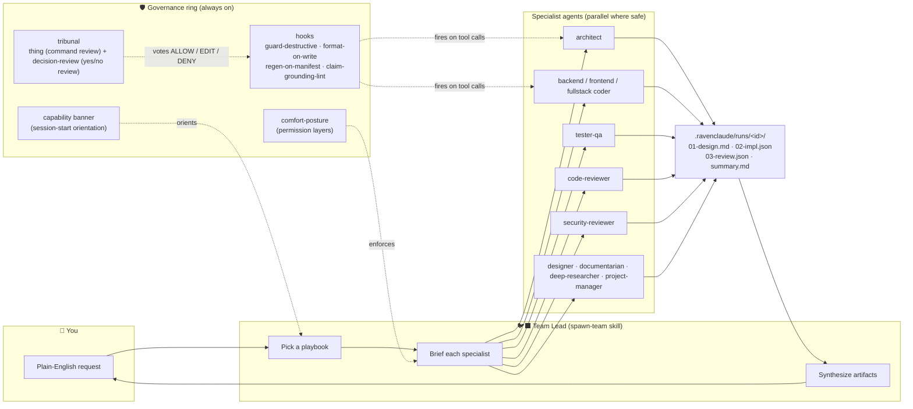

# 🚀 GETTING_STARTED — RavenClaude in 10 minutes

> The canonical first-workflow walkthrough. Follow it top-to-bottom; you'll go from "I just installed this" to "I've completed one governed multi-agent dispatch" in 10–15 minutes.

---

## Who this is for

You're using **[Claude Code](https://code.claude.com/)** and you want a small, opinionated team of specialist agents — Team Lead, architect, coders, reviewers, security-reviewer, designer, documentarian, project manager — that travels with you across projects. You also want their governance (permissions, command review, tribunal verdicts, audit log) to be **visible and click-editable**, not hand-tuned YAML.

This guide is written for a maker, not a developer. If you've never seen a `.yaml` file before, you'll still be fine — you'll spend most of your time in the dashboard.

**Prerequisites**

- Claude Code installed and signed in.
- Any project — even an empty folder — that you want the agents to assist with.
- Optional but useful: a GitHub account if you want PR-creation skills to work end-to-end.

---

## Which path are you on?

RavenClaude installs into either host. The 10-minute path is the same shape — install → dashboard → init → dispatch → wrap — but step 1 differs by host.

| If you use… | Step 1 below is… | Slash commands? |
|---|---|---|
| **Claude Code** (`claude`) | Path A — `/plugin marketplace add` + `/plugin install` | Yes — `/dashboard`, `/init-agent-ready`, `/wrap`, etc. |
| **GitHub Copilot CLI** (`copilot`) | Path B — `bash ~/RavenClaude/scripts/ravenclaude setup` | No — use the shell equivalents shown inline below |

The rest of the guide flags any step where the two paths diverge.

## The 10-minute path

### 1 · Install the marketplace and the core plugin (≈90 sec)

**Path A — Claude Code.** In any Claude Code project:

```shell
/plugin marketplace add mcorbett51090/RavenClaude
/plugin install ravenclaude-core@ravenclaude
/reload-plugins
```

That's three commands. After `/reload-plugins`, the `ravenclaude-core` agents, skills, hooks, and slash commands are loaded. **`/reload-plugins` is the non-obvious step** — without it, the install hasn't taken effect.

If you also want Power Platform specialists:

```shell
/plugin install power-platform@ravenclaude
/reload-plugins
```

**Path B — Copilot CLI.** From any project:

```shell
# Clone the marketplace once (~/RavenClaude is the convention; override with RAVENCLAUDE_DIR).
git clone https://github.com/mcorbett51090/RavenClaude.git ~/RavenClaude

# Wire THIS repo (skills + hooks + MCP + balanced posture + rc alias). Idempotent.
bash ~/RavenClaude/scripts/ravenclaude setup --project .

# Load the new rc alias in your current shell, then launch:
source ~/.bashrc
rc        # in a NEW terminal — or `bash -i -c rc` from a non-interactive shell
```

To add Power Platform:

```shell
bash ~/RavenClaude/scripts/ravenclaude setup --project . --with-plugin power-platform
```

For a brand-new repo where you'd rather type **nothing**, run `bash ~/RavenClaude/scripts/ravenclaude init-codespace --project .`, commit the resulting `.devcontainer/` files, and rebuild the Codespace — the post-create script does the rest (installs Node 22+, git-lfs, Copilot CLI, runs `setup`, auto-launches the dashboard on the forwarded port).

### 2 · Open the dashboard (≈30 sec)

**Path A — Claude Code:** `/dashboard`

**Path B — Copilot CLI:** the dashboard auto-launches on every Codespace start at the forwarded port 8000 (Ports panel → "RavenClaude dashboard" → Open in Browser). To launch it now without restarting: `bash .ravenclaude/dashboard.sh` or `ravenclaude dashboard`.

Either way you land in the local **comfort-posture dashboard** in your browser — the point-and-click editor for permissions, command review, web access, and a few other knobs. Every setting you'll touch lives here; you should not need to hand-edit YAML.

> 📖 The dashboard is also published read-only at <https://mcorbett51090.github.io/RavenClaude/plugins/ravenclaude-core/dashboard.html> if you want to browse it before you install. **Save & apply does nothing on the published version** — it's a static preview with no server. Use the local one above to actually change posture.

### 3 · Choose a posture (≈2 min)

The dashboard ships with **balanced** as the recommended seed. It allows local development (reads, file edits, shell, local installs) and prompts before anything that leaves your project (remote git, network writes, edits outside the project). A small set of hard security floors — `rm -rf`, `git push --force`, `curl | sh`, secret reads — are **always denied** and cannot be edited away.

Two important defaults in the balanced seed (as of v0.101.0):

- **`shell_package_install: ask`** — `npm install` / `pip install` will prompt the first time. This is a deliberate friction against malicious dependencies. Flip to `allow` from the dashboard if you'd rather not see the prompt.
- **`shell_code_exec: allow`** — running scripts in your project is unrestricted. If you're working on partner-confidential code, consider flipping this to `ask` from the dashboard.

Click **Save & apply**. Your `.ravenclaude/comfort-posture.yaml` and `.claude/settings.json` are written for you.

### 4 · Seed the project's agent boundaries (≈1 min)

**Path A — Claude Code:** `/init-agent-ready`

**Path B — Copilot CLI:** in your Copilot session, ask "use the init-agent-ready skill" (the skill is already wired into `.claude/skills` by `ravenclaude setup`).

Either way this creates `AGENTS.md`, `CLAUDE.md`, `.repo-layout.json`, and an optional CI workflow tailored to your repo type (application / library / monorepo / docs / data / IaC). It's idempotent — safe to re-run later.

### 5 · Run your first governed dispatch (≈4 min)

Type a request in plain English. The Team Lead picks a specialist team automatically. Try:

> "Add a short CONTRIBUTING-style page explaining how someone outside the team should propose a change. Keep it under one screen."

Behind the scenes, the Team Lead:

1. Picks the **document** playbook (`/spawn-team`).
2. Dispatches `documentarian` to draft the doc and `code-reviewer` to sanity-check the prose.
3. Each agent writes its deliverable into `.ravenclaude/runs/<run-id>/` as a structured artifact (`01-design.md`, `02-impl.json`, `03-review.json`, `summary.md`).
4. Reads the artifacts and synthesizes a final response back to you.

When you've reviewed and accepted the diff:

**Path A — Claude Code:** `/wrap`

**Path B — Copilot CLI:** ask "use the wrap skill" in your Copilot session.

Either way captures what was done in `MEMORY.md` so the next session opens with the work already remembered.

**You're done.** That's the 10-minute path.

---

## How it actually fits together

Most of the magic is **one orchestrator (the Team Lead) + a fixed roster of specialists + three governance layers**.



The three governance layers exist because LLMs occasionally surprise their users. **comfort-posture** is policy-as-config; **hooks** enforce it at every tool call; the **tribunal** convenes a fast multi-seat panel for borderline calls so you don't have to be the bottleneck. All three are visible — and editable — from the dashboard.

For deeper diagrams of each layer (don't worry about these yet — they're for when you want to go deep):

- [`docs/concepts.md`](docs/concepts.md) §Permission layers + §Permission modes + §Comfort-posture dashboard + §Command-review tribunal — canonical diagrams for the governance ring.
- [`docs/architecture.md`](docs/architecture.md) — how the marketplace distributes plugins to consumers.

---

## Worked Example A — Add a small docs page with full governance

**Scenario.** You want a short, partner-friendly page explaining your team's PR process. You don't want to write the prose; you want the team to write it, review it, and hand it back.

**What you type.**

> Add a docs/PR_PROCESS.md page explaining (1) the branch-naming rule we use, (2) what goes in the PR body, (3) who approves. Keep it under one screen. Match the project's existing tone.

**What happens.**

| Step | Actor | Output |
|---|---|---|
| 1 | Team Lead (`/spawn-team`) | Picks the **document** playbook — `deep-researcher` → `documentarian` → `code-reviewer` (`spawn-team/SKILL.md:30-50`) |
| 2 | `deep-researcher` | Reads `AGENTS.md`, `CLAUDE.md`, existing `docs/`, and recent PRs to capture the actual conventions. Writes `01-research.md` into `.ravenclaude/runs/<run-id>/`. |
| 3 | `documentarian` | Drafts `docs/PR_PROCESS.md` from the research brief. Writes `02-draft.md`. |
| 4 | `code-reviewer` | Reads the draft + the existing tone reference. Suggests 3 prose edits + 1 link to fix. Writes `03-review.json` (structured findings). |
| 5 | Team Lead | Applies the high-confidence review suggestions, writes `summary.md`, and returns the final diff. |
| 6 | You | Accept or reject the diff. If accepted, run `/wrap` to capture the outcome. |

**What you'll see in `.ravenclaude/runs/<run-id>/`** when it's done:

```
runs/2026-06-01-pr-process-doc/
  01-research.md      ← what conventions exist in this repo
  02-draft.md         ← the documentarian's first cut
  03-review.json      ← code-reviewer's structured findings
  summary.md          ← Team Lead's synthesis + final file paths
```

That folder **is** the audit trail. If you ever want to know "why did the agent phrase it that way," `01-research.md` will tell you.

---

## Worked Example B — Configure posture for a new Power Platform engagement

**Scenario.** You've just installed `power-platform` for a new client engagement. Their code is partner-confidential; you want the Team Lead to ask before `npm install`-class operations and before anything that reaches outside the project.

**What you do.**

1. `/plugin install power-platform@ravenclaude` + `/reload-plugins`.
2. `/dashboard` — the **Set up** tab.
3. Confirm the **balanced** posture is selected. The default already covers most of what you want:
   - Reads + local edits + shell exec: `allow`.
   - **`shell_package_install: ask`** — this is the new default (v0.101.0). You'll see one prompt per `npm install` or `pip install`. Acceptable friction; it's your guardrail against malicious dependencies.
   - Remote git + network writes + edits outside the project: `ask`.
   - The hard security floor — `rm -rf`, force-push, `curl | sh`, secret reads — `deny`.
4. **(Optional, for partner-confidential work)** Flip `shell_code_exec` from `allow` to `ask`. You'll see one prompt per script execution; trade-off is friction vs. depth of review on every script the agent runs.
5. **(Optional, recommended for new engagements)** Open the **Command review** card and toggle `thing: on` for `network_write` and `package_install`. The tribunal (Forseti + Mímir + Heimdall + Thor) will vote ALLOW / EDIT / DENY on every shell command in those categories, in parallel, with full reasoning logged to `.ravenclaude/runs/thing/`.
6. Click **Save & apply**. Done. `.ravenclaude/comfort-posture.yaml` is written and `.claude/settings.json` is updated.

**What you'll see when the agent runs `npm install`.** Claude Code prompts you once. The first time, click **Allow once** — the prompt is what `ask` does. The tribunal verdict appears alongside if you toggled `thing: on`.

**Tip.** The dashboard shows recent prompts and tribunal verdicts in the **Look back** tab. If a prompt felt too frequent, flip the category back to `allow` from there. The whole loop is 4 clicks.

---

## How to run evals (light-touch)

The `evals/` directory ships a tiny harness for scoring real runs against a rubric:

```shell
# Score one run against one case
python3 evals/runner.py --run-id <id> --case evals/cases/ravenclaude-core/governance-dispatch.yaml

# Score every recent run against every case in a domain
python3 evals/runner.py --recent --domain ravenclaude-core
```

Output lands in `evals/results/<date>.json` (gitignored — never check in real-run artifacts). See [`docs/evaluation.md`](docs/evaluation.md) for the full rubric, the four scored dimensions (handoff quality, gate adherence, escalation discipline, token cost), and how to add a case.

---

## How to use RavenClaude to improve RavenClaude

The marketplace is built with itself. When you find a workflow gap — a missing skill, a noisy hook, a stale knowledge file — you can dispatch the same team that helps with your work to propose, build, review, and merge the improvement.

The pattern is documented end-to-end in [`docs/best-practices/self-referential-improvement.md`](docs/best-practices/self-referential-improvement.md), with one worked example (adding an agent for an unsupported domain).

---

## Where to go next

| If you want to… | Go to |
|---|---|
| Understand the permission layers | [`docs/concepts.md`](docs/concepts.md) §Permission layers |
| See what's in each plugin | [`README.md`](README.md) §What's in each plugin, or the portal ([`index.html`](index.html)) → **Marketplace** |
| Edit posture without the dashboard | [`docs/concepts.md`](docs/concepts.md) §Comfort-posture dashboard |
| Tune the tribunal | The dashboard's **Command review** tab, or [`plugins/ravenclaude-core/skills/thing/SKILL.md`](plugins/ravenclaude-core/skills/thing/SKILL.md) |
| Reset a broken plugin cache | `/ravenclaude-core:ragnarok` (`/reset-plugin-cache`) — read the [command doc](plugins/ravenclaude-core/commands/reset-plugin-cache.md) first |
| Report a security issue | [`SECURITY.md`](SECURITY.md) |
| Cut a release | [`checklists/release-checklist.md`](checklists/release-checklist.md) |
| Improve diagrams in docs you write | [`docs/best-practices/diagrams-in-docs.md`](docs/best-practices/diagrams-in-docs.md) |
| Score a multi-agent run | [`docs/evaluation.md`](docs/evaluation.md) |
| Strategy / packaging direction | [`STRATEGY.md`](STRATEGY.md) — currently a stub; content pending |

---

## When something doesn't work

| Symptom | Most likely cause | First thing to try |
|---|---|---|
| Slash commands missing after install | You skipped `/reload-plugins` | Run it. |
| `/dashboard` opens but **Save & apply** does nothing | The dashboard server isn't running — you're on the published HTML preview, not the local server | `bash scripts/open-dashboard.sh` from your project root |
| Hook is silently inert | The plugin cache is out of date | `/plugin marketplace update ravenclaude` + `/reload-plugins` |
| You see an "I can't" or "tool not found" response | Often a deferred MCP tool whose schema hasn't loaded | Ask Claude to retry — it's expected to use ToolSearch first |
| Things feel broken in a confusing way | Cache integrity | `/ravenclaude-core:ragnarok --dry-run` then `--execute` if dry-run looks right |

---

That's the loop. Install → posture → init → dispatch → wrap. Everything else is depth — the dashboard, the knowledge files, the tribunal — and you only reach for it when a real engagement asks for it.
