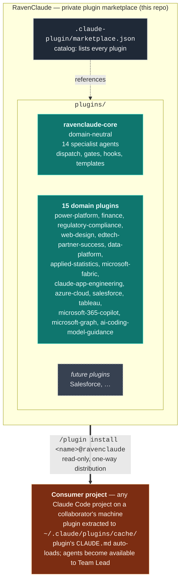

# RavenClaude — Architecture

This repo is a **private Claude Code plugin marketplace**. Each plugin inside it bundles a set of agents, skills, hooks, rules, and templates that a consumer project can install through Claude Code's native `/plugin marketplace add` mechanism. The repo itself isn't loaded into consumer projects — only individual plugins are.

> **Audience for this doc:** anyone working *on* the marketplace (adding a plugin, changing a plugin, reviewing a PR). For instructions on *installing* the plugins as a consumer, see the root [`README.md`](../README.md). For team rules that ship inside `ravenclaude-core`, see [`plugins/ravenclaude-core/CLAUDE.md`](../plugins/ravenclaude-core/CLAUDE.md).

---

## The marketplace model



**One-way distribution.** A consumer's `marketplace update` pulls the latest version from this repo into their local cache. The consumer cannot push back — their changes stay on their machine. The feedback path (lessons, fixes, new patterns) is the PR flow documented in [`CONTRIBUTING.md`](../CONTRIBUTING.md).

---

## Why plugins, not Expert repos

An earlier iteration of this project planned a "central hub + sibling Expert repos" pattern (RavenClaude as the hub, with separate `PowerPlatformExpert`, `SalesforceExpert` repos cloned alongside consumer projects). That model has been replaced by Claude Code's native plugin marketplace, which gives us the same separation with three concrete advantages:

| | Old "sibling Expert repos" model | Plugin marketplace model (current) |
|---|---|---|
| **Distribution** | Each consumer project's devcontainer clones each repo to a known sibling path | `/plugin install <name>@ravenclaude` — one command per plugin |
| **Updates** | Manual `git pull` in each cloned sibling | `/plugin marketplace update ravenclaude` updates all plugins at once |
| **Discovery** | Consumer has to know which Experts to clone | Claude Code surfaces all available plugins in `/plugin` |
| **Activation** | Consumer's `CLAUDE.md` has to opt in by referencing paths | Plugin's own `CLAUDE.md` auto-loads when active |
| **Versioning** | Implicit via git SHA | Explicit `version` field in each `plugin.json`; consumers can pin |

Domain separation is still a first-class concern — it just lives in *separate plugins inside this repo* rather than separate repos. The rule from the old architecture ("Power Platform specifics don't pollute domain-neutral patterns") still holds; it's now enforced by `plugins/ravenclaude-core/` vs. `plugins/power-platform/` rather than by `RavenClaude/` vs. `PowerPlatformExpert/`.

---

## What goes where

The marketplace contains a domain-neutral core plus one plugin per significant domain. Anything domain-specific lives in its own plugin, never in `ravenclaude-core`.

| Lives in `plugins/ravenclaude-core/` | Lives in a domain plugin (e.g. `plugins/power-platform/`) |
|---|---|
| Generic agent role definitions (architect, coder, tester, reviewer, designer, documentarian, project-manager, prompt-engineer, deep-researcher, partner-success-manager, etc.) | Domain-specific agent definitions (`power-fx-engineer`, `flow-engineer`, `dataverse-architect`, `fabric-architect`, `claude-solution-architect`, `azure-architect`, `tableau-viz-engineer`, `graph-api-engineer`, … across the 15 domain plugins) |
| Cross-domain skills (dispatch playbook, worktree helpers, generic code-review patterns) | Domain-specific skills (Power Platform's `dataverse-web-api`, `pcf-controls`, `power-apps-code-apps`, etc.) |
| Cross-domain hooks (format-on-write, guard-destructive, remind-tests) | Domain-specific hooks (only if a hook is meaningless outside that domain) |
| Generic rules (coding standards, security baseline, git workflow, agent collaboration) | Domain-specific rules (Power Platform's "solutions, always" and "managed in test+prod" opinions) |
| Generic templates (memos, runbooks, design specs, RAID logs, partner-success artifacts) | Domain-specific templates (a Dataverse data model spec, a flow run-history triage template, etc.) |

**Rule of thumb:** if it would be relevant to a Salesforce engagement AND a Power Platform engagement AND an iOS app project, it belongs in `ravenclaude-core`. If it only matters for one of them, it belongs in that one's plugin.

---

## Folder layout

```
RavenClaude/
├── .claude-plugin/
│   └── marketplace.json           ← catalog: lists every plugin in this marketplace
│
├── plugins/
│   ├── ravenclaude-core/
│   │   ├── .claude-plugin/plugin.json   ← manifest (name, version, author)
│   │   ├── CLAUDE.md                    ← team constitution that auto-loads
│   │   ├── agents/                      ← 14 specialist agent files
│   │   ├── skills/                      ← dispatch playbook, worktree helpers, etc.
│   │   ├── hooks/                       ← format-on-write, guard-destructive, remind-tests
│   │   ├── rules/                       ← coding-standards, security, git-workflow, agent-collab
│   │   └── templates/                   ← memos, runbooks, RAID logs, partner-success artifacts
│   │
│   └── power-platform/
│       ├── .claude-plugin/plugin.json   ← also declares bundled pbix-mcp MCP server
│       ├── CLAUDE.md
│       ├── NOTICE.md                    ← MIT attribution for imported skills + pbix-mcp
│       ├── agents/                      ← 11 specialist agent files
│       ├── hooks/                       ← check-house-opinions (advisory)
│       └── skills/                      ← 13 skills (9 imported Daniel Kerridge MIT + 4 in-house)
│
├── .claude/                       ← config for working ON this repo itself (NOT shipped)
│   └── settings.json              ← permissions + hooks for marketplace dev
│
├── .github/
│   └── pull_request_template.md   ← auto-loaded PR form for all contributions
│
├── docs/                          ← meta-repo docs (not shipped to consumers)
│   ├── architecture.md            ← this file
│   ├── access.md                  ← collaborator record
│   ├── best-practices/            ← cross-domain rules (with _TEMPLATE.md)
│   └── memory-bank/
│       ├── lessons-learned.md     ← reverse-chronological trial-and-error log
│       └── decision-log.md        ← reverse-chronological architectural decisions
│
├── CLAUDE.md                      ← working-on-the-marketplace constitution
├── CONTRIBUTING.md                ← how collaborators propose changes
└── README.md                      ← install instructions for consumers
```

Key boundary: **the `docs/` tree, `.claude/`, `.github/`, `CLAUDE.md`, `CONTRIBUTING.md`, and `README.md` at the repo root are NOT shipped to consumers.** They're meta-repo content — only the contents of `plugins/<plugin-name>/` are extracted when a consumer installs a plugin.

---

## How a consumer uses the marketplace

```bash
# In any Claude Code project on a collaborator's machine:
/plugin marketplace add mcorbett51090/RavenClaude
/plugin install ravenclaude-core@ravenclaude
/plugin install power-platform@ravenclaude     # if they need it
/reload-plugins
```

After install, each plugin's `CLAUDE.md` auto-loads into the consumer's Claude Code session. Agents defined under `plugins/<name>/agents/` become available to the Team Lead for dispatch. Skills under `plugins/<name>/skills/` are consulted on demand. Hooks, rules, and templates apply per the plugin's own configuration.

To pick up new versions:

```bash
/plugin marketplace update ravenclaude
/reload-plugins
```

The repo is private — see [`docs/access.md`](access.md) for the current collaborator list and the access-model rationale.

---

## How knowledge is captured

The marketplace has three layers of "memory," each with a different purpose and a different write path:

| Layer | Where it lives | Who writes to it | What goes here |
|---|---|---|---|
| **Consumer's auto-memory** | `~/.claude/projects/<project>/memory/` on the consumer's machine | The consumer's Claude session | Session-local context: user preferences, current task state, project facts. Private to that consumer. |
| **Plugin lessons** (cross-domain) | `docs/memory-bank/lessons-learned.md` (this repo) | Collaborators via PR | Cross-domain trial-and-error findings — *applies to any Claude work*. Reverse-chronological, newest first. |
| **Plugin best-practices** (cross-domain) | `docs/best-practices/<slug>.md` (this repo) | Collaborators via PR | Cross-domain rules with rationale + how-to-apply + provenance. One file per rule. Use [`_TEMPLATE.md`](best-practices/_TEMPLATE.md). |

**Domain-specific lessons** (e.g. a Power Platform-specific Dataverse rule) belong inside the relevant plugin's folder — for example, `plugins/power-platform/skills/<domain-skill>/resources/<rule>.md` — not in this repo's domain-neutral `docs/`.

**Flow when Claude (in any consumer project) discovers something non-obvious:**

1. Save in that project's auto-memory immediately so the current session benefits.
2. Decide where it generalizes:
   - **Specific to one domain** → goes inside that domain's plugin via a PR to this repo (`plugins/<plugin>/...`), and the relevant plugin's version is bumped.
   - **Applies across domains** → goes here, in `docs/memory-bank/lessons-learned.md` or `docs/best-practices/`, via a PR.
   - **Both** → write the cross-domain rule here, write the domain-specific deep-dive in the plugin, cross-link them.
3. Cite the propagation explicitly in the response so the user can verify the trail.

The PR flow itself is in [`CONTRIBUTING.md`](../CONTRIBUTING.md).

---

## Adding a new plugin

When a new domain matures past the point where it deserves its own plugin (Salesforce, finance, EdTech, etc.):

1. Create `plugins/<plugin-name>/.claude-plugin/plugin.json` with `name`, `description`, `version`, `author`, optional `license` and `keywords`.
2. Add `agents/`, `skills/`, `hooks/`, `rules/`, `templates/` subdirectories — only the ones the plugin actually needs.
3. Add `plugins/<plugin-name>/CLAUDE.md` as the team constitution that ships with the plugin.
4. Append the new plugin to the `plugins[]` array in `.claude-plugin/marketplace.json`.
5. If the plugin imports third-party content, add `plugins/<plugin-name>/NOTICE.md` with the license + attribution (see `plugins/power-platform/NOTICE.md` for the canonical form).
6. Open a PR following the **Marketplace / meta change** section of the PR template.
7. After merge, test the install from a separate Claude Code project: `/plugin marketplace update ravenclaude` then `/plugin install <plugin-name>@ravenclaude`.

The existing plugins are the reference implementations — `ravenclaude-core` for a "team patterns" plugin, `power-platform` for a "domain specialist team plus imported skills" plugin.

---

## Status

**Active plugins (21).** The table below is the canonical roster; **per-plugin versions live in [`../.claude-plugin/marketplace.json`](../.claude-plugin/marketplace.json)** (the single source of truth, CI-gated for catalog↔plugin.json parity) and the generated [`../repo-guide.html`](../repo-guide.html) — they are deliberately not duplicated here to avoid drift. A CI check (`scripts/check-marketplace-claims.py`) asserts every `plugins/*/` directory appears in this table.

| Plugin | What it is |
|---|---|
| [`ravenclaude-core`](../plugins/ravenclaude-core/) | Domain-neutral foundation: 14 specialist agents, 22 skills, the dispatch playbook, 13 hooks, rules, templates; the Capability Grounding Protocol, Structured Output Protocol, the Researcher meta-skill, the comfort-posture dashboard, and the command-review + decision-review tribunal (the Thing). |
| [`power-platform`](../plugins/power-platform/) | Microsoft Power Platform: 11 specialist agents, 18 skills, an 8-check house-opinion hook, a knowledge bank (PA-flow recovery, Dataverse token acquisition, PCF React/Fluent, Copilot agents 2026, managed environments, Power Pages 2026), and the bundled pbix-mcp server. |
| [`finance`](../plugins/finance/) | Corporate finance & FP&A: 7 specialist agents, 9 skills, 8 templates, 1 advisory anti-pattern hook, 1 knowledge doc. Inherits `ravenclaude-core` protocols. |
| [`regulatory-compliance`](../plugins/regulatory-compliance/) | Financial-regulatory: 6 specialist agents, 9 skills, 8 templates, 1 defensive PII-scrub hook, 1 knowledge doc. BMA field-experience positioning. |
| [`web-design`](../plugins/web-design/) | Web design & build: 7 specialist agents, 10 skills (incl. Fluent UI v9 + React implementation), 8 templates, 1 advisory hook, a 7-doc knowledge bank (2026 stacks/CSS/web-platform/AEO-GEO/design-systems/Fluent). |
| [`edtech-partner-success`](../plugins/edtech-partner-success/) | EdTech Partner Success Manager team: 6 specialist agents, 12 skills, 16-doc knowledge bank, 15 templates, 1 advisory PSM-anti-pattern hook. Segment-agnostic (K-12 / higher-ed / corp L&D). |
| [`data-platform`](../plugins/data-platform/) | Non-Microsoft / SMB embedded-analytics: 4 specialist agents, 12 skills (incl. cross-system-identity-resolution), 12 templates, 1 advisory hook, 17-doc knowledge bank (Supabase/Neon/RDS, Airbyte/Fivetran, Evidence/Superset/Metabase/Cube, + Planhat/Intercom/Slack-as-source & Sigma-when-already-owned), 21 best-practices. Opinionated against per-viewer-priced BI; reciprocal seam with `microsoft-fabric`. |
| [`customer-success-analytics`](../plugins/customer-success-analytics/) | Domain-neutral CS-health analytics layer ON TOP of data-platform: 2 specialist agents (cs-analytics-architect, churn-signal-analyst), 2 skills (health-tier-design, renewal-workflow-design), 2-doc knowledge bank, cs-health-data-model template. Owns the metrics/signals/transparent-risk-tier layer (what to measure & why); routes pipeline/warehouse/identity-resolution to data-platform. Seams: salesforce / tableau / edtech-partner-success. |
| [`applied-statistics`](../plugins/applied-statistics/) | "Is this difference/trend REAL?" — 1 specialist (applied-statistician), 5 skills, 5-doc knowledge bank, 4 templates, 1 advisory hook. Seams with data-platform ("is it correct?" vs "is it real?"). |
| [`process-improvement`](../plugins/process-improvement/) | Lean Six Sigma Black-Belt capability: 2 agents (lean-six-sigma-blackbelt, process-analyst), 6 skills (DMAIC charter / process-mapping / root-cause / capability-&-SPC / lean-waste / control-plan), 5 templates, 7 best-practices, 3-doc knowledge bank with 6 web-verified Mermaid decision trees. Analyzes & improves any operational process (DMAIC, waste removal, SPC, control plans). Load-bearing seam to `applied-statistics` for inferential stats (hypothesis tests/DOE/Gage R&R); DMAIC delivery seams to `project-management`. |
| [`auth-identity`](../plugins/auth-identity/) | End-user authentication & identity: 2 agents (auth-architect, auth-implementation-engineer), 7 skills, 4 templates, 5 best-practices, 4-doc web-verified knowledge bank with 5 Mermaid decision trees. A variety of login methods (Google/Apple/Microsoft/GitHub SSO + magic-link/passkeys/email-password) via managed auth (Supabase-Auth lean) for a web app / API / dashboard. Load-bearing boundary: AUTHENTICATES the person; `data-platform` AUTHORIZES the data (RLS/embed-JWT). Seams: `azure-cloud` (Entra), `web-design` (login UI), `ravenclaude-core/security-reviewer` (mandatory auth-code review). |
| [`microsoft-fabric`](../plugins/microsoft-fabric/) | Microsoft Fabric: 7 agents (architect / lakehouse / warehouse / data-factory / realtime-intelligence / semantic-model / admin), 9-doc citation-grounded knowledge bank (two Mermaid decision trees + a dated 2026 capability map), 6 templates, 1 advisory hook. Reciprocal seams with `data-platform`, `power-platform/power-bi-engineer`, `azure-cloud`. |
| [`claude-app-engineering`](../plugins/claude-app-engineering/) | Building apps on the Claude API + Agent SDK + MCP: 6 agents, 13-doc knowledge bank (build-surface / caching / tools / MCP / Agent SDK / evals / RAG / prompt-engineering / orchestration / context-engineering / FinOps), 6 templates, 1 advisory hook. Ships no security/architect clone — escalates to core. |
| [`azure-cloud`](../plugins/azure-cloud/) | Azure infrastructure & platform: 7 agents (architect / bicep-iac / entra-identity / network / app-platform / integration / ops), 10-doc knowledge bank (CAF landing zones, IaC, compute + integration decision trees, Entra, networking, observability/FinOps, AI Foundry, dated 2026 capability map), 6 templates, 1 advisory hook. Reciprocal seams across power-platform / fabric / claude-app-engineering / web-design. |
| [`salesforce`](../plugins/salesforce/) | Salesforce platform: 5 agents (apex-engineer / flow-automation-architect / agentforce-architect / salesforce-platform-architect / salesforce-reviewer), 9-doc citation-grounded knowledge bank (9 Mermaid decision trees: governor limits, automation density, trigger framework, async, sharing/security, LDV, packaging/DevOps, integration, Agentforce determinism), 5 skills, 5 templates, 1 advisory hook (15 house opinions). Forked review rubric; seams to azure-cloud / data-platform / web-design / core. |
| [`microsoft-365-copilot`](../plugins/microsoft-365-copilot/) | M365 Copilot extensibility & administration: 6 agents (copilot-extensibility-architect / declarative-agent-engineer / graph-connector-engineer / api-plugin-engineer / agents-sdk-engineer / copilot-admin-governance), 9-doc citation-grounded knowledge bank (two Mermaid decision trees: agent-platform routing + grounding-source), 5 skills, 5 templates, 1 advisory hook (15 house opinions). Disjoint from power-platform's Copilot Studio coverage; seams to power-platform / claude-app-engineering / azure-cloud / core. |
| [`tableau`](../plugins/tableau/) | Tableau analytics: 3 agents (tableau-viz-engineer / tableau-data-architect / tableau-admin) covering VizQL & calculations (LOD/table-calcs), data modeling (relationships vs joins vs blends, extracts vs live), workbook performance, Tableau Prep, Server/Cloud governance & RLS, content ALM, embedding (Connected Apps/JWT), and the Pulse/Tableau-Next surface. 26-rule best-practices library + 3 decision-tree knowledge files (15 Mermaid trees, dated 2026-05-30). Seams: salesforce (source data/CRM Analytics) / data-platform / microsoft-fabric / power-platform-power-bi (comparison) / core (RLS+embedding-auth review). |
| [`microsoft-graph`](../plugins/microsoft-graph/) | Microsoft Graph developer surface: 3 agents (graph-api-engineer / graph-identity-engineer / graph-workloads-engineer) covering OData query/paging/`$batch`/delta + throttling, Entra app-registration & delegated-vs-application permissions/consent/auth-flows/least-privilege, and workloads (mail/calendar, Teams, files, users/groups, change-notification subscriptions). 18-rule best-practices library + 3 decision-tree knowledge files (13 Mermaid trees, dated 2026-05-30). Cross-links rather than duplicates: Copilot connectors → microsoft-365-copilot, tenant identity → azure-cloud; security/permission verdicts → core. |
| [`ai-coding-model-guidance`](../plugins/ai-coding-model-guidance/) | Non-Claude AI-coding-tool model selection: 3 agents (copilot-model-strategist / codex-model-strategist / grok-model-strategist) over one dated, citation-grounded lineup (`knowledge/cross-tool-model-lineup-2026.md`) covering GitHub Copilot's picker (completions/chat/coding-agent/cloud-agent/mobile + org model rules), OpenAI Codex (CLI/cloud model + reasoning level), and xAI Grok (Grok 4.x + the grok-code-fast-1 retirement). Vendor-neutral decision tree + right-sizing + closed-world anti-hallucination rule; `check-lineup-citations.py` gates the volatile numbers. Seams to claude-app-engineering for Claude models. |
| [`project-management`](../plugins/project-management/) | Project & delivery management: 4 agents (delivery-lead / scrum-master / risk-and-raid-analyst / stakeholder-comms-lead) across the predictive (PMBOK/PMP) and agile (Scrum/Kanban) tracks plus hybrid — baselines + earned value, sprint facilitation, scored qual+quant risk registers, stakeholder/PMO governance. A predictive-vs-agile-vs-hybrid decision tree + a 3-rule best-practices library. **Deepens — does not replace —** `ravenclaude-core/project-manager` (the lightweight RAID/status-hygiene default); the litmus test is hygiene → core, running the project → here (the house-rule carve-out). Seams: prose polish → core/documentarian; system design → core/architect; domain delivery specifics → the owning domain plugin. |
| [`team-portfolio`](../plugins/team-portfolio/) | Centralized multi-repo, multi-person activity & project tracking (agentless). A stdlib-only collector pulls commits/PRs/issues across many GitHub repos from the API → normalized `portfolio-activity.json`; renderers emit markdown roll-ups (weekly tracker / activity feed / per-project status) + a self-contained HTML dashboard; a scheduled GitHub Action + `/portfolio-refresh` keep it current. The cross-repo replacement for a single-repo activity log, with a supervisor's manage-the-team view. 2 skills (portfolio-setup, cross-repo-project-tracking). **Observes** activity across projects — distinct from `project-management` (runs a project) and `ravenclaude-core/project-manager` (single-effort RAID/status hygiene). Secrets stay in env/secrets. |

The Microsoft/AI-stack plugins (`microsoft-fabric`, `claude-app-engineering`, `azure-cloud`), `salesforce`, and `microsoft-365-copilot` were built from researched, expert-reviewed plans under [`docs/`](.) (`*-plugin-analysis.md`).

**Memory bank:** see [`memory-bank/lessons-learned.md`](memory-bank/lessons-learned.md).

**Decision log:** see [`memory-bank/decision-log.md`](memory-bank/decision-log.md).

**Planned plugins** (on the roadmap): none outstanding — the full roster above has shipped. `finance`, `regulatory-compliance`, `web-design`, `edtech-partner-success`, `data-platform`, `applied-statistics`, `microsoft-fabric`, `claude-app-engineering`, `azure-cloud`, `salesforce`, `tableau`, `microsoft-365-copilot`, `microsoft-graph`, and `ai-coding-model-guidance` were all once roadmap items and have since shipped (see [`./plugin-roadmap-analysis.md`](./plugin-roadmap-analysis.md) for the historical analysis).
