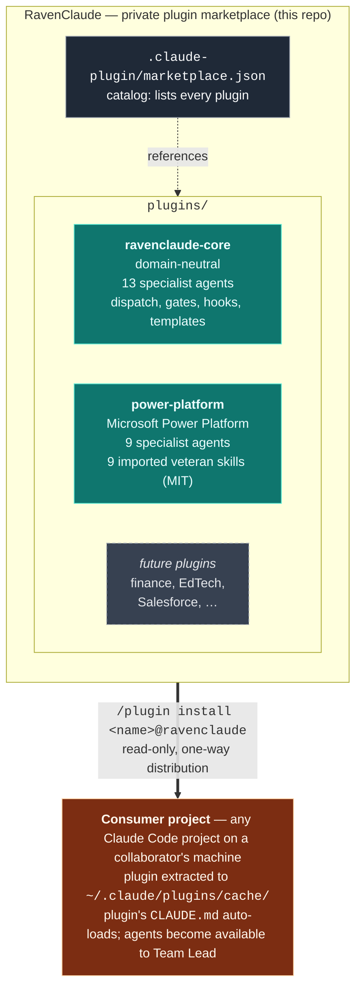

# RavenClaude — Architecture

This repo is a **private Claude Code plugin marketplace**. Each plugin inside it bundles a set of agents, skills, hooks, rules, and templates that a consumer project can install through Claude Code's native `/plugin marketplace add` mechanism. The repo itself isn't loaded into consumer projects — only individual plugins are.

> **Audience for this doc:** anyone working *on* the marketplace (adding a plugin, changing a plugin, reviewing a PR). For instructions on *installing* the plugins as a consumer, see the root [`README.md`](../README.md). For team rules that ship inside `ravenclaude-core`, see [`plugins/ravenclaude-core/CLAUDE.md`](../plugins/ravenclaude-core/CLAUDE.md).

---

## The marketplace model



**One-way distribution.** A consumer's `marketplace update` pulls the latest version from this repo into their local cache. The consumer cannot push back — their changes stay on their machine. The feedback path (lessons, fixes, new patterns) is the PR flow documented in [`CONTRIBUTING.md`](../CONTRIBUTING.md).

---

## Why plugins, not Expert repos

An earlier iteration of this project planned a "central hub + sibling Expert repos" pattern (RavenClaude as the hub, with separate `PowerPlatformExpert`, `SalesforceExpert` repos cloned alongside consumer projects). That model has been replaced by Claude Code's native plugin marketplace, which gives us the same separation with three concrete advantages:

| | Old "sibling Expert repos" model | Plugin marketplace model (current) |
|---|---|---|
| **Distribution** | Each consumer project's devcontainer clones each repo to a known sibling path | `/plugin install <name>@ravenclaude` — one command per plugin |
| **Updates** | Manual `git pull` in each cloned sibling | `/plugin marketplace update ravenclaude` updates all plugins at once |
| **Discovery** | Consumer has to know which Experts to clone | Claude Code surfaces all available plugins in `/plugin` |
| **Activation** | Consumer's `CLAUDE.md` has to opt in by referencing paths | Plugin's own `CLAUDE.md` auto-loads when active |
| **Versioning** | Implicit via git SHA | Explicit `version` field in each `plugin.json`; consumers can pin |

Domain separation is still a first-class concern — it just lives in *separate plugins inside this repo* rather than separate repos. The rule from the old architecture ("Power Platform specifics don't pollute domain-neutral patterns") still holds; it's now enforced by `plugins/ravenclaude-core/` vs. `plugins/power-platform/` rather than by `RavenClaude/` vs. `PowerPlatformExpert/`.

---

## What goes where

The marketplace contains a domain-neutral core plus one plugin per significant domain. Anything domain-specific lives in its own plugin, never in `ravenclaude-core`.

| Lives in `plugins/ravenclaude-core/` | Lives in a domain plugin (e.g. `plugins/power-platform/`) |
|---|---|
| Generic agent role definitions (architect, coder, tester, reviewer, designer, documentarian, project-manager, prompt-engineer, deep-researcher, partner-success-manager, etc.) | Domain-specific agent definitions (`power-fx-engineer`, `flow-engineer`, `dataverse-architect`, future Salesforce / finance / EdTech specialists) |
| Cross-domain skills (dispatch playbook, worktree helpers, generic code-review patterns) | Domain-specific skills (Power Platform's `dataverse-web-api`, `pcf-controls`, `power-apps-code-apps`, etc.) |
| Cross-domain hooks (format-on-write, guard-destructive, remind-tests) | Domain-specific hooks (only if a hook is meaningless outside that domain) |
| Generic rules (coding standards, security baseline, git workflow, agent collaboration) | Domain-specific rules (Power Platform's "solutions, always" and "managed in test+prod" opinions) |
| Generic templates (memos, runbooks, design specs, RAID logs, partner-success artifacts) | Domain-specific templates (a Dataverse data model spec, a flow run-history triage template, etc.) |

**Rule of thumb:** if it would be relevant to a Salesforce engagement AND a Power Platform engagement AND an iOS app project, it belongs in `ravenclaude-core`. If it only matters for one of them, it belongs in that one's plugin.

---

## Folder layout

```
RavenClaude/
├── .claude-plugin/
│   └── marketplace.json           ← catalog: lists every plugin in this marketplace
│
├── plugins/
│   ├── ravenclaude-core/
│   │   ├── .claude-plugin/plugin.json   ← manifest (name, version, author)
│   │   ├── CLAUDE.md                    ← team constitution that auto-loads
│   │   ├── agents/                      ← 13 specialist agent files
│   │   ├── skills/                      ← dispatch playbook, worktree helpers, etc.
│   │   ├── hooks/                       ← format-on-write, guard-destructive, remind-tests
│   │   ├── rules/                       ← coding-standards, security, git-workflow, agent-collab
│   │   └── templates/                   ← memos, runbooks, RAID logs, partner-success artifacts
│   │
│   └── power-platform/
│       ├── .claude-plugin/plugin.json
│       ├── CLAUDE.md
│       ├── NOTICE.md                    ← MIT attribution for imported skills
│       ├── agents/                      ← 9 specialist agent files
│       └── skills/                      ← 9 imported skills (Daniel Kerridge, MIT)
│
├── .claude/                       ← config for working ON this repo itself (NOT shipped)
│   └── settings.json              ← permissions + hooks for marketplace dev
│
├── .github/
│   └── pull_request_template.md   ← auto-loaded PR form for all contributions
│
├── docs/                          ← meta-repo docs (not shipped to consumers)
│   ├── architecture.md            ← this file
│   ├── access.md                  ← collaborator record
│   ├── best-practices/            ← cross-domain rules (with _TEMPLATE.md)
│   └── memory-bank/
│       ├── lessons-learned.md     ← reverse-chronological trial-and-error log
│       └── decision-log.md        ← reverse-chronological architectural decisions
│
├── CLAUDE.md                      ← working-on-the-marketplace constitution
├── CONTRIBUTING.md                ← how collaborators propose changes
└── README.md                      ← install instructions for consumers
```

Key boundary: **the `docs/` tree, `.claude/`, `.github/`, `CLAUDE.md`, `CONTRIBUTING.md`, and `README.md` at the repo root are NOT shipped to consumers.** They're meta-repo content — only the contents of `plugins/<plugin-name>/` are extracted when a consumer installs a plugin.

---

## How a consumer uses the marketplace

```bash
# In any Claude Code project on a collaborator's machine:
/plugin marketplace add mcorbett51090/RavenClaude
/plugin install ravenclaude-core@ravenclaude
/plugin install power-platform@ravenclaude     # if they need it
/reload-plugins
```

After install, each plugin's `CLAUDE.md` auto-loads into the consumer's Claude Code session. Agents defined under `plugins/<name>/agents/` become available to the Team Lead for dispatch. Skills under `plugins/<name>/skills/` are consulted on demand. Hooks, rules, and templates apply per the plugin's own configuration.

To pick up new versions:

```bash
/plugin marketplace update ravenclaude
/reload-plugins
```

The repo is private — see [`docs/access.md`](access.md) for the current collaborator list and the access-model rationale.

---

## How knowledge is captured

The marketplace has three layers of "memory," each with a different purpose and a different write path:

| Layer | Where it lives | Who writes to it | What goes here |
|---|---|---|---|
| **Consumer's auto-memory** | `~/.claude/projects/<project>/memory/` on the consumer's machine | The consumer's Claude session | Session-local context: user preferences, current task state, project facts. Private to that consumer. |
| **Plugin lessons** (cross-domain) | `docs/memory-bank/lessons-learned.md` (this repo) | Collaborators via PR | Cross-domain trial-and-error findings — *applies to any Claude work*. Reverse-chronological, newest first. |
| **Plugin best-practices** (cross-domain) | `docs/best-practices/<slug>.md` (this repo) | Collaborators via PR | Cross-domain rules with rationale + how-to-apply + provenance. One file per rule. Use [`_TEMPLATE.md`](best-practices/_TEMPLATE.md). |

**Domain-specific lessons** (e.g. a Power Platform-specific Dataverse rule) belong inside the relevant plugin's folder — for example, `plugins/power-platform/skills/<domain-skill>/resources/<rule>.md` — not in this repo's domain-neutral `docs/`.

**Flow when Claude (in any consumer project) discovers something non-obvious:**

1. Save in that project's auto-memory immediately so the current session benefits.
2. Decide where it generalizes:
   - **Specific to one domain** → goes inside that domain's plugin via a PR to this repo (`plugins/<plugin>/...`), and the relevant plugin's version is bumped.
   - **Applies across domains** → goes here, in `docs/memory-bank/lessons-learned.md` or `docs/best-practices/`, via a PR.
   - **Both** → write the cross-domain rule here, write the domain-specific deep-dive in the plugin, cross-link them.
3. Cite the propagation explicitly in the response so the user can verify the trail.

The PR flow itself is in [`CONTRIBUTING.md`](../CONTRIBUTING.md).

---

## Adding a new plugin

When a new domain matures past the point where it deserves its own plugin (Salesforce, finance, EdTech, etc.):

1. Create `plugins/<plugin-name>/.claude-plugin/plugin.json` with `name`, `description`, `version`, `author`, optional `license` and `keywords`.
2. Add `agents/`, `skills/`, `hooks/`, `rules/`, `templates/` subdirectories — only the ones the plugin actually needs.
3. Add `plugins/<plugin-name>/CLAUDE.md` as the team constitution that ships with the plugin.
4. Append the new plugin to the `plugins[]` array in `.claude-plugin/marketplace.json`.
5. If the plugin imports third-party content, add `plugins/<plugin-name>/NOTICE.md` with the license + attribution (see `plugins/power-platform/NOTICE.md` for the canonical form).
6. Open a PR following the **Marketplace / meta change** section of the PR template.
7. After merge, test the install from a separate Claude Code project: `/plugin marketplace update ravenclaude` then `/plugin install <plugin-name>@ravenclaude`.

The existing plugins are the reference implementations — `ravenclaude-core` for a "team patterns" plugin, `power-platform` for a "domain specialist team plus imported skills" plugin.

---

## Status

**Active plugins:**

| Plugin | Version | Description |
|---|---|---|
| [`ravenclaude-core`](../plugins/ravenclaude-core/) | 0.2.3 | Domain-neutral: 13 specialist agents, dispatch playbook, gates, hooks, contribution-staging workflow (security sweep + expert routing), templates |
| [`power-platform`](../plugins/power-platform/) | 0.2.1 | Microsoft Power Platform: 9 specialist agents + 9 imported veteran-level skills (Daniel Kerridge, MIT) |

**Memory bank:** 4 lessons recorded (see [`memory-bank/lessons-learned.md`](memory-bank/lessons-learned.md)) — PMP discipline (project-manager), PSM discipline (partner-success-manager), mermaid for conceptual diagrams, and rebase-orphan branch cleanup.

**Decision log:** No entries yet — first decision will be recorded the next time an architectural choice deserves a written rationale.

**Planned plugins** (not yet built): finance / FP&A, EdTech (built around the partner-success-manager pattern), Salesforce.
