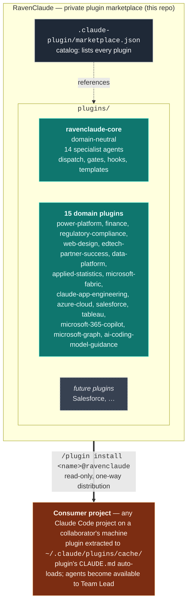

# RavenClaude — Architecture

This repo is a **private Claude Code plugin marketplace**. Each plugin inside it bundles a set of agents, skills, hooks, rules, and templates that a consumer project can install through Claude Code's native `/plugin marketplace add` mechanism. The repo itself isn't loaded into consumer projects — only individual plugins are.

> **Audience for this doc:** anyone working *on* the marketplace (adding a plugin, changing a plugin, reviewing a PR). For instructions on *installing* the plugins as a consumer, see the root [`README.md`](../README.md). For team rules that ship inside `ravenclaude-core`, see [`plugins/ravenclaude-core/CLAUDE.md`](../plugins/ravenclaude-core/CLAUDE.md).

---

## The marketplace model



**One-way distribution.** A consumer's `marketplace update` pulls the latest version from this repo into their local cache. The consumer cannot push back — their changes stay on their machine. The feedback path (lessons, fixes, new patterns) is the PR flow documented in [`CONTRIBUTING.md`](../CONTRIBUTING.md).

---

## Why plugins, not Expert repos

An earlier iteration of this project planned a "central hub + sibling Expert repos" pattern (RavenClaude as the hub, with separate `PowerPlatformExpert`, `SalesforceExpert` repos cloned alongside consumer projects). That model has been replaced by Claude Code's native plugin marketplace, which gives us the same separation with three concrete advantages:

| | Old "sibling Expert repos" model | Plugin marketplace model (current) |
|---|---|---|
| **Distribution** | Each consumer project's devcontainer clones each repo to a known sibling path | `/plugin install <name>@ravenclaude` — one command per plugin |
| **Updates** | Manual `git pull` in each cloned sibling | `/plugin marketplace update ravenclaude` updates all plugins at once |
| **Discovery** | Consumer has to know which Experts to clone | Claude Code surfaces all available plugins in `/plugin` |
| **Activation** | Consumer's `CLAUDE.md` has to opt in by referencing paths | Plugin's own `CLAUDE.md` auto-loads when active |
| **Versioning** | Implicit via git SHA | Explicit `version` field in each `plugin.json`; consumers can pin |

Domain separation is still a first-class concern — it just lives in *separate plugins inside this repo* rather than separate repos. The rule from the old architecture ("Power Platform specifics don't pollute domain-neutral patterns") still holds; it's now enforced by `plugins/ravenclaude-core/` vs. `plugins/power-platform/` rather than by `RavenClaude/` vs. `PowerPlatformExpert/`.

---

## What goes where

The marketplace contains a domain-neutral core plus one plugin per significant domain. Anything domain-specific lives in its own plugin, never in `ravenclaude-core`.

| Lives in `plugins/ravenclaude-core/` | Lives in a domain plugin (e.g. `plugins/power-platform/`) |
|---|---|
| Generic agent role definitions (architect, coder, tester, reviewer, designer, documentarian, project-manager, prompt-engineer, deep-researcher, partner-success-manager, etc.) | Domain-specific agent definitions (`power-fx-engineer`, `flow-engineer`, `dataverse-architect`, `fabric-architect`, `claude-solution-architect`, `azure-architect`, `tableau-viz-engineer`, `graph-api-engineer`, … across the 15 domain plugins) |
| Cross-domain skills (dispatch playbook, worktree helpers, generic code-review patterns) | Domain-specific skills (Power Platform's `dataverse-web-api`, `pcf-controls`, `power-apps-code-apps`, etc.) |
| Cross-domain hooks (format-on-write, guard-destructive, remind-tests) | Domain-specific hooks (only if a hook is meaningless outside that domain) |
| Generic rules (coding standards, security baseline, git workflow, agent collaboration) | Domain-specific rules (Power Platform's "solutions, always" and "managed in test+prod" opinions) |
| Generic templates (memos, runbooks, design specs, RAID logs, partner-success artifacts) | Domain-specific templates (a Dataverse data model spec, a flow run-history triage template, etc.) |

**Rule of thumb:** if it would be relevant to a Salesforce engagement AND a Power Platform engagement AND an iOS app project, it belongs in `ravenclaude-core`. If it only matters for one of them, it belongs in that one's plugin.

---

## Folder layout

```
RavenClaude/
├── .claude-plugin/
│   └── marketplace.json           ← catalog: lists every plugin in this marketplace
│
├── plugins/
│   ├── ravenclaude-core/
│   │   ├── .claude-plugin/plugin.json   ← manifest (name, version, author)
│   │   ├── CLAUDE.md                    ← team constitution that auto-loads
│   │   ├── agents/                      ← 14 specialist agent files
│   │   ├── skills/                      ← dispatch playbook, worktree helpers, etc.
│   │   ├── hooks/                       ← format-on-write, guard-destructive, remind-tests
│   │   ├── rules/                       ← coding-standards, security, git-workflow, agent-collab
│   │   └── templates/                   ← memos, runbooks, RAID logs, partner-success artifacts
│   │
│   └── power-platform/
│       ├── .claude-plugin/plugin.json   ← also declares bundled pbix-mcp MCP server
│       ├── CLAUDE.md
│       ├── NOTICE.md                    ← MIT attribution for imported skills + pbix-mcp
│       ├── agents/                      ← 11 specialist agent files
│       ├── hooks/                       ← check-house-opinions (advisory)
│       └── skills/                      ← 13 skills (9 imported Daniel Kerridge MIT + 4 in-house)
│
├── .claude/                       ← config for working ON this repo itself (NOT shipped)
│   └── settings.json              ← permissions + hooks for marketplace dev
│
├── .github/
│   └── pull_request_template.md   ← auto-loaded PR form for all contributions
│
├── docs/                          ← meta-repo docs (not shipped to consumers)
│   ├── architecture.md            ← this file
│   ├── access.md                  ← collaborator record
│   ├── best-practices/            ← cross-domain rules (with _TEMPLATE.md)
│   └── memory-bank/
│       ├── lessons-learned.md     ← reverse-chronological trial-and-error log
│       └── decision-log.md        ← reverse-chronological architectural decisions
│
├── CLAUDE.md                      ← working-on-the-marketplace constitution
├── CONTRIBUTING.md                ← how collaborators propose changes
└── README.md                      ← install instructions for consumers
```

Key boundary: **the `docs/` tree, `.claude/`, `.github/`, `CLAUDE.md`, `CONTRIBUTING.md`, and `README.md` at the repo root are NOT shipped to consumers.** They're meta-repo content — only the contents of `plugins/<plugin-name>/` are extracted when a consumer installs a plugin.

---

## How a consumer uses the marketplace

```bash
# In any Claude Code project on a collaborator's machine:
/plugin marketplace add mcorbett51090/RavenClaude
/plugin install ravenclaude-core@ravenclaude
/plugin install power-platform@ravenclaude     # if they need it
/reload-plugins
```

After install, each plugin's `CLAUDE.md` auto-loads into the consumer's Claude Code session. Agents defined under `plugins/<name>/agents/` become available to the Team Lead for dispatch. Skills under `plugins/<name>/skills/` are consulted on demand. Hooks, rules, and templates apply per the plugin's own configuration.

To pick up new versions:

```bash
/plugin marketplace update ravenclaude
/reload-plugins
```

The repo is private — see [`docs/access.md`](access.md) for the current collaborator list and the access-model rationale.

---

## How knowledge is captured

The marketplace has three layers of "memory," each with a different purpose and a different write path:

| Layer | Where it lives | Who writes to it | What goes here |
|---|---|---|---|
| **Consumer's auto-memory** | `~/.claude/projects/<project>/memory/` on the consumer's machine | The consumer's Claude session | Session-local context: user preferences, current task state, project facts. Private to that consumer. |
| **Plugin lessons** (cross-domain) | `docs/memory-bank/lessons-learned.md` (this repo) | Collaborators via PR | Cross-domain trial-and-error findings — *applies to any Claude work*. Reverse-chronological, newest first. |
| **Plugin best-practices** (cross-domain) | `docs/best-practices/<slug>.md` (this repo) | Collaborators via PR | Cross-domain rules with rationale + how-to-apply + provenance. One file per rule. Use [`_TEMPLATE.md`](best-practices/_TEMPLATE.md). |

**Domain-specific lessons** (e.g. a Power Platform-specific Dataverse rule) belong inside the relevant plugin's folder — for example, `plugins/power-platform/skills/<domain-skill>/resources/<rule>.md` — not in this repo's domain-neutral `docs/`.

**Flow when Claude (in any consumer project) discovers something non-obvious:**

1. Save in that project's auto-memory immediately so the current session benefits.
2. Decide where it generalizes:
   - **Specific to one domain** → goes inside that domain's plugin via a PR to this repo (`plugins/<plugin>/...`), and the relevant plugin's version is bumped.
   - **Applies across domains** → goes here, in `docs/memory-bank/lessons-learned.md` or `docs/best-practices/`, via a PR.
   - **Both** → write the cross-domain rule here, write the domain-specific deep-dive in the plugin, cross-link them.
3. Cite the propagation explicitly in the response so the user can verify the trail.

The PR flow itself is in [`CONTRIBUTING.md`](../CONTRIBUTING.md).

---

## Adding a new plugin

When a new domain matures past the point where it deserves its own plugin (Salesforce, finance, EdTech, etc.):

1. Create `plugins/<plugin-name>/.claude-plugin/plugin.json` with `name`, `description`, `version`, `author`, optional `license` and `keywords`.
2. Add `agents/`, `skills/`, `hooks/`, `rules/`, `templates/` subdirectories — only the ones the plugin actually needs.
3. Add `plugins/<plugin-name>/CLAUDE.md` as the team constitution that ships with the plugin.
4. Append the new plugin to the `plugins[]` array in `.claude-plugin/marketplace.json`.
5. If the plugin imports third-party content, add `plugins/<plugin-name>/NOTICE.md` with the license + attribution (see `plugins/power-platform/NOTICE.md` for the canonical form).
6. Open a PR following the **Marketplace / meta change** section of the PR template.
7. After merge, test the install from a separate Claude Code project: `/plugin marketplace update ravenclaude` then `/plugin install <plugin-name>@ravenclaude`.

The existing plugins are the reference implementations — `ravenclaude-core` for a "team patterns" plugin, `power-platform` for a "domain specialist team plus imported skills" plugin.

---

## Status

**Active plugins (44).** The table below is the canonical roster; **per-plugin versions live in [`../.claude-plugin/marketplace.json`](../.claude-plugin/marketplace.json)** (the single source of truth, CI-gated for catalog↔plugin.json parity) and the generated portal [`../index.html`](../index.html) — they are deliberately not duplicated here to avoid drift. A CI check (`scripts/check-marketplace-claims.py`) asserts every `plugins/*/` directory appears in this table.

| Plugin | What it is |
|---|---|
| [`ravenclaude-core`](../plugins/ravenclaude-core/) | Domain-neutral foundation: 14 specialist agents, 22 skills, the dispatch playbook, 13 hooks, rules, templates; the Capability Grounding Protocol, Structured Output Protocol, the Researcher meta-skill, the comfort-posture dashboard, and the command-review + decision-review tribunal (the Thing). |
| [`power-platform`](../plugins/power-platform/) | Microsoft Power Platform: 11 specialist agents, 18 skills, an 8-check house-opinion hook, a knowledge bank (PA-flow recovery, Dataverse token acquisition, PCF React/Fluent, Copilot agents 2026, managed environments, Power Pages 2026), and the bundled pbix-mcp server. |
| [`finance`](../plugins/finance/) | Corporate finance & FP&A: 7 specialist agents, 9 skills, 8 templates, 1 advisory anti-pattern hook, 1 knowledge doc. Inherits `ravenclaude-core` protocols. |
| [`regulatory-compliance`](../plugins/regulatory-compliance/) | Financial-regulatory: 6 specialist agents, 9 skills, 8 templates, 1 defensive PII-scrub hook, 1 knowledge doc. BMA field-experience positioning. |
| [`web-design`](../plugins/web-design/) | Web design & build: 7 specialist agents, 10 skills (incl. Fluent UI v9 + React implementation), 8 templates, 1 advisory hook, a 7-doc knowledge bank (2026 stacks/CSS/web-platform/AEO-GEO/design-systems/Fluent). |
| [`edtech-partner-success`](../plugins/edtech-partner-success/) | EdTech Partner Success Manager team: 6 specialist agents, 12 skills, 16-doc knowledge bank, 15 templates, 1 advisory PSM-anti-pattern hook. Segment-agnostic (K-12 / higher-ed / corp L&D). |
| [`data-platform`](../plugins/data-platform/) | Non-Microsoft / SMB embedded-analytics: 4 specialist agents, 12 skills (incl. cross-system-identity-resolution), 12 templates, 1 advisory hook, 17-doc knowledge bank (Supabase/Neon/RDS, Airbyte/Fivetran, Evidence/Superset/Metabase/Cube, + Planhat/Intercom/Slack-as-source & Sigma-when-already-owned), 21 best-practices. Opinionated against per-viewer-priced BI; reciprocal seam with `microsoft-fabric`. |
| [`customer-success-analytics`](../plugins/customer-success-analytics/) | Domain-neutral CS-health analytics layer ON TOP of data-platform: 2 specialist agents (cs-analytics-architect, churn-signal-analyst), 2 skills (health-tier-design, renewal-workflow-design), 2-doc knowledge bank, cs-health-data-model template. Owns the metrics/signals/transparent-risk-tier layer (what to measure & why); routes pipeline/warehouse/identity-resolution to data-platform. Seams: salesforce / tableau / edtech-partner-success. |
| [`applied-statistics`](../plugins/applied-statistics/) | "Is this difference/trend REAL?" — 1 specialist (applied-statistician), 5 skills, 5-doc knowledge bank, 4 templates, 1 advisory hook. Seams with data-platform ("is it correct?" vs "is it real?"). |
| [`process-improvement`](../plugins/process-improvement/) | Lean Six Sigma Black-Belt capability: 2 agents (lean-six-sigma-blackbelt, process-analyst), 6 skills (DMAIC charter / process-mapping / root-cause / capability-&-SPC / lean-waste / control-plan), 5 templates, 7 best-practices, 3-doc knowledge bank with 6 web-verified Mermaid decision trees. Analyzes & improves any operational process (DMAIC, waste removal, SPC, control plans). Load-bearing seam to `applied-statistics` for inferential stats (hypothesis tests/DOE/Gage R&R); DMAIC delivery seams to `project-management`. |
| [`auth-identity`](../plugins/auth-identity/) | End-user authentication & identity: 2 agents (auth-architect, auth-implementation-engineer), 7 skills, 4 templates, 5 best-practices, 4-doc web-verified knowledge bank with 5 Mermaid decision trees. A variety of login methods (Google/Apple/Microsoft/GitHub SSO + magic-link/passkeys/email-password) via managed auth (Supabase-Auth lean) for a web app / API / dashboard. Load-bearing boundary: AUTHENTICATES the person; `data-platform` AUTHORIZES the data (RLS/embed-JWT). Seams: `azure-cloud` (Entra), `web-design` (login UI), `ravenclaude-core/security-reviewer` (mandatory auth-code review). |
| [`microsoft-fabric`](../plugins/microsoft-fabric/) | Microsoft Fabric: 7 agents (architect / lakehouse / warehouse / data-factory / realtime-intelligence / semantic-model / admin), 9-doc citation-grounded knowledge bank (two Mermaid decision trees + a dated 2026 capability map), 6 templates, 1 advisory hook. Reciprocal seams with `data-platform`, `power-platform/power-bi-engineer`, `azure-cloud`. |
| [`claude-app-engineering`](../plugins/claude-app-engineering/) | Building apps on the Claude API + Agent SDK + MCP: 6 agents, 13-doc knowledge bank (build-surface / caching / tools / MCP / Agent SDK / evals / RAG / prompt-engineering / orchestration / context-engineering / FinOps), 6 templates, 1 advisory hook. Ships no security/architect clone — escalates to core. |
| [`azure-cloud`](../plugins/azure-cloud/) | Azure infrastructure & platform: 7 agents (architect / bicep-iac / entra-identity / network / app-platform / integration / ops), 10-doc knowledge bank (CAF landing zones, IaC, compute + integration decision trees, Entra, networking, observability/FinOps, AI Foundry, dated 2026 capability map), 6 templates, 1 advisory hook. Reciprocal seams across power-platform / fabric / claude-app-engineering / web-design. |
| [`salesforce`](../plugins/salesforce/) | Salesforce platform: 5 agents (apex-engineer / flow-automation-architect / agentforce-architect / salesforce-platform-architect / salesforce-reviewer), 9-doc citation-grounded knowledge bank (9 Mermaid decision trees: governor limits, automation density, trigger framework, async, sharing/security, LDV, packaging/DevOps, integration, Agentforce determinism), 5 skills, 5 templates, 1 advisory hook (15 house opinions). Forked review rubric; seams to azure-cloud / data-platform / web-design / core. |
| [`microsoft-365-copilot`](../plugins/microsoft-365-copilot/) | M365 Copilot extensibility & administration: 6 agents (copilot-extensibility-architect / declarative-agent-engineer / graph-connector-engineer / api-plugin-engineer / agents-sdk-engineer / copilot-admin-governance), 9-doc citation-grounded knowledge bank (two Mermaid decision trees: agent-platform routing + grounding-source), 5 skills, 5 templates, 1 advisory hook (15 house opinions). Disjoint from power-platform's Copilot Studio coverage; seams to power-platform / claude-app-engineering / azure-cloud / core. |
| [`tableau`](../plugins/tableau/) | Tableau analytics: 3 agents (tableau-viz-engineer / tableau-data-architect / tableau-admin) covering VizQL & calculations (LOD/table-calcs), data modeling (relationships vs joins vs blends, extracts vs live), workbook performance, Tableau Prep, Server/Cloud governance & RLS, content ALM, embedding (Connected Apps/JWT), and the Pulse/Tableau-Next surface. 26-rule best-practices library + 3 decision-tree knowledge files (15 Mermaid trees, dated 2026-05-30). Seams: salesforce (source data/CRM Analytics) / data-platform / microsoft-fabric / power-platform-power-bi (comparison) / core (RLS+embedding-auth review). |
| [`microsoft-graph`](../plugins/microsoft-graph/) | Microsoft Graph developer surface: 3 agents (graph-api-engineer / graph-identity-engineer / graph-workloads-engineer) covering OData query/paging/`$batch`/delta + throttling, Entra app-registration & delegated-vs-application permissions/consent/auth-flows/least-privilege, and workloads (mail/calendar, Teams, files, users/groups, change-notification subscriptions). 18-rule best-practices library + 3 decision-tree knowledge files (13 Mermaid trees, dated 2026-05-30). Cross-links rather than duplicates: Copilot connectors → microsoft-365-copilot, tenant identity → azure-cloud; security/permission verdicts → core. |
| [`ai-coding-model-guidance`](../plugins/ai-coding-model-guidance/) | Non-Claude AI-coding-tool model selection: 3 agents (copilot-model-strategist / codex-model-strategist / grok-model-strategist) over one dated, citation-grounded lineup (`knowledge/cross-tool-model-lineup-2026.md`) covering GitHub Copilot's picker (completions/chat/coding-agent/cloud-agent/mobile + org model rules), OpenAI Codex (CLI/cloud model + reasoning level), and xAI Grok (Grok 4.x + the grok-code-fast-1 retirement). Vendor-neutral decision tree + right-sizing + closed-world anti-hallucination rule; `check-lineup-citations.py` gates the volatile numbers. Seams to claude-app-engineering for Claude models. |
| [`project-management`](../plugins/project-management/) | Project & delivery management: 4 agents (delivery-lead / scrum-master / risk-and-raid-analyst / stakeholder-comms-lead) across the predictive (PMBOK/PMP) and agile (Scrum/Kanban) tracks plus hybrid — baselines + earned value, sprint facilitation, scored qual+quant risk registers, stakeholder/PMO governance. A predictive-vs-agile-vs-hybrid decision tree + a 3-rule best-practices library. **Deepens — does not replace —** `ravenclaude-core/project-manager` (the lightweight RAID/status-hygiene default); the litmus test is hygiene → core, running the project → here (the house-rule carve-out). Seams: prose polish → core/documentarian; system design → core/architect; domain delivery specifics → the owning domain plugin. |
| [`team-portfolio`](../plugins/team-portfolio/) | Centralized multi-repo, multi-person activity & project tracking (agentless). A stdlib-only collector pulls commits/PRs/issues across many GitHub repos from the API → normalized `portfolio-activity.json`; renderers emit markdown roll-ups (weekly tracker / activity feed / per-project status) + a self-contained HTML dashboard; a scheduled GitHub Action + `/portfolio-refresh` keep it current. The cross-repo replacement for a single-repo activity log, with a supervisor's manage-the-team view. 2 skills (portfolio-setup, cross-repo-project-tracking). **Observes** activity across projects — distinct from `project-management` (runs a project) and `ravenclaude-core/project-manager` (single-effort RAID/status hygiene). Secrets stay in env/secrets. |
| [`api-engineering`](../plugins/api-engineering/) | API engineering for an API you **produce**: 5 agents (api-design-architect / api-implementation-engineer / api-security-engineer / api-testing-engineer / api-platform-engineer) across the lifecycle — paradigm choice (REST/GraphQL/gRPC/webhooks/AsyncAPI), contract-first OpenAPI 3.1/3.2 + AsyncAPI 3.0 design, versioning & deprecation, the build craft (RFC 9457 Problem Details, cursor pagination, Idempotency-Key, ETag concurrency, 202+polling, RateLimit headers), OWASP API Security Top 10 2023 (BOLA/BOPLA/BFLA, token/scope validation, consumption limits, SSRF, unsafe consumption), testing & governance (consumer-driven contract tests, Spectral lint in CI, Prism/Postman mocks, k6 load), and the operate layer (gateway/management design, dev portal + SDK codegen, sunset rollout). 3 decision-tree knowledge files (10 Mermaid trees) + a dated 2026 spec capability map, 22 best-practices, 6 templates, 6 commands, 1 advisory hook. Seams: Claude API/MCP → claude-app-engineering, consuming Microsoft Graph → microsoft-graph, APIM infra → azure-cloud/integration-engineer, login UX → auth-identity, ELT connectors → data-platform; every security verdict → ravenclaude-core/security-reviewer. |
| [`staffing-operations`](../plugins/staffing-operations/) | Healthcare + education staffing operations & analytics consulting: 6 agents (staffing-engagement-lead / staffing-operations-analyst / recruiting-funnel-strategist / healthcare-staffing-specialist / education-staffing-specialist / workforce-market-analyst), 10 skills, 10 templates, 5 commands, 1 advisory hook, 7 best-practice rules, and an 8-doc research-grounded knowledge bank (staffing KPI glossary, healthcare bill-pay-burden economics + travel-rate cycle, credentialing & IDEA/IEP compliance, K-12 school-based fundamentals, 2023-2026 trends + SIA-anchored sizing, competitor landscape, Soliant Health employer profile, diagnostic decision trees). Vertical-explicit but segment-flexible (travel/per-diem/locum/direct-hire/school-based); every external figure carries a source + date, advisory numbers marked [ESTIMATE]. Seams: KPI instrumentation → core/data-engineer; deep research → core/deep-researcher; PII/PHI → core/security-reviewer. |
| [`freight-forwarding-sales`](../plugins/freight-forwarding-sales/) | International freight-forwarding sales: 6 agents (freight-rate-quoter, rfq-tender-strategist, key-account-manager, pipeline-forecast-coach, prospecting-outreach-strategist, trade-lane-compliance-advisor) for a global-forwarding sales / BD manager — all-in ocean + air quotes (chargeable weight, BAF/CAF/THC/LSS surcharge stack, margin, validity), RFQ/RFP/tender response (qualify-or-decline + lane rate matrix + bid narrative), QBRs & account plans, pipeline + forecast hygiene, multi-channel prospecting, and Incoterms 2020 + customs basics. 6 skills, 6 commands, a 2-doc knowledge bank (4 Mermaid decision trees: mode selection / quote-vs-qualify / Incoterms / spot-vs-contract + a glossary), and a runnable chargeable-weight / quote-margin calculator (`scripts/freight_calc.py`). Carrier-neutral; public industry-standard practice, no confidential method. Seams: customer PII / confidential pricing → core/security-reviewer; live market data → core/deep-researcher; reporting build → data-platform. |
| [`commercial-real-estate`](../plugins/commercial-real-estate/) | Commercial Real Estate specialist team — 4 agents, 5 skills, 4-file cited knowledge bank, 4 templates, 5 commands, 8 best-practice rules, 1 advisory hook. An acquisitions-and-asset-management team for a CRE owner, operator, or advisor — it underwrites a deal to in-place NOI, prices the cap-rate-vs-Treasury spread, reads the bifurcated vacancy, decomposes net effective rent, and stress-tests the debt and refinance wall before a board sees the IC memo. |
| [`restaurant-operations`](../plugins/restaurant-operations/) | Restaurant Operations specialist team — 4 agents, 5 skills, 4-file cited knowledge bank, 3 templates, 5 commands, 8 best-practice rules, 1 advisory hook. An operations-and-unit-economics team for an independent or multi-unit restaurant operator — it manages prime cost (food + labor), engineers the menu by contribution margin and popularity, controls food cost against theoretical, and reads the P&L the way a GM who lives the four-wall margin does. |
| [`veterinary-practice`](../plugins/veterinary-practice/) | Veterinary Practice specialist team — 4 agents, 5 skills, 4-file cited knowledge bank, 3 templates, 5 commands, 8 best-practice rules, 1 advisory hook. A clinical-and-practice-management team for a veterinary hospital owner or medical director — it builds standardized care protocols, runs the practice on production and ACT (average client transaction), manages the appointment-and-doctor capacity that gates revenue, and frames the independent-vs-corporate position in a fast-consolidating market. |
| [`dental-practice`](../plugins/dental-practice/) | Dental Practice specialist team — 4 agents, 5 skills, 4-file cited knowledge bank, 3 templates, 5 commands, 8 best-practice rules, 1 advisory hook. A treatment-planning-and-revenue-cycle team for a dental practice owner — it controls overhead against the ~62% median, holds collections above 98%, builds case acceptance on the treatment plan rather than the discount, and reads doctor/hygiene production per hour the way a practice that runs on the schedule does. |
| [`medical-revenue-cycle`](../plugins/medical-revenue-cycle/) | Medical Revenue Cycle specialist team — 4 agents, 5 skills, 4-file cited knowledge bank, 3 templates, 5 commands, 8 best-practice rules, 1 advisory hook. A revenue-cycle team for a healthcare provider or RCM operator — it drives the clean-claim rate toward 98%, attacks denials before they happen (initial denials hit ~11.8% in 2024 and trend 12–15%), works the A/R by aging bucket, and reads net collection rate the way a CFO who lives the cash cycle does. |
| [`insurance-pc`](../plugins/insurance-pc/) | P&C Insurance specialist team — 4 agents, 5 skills, 4-file cited knowledge bank, 3 templates, 5 commands, 8 best-practice rules, 1 advisory hook. An underwriting-and-claims team for a P&C carrier, MGA, or agency analyst — it reads the combined ratio as loss plus expense, prices risk to the loss ratio rather than the competitor, manages the claims severity-and-frequency story, and reads catastrophe load the way an underwriting result that hit a decade-best ~92 combined in 2025 demands. |
| [`nonprofit-fundraising`](../plugins/nonprofit-fundraising/) | Nonprofit Fundraising specialist team — 4 agents, 5 skills, 4-file cited knowledge bank, 3 templates, 5 commands, 8 best-practice rules, 1 advisory hook. A development team for a nonprofit fundraiser or executive director — it protects donor retention (the cheapest dollar a nonprofit has, at ~$0.20 to keep vs ~$1.50 to acquire), builds the grant pipeline on fit before effort, segments the donor base by value and recency, and reads cost-to-raise-a-dollar honestly across channels. |
| [`fleet-logistics`](../plugins/fleet-logistics/) | Fleet & Logistics specialist team — 4 agents, 5 skills, 4-file cited knowledge bank, 3 templates, 5 commands, 8 best-practice rules, 1 advisory hook. A fleet-operations team for a carrier, private fleet, or last-mile operator — it reads cost-per-mile against the ~$2.26 industry all-in (and the ~$1.78 non-fuel marginal), manages the operating ratio in a market that turned negative-margin in 2024, routes and dispatches to deadhead and utilization, and treats driver turnover (often 90%+ at large truckload carriers) as a unit-economics problem. |
| [`renewable-energy`](../plugins/renewable-energy/) | Renewable Energy specialist team — 4 agents, 5 skills, 4-file cited knowledge bank, 3 templates, 5 commands, 8 best-practice rules, 1 advisory hook. A project-development team for a solar/storage developer, EPC, or asset owner — it models LCOE and project IRR against a cost-per-watt that ran ~$2.56 in 2025, navigates the interconnection queue that gates most projects, structures around the post-2025 ITC shift (residential 25D ended; 48E/PPA pathways remain), and reads O&M and degradation the way a 25-year asset demands. |
| [`clinical-trials`](../plugins/clinical-trials/) | Clinical Trials specialist team — 4 agents, 5 skills, 4-file cited knowledge bank, 3 templates, 5 commands, 8 best-practice rules, 1 advisory hook. A clinical-operations team for a sponsor, CRO, or site network — it designs feasible protocols (because eligibility criteria drive the enrollment failure that hits two-thirds of sites), plans patient recruitment against a ~$6,533 per-patient cost (and ~$19,533 to replace), manages site activation and the ~30% dropout, and frames the regulatory submission the way a study where 80% run late demands. |
| [`ecommerce-dtc`](../plugins/ecommerce-dtc/) | E-commerce & DTC specialist team — 4 agents, 5 skills, 4-file cited knowledge bank, 3 templates, 5 commands, 8 best-practice rules, 1 advisory hook. A growth-and-unit-economics team for a DTC brand operator — it protects the LTV:CAC ratio (the 3:1 line below which a brand bleeds), reads conversion against the 1.4–1.8% average, attacks the retention gap (the average brand keeps just ~28% for a second purchase), and reads contribution margin after the real cost of acquisition and returns. |
| [`cannabis-operations`](../plugins/cannabis-operations/) | Cannabis Operations specialist team — 4 agents, 5 skills, 4-file cited knowledge bank, 3 templates, 5 commands, 8 best-practice rules, 1 advisory hook. A compliance-and-retail-operations team for a licensed cannabis operator — it runs seed-to-sale traceability against the state track-and-trace system (Metrc/BioTrack/LeafData), manages the 280E tax burden that makes COGS allocation existential, runs dispensary retail on margin and basket, and reads a ~$45B U.S. market where the rules change at the state line. |
| [`procurement-sourcing`](../plugins/procurement-sourcing/) | Procurement & Sourcing specialist team — 4 agents, 5 skills, 4-file cited knowledge bank, 3 templates, 5 commands, 8 best-practice rules, 1 advisory hook. A strategic-sourcing team for a procurement or category lead — it segments spend before it sources (the Kraljic should-cost lens), runs the sourcing event on total cost of ownership rather than unit price, manages supplier risk as a portfolio, and reads the spend cube the way a category manager who owns savings does. |
| [`skilled-trades-contracting`](../plugins/skilled-trades-contracting/) | Skilled Trades Contracting specialist team — 4 agents, 5 skills, 4-file cited knowledge bank, 3 templates, 5 commands, 8 best-practice rules, 1 advisory hook. An estimating-and-field-operations team for an HVAC, electrical, or plumbing contractor — it estimates to a loaded labor rate and true material cost, prices on a flat-rate book rather than guessing hours, runs the field on billable-hour efficiency and callback rate, and reads the trade P&L the way an owner who's also the best technician needs to. |
| [`precision-agriculture`](../plugins/precision-agriculture/) | Precision Agriculture specialist team — 4 agents, 5 skills, 4-file cited knowledge bank, 3 templates, 5 commands, 8 best-practice rules, 1 advisory hook. An agronomy-and-farm-operations team for a grower, farm manager, or ag retailer — it manages inputs to agronomic and economic return (not maximum yield), reads yield by management zone rather than field average, times operations to the agronomic and weather window, and reads the farm P&L per acre the way an operator who lives the margin does. |
| [`legal-small-firm`](../plugins/legal-small-firm/) | Small-Firm Legal Practice specialist team — 4 agents, 5 skills, 4-file cited knowledge bank, 3 templates, 5 commands, 8 best-practice rules, 1 advisory hook. A practice-operations team for a solo or small-firm attorney — it manages matters on realization and the billable-vs-collected gap, drafts and reviews documents as attorney decision-support, runs intake on conflict and fit before the engagement, and reads the practice P&L the way a lawyer who is also the rainmaker and the COO must. |
| [`game-development`](../plugins/game-development/) | Game Development specialist team — 4 agents, 5 skills, 4-file cited knowledge bank, 3 templates, 5 commands, 8 best-practice rules, 1 advisory hook. A production-and-design team for a game studio or indie team — it scopes to a vertical slice before a full build, designs core loops and economies that retain, runs production on milestones and risk burn-down, and reads live-ops on retention and monetization the way a team that ships and then operates a game must. |
| [`film-video-production`](../plugins/film-video-production/) | Film & Video Production specialist team — 4 agents, 5 skills, 4-file cited knowledge bank, 3 templates, 5 commands, 8 best-practice rules, 1 advisory hook. A production-management team for a producer, production company, or post house — it budgets to a defensible top-sheet, schedules to the shoot day rather than the calendar, runs the post pipeline as a dependency chain, and reads production economics the way a line producer who answers for every dollar on the day must. |
| [`architecture-aec`](../plugins/architecture-aec/) | Architecture & AEC specialist team — 4 agents, 5 skills, 4-file cited knowledge bank, 3 templates, 5 commands, 8 best-practice rules, 1 advisory hook. A practice-and-project team for an architect or small AEC firm — it manages the project through the design phases on a fee that matches the effort, controls scope and the change/RFI load that erodes margin, reads construction documents for coordination and constructability, and reads the firm P&L on utilization and net multiplier the way a principal who bills time must. |
| [`senior-care-operations`](../plugins/senior-care-operations/) | Senior Care Operations specialist team — 4 agents, 5 skills, 4-file cited knowledge bank, 3 templates, 5 commands, 8 best-practice rules, 1 advisory hook. An operations team for an assisted-living, memory-care, or home-care operator — it manages census and occupancy as the revenue engine, prices to acuity rather than a flat rate, staffs to acuity-based hours-per-resident-day, and reads quality and compliance as the license-and-reputation risk that a community runs on. |
| [`hospice-referral-sales`](../plugins/hospice-referral-sales/) | Hospice referral-sales / community-liaison team — 6 agents, 6 skills, a 4-doc cited knowledge bank (6 Mermaid decision trees + glossary + LCD eligibility + compliance references), 6 templates, 6 commands, 14 best-practice rules, a scenarios bank, an advisory hook, and a runnable funnel/census/benefit-period calculator. A compliance-first referral-development team for a hospice sales / community-education rep — it plans a referral territory, educates clinicians on Medicare Hospice Benefit eligibility (the rep educates; the physician certifies), runs referral-partner reviews led by patient outcomes, reads the referral-to-admission funnel, coaches the goals-of-care conversation, and clears every value exchange against the Anti-Kickback / HIPAA line. Employer-neutral; public practice + CMS rules. |
| [`devops-cicd`](../plugins/devops-cicd/) | DevOps & CI/CD: 4 agents (pipeline / release / gitops / build-and-artifact) for commit→prod — CI design, progressive delivery (canary/blue-green/flags), GitOps (Argo/Flux), SBOM/SLSA. 4 skills, 6 best-practices, decision-tree knowledge bank, advisory hook. |
| [`observability-sre`](../plugins/observability-sre/) | Observability & SRE: 3 agents (observability / sre-reliability / incident-commander) — OpenTelemetry, SLOs & error budgets, multi-window burn-rate alerting, blameless incident response. 3 skills, 6 best-practices, decision trees, advisory hook. |
| [`platform-engineering-idp`](../plugins/platform-engineering-idp/) | Platform engineering & IDP: 4 agents (platform-product-lead / idp-portal-engineer / golden-path-engineer / devex-metrics-engineer) — the platform-as-a-product layer above CI/CD: an internal developer platform / portal (Backstage + alternatives, software catalog, scaffolder templates), golden paths / paved roads + self-service infra (Crossplane/Score, guardrails not gates), and DevEx measurement (DORA + SPACE + DevEx, adoption funnel). 5 skills, 4 commands, 12 best-practices, decision trees + 2026 capability map, scenarios, advisory hook. |
| [`finops-cloud-cost`](../plugins/finops-cloud-cost/) | FinOps & cloud cost: 4 agents (finops-practice-lead / cost-optimization-engineer / cost-allocation-engineer / ai-cost-governance-engineer) — cross-cloud cost governance: the FinOps Framework (inform/optimize/operate), tagging + showback/chargeback + unit economics + FOCUS, rightsizing + commitments (RIs/SPs/CUDs), and AI/token cost governance. 3 skills, decision trees + 2026 map, 6 best-practices, advisory hook, finops_calc.py. Cross-cloud cost; provider infra → aws/azure/gcp-cloud. |
| [`revenue-operations`](../plugins/revenue-operations/) | Revenue Operations (RevOps): 4 agents (revops-lead / crm-operations-architect / sales-comp-and-territory-analyst / pipeline-forecast-engineer) — lead-to-cash: CRM-as-process + data hygiene, stage exit-criteria, forecasting methodology, comp/territory/quota design. 3 skills, decision trees, 6 best-practices, advisory hook, revops_calc.py. CRM build → salesforce; post-sale → customer-success-analytics. |
| [`customer-support-cx-operations`](../plugins/customer-support-cx-operations/) | Customer support / CX ops: 4 agents (cx-ops-lead / support-quality-analyst / knowledge-and-deflection-strategist / contact-center-workforce-analyst) — deflection & self-service, CSAT/CES/NPS programs, KB-as-product, Erlang-C staffing & queue design. 3 skills, decision trees, 6 best-practices, advisory hook, cx_calc.py. Ticket pipelines → data-platform; account health → customer-success-analytics. |
| [`search-relevance-engineering`](../plugins/search-relevance-engineering/) | Search & retrieval engineering: 4 agents (search-architect / relevance-engineer / vector-retrieval-engineer / search-eval-engineer) — Elasticsearch/OpenSearch, vector + hybrid (BM25 + dense), embeddings/chunking/reranking, relevance tuning + evaluation (nDCG/MRR), the RAG retrieval tier. 3 skills, decision trees + 2026 map, 6 best-practices, advisory hook, search_eval.py. The RAG app → claude-app-engineering. |
| [`supply-chain-planning`](../plugins/supply-chain-planning/) | Supply-chain planning: 4 agents (supply-chain-planner / demand-planning-analyst / inventory-optimization-engineer / sop-process-lead) — the plan layer between buy and move: S&OP/IBP, demand forecasting (MAPE/bias), inventory optimization (safety stock, ABC/XYZ, EOQ), MRP/replenishment. 3 skills, decision trees, 6 best-practices, advisory hook, supply_calc.py. Buying → procurement-sourcing; transport → freight-forwarding-sales/fleet-logistics. |
| [`marketing-operations-demand-gen`](../plugins/marketing-operations-demand-gen/) | Marketing ops & demand gen: 4 agents (marketing-ops-lead / demand-gen-strategist / marketing-automation-engineer / attribution-analyst) — martech stack + MQL→SQL handoff, channel mix/ABM, nurture & lead scoring, multi-touch attribution + UTM taxonomy. 3 skills, decision trees + 2026 map, 6 best-practices, advisory hook. Lead-to-cash → revenue-operations; site/SEO → web-design. |
| [`retail-store-operations`](../plugins/retail-store-operations/) | Brick-and-mortar retail ops: 5 agents (store-ops-lead / merchandising-analyst / inventory-and-replenishment-analyst / labor-scheduling-analyst / loss-prevention-advisor) — four-wall P&L + KPIs, assortment/planograms, replenishment, staff-to-traffic, shrink/LP. 3 skills, decision trees + 2026 map, 6 best-practices, advisory hook, retail_calc.py. Online → ecommerce-dtc; demand planning → supply-chain-planning. |
| [`wealth-management-advisory`](../plugins/wealth-management-advisory/) | RIA / financial-advisor practice: 5 agents (advisory-practice-lead / financial-planning-specialist / portfolio-review-analyst / client-relationship-manager / advisory-compliance-advisor) — the advisor's book + AUM growth, financial planning, IPS-anchored portfolio review/rebalancing, client reviews + prospecting, Reg BI / suitability / fiduciary. 3 skills, decision trees, 6 best-practices, advisory hook. Helps the advisor prep their own work (not client advice). Corporate finance → finance; regime depth → regulatory-compliance. |
| [`people-operations-hr`](../plugins/people-operations-hr/) | Internal HR / People Ops: 4 agents (people-ops-lead / talent-acquisition-strategist / performance-and-comp-analyst / people-analytics-engineer) — HRIS/policy/onboarding, structured hiring + scorecards, performance + calibration + comp bands/leveling, ethical people analytics. 3 skills, decision trees + 2026 map, 6 best-practices, advisory hook, people_calc.py. Distinct from staffing-operations (external recruiting business). |
| [`accounting-firm-cpa`](../plugins/accounting-firm-cpa/) | Public-accounting / CPA firm ops: 5 agents (firm-practice-lead / tax-workflow-strategist / cas-engagement-lead / audit-engagement-lead / firm-advisory-lead) — firm economics (realization/utilization/leverage), tax-season workflow, Client Accounting Services, attest/PBC/workpapers/independence, advisory upsell. 3 skills, decision trees, 6 best-practices, advisory hook, firm_calc.py. Distinct from finance (in-house corporate). |
| [`hospitality-hotels`](../plugins/hospitality-hotels/) | Hotel / lodging ops: 5 agents (hotel-ops-lead / revenue-manager / reservations-and-channel-analyst / guest-experience-lead / rooms-and-housekeeping-analyst) — revenue management (RevPAR/ADR/occupancy, overbooking), OTA/channel + net-ADR, guest experience + reputation, rooms/housekeeping, USALI/GOPPAR. 3 skills, decision trees + 2026 map, 6 best-practices, advisory hook, hotel_calc.py. F&B → restaurant-operations. |
| [`property-management-residential`](../plugins/property-management-residential/) | Residential property management: 4 agents (pm-ops-lead / leasing-strategist / maintenance-operations-analyst / pm-compliance-advisor) — leasing & tenant lifecycle, maintenance/work-order SLAs + the turn, rent collection & delinquency, fair-housing / consistent screening / habitability. 3 skills, decision trees + 2026 map, 6 best-practices, advisory hook, pm_calc.py. Distinct from commercial-real-estate (CRE). |
| [`field-service-management`](../plugins/field-service-management/) | Field-service / dispatch ops (HVAC/plumbing/elevator/medical-device): 4 agents (fsm-ops-lead / dispatch-and-scheduling-engineer / technician-productivity-analyst / parts-and-inventory-analyst) — SLA tiers + dispatch-to-cash, schedule by skill/SLA/geo, first-time-fix + utilization + MTTR, truck stock. 3 skills, decision trees + 2026 map, 6 best-practices, advisory hook, fsm_calc.py. Sales business → skilled-trades-contracting; vehicles → fleet-logistics. |
| [`localization-i18n-engineering`](../plugins/localization-i18n-engineering/) | i18n / l10n engineering: 3 agents (i18n-architect / l10n-pipeline-engineer / localization-qa-engineer) — string externalization + ICU MessageFormat + RTL/bidi, extraction + TMS + continuous localization, pseudo-localization + l10n lint in CI. 3 skills, decision trees + 2026 map, 6 best-practices, advisory hook. UI → frontend/mobile-engineering; content → technical-writing-docs. |
| [`security-engineering`](../plugins/security-engineering/) | Security engineering (AppSec): 4 agents (appsec / threat-modeler / supply-chain / cloud-security) — STRIDE, SAST/DAST/SCA, secrets, SLSA, CSPM. Proposes controls; every verdict → core/security-reviewer. 4 skills, 6 best-practices, advisory hook. |
| [`qa-test-automation`](../plugins/qa-test-automation/) | QA & test automation: 3 agents (test-strategy / e2e-automation / test-infrastructure) — the test pyramid, deterministic Playwright/Cypress, flaky-test quarantine, mutation testing. Deepens core/tester-qa. 3 skills, 6 best-practices, advisory hook. |
| [`cloud-native-kubernetes`](../plugins/cloud-native-kubernetes/) | Cloud-native & Kubernetes: 4 agents (architect / container-build / platform-operator / service-mesh) — workload design, distroless/non-root images, RBAC + default-deny, ingress/mesh. Cloud-agnostic. 4 skills, 6 best-practices, advisory hook. |
| [`terraform-iac`](../plugins/terraform-iac/) | Terraform & IaC: 3 agents (architect / module-engineer / policy-and-state) — composable modules, blast-radius state isolation, promotion models, policy-as-code guardrails. Terraform + OpenTofu. 3 skills, 6 best-practices, advisory hook. |
| [`aws-cloud`](../plugins/aws-cloud/) | AWS: 5 agents (architect / iam-identity / network / compute-platform / ops-finops) — landing zones, least-privilege IAM (roles over keys), VPC, compute selection, event-driven, FinOps. Multi-cloud seam to azure/gcp. 4 skills, 6 best-practices, advisory hook. |
| [`gcp-cloud`](../plugins/gcp-cloud/) | Google Cloud: 4 agents (architect / iam / network / data-and-compute) — resource hierarchy + org policy, predefined roles + Workload Identity Federation, Shared VPC, Cloud Run/GKE. 4 skills, 6 best-practices, advisory hook. |
| [`database-engineering`](../plugins/database-engineering/) | Database engineering (OLTP): 4 agents (schema-architect / query-performance / migration / db-reliability) — normalization, EXPLAIN-driven indexing, expand/contract migrations, pooling/isolation. Distinct from data-platform/analytics-engineering. 4 skills, 6 best-practices, advisory hook. |
| [`backend-engineering`](../plugins/backend-engineering/) | Backend engineering: 4 agents (architect / service-implementation / data-access / reliability) — modular-monolith-first boundaries, clean logic, caching + outbox, resilience (timeouts/retries/breakers). 4 skills, 6 best-practices, advisory hook. |
| [`frontend-engineering`](../plugins/frontend-engineering/) | Frontend engineering: 4 agents (architect / react-implementation / state-and-data / performance) — rendering strategy (SSR/SSG/RSC), server-cache vs client state, a11y-in-code, Core Web Vitals. Distinct from web-design. 4 skills, 6 best-practices, advisory hook. |
| [`mobile-engineering`](../plugins/mobile-engineering/) | Mobile engineering: 4 agents (architect / ios / android / cross-platform) — native-vs-cross-platform, SwiftUI & Compose, offline-first sync, secure storage, the store pipeline. 4 skills, 6 best-practices, advisory hook. |
| [`analytics-engineering`](../plugins/analytics-engineering/) | Analytics engineering (dbt): 3 agents (analytics-engineer / semantic-layer / data-quality-testing) — staging→marts modeling, a governed metrics layer, dbt tests/contracts/freshness. Distinct from data-platform. 3 skills, 6 best-practices, advisory hook. |
| [`data-streaming-engineering`](../plugins/data-streaming-engineering/) | Data streaming: 3 agents (streaming-architect / kafka-pipeline / stream-processing) — streaming-vs-batch, Kafka/CDC + schema registry, event-time windowing/watermarks, delivery semantics. 3 skills, 6 best-practices, advisory hook. |
| [`ml-engineering`](../plugins/ml-engineering/) | ML engineering (MLOps): 4 agents (platform-architect / training-pipeline / model-serving / monitoring) — reproducible training, feature stores (no skew), serving + shadow/canary, drift monitoring. Significance → applied-statistics. 4 skills, 6 best-practices, advisory hook. |
| [`data-governance-privacy`](../plugins/data-governance-privacy/) | Data governance & privacy: 3 agents (governance-architect / privacy-compliance / catalog-lineage) — classification, GDPR/CCPA data-subject-rights pipelines, consent/retention, catalog + lineage + DLP. Governance engineering, not legal advice. 3 skills, 6 best-practices, advisory hook. |
| [`technical-writing-docs`](../plugins/technical-writing-docs/) | Technical writing & docs: 3 agents (docs-architect / api-reference-writer / docs-site) — the Diátaxis framework, docs-as-code, runnable spec-driven reference, a maintainable site. Deepens core/documentarian. 3 skills, 6 best-practices, advisory hook. |
| [`product-management`](../plugins/product-management/) | Product management: 3 agents (strategist / discovery-lead / metrics-analyst) — strategy stack, continuous discovery + PRDs, RICE prioritization, North-Star metrics. The what/why (vs project-management's how/when). 3 skills, 6 best-practices, advisory hook. |
| [`experimentation-growth-engineering`](../plugins/experimentation-growth-engineering/) | Experimentation & growth: 3 agents (experimentation-architect / feature-flag / product-analytics-instrumentation) — A/B plumbing + SRM, flags with kill switches/lifecycle, tracking plans. Significance → applied-statistics. 3 skills, 6 best-practices, advisory hook. |
| [`fintech-payments-engineering`](../plugins/fintech-payments-engineering/) | Fintech & payments: 4 agents (payments-architect / integration / billing-subscriptions / pci-compliance-advisor) — integer money + double-entry ledger, idempotent charges + verified webhooks, billing/proration, PCI scope minimization. Accounting → finance. 4 skills, 6 best-practices, advisory hook. |

The Microsoft/AI-stack plugins (`microsoft-fabric`, `claude-app-engineering`, `azure-cloud`), `salesforce`, and `microsoft-365-copilot` were built from researched, expert-reviewed plans under [`docs/`](.) (`*-plugin-analysis.md`).

**Memory bank:** see [`memory-bank/lessons-learned.md`](memory-bank/lessons-learned.md).

**Decision log:** see [`memory-bank/decision-log.md`](memory-bank/decision-log.md).

**Planned plugins** (on the roadmap): none outstanding — the full roster above has shipped. `finance`, `regulatory-compliance`, `web-design`, `edtech-partner-success`, `data-platform`, `applied-statistics`, `microsoft-fabric`, `claude-app-engineering`, `azure-cloud`, `salesforce`, `tableau`, `microsoft-365-copilot`, `microsoft-graph`, and `ai-coding-model-guidance` were all once roadmap items and have since shipped (see [`./plugin-roadmap-analysis.md`](./plugin-roadmap-analysis.md) for the historical analysis).
