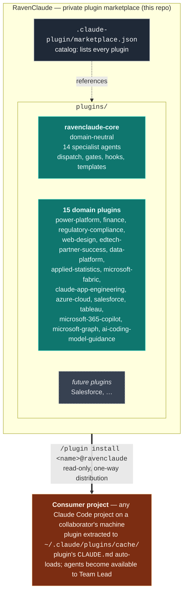

# RavenClaude — Architecture

This repo is a **private Claude Code plugin marketplace**. Each plugin inside it bundles a set of agents, skills, hooks, rules, and templates that a consumer project can install through Claude Code's native `/plugin marketplace add` mechanism. The repo itself isn't loaded into consumer projects — only individual plugins are.

> **Audience for this doc:** anyone working *on* the marketplace (adding a plugin, changing a plugin, reviewing a PR). For instructions on *installing* the plugins as a consumer, see the root [`README.md`](../README.md). For team rules that ship inside `ravenclaude-core`, see [`plugins/ravenclaude-core/CLAUDE.md`](../plugins/ravenclaude-core/CLAUDE.md).

---

## The marketplace model



**One-way distribution.** A consumer's `marketplace update` pulls the latest version from this repo into their local cache. The consumer cannot push back — their changes stay on their machine. The feedback path (lessons, fixes, new patterns) is the PR flow documented in [`CONTRIBUTING.md`](../CONTRIBUTING.md).

---

## Why plugins, not Expert repos

An earlier iteration of this project planned a "central hub + sibling Expert repos" pattern (RavenClaude as the hub, with separate `PowerPlatformExpert`, `SalesforceExpert` repos cloned alongside consumer projects). That model has been replaced by Claude Code's native plugin marketplace, which gives us the same separation with three concrete advantages:

| | Old "sibling Expert repos" model | Plugin marketplace model (current) |
|---|---|---|
| **Distribution** | Each consumer project's devcontainer clones each repo to a known sibling path | `/plugin install <name>@ravenclaude` — one command per plugin |
| **Updates** | Manual `git pull` in each cloned sibling | `/plugin marketplace update ravenclaude` updates all plugins at once |
| **Discovery** | Consumer has to know which Experts to clone | Claude Code surfaces all available plugins in `/plugin` |
| **Activation** | Consumer's `CLAUDE.md` has to opt in by referencing paths | Plugin's own `CLAUDE.md` auto-loads when active |
| **Versioning** | Implicit via git SHA | Explicit `version` field in each `plugin.json`; consumers can pin |

Domain separation is still a first-class concern — it just lives in *separate plugins inside this repo* rather than separate repos. The rule from the old architecture ("Power Platform specifics don't pollute domain-neutral patterns") still holds; it's now enforced by `plugins/ravenclaude-core/` vs. `plugins/power-platform/` rather than by `RavenClaude/` vs. `PowerPlatformExpert/`.

---

## What goes where

The marketplace contains a domain-neutral core plus one plugin per significant domain. Anything domain-specific lives in its own plugin, never in `ravenclaude-core`.

| Lives in `plugins/ravenclaude-core/` | Lives in a domain plugin (e.g. `plugins/power-platform/`) |
|---|---|
| Generic agent role definitions (architect, coder, tester, reviewer, designer, documentarian, project-manager, prompt-engineer, deep-researcher, partner-success-manager, etc.) | Domain-specific agent definitions (`power-fx-engineer`, `flow-engineer`, `dataverse-architect`, `fabric-architect`, `claude-solution-architect`, `azure-architect`, `tableau-viz-engineer`, `graph-api-engineer`, … across the 15 domain plugins) |
| Cross-domain skills (dispatch playbook, worktree helpers, generic code-review patterns) | Domain-specific skills (Power Platform's `dataverse-web-api`, `pcf-controls`, `power-apps-code-apps`, etc.) |
| Cross-domain hooks (format-on-write, guard-destructive, remind-tests) | Domain-specific hooks (only if a hook is meaningless outside that domain) |
| Generic rules (coding standards, security baseline, git workflow, agent collaboration) | Domain-specific rules (Power Platform's "solutions, always" and "managed in test+prod" opinions) |
| Generic templates (memos, runbooks, design specs, RAID logs, partner-success artifacts) | Domain-specific templates (a Dataverse data model spec, a flow run-history triage template, etc.) |

**Rule of thumb:** if it would be relevant to a Salesforce engagement AND a Power Platform engagement AND an iOS app project, it belongs in `ravenclaude-core`. If it only matters for one of them, it belongs in that one's plugin.

---

## Folder layout

```
RavenClaude/
├── .claude-plugin/
│   └── marketplace.json           ← catalog: lists every plugin in this marketplace
│
├── plugins/
│   ├── ravenclaude-core/
│   │   ├── .claude-plugin/plugin.json   ← manifest (name, version, author)
│   │   ├── CLAUDE.md                    ← team constitution that auto-loads
│   │   ├── agents/                      ← 14 specialist agent files
│   │   ├── skills/                      ← dispatch playbook, worktree helpers, etc.
│   │   ├── hooks/                       ← format-on-write, guard-destructive, remind-tests
│   │   ├── rules/                       ← coding-standards, security, git-workflow, agent-collab
│   │   └── templates/                   ← memos, runbooks, RAID logs, partner-success artifacts
│   │
│   └── power-platform/
│       ├── .claude-plugin/plugin.json   ← also declares bundled pbix-mcp MCP server
│       ├── CLAUDE.md
│       ├── NOTICE.md                    ← MIT attribution for imported skills + pbix-mcp
│       ├── agents/                      ← 11 specialist agent files
│       ├── hooks/                       ← check-house-opinions (advisory)
│       └── skills/                      ← 13 skills (9 imported Daniel Kerridge MIT + 4 in-house)
│
├── .claude/                       ← config for working ON this repo itself (NOT shipped)
│   └── settings.json              ← permissions + hooks for marketplace dev
│
├── .github/
│   └── pull_request_template.md   ← auto-loaded PR form for all contributions
│
├── docs/                          ← meta-repo docs (not shipped to consumers)
│   ├── architecture.md            ← this file
│   ├── access.md                  ← collaborator record
│   ├── best-practices/            ← cross-domain rules (with _TEMPLATE.md)
│   └── memory-bank/
│       ├── lessons-learned.md     ← reverse-chronological trial-and-error log
│       └── decision-log.md        ← reverse-chronological architectural decisions
│
├── CLAUDE.md                      ← working-on-the-marketplace constitution
├── CONTRIBUTING.md                ← how collaborators propose changes
└── README.md                      ← install instructions for consumers
```

Key boundary: **the `docs/` tree, `.claude/`, `.github/`, `CLAUDE.md`, `CONTRIBUTING.md`, and `README.md` at the repo root are NOT shipped to consumers.** They're meta-repo content — only the contents of `plugins/<plugin-name>/` are extracted when a consumer installs a plugin.

---

## How a consumer uses the marketplace

```bash
# In any Claude Code project on a collaborator's machine:
/plugin marketplace add mcorbett51090/RavenClaude
/plugin install ravenclaude-core@ravenclaude
/plugin install power-platform@ravenclaude     # if they need it
/reload-plugins
```

After install, each plugin's `CLAUDE.md` auto-loads into the consumer's Claude Code session. Agents defined under `plugins/<name>/agents/` become available to the Team Lead for dispatch. Skills under `plugins/<name>/skills/` are consulted on demand. Hooks, rules, and templates apply per the plugin's own configuration.

To pick up new versions:

```bash
/plugin marketplace update ravenclaude
/reload-plugins
```

The repo is private — see [`docs/access.md`](access.md) for the current collaborator list and the access-model rationale.

---

## How knowledge is captured

The marketplace has three layers of "memory," each with a different purpose and a different write path:

| Layer | Where it lives | Who writes to it | What goes here |
|---|---|---|---|
| **Consumer's auto-memory** | `~/.claude/projects/<project>/memory/` on the consumer's machine | The consumer's Claude session | Session-local context: user preferences, current task state, project facts. Private to that consumer. |
| **Plugin lessons** (cross-domain) | `docs/memory-bank/lessons-learned.md` (this repo) | Collaborators via PR | Cross-domain trial-and-error findings — *applies to any Claude work*. Reverse-chronological, newest first. |
| **Plugin best-practices** (cross-domain) | `docs/best-practices/<slug>.md` (this repo) | Collaborators via PR | Cross-domain rules with rationale + how-to-apply + provenance. One file per rule. Use [`_TEMPLATE.md`](best-practices/_TEMPLATE.md). |

**Domain-specific lessons** (e.g. a Power Platform-specific Dataverse rule) belong inside the relevant plugin's folder — for example, `plugins/power-platform/skills/<domain-skill>/resources/<rule>.md` — not in this repo's domain-neutral `docs/`.

**Flow when Claude (in any consumer project) discovers something non-obvious:**

1. Save in that project's auto-memory immediately so the current session benefits.
2. Decide where it generalizes:
   - **Specific to one domain** → goes inside that domain's plugin via a PR to this repo (`plugins/<plugin>/...`), and the relevant plugin's version is bumped.
   - **Applies across domains** → goes here, in `docs/memory-bank/lessons-learned.md` or `docs/best-practices/`, via a PR.
   - **Both** → write the cross-domain rule here, write the domain-specific deep-dive in the plugin, cross-link them.
3. Cite the propagation explicitly in the response so the user can verify the trail.

The PR flow itself is in [`CONTRIBUTING.md`](../CONTRIBUTING.md).

---

## Adding a new plugin

When a new domain matures past the point where it deserves its own plugin (Salesforce, finance, EdTech, etc.):

1. Create `plugins/<plugin-name>/.claude-plugin/plugin.json` with `name`, `description`, `version`, `author`, optional `license` and `keywords`.
2. Add `agents/`, `skills/`, `hooks/`, `rules/`, `templates/` subdirectories — only the ones the plugin actually needs.
3. Add `plugins/<plugin-name>/CLAUDE.md` as the team constitution that ships with the plugin.
4. Append the new plugin to the `plugins[]` array in `.claude-plugin/marketplace.json`.
5. If the plugin imports third-party content, add `plugins/<plugin-name>/NOTICE.md` with the license + attribution (see `plugins/power-platform/NOTICE.md` for the canonical form).
6. Open a PR following the **Marketplace / meta change** section of the PR template.
7. After merge, test the install from a separate Claude Code project: `/plugin marketplace update ravenclaude` then `/plugin install <plugin-name>@ravenclaude`.

The existing plugins are the reference implementations — `ravenclaude-core` for a "team patterns" plugin, `power-platform` for a "domain specialist team plus imported skills" plugin.

---

## Status

**Active plugins (166).** The table below is the canonical roster; **per-plugin versions live in [`../.claude-plugin/marketplace.json`](../.claude-plugin/marketplace.json)** (the single source of truth, CI-gated for catalog↔plugin.json parity) and the generated portal [`../index.html`](../index.html) — they are deliberately not duplicated here to avoid drift. A CI check (`scripts/check-marketplace-claims.py`) asserts every `plugins/*/` directory appears in this table.

| Plugin | What it is |
|---|---|
| [`creator-economy-operations`](../plugins/creator-economy-operations/) | Creator-economy business operations team — 2 agents (creator-business-strategist, content-and-audience-manager) for running a creator/media business: the monetization mix (ads, sponsorships, memberships & subscriptions, products/courses, affiliate, services), the platform portfolio (owned vs rented, platform-risk diversification, repurposing), audience funnel & LTV, sponsorship valuation & rate cards, content ops, community & retention, and the creator P&L/MRR. 3 skills, a knowledge bank (a Mermaid monetization-mix tree + a dated 2026 platform/payout/rate reference), 7 best-practices. ADVISORY operations knowledge, not legal/tax/financial advice; payout rules, rate norms, and FTC/ASA disclosure specifics are volatile + jurisdictional, retrieval-dated + verify-at-use; no audience PII. Distinct from `marketing-operations`, `developer-relations`, and `ecommerce-dtc`. Requires ravenclaude-core@>=0.7.0. |
| [`hardware-electronics-engineering`](../plugins/hardware-electronics-engineering/) | Hardware / electronics engineering team — 2 agents (hardware-systems-architect, pcb-design-engineer) for the BOARD embedded firmware runs on: architecture & build-vs-buy (module vs custom PCB), MCU/component selection + supply-aware BOM, power architecture (LDO-vs-switcher), schematic capture, PCB layout (stack-up, impedance, decoupling, grounding), signal & power integrity, DFM/DFA/DFT, and bring-up. 3 skills, a knowledge bank (a Mermaid module-vs-custom-PCB tree + a dated 2026 EDA/fab/compliance reference), 7 best-practices. ENGINEERING decision-support, not a certification/safety-sign-off authority; component specs, fab/DFM rules, and regulatory thresholds are volatile + vendor/jurisdiction-specific, retrieval-dated + verify-at-use; datasheets read at the operating point. Distinct from `embedded-iot-engineering` (firmware) and `robotics-autonomous-systems-engineering` (the robot). Requires ravenclaude-core@>=0.7.0. |
| [`graphql-engineering`](../plugins/graphql-engineering/) | GraphQL-engineering team — 3 agents (graphql-schema-architect, graphql-server-engineer, graphql-security-governance-engineer) for the three engines of a GraphQL surface: schema design & evolution (client-driven type modeling, deliberate nullability, Relay cursor pagination, mutation/error shape, schema-first vs code-first, monolith vs federation vs stitching, additive non-breaking evolution), server & resolvers (killing N+1 with DataLoader batching + per-request caching, selection-set-aware fetching, subscriptions, APQ/response caching), and security & governance (query cost/depth budgets before execution, field-level authorization, persisted/trusted operations, introspection hardening, rate/batch limits, error hygiene). Ships 4 skills, a decision-tree knowledge bank (4 Mermaid trees + a dated 2026 reference), 5 best-practices, 2 templates, 2 commands. Engineering judgment, not a security certification; GraphQL library/federation/spec-feature specifics are volatile — every version carries a retrieval date + [verify-at-use]; no PII. Requires ravenclaude-core@>=0.7.0. |
| [`med-spa-aesthetics`](../plugins/med-spa-aesthetics/) | Medical-aesthetics (med spa) practice operations team — 3 agents (med-spa-operations-lead, patient-coordinator-lead, aesthetics-compliance-advisor) across the three engines of a med spa: the practice P&L (injector/room utilization, service mix across injectables / devices / skincare / memberships, device payback, pricing per provider-hour), the patient front line (consult-to-treatment conversion, no-show / deposit, rebooking on the clinical cadence, memberships), and operational compliance structure (scope of practice, good-faith exam / supervision, consent and adverse-event protocols). Operations and financial decision-support, not legal, tax, or medical advice; no clinical/legal determinations and no patient PHI/PII; benchmarks carry a retrieval date + verify-at-use; scope/supervision rules are state-specific and flagged for a licensed professional. Ships 4 skills, a decision-tree knowledge bank (4 Mermaid trees + a dated 2026 reference), 5 best-practices, 2 templates, and 2 commands. Requires ravenclaude-core@>=0.7.0. |
| [`craft-beverage-operations`](../plugins/craft-beverage-operations/) | Craft-beverage (winery / brewery / distillery) operations team — 3 agents (craft-beverage-operations-lead, tasting-room-and-club-manager, beverage-distribution-compliance-advisor) across the three engines of a producer: production & cost (batch/yield planning, COGS per unit, tank/barrel/time capacity, packaging, channel margin mix), the tasting room & club (throughput and conversion, club/membership revenue and churn, DTC, events), and distribution & compliance (three-tier vs self-distribution economics, distributor relationships, TTB / state licensing and excise concepts). Operations and financial decision-support, not legal, tax, or regulatory advice; no licensing/excise determinations and no PII; benchmarks carry a retrieval date + verify-at-use; three-tier / TTB / state-licensing / excise rules are jurisdiction-specific and flagged for a licensed professional. Ships 4 skills, a decision-tree knowledge bank (4 Mermaid trees + a dated 2026 reference), 5 best-practices, 2 templates, and 2 commands. Requires ravenclaude-core@>=0.7.0. |
| [`computer-vision-engineering`](../plugins/computer-vision-engineering/) | Computer-vision engineering team — 3 agents for a production vision build: cv-systems-architect (task framing across classification / detection / segmentation / OCR / tracking / VLM, data & annotation strategy, build-vs-API and deployment-target choice, eval-metric design — mAP / IoU / precision-recall), cv-model-engineer (dataset curation, augmentation, transfer learning, model selection across YOLO / DETR / SAM / CLIP / ViT, active learning, the eval harness, drift), and vision-deployment-engineer (quantization / distillation, ONNX / TensorRT / CoreML / TFLite export, edge/embedded targets, streaming-video pipelines, latency). Vision-specific vs the MLOps-broad ml-engineering. Ships 4 skills, a knowledge bank (4 Mermaid decision trees + a dated 2026 reference), 5 best-practices, 2 templates, 2 commands. Engineering judgment, not a benchmark verdict; model/hardware/runtime specifics carry a retrieval date + [verify-at-use]; no PII, no image data stored. Requires ravenclaude-core@>=0.7.0. |
| [`conversational-ai-voice-engineering`](../plugins/conversational-ai-voice-engineering/) | Conversational voice-AI engineering team — 3 agents for production real-time voice agents: voice-ai-architect (cascade STT->LLM->TTS vs speech-to-speech, the latency budget, turn-taking / barge-in / endpointing, channel choice, build-vs-platform across Twilio / Vapi / Retell / LiveKit / Pipecat, guardrails), speech-pipeline-engineer (ASR & TTS provider choice, streaming transcription, VAD/endpointing, diarization, prosody/SSML, codecs, noise, WER), and dialog-and-integration-engineer (state, LLM orchestration and mid-call tool calling, SIP/PSTN telephony, IVR/DTMF, call routing, flow testing and eval). Ships 4 skills, a knowledge bank (4 Mermaid decision trees + a dated 2026 reference), 5 best-practices, 2 templates, 2 commands. Engineering judgment, not legal/compliance advice; the ASR/TTS/platform/telephony landscape is volatile — versions and latency numbers carry a retrieval date + [verify-at-use]; no PII, and call audio/transcripts are sensitive. Requires ravenclaude-core@>=0.7.0. |
| [`streaming-media-engineering`](../plugins/streaming-media-engineering/) | Streaming-media (video/audio) engineering team — 3 agents for a streaming build: media-streaming-architect (VOD vs live, protocol choice across HLS / MPEG-DASH / CMAF / WebRTC / LL-HLS, packaging + origin/edge, single vs multi-CDN, DRM across Widevine / FairPlay / PlayReady, ABR-ladder philosophy, cost), transcoding-pipeline-engineer (codec choice across H.264 / HEVC / AV1 / VP9, FFmpeg pipelines, per-title & ABR-ladder encoding, GPU vs CPU, CMAF packaging, captions, audio & loudness), and playback-and-delivery-engineer (player integration across hls.js / dash.js / Shaka / ExoPlayer / AVPlayer, ABR tuning, QoE metrics, low-latency live, client DRM, CDN cache tuning). Ships 4 skills, a knowledge bank (4 Mermaid decision trees + a dated 2026 reference), 5 best-practices, 2 templates, 2 commands. Engineering judgment, not legal/DRM-licensing advice; codec/protocol/CDN/DRM/player specifics carry a retrieval date + [verify-at-use]; no PII. Requires ravenclaude-core@>=0.7.0. |
| [`ar-vr-xr-engineering`](../plugins/ar-vr-xr-engineering/) | AR/VR/XR spatial-computing engineering team — 3 agents (xr-architect-lead, xr-interaction-engineer, spatial-rendering-engineer) for the three engines of an XR build: system architecture (target selection across standalone / PC-VR / WebXR / mobile-AR, engine choice across Unity / Unreal / native / WebXR, OpenXR-first strategy, perf-budget and comfort/safety architecture), interaction (hand / controller / gaze input, sim-sickness-aware locomotion, 3D UI, grab/physics, accessibility), and spatial rendering & performance (frame budget, reprojection, foveated rendering, occlusion/anchors/passthrough for AR, draw-call batching, thermal). Ships 4 skills, a decision-tree knowledge bank (4 Mermaid trees + a dated 2026 reference), 5 best-practices, 2 templates, 2 commands. Engineering judgment, not legal/safety-certification advice; the device/runtime/engine landscape is volatile — every version, headset spec, and per-eye perf number carries a retrieval date + [verify-at-use]; no PII. Requires ravenclaude-core@>=0.7.0. |
| [`robotics-autonomous-systems-engineering`](../plugins/robotics-autonomous-systems-engineering/) | Robotics & autonomous-systems engineering team — 3 agents (robotics-architect-lead, ros-motion-planning-engineer, perception-and-autonomy-engineer) for the three engines of a robot program: the system architecture (ROS 2 computation graph & DDS, compute/sensor selection, the real-time vs non-real-time split, safety architecture, sim-to-real strategy), the motion stack (ROS 2 nodes/topics/actions, MoveIt/Nav2 motion planning, kinematics, PID/MPC control loops, coordinate frames/TF), and the perception & autonomy stack (sensor fusion, SLAM, EKF state estimation, object detection, localization, and behavior-tree / state-machine autonomy). Ships 4 skills (ros2-architecture-and-dds, motion-planning-and-control, perception-and-state-estimation, sim-to-real-and-safety), a decision-tree knowledge bank (4 Mermaid trees + a dated 2026 reference), 5 best-practices, 2 templates, and 2 commands. Engineering decision-support, not legal/functional-safety certification advice: functional-safety standard pointers (e.g. ISO 10218, ISO 13849), DDS/distro landscape, and sensor/compute specifics are volatile and carry a retrieval date + verify-at-use; no PII. Seams to embedded-iot-engineering (firmware/HAL), ml-engineering (perception model training), and performance-engineering. Requires ravenclaude-core@>=0.7.0. |
| [`travel-agency-tour-operations`](../plugins/travel-agency-tour-operations/) | Travel agency / tour-operator operations team — 3 agents (travel-agency-operations-lead, itinerary-and-booking-specialist, supplier-and-commission-manager) for the three engines of a leisure travel business: agency P&L and revenue model (commission vs service fee vs markup, supplier mix, host splits, E&O risk), itinerary design and multi-supplier booking (FIT vs group, quoting, changes, documentation, service recovery), and supplier + commission management (net vs commissionable, BSP/ARC settlement, commission tracking and recovery, consortia). ADVISORY operations knowledge, not legal, tax, or financial advice; supplier fare rules, commission norms, cancellation penalties, and seller-of-travel requirements are volatile and supplier-/jurisdiction-specific — each carries a retrieval date + verify-at-use; no traveler PII. 4 skills, a decision-tree knowledge bank (4 Mermaid trees + a dated 2026 reference), 5 best-practices, 2 templates, 2 commands. Requires ravenclaude-core@>=0.7.0. |
| [`higher-education-administration`](../plugins/higher-education-administration/) | Higher-education administration operations team — 3 agents (higher-ed-administration-lead, enrollment-management-strategist, student-success-advisor) for the three engines of a college or university's administrative operation: institutional strategy (enrollment strategy, the budget/net-tuition-revenue model, retention/completion, cross-functional coordination across admissions/registrar/financial-aid/student-success, accreditation), enrollment management (the inquiry->apply->admit->yield->melt funnel, yield and discount-rate modeling, financial-aid leveraging, recruitment), and student success (retention/persistence, early-alert, advising, at-risk intervention, completion, DFW-course analysis). Ships 4 skills, a decision-tree knowledge bank (4 Mermaid trees + a dated 2026 reference), 5 best-practices, 2 templates, and 2 commands. ADVISORY operations knowledge, not legal, financial-aid-compliance, or academic-policy advice; volatile specifics (funnel benchmarks, discount-rate norms, retention/persistence metric definitions) carry a retrieval date + verify-at-use; FERPA-aware — no student PII, the agents work in cohorts, funnels, and policy, never individual records. Requires ravenclaude-core@>=0.7.0. |
| [`childcare-early-education`](../plugins/childcare-early-education/) | Childcare / early-education center operations team — 3 agents (childcare-center-lead, enrollment-and-family-manager, classroom-ratio-compliance-advisor) for the three engines of an early-education center: the operations & tuition model (enrollment/waitlist, capacity vs licensed ratios, staffing to ratio, family retention, P&L), the enrollment & family funnel (tour-to-enroll conversion, waitlist, paperwork, family communication, tuition & CCDF/state subsidy billing), and ratio & licensing compliance (ratio and group-size by age, licensing readiness, staff qualifications, health & safety, incident documentation). 4 skills, a decision-tree knowledge bank (4 Mermaid trees + a dated 2026 reference), 5 best-practices, 2 templates, 2 commands. ADVISORY operations knowledge, not legal, licensing, or financial advice; state-specific ratios, group sizes, and subsidy rules are volatile and carry a retrieval date + verify-at-use; no child or family PII. Requires ravenclaude-core@>=0.7.0. |
| [`title-escrow-settlement`](../plugins/title-escrow-settlement/) | Title, escrow, and settlement operations team — 3 agents (title-escrow-lead, title-examiner, closing-settlement-coordinator) for the three engines of a settlement operation: the order-to-policy workflow (open->search->exam->clear->close->record->policy) with ALTA/CFPB/TRID coordination and wire-fraud controls; title search and examination (chain of title, liens/encumbrances, the commitment, exceptions/requirements, curative); and escrow settlement (CD/statement coordination, closing/signing, good-funds discipline, disbursement, recording, funding, and trust-account protection). ADVISORY operations knowledge, not legal/title-underwriting/financial advice; jurisdiction- and underwriter-specific rules, ALTA/CFPB/TRID specifics, and recording requirements are volatile and carry a retrieval date + verify-at-use; wire-fraud sensitive; no PII. 4 skills, decision-tree knowledge bank (4 Mermaid trees + dated 2026 reference), 5 best-practices, 2 templates, 2 commands. Requires ravenclaude-core@>=0.7.0. |
| [`fitness-studio-gym-operations`](../plugins/fitness-studio-gym-operations/) | Gym / boutique-fitness-studio operations team — 3 agents (fitness-studio-operations-lead, membership-retention-manager, class-schedule-coach-ops) for the three engines of a fitness business: the membership P&L (growth, churn/retention, member LTV, utilization, ancillary revenue from PT, retail, and café), the retention machine (onboarding, attendance triggers, churn prediction and saves, win-back, referral, pricing/tiers), and the class grid (scheduling on demand, instructor utilization and pay, capacity/fill, waitlist, no-show, sub coverage). ADVISORY operations knowledge, not legal/financial/medical advice; volatile specifics (churn norms, LTV math, class-fill and instructor-pay benchmarks) carry a retrieval date + verify-at-use; no member PII. Ships 4 skills, a decision-tree knowledge bank (4 Mermaid trees + a dated 2026 reference), 5 best-practices, 2 templates, 2 commands. Seams to retail-store-operations, restaurant-operations, and people-operations-hr. Requires ravenclaude-core@>=0.7.0. |
| [`salon-spa-operations`](../plugins/salon-spa-operations/) | Salon / spa / barbershop operations team — 3 agents (salon-spa-operations-lead, front-desk-booking-manager, stylist-chair-economics-advisor) for the three engines of a service-chair business: the owner-level P&L (chair and room utilization, service mix, retail attach, membership and package revenue, the staffing model), the front desk (online booking, no-show / late-cancel policy and deposits, rebooking at checkout, waitlist, reminders), and provider economics (commission tiers vs booth rent vs hourly, back-bar / product cost, prebooking, clientele building and retention). Operations and financial decision-support, not legal, tax, or employment-classification advice; volatile benchmarks (utilization, retail-attach, no-show norms) carry a retrieval date + verify-at-use; no client PII. Ships 4 skills, a decision-tree knowledge bank (4 Mermaid trees + a dated 2026 reference), 5 best-practices, 2 templates, and 2 commands. Requires ravenclaude-core@>=0.7.0. |
| [`auto-repair-shop-operations`](../plugins/auto-repair-shop-operations/) | Independent auto-repair shop operations team — 3 agents (auto-repair-shop-lead, service-advisor-estimator, technician-workflow-manager) for a repair shop's three engines: shop P&L economics (effective labor rate, tech productivity-efficiency-proficiency, labor + parts gross profit, comeback rate, car count); the service-advisor front counter (write-up, digital vehicle inspection, inspection-to-estimate, approval, declined-work follow-up, ethical upsell); and technician workflow (dispatch, flat-rate vs actual hours, WIP/RO aging, parts staging, comeback control). Ships 4 skills, a decision-tree knowledge bank (4 Mermaid trees + a dated 2026 reference), 5 best-practices, 2 templates, 2 commands. Operations/financial decision-support, not legal/tax/OEM-warranty advice; labor-rate norms, productivity benchmarks, and parts-matrix figures carry a retrieval date + verify-at-use; no customer PII. Seams to automotive-dealership, fleet-logistics, and skilled-trades-contracting. Requires ravenclaude-core@>=0.7.0. |
| [`residential-real-estate-brokerage`](../plugins/residential-real-estate-brokerage/) | Residential real-estate brokerage operations team — 3 agents (residential-brokerage-lead, listing-and-transaction-coordinator, buyer-agent-advisor) for the engines of a residential brokerage: brokerage/team P&L and the lead-to-close pipeline (commission splits/caps, recruiting & retention, agency/fair-housing compliance, lead-gen), the listing lifecycle plus transaction coordination (CMA, prep, MLS, marketing, contract-to-close timeline, contingencies, deadlines), and buyer representation (needs analysis, showings, offer & negotiation, financing, closing). Ships 4 skills, a decision-tree knowledge bank (4 Mermaid trees + a dated 2026 reference), 5 best-practices, 2 templates, and 2 commands. ADVISORY operations knowledge, not legal/financial/real-estate-license advice; fair-housing sensitive; no client PII; commission norms, contingency periods, and protected-class lists are volatile and jurisdiction-specific — each carries a retrieval date + verify-at-use. Requires ravenclaude-core@>=0.7.0. |
| [`network-engineering`](../plugins/network-engineering/) | Enterprise network layer below the cloud VPC: 2 agents (network-architect, network-operations-engineer) for campus/DC/WAN topology, routing (OSPF/BGP/EIGRP/static) & switching (VLAN/VXLAN/EVPN), IP addressing/IPAM + DNS/DHCP, segmentation + zero-trust (microsegmentation, NAC, SASE/SD-WAN), load balancing, redundancy/HA, and day-2 ops (OSI troubleshooting, reversible change, NetFlow observability). 5 skills, a knowledge bank (4 Mermaid decision trees — topology / routing-protocol / segmentation / OSI triage — + a dated 2026 capability map), 7 best-practices, 3 templates, 1 advisory hook. Design-before-config; protocol-before-vendor. Seams: cloud VPCs → `aws-cloud`/`azure-cloud`/`gcp-cloud`; service mesh → `cloud-native-kubernetes`; security verdicts → `security-engineering`; config-as-IaC → `terraform-iac`. Requires `ravenclaude-core`. |
| [`incident-response-dfir`](../plugins/incident-response-dfir/) | Blue-team DFIR/SOC — 2 agents (dfir-response-lead, detection-and-forensics-engineer): the NIST SP 800-61r2 incident lifecycle, triage & severity, containment, breach coordination + regulatory notification (GDPR 72h), tabletops; detection engineering (SIEM/Sigma mapped to MITRE ATT&CK), threat hunting, evidence acquisition & forensics (RFC 3227 order of volatility, chain of custody), malware triage. 5 skills, a knowledge bank (two Mermaid decision trees + a dated 2026 DFIR tooling map), 5 best-practices, 3 templates, 1 advisory hook. Distinct from `network-engineering` (this is the security-incident lane, not the network layer). Seams: appsec → `security-engineering`; governance/risk → `cybersecurity-grc`; reliability incidents → `observability-sre`; platform abuse → `trust-and-safety`. Inherits `ravenclaude-core` protocols. |
| [`open-source-maintenance`](../plugins/open-source-maintenance/) | Open-source maintenance team — 2 agents (oss-maintainer-strategist, release-and-versioning-engineer) for running a public project people can use, trust, and contribute to: license choice (permissive vs copyleft, dependency compatibility, CLA vs DCO), governance & community-health (CONTRIBUTING / CODE_OF_CONDUCT / GOVERNANCE / SECURITY.md, issue & PR triage + SLAs, the contributor funnel, bus factor, funding), semver + changelogs (Keep a Changelog / Conventional Commits), release automation (release-please / semantic-release / Changesets), deprecation & breaking-change windows, coordinated security releases (private report → CVE/GHSA → disclosure), and supply-chain provenance (SLSA, Sigstore, npm provenance). 5 skills, a knowledge bank (two Mermaid decision trees + community-health + a dated 2026 tooling map), 8 best-practices, 4 templates, 1 advisory hook. Seams: release pipeline → `devops-cicd`; vuln analysis → `security-engineering`; community growth → `developer-relations`; docs craft → `technical-writing-docs`; monorepo/build → `developer-tooling`. Requires `ravenclaude-core`. |
| [`browser-extension-engineering`](../plugins/browser-extension-engineering/) | Browser-extension engineering on Manifest V3: 2 agents (extension-architect, extension-implementation-engineer) for the extension shell — the ephemeral service-worker background (and the MV2→MV3 lifecycle trap), content-script isolation + message passing, the least-privilege permissions/host-permissions model, storage, and the Chrome Web Store / Edge Add-ons / Firefox AMO pipelines + the `chrome.*` vs `browser.*` cross-browser delta. 2 skills (manifest-permissions-audit, store-submission-readiness), a knowledge bank (durable MV3 mechanics + a Mermaid permissions-minimization tree + a dated cross-browser/stores note), 7 best-practices. Sibling of desktop-app-engineering; UI → frontend-engineering; security verdicts → security-engineering. Requires `ravenclaude-core`. |
| [`ravenclaude-core`](../plugins/ravenclaude-core/) | Domain-neutral foundation: 14 specialist agents, 22 skills, the dispatch playbook, 13 hooks, rules, templates; the Capability Grounding Protocol, Structured Output Protocol, the Researcher meta-skill, the comfort-posture dashboard, and the command-review + decision-review tribunal (the Thing). |
| [`itsm-service-management`](../plugins/itsm-service-management/) | IT Service Management (ITIL 4) team — 4 agents (service-management-lead, incident-and-problem-manager, change-and-release-manager, service-desk-and-request-manager) for running IT as a service: the ITIL 4 service value system + right-sized practice selection, incident vs problem vs major-incident handling, change enablement (standard/normal/emergency + the CAB) and release management, and the service desk (request fulfillment, SLAs/OLAs/UCs, knowledge & self-service, the service catalog, the CMDB). 5 skills, a knowledge bank (Mermaid decision trees + an ITIL 4 practice reference + a dated 2026 tooling map), 8 best-practices, 4 templates, 4 commands, 1 advisory hook. Seams: engineering incident/SRE/observability/chaos → `observability-sre` (ITIL operating model here vs engineering reliability practice there — a prod outage is usually both); CI/CD deployment → `devops-cicd`; security/GRC → `cybersecurity-grc`; asset cost → `finops-cloud-cost`. Inherits `ravenclaude-core` protocols. |
| [`legacy-modernization`](../plugins/legacy-modernization/) | Legacy modernization team — 4 agents (modernization-strategist, codebase-archaeologist, refactoring-engineer, migration-engineer) for safely changing a working-but-aging system: the 6 R's assessment, code archaeology + seam-finding, characterization tests before any edit, the strangler-fig + anti-corruption-layer migration, and a cutover with a tested rollback. 5 skills, a knowledge bank (Mermaid decision trees + a dated 2026 capability map + a pattern-catalog reference), 8 best-practices, 4 templates, 4 commands, 1 advisory hook. Seams: target architecture → `backend-engineering`; schema-migration DDL → `database-engineering`; cutover automation → `devops-cicd`; test-suite buildout → `qa-test-automation`. Inherits `ravenclaude-core` protocols. |
| [`power-platform`](../plugins/power-platform/) | Microsoft Power Platform: 11 specialist agents, 18 skills, an 8-check house-opinion hook, a knowledge bank (PA-flow recovery, Dataverse token acquisition, PCF React/Fluent, Copilot agents 2026, managed environments, Power Pages 2026), and the bundled pbix-mcp server. |
| [`finance`](../plugins/finance/) | Corporate finance & FP&A: 7 specialist agents, 9 skills, 8 templates, 1 advisory anti-pattern hook, 1 knowledge doc. Inherits `ravenclaude-core` protocols. |
| [`regulatory-compliance`](../plugins/regulatory-compliance/) | Financial-regulatory: 6 specialist agents, 9 skills, 8 templates, 1 defensive PII-scrub hook, 1 knowledge doc. BMA field-experience positioning. |
| [`web-design`](../plugins/web-design/) | Web design & build: 7 specialist agents, 10 skills (incl. Fluent UI v9 + React implementation), 8 templates, 1 advisory hook, a 7-doc knowledge bank (2026 stacks/CSS/web-platform/AEO-GEO/design-systems/Fluent). |
| [`edtech-partner-success`](../plugins/edtech-partner-success/) | EdTech Partner Success Manager team: 6 specialist agents, 12 skills, 16-doc knowledge bank, 15 templates, 1 advisory PSM-anti-pattern hook. Segment-agnostic (K-12 / higher-ed / corp L&D). |
| [`data-platform`](../plugins/data-platform/) | Non-Microsoft / SMB embedded-analytics: 4 specialist agents, 12 skills (incl. cross-system-identity-resolution), 12 templates, 1 advisory hook, 17-doc knowledge bank (Supabase/Neon/RDS, Airbyte/Fivetran, Evidence/Superset/Metabase/Cube, + Planhat/Intercom/Slack-as-source & Sigma-when-already-owned), 21 best-practices. Opinionated against per-viewer-priced BI; reciprocal seam with `microsoft-fabric`. |
| [`customer-success-analytics`](../plugins/customer-success-analytics/) | Domain-neutral CS-health analytics layer ON TOP of data-platform: 2 specialist agents (cs-analytics-architect, churn-signal-analyst), 2 skills (health-tier-design, renewal-workflow-design), 2-doc knowledge bank, cs-health-data-model template. Owns the metrics/signals/transparent-risk-tier layer (what to measure & why); routes pipeline/warehouse/identity-resolution to data-platform. Seams: salesforce / tableau / edtech-partner-success. |
| [`applied-statistics`](../plugins/applied-statistics/) | "Is this difference/trend REAL?" — 1 specialist (applied-statistician), 5 skills, 5-doc knowledge bank, 4 templates, 1 advisory hook. Seams with data-platform ("is it correct?" vs "is it real?"). |
| [`process-improvement`](../plugins/process-improvement/) | Lean Six Sigma Black-Belt capability: 2 agents (lean-six-sigma-blackbelt, process-analyst), 6 skills (DMAIC charter / process-mapping / root-cause / capability-&-SPC / lean-waste / control-plan), 5 templates, 7 best-practices, 3-doc knowledge bank with 6 web-verified Mermaid decision trees. Analyzes & improves any operational process (DMAIC, waste removal, SPC, control plans). Load-bearing seam to `applied-statistics` for inferential stats (hypothesis tests/DOE/Gage R&R); DMAIC delivery seams to `project-management`. |
| [`auth-identity`](../plugins/auth-identity/) | End-user authentication & identity: 2 agents (auth-architect, auth-implementation-engineer), 7 skills, 4 templates, 5 best-practices, 4-doc web-verified knowledge bank with 5 Mermaid decision trees. A variety of login methods (Google/Apple/Microsoft/GitHub SSO + magic-link/passkeys/email-password) via managed auth (Supabase-Auth lean) for a web app / API / dashboard. Load-bearing boundary: AUTHENTICATES the person; `data-platform` AUTHORIZES the data (RLS/embed-JWT). Seams: `azure-cloud` (Entra), `web-design` (login UI), `ravenclaude-core/security-reviewer` (mandatory auth-code review). |
| [`microsoft-fabric`](../plugins/microsoft-fabric/) | Microsoft Fabric: 7 agents (architect / lakehouse / warehouse / data-factory / realtime-intelligence / semantic-model / admin), 9-doc citation-grounded knowledge bank (two Mermaid decision trees + a dated 2026 capability map), 6 templates, 1 advisory hook. Reciprocal seams with `data-platform`, `power-platform/power-bi-engineer`, `azure-cloud`. |
| [`claude-app-engineering`](../plugins/claude-app-engineering/) | Building apps on the Claude API + Agent SDK + MCP: 6 agents, 13-doc knowledge bank (build-surface / caching / tools / MCP / Agent SDK / evals / RAG / prompt-engineering / orchestration / context-engineering / FinOps), 6 templates, 1 advisory hook. Ships no security/architect clone — escalates to core. |
| [`azure-cloud`](../plugins/azure-cloud/) | Azure infrastructure & platform: 7 agents (architect / bicep-iac / entra-identity / network / app-platform / integration / ops), 10-doc knowledge bank (CAF landing zones, IaC, compute + integration decision trees, Entra, networking, observability/FinOps, AI Foundry, dated 2026 capability map), 6 templates, 1 advisory hook. Reciprocal seams across power-platform / fabric / claude-app-engineering / web-design. |
| [`salesforce`](../plugins/salesforce/) | Salesforce platform: 5 agents (apex-engineer / flow-automation-architect / agentforce-architect / salesforce-platform-architect / salesforce-reviewer), 9-doc citation-grounded knowledge bank (9 Mermaid decision trees: governor limits, automation density, trigger framework, async, sharing/security, LDV, packaging/DevOps, integration, Agentforce determinism), 5 skills, 5 templates, 1 advisory hook (15 house opinions). Forked review rubric; seams to azure-cloud / data-platform / web-design / core. |
| [`microsoft-365-copilot`](../plugins/microsoft-365-copilot/) | M365 Copilot extensibility & administration: 6 agents (copilot-extensibility-architect / declarative-agent-engineer / graph-connector-engineer / api-plugin-engineer / agents-sdk-engineer / copilot-admin-governance), 9-doc citation-grounded knowledge bank (two Mermaid decision trees: agent-platform routing + grounding-source), 5 skills, 5 templates, 1 advisory hook (15 house opinions). Disjoint from power-platform's Copilot Studio coverage; seams to power-platform / claude-app-engineering / azure-cloud / core. |
| [`tableau`](../plugins/tableau/) | Tableau analytics: 3 agents (tableau-viz-engineer / tableau-data-architect / tableau-admin) covering VizQL & calculations (LOD/table-calcs), data modeling (relationships vs joins vs blends, extracts vs live), workbook performance, Tableau Prep, Server/Cloud governance & RLS, content ALM, embedding (Connected Apps/JWT), and the Pulse/Tableau-Next surface. 26-rule best-practices library + 3 decision-tree knowledge files (15 Mermaid trees, dated 2026-05-30). Seams: salesforce (source data/CRM Analytics) / data-platform / microsoft-fabric / power-platform-power-bi (comparison) / core (RLS+embedding-auth review). |
| [`microsoft-graph`](../plugins/microsoft-graph/) | Microsoft Graph developer surface: 3 agents (graph-api-engineer / graph-identity-engineer / graph-workloads-engineer) covering OData query/paging/`$batch`/delta + throttling, Entra app-registration & delegated-vs-application permissions/consent/auth-flows/least-privilege, and workloads (mail/calendar, Teams, files, users/groups, change-notification subscriptions). 18-rule best-practices library + 3 decision-tree knowledge files (13 Mermaid trees, dated 2026-05-30). Cross-links rather than duplicates: Copilot connectors → microsoft-365-copilot, tenant identity → azure-cloud; security/permission verdicts → core. |
| [`ai-coding-model-guidance`](../plugins/ai-coding-model-guidance/) | Non-Claude AI-coding-tool model selection: 3 agents (copilot-model-strategist / codex-model-strategist / grok-model-strategist) over one dated, citation-grounded lineup (`knowledge/cross-tool-model-lineup-2026.md`) covering GitHub Copilot's picker (completions/chat/coding-agent/cloud-agent/mobile + org model rules), OpenAI Codex (CLI/cloud model + reasoning level), and xAI Grok (Grok 4.x + the grok-code-fast-1 retirement). Vendor-neutral decision tree + right-sizing + closed-world anti-hallucination rule; `check-lineup-citations.py` gates the volatile numbers. Seams to claude-app-engineering for Claude models. |
| [`project-management`](../plugins/project-management/) | Project & delivery management: 4 agents (delivery-lead / scrum-master / risk-and-raid-analyst / stakeholder-comms-lead) across the predictive (PMBOK/PMP) and agile (Scrum/Kanban) tracks plus hybrid — baselines + earned value, sprint facilitation, scored qual+quant risk registers, stakeholder/PMO governance. A predictive-vs-agile-vs-hybrid decision tree + a 3-rule best-practices library. **Deepens — does not replace —** `ravenclaude-core/project-manager` (the lightweight RAID/status-hygiene default); the litmus test is hygiene → core, running the project → here (the house-rule carve-out). Seams: prose polish → core/documentarian; system design → core/architect; domain delivery specifics → the owning domain plugin. |
| [`team-portfolio`](../plugins/team-portfolio/) | Centralized multi-repo, multi-person activity & project tracking (agentless). A stdlib-only collector pulls commits/PRs/issues across many GitHub repos from the API → normalized `portfolio-activity.json`; renderers emit markdown roll-ups (weekly tracker / activity feed / per-project status) + a self-contained HTML dashboard; a scheduled GitHub Action + `/portfolio-refresh` keep it current. The cross-repo replacement for a single-repo activity log, with a supervisor's manage-the-team view. 2 skills (portfolio-setup, cross-repo-project-tracking). **Observes** activity across projects — distinct from `project-management` (runs a project) and `ravenclaude-core/project-manager` (single-effort RAID/status hygiene). Secrets stay in env/secrets. |
| [`api-engineering`](../plugins/api-engineering/) | API engineering for an API you **produce**: 5 agents (api-design-architect / api-implementation-engineer / api-security-engineer / api-testing-engineer / api-platform-engineer) across the lifecycle — paradigm choice (REST/GraphQL/gRPC/webhooks/AsyncAPI), contract-first OpenAPI 3.1/3.2 + AsyncAPI 3.0 design, versioning & deprecation, the build craft (RFC 9457 Problem Details, cursor pagination, Idempotency-Key, ETag concurrency, 202+polling, RateLimit headers), OWASP API Security Top 10 2023 (BOLA/BOPLA/BFLA, token/scope validation, consumption limits, SSRF, unsafe consumption), testing & governance (consumer-driven contract tests, Spectral lint in CI, Prism/Postman mocks, k6 load), and the operate layer (gateway/management design, dev portal + SDK codegen, sunset rollout). 3 decision-tree knowledge files (10 Mermaid trees) + a dated 2026 spec capability map, 22 best-practices, 6 templates, 6 commands, 1 advisory hook. Seams: Claude API/MCP → claude-app-engineering, consuming Microsoft Graph → microsoft-graph, APIM infra → azure-cloud/integration-engineer, login UX → auth-identity, ELT connectors → data-platform; every security verdict → ravenclaude-core/security-reviewer. |
| [`staffing-operations`](../plugins/staffing-operations/) | Healthcare + education staffing operations & analytics consulting: 6 agents (staffing-engagement-lead / staffing-operations-analyst / recruiting-funnel-strategist / healthcare-staffing-specialist / education-staffing-specialist / workforce-market-analyst), 10 skills, 10 templates, 5 commands, 1 advisory hook, 7 best-practice rules, and an 8-doc research-grounded knowledge bank (staffing KPI glossary, healthcare bill-pay-burden economics + travel-rate cycle, credentialing & IDEA/IEP compliance, K-12 school-based fundamentals, 2023-2026 trends + SIA-anchored sizing, competitor landscape, Soliant Health employer profile, diagnostic decision trees). Vertical-explicit but segment-flexible (travel/per-diem/locum/direct-hire/school-based); every external figure carries a source + date, advisory numbers marked [ESTIMATE]. Seams: KPI instrumentation → core/data-engineer; deep research → core/deep-researcher; PII/PHI → core/security-reviewer. |
| [`freight-forwarding-sales`](../plugins/freight-forwarding-sales/) | International freight-forwarding sales: 6 agents (freight-rate-quoter, rfq-tender-strategist, key-account-manager, pipeline-forecast-coach, prospecting-outreach-strategist, trade-lane-compliance-advisor) for a global-forwarding sales / BD manager — all-in ocean + air quotes (chargeable weight, BAF/CAF/THC/LSS surcharge stack, margin, validity), RFQ/RFP/tender response (qualify-or-decline + lane rate matrix + bid narrative), QBRs & account plans, pipeline + forecast hygiene, multi-channel prospecting, and Incoterms 2020 + customs basics. 6 skills, 6 commands, a 2-doc knowledge bank (4 Mermaid decision trees: mode selection / quote-vs-qualify / Incoterms / spot-vs-contract + a glossary), and a runnable chargeable-weight / quote-margin calculator (`scripts/freight_calc.py`). Carrier-neutral; public industry-standard practice, no confidential method. Seams: customer PII / confidential pricing → core/security-reviewer; live market data → core/deep-researcher; reporting build → data-platform. |
| [`commercial-real-estate`](../plugins/commercial-real-estate/) | Commercial Real Estate specialist team — 4 agents, 5 skills, 4-file cited knowledge bank, 4 templates, 5 commands, 8 best-practice rules, 1 advisory hook. An acquisitions-and-asset-management team for a CRE owner, operator, or advisor — it underwrites a deal to in-place NOI, prices the cap-rate-vs-Treasury spread, reads the bifurcated vacancy, decomposes net effective rent, and stress-tests the debt and refinance wall before a board sees the IC memo. |
| [`restaurant-operations`](../plugins/restaurant-operations/) | Restaurant Operations specialist team — 4 agents, 5 skills, 4-file cited knowledge bank, 3 templates, 5 commands, 8 best-practice rules, 1 advisory hook. An operations-and-unit-economics team for an independent or multi-unit restaurant operator — it manages prime cost (food + labor), engineers the menu by contribution margin and popularity, controls food cost against theoretical, and reads the P&L the way a GM who lives the four-wall margin does. |
| [`veterinary-practice`](../plugins/veterinary-practice/) | Veterinary Practice specialist team — 4 agents, 5 skills, 4-file cited knowledge bank, 3 templates, 5 commands, 8 best-practice rules, 1 advisory hook. A clinical-and-practice-management team for a veterinary hospital owner or medical director — it builds standardized care protocols, runs the practice on production and ACT (average client transaction), manages the appointment-and-doctor capacity that gates revenue, and frames the independent-vs-corporate position in a fast-consolidating market. |
| [`dental-practice`](../plugins/dental-practice/) | Dental Practice specialist team — 4 agents, 5 skills, 4-file cited knowledge bank, 3 templates, 5 commands, 8 best-practice rules, 1 advisory hook. A treatment-planning-and-revenue-cycle team for a dental practice owner — it controls overhead against the ~62% median, holds collections above 98%, builds case acceptance on the treatment plan rather than the discount, and reads doctor/hygiene production per hour the way a practice that runs on the schedule does. |
| [`medical-revenue-cycle`](../plugins/medical-revenue-cycle/) | Medical Revenue Cycle specialist team — 4 agents, 5 skills, 4-file cited knowledge bank, 3 templates, 5 commands, 8 best-practice rules, 1 advisory hook. A revenue-cycle team for a healthcare provider or RCM operator — it drives the clean-claim rate toward 98%, attacks denials before they happen (initial denials hit ~11.8% in 2024 and trend 12–15%), works the A/R by aging bucket, and reads net collection rate the way a CFO who lives the cash cycle does. |
| [`insurance-pc`](../plugins/insurance-pc/) | P&C Insurance specialist team — 4 agents, 5 skills, 4-file cited knowledge bank, 3 templates, 5 commands, 8 best-practice rules, 1 advisory hook. An underwriting-and-claims team for a P&C carrier, MGA, or agency analyst — it reads the combined ratio as loss plus expense, prices risk to the loss ratio rather than the competitor, manages the claims severity-and-frequency story, and reads catastrophe load the way an underwriting result that hit a decade-best ~92 combined in 2025 demands. |
| [`nonprofit-fundraising`](../plugins/nonprofit-fundraising/) | Nonprofit Fundraising specialist team — 4 agents, 5 skills, 4-file cited knowledge bank, 3 templates, 5 commands, 8 best-practice rules, 1 advisory hook. A development team for a nonprofit fundraiser or executive director — it protects donor retention (the cheapest dollar a nonprofit has, at ~$0.20 to keep vs ~$1.50 to acquire), builds the grant pipeline on fit before effort, segments the donor base by value and recency, and reads cost-to-raise-a-dollar honestly across channels. |
| [`fleet-logistics`](../plugins/fleet-logistics/) | Fleet & Logistics specialist team — 4 agents, 5 skills, 4-file cited knowledge bank, 3 templates, 5 commands, 8 best-practice rules, 1 advisory hook. A fleet-operations team for a carrier, private fleet, or last-mile operator — it reads cost-per-mile against the ~$2.26 industry all-in (and the ~$1.78 non-fuel marginal), manages the operating ratio in a market that turned negative-margin in 2024, routes and dispatches to deadhead and utilization, and treats driver turnover (often 90%+ at large truckload carriers) as a unit-economics problem. |
| [`renewable-energy`](../plugins/renewable-energy/) | Renewable Energy specialist team — 4 agents, 5 skills, 4-file cited knowledge bank, 3 templates, 5 commands, 8 best-practice rules, 1 advisory hook. A project-development team for a solar/storage developer, EPC, or asset owner — it models LCOE and project IRR against a cost-per-watt that ran ~$2.56 in 2025, navigates the interconnection queue that gates most projects, structures around the post-2025 ITC shift (residential 25D ended; 48E/PPA pathways remain), and reads O&M and degradation the way a 25-year asset demands. |
| [`clinical-trials`](../plugins/clinical-trials/) | Clinical Trials specialist team — 4 agents, 5 skills, 4-file cited knowledge bank, 3 templates, 5 commands, 8 best-practice rules, 1 advisory hook. A clinical-operations team for a sponsor, CRO, or site network — it designs feasible protocols (because eligibility criteria drive the enrollment failure that hits two-thirds of sites), plans patient recruitment against a ~$6,533 per-patient cost (and ~$19,533 to replace), manages site activation and the ~30% dropout, and frames the regulatory submission the way a study where 80% run late demands. |
| [`ecommerce-dtc`](../plugins/ecommerce-dtc/) | E-commerce & DTC specialist team — 4 agents, 5 skills, 4-file cited knowledge bank, 3 templates, 5 commands, 8 best-practice rules, 1 advisory hook. A growth-and-unit-economics team for a DTC brand operator — it protects the LTV:CAC ratio (the 3:1 line below which a brand bleeds), reads conversion against the 1.4–1.8% average, attacks the retention gap (the average brand keeps just ~28% for a second purchase), and reads contribution margin after the real cost of acquisition and returns. |
| [`web-commerce`](../plugins/web-commerce/) | Web commerce integration (backend lane): 4 agents (commerce-provider-selector / commerce-integration-engineer / pos-reconciliation-engineer / commerce-webhook-security-reviewer), 5 skills, 1 command, a 2-doc knowledge bank, and shipped code templates for three provider tracks — Stripe / Square / Shopify, each in static (hosted checkout + serverless webhook) and framework (embedded SDK) tiers — behind a thin shared payment-lifecycle contract. PCI card-isolation, constant-time webhook verification, idempotency, and env-only secrets as generated-code invariants; Square POS/inventory reconciliation. Plugs into web-design's build pipeline; every payment/PII security verdict → ravenclaude-core/security-reviewer. |
| [`cannabis-operations`](../plugins/cannabis-operations/) | Cannabis Operations specialist team — 4 agents, 5 skills, 4-file cited knowledge bank, 3 templates, 5 commands, 8 best-practice rules, 1 advisory hook. A compliance-and-retail-operations team for a licensed cannabis operator — it runs seed-to-sale traceability against the state track-and-trace system (Metrc/BioTrack/LeafData), manages the 280E tax burden that makes COGS allocation existential, runs dispensary retail on margin and basket, and reads a ~$45B U.S. market where the rules change at the state line. |
| [`procurement-sourcing`](../plugins/procurement-sourcing/) | Procurement & Sourcing specialist team — 4 agents, 5 skills, 4-file cited knowledge bank, 3 templates, 5 commands, 8 best-practice rules, 1 advisory hook. A strategic-sourcing team for a procurement or category lead — it segments spend before it sources (the Kraljic should-cost lens), runs the sourcing event on total cost of ownership rather than unit price, manages supplier risk as a portfolio, and reads the spend cube the way a category manager who owns savings does. |
| [`skilled-trades-contracting`](../plugins/skilled-trades-contracting/) | Skilled Trades Contracting specialist team — 4 agents, 5 skills, 4-file cited knowledge bank, 3 templates, 5 commands, 8 best-practice rules, 1 advisory hook. An estimating-and-field-operations team for an HVAC, electrical, or plumbing contractor — it estimates to a loaded labor rate and true material cost, prices on a flat-rate book rather than guessing hours, runs the field on billable-hour efficiency and callback rate, and reads the trade P&L the way an owner who's also the best technician needs to. |
| [`precision-agriculture`](../plugins/precision-agriculture/) | Precision Agriculture specialist team — 4 agents, 5 skills, 4-file cited knowledge bank, 3 templates, 5 commands, 8 best-practice rules, 1 advisory hook. An agronomy-and-farm-operations team for a grower, farm manager, or ag retailer — it manages inputs to agronomic and economic return (not maximum yield), reads yield by management zone rather than field average, times operations to the agronomic and weather window, and reads the farm P&L per acre the way an operator who lives the margin does. |
| [`legal-small-firm`](../plugins/legal-small-firm/) | Small-Firm Legal Practice specialist team — 4 agents, 5 skills, 4-file cited knowledge bank, 3 templates, 5 commands, 8 best-practice rules, 1 advisory hook. A practice-operations team for a solo or small-firm attorney — it manages matters on realization and the billable-vs-collected gap, drafts and reviews documents as attorney decision-support, runs intake on conflict and fit before the engagement, and reads the practice P&L the way a lawyer who is also the rainmaker and the COO must. |
| [`game-development`](../plugins/game-development/) | Game Development specialist team — 4 agents, 5 skills, 4-file cited knowledge bank, 3 templates, 5 commands, 8 best-practice rules, 1 advisory hook. A production-and-design team for a game studio or indie team — it scopes to a vertical slice before a full build, designs core loops and economies that retain, runs production on milestones and risk burn-down, and reads live-ops on retention and monetization the way a team that ships and then operates a game must. |
| [`film-video-production`](../plugins/film-video-production/) | Film & Video Production specialist team — 4 agents, 5 skills, 4-file cited knowledge bank, 3 templates, 5 commands, 8 best-practice rules, 1 advisory hook. A production-management team for a producer, production company, or post house — it budgets to a defensible top-sheet, schedules to the shoot day rather than the calendar, runs the post pipeline as a dependency chain, and reads production economics the way a line producer who answers for every dollar on the day must. |
| [`architecture-aec`](../plugins/architecture-aec/) | Architecture & AEC specialist team — 4 agents, 5 skills, 4-file cited knowledge bank, 3 templates, 5 commands, 8 best-practice rules, 1 advisory hook. A practice-and-project team for an architect or small AEC firm — it manages the project through the design phases on a fee that matches the effort, controls scope and the change/RFI load that erodes margin, reads construction documents for coordination and constructability, and reads the firm P&L on utilization and net multiplier the way a principal who bills time must. |
| [`senior-care-operations`](../plugins/senior-care-operations/) | Senior Care Operations specialist team — 4 agents, 5 skills, 4-file cited knowledge bank, 3 templates, 5 commands, 8 best-practice rules, 1 advisory hook. An operations team for an assisted-living, memory-care, or home-care operator — it manages census and occupancy as the revenue engine, prices to acuity rather than a flat rate, staffs to acuity-based hours-per-resident-day, and reads quality and compliance as the license-and-reputation risk that a community runs on. |
| [`hospice-referral-sales`](../plugins/hospice-referral-sales/) | Hospice referral-sales / community-liaison team — 6 agents, 6 skills, a 4-doc cited knowledge bank (6 Mermaid decision trees + glossary + LCD eligibility + compliance references), 6 templates, 6 commands, 14 best-practice rules, a scenarios bank, an advisory hook, and a runnable funnel/census/benefit-period calculator. A compliance-first referral-development team for a hospice sales / community-education rep — it plans a referral territory, educates clinicians on Medicare Hospice Benefit eligibility (the rep educates; the physician certifies), runs referral-partner reviews led by patient outcomes, reads the referral-to-admission funnel, coaches the goals-of-care conversation, and clears every value exchange against the Anti-Kickback / HIPAA line. Employer-neutral; public practice + CMS rules. |
| [`devops-cicd`](../plugins/devops-cicd/) | DevOps & CI/CD: 4 agents (pipeline / release / gitops / build-and-artifact) for commit→prod — CI design, progressive delivery (canary/blue-green/flags), GitOps (Argo/Flux), SBOM/SLSA. 4 skills, 6 best-practices, decision-tree knowledge bank, advisory hook. |
| [`observability-sre`](../plugins/observability-sre/) | Observability & SRE: 3 agents (observability / sre-reliability / incident-commander) — OpenTelemetry, SLOs & error budgets, multi-window burn-rate alerting, blameless incident response. 3 skills, 6 best-practices, decision trees, advisory hook. |
| [`platform-engineering-idp`](../plugins/platform-engineering-idp/) | Platform engineering & IDP: 4 agents (platform-product-lead / idp-portal-engineer / golden-path-engineer / devex-metrics-engineer) — the platform-as-a-product layer above CI/CD: an internal developer platform / portal (Backstage + alternatives, software catalog, scaffolder templates), golden paths / paved roads + self-service infra (Crossplane/Score, guardrails not gates), and DevEx measurement (DORA + SPACE + DevEx, adoption funnel). 5 skills, 4 commands, 12 best-practices, decision trees + 2026 capability map, scenarios, advisory hook. |
| [`finops-cloud-cost`](../plugins/finops-cloud-cost/) | FinOps & cloud cost: 4 agents (finops-practice-lead / cost-optimization-engineer / cost-allocation-engineer / ai-cost-governance-engineer) — cross-cloud cost governance: the FinOps Framework (inform/optimize/operate), tagging + showback/chargeback + unit economics + FOCUS, rightsizing + commitments (RIs/SPs/CUDs), and AI/token cost governance. 3 skills, decision trees + 2026 map, 6 best-practices, advisory hook, finops_calc.py. Cross-cloud cost; provider infra → aws/azure/gcp-cloud. |
| [`customer-support-cx-operations`](../plugins/customer-support-cx-operations/) | Customer support / CX ops: 4 agents (cx-ops-lead / support-quality-analyst / knowledge-and-deflection-strategist / contact-center-workforce-analyst) — deflection & self-service, CSAT/CES/NPS programs, KB-as-product, Erlang-C staffing & queue design. 3 skills, decision trees, 6 best-practices, advisory hook, cx_calc.py. Ticket pipelines → data-platform; account health → customer-success-analytics. |
| [`search-relevance-engineering`](../plugins/search-relevance-engineering/) | Search & retrieval engineering: 4 agents (search-architect / relevance-engineer / vector-retrieval-engineer / search-eval-engineer) — Elasticsearch/OpenSearch, vector + hybrid (BM25 + dense), embeddings/chunking/reranking, relevance tuning + evaluation (nDCG/MRR), the RAG retrieval tier. 3 skills, decision trees + 2026 map, 6 best-practices, advisory hook, search_eval.py. The RAG app → claude-app-engineering. |
| [`supply-chain-planning`](../plugins/supply-chain-planning/) | Supply-chain planning: 4 agents (supply-chain-planner / demand-planning-analyst / inventory-optimization-engineer / sop-process-lead) — the plan layer between buy and move: S&OP/IBP, demand forecasting (MAPE/bias), inventory optimization (safety stock, ABC/XYZ, EOQ), MRP/replenishment. 3 skills, decision trees, 6 best-practices, advisory hook, supply_calc.py. Buying → procurement-sourcing; transport → freight-forwarding-sales/fleet-logistics. |
| [`retail-store-operations`](../plugins/retail-store-operations/) | Brick-and-mortar retail ops: 5 agents (store-ops-lead / merchandising-analyst / inventory-and-replenishment-analyst / labor-scheduling-analyst / loss-prevention-advisor) — four-wall P&L + KPIs, assortment/planograms, replenishment, staff-to-traffic, shrink/LP. 3 skills, decision trees + 2026 map, 6 best-practices, advisory hook, retail_calc.py. Online → ecommerce-dtc; demand planning → supply-chain-planning. |
| [`people-operations-hr`](../plugins/people-operations-hr/) | Internal HR / People Ops: 4 agents (people-ops-lead / talent-acquisition-strategist / performance-and-comp-analyst / people-analytics-engineer) — HRIS/policy/onboarding, structured hiring + scorecards, performance + calibration + comp bands/leveling, ethical people analytics. 3 skills, decision trees + 2026 map, 6 best-practices, advisory hook, people_calc.py. Distinct from staffing-operations (external recruiting business). |
| [`field-service-management`](../plugins/field-service-management/) | Field-service / dispatch ops (HVAC/plumbing/elevator/medical-device): 4 agents (fsm-ops-lead / dispatch-and-scheduling-engineer / technician-productivity-analyst / parts-and-inventory-analyst) — SLA tiers + dispatch-to-cash, schedule by skill/SLA/geo, first-time-fix + utilization + MTTR, truck stock. 3 skills, decision trees + 2026 map, 6 best-practices, advisory hook, fsm_calc.py. Sales business → skilled-trades-contracting; vehicles → fleet-logistics. |
| [`localization-i18n-engineering`](../plugins/localization-i18n-engineering/) | i18n / l10n engineering: 3 agents (i18n-architect / l10n-pipeline-engineer / localization-qa-engineer) — string externalization + ICU MessageFormat + RTL/bidi, extraction + TMS + continuous localization, pseudo-localization + l10n lint in CI. 3 skills, decision trees + 2026 map, 6 best-practices, advisory hook. UI → frontend/mobile-engineering; content → technical-writing-docs. |
| [`construction-general-contractor`](../plugins/construction-general-contractor/) | GC project delivery: 5 agents (gc-project-lead / estimating-and-takeoff-analyst / scheduling-engineer / submittal-rfi-coordinator / jobsite-safety-advisor) — estimating/takeoff/markup, CPM scheduling + critical path, submittals/RFIs/change orders, jobsite safety. 3 skills, decision trees + 2026 map, 6 best-practices, advisory hook, construction_calc.py. Design → architecture-aec; single-trade sub → skilled-trades-contracting. |
| [`public-sector-govtech`](../plugins/public-sector-govtech/) | Government / civic-tech delivery: 4 agents (govtech-delivery-lead / public-procurement-strategist / grants-management-analyst / gov-accessibility-and-records-advisor) — digital-service delivery, RFP/RFI response, grants lifecycle + Uniform Guidance, Section 508/WCAG + FOIA. 3 skills, decision trees + 2026 map, 6 best-practices, advisory hook. Grants/fundraising → nonprofit-fundraising; a11y → web-design. |
| [`automotive-dealership`](../plugins/automotive-dealership/) | Automotive dealership ops: 5 agents (dealership-ops-lead / fixed-ops-analyst / fni-advisor / inventory-and-desking-analyst / dealership-compliance-advisor) — store KPIs, fixed ops (service & parts, absorption/ELR), F&I (PVR, no payment packing), inventory/days-supply/desking, GLBA Safeguards. 3 skills, decision trees + 2026 map, 6 best-practices, advisory hook, dealer_calc.py. Vehicle fleet → fleet-logistics; lending → finance. |
| [`security-engineering`](../plugins/security-engineering/) | Security engineering (AppSec): 4 agents (appsec / threat-modeler / supply-chain / cloud-security) — STRIDE, SAST/DAST/SCA, secrets, SLSA, CSPM. Proposes controls; every verdict → core/security-reviewer. 4 skills, 6 best-practices, advisory hook. |
| [`qa-test-automation`](../plugins/qa-test-automation/) | QA & test automation: 3 agents (test-strategy / e2e-automation / test-infrastructure) — the test pyramid, deterministic Playwright/Cypress, flaky-test quarantine, mutation testing. Deepens core/tester-qa. 3 skills, 6 best-practices, advisory hook. |
| [`cloud-native-kubernetes`](../plugins/cloud-native-kubernetes/) | Cloud-native & Kubernetes: 4 agents (architect / container-build / platform-operator / service-mesh) — workload design, distroless/non-root images, RBAC + default-deny, ingress/mesh. Cloud-agnostic. 4 skills, 6 best-practices, advisory hook. |
| [`terraform-iac`](../plugins/terraform-iac/) | Terraform & IaC: 3 agents (architect / module-engineer / policy-and-state) — composable modules, blast-radius state isolation, promotion models, policy-as-code guardrails. Terraform + OpenTofu. 3 skills, 6 best-practices, advisory hook. |
| [`aws-cloud`](../plugins/aws-cloud/) | AWS: 5 agents (architect / iam-identity / network / compute-platform / ops-finops) — landing zones, least-privilege IAM (roles over keys), VPC, compute selection, event-driven, FinOps. Multi-cloud seam to azure/gcp. 4 skills, 6 best-practices, advisory hook. |
| [`gcp-cloud`](../plugins/gcp-cloud/) | Google Cloud: 4 agents (architect / iam / network / data-and-compute) — resource hierarchy + org policy, predefined roles + Workload Identity Federation, Shared VPC, Cloud Run/GKE. 4 skills, 6 best-practices, advisory hook. |
| [`database-engineering`](../plugins/database-engineering/) | Database engineering (OLTP): 4 agents (schema-architect / query-performance / migration / db-reliability) — normalization, EXPLAIN-driven indexing, expand/contract migrations, pooling/isolation. Distinct from data-platform/analytics-engineering. 4 skills, 6 best-practices, advisory hook. |
| [`backend-engineering`](../plugins/backend-engineering/) | Backend engineering: 4 agents (architect / service-implementation / data-access / reliability) — modular-monolith-first boundaries, clean logic, caching + outbox, resilience (timeouts/retries/breakers). 4 skills, 6 best-practices, advisory hook. |
| [`email-engineering`](../plugins/email-engineering/) | Email engineering: 2 agents (email-deliverability-architect / email-sending-engineer) — SPF/DKIM/DMARC alignment + staged rollout, deliverability/reputation/warm-up, ESP integration with idempotent sends + webhooks, MJML templates, bounce/complaint suppression, one-click unsubscribe. 5 skills, 3-doc knowledge bank (Mermaid trees + dated ESP map), 8 best-practices, 3 templates, 4 commands, scenarios bank, stdlib auth linter, advisory hook. Seams: marketing-operations / backend-engineering / api-engineering / cloud plugins / security-engineering. |
| [`frontend-engineering`](../plugins/frontend-engineering/) | Frontend engineering: 4 agents (architect / react-implementation / state-and-data / performance) — rendering strategy (SSR/SSG/RSC), server-cache vs client state, a11y-in-code, Core Web Vitals. Distinct from web-design. 4 skills, 6 best-practices, advisory hook. |
| [`mobile-engineering`](../plugins/mobile-engineering/) | Mobile engineering: 4 agents (architect / ios / android / cross-platform) — native-vs-cross-platform, SwiftUI & Compose, offline-first sync, secure storage, the store pipeline. 4 skills, 6 best-practices, advisory hook. |
| [`desktop-app-engineering`](../plugins/desktop-app-engineering/) | Desktop apps: 4 agents (desktop-architect / electron / tauri / desktop-platform) — Electron-vs-Tauri-vs-native-vs-PWA, the renderer-is-untrusted IPC/capability security model, signing + notarization (Win + macOS), safe signed auto-update, native OS integration. 5 skills, 12 best-practices, advisory hook. |
| [`cli-tooling-engineering`](../plugins/cli-tooling-engineering/) | CLI & TUI tools: 4 agents (cli-architect / cli-implementation / tui / cli-distribution) — the command/flag surface, config precedence, the output + exit-code contract (data→stdout/diagnostics→stderr, --json, NO_COLOR/TTY), TUIs (Ink/Bubble Tea/Textual/ratatui), distribution (single binary, Homebrew/Scoop/winget/npm/pipx). 5 skills, 12 best-practices, advisory hook. |
| [`realtime-collaboration-engineering`](../plugins/realtime-collaboration-engineering/) | Realtime/multiplayer collaboration: 3 agents (collab-architect / sync-engine-engineer / presence-and-transport-engineer) — the merge model (CRDT vs OT vs LWW by data shape), the shared-document model + causal identity, offline/reconnection merge, presence/awareness kept OUT of the document, transport (WebSocket vs WebRTC, client-server/SFU/mesh), and scaling the sync server (doc sharding, snapshots/compaction, access control at the boundary). 5 skills, a knowledge bank (CRDT-vs-OT + transport/topology Mermaid trees, durable consistency concepts, a dated 2026 tooling map), 8 best-practices, 4 templates, 3 commands, advisory hook. Seams: UI → frontend-engineering; sync service/store → backend-engineering; op-log fan-out → data-streaming-engineering; latency → performance-engineering. |
| [`analytics-engineering`](../plugins/analytics-engineering/) | Analytics engineering (dbt): 3 agents (analytics-engineer / semantic-layer / data-quality-testing) — staging→marts modeling, a governed metrics layer, dbt tests/contracts/freshness. Distinct from data-platform. 3 skills, 6 best-practices, advisory hook. |
| [`data-streaming-engineering`](../plugins/data-streaming-engineering/) | Data streaming: 3 agents (streaming-architect / kafka-pipeline / stream-processing) — streaming-vs-batch, Kafka/CDC + schema registry, event-time windowing/watermarks, delivery semantics. 3 skills, 6 best-practices, advisory hook. |
| [`ml-engineering`](../plugins/ml-engineering/) | ML engineering (MLOps): 4 agents (platform-architect / training-pipeline / model-serving / monitoring) — reproducible training, feature stores (no skew), serving + shadow/canary, drift monitoring. Significance → applied-statistics. 4 skills, 6 best-practices, advisory hook. |
| [`data-governance-privacy`](../plugins/data-governance-privacy/) | Data governance & privacy: 3 agents (governance-architect / privacy-compliance / catalog-lineage) — classification, GDPR/CCPA data-subject-rights pipelines, consent/retention, catalog + lineage + DLP. Governance engineering, not legal advice. 3 skills, 6 best-practices, advisory hook. |
| [`technical-writing-docs`](../plugins/technical-writing-docs/) | Technical writing & docs: 3 agents (docs-architect / api-reference-writer / docs-site) — the Diátaxis framework, docs-as-code, runnable spec-driven reference, a maintainable site. Deepens core/documentarian. 3 skills, 6 best-practices, advisory hook. |
| [`product-management`](../plugins/product-management/) | Product management: 3 agents (strategist / discovery-lead / metrics-analyst) — strategy stack, continuous discovery + PRDs, RICE prioritization, North-Star metrics. The what/why (vs project-management's how/when). 3 skills, 6 best-practices, advisory hook. |
| [`experimentation-growth-engineering`](../plugins/experimentation-growth-engineering/) | Experimentation & growth: 3 agents (experimentation-architect / feature-flag / product-analytics-instrumentation) — A/B plumbing + SRM, flags with kill switches/lifecycle, tracking plans. Significance → applied-statistics. 3 skills, 6 best-practices, advisory hook. |
| [`fintech-payments-engineering`](../plugins/fintech-payments-engineering/) | Fintech & payments: 4 agents (payments-architect / integration / billing-subscriptions / pci-compliance-advisor) — integer money + double-entry ledger, idempotent charges + verified webhooks, billing/proration, PCI scope minimization. Accounting → finance. 4 skills, 6 best-practices, advisory hook. |
| [`people-operations-hr`](../plugins/people-operations-hr/) | People Operations / HR specialist team — 4 agents (people-ops-lead, talent-acquisition-strategist, total-rewards-comp-analyst, people-analytics-engagement-specialist), 5 skills, 4 templates, 5 commands, 1 advisory hook, 8 best-practice rules, and a 4-file research-grounded knowledge bank. A People-Ops team for an HRBP, People-Ops leader, or founder accountable for headcount, attrition, comp, and engagement — it quantifies attrition cost and cause before acting, pays to a defensible band rather than the counteroffer, treats time-to-fill and quality-of-hire as a hiring system, and reads engagement segmented as a leading indicator of regretted exits. Inherits ravenclaude-core protocols. |
| [`sales-revops`](../plugins/sales-revops/) | Sales & Revenue Operations specialist team — 4 agents (revops-lead, pipeline-forecast-analyst, funnel-conversion-strategist, quota-territory-architect), 5 skills, 4 templates, 5 commands, 1 advisory hook, 8 best-practice rules, and a 4-file research-grounded knowledge bank. A RevOps team for a sales-ops leader or founder accountable for pipeline, forecast accuracy, and quota attainment — it reads pipeline as coverage-against-quota, forecasts from stage-weighted history, designs quota to capacity, and treats win-rate and sales-cycle as a funnel system. Inherits ravenclaude-core protocols. |
| [`marketing-operations`](../plugins/marketing-operations/) | Marketing Operations specialist team — 4 agents (marketing-ops-lead, demand-gen-funnel-analyst, attribution-analytics-specialist, martech-campaign-architect), 5 skills, 4 templates, 5 commands, 1 advisory hook, 8 best-practice rules, and a 4-file research-grounded knowledge bank. A marketing-ops team for a CMO, demand-gen analyst, or founder accountable for pipeline contribution and CAC efficiency — it reads the MQL→SQL→opp→win funnel as a system, states the attribution model before any number, gates spend on LTV:CAC and payback, and reports revenue contribution over lead volume. Inherits ravenclaude-core protocols. |
| [`customer-support-cx-operations`](../plugins/customer-support-cx-operations/) | Customer Support & CX Operations specialist team — 4 agents (support-ops-lead, ticket-deflection-analyst, queue-staffing-specialist, csat-quality-strategist), 5 skills, 4 templates, 5 commands, 1 advisory hook, 8 best-practice rules, and a 4-file research-grounded knowledge bank. A support-ops team for a head of support, CX manager, or founder accountable for cost-to-serve and SLA attainment — it deflects before hiring, staffs to forecast and occupancy, reads CSAT segmented, and treats backlog as arrivals-against-capacity flow. Inherits ravenclaude-core protocols. |
| [`accounting-bookkeeping`](../plugins/accounting-bookkeeping/) | Accounting & Bookkeeping Practice specialist team — 4 agents (accounting-practice-lead, close-cycle-analyst, ap-ar-cashflow-specialist, reconciliation-controls-specialist), 5 skills, 4 templates, 5 commands, 1 advisory hook, 8 best-practice rules, and a 4-file research-grounded knowledge bank. A practice-ops team for a bookkeeping/accounting practice owner or controller accountable for a timely, clean close — it closes on a cadence and tracks days-to-close, reconciles before reporting, reads AR/AP as working-capital levers, and enforces segregation of duties. Tax and audit opinions route to a licensed CPA. Inherits ravenclaude-core protocols. |
| [`wealth-management-ria`](../plugins/wealth-management-ria/) | Wealth Management (RIA Practice) specialist team — 4 agents (ria-practice-lead, aum-revenue-analyst, client-segmentation-specialist, compliance-cadence-specialist), 5 skills, 4 templates, 5 commands, 1 advisory hook, 8 best-practice rules, and a 4-file research-grounded knowledge bank. A practice-ops team for an RIA principal, COO, or ops lead accountable for organic growth and advisor capacity — it separates net-new flows from market appreciation, segments clients by profitability, sizes capacity by households, and treats the compliance cadence as non-negotiable. NOT investment advice; fiduciary/SEC determinations route to compliance counsel. Inherits ravenclaude-core protocols. |
| [`platform-engineering-idp`](../plugins/platform-engineering-idp/) | Platform Engineering (IDP) specialist team — 4 agents (platform-eng-lead, golden-path-architect, developer-experience-analyst, platform-reliability-specialist), 5 skills, 4 templates, 5 commands, 1 advisory hook, 8 best-practice rules, and a 4-file research-grounded knowledge bank. A platform-engineering team for a platform lead or eng director accountable for developer productivity and adoption — it treats the platform as a product with developers as customers, paves golden paths over mandates, measures DevEx with DORA and lead time, and runs the platform on SLOs and an error budget. Inherits ravenclaude-core protocols. |
| [`finops-cloud-cost`](../plugins/finops-cloud-cost/) | FinOps & Cloud Cost specialist team — 4 agents (finops-lead, cost-allocation-analyst, commitment-planning-specialist, unit-economics-strategist), 5 skills, 4 templates, 5 commands, 1 advisory hook, 8 best-practice rules, and a 4-file research-grounded knowledge bank. A FinOps team for a cost lead or eng-finance partner accountable for cloud spend and unit economics — it allocates spend before optimizing it, reads unit economics over the total bill, treats commitments as a portfolio decision made after rightsizing, and kills waste first. Inherits ravenclaude-core protocols. |
| [`ai-rag-engineering`](../plugins/ai-rag-engineering/) | AI / RAG Engineering specialist team — 4 agents (rag-architect-lead, retrieval-eval-analyst, ingestion-chunking-specialist, llm-serving-cost-specialist), 5 skills, 4 templates, 5 commands, 1 advisory hook, 8 best-practice rules, and a 4-file research-grounded knowledge bank. A RAG team for an ML engineer or AI product lead accountable for answer quality and serving cost — it fixes retrieval before generation, treats chunking as a retrieval decision, evals before it ships, and reads context-window and token economics. Inherits ravenclaude-core protocols. |
| [`search-relevance-engineering`](../plugins/search-relevance-engineering/) | Search & Relevance Engineering specialist team — 4 agents (search-relevance-lead, relevance-tuning-analyst, indexing-mapping-specialist, query-performance-specialist), 5 skills, 4 templates, 5 commands, 1 advisory hook, 8 best-practice rules, and a 4-file research-grounded knowledge bank. A search team for a relevance engineer or platform lead accountable for search quality, latency, and conversion — it measures relevance with NDCG/MRR, treats analyzer/mapping decisions as relevance decisions, builds a judgment list before tuning, and validates online with A/B. Inherits ravenclaude-core protocols. |
| [`engineering-management`](../plugins/engineering-management/) | Engineering Management specialist team — 4 agents (engineering-manager-lead, people-and-growth-manager, delivery-and-execution-manager, technical-health-manager), 5 skills, 4 templates, 5 commands, 1 advisory hook, 8 best-practice rules, and a 4-file research-grounded knowledge bank. An eng-management team for an EM, team lead, or director accountable for a team's people, throughput, and codebase health — it treats a claim about a person as a hypothesis not a verdict, runs 1:1s as the engineer's meeting, uses DORA as a system signal never an individual stack-rank, and sizes tech-debt as a carrying cost traded against the roadmap. Deepens (not replaces) people-operations-hr and project-management. Inherits ravenclaude-core protocols. |
| [`accessibility-engineering`](../plugins/accessibility-engineering/) | Accessibility Engineering specialist team — 4 agents (accessibility-lead, wcag-audit-analyst, assistive-tech-testing-specialist, inclusive-design-strategist), 5 skills, 4 templates, 5 commands, 1 advisory hook, 8 best-practice rules, and a 4-file research-grounded knowledge bank. An accessibility team for an a11y lead or product owner accountable for WCAG conformance — it picks a conformance target and measures against it, treats automated scans as a fraction of the picture, holds keyboard and screen-reader parity as the floor, reaches for semantic HTML before ARIA, and verifies contrast ratios. Inherits ravenclaude-core protocols. |
| [`blockchain-web3-engineering`](../plugins/blockchain-web3-engineering/) | Blockchain & Web3 Engineering specialist team — 4 agents (web3-architect-lead, smart-contract-security-analyst, gas-optimization-specialist, protocol-economics-specialist), 5 skills, 4 templates, 5 commands, 1 advisory hook, 8 best-practice rules, and a 4-file research-grounded knowledge bank. A Web3 team for an engineer or protocol architect accountable for a contract system that holds value — it treats deploy as irreversible and audit as the gate, holds reentrancy/access-control/arithmetic as the top vuln classes, reads gas as UX and cost, and tests invariants not just the happy path. Inherits ravenclaude-core protocols. |
| [`embedded-iot-engineering`](../plugins/embedded-iot-engineering/) | Embedded & IoT Engineering specialist team — 4 agents (embedded-systems-lead, firmware-rtos-specialist, power-budget-analyst, connectivity-protocol-specialist), 5 skills, 4 templates, 5 commands, 1 advisory hook, 8 best-practice rules, and a 4-file research-grounded knowledge bank. An embedded team for a firmware lead or hardware founder accountable for a fielded device — it treats the power budget as the spec, holds real-time deadlines as hard constraints, budgets flash/RAM like money, favors determinism over throughput, and requires OTA + rollback before fielding. Inherits ravenclaude-core protocols. |
| [`behavioral-health-practice`](../plugins/behavioral-health-practice/) | Behavioral Health Practice specialist team — 4 agents (behavioral-health-practice-lead, intake-access-analyst, clinical-documentation-compliance-specialist, payer-billing-specialist), 5 skills, 4 templates, 5 commands, 1 advisory hook, 8 best-practice rules, and a 4-file research-grounded knowledge bank. An operations team for a practice administrator or clinical-ops lead accountable for access, utilization, documentation compliance, and margin — it manages no-shows as a flow, reads intake-to-first-appointment access time as the conversion lever, ties documentation to compliance and billing, staffs caseload to demand, and reads payer mix as the margin driver. Inherits ravenclaude-core protocols. |
| [`mortgage-lending`](../plugins/mortgage-lending/) | Mortgage Lending Operations specialist team — 4 agents (mortgage-lending-lead, pipeline-pullthrough-analyst, processing-cycle-specialist, compliance-quality-specialist), 5 skills, 4 templates, 5 commands, 1 advisory hook, 8 best-practice rules, and a 4-file research-grounded knowledge bank. An operations team for a production or ops leader accountable for pull-through, cycle time, capacity, and cost-to-originate — it reads pull-through as the funnel and fixes the fallout stage, ties cycle time to capacity and satisfaction, manages lock/pipeline risk, holds cost-to-originate as the unit economic, and routes every compliance question to counsel. Inherits ravenclaude-core protocols. |
| [`pharmacy-operations`](../plugins/pharmacy-operations/) | Pharmacy Operations specialist team — 4 agents (pharmacy-operations-lead, fill-workflow-analyst, inventory-reimbursement-specialist, adherence-clinical-specialist), 5 skills, 4 templates, 5 commands, 1 advisory hook, 8 best-practice rules, and a 4-file research-grounded knowledge bank. An operations team for a pharmacy manager or PIC accountable for throughput, safety, inventory, margin, and adherence — it holds fill throughput and verification safety as both the job, reads days-on-hand as tied-up cash and stockout risk, computes real per-script margin net of DIR fees, treats adherence as outcomes and star ratings, and staffs to script volume plus clinical-service time. Inherits ravenclaude-core protocols. |
| [`property-management`](../plugins/property-management/) | Property Management Operations specialist team — 4 agents (property-management-lead, occupancy-leasing-analyst, maintenance-operations-specialist, noi-financial-analyst), 5 skills, 4 templates, 5 commands, 1 advisory hook, 8 best-practice rules, and a 4-file research-grounded knowledge bank. A property-operations team for a property/asset manager accountable for occupancy, NOI, and resident retention — it reads occupancy as a leasing funnel plus renewals, treats delinquency as cash with an aging clock, manages unit-turn time as cost and retention, and scores the asset on NOI not gross rent. Inherits ravenclaude-core protocols. |
| [`automotive-dealership`](../plugins/automotive-dealership/) | Automotive Dealership Operations specialist team — 4 agents (dealership-operations-lead, sales-desking-analyst, fixed-ops-service-specialist, fi-products-specialist), 5 skills, 4 templates, 5 commands, 1 advisory hook, 8 best-practice rules, and a 4-file research-grounded knowledge bank. An operations team for a dealer principal or GM accountable for total gross, fixed-ops absorption, and inventory turn — it runs the store on fixed-ops not new-car gross, manages days-supply and floorplan as carrying-cost cash, reads total gross per unit as front plus back, and treats absorption as the survival metric. Inherits ravenclaude-core protocols. |
| [`hotel-hospitality-operations`](../plugins/hotel-hospitality-operations/) | Hotel & Hospitality Operations specialist team — 4 agents (hotel-operations-lead, revenue-management-analyst, labor-productivity-specialist, guest-experience-specialist), 5 skills, 4 templates, 5 commands, 1 advisory hook, 8 best-practice rules, and a 4-file research-grounded knowledge bank. A hospitality-operations team for a GM, revenue manager, or owner accountable for RevPAR, GOPPAR, and guest satisfaction — it optimizes RevPAR as the product of ADR and occupancy, manages channel mix at net rate, reads the booking pace curve, staffs labor to occupancy, and scores profit on GOPPAR. Inherits ravenclaude-core protocols. |
| [`k12-school-administration`](../plugins/k12-school-administration/) | K-12 School Administration specialist team — 4 agents (school-administration-lead, enrollment-attendance-analyst, staffing-budget-specialist, student-outcomes-specialist), 5 skills, 4 templates, 5 commands, 1 advisory hook, 8 best-practice rules, and a 4-file research-grounded knowledge bank. An administration team for a principal, business manager, or district administrator accountable for enrollment, budget, and student outcomes — it manages enrollment as a funded pipeline, reads attendance/ADA as funding and an outcome signal, fits staffing to the budget envelope, flags chronic absenteeism early, and reads outcomes segmented. Inherits ravenclaude-core protocols. |
| [`construction-general-contractor`](../plugins/construction-general-contractor/) | Construction GC delivery: 5 agents (gc-project-lead / estimating-and-takeoff-analyst / scheduling-engineer / submittal-rfi-coordinator / jobsite-safety-advisor) — estimating/bidding, CPM scheduling, submittals/RFIs/change orders, jobsite safety, the project P&L. 3 skills, decision trees, 6 best-practices, advisory hook, construction_calc.py. Design → architecture-aec; single-trade sub → skilled-trades-contracting. |
| [`field-service-management`](../plugins/field-service-management/) | Field-service dispatch ops: 4 agents (fsm-ops-lead / dispatch-and-scheduling-engineer / technician-productivity-analyst / parts-and-inventory-analyst) — scheduling/dispatch, first-time-fix, technician utilization, truck-stock. 3 skills, decision trees, 6 best-practices, advisory hook, fsm_calc.py. Contracting business → skilled-trades-contracting; vehicles → fleet-logistics. |
| [`localization-i18n-engineering`](../plugins/localization-i18n-engineering/) | i18n / l10n engineering: 3 agents (i18n-architect / l10n-pipeline-engineer / localization-qa-engineer) — string externalization + ICU MessageFormat, the TMS/continuous-localization pipeline, pseudo-localization + l10n CI gates, RTL/text-expansion. 3 skills, decision trees + 2026 map, 6 best-practices, advisory hook. UI → frontend/mobile-engineering. |
| [`public-sector-govtech`](../plugins/public-sector-govtech/) | Government / civic-tech delivery: 4 agents (govtech-delivery-lead / public-procurement-strategist / grants-management-analyst / gov-accessibility-and-records-advisor) — RFP/RFI response, grants lifecycle, Section 508/WCAG, FOIA/records, FedRAMP posture. 3 skills, decision trees, 6 best-practices, advisory hook. a11y → web-design; regime → regulatory-compliance. |
| [`retail-store-operations`](../plugins/retail-store-operations/) | Brick-and-mortar retail ops: 5 agents (store-ops-lead / merchandising-analyst / inventory-and-replenishment-analyst / labor-scheduling-analyst / loss-prevention-advisor) — four-wall P&L + KPIs, assortment/planograms, replenishment, staff-to-traffic, shrink/LP. 3 skills, decision trees + 2026 map, 6 best-practices, advisory hook, retail_calc.py. Online → ecommerce-dtc. |
| [`supply-chain-planning`](../plugins/supply-chain-planning/) | Supply-chain planning: 4 agents (supply-chain-planner / demand-planning-analyst / inventory-optimization-engineer / sop-process-lead) — S&OP/IBP, demand forecasting (MAPE/bias), inventory optimization (safety stock, ABC/XYZ, EOQ), MRP/replenishment. 3 skills, decision trees, 6 best-practices, advisory hook, supply_calc.py. Buying → procurement-sourcing. |
| [`cybersecurity-grc`](../plugins/cybersecurity-grc/) | Cybersecurity governance, risk & compliance (GRC) team — 3 agents (grc-architect, control-and-evidence-engineer, audit-and-third-party-risk-lead) for the security-compliance program layer: framework selection & scoping (SOC 2 TSC, ISO 27001 + Annex A, NIST CSF 2.0, NIST 800-53), the ISMS,... |
| [`esg-sustainability-reporting`](../plugins/esg-sustainability-reporting/) | Corporate ESG & sustainability-disclosure team — 3 agents (esg-reporting-architect, ghg-accounting-analyst, disclosure-and-assurance-lead) for the reporting layer that turns sustainability obligations into a defensible, assurable disclosure: framework selection & scoping (CSRD/ESRS, ISSB IFRS... |
| [`manufacturing-operations`](../plugins/manufacturing-operations/) | Manufacturing-operations team for discrete and process manufacturing — 3 agents (production-planner, shop-floor-and-oee-analyst, quality-and-capa-lead) for the plan / make / control loop on the factory floor: MRP/MPS and demand-vs-capacity planning, S&OP, BOM management, lot sizing and finite... |
| [`performance-engineering`](../plugins/performance-engineering/) | Performance- and capacity-engineering team — 3 agents (performance-architect, load-testing-engineer, profiling-and-capacity-engineer) for system performance and scalability: performance strategy and budgets, workload modeling, and SLO-linked NFR targets (performance-architect);... |
| [`legal-ops-clm`](../plugins/legal-ops-clm/) | Corporate legal-operations & contract-lifecycle-management (CLM) team — 3 agents (legal-ops-lead, contract-review-specialist, obligations-and-renewals-analyst) for the operational layer of an in-house legal/legal-ops function: legal intake & triage and the request workflow, contract playbooks &... |
| [`data-science-research`](../plugins/data-science-research/) | Exploratory data science & reproducible research team — 3 agents (exploratory-data-scientist, feature-and-modeling-engineer, research-reproducibility-engineer) for the analysis layer between raw data and a defensible result: data profiling/cleaning, EDA, hypothesis generation, communicating... |
| [`insurance-life-health-benefits`](../plugins/insurance-life-health-benefits/) | Life, health & employee-benefits insurance team — 3 agents (benefits-advisor, underwriting-and-actuarial-analyst, enrollment-and-compliance-lead) for the group-benefits domain: plan design across medical / dental / vision / life / disability, funding (fully-insured vs self-funded /... |
| [`sales-engineering`](../plugins/sales-engineering/) | Pre-sales / sales-engineering team — 3 agents (sales-engineer, poc-evaluation-lead, rfp-security-response-specialist) for the technical side of a B2B sale: value-based technical discovery (MEDDPICC), pain-mapped demo design (Great Demo!), POC/pilot design with signed success + exit criteria, and RFP/RFI + security-questionnaire (SIG/CAIQ/SOC 2) response with a reusable trust-answer library. 5 skills, a 4-doc knowledge bank (4 Mermaid trees), 5 templates, 5 best-practices, a scenarios bank, 1 advisory hook. Distinct from `sales-revops` (CRM/forecast ops) and `product-management` (what to build); security claims route to `ravenclaude-core/security-reviewer`. |
| [`technical-program-management`](../plugins/technical-program-management/) | Technical program management team — 3 agents (technical-program-manager, cross-team-dependency-manager, program-launch-coordinator) for delivering a program of projects across teams: program charter + measurable outcomes, cross-team dependency mapping + critical path, a RAID-driven plan, launch-readiness with written go/no-go criteria, staged rollout, and decision-led status. 3 skills, a 2-doc knowledge bank (3 Mermaid trees), 5 templates, 4 best-practices, 4 commands, a scenarios bank, 1 advisory hook. Distinct from `project-management` (a single project/plan) and `engineering-management` (people/teams). |
| [`developer-relations`](../plugins/developer-relations/) | Developer relations / DevRel team — 3 agents (developer-advocate, devrel-content-engineer, developer-community-manager) for the developer experience of an API/SDK product: time-to-first-success audits, sample-app + SDK-quickstart design (sample code as production code), DX content strategy, conference talks + CFP abstracts, community health, and the product-feedback loop that fixes the product instead of writing around it. 5 skills, a 2-doc knowledge bank (3 Mermaid trees), 6 templates, 7 best-practices, 5 commands, a scenarios bank, 1 advisory hook. Distinct from `technical-writing-docs` (reference docs), `marketing-operations` (demand gen), and `product-management` (what to build). |
| [`trust-and-safety`](../plugins/trust-and-safety/) | Trust & Safety team — 2 agents (trust-safety-policy-lead, abuse-detection-engineer) for content-moderation policy + enforcement ladder, human-review operations (queue prioritization, escalation, appeals/due-process), abuse/spam detection engineering (signals, rules-vs-ML classifiers, thresholds tied to precision/recall), and measurement (prevalence, enforcement precision/recall, time-to-action SLA, appeal-overturn rate). 3 skills, a Mermaid enforcement decision tree + metrics catalogue, 2 templates, 3 best-practices, 1 advisory hook. Seams: classifier-eval validity → `applied-statistics`; PII → `data-governance-privacy`; account-takeover → `security-engineering`; LLM-classifier → `claude-app-engineering`. |
| [`geospatial-engineering`](../plugins/geospatial-engineering/) | Geospatial / GIS engineering team — 2 agents (geospatial-data-engineer, mapping-visualization-engineer) for the engineering of location data: PostGIS spatial modeling, GiST indexes, SRID/projection hygiene (EPSG:4326 vs 3857, geometry vs geography), spatial SQL (ST_ functions, joins, nearest-neighbor), GDAL/geocoding/routing pipelines, and the serving layer (vector tiles/MVT, pg_tileserv/Martin/Tegola, MapLibre styling). 3 skills, a projection decision tree, a dated 2026 stack reference, 2 templates, 3 best-practices, 1 advisory hook. Seams: warehouse/ELT → `data-platform`; OLTP → `database-engineering`; map UI → `frontend-engineering`. Consumed by `precision-agriculture` & `fleet-logistics`. |
| [`wordpress-cms-engineering`](../plugins/wordpress-cms-engineering/) | WordPress build/extend/operate team — 3 agents (wordpress-architect, wordpress-developer, wordpress-ops-engineer): the build-approach decision (classic vs block/FSE themes, plugin vs theme, headless), Gutenberg block & theme dev + hooks/filters + REST API + secure data handling, and ops (object/page caching, security hardening, safe updates/backups/migrations). 5 skills, a decision-tree knowledge bank + dated stack map, 8 best-practices, 3 templates, 3 commands, 1 advisory hook. Seams: app UI → `frontend-engineering`, server logic → `backend-engineering`, perf → `performance-engineering`, security → `security-engineering`. |
| [`event-management`](../plugins/event-management/) | Event planning & production team — 3 agents (event-strategist, event-operations-lead, event-marketing-revenue) for conferences/webinars/field events (in-person, virtual, hybrid): goals/format/budget & sponsorship strategy, run-of-show & logistics & contingency, promotion/registration/sponsorship-revenue/ROI. 5 skills, a decision-tree knowledge bank (format, break-even, sponsorship, go/no-go) + dated reference, 8 best-practices, 3 templates, 3 commands, 1 advisory hook. Distinct from `project-management` (schedule/RAID) — cross-links, doesn't duplicate. |
| [`physical-therapy-rehab-clinic`](../plugins/physical-therapy-rehab-clinic/) | Outpatient PT/rehab clinic operations team — 3 agents (clinic-operations-lead, clinical-documentation-compliance, billing-and-revenue): scheduling & capacity, defensible plan-of-care documentation & certification & medical necessity, therapy billing (CPT timed codes, the 8-minute rule, units, modifiers, denials). 5 skills, a decision-tree knowledge bank + dated reference (payor/regulatory specifics carry retrieval dates + verify-at-use), 8 best-practices, 3 templates, 3 commands, 1 advisory hook. Advisory, not medical/billing advice; no PII. Seams: `medical-revenue-cycle`, `behavioral-health-practice`. |
| [`optometry-eyecare-practice`](../plugins/optometry-eyecare-practice/) | Optometry / eye-care practice operations team — 3 agents (practice-operations-lead, optical-dispensary-manager, front-office-billing): exam flow & recall, the optical dispensary (frames/lens inventory, capture rate, managed vision care), and the medical-vs-vision-plan billing split (eligibility, coding, denials). 5 skills, a decision-tree knowledge bank + dated reference (payor/coding specifics carry retrieval dates + verify-at-use), 8 best-practices, 3 templates, 3 commands, 1 advisory hook. Advisory, not medical/billing advice; no PII. Distinct practice model from `dental-practice`/`veterinary-practice`. |

| [`developer-tooling`](../plugins/developer-tooling/) | Build-tooling layer for monorepo & build-systems engineering — 2 agents (build-systems-architect, monorepo-engineer): tool selection (Nx/Turborepo/Bazel/Buck2/Moon/workspaces), task graph & affected builds, remote/content-addressable caching & build performance, dependency/lockfile policy + renovate/dependabot + supply-chain hygiene (SBOM/provenance/pinning), and codegen. 3 skills, 2 Mermaid-backed knowledge docs, 2 runbook templates. Distinct from `devops-cicd` (the pipeline that runs the build); service code → backend/frontend-engineering. |
| [`data-orchestration`](../plugins/data-orchestration/) | The batch-orchestration layer that runs & schedules data pipelines — 2 agents (orchestration-architect, pipeline-orchestration-engineer): orchestrator selection (Airflow/Dagster/Prefect/Mage + cloud-native), DAG/asset design, schedules vs sensors vs data-aware triggers, idempotent backfills, retries with backoff, freshness SLAs, lineage. 3 skills, a Mermaid selection tree + a dated 2026 patterns doc, 2 templates. Distinct from `data-platform` (ELT/warehouse), `analytics-engineering` (dbt), `data-streaming-engineering` (real-time). |
| [`startup-fundraising`](../plugins/startup-fundraising/) | Founder-side venture fundraising — 2 agents (fundraising-strategist, pitch-and-narrative-coach): round strategy (pre-seed/seed/Series A, SAFE vs priced, runway math), pitch narrative & deck, cap-table & dilution math (option pool, pro-rata, post-money SAFE conversion + the post-money-cap gotcha), term-sheet/SAFE essentials, investor pipeline & data room. 3 skills, a Mermaid stage tree + a term-sheet/SAFE essentials doc, 2 templates. Founder literacy, NOT legal advice → `legal-ops-clm`; model mechanics → `finance`. |
| [`llm-evaluation-engineering`](../plugins/llm-evaluation-engineering/) | LLM-evaluation engineering team — 2 agents (eval-strategy-lead, eval-harness-engineer): eval design (task-grounded metrics, offline-vs-online split, sample size, a ship-gate decided as a number before the run) and the harness that proves it (frozen golden sets with provenance, LLM-as-judge rubrics with a bias audit + human calibration, CI regression gates, guardrail/red-team suites). 3 skills, an eval-method Mermaid tree + a dated 2026 tooling map, 5 best-practices. Engineering decision-support, not a safety certification; model/judge specifics retrieval-dated + verify-at-use. Seams: ai-rag-engineering, ai-coding-model-guidance, ml-engineering, experimentation-growth-engineering. |
| [`chiropractic-practice`](../plugins/chiropractic-practice/) | Chiropractic practice operations & compliance team — 2 agents (chiropractic-practice-lead, chiro-billing-compliance-specialist): the practice (capacity & scheduling to the care plan, the cash / insurance / wellness-plan model, patient-visit-average & plan-completion retention) and coding/compliance (CMT vs E&M by region, documented medical necessity via the PART exam, the active-vs-maintenance plateau determination, ABN workflow, audit-defensible notes). 3 skills, a billing-and-medical-necessity Mermaid tree + a dated 2026 payer/coding reference, 5 best-practices. Operations & coding decision-support, NOT medical/legal/billing advice and NOT a coding certification; no PHI; rules state/payer-specific + retrieval-dated + verify-at-use. Distinct model from physical-therapy-rehab-clinic / dental-practice; medical-revenue-cycle for revenue-cycle depth. |
| [`franchise-operations`](../plugins/franchise-operations/) | Franchise operations team — 2 agents (franchise-operations-strategist, multi-unit-performance-manager): the system economics & relationship (reading the FDD and Item-19 FPR for what it does/doesn't say, royalty + ad-fund + fee flows, the royalty-loaded unit-economics model, the new-unit / expand go/no-go, the franchisor<->franchisee contract) and running the units (multi-unit P&L, prime-cost control, brand-standard audits, manager scorecards, unit-variance ranking). 3 skills, a new-unit go/no-go Mermaid tree + a dated 2026 franchise-economics reference, 6 best-practices. Business decision-support, NOT legal/financial/investment advice; binding FDD review -> legal-ops-clm, model -> finance; fees + Item-19 figures retrieval-dated + verify-at-use. Distinct from restaurant-operations / retail-store-operations / field-service-management. |
| [`data-quality-observability`](../plugins/data-quality-observability/) | The data-trust layer — "is this data correct, fresh, complete & trustworthy?" — 2 agents (data-quality-architect, data-quality-engineer): producer-boundary contracts, validation tests (not-null/unique/accepted-values/referential/distribution), freshness/volume/schema-drift/distribution monitors, threshold vs statistical anomaly detection, data-quality SLAs, and data-incident response (triage, quarantine/circuit-breaker, root-cause, backfill). 3 skills, a Mermaid tooling tree + a dated 2026 observability-patterns doc, 2 templates. Fluent in dbt tests + dbt-expectations, Great Expectations, Soda, Elementary, Monte Carlo/Bigeye/Metaplane. Distinct from `data-platform` (ELT/warehouse), `analytics-engineering` (dbt), `data-orchestration` (scheduling), `data-governance-privacy` (policy/PII). |
| [`martech-event-instrumentation`](../plugins/martech-event-instrumentation/) | The event-collection / CDP engineering layer — 2 agents (event-taxonomy-architect, instrumentation-engineer): the tracking plan / event taxonomy (object-action naming), the identity model (anonymous → known stitching), CDP & collection-architecture selection (Segment/RudderStack/Snowplow/mParticle; client vs server vs hybrid; warehouse-first / reverse-ETL via Hightouch/Census), consent & privacy-by-design (Consent Mode/IAB TCF/GPC), and destination wiring. 3 skills, a Mermaid CDP/collection tree + a dated 2026 patterns doc, 2 templates. Distinct from `marketing-operations` (campaign strategy), `analytics-engineering` (models events downstream), `experimentation-growth-engineering` (runs tests on them), `data-governance-privacy` (org policy/DSAR). |
| [`ai-red-teaming`](../plugins/ai-red-teaming/) | The adversarial-security layer for AI/LLM systems — 2 agents (ai-redteam-lead, adversarial-testing-engineer): threat modeling & rules of engagement, the OWASP LLM Top 10 (2025) + MITRE ATLAS attack taxonomy, prompt injection (direct/indirect), jailbreaks, data/training-data exfiltration, agentic tool-abuse/excessive agency, automated red-team harnesses (PyRIT/Garak/Promptfoo/Giskard), likelihood×impact severity, and defense-in-depth remediation + retest. 3 skills, a Mermaid attack-taxonomy tree + a dated 2026 patterns doc, 2 templates. Distinct from `llm-evaluation-engineering` (quality regression), `trust-and-safety` (content policy), `security-engineering` (app/infra pentest). |
| [`technical-seo-engineering`](../plugins/technical-seo-engineering/) | The technical-SEO engineering layer — 2 agents (seo-strategy-architect, seo-implementation-engineer): crawl budget & log-file analysis, indexation control (robots/meta-robots/canonical/hreflang), JS rendering for crawlers (CSR/SSR/SSG), structured data (JSON-LD/schema.org, rich-result eligibility), site architecture & internal linking, E-E-A-T, Core Web Vitals as a ranking factor (INP replaced FID 2024), and site migrations. 3 skills, a Mermaid crawl→render→index→rank tree + a dated 2026 patterns doc, 2 templates. Distinct from `web-design` (full build), `search-relevance-engineering` (internal search), `marketing-operations` (paid/campaigns). |
| [`self-storage-operations`](../plugins/self-storage-operations/) | Self-storage facility operations & revenue management — 2 agents (self-storage-operations-lead, storage-revenue-and-occupancy-specialist): street-vs-in-place rate, ECRIs (existing-customer rate increases, the core profit lever), dynamic pricing, physical-vs-economic occupancy, unit-mix, the delinquency/lien process (state-law-dependent, overlock→lien→auction), tenant insurance/protection revenue, PMS (Storable/SiteLink/storEDGE), access control, and remote/kiosk ops. 3 skills, a Mermaid operations tree + a dated 2026 patterns doc, 2 templates. Operational guidance, not legal advice. Distinct from `commercial-real-estate` (leasing/investment), `property-management` (residential), `field-service-management`. |
| [`funeral-home-operations`](../plugins/funeral-home-operations/) | Funeral-home / deathcare operations — 2 agents (funeral-operations-lead, funeral-arrangement-and-compliance-specialist): the FTC Funeral Rule (GPL/CPL/OBCPL, itemization, telephone/embalming disclosures), at-need vs pre-need arrangement, the arrangement conference, disposition types (burial/cremation/aquamation/green), cremation authorization & chain-of-custody, vital records & permits, case logistics (first-call→services→aftercare), pre-need trusts, and grief-aware family experience. 3 skills, a Mermaid compliance tree + a dated 2026 patterns doc, 2 templates. Not legal advice; laws vary by state. Distinct from `behavioral-health-practice` (clinical grief), `accounting-bookkeeping`. |
| [`grants-management`](../plugins/grants-management/) | Grantee-side grants management across the full lifecycle — 2 agents (grants-strategy-lead, grants-compliance-and-reporting-specialist): pre-award pipeline & funder fit (fit-before-effort), go/no-go, logic model, needs statement, SMART objectives, evaluation plan, LOI→proposal assembly; and post-award 2 CFR 200 cost principles, indirect rates (NICRA/de minimis), time & effort, SF-425 FFR + RPPR, subrecipient-vs-contractor monitoring, Single Audit, closeout. Fluent in SAM.gov/Grants.gov/SF-424 + Fluxx/Submittable/Instrumentl. 3 skills, a Mermaid lifecycle tree + a dated 2026 patterns doc, 2 templates. Not legal/accounting advice. Distinct from `nonprofit-fundraising` (individual donors), `public-sector-govtech` (grantmaking policy). |
| [`bioinformatics-engineering`](../plugins/bioinformatics-engineering/) | Bioinformatics / genomics pipeline engineering — 2 agents (bioinformatics-workflow-architect, genomics-pipeline-engineer): workflow-engine choice (Nextflow/nf-core, Snakemake, WDL+Cromwell, CWL), file-format contracts (FASTQ/BAM/CRAM/VCF), reference builds (GRCh38 vs T2T), the core steps (QC, alignment BWA-MEM2/minimap2/STAR, dedup, GATK/DeepVariant variant calling, RNA-seq, single-cell), reproducibility (containers/Conda/provenance/FAIR), HPC-vs-cloud scaling & cost, and validation (GIAB/GA4GH hap.py concordance). 3 skills, a Mermaid pipeline tree + a dated 2026 patterns doc, 2 templates. Distinct from `ml-engineering` (generic MLOps), `clinical-trials` (trial ops), `data-platform` (warehouse). |
| [`waste-recycling-operations`](../plugins/waste-recycling-operations/) | Waste-hauling & recycling operations — 2 agents (waste-operations-lead, route-and-diversion-specialist): collection streams (MSW/single-stream/organics/C&D), route density as the profit driver (stops/hour, static vs dynamic routing), fleet (front/rear/side-load, roll-off, RNG/EV), transfer/landfill & RCRA Subtitle D disposal, tipping fees, MRF & commodity economics (OCC/PET/HDPE, contamination), diversion-rate measurement, EPR/organics-mandate (SB 1383) compliance, and DOT/CDL safety. 3 skills, a Mermaid Subtitle-D scope gate + operations tree + a dated 2026 patterns doc, 2 templates. Distinct from `esg-sustainability-reporting` (corporate reporting), `fleet-logistics` (generic telematics); hazardous RCRA Subtitle C routed out. |
| [`audio-dsp-engineering`](../plugins/audio-dsp-engineering/) | Audio DSP & plugin engineering — 2 agents (audio-dsp-architect, dsp-implementation-engineer): the hard-real-time audio-callback contract (no locks/allocation/syscalls), block vs sample-by-sample processing, latency/buffer trade-offs, fixed vs float & denormals/FTZ, filters (IIR biquads/FIR) & FFT/STFT overlap-add (COLA), oversampling/anti-aliasing, plugin formats (JUCE/VST3/AU/AUv3/AAX/CLAP/LV2), audio I/O (CoreAudio/ASIO/WASAPI/ALSA-JACK/Web Audio), lock-free param passing, HRTF/ambisonics, SIMD, and null-test/THD+N measurement. 3 skills, a Mermaid latency→domain→numeric→platform tree + a dated 2026 patterns doc, 2 templates. Distinct from `streaming-media-engineering` (delivery/codecs), `conversational-ai-voice-engineering` (voice agents), `embedded-iot-engineering`. |
| [`digital-twin-engineering`](../plugins/digital-twin-engineering/) | Digital-twin engineering — 2 agents (digital-twin-architect, twin-integration-engineer): twin taxonomy (asset/process/system-of-systems; digital-shadow vs true bidirectional; descriptive/predictive/prescriptive), the fidelity question (only as much as the decision needs), modeling approach (physics/first-principles vs data-driven/reduced-order vs hybrid), telemetry ingestion (MQTT/OPC-UA/Kafka, edge-vs-cloud sync), platforms/standards (DTDL + Azure Digital Twins, ISO 23247, AAS, Omniverse/Unity), simulation/what-if, drift/calibration, and fidelity validation. 3 skills, a Mermaid decision tree + a dated 2026 patterns doc, 2 templates. Distinct from `embedded-iot-engineering` (device firmware), `data-platform` (BI), `robotics-autonomous-systems-engineering` (control). |
| [`museum-cultural-institution-operations`](../plugins/museum-cultural-institution-operations/) | Museum & cultural-institution operations — 2 agents (museum-operations-lead, collections-and-engagement-specialist): admissions & timed ticketing, dynamic-vs-free pricing, tiered membership & development, visitor experience & accessibility, board governance, AAM accreditation, and earned-vs-contributed revenue on one side; collections stewardship (accession/deaccession ethics, provenance & NAGPRA, condition/environment, loans, valuation), exhibitions, CMS (TMS/Axiell/PastPerfect/CollectionSpace), and digital collections/IIIF/open-access on the other. 3 skills, a Mermaid operations tree + a dated 2026 patterns doc, 2 templates. Distinct from `nonprofit-fundraising` (donor strategy), `event-management` (event production), `grants-management` (grant admin). |
| [`chaos-engineering-resilience`](../plugins/chaos-engineering-resilience/) | Chaos-engineering & resilience — 2 agents (resilience-architect, chaos-experiment-engineer): the DESIGN side (failure-mode analysis/FMEA, resilience patterns — timeouts, retries with backoff+jitter, bulkheads, circuit breakers, load shedding, graceful degradation, idempotency, backpressure, the observability-maturity gate, redundancy/DR RTO/RPO) and the EXPERIMENT + VERIFICATION side (hypothesis-driven experiments, steady-state, blast-radius containment with automatic abort/rollback, game days, the fault-injection taxonomy, verifying the pattern held under load+fault). 3 skills, a Mermaid decision-tree bank + a dated 2026 patterns doc, 2 templates. Distinct from `observability-sre` (the metrics/SLO/on-call platform — a hard prerequisite), `devops-cicd` (progressive delivery), `performance-engineering` (load), `incident-response-dfir` (real incidents). |
| [`serverless-engineering`](../plugins/serverless-engineering/) | Serverless engineering (provider-neutral) — 2 agents (serverless-architect, serverless-runtime-and-ops-engineer): the design side (event-driven decomposition, FaaS-vs-containers-vs-managed and when serverless is the wrong choice, sync/async, orchestration-vs-choreography, event contracts, dual-write/outbox, serverless-friendly storage) and the runtime/ops side (cold starts, concurrency & throttling, idempotency & exactly-once-effect, DLQs & poison messages, retries, per-invocation cost & the scale crossover, tracing, local emulation). 3 skills, a Mermaid decision tree + a dated 2026 patterns doc, 2 templates. Distinct from `aws-cloud`/`gcp-cloud`/`azure-cloud` (provider IaC/specifics), `data-streaming-engineering` (Kafka/Kinesis), `devops-cicd` (deploy pipeline), `backend-engineering` (the serverful alternative), `observability-sre` (SLOs). |
| [`ux-research`](../plugins/ux-research/) | UX-research discipline — 2 agents (ux-research-lead, research-execution-and-synthesis-specialist): framing a researchable question, method selection (generative vs evaluative, qual vs quant, moderated vs unmoderated), running the study (usability tests, interviews, surveys), research-ops (recruiting, panels, repository) & research ethics + participant-PII discipline (consent, anonymization, retention), and synthesis (affinity/thematic analysis, evidence strength, observation vs interpretation, bias counters) into decision-ready insight — without research theater. 3 skills, a Mermaid decision-tree bank + a dated 2026 patterns doc, 2 templates. Distinct from `product-management` (roadmap/prioritization), `web-design` (visual/interaction/IA design), `experimentation-growth-engineering` (online A/B stats), `data-science-research` (advanced quant). |
| [`generative-web-media`](../plugins/generative-web-media/) | Generative web media — 4 agents (generation-strategist, web-asset-pipeline-engineer, asset-provenance-guardian, brand-and-accessibility-reviewer): a creative brief → on-brand, web-optimized, license-clean images/video/3D/audio behind a mandatory human curation gate. Provider-neutral, Grok-lean for images where competitive; images v1-deep (photoreal/vector/text-in-image + inpaint/outpaint/bg-removal/upscale round-trips), video/3D/audio routed. AVIF/WebP responsive `<picture>` + Core-Web-Vitals-safe embeds; license pinning (the FLUX-dev non-commercial trap), C2PA + a provenance ledger, EU AI Act Art.50; brand-hex/style conformance + WCAG alt text. 6 skills, a 4-doc knowledge bank (Mermaid decision trees; all prices `[unverified]`), 6 best-practices, 4 commands, 5 templates, 4 scripts (Sharp optimizer + stdlib provenance/budget + curl provider fallback). The shared foundation the `brand-identity-studio` plugin consumes; the DTCG token producer is `web-design`. Declarative fal MCP binding (set `FAL_KEY`). Requires `ravenclaude-core`. |
| [`brand-identity-studio`](../plugins/brand-identity-studio/) | Standalone brand-CREATION engagement — 2 agents (brand-strategist, identity-systems-designer): strategy/positioning/archetype, naming & tagline, curated logo suite, color roles + WCAG-AA pairs, type + web-license class, brand book, legal/IP posture, collateral, sellable tiers. AI-drafts + MANDATORY human curation (documented-human-authorship gate). A **thin orchestration layer**: delegates design tokens → `web-design:design-tokens-scaffolding`, raw generation + license/indemnity → `generative-web-media`, and site application → `web-design:visual-designer`; the logo deliverable IS the curated vector (never regenerated in Firefly). 5 skills, 4 commands, a 3-doc knowledge bank (Mermaid trees), 5 best-practices, 6 templates (incl. the frozen media-brief seam), a stdlib WCAG-pair checker, 1 advisory hook. Not legal advice — every IP/font-license claim routes to `security-reviewer`; prices `[unverified]`. Composes with `ravenclaude-core:brand-extraction`. Requires ravenclaude-core@>=0.7.0. |
| [`internal-audit`](../plugins/internal-audit/) | Internal audit — the independent, objective assurance & advisory function over all risk: `internal-audit-lead` owns the risk-based audit universe, annual plan, IIA Global Internal Audit Standards conformance, independence, and QAIP, while `audit-engagement-specialist` runs the engagement lifecycle (planning memo, risk & control matrix, test of design + operating effectiveness, attribute sampling, workpapers, 5-C findings, impact×likelihood ratings, and follow-up). Distinct from `cybersecurity-grc` (security-control assurance), `regulatory-compliance` (AML/financial regs), `esg-sustainability-reporting` (ESG assurance). 3 skills, a 2-doc knowledge bank (decision tree + dated 2026 patterns), 2 templates. Requires ravenclaude-core@>=0.7.0. |
| [`treasury-management`](../plugins/treasury-management/) | Corporate treasury — `treasury-strategy-lead` (liquidity/buffer & facility policy, bank & account structure, investment policy statement, FX/rate hedge program, TMS strategy) and `cash-and-risk-operations-specialist` (cash positioning, the 13-week/direct forecast, hedge execution & ASC 815 / IFRS 9 hedge accounting, payment fraud controls, bank admin); owns the cash and the bank relationship. Distinct from `finance` (FP&A/budgeting), `fintech-payments-engineering` (rail code), `regulatory-compliance` (AML/OFAC). Not legal/tax/accounting advice; volatile hedge-accounting & bank/regulatory specifics carry a retrieval date + verify-at-use. 3 skills, a 2-doc knowledge bank, 2 templates. Requires ravenclaude-core@>=0.7.0. |
| [`quantum-computing-engineering`](../plugins/quantum-computing-engineering/) | Quantum computing engineering — `quantum-solutions-architect` triages whether a problem is even quantum (defaulting to "classical wins today") then picks the paradigm (gate-model vs annealing), qubit modality (superconducting/trapped-ion/neutral-atom/photonic), NISQ-vs-fault-tolerant roadmap, and provider/SDK, and `quantum-algorithm-engineer` designs & transpiles circuits, builds VQE/QAOA hybrid loops, applies error mitigation (ZNE/PEC), and benchmarks on simulators and QPUs. Engineering judgment, not a hardware benchmark; the device/SDK/qubit-count landscape is volatile — every version carries a retrieval date + [verify-at-use]. Distinct from `ml-engineering` (classical MLOps), `hardware-electronics-engineering` (control board/cryo), `security-engineering`/`cybersecurity-grc` (post-quantum crypto defense). 3 skills, a 2-doc knowledge bank, 2 templates. Requires ravenclaude-core@>=0.7.0. |
| [`pricing-monetization`](../plugins/pricing-monetization/) | Pricing & monetization — 2 agents (pricing-strategist, monetization-analyst) owning what to charge and how to package it: pricing-model selection (subscription / usage / per-seat / tiered / freemium / hybrid), value-metric choice, packaging & tiering, willingness-to-pay research (Van Westendorp, Gabor-Granger, conjoint), discount & price-change governance, and monetization metrics (ARPA, NRR, expansion, rule-of-40 caveat). 5 skills, a 3-doc knowledge bank with Mermaid decision trees + a dated 2026 reference, 10 best-practices, 3 templates. Domain-neutral. Seams: model mechanics → finance; what-to-build → product-management; quota/comp → sales-revops; is-the-price-test-real → applied-statistics. Requires ravenclaude-core@>=0.7.0. |
| [`prompt-engineering`](../plugins/prompt-engineering/) | Prompt & context engineering team — 3 agents (prompt-architect, prompt-implementation-engineer, prompt-reliability-engineer) owning the layer between the model and the app: prompt & context strategy (task decomposition, pattern selection across few-shot / CoT / decomposition / role, system-vs-user structure), the output-format contract (JSON mode, tool/function-calling schemas, few-shot curation, token budgeting), and prompt reliability (eval sets & regression, prompt versioning/CI, prompt-injection & jailbreak defense at the prompt layer). Provider-neutral. 4 skills, a 2-doc knowledge bank with 4 Mermaid decision trees + a dated 2026 reference, 5 best-practices, 2 templates. Seams: which model → ai-coding-model-guidance / claude-api; retrieval → ai-rag-engineering; eval at scale → llm-evaluation-engineering; adversarial testing → ai-red-teaming; the app → claude-app-engineering / backend-engineering. Requires ravenclaude-core@>=0.7.0. |
| [`database-reliability-engineering`](../plugins/database-reliability-engineering/) | Database Reliability Engineering (DBRE) team — 3 agents (dbre-architect, database-operations-engineer, database-incident-responder) owning the PRODUCTION database as a reliability surface, the layer database-engineering (schema/query design) doesn't: HA topology & failover from RPO/RTO, backup & point-in-time recovery with restore verification, disaster recovery, capacity planning, connection pooling; zero-downtime expand-contract migrations, backfills, replication management & failover drills, upgrades; and DB on-call (replication lag, lock contention, connection storms, runaway queries, disk-full), DB SLOs, blameless postmortems. 4 skills, a 2-doc knowledge bank with 4 Mermaid decision trees + a dated 2026 reference, 5 best-practices, 2 templates. Seams: schema/query → database-engineering; service SRE → observability-sre; provisioning → terraform-iac / cloud; pipelines → data-orchestration; access → security-engineering / auth-identity. Requires ravenclaude-core@>=0.7.0. |
The Microsoft/AI-stack plugins (`microsoft-fabric`, `claude-app-engineering`, `azure-cloud`), `salesforce`, and `microsoft-365-copilot` were built from researched, expert-reviewed plans under [`docs/`](.) (`*-plugin-analysis.md`).

**Memory bank:** see [`memory-bank/lessons-learned.md`](memory-bank/lessons-learned.md).

**Decision log:** see [`memory-bank/decision-log.md`](memory-bank/decision-log.md).

**Planned plugins** (on the roadmap): none outstanding — the full roster above has shipped. `finance`, `regulatory-compliance`, `web-design`, `edtech-partner-success`, `data-platform`, `applied-statistics`, `microsoft-fabric`, `claude-app-engineering`, `azure-cloud`, `salesforce`, `tableau`, `microsoft-365-copilot`, `microsoft-graph`, and `ai-coding-model-guidance` were all once roadmap items and have since shipped (see [`./plugin-roadmap-analysis.md`](./plugin-roadmap-analysis.md) for the historical analysis).
