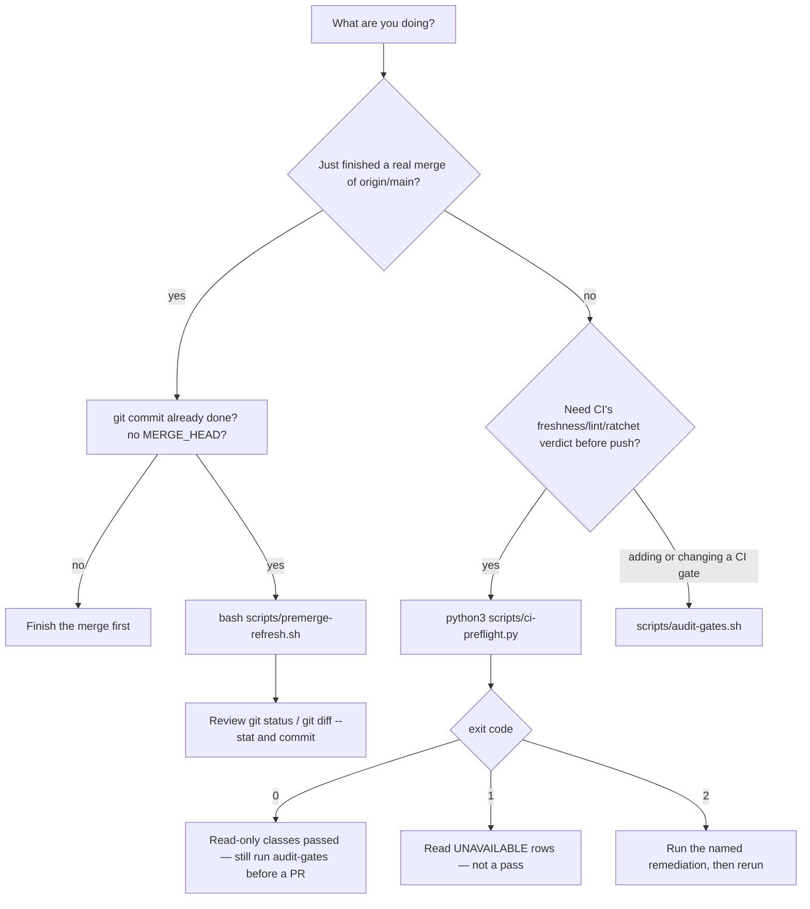

# Pick the right pre-PR command — `ci-preflight`, `premerge-refresh`, or `audit-gates`

**Status:** **Primary diagnostic** — when CI is about to run (or just failed on freshness/ratchet/lint) and you are choosing a local command, check this first.

**Domain:** CI hygiene / marketplace workflow.

**Applies to:** Anyone pushing a branch in this marketplace (human or agent). Consumer repos do **not** ship these two scripts.

---

## Why this exists

Three commands look interchangeable and are not. Mixing them up is how this repo has burned whole PR cycles:

| Wrong move | What actually happens |
|---|---|
| Treat `ci-preflight.py` exit **1** as green | A soft-skip (`UNAVAILABLE`) is **not** a pass — CI may still fail the class that could not run here |
| Run `premerge-refresh.sh` *during* a merge | The ratchet stamp binds to the **old** pre-merge base (PR #1145) |
| Cherry-pick your own commits onto a fresh `origin/main` to "catch up" | `merge-base(HEAD, origin/main)` freezes at the new branch's fork point; `--stamp` cannot heal ancestry (2026-09-09 addendum in `scripts/_base_ref.py`) |
| Skip `audit-gates.sh` because preflight was green | Preflight does **not** run must-fail fixture teeth. The narrowed claim is verbatim in the script, its banner, and `AGENTS.md` |

`ci-preflight.py` (PR #1152) and `premerge-refresh.sh` (PR #1150) were added specifically so a long-lived branch converges in **one** read-only check pass and **one** regen+stamp pass, instead of reacting to whichever freshness gate failed next.

---

## How to apply



### The three tools

| Command | Writes the tree? | When | What it proves |
|---|---|---|---|
| `python3 scripts/ci-preflight.py` | **No.** Never `--fix` / `--stamp` / generator write. | Before `git push`, or after a local edit, to preview the recurring CI-failure classes. | Floor lint + the six hotspot classes below. **Not** audit-harness / must-fail-fixture integrity. |
| `bash scripts/premerge-refresh.sh` | **Yes.** Regenerates derived files, then stamps ratchet. | Once the branch is **genuinely** caught up: a real `git merge origin/main` **committed**, no `MERGE_HEAD`, no unresolved conflicts. | The #1145 stale-artifact chain is fresh against `--base` (default `origin/main`). |
| `scripts/audit-gates.sh` | No (hermetic — see [`hermetic-validation-no-in-place-regen.md`](./hermetic-validation-no-in-place-regen.md)). | Required before opening a PR, and whenever you add or change a CI gate. | Every gated property still **fails** a known-bad fixture and **passes** a known-good one ([`ci-gate-audit.md`](./ci-gate-audit.md)). |

### `ci-preflight.py` — contract (verified against `scripts/ci-preflight.py`)

```bash
python3 scripts/ci-preflight.py                  # --base defaults to origin/main
python3 scripts/ci-preflight.py --base origin/main
python3 scripts/ci-preflight.py --strict         # escalate any UNAVAILABLE to exit 2
python3 scripts/ci-preflight.py --self-test      # hermetic primitives only; not a repo check
```

**Exit codes (three-tier, not binary):**

| Exit | Meaning |
|---|---|
| **0** | Every selected check **ran** and **passed**. |
| **1** | At least one class is `UNAVAILABLE` (missing tool, network-blocked, unresolvable base after force-fetch pre-warm, bounded timeout, missing checker script) and nothing that ran reported `FAIL`. Read the `UNAVAILABLE` rows. |
| **2** | A real `FAIL`; or the worktree changed mid-run (content-fingerprint TOCTOU — rerun); or `--strict` and any soft-skip; or `--base` is not a syntactically valid ref. |

Each failing / unavailable row prints a `remediation:` line. This tool **never** runs that command for you.

**What a normal run actually executes** (unconditional — no glob-based selection):

1. **Floor** — JSON validity of marketplace + plugin manifests + `.repo-layout.json`; `bash -n` on `plugins/*/hooks/*.sh` and `scripts/*.sh`; `+x` on hook scripts only (not `scripts/*.sh`); `prettier@3.9.4 --check .`; `ruff check .`.
2. **Context (informational + one gate)** — porcelain / diff report (never used to pick hotspots); fail if an **untracked** path sits under `scripts/`, `plugins/`, `.claude-plugin/`, `tests/fixtures/`, or the three required workflow files.
3. **Hotspots — 6 classes / 13 commands:**
   - **1** ratchet / merge-base (`check-ratchet-freshness.py --check`, after a force-fetch pre-warm)
   - **2** inventory staleness / covers completeness / schema / evidence
   - **3** dashboard, `index.html`, `docs/concepts.md` freshness
   - **4** Copilot package freshness
   - **5** Codex-agents projection
   - **6** inventory census / sweep (`--no-record`) / inception coverage
4. **TOCTOU** — SHA of `HEAD` + sha256 of `git diff --binary HEAD` + digest of untracked files, captured before and after. A mid-run mutation is its own `FAIL` (`worktree changed during preflight; rerun.`).

Timeouts: 60s per floor/hotspot command, 180s for inventory-sweep. Children run in their own process group and are group-killed on timeout.

This reproduces production freshness/lint/ratchet diagnostics only — not audit-harness or must-fail-fixture integrity. `scripts/audit-gates.sh` remains the required pre-PR check.

### `premerge-refresh.sh` — contract (verified against `scripts/premerge-refresh.sh`)

```bash
bash scripts/premerge-refresh.sh              # base = origin/main
bash scripts/premerge-refresh.sh --base <ref>
```

**Order is load-bearing:**

1. Refuse if `MERGE_HEAD` exists or unmerged paths remain → **exit 2**.
2. `scripts/regen-inventory.sh` (concepts registry + dashboards + budgets)
3. `python3 scripts/generate-concepts-doc.py` (`docs/concepts.md` reads the registry)
4. `python3 scripts/generate-copilot-plugin.py`
5. `python3 scripts/check-ratchet-freshness.py --stamp --base <ref>` — **last**, and **skipped** if an earlier step failed

Exit **1** if any step fails — do not commit a half-regenerated tree; fix and re-run the **whole** chain. Exit **0** only means the files are fresh; you still review `git status` / `git diff --stat` and commit.

**Honest scope:** this is not "regenerate every generated artifact." It covers the chain PR #1145 proved goes stale together. Other generators (`generate-aider-conventions.py`, `generate-codex-agents.py`, host-hook generators, `sync-plugin-versions.py`, …) stay with `audit-gates.sh` / their own `--check` remediations. Extend the script only when another chain earns the same repeated-failure evidence.

### Catching up a branch

**Do:**

```bash
git fetch origin
git merge origin/main
# resolve conflicts, then:
git commit
bash scripts/premerge-refresh.sh
# review, commit regenerated files, then:
python3 scripts/ci-preflight.py
scripts/audit-gates.sh    # still required before opening / updating a PR
git push
```

**Don't:**

```bash
git checkout origin/main -b my-branch-v2
git cherry-pick <sha1> <sha2> ...   # ⛔ ancestry can never reach current main
```

A real merge makes `origin/main`'s current tip an ancestor. Cherry-picking onto a brand-new branch pins `merge-base` at whatever `origin/main` was when you cut that branch. Re-stamping does not fix that. Full mechanics: `scripts/_base_ref.py` (2026-09-09 addendum) and [`CONTRIBUTING.md`](../../CONTRIBUTING.md) § "Keeping a branch caught up with `main`".

---

## Edge cases / when the rule does NOT apply

- **Sandbox blocked network.** `npx prettier` and a first-time `ruff` install **download**. Codex `workspace-write` has network off by default. A denial here is an environment class (`UNAVAILABLE` / install failure), not "lint is broken." Install once, or run outside the sandbox — do not skip. Same note lives in `AGENTS.md` Testing instructions.
- **`--self-test` is not a substitute for a repo run.** It exercises the coordinator's own primitives in scratch tempdirs. CI runs it via `.github/workflows/ci-preflight-self-test.yml`.
- **Docs-only / no generated-artifact drift.** You can skip `premerge-refresh.sh` if you did not merge `main` and did not touch inventory/dashboard/copilot inputs. Still run `ci-preflight.py` if you want the same floor+hotspot verdict CI will compute; still run `audit-gates.sh` before a PR that can change consumer-facing or CI surfaces.
- **Consumer repos.** These scripts are marketplace-only. Do not tell a plugin consumer to run them.
- **Self-healing artifacts on `main`.** Some committed generated files heal post-merge via `.github/workflows/regenerate-artifacts.yml`. That does **not** replace a premerge refresh on a long-lived **feature** branch — PR-gated freshness (dashboard, concepts doc, copilot package, ratchet) still fails the PR.

---

## See also

- [`ci-gate-audit.md`](./ci-gate-audit.md) — why `audit-gates.sh` remains the required pre-PR check
- [`hermetic-validation-no-in-place-regen.md`](./hermetic-validation-no-in-place-regen.md) — validation must not rewrite tracked files; `premerge-refresh` is the **intentional** write path, run by a human/agent after a merge, not by a gate
- [`ci-on-github-token-pushes.md`](./ci-on-github-token-pushes.md) — preflight green + zero GitHub checks usually means the push did not create a `pull_request` run
- [`CONTRIBUTING.md` § Keeping a branch caught up](../../CONTRIBUTING.md#keeping-a-branch-caught-up-with-main)
- [`AGENTS.md` Testing instructions](../../AGENTS.md) — the `python3 scripts/ci-preflight.py` invocation and the narrowed-claim sentence (do not reword that sentence; `ci-preflight.py --self-test` asserts it)
- `scripts/ci-preflight.py`, `scripts/premerge-refresh.sh`, `scripts/_base_ref.py` — source of truth for flags, exits, and ancestry

## Provenance

Codified 2026-09-11 from the shipped contracts in `scripts/ci-preflight.py` (PR #1152) and `scripts/premerge-refresh.sh` (PR #1150 / merge #1150), plus the cherry-pick ancestry addendum in `scripts/_base_ref.py` (2026-09-09) and the CONTRIBUTING catch-up section. The incidents named above are the ones those scripts' headers already cite (PR #1145 stamp-during-merge; PR #991 wrong merge-base shape). This doc does not add new behavior — it names which command to reach for so the next session does not re-derive it from three headers.

---

_Last reviewed: 2026-09-11 by `docs-automation`_
