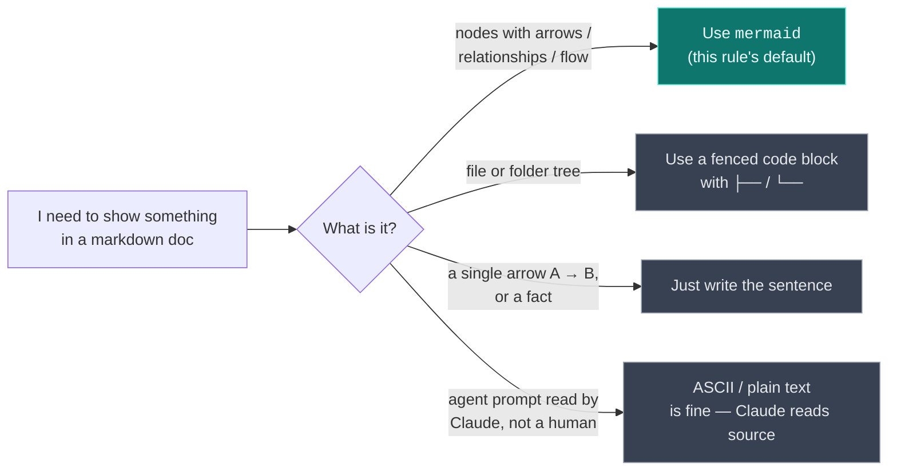
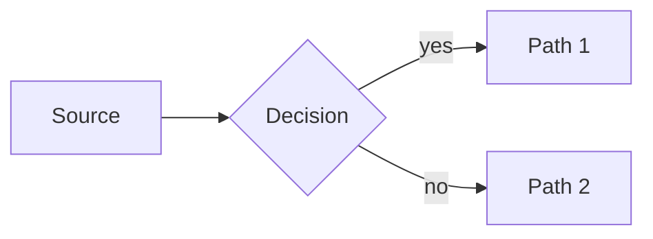

# Diagrams in markdown docs: mermaid for concepts, code blocks for trees

**Status:** **Pattern** — strong default; deviate only with a written reason in the PR.

**Domain:** Documentation / Cross-domain

**Applies to:** All markdown content under `docs/` and `plugins/*/`. Recommended in any consumer project where docs are viewed on GitHub.

---

## Why this exists

ASCII box-art diagrams look acceptable in a terminal and rot quickly. They break when content grows, get misaligned in proportional fonts, and are tedious to evolve (adding one box means redrawing every adjacent line). GitHub natively renders [`mermaid`](https://mermaid.js.org/) code fences in markdown — flowcharts, sequence diagrams, ER diagrams, class diagrams, state diagrams — with zero extra tooling for the reader and a much cleaner visual than ASCII.

For collaborators viewing this repo through the GitHub web UI (the default access path for `mcorbettbma` and any future collaborator), mermaid diagrams render inline. ASCII art is just a wall of pipe characters.

## The rule, as a decision tree (and a live mermaid demo)

This very diagram is rendered by GitHub from a `mermaid` block — view this file on `github.com` to see it render, or in your editor's markdown preview if it supports mermaid.



## How to apply

**Default to mermaid for conceptual or flow diagrams** — system overviews, data flow, request/response sequences, state machines, entity relationships, dispatch trees, anything that's nodes-with-arrows.

````markdown

````

Pick the diagram type that fits the content, not just `flowchart` by reflex:

| Diagram type | Use for |
|---|---|
| `flowchart` (TB / LR) | System architecture, decision trees, data flow, dispatch patterns |
| `sequenceDiagram` | Request/response interactions, multi-actor protocols, agent-to-agent dispatch over time |
| `erDiagram` | Data models, table relationships, schema overviews |
| `classDiagram` | Type hierarchies, object models |
| `stateDiagram-v2` | Lifecycles, state machines, workflow states |
| `gantt` | Project timelines |
| `pie` | Composition snapshots |

**Keep folder trees as fenced code blocks**, not mermaid. Mermaid lacks a clean file-tree diagram type; the standard `├──` / `└──` tree characters in a plain code block read perfectly well in monospace and don't fight the tool:

````markdown
```
plugins/
├── ravenclaude-core/
│   ├── agents/
│   └── skills/
└── power-platform/
    ├── agents/
    └── skills/
```
````

**Do:**
- Use mermaid for any diagram with arrows or relationships between named entities.
- Add a one-line caption above each mermaid block stating what the diagram is showing.
- Use `classDef` to color-code conceptual layers (e.g. hub / plugin / consumer) when a flowchart has more than ~5 nodes — colors carry meaning faster than re-reading labels.
- Test-render in GitHub before merging the PR. GitHub's mermaid renderer is strict about syntax; what works in [mermaid.live](https://mermaid.live) usually works in GitHub, but verify.

**Don't:**
- Don't use ASCII box-art (`┌─┐`, `└─┘`, `│`, `▼`) for conceptual diagrams. It will look fine in your editor and ugly on GitHub.
- Don't draw a mermaid diagram for something a sentence handles better — "the architect dispatches to coders, who dispatch to nobody" doesn't need a diagram.
- Don't use mermaid for file/folder trees. Tree characters in a code block are clearer.
- Don't lean on emoji-as-icons inside mermaid nodes. GitHub's renderer handles them inconsistently across themes and they hurt accessibility.

## Edge cases / when the rule does NOT apply

- **Single-arrow "A → B" relationships** — inline arrow text in a sentence is fine; a one-edge mermaid diagram is overkill.
- **Documents intended primarily for terminal viewing** (e.g. agent prompts read by Claude itself, not by humans on GitHub) — Claude reads markdown source, not rendered mermaid. ASCII may communicate the structure more directly there. Most files in `plugins/*/agents/` fall in this category, so don't aggressively mermaid-ify them.
- **Time-critical incident notes** — a quick scribble in lessons-learned.md doesn't need a polished diagram. Add one in a follow-up if the lesson endures.

## See also

- [`docs/architecture.md`](../architecture.md) — canonical example of the marketplace model rendered as a mermaid `flowchart` with `classDef` color coding.
- [`docs/best-practices/_TEMPLATE.md`](_TEMPLATE.md) — template this doc follows.
- [Mermaid documentation](https://mermaid.js.org/intro/) — official syntax reference.
- [GitHub's mermaid support announcement](https://github.blog/developer-skills/github/include-diagrams-markdown-files-mermaid/) — confirms native rendering, no Action required.

## Provenance

Rule established 2026-05-11 during the refresh of `docs/architecture.md` from the old "central hub + Expert repos" model to the plugin-marketplace model. The initial refresh kept the ASCII box-art diagram from the prior version, on the reasoning that "the rest of your docs use plain markdown and switching here would introduce a tooling dependency for one file." Matt overruled that judgment call ("I want the mermaid diagram"), correctly identifying that GitHub's native mermaid support means there is no real tooling dependency — only an aesthetic upgrade. This best-practice codifies the decision so future contributors default to mermaid without re-litigating it.

---

_Last reviewed: 2026-05-11 by `@mcorbett51090` (proposed by Claude in PR)_
