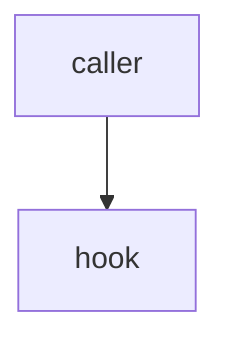

# Inventory authoring — the line-offset rule and the template shape

**Status:** measured, not asserted. Every rule below is bound to a verdict from
`scripts/spike-tprose-canary.sh`, which drives the real `guard-premise.sh` hook and
re-runs on demand. If you change the guard, re-run the spike — this document is
downstream of it, never the other way round.

Produced by **P1 / S1** of [`docs/plans/2026-08-19-product-inventory/plan.md`](../plans/2026-08-19-product-inventory/plan.md).
Verdict table: [`p1-spike-verdicts.md`](../plans/2026-08-19-product-inventory/p1-spike-verdicts.md).

---

## 0. Why this document exists before any entry is authored

Plan A asserted that authoring inventory entries is compatible with the premise
guard, and never tested it — which is the exact shape the guard exists to catch.
Authoring 40 entries and discovering the rule at file #40 is the failure mode.
So the rule was measured first, with a positive control, and written down here.

---

## 1. The two corrections to the plan's ground truth

The plan's §1 ledger carried two entries that the spike refutes. They are recorded
here rather than quietly fixed, because the mitigations built on them changed.

### 1.1 ⛔ GT6 is FALSE — T-PROSE is not CREATE-only

control: the same stamped-diagnosis body was sent twice, once as a `Write` to a
path that did not exist and once as an `Edit` to a path that did; both denied, and
a benign body on the same path allowed.

The plan records *"T-PROSE fires only on file CREATE"*, citing the
`if os.path.exists(path): sys.exit(0)` early-exit at `guard-premise.sh:462`.
Measured 2026-08-19, verdict `S1-Q5` = **DENY**: that early-exit gates **T-SHAPE**
only. The hook header states it directly — T-PROSE is *"OR-ed with T-SHAPE below,
never AND-ed: none of the T-SHAPE exemptions that follow (new-file-only,
source-extension-only, `docs/`) may suppress this one."*

**What changes.** The plan's X15 mitigation reasoned that *"re-stamps and
`last_verified` bumps on existing files are structurally exempt."* They are not
exempt **structurally**. They are exempt **by content**: verdict `S1-Q6` = ALLOW
for a bare `last_verified:` re-stamp, because an `Edit` payload carries only
`new_string`, and a bare date bump contains no defect predicate. The outcome the
plan wanted holds; the reason it holds is different, and the difference matters —
a re-stamp that *also* rewrites the nuance paragraph **is** screened.

### 1.2 ⛔ The blast radius is per-CLAIM, not per-FILE

control: a body with a `control:` line above claim 1 and a second stamped claim
twelve lines lower was sent through the hook; it denied on the second claim, while
the same body with a control above *each* claim allowed.

Verdict `S1-Q3` = **DENY**. The plan flagged this as variance W8 —
*"S1 may find that T-PROSE needs one control per claim, not one per file."*
**It does.** W8 has materialised. Per-entry authoring cost rises accordingly and
the P9 figure in the plan's §19.2 should be read with that in mind.

---

## 2. The measured mechanics

`_CTRL` and `_STAMP` are **window** regexes over `lines[max(0, i-6) : i+7]` — a
±6-line window around the matched claim line. They are not document-level.

| # | Question | Verdict | Rule it produces |
|---|---|---|---|
| Q1 | Does a frontmatter `sources:` block clear a claim in body paragraph 3+? | **DENY** | A `sources:` block is not a control. It does not match `_CTRL`, and past six lines it is not even in the window. |
| Q2 | Does an inline `control:` line immediately **above** the claim clear it? | **ALLOW** | This is the sanctioned shape. |
| Q3 | Does a **second** stamped claim with no adjacent control still deny? | **DENY** | One control per **claim**. |
| Q4a | Does the frontmatter `last_verified:` date alone arm `_STAMP`? | **DENY** | The date is a certainty stamp. A claim within six lines of the frontmatter is armed by the date you did not think of as a stamp. |
| Q4b | Same body, no date anywhere? | **ALLOW** | Confirms Q4a is about the date and nothing else. |
| Q5 | Does T-PROSE fire on an `Edit` to an existing file? | **DENY** | See §1.1. |
| Q6 | Is a bare `last_verified:` re-stamp `Edit` allowed? | **ALLOW** | By content, not by exemption. See §1.1. |

---

## 3. The authoring rules

1. **Place `control:` ABOVE the claim, never below.** The window is ±6 lines, and a
   `nuance` at the 4-rendered-line cap is 4–5 wrapped lines. A `control:` line
   *below* a claim that starts at line 1 of the block can fall outside the window;
   above, it never can.

2. **One `control:` per CLAIM.** Not one per file, not one per section. If your
   entry states two dated mechanism facts, it carries two `control:` lines.

3. **Cap `nuance` at 4 RENDERED lines.** Not "5 sentences", not "600 chars" — those
   wrap to 6–7 lines and push the control out of the window. The cap is a *layout*
   constraint because the gate is a *layout* gate.

4. **Keep body claims ≥ 7 lines below the frontmatter,** or give them their own
   `control:`. The `last_verified:` date arms `_STAMP` for anything within six
   lines of it (Q4a).

5. **A re-stamp Edit may bump the date and nothing else.** If the same edit rewrites
   the nuance, it is screened like any other write and needs its controls.

6. **⛔ The summary is a TOOLTIP. It must never state the finding.**
   Measured 2026-08-20: a fresh-context reviewer rejected `hook-emitter-collision`
   as a **restatement** because its summary read *"…: one channel adds, the other
   overwrites"* — the punchline, in the 200 chars a reader sees first. The nuance
   then had nothing left to teach, and the rubric is literally *"could they have
   guessed it from title plus summary?"*

   The failure is subtle because a leaky summary reads as a **good** summary: it
   is informative, accurate, and it is the reason the entry scores zero. Say what
   the entry is **about**; let the nuance carry what is **surprising**.

   | | |
   |---|---|
   | ✗ leaks | `What happens when two hooks emit on one event: one channel adds, the other overwrites.` |
   | ✓ tooltip | `Two hooks registered on one event both emit. What the host does with the second payload.` |

   ⛔ The deterministic floor **cannot** catch this — a leaky summary makes the
   nuance's tokens *less* novel against baseline B1, so a leak actively pushes the
   entry toward failing F2 rather than passing it. This one is caught only by the
   sampled review, which is precisely why that review is a blocking gate.

7. **⛔ No apostrophes anywhere inside a single-quoted bash block, including in
   prose comments.** One apostrophe closes the string, the hook dies with a
   non-blocking error, and the gate fails **OPEN** — silently ceasing to gate.
   `scripts/audit-prose-rendering-path.py` checks this mechanically.

8. **⛔ Do not write the denied shape literally into a test or a doc.** A guard
   cannot tell a command from a description of one. Assemble fixtures with
   `printf`, as `test-guard-premise-scope.sh` and `spike-tprose-canary.sh` do.

---

## 4. The template shape

```markdown
---
id: <slug-matching-filename>
title: <Title>
category: <category>
kind: ravenclaude-built # or platform-fact
entry_class: inventory
order: <int>
summary: <=200 chars, the tooltip
covers:
  - plugins/ravenclaude-core/hooks/_advise.sh
covers_digest: "sha256:…" # generated, never hand-written
last_verified: YYYY-MM-DD
refresh_when: <free text OR a list of extra path globs>
nuance_evidence:
  measured: YYYY-MM-DD
  control: "<the probe that would have come out differently>"
  falsifier: "<what observation would refute this>"
  probe: scripts/probe-x.sh # or "unprobed: <>=30 chars of reason"
nuance_source: plugins/ravenclaude-core/hooks/_advise.sh:12-31
verify:
  tier: effect # effect | reachability | none
  strength: executed # executed | static | observational
  class: hook-advisory
  probe: scripts/probes/hook-advisory.sh
  teeth_exit: 1
sources:
  - label: <label>
    url: <url>
---

## What it does

<Ordinary prose. No dated defect claims here, or it needs its own control.>

control: <the discriminating observation, ON THE LINE ABOVE THE CLAIM>
Measured 2026-08-19: <the one mechanism claim, <=4 rendered lines>

<blank line, then at least 7 lines before the next stamped claim, or give that
one its own control: line too>


```

**Order inside the frontmatter is not load-bearing; the `control:`-above-claim
order in the BODY is.**

---

## 5. Re-running the measurement

```shell
bash scripts/spike-tprose-canary.sh          # 8 verdicts + the positive control
python3 scripts/audit-prose-rendering-path.py --check
python3 scripts/audit-prose-rendering-path.py --must-fail
```

⛔ `spike-tprose-canary.sh` exits non-zero if any question loses its verdict **or if
the positive control stops firing**. A run where nothing denied is not a clean run;
it is a blind probe, and the script refuses to report it as a pass.
