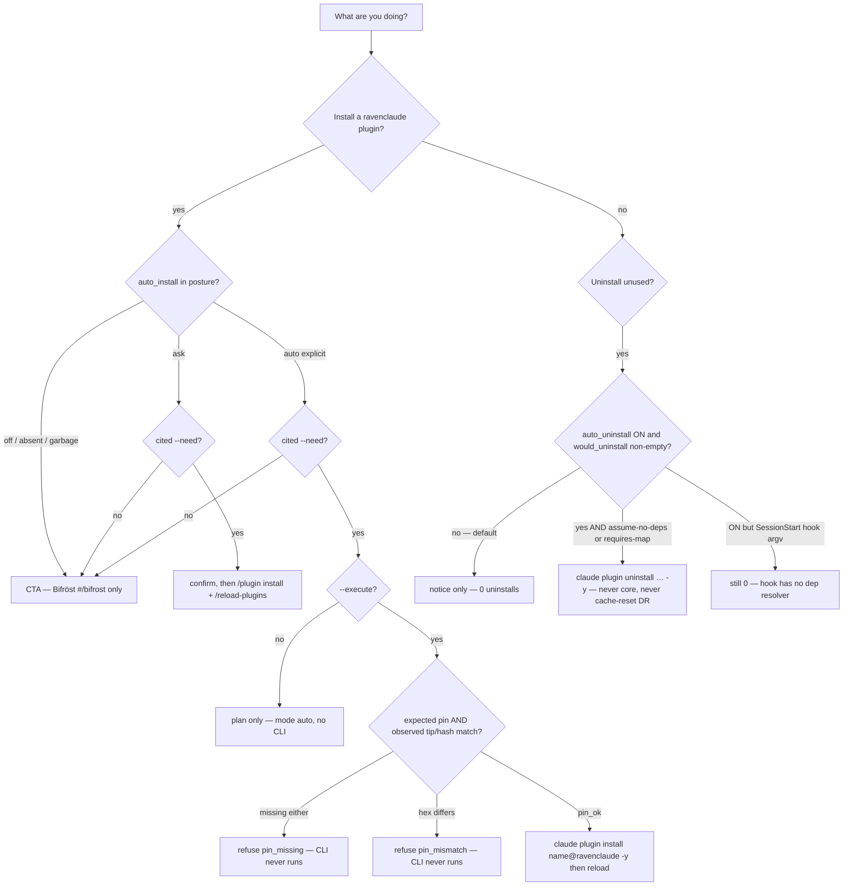

# Pick the right plugin-lifecycle mode — `off`, `ask`, or `auto`

**Status:** **Primary diagnostic** — when a session is about to install, uninstall, or "clean up unused" RavenClaude plugins, check this first.

**Domain:** Agent operability / marketplace workflow.

**Applies to:** Anyone tuning `.ravenclaude/comfort-posture.yaml` `plugin_lifecycle:` (human or agent), or invoking `plugins/ravenclaude-core/scripts/plugin-lifecycle.py`. Inventory-style concept: [`plugins/ravenclaude-core/knowledge/concepts/plugin-lifecycle.md`](../../plugins/ravenclaude-core/knowledge/concepts/plugin-lifecycle.md).

---

## Why this exists

P3 auto-install + uninstall-execute shipped in ravenclaude-core **0.323.17 / 0.324.2** (PRs #1201 / #1214). The public CLI and the Matthew locks live in the engine header; the inventory concept records what is true. Neither is a "which mode when" rule. Mixing the knobs up is how a session:

| Wrong move | What actually happens |
|---|---|
| Treat `auto_install: auto` as "just install it" | `--execute` is **pin-gated**. No expected tip/SHA **and** no observed tip/hash → `pin_missing`; mismatch → `pin_mismatch`. The CLI is **never** invoked on either refuse. |
| Flip `auto_uninstall: on` and expect the SessionStart hook to remove unused plugins | The committed hook body calls `sweep-hook` with only `--session-used-file`. It does not pass `--assume-no-deps` or `--requires-map`. The engine's FAILCLOSED fixture then keeps `would_uninstall` empty (`skipped.unknown_requires`). |
| Treat SessionStart / dashboard-open as "used" | Those are **not** use signals. Only `skill` / `agent` / `slash` bump `last_used_at`. A plugin that is merely installed ages out. |
| Reach for the cache-reset disaster-recovery command to clean unused plugins | The sweep does not invoke that command. The engine refuses those tokens in `_run_plugin_cli`. That path is disaster-recovery, not lifecycle. |
| `ask-install` without `--need` on `ask` or `auto` | AppSec #6: uncited → Bifröst **CTA** only. No confirm path, no execute. |
| Claim the plugin is usable the moment `claude plugin install -y` returns | Reload **before** use (`/reload-plugins` on Claude Code). The JSON always carries `reload_cmd`. |

Prefer **`ask`** for production installs until `install_pins` (or `--expected-sha`) are configured. Seed / absent stay **`off`**.

---

## How to apply



### The three `auto_install` values

| Posture | Absent / unknown | Cited `--need` | `--execute` |
|---|---|---|---|
| **`off`** (default) | coerced **off** | ignored — **CTA** | ignored |
| **`ask`** | n/a | confirm plan (`confirm_required: true`) | ignored (ask never shells `-y`) |
| **`auto`** | only when the literal value is `auto` | plan `mode: auto` | pin-gated `claude plugin install <key> -y` |

Garbage values (`weird`, empty, `true`) coerce to **`off`**. `auto` is never invented.

### Pin contract (auto `--execute` only)

Expected tip/SHA, first hit wins:

1. `--expected-sha`
2. posture `plugin_lifecycle.install_pins` (key `name@ravenclaude` **or** bare `name`)
3. env `PLUGIN_LIFECYCLE_EXPECTED_SHA`

Observed tip/SHA, first hit wins (no network git):

1. env `PLUGIN_LIFECYCLE_OBSERVED_SHA` (tests)
2. env `PLUGIN_LIFECYCLE_TIP_SHA_MAP` JSON
3. `git rev-parse HEAD` of `PLUGIN_LIFECYCLE_MARKETPLACE_ROOT` or `~/.claude/plugins/marketplaces/ravenclaude`
4. content-hash of a ravenclaude **cache** candidate (`plugin.json` / `hooks.json` / `concepts.json`) when `--install-path` is under that cache

Compare: lowercase hex; prefix match if **both** sides are ≥ 7 hex chars. Either side empty → `pin_missing`. Both present and not equal → `pin_mismatch`.

```yaml
# .ravenclaude/comfort-posture.yaml — production-safe default
plugin_lifecycle:
  tracking: on          # M7: ON once a posture file exists; set off to mute
  unused_days: 90       # M1
  auto_uninstall: off   # M2 — keep off unless you also supply a requires-map
  auto_install: ask     # prefer ask until pins exist; seed is off
  pins: []              # extra uninstall pins (core is hard-pinned regardless)
  install_pins:
    finance@ravenclaude: "aaaaaaaaaaaaaaaaaaaaaaaaaaaaaaaaaaaaaaaa"
```

```bash
# Plan only (any mode) — JSON on stdout
python3 plugins/ravenclaude-core/scripts/plugin-lifecycle.py \
  --project "$PWD" ask-install --plugin finance --need "user asked for a finance memo"

# Auto execute — refused unless pin matches observed tip/hash
python3 plugins/ravenclaude-core/scripts/plugin-lifecycle.py \
  --project "$PWD" ask-install --plugin finance \
  --need "user asked for a finance memo" \
  --expected-sha "$(git -C "$HOME/.claude/plugins/marketplaces/ravenclaude" rev-parse HEAD)" \
  --execute
```

### Uninstall vs notice

`would_uninstall` is populated only when **all** of these hold:

- `auto_uninstall` is ON (absent ⇒ off)
- the plugin is unused ≥ `unused_days` (default 90)
- it is **not** `ravenclaude-core` (M3 — code constant, not a posture pin)
- it is **not** in posture `pins` / ledger `pinned`
- it was **not** used this session (mid-flight file / `--session-used`)
- deps are clear: `--assume-no-deps` **or** a `--requires-map` JSON that lists the key with no dependents

The SessionStart body (`plugin-lifecycle-sweep.sh`) calls `sweep-hook` with only `--session-used-file`. It never passes the two dep flags. So **ON in posture + that hook argv ⇒ empty `would_uninstall`**, not removals. Hand-running the engine with `--assume-no-deps` is a test/operator path, not what the committed hook fires.

```bash
# Notice / fail-closed plan (what the SessionStart hook approximates)
python3 plugins/ravenclaude-core/scripts/plugin-lifecycle.py \
  --project "$PWD" sweep-plan --json

# Dry execute path (tests / explicit operator) — still never core, never cache-reset DR
python3 plugins/ravenclaude-core/scripts/plugin-lifecycle.py \
  --project "$PWD" sweep-hook --assume-no-deps --plan-only
```

### Allowlist and exits

| Situation | Exit |
|---|---|
| `allowlist-check` / `ask-install` — marketplace is not `ravenclaude` | **3** |
| `ask-install` — `--install-path` not under a ravenclaude plugin cache | **3** |
| path-jail (symlinked `.ravenclaude/` or ledger) | **4** |
| `record` unknown `--signal` | **2** |
| CTA / ask / auto plan, including pin refuse | **0** (read the JSON `mode` / `execution.reason`) |
| SessionStart sweep hook | **always 0** (cannot block startup) |

Allowlist is the marketplace name **plus**, when a path is supplied, that path must contain `/cache/ravenclaude/` (or `/plugins/cache/ravenclaude/`).

**Do:**

- Leave `auto_install` **`off`** or **`ask`** until `install_pins` are written for every plugin you might auto-execute.
- Cite `--need` in the same breath as `ask-install`. Empty citation is a CTA, not a confirm.
- Run `/reload-plugins` (Claude Code) before claiming the plugin is usable. Copilot / Cursor have **no** slash-install parity — Bifröst or `rc` / `ravenclaude install`.
- Pin plugins you must keep in `pins:` **and** remember `ravenclaude-core` cannot be auto-removed even with empty pins.
- Diagnose a refused auto execute by reading `execution.reason` (`pin_missing` / `pin_mismatch` / `cli_missing` / `timeout` / `exit_N`).

**Don't:**

- Don't set `auto_install: auto` on an unattended / overnight posture "to be helpful."
- Don't treat `sweep-hook` exit 0 as "uninstalls ran."
- Don't use the cache-reset disaster-recovery command as unused-plugin cleanup.
- Don't pass `--execute` and assume the mock/real CLI ran — pin refuse leaves `execution.executed: false` and `argv: []`.
- Don't count SessionStart presence or opening the dashboard as use.

---

## Edge cases / when the rule does NOT apply

- **No comfort-posture file.** Tracking is off (M7 is "ON once a posture exists"). Sweep and telemetry no-op after a cheap missing-file read.
- **`tracking: off`** in an existing posture. Sweep-hook returns 0 without planning.
- **Updating an already-installed `ravenclaude-core`.** That is [`updating-ravenclaude-in-a-consumer-repo.md`](./updating-ravenclaude-in-a-consumer-repo.md) / the `update-ravenclaude` skill (`git pull` + re-wire, or `/plugin marketplace update`). Lifecycle does not replace an update.
- **Non-ravenclaude marketplaces.** Rejected (exit 3). There is no "ask anyway" path.
- **`--execute` on `off` or `ask`.** Ignored. Only the `auto` branch reads the flag.
- **Corrupt / absent ledger.** Reads as the empty default. Writes are atomic (tmp + rename). Local-only / gitignored (M6).
- **Host fire of the SessionStart sweep.** This diagnostic does not re-measure which hosts invoke the hook. Per-host notes live in `plugins/ravenclaude-core/knowledge/host-support.json` (`components.hooks.*.sessionstart_verification`). P3 `install_cmd` is `/plugin install …` — Copilot/Cursor operators use Bifröst or `scripts/ravenclaude`, not that slash.

---

## See also

- [`plugins/ravenclaude-core/knowledge/concepts/plugin-lifecycle.md`](../../plugins/ravenclaude-core/knowledge/concepts/plugin-lifecycle.md) — inventory concept + verify probe
- [`updating-ravenclaude-in-a-consumer-repo.md`](./updating-ravenclaude-in-a-consumer-repo.md) — Copilot-CLI update path (not unused-plugin sweep)
- [`scheduled-and-overnight-runs.md`](./scheduled-and-overnight-runs.md) — do not flip `auto` / uninstall-ON for unattended work
- [`comfort-posture-behavioral-flags-vs-permissions.md`](./comfort-posture-behavioral-flags-vs-permissions.md) — `plugin_lifecycle:` is a third surface, orthogonal to `allow` and `design_checkins`
- [`plugins/ravenclaude-core/skills/update-ravenclaude/SKILL.md`](../../plugins/ravenclaude-core/skills/update-ravenclaude/SKILL.md) — routine refresh; points at the concept, not this diagnostic
- Engine + fixtures: `plugins/ravenclaude-core/scripts/plugin-lifecycle.py`, `hooks/tests/test-plugin-lifecycle.sh`

---

## Provenance

Weekly docs scan (2026-09-20). P3 tip/SHA pin landed 2026-09-19 (PR #1214, core 0.324.2) on top of uninstall-execute + `auto_install: auto` (0.323.17, PR #1201). The concept file was restamped the same day; no best-practice named "which mode when," how to set `install_pins`, or that the committed SessionStart hook argv cannot populate `would_uninstall` without a dep resolver. Verified this run: `test-plugin-lifecycle.sh` → 41 pass, 0 fail; hook argv read from `plugin-lifecycle-sweep.sh`.

---

_Last reviewed: 2026-09-20 by `docs-automation`_
