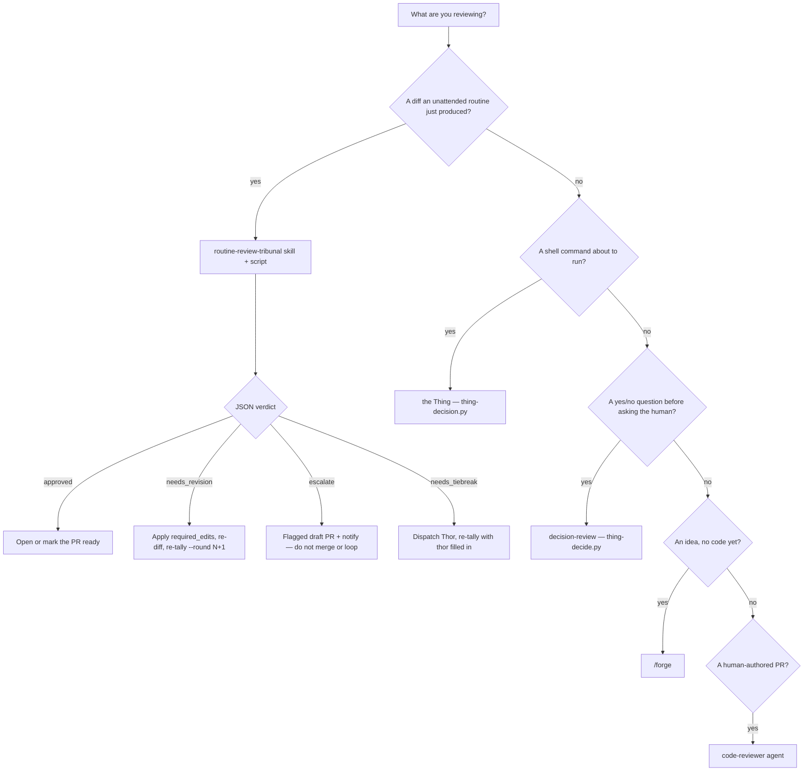

# Pick the right review — `routine-review-tribunal`, the Thing, decision-review, `/forge`, or `code-reviewer`

**Status:** **Primary diagnostic** — when a review is about to run (or you are wiring a scheduled routine that ends in a PR) and you are choosing which engine, check this first.

**Domain:** Agent design / marketplace workflow.

**Applies to:** Anyone running or authoring an unattended scheduled routine in this marketplace, and anyone who might reach for "the tribunal" without naming *which* one. Consumer repos get the skill + script only if they have installed `ravenclaude-core`; the two routine-policy docs below are marketplace-only.

---

## Why this exists

Five review surfaces share seats, JSON-on-stdout, and the word "tribunal." They are not interchangeable. Mixing them up is how an unattended routine's PR lands with only CI + the authoring agent's self-review — the exact gap PR #1161 closed.

| Wrong move | What actually happens |
|---|---|
| Spawn `code-reviewer` at the end of a scheduled routine | One agent, one backbone, no `required_edits` tally, no round ceiling. Fine when a human is the second opinion; an unattended routine *has no human behind it*. |
| Run `thing-decision.py` / the Thing against the routine's `git` commands | The Thing reviews a **shell command** in real time (`ALLOW`/`EDIT`/`DENY`). It never sees the produced diff as a whole. |
| Run `thing-decide.py` on "should we open this PR?" | Decision-review answers **yes / no / defer**. It has no `required_edits` and cannot send the routine back for a bounded revision. |
| Re-run `/forge` on a diff that already exists | `/forge-pipeline` reviews an **idea before code**. There is no plan to synthesize here — only a completed diff to approve, send back, or escalate. |
| Treat `tally` exit `0` as "the panels approved" | `panels` and `tally` **always exit 0**. The verdict is in the JSON (`approved` / `needs_revision` / `escalate` / `needs_tiebreak`). Only `--self-test` is a real pass/fail exit. |

The skill + script shipped in PR #1161 (`routine-review-tribunal`). The two PR-producing scheduled routines already name it in their run contracts. This doc is the missing "which engine" rule so the next session does not re-derive it from five headers.

---

## How to apply



### The five tools

| Mechanism | Reviews | When | Output |
|---|---|---|---|
| **`routine-review-tribunal`** | A **diff an unattended routine just produced** | End of that routine, **after** its own tests/lint, **before** the PR is opened or marked ready | `approved` / `needs_revision` / `escalate` (or `needs_tiebreak` mid-round) |
| **the Thing** (`thing-decision.py`) | A single shell **command** | Every hooked `Bash` call | `ALLOW` / `EDIT` / `DENY` — never a diff verdict |
| **decision-review** (`thing-decide.py`) | A single yes/no **question** | Before asking the human; also the post-PR retrospective | `yes` / `no` / `defer` — no `required_edits` |
| **`/forge-pipeline`** | An **idea**, before any code exists | Pre-implementation planning | Two divergent panels + critic + tiebreak on a *plan* |
| **`code-reviewer` agent** | A **human-authored** pending diff | Pre-merge, when a human is the second opinion | Single-agent review. Not a tribunal. |

No new agents. The routine-review voting seats and tiebreaker are the marketplace's existing personas — Mímir (code-reviewer-shaped), Forseti (security-reviewer-shaped), Thor (architect-shaped). Model/agent resolution **imports** `thing-decision.resolve_panel_config` so this panel cannot silently drift from the Thing's.

Currently wired as a run-contract step:

- [`docs/plugin-discovery-routine-policy.md`](../plugin-discovery-routine-policy.md) — build-one-plugin routine
- [`docs/research-routine-two-cadence.md`](../research-routine-two-cadence.md) — weekly/quarterly research-freshness routine

Any new scheduled routine whose contract ends in "commit and open a PR" uses the same gate. It is **not** a substitute for the routine's own tests, lint, or `audit-gates.sh`.

### `routine-review-tribunal.py` — contract (verified against `plugins/ravenclaude-core/scripts/routine-review-tribunal.py`)

```bash
python3 plugins/ravenclaude-core/scripts/routine-review-tribunal.py --self-test

python3 plugins/ravenclaude-core/scripts/routine-review-tribunal.py --root . panels

echo '{"mimir": {...}, "forseti": {...}, "thor": null}' | \
  python3 plugins/ravenclaude-core/scripts/routine-review-tribunal.py \
    --root . tally --routine <slug> --round 1
```

**Exit codes:**

| Invocation | Exit | Meaning |
|---|---|---|
| `panels` | **always 0** | Read the JSON. A config-load problem is an `error` field, not a non-zero exit — review still proceeds on built-in seat defaults. |
| `tally` | **always 0** | Read `outcome` / `verdict`. Bad stdin JSON resolves to `escalate` (still exit 0) rather than crashing the caller. |
| `--self-test` | **0** or **1** | The one CI-citable check. 0 = all 9 fixtures passed; 1 = at least one fixture failed. No model calls. |

`tally` flags (defaults from the argparse in the script): `--round` default **1**, `--max-rounds` default **2**, `--threshold` default **0.5**. `--run-dir` overrides the receipt path; otherwise it is derived as `.ravenclaude/runs/routine-review/<slug>/<UTC-timestamp>/`.

**Tally outcomes (deterministic — `tally()` contains no model calls):**

| Condition | Result |
|---|---|
| Both seats `approve`, both ≥ `--threshold` | `resolved` / `approved` |
| Both `request_changes`, below the round ceiling | `resolved` / `needs_revision` — `required_edits` unioned and de-duplicated |
| Disagreement, exactly one abstain, or unanimous but low-confidence, and `thor` is null | `needs_tiebreak` — dispatch Thor, re-tally with `"thor"` filled in |
| Either voting seat (or Thor) sets `injection_detected` | `resolved` / `escalate` |
| Both seats abstain, or Thor abstains | `resolved` / `escalate` |
| `needs_revision` when `round >= max_rounds` | `resolved` / `escalate` — never loops, never lands unresolved |

Each `tally` appends immediately to `run-log.jsonl` and writes `round-<N>.json` in the run dir (best-effort: a logging failure does not change the already-computed verdict). `.ravenclaude/runs/` is gitignored. On `escalate`, quote `reasoning` + `required_edits` in the flagged draft PR (or `scripts/notify.sh`) so the audit trail is not the only place the reason lives.

**Do:**

- Run the skill **after** the routine's own gate suite is green and **before** opening / marking the PR ready.
- Dispatch Mímir and Forseti in **one** parallel batch; Thor only when `outcome` is `needs_tiebreak`.
- On `escalate`, open a flagged draft (`[needs human review]`) and notify. Stop.

**Don't:**

- Don't `jq` the process exit. Don't treat exit 0 as approval.
- Don't invent a third voting seat. Thor's vote is binding for that round.
- Don't start a third automated revision. `--max-rounds` 2 means one shot at revision, then a human.
- Don't substitute `code-reviewer`, the Thing, decision-review, or `/forge` for this gate on an unattended routine PR.

---

## Edge cases / when the rule does NOT apply

- **Human-authored work with a human reviewer.** `code-reviewer` (and `/forge` before the code exists) remain the right tools. This gate exists because an *unattended* routine has no human second opinion.
- **The source-control-coordinator babysitting an already-open PR.** That agent points at [`scheduled-and-overnight-runs.md`](./scheduled-and-overnight-runs.md) for `runaway` / `definition_of_done` bounds. It does **not** author the routine's diff and does not replace this gate. The routine that *produced* the PR should already have run the tribunal.
- **`--self-test` is not a substitute for a live review.** It only proves `tally()` fixtures. This session: `routine-review-tribunal self-test: 9 checks OK` (exit 0).
- **A scheduled run that writes nothing.** Plugin-discovery's "catalog saturated; stay silent" no-op, or a research sweep with 0 net-new and no PR, has no diff to gate.
- **High-blast / irreversible work** still `defer`s to a human regardless of posture. Do not leave force-push / prod / deletes to an unattended loop and then ask the tribunal to bless them after the fact.

---

## See also

- [`scheduled-and-overnight-runs.md`](./scheduled-and-overnight-runs.md) — the composition pattern this gate sits inside (the 2026-06-04 unattended-run note; updated to name this primitive)
- [`../plugin-discovery-routine-policy.md`](../plugin-discovery-routine-policy.md) § "Tribunal gate"
- [`../research-routine-two-cadence.md`](../research-routine-two-cadence.md) § weekly-run step 6
- [`../../plugins/ravenclaude-core/skills/routine-review-tribunal/SKILL.md`](../../plugins/ravenclaude-core/skills/routine-review-tribunal/SKILL.md) — packet assembly, parallel dispatch, revision loop
- [`../post-pr-decision-review.md`](../post-pr-decision-review.md) — decision-review after a PR (yes/no questions, not diffs)
- [`../../plugins/ravenclaude-core/knowledge/concepts/routine-review-tribunal-reuses-thing-config.md`](../../plugins/ravenclaude-core/knowledge/concepts/routine-review-tribunal-reuses-thing-config.md) — why panel models are imported, not copied

## Provenance

Codified 2026-09-13 from the shipped contracts in `plugins/ravenclaude-core/scripts/routine-review-tribunal.py` and its skill (PR #1161), plus the run-contract edits those commits already made to the plugin-discovery and research-cadence policies. The comparison table is the skill's own "Where this sits" table, lifted to a named best-practice so a session that reaches `docs/best-practices/` (or [`scheduled-and-overnight-runs.md`](./scheduled-and-overnight-runs.md)) does not have to find the skill first. CLI exits, defaults, and tally branches were re-verified against the script this session (`--self-test` → 9 checks OK; `panels` JSON; `tally` of a unanimous approve and of bad stdin).

---

_Last reviewed: 2026-09-13 by `docs-automation`_
