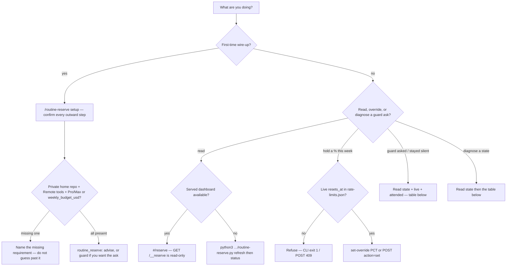

# Diagnose the routine token reserve — states, surfaces, this-week override, and guard asks

**Status:** **Primary diagnostic** — when `/routine-reserve status` (or the dashboard **Reserve** tab) looks empty, stuck, or "too high," an override is refused, or `routine_reserve: guard` asks / stays silent / only warns, check this first.

**Domain:** Agent operability / weekly-cap operations.

**Applies to:** Anyone wiring or operating the routine token reserve in a Claude Code project (`/routine-reserve`, `plugins/ravenclaude-core/scripts/routine-reserve.py`, served dashboard `#/reserve`). Mechanism + measured data sources: [`plugins/ravenclaude-core/knowledge/routine-token-reserve.md`](../../plugins/ravenclaude-core/knowledge/routine-token-reserve.md). Setup verbs: [`plugins/ravenclaude-core/skills/routine-reserve/SKILL.md`](../../plugins/ravenclaude-core/skills/routine-reserve/SKILL.md).

---

## Why this exists

The reserve shipped in ravenclaude-core **0.325.0** (PRs #1259 / #1260). Guard-mode *asks* shipped in **0.327.0** (PR #1273); this marketplace turned the knob on in PR #1274. The knowledge file records *how the numbers are built*; the skill records the 10-step setup. Neither is a "this status means X — do Y" rule. Mixing the surfaces up is how a session:

| Wrong move | What the code does instead |
|---|---|
| Treat `state: unknown` as a defect to "fix" | `unknown` is the honest empty: no live weekly reading **or** no calibrated `k` (and no `routine_reserve_weekly_budget_usd`). The projection is `null`, not zero. Fixture `03-unknown-uncalibrated`. |
| Open `#/reserve` on a static `dashboard.html` and expect live numbers | The tab needs `bin/rc dashboard`. `GET /__reserve` is served-only. A static copy shows an explanation. |
| Treat viewing the tab as "it refreshed the stored reserve" | `GET /__reserve` calls `compute_and_save(..., save=False)`. It never writes `reserve.json` or `calibration.json`. Hooks still read the last `refresh` / `status` write. Gate 291 F. |
| `set-override` / dashboard Set with no statusline reading | CLI prints to **stderr** and exits **1**: `no current weekly reset known`. Dashboard POST returns **409**. An override must expire at `resets_at`; there is no reset to expire at. |
| Set `routine_reserve: guard` and expect it to ask on every tool past the line | Guard asks **only** on autonomous work, in an attended interactive session, on a **live** statusline reading, in state `over`. `warn` / `infeasible`, headless (`CLAUDE_CODE_SESSION_ATTENDED` ≠ 1), SDK/Actions entrypoints, a subagent's own call, and an estimated/stale reading **warn once per band, never ask**. Ordinary tools (including a foreground `Agent` with `run_in_background: false`) are not guarded. |
| Treat a `PreToolUse` ask as already approved | Consent is recorded only on `PostToolUse` (`hook-consent`) after the asked call actually ran. A declined ask never reaches `PostToolUse`. Parallel guarded calls while an ask is pending (or was just declined) are **denied** for 90 s. |
| Flip the posture knob and expect Copilot / Codex / Gemini to warn | Those hosts skip the hooks — no Routines and no statusline `rate_limits` there. |
| Commit samples into a **public** home repo | Setup must refuse. Samples are account telemetry (Routine ids, costs, tokens). The data branch is `ravenclaude/usage-meter` in a **private** repo. |

Leave the knob **`off`** until setup has a private home repo and a statusline reading — the hook no-ops after one grep. Prefer **`advise`** for warning-only. Use **`guard`** when you want the attended ask before autonomous work past the line.

---

## How to apply



### The three surfaces (same engine, different writes)

| Surface | Reads | Writes | Use when |
|---|---|---|---|
| `/routine-reserve status` (slash default) | `refresh` then `status` | `pull` + `reserve.json` + `calibration.json` | Interactive Claude Code; print the engine output as-is |
| CLI `python3 …/routine-reserve.py <cmd>` | per subcommand | see exits below | Scripts, Gate 291, any host with `python3` |
| Served `#/reserve` | `GET /__reserve` (`save=False`) | `POST /__reserve-override` only (`override.json`) | Point-and-click Set/Clear; CSRF + same-origin like every other dashboard write |

Slash `override` / `clear-override` call the same `set_override` / `clear_override` as the tab. They cannot drift.

```bash
# Refresh the mirror + rewrite the stored projection (what SessionStart backgrounds)
python3 plugins/ravenclaude-core/scripts/routine-reserve.py refresh
python3 plugins/ravenclaude-core/scripts/routine-reserve.py status

# Machine-readable — same compute, writes reserve.json
python3 plugins/ravenclaude-core/scripts/routine-reserve.py status --json

# This-week override — refused without a live weekly reset
python3 plugins/ravenclaude-core/scripts/routine-reserve.py set-override 15
python3 plugins/ravenclaude-core/scripts/routine-reserve.py clear-override
```

Account state lives in `~/.ravenclaude/usage/` (override with `RAVENCLAUDE_USAGE_DIR`), not in `.ravenclaude/runs/`. Routines belong to the account.

### States (what `status` / `#/reserve` print)

`line_pct` = `100 − reserve_pct_effective`. `headroom_pct` = `max(0, 100 − current_pct)`.

| `state` | Condition (engine) | What to do |
|---|---|---|
| **`unknown`** | `current_pct` is null **or** effective reserve is null | No statusline reading and/or `k` is `uncalibrated`. Wire the statusline wrap, wait for a Pro/Max API response, or set `routine_reserve_weekly_budget_usd`. Do not treat this as 0% reserved. |
| **`ok`** | `current < line − warn_points` (default 5) | Interactive work is below the band. Advise hook and guard stay silent. |
| **`warn`** | `current ≥ line − warn_points` and still below the line | Once per session: user `systemMessage` + model `additionalContext`. Guard **warns**, never asks. Finish the turn or override if you intend to spend the reserve. |
| **`over`** | `current ≥ line` | Interactive use is already inside the share held for Routines. Advise: same once-per-band warning (escalates from `warn`). Guard: **asks** before autonomous work when the session is attended + interactive + the reading is live. |
| **`infeasible`** | no override **and** recommended reserve `>` headroom | The Routines alone need more than is left. **Warn only, never ask.** An override (if a live reset exists) replaces the recommended % and can leave this state. |

`estimated` is a flag, not a state. It is true when any Routine is under 3 measured runs, `k_source` is `uncalibrated`, the weekly % did not come from the statusline, or the reading is older than **2 hours**. Guard never asks on an estimated or stale reading.

### Override lifecycle

- Holds **exactly** `pct` (0–100) until the **current** `resets_at`, then the projection returns.
- NaN / out of range → CLI `"override must be a number from 0 to 100"` (exit 1). Dashboard rejects bool / string / out-of-range `pct` and unknown `action` with **400**.
- No live `resets_at` (or it is already in the past) → CLI exit **1** / POST **409**. The engine will not write an override that cannot expire with the week.
- `clear-override` unlinks `override.json`. Missing file is still success (`override cleared`).

### Posture + hook lanes

```yaml
# .ravenclaude/comfort-posture.yaml — silent until setup is real
routine_reserve: advise          # off | advise | guard  (anything else coerces to off)
routine_reserve_home: owner/repo # optional overlay; setup also writes ~/.ravenclaude/usage/config.json
routine_reserve_margin_pct: 20   # remaining_firings × cost × (1 + margin/100)
routine_reserve_warn_points: 5
routine_reserve_weekly_budget_usd: 0  # 0 = calibrate from weekly % ÷ metered spend
```

The hook (`scripts/routine-reserve-hook.sh`) no-ops unless that file exists **and** the line is exactly `advise` or `guard`. Then:

| `--event` | Host event | When it runs | What it does |
|---|---|---|---|
| `session` | SessionStart | `advise` or `guard` | `nohup … refresh` in the background. The session never waits on the network. |
| `prompt` | UserPromptSubmit | `advise` or `guard` | `hook-warn` speaks **once per state band per session** (`ok=0 < warn=1 < over=2 < infeasible=3`). Always exit **0**. |
| `guard` | PreToolUse | **`guard` only** | `hook-guard` — ask / deny / warn on autonomous work (table below). Script still exits **0**; the only deny is the engine JSON `permissionDecision`. |
| `consent` | PostToolUse | **`guard` only** | `hook-consent` — records consent after the asked tool ran. Prints nothing. |

### Guard mode (0.327.0) — when it asks

Autonomous work = `Workflow`, `ScheduleWakeup`, `CronCreate`, a background `Agent` / `Task` (the default; `run_in_background: false` is **not** guarded), or a Remote MCP call whose name matches `mcp__<server>__(create_session|send_message|fire_trigger|create_trigger)` **and** the server fragment contains `remote` (case-insensitive). Another server's `create_session` is not guarded.

| Situation | Decision | Why |
|---|---|---|
| State `over` + live statusline reading + attended interactive session + not a subagent + no consent yet | **`ask`** | A person can answer. Approving allows autonomous work for the rest of **this session this week**. |
| Same, while that ask is pending or was just declined (90 s) | **`deny`** | Parallel calls raise one ask, not several. Retry after the cooldown, or move the line with `/routine-reserve override`. |
| Same, after `PostToolUse` recorded consent for the asked `tool_use_id` | Silent | A different `tool_use_id` running does **not** count as consent. |
| New weekly `reset_at` | **`ask` again** | Consent is per session **and** per week. |
| State `warn` or `infeasible` | **warn** once per band | Never asks. `infeasible` is "Routines already need more than is left." |
| Headless (`CLAUDE_CODE_SESSION_ATTENDED` ≠ 1), SDK/Actions entrypoint, or a payload with `agent_id` | **warn** once per band | A headless `ask` is a denial (observed on `claude -p`). Never stall a Routine. |
| Estimated or stale reading (`current_source` ≠ `statusline` or `reading_stale`) | **warn** once per band | Estimated current is labelled and never drives an ask. |
| State `ok` or `unknown`, or any other tool | Silent | Nothing to hold back, or the call is not autonomous. |

Consent lives in `~/.ravenclaude/usage/guard/<session>.json` (session_id sanitized, exclusive lock). Escape: `/routine-reserve override <pct>` (or the Reserve tab), or set `routine_reserve: advise`.

### CLI exits

| Command | Exit |
|---|---|
| `ingest-statusline` (including junk stdin) | **0** — must never break a statusline |
| `refresh` / `compute` / `status` / `hook-warn` / `hook-guard` / `hook-consent` | **0** (refresh still 0 if `pull` failed; hook lanes still 0 on junk stdin) |
| `pull` | **0** on success, **1** if `home` is unset/malformed or fetch fails |
| `set-override` / `clear-override` | **0** on success, **1** on refuse / unlink error |
| unknown subcommand | **2** |
| `self-test --fixtures DIR` | **0** / **1** (Gate 291) |
| hook script | **always 0** |

**Do:**

- Run `/routine-reserve setup` and confirm each outward step (home repo, orphan data branch, engine sha256 pin, meter Routine, statusline wrap, then `advise` or `guard`).
- Refuse a **public** home repo unless the user explicitly allows it.
- Diagnose with `status --json`: read `state`, `current_source`, `k_source`, `reading_stale`, `not_counted`, `override_pct`.
- Use the served dashboard to Set/Clear only when a weekly reading already exists.
- When guard asks, answer that ask (or override / drop to `advise`). Do not spawn a second autonomous call while it is pending.
- Treat under-counted spend as *enlarging* the reserve (`k = weekly % ÷ metered spend`). That is the safe error. See the inventory concept.

**Don't:**

- Don't set `routine_reserve: advise` or `guard` before the meter has written a sample and the statusline has captured `rate_limits.seven_day`.
- Don't treat `GET /__reserve` as a refresh of what the hook reads.
- Don't expect `guard` to ask on `Bash`, a foreground `Agent`, `warn`/`infeasible`, a headless/SDK/subagent call, or an estimated reading — those warn or stay silent.
- Don't treat a pending `PreToolUse` ask as consent. Consent is `PostToolUse` after the asked `tool_use_id` ran.
- Don't open a PR from the data branch. It is an orphan, commits carry `[skip ci]`, and the meter prompt forbids a PR (cloud sessions default to opening one).
- Don't count event-triggered Routines, Cowork local tasks, or `CronCreate` jobs. They land in `not_counted` (`remaining_firings` is `None` without `cron` / `run_once_at`).
- Don't read `refresh` exit 0 as "the mirror is current" — `pull` failure is swallowed so SessionStart cannot stall.

---

## Edge cases / when the rule does NOT apply

- **No comfort-posture file, or `routine_reserve: off`.** Hook grep fails closed. Engine `load_config` still computes if you invoke the CLI; the statusline segment stays empty while stored `mode` is `off` or `current_pct` is null. `load_config` coerces any mode other than exactly `advise` / `guard` to `off` (YAML `off` parses to `false` on the dashboard; the Save path maps that back to `off`).
- **`routine_reserve_weekly_budget_usd` > 0.** `k` is `100 / budget` (`k_source`: `manual budget`). No statusline % is required to *project* a reserve; an override still needs a live `resets_at`. An estimated current from metered spend is labelled and never drives an ask.
- **Stale or rolled-over reading.** If `resets_at` is already in the past, the engine drops it (`reset_assumed: true`, horizon = now + 7 days). Override set is then refused until a new statusline capture. `reading_stale` is true when the capture is older than 2 hours — guard then warns instead of asking.
- **Cold start (< 3 settled runs).** A Routine's cost blends its own runs with the **median** run across all Routines (never the max) and is flagged `estimated`. A run counts only after its session has been idle ≥ 1 hour.
- **Persistent session.** Cost is the growth between firings, not the session total. First sight of a long-lived session is a baseline (no cost that firing).
- **Uninstall.** Deletes the meter Routine, restores `statusline-previous.json`, sets the knob `off`. Leaves the data branch in place and names it.
- **Hosts other than Claude Code.** No statusline `rate_limits`, no Remote `list_triggers`. Manual fallback in the skill (print the prompt; user creates the Routine at claude.ai).
- **`CLAUDE_CODE_SESSION_ATTENDED` is per Claude process.** A nested `claude -p` sees `0` under an attended parent. `CLAUDE_CODE_ENTRYPOINT` *is* inherited. The meter records its own `attended` on every firing.

---

## See also

- [`plugins/ravenclaude-core/knowledge/routine-token-reserve.md`](../../plugins/ravenclaude-core/knowledge/routine-token-reserve.md) — data sources, guard-mode table, safety properties, honest limits
- [`plugins/ravenclaude-core/knowledge/concepts/routine-reserve-errs-toward-a-larger-reserve.md`](../../plugins/ravenclaude-core/knowledge/concepts/routine-reserve-errs-toward-a-larger-reserve.md) — why missing spend *enlarges* `k`
- [`plugins/ravenclaude-core/skills/routine-reserve/SKILL.md`](../../plugins/ravenclaude-core/skills/routine-reserve/SKILL.md) — setup / status / override / uninstall verbs
- [`scheduled-and-overnight-runs.md`](./scheduled-and-overnight-runs.md) — composing unattended work; this reserve is the weekly-cap floor those loops spend against
- [`comfort-posture-behavioral-flags-vs-permissions.md`](./comfort-posture-behavioral-flags-vs-permissions.md) — `routine_reserve:` is another orthogonal surface; `allow` rules do not turn it on
- Engine + Gate 291: `plugins/ravenclaude-core/scripts/routine-reserve.py` (`project`, `set_override`, `hook_warn`, `hook_guard`, `hook_consent`), `scripts/routine-reserve-hook.sh`, `hooks/tests/test-gate291-routine-reserve.sh`

---

## Provenance

Weekly docs scan (2026-09-27) drafted the operator diagnostic on PR #1262 against 0.325.0 / 0.326.0, when `guard` still aliased `advise`. Guard-mode asks landed 2026-10-02 (PR #1273, core 0.327.0); this marketplace set `routine_reserve: guard` the same day (PR #1274). This file is that diagnostic, rebased onto main and updated so the "guard aliases advise" row is no longer true. Verified 2026-10-04 against `routine-reserve.py` (`project`, `set_override`, `hook_warn`, `hook_guard`, `autonomous_tool`, `_interactive`, `hook_consent`, `main`), `routine-reserve-hook.sh` (four `--event` lanes), `serve-dashboards.py` (`_read_reserve` / `_write_reserve_override` 400/409), and `plugins/ravenclaude-core/hooks/hooks.json` (PreToolUse `guard` + PostToolUse `consent`). Gate 291 this session: run after the write.

---

_Last reviewed: 2026-10-04 by `docs-automation`_
