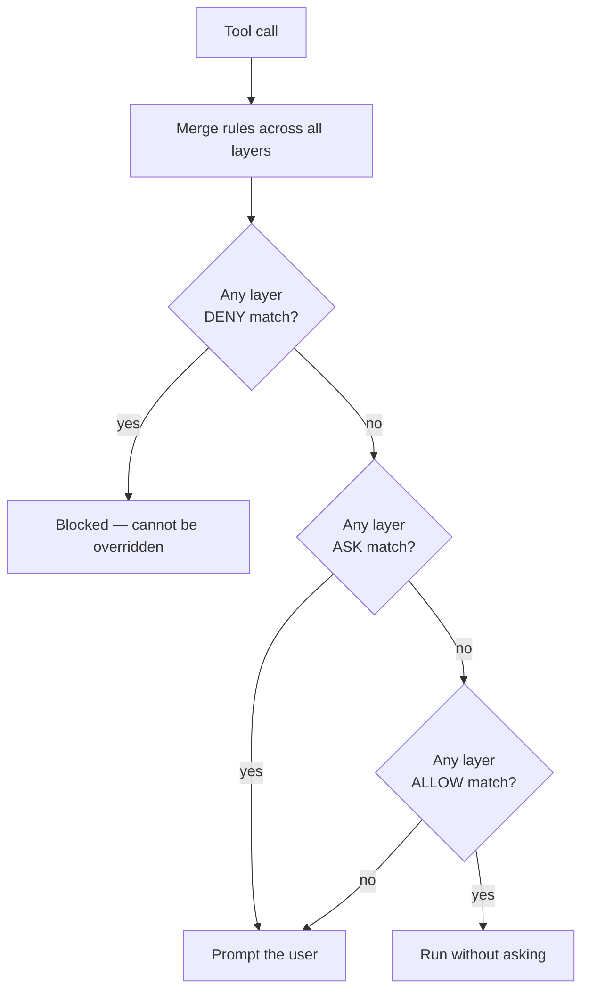
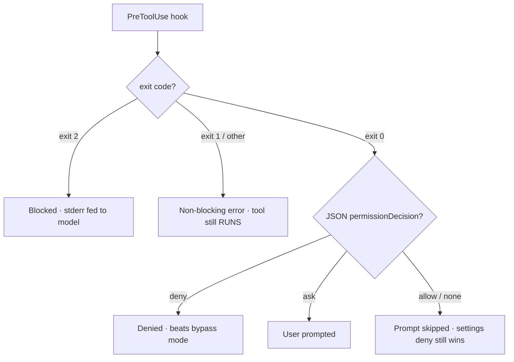
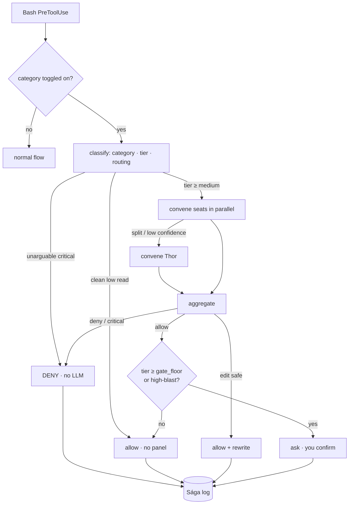

<!-- GENERATED by scripts/generate-concepts-doc.py from
     plugins/ravenclaude-core/knowledge/concepts/ — DO NOT EDIT BY HAND.
     Edit the concept source and re-run the generator. The dashboard's
     interactive "Learn" tab is built from the same source. -->

# How RavenClaude works — concept reference

A plain-language reference for the moving parts: the platform facts RavenClaude
builds on, and what it adds on top. Each concept below is mirrored — with
interactive diagrams, search, and live widgets — in the comfort-posture
dashboard's **Learn** tab (`/dashboard`).

## Platform model

### Permission layers & precedence · _platform fact_

> Four settings files merge — a deny in ANY layer wins, and you can't override it down from a later layer.

Permission rules live under `permissions.allow`, `permissions.ask`, and `permissions.deny` in any of the settings files. Each rule is either a bare tool name (`Bash`, `WebSearch`) or a tool plus a specifier (`Bash(git status:*)`, `Read(/etc/**)`).

**Within one file**, rules evaluate `deny → ask → allow` — the first match wins, so deny always beats ask and ask always beats allow.

**Across files**, the layers **merge** rather than override: a deny in *any* layer blocks the action regardless of allow rules elsewhere. You **cannot override down** — if your user-level settings deny `Bash(rm *)`, no project-level allow re-enables it. That's the safe behavior, but it surprises people who expect a later layer to win.

The most-surprising rule: a **bare-tool deny** (`deny: ["Bash"]`) removes the tool from Claude's context entirely — Claude never sees it. A **scoped deny** (`Bash(rm *)`) keeps the tool and blocks only matching calls.

**See also:** Hooks: verdicts & exit codes · Command-review tribunal (the Thing)

**Sources:** [Configure permissions](https://code.claude.com/docs/en/permissions) · [Claude Code settings](https://code.claude.com/docs/en/settings)

_Last verified: 2026-05-25_

---

### Hooks: verdicts & exit codes · _platform fact_

> Only exit 2 blocks a tool call; a hook deny beats bypass mode, but a hook allow can't override a settings deny.

A `PreToolUse` hook reads the pending tool call as JSON on stdin and decides its fate. **Exit codes are the load-bearing, easy-to-get-wrong detail:** only **exit 2** blocks (and the hook's stderr is fed back to the model); **exit 0** allows; and **exit 1 or any other code is a *non-blocking* error — the tool still runs.** The trap is that `exit 1` is the conventional Unix "failure", so a policy hook that fails with `exit 1` *looks* like it blocked but doesn't.

For richer control, a hook can instead print a `hookSpecificOutput.permissionDecision` JSON on **exit 0**: `allow`, `deny`, `ask`, or `defer` (headless-only). When several hooks and rules apply, priority is **`deny` > `defer` > `ask` > `allow`**.

Two asymmetries make this safe: a hook **`deny` beats permission-mode bypass** (it blocks even under `bypassPermissions`), but a hook **`allow` does NOT override a settings `deny`** — hooks can *tighten* but never *loosen*. Note hooks **fail open**: on timeout or crash the tool proceeds, so a hook that must fail closed has to emit its own `deny` before its deadline.

**See also:** Permission layers & precedence · Command-review tribunal (the Thing)

**Sources:** [Hooks reference](https://code.claude.com/docs/en/hooks) · [Hooks guide](https://code.claude.com/docs/en/hooks-guide)

_Last verified: 2026-05-25_

---

## Security

### Command-review tribunal (the Thing) · _RavenClaude-built_

> An opt-in panel of reviewer seats that votes ALLOW/EDIT/DENY on shell commands instead of interrupting you.

**Command review** — codename *the Thing* — is an opt-in panel of reviewer agents that adjudicates shell commands instead of stopping to ask you. It sits **on top of** comfort-posture: posture sets the policy (allow/ask/deny per category); the tribunal is the adjudicator you switch on for a category so a verdict lands in seconds.

Routing is **tiered**. Every command resolves to `low → medium → high → extreme` (its category base tier, bumped by a deterministic high/critical concern). A clean `low` read runs **no panel at all** (zero cost); seat count and the confidence bar escalate with the tier. Up to three seats run in parallel — **Forseti** (security), **Mímir** (code), **Heimdall** (injection) — with **Thor** (architect) convened only on a split.

The **`gate_floor`** knob (default `high`) is the lowest tier whose *confident ALLOW* is surfaced to you as an `ask`. DENY still blocks and EDIT still rewrites autonomously, so the tribunal pre-filters the dangerous and the fixable before either reaches you. Two hard overrides ignore the knob: **reads are never surfaced**, and **irreversible high-blast allows always are**. An abstaining panel always fails **closed**. It can never relax the `security_deny` floor.

**See also:** Permission layers & precedence · Hooks: verdicts & exit codes

**Sources:** [thing skill (operating reference)](plugins/ravenclaude-core/skills/thing/SKILL.md) · [Tribunal design](docs/tribunal-review-feature-design.md)

_Last verified: 2026-05-26_

---
