<!-- GENERATED by scripts/generate-concepts-doc.py from
     plugins/ravenclaude-core/knowledge/concepts/ — DO NOT EDIT BY HAND.
     Edit the concept source and re-run the generator. The dashboard's
     interactive "Learn" tab is built from the same source. -->

# How RavenClaude works — concept reference

A plain-language reference for the moving parts: the platform facts RavenClaude
builds on, and what it adds on top. Each concept below is mirrored — with
interactive diagrams, search, and live widgets — in the comfort-posture
dashboard's **Learn** tab (`/dashboard`).


## Foundations

### The agent loop: one turn · _platform fact_

> Every agent turn runs the same loop: assemble prompt → call model → run tools → feed results back → repeat until done. The 'harness' is the software wrapping the model that drives it.

A language model on its own is **stateless**: it forgets what it did three steps ago, a failed tool call would otherwise vanish silently, and its context window fills with noise. An **agent** is a model plus the software that fixes all that — the **harness**. As the saying goes, *"if you're not the model, you're the harness."*

The harness drives one **turn** as a loop, and every agentic tool — Claude Code, the Agent SDK, your own script — runs some version of it:

1. **Assemble the prompt** — system prompt + tool schemas + project memory (`CLAUDE.md` / `AGENTS.md`) + the conversation so far + your message.
2. **Call the model.**
3. **Classify the output** — did it ask to use a tool, or just answer? Plain text with no tool call ends the turn.
4. **Execute the requested tools** — and this is where permission gates, hooks, or a review panel can deny, edit, or wave the call through.
5. **Package the results** as the next message — crucially, an *error* comes back as a result the model can read and self-correct from, not a crash.
6. **Update context** (compacting when it fills) and loop back to step 1.

The same loop scales up: a lead agent can **dispatch a subagent** for a slice of work and fold its short summary back in at step 5. A guiding principle the better harnesses inherit: **treat memory as a hint and verify against real state before acting** — which is why a careful agent doesn't stop at "looks done," it stops when a verification step says it's done.

RavenClaude is one such harness layer: it rides on Claude Code's loop and adds orchestration, a review tribunal at step 4, and verification gates at the end — but the loop itself is how *any* agent works by default.

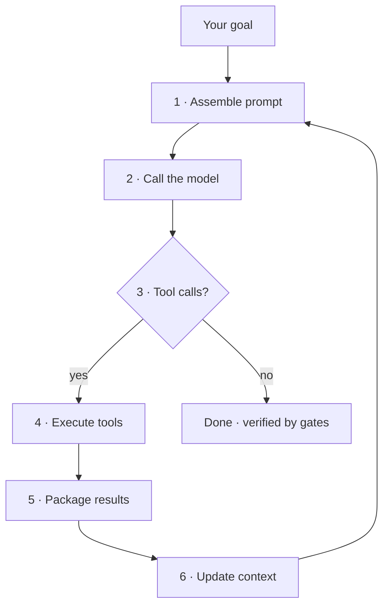
```mermaid
flowchart TD
  U[Your goal] --> P[1 · Assemble prompt]
  P --> L[2 · Call the model]
  L --> C{3 · Tool calls?}
  C -->|yes| T[4 · Execute tools]
  T --> R[5 · Package results]
  R --> X[6 · Update context]
  X --> P
  C -->|no| D[Done · verified by gates]
  class P,L,C,T,R,X,D built
```

**See also:** Tool use (function calling) · The context window · Subagents & orchestration

**Sources:** [Building agents with the Claude Agent SDK](https://code.claude.com/docs/en/agent-sdk) · ["The Anatomy of an Agent Harness" (Akshay Pachaar)](https://x.com/_avichawla/status/2062082282878627946)

_Last verified: 2026-06-05_


---

### Tool use (function calling) · _platform fact_

> A model can't act on its own — it asks for a tool by name, the harness runs it, and the result comes back as the next message. That request/result loop is every agent action.

A language model only produces **text**. It can't read a file, run a command, or call an API by itself. **Tool use** (also called *function calling*) is the bridge: you describe the available tools — each with a name, a description, and a JSON schema for its inputs — and the model, instead of answering in prose, emits a structured **tool-use request** naming one tool and the arguments to call it with.

The model never runs anything. The **harness** (Claude Code, the Agent SDK, your own loop) executes the requested tool, captures the output, and feeds it back as a **tool-result** message. The model reads that result on the next turn and decides what to do next — call another tool, or answer. Every single thing an agent *does* — edit a file, run a test, open a PR — is one trip around this request → execute → result cycle.

Three details that bite:

- **The model picks the tool, not the harness.** You can constrain it (`tool_choice` can force a specific tool, force *any* tool, or leave it `auto`), but in normal operation the model chooses. A vague tool description is the most common reason it picks the wrong one or fills arguments badly.
- **Errors are data, not crashes.** A failed tool call should return its error *as a tool-result* so the model can read it and self-correct. Throwing away the loop on the first failure is the classic broken-agent bug.
- **Results re-enter the context window.** Tool output isn't free — a command that dumps 10k lines lands all of it back in the prompt. This is why focused tools that return *conclusions* beat raw firehoses.

A permission layer can sit between the request and the execution: the model may *ask* for a tool, but the harness (or a hook, or a tribunal) can still deny, edit, or gate the call before it runs.

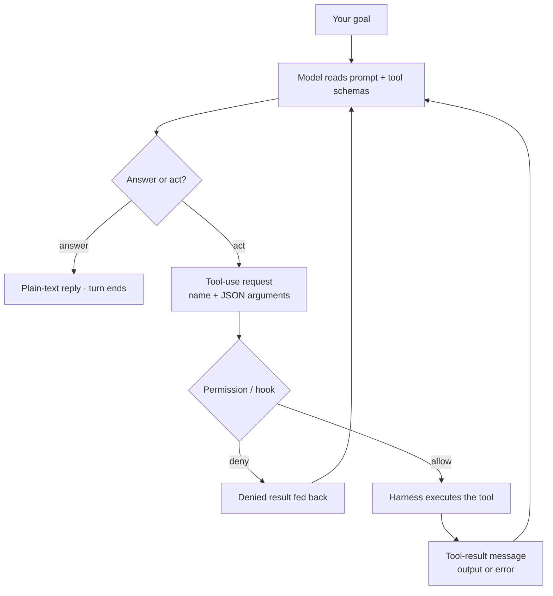
```mermaid
flowchart TD
  G[Your goal] --> M[Model reads prompt + tool schemas]
  M --> D{Answer or act?}
  D -- answer --> OUT[Plain-text reply · turn ends]
  D -- act --> REQ[Tool-use request<br/>name + JSON arguments]
  REQ --> GATE{Permission / hook}
  GATE -- deny --> BACK[Denied result fed back]
  GATE -- allow --> RUN[Harness executes the tool]
  RUN --> RES[Tool-result message<br/>output or error]
  RES --> M
  BACK --> M
  class M,REQ,RUN,RES fact
  class GATE built
```

**See also:** The agent loop: one turn · Permission layers & precedence

**Sources:** [Tool use (function calling) — Claude API](https://docs.claude.com/en/docs/build-with-claude/tool-use) · [Agent SDK — tools & permissions](https://code.claude.com/docs/en/agent-sdk)

_Last verified: 2026-06-05_


---

### The context window · _platform fact_

> Everything the model 'knows' this turn is the text in its context window — system prompt, tools, history, files. It's finite, it fills up, and when it's full the harness compacts.

A model has **no memory between turns.** Everything it "knows" while answering is whatever text sits in its **context window** right now: the system prompt, the tool schemas, the project instructions (`CLAUDE.md` / `AGENTS.md`), the conversation so far, and the contents of any file or tool result that's been pulled in. Nothing outside that window exists to the model — if it isn't in context, the model can't see it, no matter how relevant.

The window is **finite** (measured in tokens — roughly ¾ of a word each). Two consequences follow:

- **It fills up.** Long sessions, big files, and chatty tool output all consume the budget. As it fills, the *effective* room for reasoning shrinks, and far-back details get crowded out — the model can genuinely "forget" what happened early in a long session.
- **When it's nearly full, the harness compacts.** Claude Code summarizes the older part of the conversation into a compact recap and continues with that plus the recent turns. The work isn't lost, but it's now a *summary* — which is why durable facts belong in `CLAUDE.md` or committed files, not just in chat.

The practical model: treat context like a **desk, not a filing cabinet.** Things on the desk are usable now; everything else has to be fetched back on (a tool call, a file read) before the model can use it — and fetching it costs space. Good agent design keeps the desk clear: focused tool results, subagents that return short summaries instead of raw dumps, and important state written somewhere persistent.

This is also why a **SessionStart** context injection (the orientation banner) is deliberately kept small — it rides in *every* session's window, so it's a recurring tax on the budget.

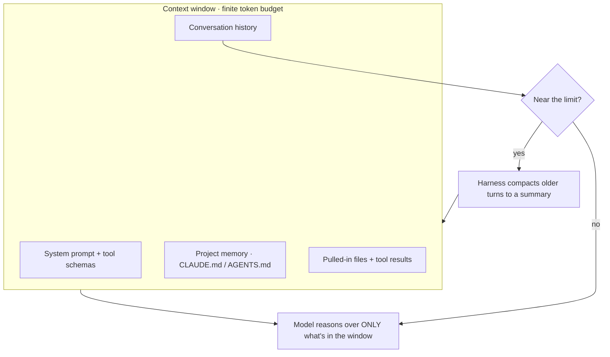
```mermaid
flowchart TD
  subgraph W[Context window · finite token budget]
    S[System prompt + tool schemas]
    P[Project memory · CLAUDE.md / AGENTS.md]
    H[Conversation history]
    F[Pulled-in files + tool results]
  end
  W --> M[Model reasons over ONLY what's in the window]
  H --> FULL{Near the limit?}
  FULL -- yes --> C[Harness compacts older turns to a summary]
  C --> W
  FULL -- no --> M
  class S,P,H,F,M fact
  class C built
```

**See also:** The agent loop: one turn · Tool use (function calling) · SessionStart context injection

**Sources:** [Context windows — Claude API](https://docs.claude.com/en/docs/build-with-claude/context-windows) · [Manage context — Claude Code](https://code.claude.com/docs/en/costs)

_Last verified: 2026-06-05_


---

### Subagents & orchestration · _platform fact_

> A lead agent can spawn focused subagents, each with its own clean context window, and get back a short summary — not the raw work. It's how big tasks stay inside finite context.

A single agent doing a sprawling task hits two walls: its **context window fills** with the noise of exploration, and a long linear chain has no parallelism. **Subagents** solve both. The lead agent (the *orchestrator*) hands a self-contained slice of work to a **subagent** — a fresh agent with its **own clean context window**, its own tools, and a focused brief. The subagent does the legwork and returns a **short summary** to the lead. The raw files it read and dead-ends it explored never touch the lead's context.

This is the **orchestrator–worker** pattern, and the load-bearing idea is *information hiding*: the lead pays only for the conclusion, not the investigation. A research subagent might read forty files and reply with a two-paragraph answer — forty files' worth of tokens spent in a context the lead never has to carry.

What it's good at, and where it bites:

- **Fan-out.** Independent slices run in parallel — three subagents searching three areas at once, returning three summaries. Big wall-clock win when the slices don't depend on each other.
- **Focus.** A narrowly-scoped subagent with the right tools beats one giant agent juggling everything, the same way a specialist beats a generalist.
- **The summary is the seam — and the risk.** The lead sees *only* what the subagent reports back. A subagent that summarizes badly, or drops a detail the lead needed, silently loses that information. Briefs should say what to return, not just what to do.
- **Subagents don't share memory with each other.** Each is isolated by design, so coordination happens through the lead, not sideways between workers.

RavenClaude's Team Lead is exactly this pattern with named specialists; the command-review tribunal's parallel reviewer seats are another instance — several focused agents, one aggregated verdict.

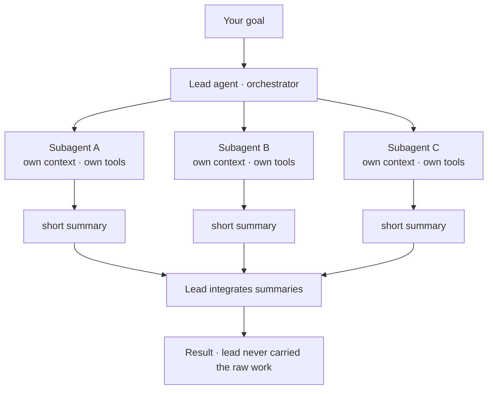
```mermaid
flowchart TD
  U[Your goal] --> L[Lead agent · orchestrator]
  L --> A[Subagent A<br/>own context · own tools]
  L --> B[Subagent B<br/>own context · own tools]
  L --> C[Subagent C<br/>own context · own tools]
  A --> SA[short summary]
  B --> SB[short summary]
  C --> SC[short summary]
  SA --> L2[Lead integrates summaries]
  SB --> L2
  SC --> L2
  L2 --> OUT[Result · lead never carried the raw work]
  class L,L2,A,B,C fact
  class OUT built
```

**See also:** The context window · The agent loop: one turn · Tool use (function calling)

**Sources:** [Subagents — Claude Code](https://code.claude.com/docs/en/sub-agents) · [Building agents with the Agent SDK](https://code.claude.com/docs/en/agent-sdk)

_Last verified: 2026-06-05_


---

### MCP: tools & data over a protocol · _platform fact_

> The Model Context Protocol is a standard way to plug external tools and data into any agent. Write a server once; every MCP-aware client can use it — no per-app glue.

Tool use lets a model call a tool — but who *supplies* the tools? If every integration (GitHub, a database, a ticketing system) had to be hand-wired into every agent, you'd rebuild the same connectors over and over. The **Model Context Protocol (MCP)** is the open standard that fixes this. It's often described as *"a USB-C port for AI"*: a single, uniform way for an agent to plug into outside tools and data.

The shape is **client ↔ server.** Your agent host (Claude Code, an IDE, a desktop app) is an **MCP client**. An **MCP server** is a small program that exposes capabilities over the protocol. Write the server once, and *any* MCP-aware client can use it — the glue is the protocol, not bespoke per-app code. Servers offer three kinds of primitive:

- **Tools** — actions the model can call (the GitHub tools this very session uses are an MCP server).
- **Resources** — data the agent can read (files, records, query results).
- **Prompts** — reusable prompt templates the server provides.

Two things worth knowing:

- **Servers run as separate processes** and connect over a transport (local stdio, or remote HTTP/SSE). A server may be on your machine or across the network — the client talks to both the same way.
- **MCP tools are still just tool use.** Once connected, an MCP tool appears to the model exactly like any built-in tool: same request/result loop, same permission gating. MCP standardizes *where tools come from*, not *how the model calls them*. (In Claude Code a server can show as "still connecting" at startup — its tools are name-only until the schema loads, which is a connection state, not an absent capability.)

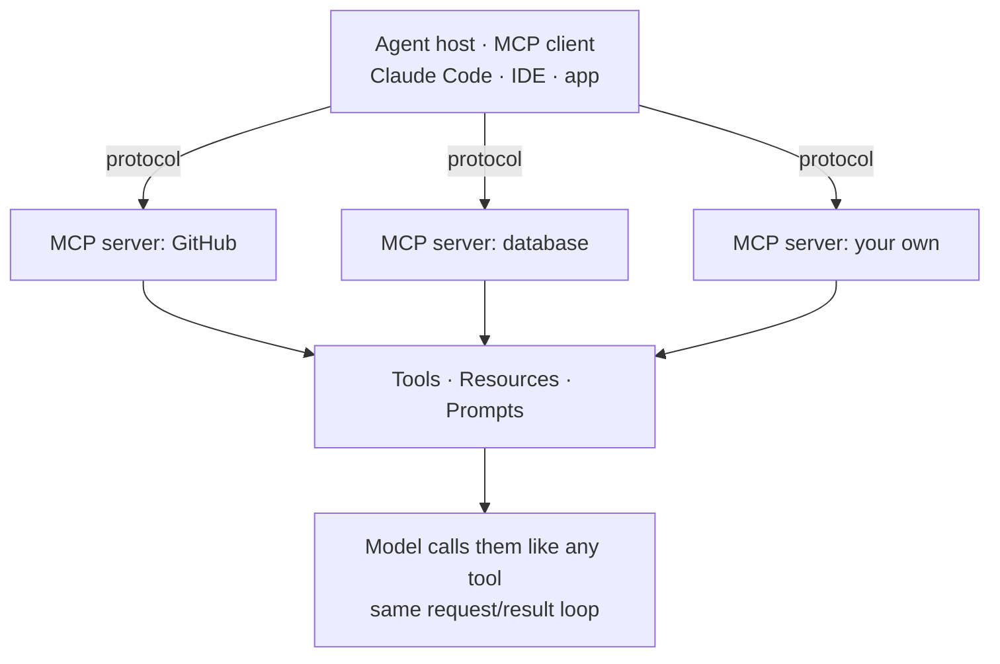
```mermaid
flowchart TD
  H[Agent host · MCP client<br/>Claude Code · IDE · app] -->|protocol| S1[MCP server: GitHub]
  H -->|protocol| S2[MCP server: database]
  H -->|protocol| S3[MCP server: your own]
  S1 --> P[Tools · Resources · Prompts]
  S2 --> P
  S3 --> P
  P --> M[Model calls them like any tool<br/>same request/result loop]
  class H,M fact
  class S1,S2,S3 built
```

**See also:** Tool use (function calling) · The agent loop: one turn

**Sources:** [Model Context Protocol — specification](https://modelcontextprotocol.io) · [Connect to MCP servers — Claude Code](https://code.claude.com/docs/en/mcp)

_Last verified: 2026-06-05_


---

### Choosing a model · _platform fact_

> Bigger isn't always better. Match the model to the job — a fast, cheap model for routine steps, a frontier model for hard reasoning — and use the strong one to supervise the cheap ones.

An agent isn't locked to one model, and the strongest model isn't always the right one. Picking a model is a **cost / latency / capability** trade, and the three tiers exist precisely so you can match the model to the work:

- **Frontier (e.g. Opus)** — deepest reasoning, hardest planning, gnarliest debugging. Slower and most expensive per token. Reach for it when the task genuinely needs it.
- **Balanced (e.g. Sonnet)** — the everyday workhorse: strong reasoning at much lower cost and latency. The sensible default for most agent work.
- **Fast (e.g. Haiku)** — quick, cheap, great for classification, routing, summarizing, and high-volume routine steps where frontier-grade reasoning is overkill.

Two ideas make this practical:

- **Mix models within one task.** A capable orchestrator can plan and supervise while dispatching the routine legwork to a faster, cheaper model — *strong model supervises, cheap models execute.* Subagents are the natural place to drop a tier: the lead reasons in Sonnet/Opus, the workers grind in Haiku.
- **Diversity is a safety property, not just a cost one.** When multiple agents *review* the same thing, running them all on the **same** model means one model's blind spot can pass the whole panel — the "anti-correlated hallucination" failure. Deliberately running ≥2 *different* backbones on a review panel catches what a monoculture would miss. (RavenClaude's command-review tribunal enforces exactly this.)

The wrong instinct is "always use the biggest model." The right instinct is "use the smallest model that reliably clears this specific bar," and let a stronger model check the cheaper ones' work.

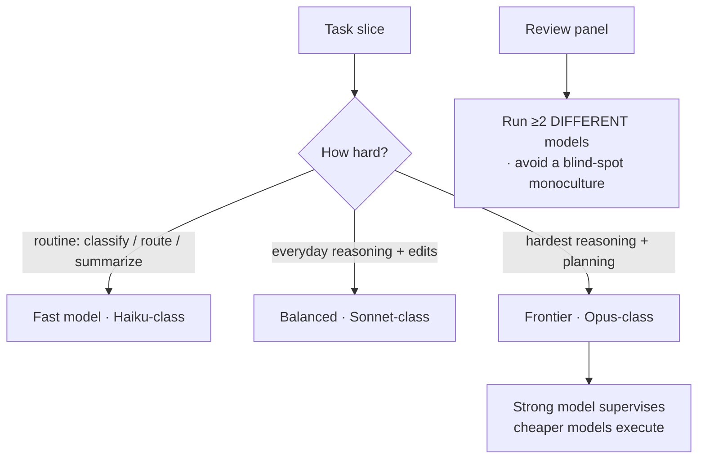
```mermaid
flowchart TD
  T[Task slice] --> Q{How hard?}
  Q -- routine: classify / route / summarize --> FAST[Fast model · Haiku-class]
  Q -- everyday reasoning + edits --> BAL[Balanced · Sonnet-class]
  Q -- hardest reasoning + planning --> FRONT[Frontier · Opus-class]
  FRONT --> SUP[Strong model supervises<br/>cheaper models execute]
  REV[Review panel] --> DIV[Run ≥2 DIFFERENT models<br/>· avoid a blind-spot monoculture]
  class FAST,BAL,FRONT,Q fact
  class SUP,DIV built
```

**See also:** The agent loop: one turn · Subagents & orchestration

**Sources:** [Models overview — Claude API](https://docs.claude.com/en/docs/about-claude/models) · [Choosing a model — Claude Code](https://code.claude.com/docs/en/model-config)

_Last verified: 2026-06-05_


---

### Source control basics · _platform fact_

> Git is a time-machine for your files. RavenClaude does most of the git work for you — this page is the vocabulary so you can follow along.

**Source control** (the tool is called **git**, the website is **GitHub**) is a time-machine for every file in a project: every change is saved as a labeled snapshot, and many people can work on the same project in parallel without overwriting each other. The load-bearing fact for you: **RavenClaude does almost all of the git work for you** — this page is the vocabulary so you understand what Claude Code is doing on your behalf, and can step in when something goes sideways.

**Four ideas cover almost everything you'll see:**

- **Commit** — one saved snapshot of your work, with a short message explaining _why_ (not what — the diff already shows what).
- **Branch** — a parallel timeline for a piece of work-in-progress, kept separate from the project's official timeline (the **main** branch).
- **Pull request (PR)** — a proposal that the work on a branch be merged back into main; it gets reviewed (by a person, by CI checks, sometimes by Claude) before anything moves.
- **Merge** — combining a branch's commits into main once the PR is approved.

**The minimum vocabulary** you'll see in commands and logs:

- `git status` — what's changed since the last snapshot
- `git add <file>` — stage a file for the next snapshot
- `git commit -m "why"` — take the snapshot
- `git push` — upload local commits to GitHub
- `git pull` — download new commits from GitHub
- `git log` — read the history

**Two patterns you'll actually encounter in this repo:**

1. **Docs commit straight to main, no PR.** Pure documentation under `docs/` (plans, designs, research notes, the rolling session log) commits direct to main because it can't break a consumer's `/plugin marketplace update`. Faster planning loop.
2. **Code, hooks, manifests, and CI go through a PR.** Claude Code creates the branch, makes the commits, opens the PR, and tells you the URL. You review in GitHub and click **Merge**.

**The safety nets** mean you can experiment without breaking things:

- The `guard-destructive.sh` hook blocks the truly destructive commands — **force-push to main**, `git reset --hard`, `git clean -f`, and `git branch -D` on a protected branch. It denies them before they run.
- The sanctioned way to retire a finished branch is `scripts/archive-branch.sh` — it **tags the branch tip** (so the work is recoverable forever on the tag), pushes the tag to GitHub, writes an audit log, then deletes the local branch. Work is never actually lost.

You will rarely type any of these commands yourself. The reason to learn the vocabulary is so that when Claude says _"I opened PR #238 on branch `feat/rc-hardener-followups`"_ or _"the guard denied a force-push"_, you know exactly what happened and what your next click is.

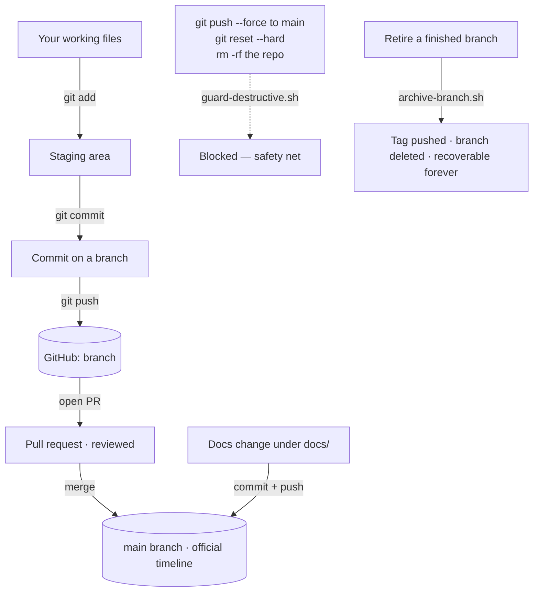
```mermaid
flowchart TD
  W[Your working files] -->|git add| S[Staging area]
  S -->|git commit| C[Commit on a branch]
  C -->|git push| GH[(GitHub: branch)]
  GH -->|open PR| PR[Pull request · reviewed]
  PR -->|merge| MAIN[(main branch · official timeline)]
  D[Docs change under docs/] -->|commit + push| MAIN
  X[git push --force to main<br/>git reset --hard<br/>rm -rf the repo] -.->|guard-destructive.sh| BLOCK[Blocked — safety net]
  R[Retire a finished branch] -->|archive-branch.sh| TAG[Tag pushed · branch deleted · recoverable forever]
  class C,PR,MAIN,TAG fact
  class BLOCK,GH built
```

**See also:** Getting started · Layout enforcement

**Sources:** [AGENTS.md — PR conventions](AGENTS.md) · [AGENTS.md — House rules (branch-archive)](AGENTS.md) · [branch-archive skill](plugins/ravenclaude-core/skills/branch-archive/SKILL.md) · [Pro Git — About Version Control](https://git-scm.com/book/en/v2/Getting-Started-About-Version-Control)

_Last verified: 2026-06-04_


---


## Getting started

### Getting started · _RavenClaude-built_

> Add the marketplace, install ravenclaude-core, run /dashboard. Needs jq + python3; under Copilot CLI it's `ravenclaude install`.

RavenClaude is a Claude Code **plugin marketplace**. To use the core plugin: add the marketplace, install the plugin, reload. `jq` and `python3` are required for the CI workflows and the layout-enforcement hook (both ship in the devcontainer).

```text
/plugin marketplace add mcorbett51090/RavenClaude
/plugin install ravenclaude-core@ravenclaude
/reload-plugins
```

After install, run **`/dashboard`** to launch the comfort-posture editor (point-and-click permission rules + command-review toggles, with one-click Save & apply). Domain plugins (`power-platform`, `finance`, …) build on core, so install it first. Running under **GitHub Copilot CLI** instead? Use `bash scripts/ravenclaude install` — and from then on, updating is just `git pull`.

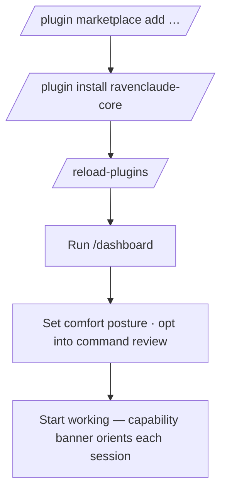
```mermaid
flowchart TD
  A[/plugin marketplace add …/] --> B[/plugin install ravenclaude-core/]
  B --> C[/reload-plugins/]
  C --> D[Run /dashboard]
  D --> E[Set comfort posture · opt into command review]
  E --> F[Start working — capability banner orients each session]
  class A,B,C,D,E,F built
```

**See also:** Comfort-posture dashboard · Capability-orientation banner

**Sources:** [ravenclaude-core README](plugins/ravenclaude-core/README.md) · [AGENTS.md — Setup commands](AGENTS.md)

_Last verified: 2026-05-26_


---


## Platform model

### Permission layers & precedence · _platform fact_

> Four settings files merge — a deny in ANY layer wins, and you can't override it down from a later layer.

Permission rules live under `permissions.allow`, `permissions.ask`, and `permissions.deny` in any of the settings files. Each rule is either a bare tool name (`Bash`, `WebSearch`) or a tool plus a specifier (`Bash(git status:*)`, `Read(/etc/**)`).

**Within one file**, rules evaluate `deny → ask → allow` — the first match wins, so deny always beats ask and ask always beats allow.

**Across files**, the layers **merge** rather than override: a deny in *any* layer blocks the action regardless of allow rules elsewhere. You **cannot override down** — if your user-level settings deny `Bash(rm *)`, no project-level allow re-enables it. That's the safe behavior, but it surprises people who expect a later layer to win.

The most-surprising rule: a **bare-tool deny** (`deny: ["Bash"]`) removes the tool from Claude's context entirely — Claude never sees it. A **scoped deny** (`Bash(rm *)`) keeps the tool and blocks only matching calls.

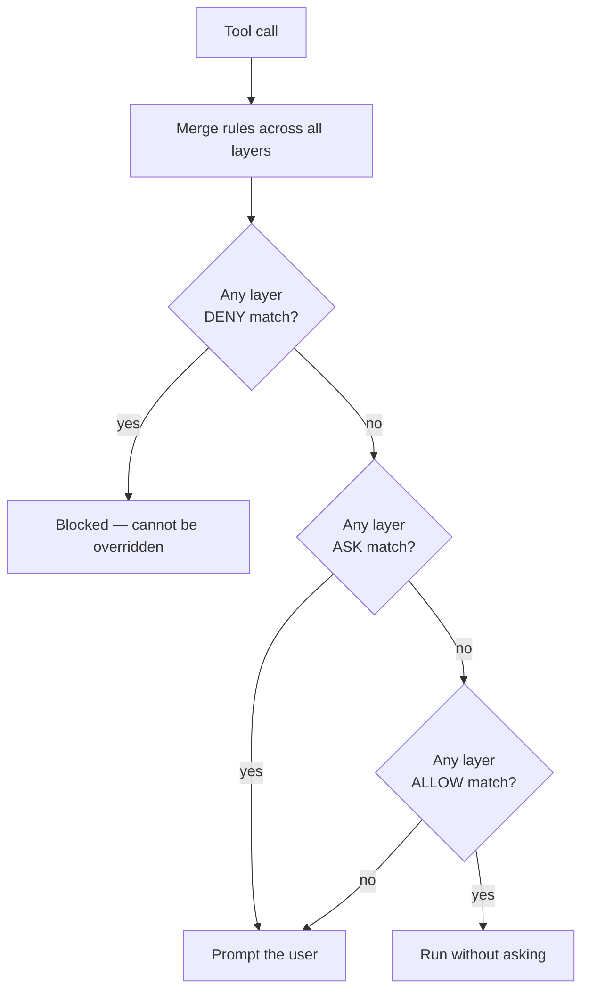
```mermaid
flowchart TD
  CALL[Tool call] --> MERGE[Merge rules across all layers]
  MERGE --> D{Any layer<br/>DENY match?}
  D -- yes --> BLOCK[Blocked — cannot be overridden]
  D -- no --> A{Any layer<br/>ASK match?}
  A -- yes --> PROMPT[Prompt the user]
  A -- no --> AL{Any layer<br/>ALLOW match?}
  AL -- yes --> RUN[Run without asking]
  AL -- no --> PROMPT
  class BLOCK built
  class D,A,AL fact
```

**See also:** Hooks: verdicts & exit codes · Command-review tribunal (the Thing)

**Sources:** [Configure permissions](https://code.claude.com/docs/en/permissions) · [Claude Code settings](https://code.claude.com/docs/en/settings)

_Last verified: 2026-05-25_


---

### Permission modes · _platform fact_

> Six modes from default to bypassPermissions — but bypass still prompts on rm -rf /, and auto silently drops broad allow rules.

The permission **mode** sets the baseline posture on top of your allow/ask/deny rules. There are six: `default` (prompt when uncertain), `acceptEdits` (auto-approve common filesystem Bash inside the cwd), `plan` (read/think only — no writes), `auto` (research-preview classifier-driven autonomy), `dontAsk` (auto-deny anything not explicitly allowed — handy for CI), and `bypassPermissions` (skips most checks).

Two surprises bite. **`bypassPermissions` is not a total kill-switch:** `rm -rf /` and `rm -rf ~` *still* prompt as a circuit breaker, and a `PreToolUse` hook `deny` still blocks. **`auto` mode silently drops broad allow rules** — `Bash(*)`, wildcarded interpreters, `npm run *`, and all `Agent` allows are dropped while it's active (they restore when you leave), and `defaultMode: "auto"` is *ignored* in project settings — it must live in user-level `~/.claude/settings.json`.

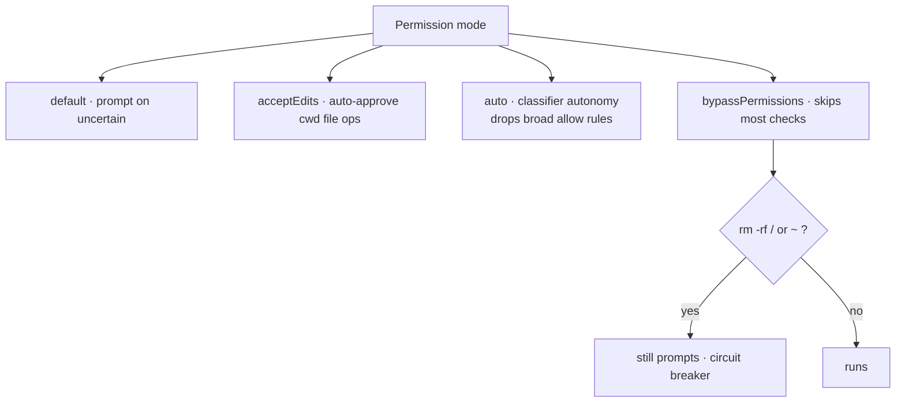
```mermaid
flowchart TD
  M[Permission mode] --> DEF[default · prompt on uncertain]
  M --> AE[acceptEdits · auto-approve cwd file ops]
  M --> AUTO[auto · classifier autonomy<br/>drops broad allow rules]
  M --> BP[bypassPermissions · skips most checks]
  BP --> CB{rm -rf / or ~ ?}
  CB -- yes --> STOP[still prompts · circuit breaker]
  CB -- no --> RUN[runs]
  class M,DEF,AE,AUTO,BP fact
  class STOP built
```

**See also:** Permission layers & precedence · Hooks: verdicts & exit codes

**Sources:** [Choose a permission mode](https://code.claude.com/docs/en/permission-modes) · [Configure permissions](https://code.claude.com/docs/en/permissions)

_Last verified: 2026-05-25_


---

### Hooks: verdicts & exit codes · _platform fact_

> Only exit 2 blocks a tool call; a hook deny beats bypass mode, but a hook allow can't override a settings deny.

A `PreToolUse` hook reads the pending tool call as JSON on stdin and decides its fate. **Exit codes are the load-bearing, easy-to-get-wrong detail:** only **exit 2** blocks (and the hook's stderr is fed back to the model); **exit 0** allows; and **exit 1 or any other code is a *non-blocking* error — the tool still runs.** The trap is that `exit 1` is the conventional Unix "failure", so a policy hook that fails with `exit 1` *looks* like it blocked but doesn't.

For richer control, a hook can instead print a `hookSpecificOutput.permissionDecision` JSON on **exit 0**: `allow`, `deny`, `ask`, or `defer` (headless-only). When several hooks and rules apply, priority is **`deny` > `defer` > `ask` > `allow`**.

Two asymmetries make this safe: a hook **`deny` beats permission-mode bypass** (it blocks even under `bypassPermissions`), but a hook **`allow` does NOT override a settings `deny`** — hooks can *tighten* but never *loosen*. Note hooks **fail open**: on timeout or crash the tool proceeds, so a hook that must fail closed has to emit its own `deny` before its deadline.

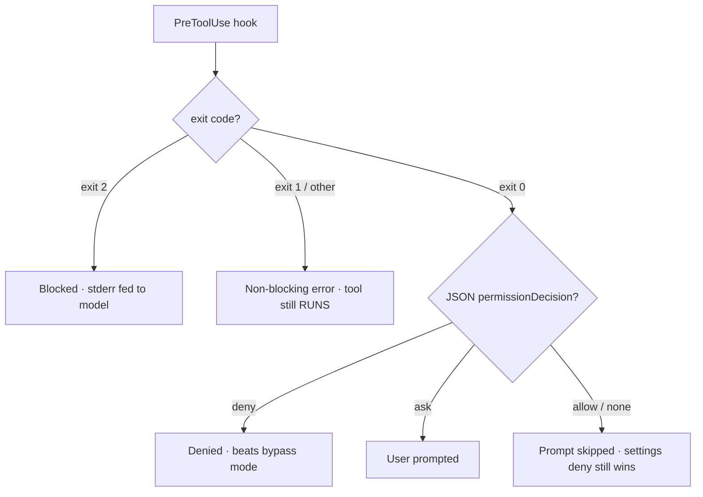
```mermaid
flowchart TD
  H[PreToolUse hook] --> EX{exit code?}
  EX -- "exit 2" --> BLOCK[Blocked · stderr fed to model]
  EX -- "exit 1 / other" --> NB[Non-blocking error · tool still RUNS]
  EX -- "exit 0" --> J{JSON permissionDecision?}
  J -- deny --> DEN[Denied · beats bypass mode]
  J -- ask --> ASK[User prompted]
  J -- "allow / none" --> ALL[Prompt skipped · settings deny still wins]
  class H,EX,J,NB,ASK,ALL fact
  class BLOCK,DEN built
```

**See also:** Permission layers & precedence · Command-review tribunal (the Thing)

**Sources:** [Hooks reference](https://code.claude.com/docs/en/hooks) · [Hooks guide](https://code.claude.com/docs/en/hooks-guide)

_Last verified: 2026-05-25_


---

### SessionStart context injection · _platform fact_

> SessionStart hooks inject additionalContext into every session — additive only; they can't block or delay startup and are capped near 10k chars.

`PreToolUse` hooks gate tool calls; **`SessionStart` hooks can't gate anything.** Their job is to add text to the session via a different field — `hookSpecificOutput.additionalContext` — and nothing more. The output is read **only on exit 0**; a non-zero exit is a non-blocking error and the session still starts. A SessionStart hook can never block or delay a session; its output is purely additive.

Rules that bite: `additionalContext` is **capped near ~10,000 characters** (it's injected every session, so it's a recurring token cost — keep it tight); **multiple SessionStart hooks run in parallel and their outputs are concatenated**; the optional `matcher` is `startup` / `resume` / `clear` / `compact`; and like other hooks it **fails open** on timeout. This is the mechanism RavenClaude's capability banner rides on.

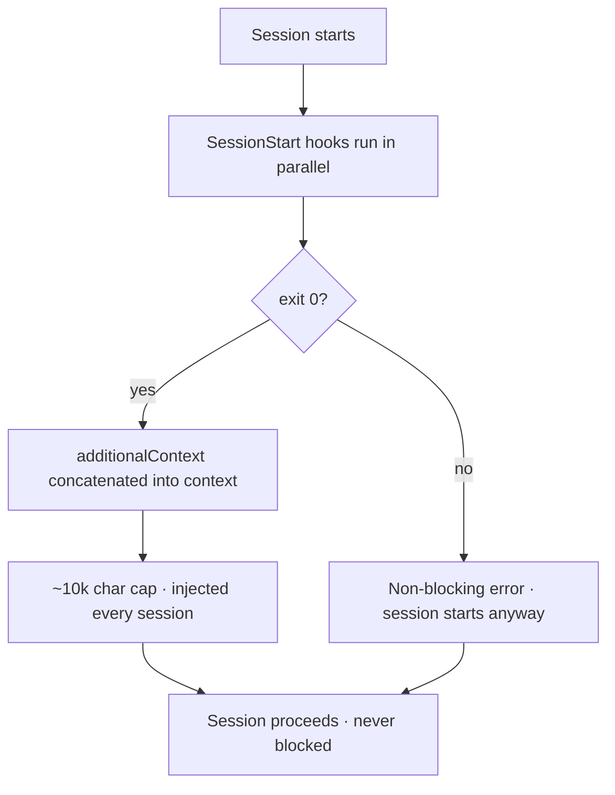
```mermaid
flowchart TD
  S[Session starts] --> H[SessionStart hooks run in parallel]
  H --> EX{exit 0?}
  EX -- no --> SKIP[Non-blocking error · session starts anyway]
  EX -- yes --> ADD[additionalContext concatenated into context]
  ADD --> CAP[~10k char cap · injected every session]
  CAP --> GO[Session proceeds · never blocked]
  SKIP --> GO
  class S,H,EX,SKIP,GO fact
  class ADD,CAP built
```

**See also:** Hooks: verdicts & exit codes · Capability-orientation banner

**Sources:** [Hooks reference](https://code.claude.com/docs/en/hooks)

_Last verified: 2026-05-26_


---


## Security

### Comfort-posture dashboard · _RavenClaude-built_

> A point-and-click editor that writes Claude Code permission rules per category and layer — and keeps design check-ins independent of permission level.

**Comfort posture** is RavenClaude's friendly front-end over the raw permission model. Instead of hand-editing `settings.json`, you set a level — **deny / ask / allow** — per *category* of action (file reads, code execution, remote mutations, …) and per *layer* (user / local / project). The dashboard's Settings tab serializes that to `.ravenclaude/comfort-posture.yaml`, and `apply-comfort-posture.py` translates it into the actual Claude Code permission rules — so the layer-precedence rules still govern what finally wins.

The load-bearing subtlety: **permission level ≠ design judgment.** Setting a category to `allow` only removes the click-to-approve on tool calls — it does **not** tell Claude to stop surfacing architectural decisions. That behavior is a *separate* flag, `design_checkins` (on by default), so relaxing permissions to move faster never silently mutes design check-ins. The two are deliberately decoupled.

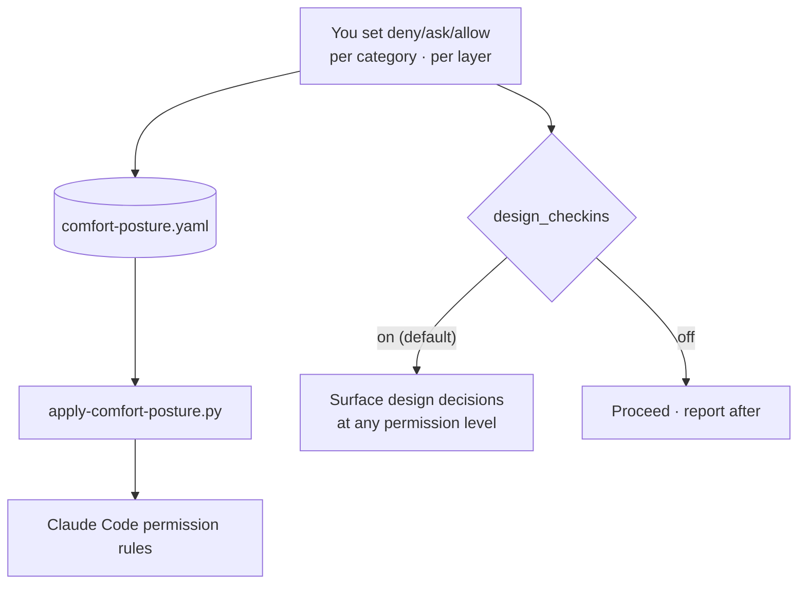
```mermaid
flowchart TD
  U[You set deny/ask/allow<br/>per category · per layer] --> Y[(comfort-posture.yaml)]
  Y --> T[apply-comfort-posture.py]
  T --> R[Claude Code permission rules]
  U --> DC{design_checkins}
  DC -- "on (default)" --> PAUSE[Surface design decisions<br/>at any permission level]
  DC -- off --> FAST[Proceed · report after]
  class Y,T,R,PAUSE,FAST built
  class DC fact
```

**See also:** Permission layers & precedence · Command-review tribunal (the Thing)

**Sources:** [ravenclaude-core constitution](plugins/ravenclaude-core/CLAUDE.md) · [apply-comfort-posture translator](plugins/ravenclaude-core/scripts/apply-comfort-posture.py)

_Last verified: 2026-05-26_


---

### Command-review tribunal (the Thing) · _RavenClaude-built_

> An opt-in panel of reviewer seats that votes ALLOW/EDIT/DENY on shell commands instead of interrupting you.

**Command review** — codename *the Thing* — is an opt-in panel of reviewer agents that adjudicates shell commands instead of stopping to ask you. It sits **on top of** comfort-posture: posture sets the policy (allow/ask/deny per category); the tribunal is the adjudicator you switch on for a category so a verdict lands in seconds.

Routing is **tiered**. Every command resolves to `low → medium → high → extreme` (its category base tier, bumped by a deterministic high/critical concern). A clean `low` read runs **no panel at all** (zero cost); seat count and the confidence bar escalate with the tier. Up to three seats run in parallel — **Forseti** (security), **Mímir** (code), **Heimdall** (injection) — with **Thor** (architect) convened only on a split.

The **`gate_floor`** knob (default `high`) is the lowest tier whose *confident ALLOW* is surfaced to you as an `ask`. DENY still blocks and EDIT still rewrites autonomously, so the tribunal pre-filters the dangerous and the fixable before either reaches you. Two hard overrides ignore the knob: **reads are never surfaced**, and **irreversible high-blast allows always are**. An abstaining panel always fails **closed**. It can never relax the `security_deny` floor.

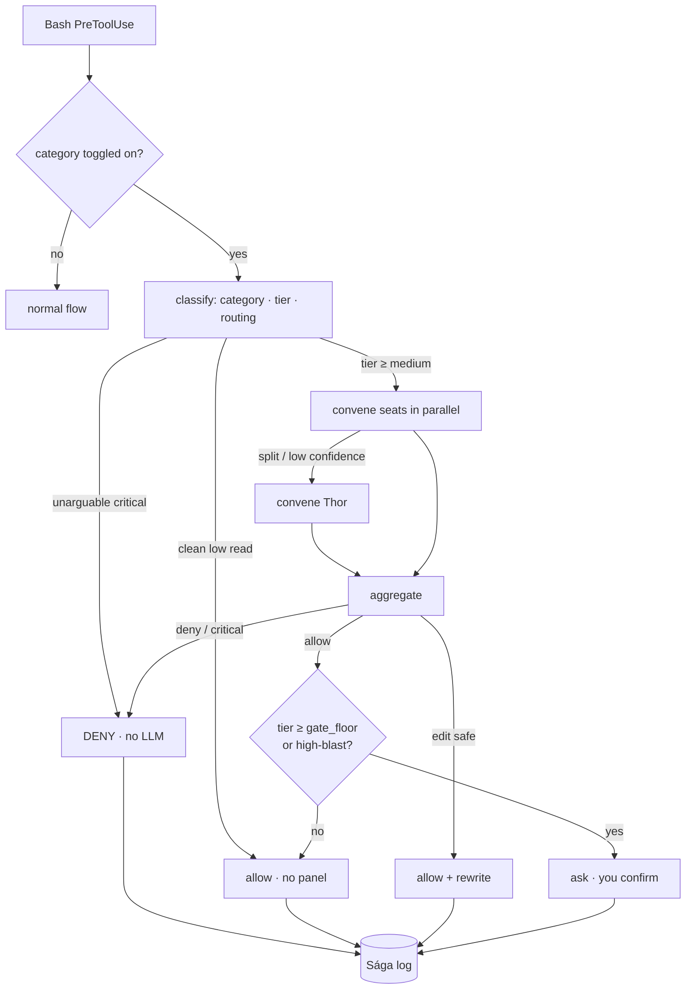
```mermaid
flowchart TD
  A[Bash PreToolUse] --> B{category toggled on?}
  B -- no --> Z[normal flow]
  B -- yes --> C[classify: category · tier · routing]
  C -- unarguable critical --> DENY[DENY · no LLM]
  C -- clean low read --> ALLOW[allow · no panel]
  C -- tier ≥ medium --> E[convene seats in parallel]
  E -- split / low confidence --> T[convene Thor]
  T --> AGG[aggregate]
  E --> AGG
  AGG -- deny / critical --> DENY
  AGG -- edit safe --> EDIT[allow + rewrite]
  AGG -- allow --> GATE{tier ≥ gate_floor<br/>or high-blast?}
  GATE -- yes --> ASK[ask · you confirm]
  GATE -- no --> ALLOW
  DENY & ALLOW & EDIT & ASK --> L[(Sága log)]
  class DENY,ALLOW,EDIT,ASK,E,T built
  class GATE fact
```

**See also:** Comfort-posture dashboard · Permission layers & precedence · Hooks: verdicts & exit codes

**Sources:** [thing skill (operating reference)](plugins/ravenclaude-core/skills/thing/SKILL.md) · [Tribunal design](docs/tribunal-review-feature-design.md)

_Last verified: 2026-05-26_


---

### The Sága audit log · _RavenClaude-built_

> Every command-review verdict writes one JSON entry — command, category, tier, per-seat votes, concerns, final verdict — under .ravenclaude/runs/thing/.

Every tribunal verdict — allow, edit, deny, or ask — writes exactly **one JSON entry** to `.ravenclaude/runs/thing/<id>.json`, the **Sága log**. The entry records the command, its category, the resolved tier, each seat's verdict, the concerns cited, the final verdict (and the revised command on an EDIT), and the duration.

This is the observability substrate: it turns an otherwise opaque "the panel decided" into an auditable trail you can read after the fact to tune the panel, the `gate_floor`, or the bypass patterns. It's **gitignored by default** — the log is local operational data, not something to commit.

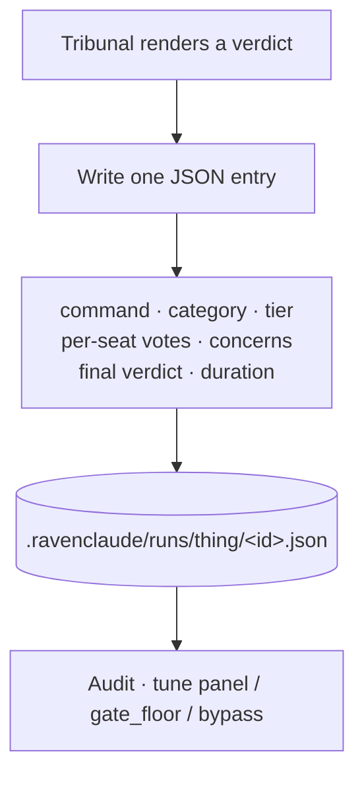
```mermaid
flowchart TD
  V[Tribunal renders a verdict] --> E[Write one JSON entry]
  E --> F[command · category · tier<br/>per-seat votes · concerns<br/>final verdict · duration]
  F --> D[(.ravenclaude/runs/thing/&lt;id&gt;.json)]
  D --> U[Audit · tune panel / gate_floor / bypass]
  class V,E,F,D,U built
```

**See also:** Command-review tribunal (the Thing) · Model diversity on the panel

**Sources:** [thing skill (operating reference)](plugins/ravenclaude-core/skills/thing/SKILL.md)

_Last verified: 2026-05-26_


---

### Model diversity on the panel · _RavenClaude-built_

> When ≥2 reviewer seats convene, the tribunal guarantees ≥2 distinct model backbones run — so one model's blind spot can't pass the whole panel.

A panel of reviewers is only as strong as its diversity. If every seat runs on the same model, a single model's blind spot — a shared hallucination or a class of injection it doesn't catch — can pass the **whole** panel unnoticed. That's the **anti-correlated-hallucination** failure mode.

So the engine enforces a **model-diversity rule**: whenever **two or more seats convene, at least two distinct model backbones run**. If a `panel:` config override happens to collapse the seats onto one model, the engine **auto-reassigns one seat to a different, equal-or-stronger model** rather than letting a monoculture review the command. It's proven by Gate 22.

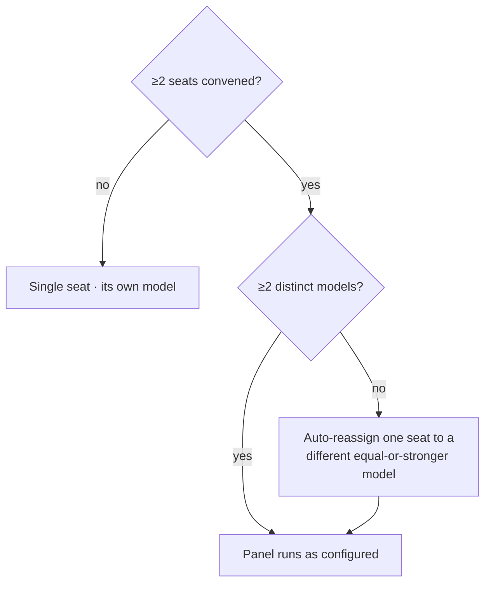
```mermaid
flowchart TD
  P{≥2 seats convened?} -- no --> ONE[Single seat · its own model]
  P -- yes --> CHK{≥2 distinct models?}
  CHK -- yes --> OK[Panel runs as configured]
  CHK -- no --> RE[Auto-reassign one seat to a<br/>different equal-or-stronger model]
  RE --> OK
  class P,CHK fact
  class ONE,OK,RE built
```

**See also:** Command-review tribunal (the Thing)

**Sources:** [ravenclaude-core constitution](plugins/ravenclaude-core/CLAUDE.md) · [Tribunal assessment & improvement plan](docs/tribunal-assessment-and-improvement-plan.md)

_Last verified: 2026-05-26_


---

### Decision-review tribunal · _RavenClaude-built_

> A sibling tribunal votes yes/no/defer on yes-or-no DECISIONS before they reach you — binding only if you opt in, and high-blast calls always defer.

The command-review tribunal adjudicates *shell commands*; the **decision-review** tribunal adjudicates *yes/no decisions* — the kind an agent would otherwise interrupt you with. The `decision-review` skill convenes the same seats on a yes/no question (engine: `thing-decide.py`) and returns **`yes` / `no` / `defer`**. A binding yes/no is acted on without pausing you; a `defer` asks you. The panel defers genuine preferences, low-confidence or split calls, and anything high-blast.

Two guardrails: **high-blast / irreversible decisions never auto-resolve** — force-push, deletes, prod actions, the `security_deny` family always `defer` to you, regardless of mode. And the mode knob `decision_review: off | advisory | binding` is **off by default**, so nothing is auto-decided unless you opt in. (The seats run via `claude -p`; without it the panel abstains and fails safe to `defer`.) After each PR, a retrospective routes the PR's decisions through the same panel and logs the verdicts.

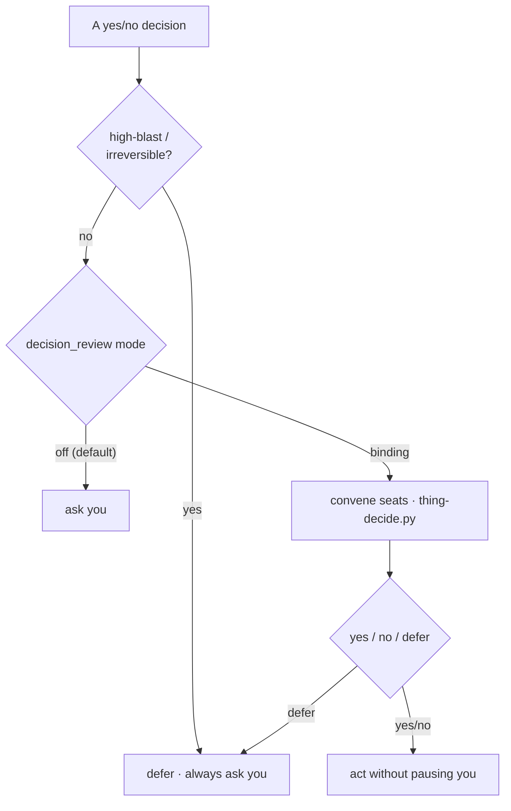
```mermaid
flowchart TD
  Q[A yes/no decision] --> HB{high-blast /<br/>irreversible?}
  HB -- yes --> DEFER[defer · always ask you]
  HB -- no --> MODE{decision_review mode}
  MODE -- "off (default)" --> ASK[ask you]
  MODE -- "binding" --> PANEL[convene seats · thing-decide.py]
  PANEL --> V{yes / no / defer}
  V -- yes/no --> ACT[act without pausing you]
  V -- defer --> DEFER
  class Q,HB,MODE fact
  class DEFER,ASK,PANEL,V,ACT built
```

**See also:** Command-review tribunal (the Thing) · Model diversity on the panel

**Sources:** [Post-PR decision review](docs/post-pr-decision-review.md) · [ravenclaude-core constitution](plugins/ravenclaude-core/CLAUDE.md)

_Last verified: 2026-05-26_


---


## Guardrails

### Runaway brake — the depth guard · _RavenClaude-built_

> A model-free PreToolUse brake that pauses the agent when it thrashes (too many identical calls in a row) or blows a total-call ceiling — with a read-only carve-out.

The **runaway brake** is the **depth guard**: it stops an agent from disappearing down a rabbit hole — looping on a fabricated error, or grinding through hundreds of calls without converging. It is a `PreToolUse` hook that runs *before every tool call*, counts the calls per session, and **pauses** (a deny) when one of two limits trips. It exists because Claude Code's native `auto`-mode brake (the 3-consecutive / 20-total block) is Anthropic-API-only, so it can't protect the model-agnostic GitHub Copilot CLI surface (Claude / ChatGPT / Grok). This hook is the portable, **model-free** equivalent — there is no LLM in the loop, just a counter.

Two limits, both tunable in `.ravenclaude/comfort-posture.yaml`. **`max_consecutive`** (default 8) trips when the agent makes the *same* tool call — byte-identical name and input — that many times in a row; that repetition is the "stuck in a loop" signal. **`max_total`** (default 1200) is a generous per-session ceiling on *all* calls, the backstop against a slow grind that never repeats exactly. State lives in a per-session counter file under `.ravenclaude/runs/thing/runaway/`, so a brand-new session always starts fresh. The whole hook is **opt-in and fail-safe**: with no posture file it exits immediately (one `stat`, zero cost), and `runaway: off` disables it entirely.

The load-bearing subtlety is the **read-only carve-out**. A legitimate startup burst of read-only calls — repeated `git log`, `ls`, `cat`, `grep` — is not a runaway, so it must not trip the consecutive-loop counter. A call counts as read-only when the tool is `Read`/`Grep`/`Glob`/`NotebookRead`, *or* it's a `Bash` command matching a **strict, anchored, fail-closed** allowlist of obviously-non-mutating programs. A read-only call is **transparent** to the loop counter (it neither increments nor resets the consecutive count) but **still increments the total** — so the session ceiling keeps bounding *every* call regardless of type. Any doubt fails closed: a shell metacharacter that could chain to a mutating command (`&&`, `;`, `|`, `>`, `` ` ``) or any mutating token anywhere in the string forces the call to count as a normal (non-read-only) call.

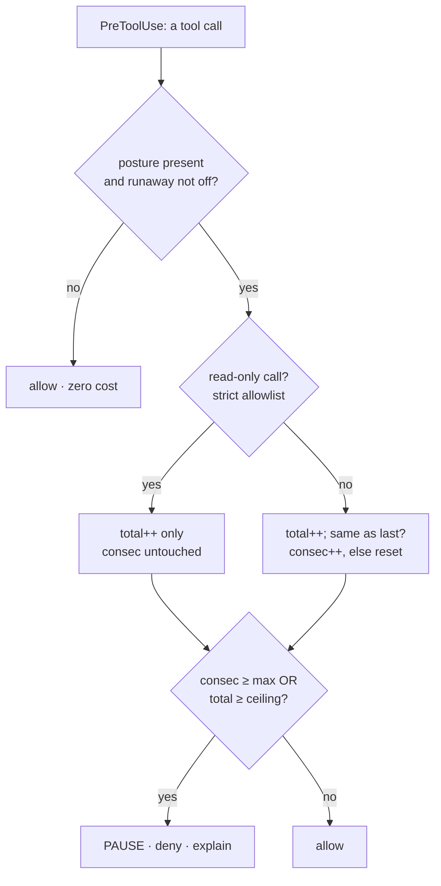
```mermaid
flowchart TD
  A[PreToolUse: a tool call] --> B{posture present<br/>and runaway not off?}
  B -- no --> Z[allow · zero cost]
  B -- yes --> C{read-only call?<br/>strict allowlist}
  C -- yes --> T[total++ only<br/>consec untouched]
  C -- no --> D[total++; same as last?<br/>consec++, else reset]
  T --> G{consec ≥ max OR<br/>total ≥ ceiling?}
  D --> G
  G -- yes --> DENY[PAUSE · deny · explain]
  G -- no --> ALLOW[allow]
  class T,D,DENY,ALLOW built
  class B,C,G fact
```

**See also:** Definition-of-done gate · Task-scope gate — the breadth guard · Containment posture — the OS boundary · Command-review tribunal (the Thing) · Comfort-posture dashboard

**Sources:** [runaway-brake.sh hook](plugins/ravenclaude-core/hooks/runaway-brake.sh) · [ravenclaude-core constitution — Auto-mode guardrails](plugins/ravenclaude-core/CLAUDE.md)

_Last verified: 2026-06-08_


---

### Definition-of-done gate · _RavenClaude-built_

> A Stop-hook gate that runs your configured test/build/lint command when the agent tries to finish and blocks the stop until it passes — self-limited so it can't deadlock.

The **definition-of-done gate** closes the gap that command review can't see: it gates work **correctness**, not command safety. The Thing tribunal asks "is this command dangerous?"; this gate asks "is the work actually finished, or does it just *look* finished?" It is a `Stop` hook — it fires when the agent tries to end its turn — and if a `definition_of_done.cmd` is configured in `.ravenclaude/comfort-posture.yaml`, it runs that command (your tests, build, lint) and **blocks the stop until the command exits zero**. That turns "looks done" into "is done" without the human having to be the verification loop.

The gate is **scoped and self-limiting** so it never becomes an obstacle. It only fires when *source files actually changed* this session (it inspects `git status --porcelain` for code extensions), so a docs-only or read-only session ends cleanly. When the command fails, the gate feeds the tail of the failing output back to the agent so it can fix the problem and try again. To guarantee it can't deadlock, it blocks at most **`max_blocks`** (default 8) consecutive times, then **force-allows** the stop with a warning — Claude Code force-overrides Stop after 8 anyway, but Copilot CLI gives no such guarantee, so the cap is built in. With no `definition_of_done.cmd` set, the gate is inert and the advisory `remind-tests.sh` nudge handles the reminder instead.

One safety detail: the configured command is shell-executed, and it comes from a YAML field a malicious pull request could edit. So before the *first* run per session for a given command value, the gate refuses to execute and surfaces the literal command plus a one-line `touch` step to authorize it (or set `definition_of_done.trusted: true` to skip the prompt permanently). Rotating the command or starting a new session re-triggers the check. Like the other guardrails it is **opt-in and deterministic** — the verdict is just a command's exit code, no model in the loop — so it ports unchanged to Copilot through the adapter's `stop` mode.

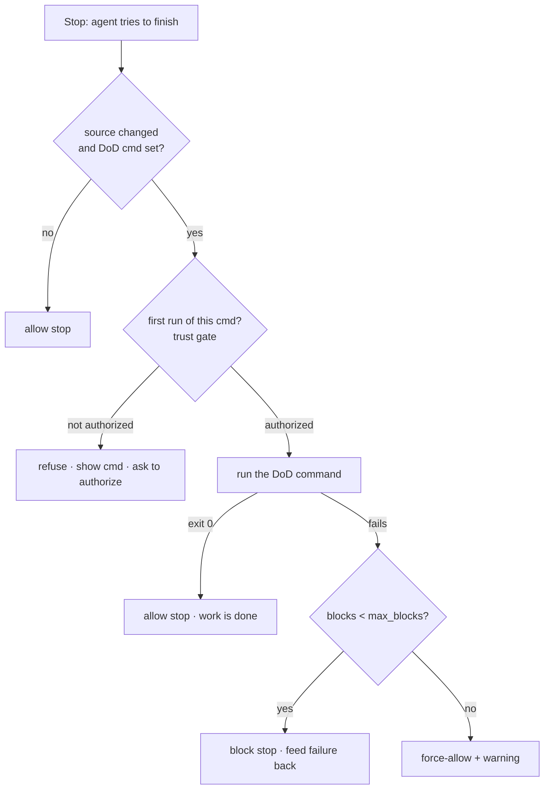
```mermaid
flowchart TD
  A[Stop: agent tries to finish] --> B{source changed<br/>and DoD cmd set?}
  B -- no --> Z[allow stop]
  B -- yes --> F{first run of this cmd?<br/>trust gate}
  F -- not authorized --> ASK[refuse · show cmd · ask to authorize]
  F -- authorized --> R[run the DoD command]
  R -- exit 0 --> PASS[allow stop · work is done]
  R -- fails --> C{blocks < max_blocks?}
  C -- yes --> BLOCK[block stop · feed failure back]
  C -- no --> FORCE[force-allow + warning]
  class ASK,R,PASS,BLOCK,FORCE built
  class B,F,C fact
```

**See also:** Runaway brake — the depth guard · Task-scope gate — the breadth guard · Containment posture — the OS boundary · Command-review tribunal (the Thing) · Comfort-posture dashboard

**Sources:** [dod-gate.sh hook](plugins/ravenclaude-core/hooks/dod-gate.sh) · [ravenclaude-core constitution — Auto-mode guardrails](plugins/ravenclaude-core/CLAUDE.md)

_Last verified: 2026-06-08_


---

### Task-scope gate — the breadth guard · _RavenClaude-built_

> An optional per-task write blast-radius gate: a write to a path matching no in_scope glob in .ravenclaude/task-scope.json is denied — independent of, and composable with, the repo-layout policy.

The **task-scope gate** is the **breadth guard**: where the runaway brake bounds how *deep* an agent goes and the definition-of-done gate bounds *correctness*, this bounds how *wide* it spreads. It answers "for the task at hand, which files is the agent allowed to touch?" You declare the current task's write blast radius in `.ravenclaude/task-scope.json` — `{"in_scope": [globs], "spec": "SPEC.md"}` — and any `Write`/`Edit`/`MultiEdit` to a path matching **none** of the `in_scope` globs is denied, with the spec named in the hint. You copy the file in per task and delete it when the task is done.

It rides on the **same** `PreToolUse` hook that enforces the repo layout (`enforce-layout.sh`), so it ships with **zero new wiring** — that hook was already registered on writes under both Claude Code and Copilot. But the two policies are **independent and composable**. The repo-layout policy (`.repo-layout.json`) is about repo *structure* — where any file may live, the marketplace's permanent discipline. Task-scope is about *this task's* radius — a temporary, much tighter fence. Either, both, or neither may be present; a write must satisfy whichever policies *are* configured. The task-scope check deliberately runs **first**, so it is never short-circuited by the layout policy's forbid-only early-exit.

The gate is **fail-safe** in every direction: an absent file, an empty `in_scope` list, or unparseable JSON is a silent no-op (the write is allowed). Glob matching uses bash pattern semantics — a single `*` matches across slashes — and a path containing `..` is refused up front as a path-traversal scrub. Every deny emits a structured line to the hook-event substrate (the same log the Heimdall and Víðarr dashboard tabs read), so a blocked write is observable after the fact, not just a wall-message.

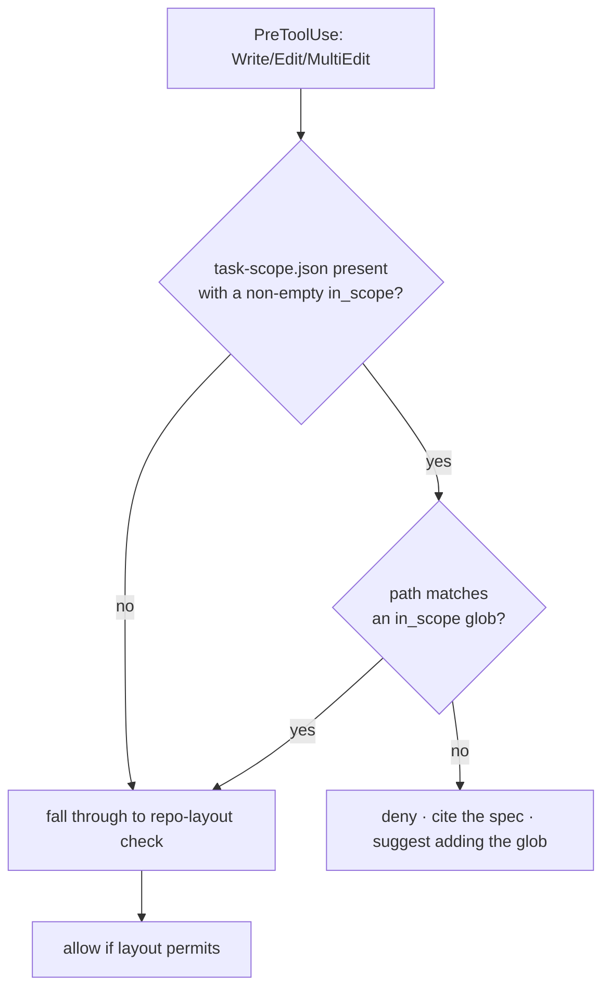
```mermaid
flowchart TD
  A[PreToolUse: Write/Edit/MultiEdit] --> B{task-scope.json present<br/>with a non-empty in_scope?}
  B -- no --> L[fall through to repo-layout check]
  B -- yes --> M{path matches<br/>an in_scope glob?}
  M -- yes --> L
  M -- no --> DENY[deny · cite the spec · suggest adding the glob]
  L --> OK[allow if layout permits]
  class DENY,OK,L built
  class B,M fact
```

**See also:** Runaway brake — the depth guard · Definition-of-done gate · Containment posture — the OS boundary · Layout enforcement · Command-review tribunal (the Thing)

**Sources:** [enforce-layout.sh hook](plugins/ravenclaude-core/hooks/enforce-layout.sh) · [ravenclaude-core constitution — Auto-mode guardrails](plugins/ravenclaude-core/CLAUDE.md)

_Last verified: 2026-06-08_


---

### Website access guardrail · _RavenClaude-built_

> A committed allow/deny list of websites the agent honors, plus a four-option prompt (just once / this session / permanently / deny) the first time it needs an unlisted domain.

The **website-access guardrail** governs which sites an agent may fetch. It has two halves: a committed **allow/deny list** the agent honors, and a **four-option choice** it surfaces the first time it needs a domain that isn't on either list. The lists live in `.ravenclaude/web-access.yaml` as plain YAML (`allow: [domains]`, `deny: [domains]`), and a rule matches the domain **and all its subdomains**. Because they're a plain file, they work both for Claude Code (enforced by the hook) and for any *other* CLI tool that clones the repo and reads the same file — it's a cross-tool interop layer, not a Claude-only setting.

The deterministic backstop is the `guard-web-access.sh` `PreToolUse(WebFetch)` hook. A **whitelisted** domain auto-allows with no prompt; a **blacklisted** domain is **blocked** (and emits a deny event to the substrate); an **unlisted** domain falls through to the agent's normal per-domain prompt. It's fail-safe: absent config or a missing parser makes it a no-op (ask as normal). One refinement: even a whitelisted domain gets a *first-use* "allow this and subsequent fetches this session?" ask, so a hostile edit to the YAML can't silently turn on exfiltration — set `web_access.trusted: true` to skip that once you've reviewed the list. The hook can't replace Claude Code's built-in permission dialog (no hook can), but it is the deterministic floor beneath it.

The behavioral half is the **four-option menu**. When the agent is about to fetch an unlisted domain it hasn't already cleared this session, it surfaces exactly four choices and then records the answer in the right place. **Just once** fetches now and writes nothing. **This session** appends the domain to the per-session file `.ravenclaude/runs/<session>/web-allow.txt` (the hook auto-allows it for the rest of the session, then it's cleared). **Permanently** appends to the `allow:` whitelist (persists, and propagates to other tools). **Deny** appends to the `deny:` blacklist (blocked from now on). So a *deny* lands on the blacklist and a *permanent* allow lands on the whitelist, exactly as named.

```mermaid
flowchart TD
  A[WebFetch a domain] --> B{on a list?}
  B -- deny list --> BLOCK[block · deny event]
  B -- allow list --> ALLOW[auto-allow<br/>first-use ask once]
  B -- unlisted --> Q[four-option prompt]
  Q --> O1[Just once → fetch, write nothing]
  Q --> O2[This session → session allow file]
  Q --> O3[Permanently → allow: whitelist]
  Q --> O4[Deny → deny: blacklist]
  class BLOCK,ALLOW,O1,O2,O3,O4 built
  class B fact
```

**See also:** Runaway brake — the depth guard · Definition-of-done gate · Task-scope gate — the breadth guard · Containment posture — the OS boundary · Command-review tribunal (the Thing)

**Sources:** [guard-web-access.sh hook](plugins/ravenclaude-core/hooks/guard-web-access.sh) · [ravenclaude-core constitution — Website access](plugins/ravenclaude-core/CLAUDE.md)

_Last verified: 2026-06-08_


---

### Containment posture — the OS boundary · _RavenClaude-built_

> The OS/container/worktree boundary that bounds subprocesses an agent spawns — the layer the tribunal and the tool-layer guards structurally cannot provide.

Every other guardrail in this cluster — the runaway brake, the definition-of-done gate, the task-scope gate, and command review itself — is a **model-layer** guard: it gates the *agent's own tools*. That leaves one gap none of them can close. A `deny` on `Read(~/.ssh/**)` stops the agent's `Read` tool, but it does **not** stop a script the agent writes and then runs — the subprocess inherits the shell's access, not the agent's permission rules. Only the **operating system** can hold that line, because the OS enforces it whether or not the command was correctly labeled, mislabeled, or flipped by an injection.

That is **containment posture**: the boundary lives *below* the model. The sanctioned, model-agnostic containment is **the devcontainer this marketplace scaffolds plus a git worktree** for risky or parallel runs. The container is the real, OS-enforced blast radius, and it behaves identically under Claude Code, GitHub Copilot CLI, or any other host — that portability is exactly why it's the recommended posture. On top of it, the balanced comfort-posture seed adds **tool-layer denies** for host credential stores outside the repo (`~/.ssh`, `~/.aws`, `~/.config/gcloud`, `~/.azure`, `~/.kube/config`, `~/.docker/config.json`) so the agent's own Read tool also refuses them — but those are tool-layer, *not* OS isolation, so they don't close the subprocess gap on their own.

The honest caveat completes the picture. Claude Code *can* add an OS sandbox (Seatbelt/bubblewrap, `denyRead`/`denyWrite`) that genuinely contains subprocesses — but there's no evidence Copilot CLI honors it, so under Copilot the container/worktree is the containment, **not** the sandbox. RavenClaude deliberately does not write a Claude-only sandbox config and present it as portable. The takeaway for working safely: when a run is risky, put it inside a container or a worktree so the *floor* of what it can touch is set by the OS, and treat the model-layer guards as the layers above that floor — they reduce mistakes, but the container is what survives one.

```mermaid
flowchart TD
  A[Agent] -->|tool call| T{model-layer guards<br/>tribunal · denies}
  T -- gated --> OK[bounded tool call]
  A -->|writes & runs a script| S[subprocess]
  S -. not gated by model layer .-> X[(host files · creds)]
  C[Container / worktree boundary<br/>OS-enforced] --> S
  C --> X
  class OK,C built
  class T fact
```

**See also:** Runaway brake — the depth guard · Definition-of-done gate · Task-scope gate — the breadth guard · Website access guardrail · Command-review tribunal (the Thing) · Comfort-posture dashboard

**Sources:** [ravenclaude-core constitution — Containment posture](plugins/ravenclaude-core/CLAUDE.md) · [claude-code-permissions knowledge file](plugins/ravenclaude-core/knowledge/claude-code-permissions.md)

_Last verified: 2026-06-08_


---


## Observability

### The event substrate · _RavenClaude-built_

> Two append-only JSONL logs — hook deny/warn verdicts and posture diffs — that make guardrail and posture activity observable after the fact. The read foundation the Norse tabs consume.

Guardrail verdicts and posture changes used to vanish — they went to stderr or stdout and were gone the moment the turn ended. The **event substrate** fixes that with two **append-only JSONL logs** (one JSON object per line) that record what happened so a panel can read it *after the fact*. It is deliberately built **first**, as the shared emission convention, so every reader downstream consumes one format instead of each inventing its own.

The **hook-event log** (`hook-events.jsonl`, written per session under `.ravenclaude/runs/<session>/`) gets one line per **deny or warn verdict** from the shared sourced helper `_emit-event.sh`. Three hooks emit into it: the layout/scope hook (`enforce-layout.sh`), the destructive-command guard (`guard-destructive.sh`), and the recursive-spawn guard (`guard-recursive-spawn.sh`). The pure formatter is intentionally **not** wired — it has no verdict, so emitting per format would just flood the log. The **posture-event log** (`posture-events.jsonl`) gets one line per posture change from the comfort-posture translator, recording the added/removed permission rules as a diff. An identical reapply writes nothing, so the session-start reapply never floods it.

Both logs are **fail-safe and additive**: a telemetry write can never break the guardrail or posture apply that produced it. They are git-ignored (per-consumer). This is the read-side foundation the four observability tabs sit on — Heimdall reads the hook half, Víðarr interleaves both, Norns reads the scenario stream, and the push monitor tails the hook log live.

```mermaid
flowchart TD
  H[Guardrail hooks<br/>deny / warn] --> E[_emit-event.sh]
  E --> HJ[(hook-events.jsonl)]
  P[Posture change] --> PE[posture diff]
  PE --> PJ[(posture-events.jsonl)]
  HJ --> R[Heimdall · Víðarr · monitor]
  PJ --> R
  class E,HJ,PE,PJ,R built
  class H,P fact
```

**See also:** Heimdall — perimeter alerts · Víðarr — security log · Norns — plugin lineage · The run-state monitor · The Sága audit log · Command-review tribunal (the Thing)

**Sources:** [ravenclaude-core constitution — Structured event substrate](plugins/ravenclaude-core/CLAUDE.md) · [_emit-event.sh (the shared emitter)](plugins/ravenclaude-core/hooks/_emit-event.sh)

_Last verified: 2026-06-08_


---

### Heimdall — perimeter alerts · _RavenClaude-built_

> The perimeter-alarm tab: recent hook denials, CI runs, and version drift at a glance, topped by the tiered Gjallarhorn banner. A read-only mirror — it writes nothing.

**Heimdall** is the watchman at the rainbow bridge — and the dashboard's perimeter-alarm tab answers his question in one glance: *what tripped, when, and why?* It is the **first reader** of the event substrate, and it is a **read-only mirror** — it writes nothing, to no log; it surfaces only what the hooks and manifests already emitted.

Four cards. **Recent hook denials** reads the session hook-event logs (last 30 days) over a served `/__heimdall` endpoint, groups by hook, and tier-classifies each event. **Recent CI runs** fetches the GitHub Actions API client-side, with three honest states (rows when public, rate-limited on `403`, "needs a token" on a private `404`) — the empty state never masquerades as "CI green." **Plugin version drift** compares each plugin's manifest version to the catalog, inlined at build time so it works on a static host too. And the **Gjallarhorn banner** is the horn itself: a tiered alarm derived from the hook-event tiers — **red** for an irrecoverable deny (force-push, `rm -rf`, publish), **amber** for any other deny (layout/scope), **grey** for a warn — with screen-reader urgency matched to the tier. It hides entirely when every source is clean.

Because the denial card needs file-system access, it is **served-mode only**; on a static host it shows an honest "open the served dashboard" prompt rather than a fake all-clear. Heimdall answers the operational "what just tripped?"; its sibling Víðarr answers the audit "how did my posture change over time?"

```mermaid
flowchart TD
  S[(event substrate<br/>hook-events.jsonl)] --> H[Heimdall reader]
  M[plugin manifests] --> H
  CI[GitHub Actions API] --> H
  H --> C[Denials · CI · drift cards]
  H --> G[Gjallarhorn banner<br/>red / amber / grey]
  class H,C,G built
  class S,M,CI fact
```

**See also:** The event substrate · Víðarr — security log · Norns — plugin lineage · Níðhöggr — debt watch · Command-review tribunal (the Thing) · The Sága audit log

**Sources:** [ravenclaude-core constitution — Heimdall](plugins/ravenclaude-core/CLAUDE.md) · [generate-dashboards.py (the Heimdall tab + reader)](scripts/generate-dashboards.py)

_Last verified: 2026-06-08_


---

### Víðarr — security log · _RavenClaude-built_

> The security/posture audit tab: posture changes and security denials interleaved newest-first, filterable by time range and event type. Read-only — no edit or dismiss.

**Víðarr** is the silent, enduring god — and his tab is the **second reader** of the event substrate, reading the posture-event half. Where Heimdall answers the operational "what guardrail tripped just now?", Víðarr answers the audit question: *how did my security posture change over time, and what security-relevant denials happened?* It is a **read-only, filterable, chronological** audit log — no edit, no dismiss, no acknowledge.

It interleaves two sources into one newest-first table (columns: when / type / category / summary / source). **Posture changes** are every line of `posture-events.jsonl`, summarized as the permission-rule diff counts (e.g. "+1 deny, +15 override"). **Security-relevant hook denials** are the hook-event log filtered to **deny verdicts only** — warns are advisory and deliberately excluded (they live in Heimdall's grey tier, not the security audit). A single predicate is the one place that decides what counts as security-relevant.

Two filter controls narrow the view: a **time-range** select (24h / 7d / 30d / all, which re-fetches) and **event-type chips** (All / Posture changes / Security denials, applied client-side). Like Heimdall, both sources are per-consumer and git-ignored, so the data is **served-only** — a static host degrades to an honest empty state. When the perimeter has been quiet, the table says so plainly rather than pretending.

```mermaid
flowchart TD
  PJ[(posture-events.jsonl)] --> V[Víðarr reader]
  HJ[(hook-events.jsonl<br/>deny only)] --> V
  V --> T[Chronological audit table]
  T --> F[Filter: time range · event type]
  class V,T,F built
  class PJ,HJ fact
```

**See also:** The event substrate · Heimdall — perimeter alerts · Norns — plugin lineage · Command-review tribunal (the Thing) · The Sága audit log

**Sources:** [ravenclaude-core constitution — Víðarr](plugins/ravenclaude-core/CLAUDE.md) · [generate-dashboards.py (the Víðarr tab + reader)](scripts/generate-dashboards.py)

_Last verified: 2026-06-08_


---

### Norns — plugin lineage · _RavenClaude-built_

> The Urðr / Verðandi / Skuld past-present-future view of a plugin: lessons and history, current version and counts, and proposed roadmap — all read live, nothing inlined.

The **Norns** weave fate from what was, what is, and what shall be — and their tab is the **third and final reader** of the event substrate, completing the loop by reading the scenario-event stream. It shows a plugin's life as a **read-only three-column past/present/future view**.

**Urðr** (past) — "Lessons & history" — gathers the most recent scenario surfaces from the event log, any decision-log entries, and the last several commits. **Verðandi** (present) — "Current" — shows the live version, the active hook and rule counts, and the last release date. **Skuld** (future) — "Proposed" — shows the next version and roadmap plus open proposals naming the plugin; today most plugins declare no next version, so Skuld renders a gentle gated empty state until one does.

The load-bearing design choice: unlike Heimdall and Víðarr (which inline a small static slice), Norns inlines **nothing** at build time — *all* of its data is read live by a served endpoint. That is deliberate and non-negotiable, because the git-log and scenario data vary between a full local clone and CI's shallow checkout, and the dashboard is freshness-gated by exact byte match. Every source is guarded so a missing file or a git failure yields an empty section, never an error — and on a static host the columns degrade to an honest "open the served dashboard" prompt.

```mermaid
flowchart LR
  G[git log · scenarios] --> U[Urðr<br/>past]
  M[version · counts] --> V[Verðandi<br/>present]
  R[next_version · roadmap] --> S[Skuld<br/>future]
  U --> N[Lineage tab]
  V --> N
  S --> N
  class U,V,S,N built
  class G,M,R fact
```

**See also:** The event substrate · Heimdall — perimeter alerts · Víðarr — security log · The Sága audit log · Command-review tribunal (the Thing)

**Sources:** [ravenclaude-core constitution — Norns](plugins/ravenclaude-core/CLAUDE.md) · [generate-dashboards.py (the Norns tab + reader)](scripts/generate-dashboards.py)

_Last verified: 2026-06-08_


---

### Níðhöggr — debt watch · _RavenClaude-built_

> A low-noise maintenance card inside the Heimdall tab: stale plugins, uncovered hooks, superseded decisions, and TODO/FIXME in commit subjects — the slow debt that never trips an alarm.

**Níðhöggr** is the dragon gnawing at the roots of the world-tree — and the "Debt watch" card surfaces exactly that: the slow, quiet decay that no perimeter alarm ever catches. It lives as a **card inside the Heimdall tab** (not its own tab), and it carries both labels: "Debt watch" primary, "Níðhöggr" parenthetical.

Four low-noise signals. **Stale plugins** — any plugin not version-bumped in 120+ days. **Uncovered hooks** — hooks referenced by neither a CI workflow nor the gate-audit harness; cross-checking *both* is what cuts the false positives down to the genuinely undercovered set. **Superseded decisions** — decision-log entries marked as superseded (none today). And **TODO/FIXME in commit subjects** — debt the team literally wrote into the history.

It reads **live** through a served endpoint rather than inlining at build time, because two of its signals are git-derived (commit dates, log history) and vary by clone depth — which would otherwise break the exact-match dashboard freshness gate, the same trap Norns navigates. Every source is guarded so a git failure yields an empty signal, never an error. It is a small card today; the plan is to promote it to a full tab only if the marketplace grows past roughly five plugins or the debt signals exceed about twenty entries.

```mermaid
flowchart TD
  A[stale plugins] --> N[Níðhöggr reader]
  B[uncovered hooks] --> N
  C[superseded decisions] --> D[Debt watch card]
  E[TODO/FIXME commits] --> N
  N --> D
  class N,D built
  class A,B,C,E fact
```

**See also:** Heimdall — perimeter alerts · The event substrate · Víðarr — security log · Norns — plugin lineage · The gate-audit meta-test

**Sources:** [ravenclaude-core constitution — Níðhöggr 'Debt watch'](plugins/ravenclaude-core/CLAUDE.md) · [generate-dashboards.py (the Níðhöggr card + reader)](scripts/generate-dashboards.py)

_Last verified: 2026-06-08_


---

### Mímir — session state · _RavenClaude-built_

> The Session tab: what Claude Code knows about this session — theme, model, permission mode, recent sessions — read from on-disk state, with honest in-process-only fields.

**Mímir** is the wise head at the well of knowledge — and his tab answers one question: *what does Claude Code actually know about **this** session?* It surfaces what's reachable from on-disk session state, replacing the need to remember `/status`, `/usage`, or `/theme`. Its defining discipline is **honesty about reachability** — it never fakes a value it can't read.

Five cards, hydrated from a served endpoint when the tab opens. **Settings** — theme, configured and last-used model, and permission mode, plus an honest in-process pill for reasoning effort (which is runtime-only and rendered as an explainer, never a fake dash). **Current session** — matched by working directory and busy status. **Activity summary** — drawn from the stats cache, carrying a mandatory "as of" date because the cache can be up to a day stale. **Recent project sessions** — the newest few session logs, each with its id prefix, event count, output-token sum, and git branch. And **In-process only** — the explicit list of fields that simply don't exist on disk (the effort dial, plan tier, live status cache), each with a per-field explainer, so the agent never claims dashboard parity for something it can't read.

A hard safety rule runs underneath: user-typed message content is **scrubbed** at the JSON boundary and never surfaced — only structural counts and metadata. Every dynamic byte is read live from the endpoint (nothing inlined at build time, the same freshness-gate reasoning as Norns). On a static host each card shows an honest "open the served dashboard" prompt while still rendering the layout so you see what's available once you switch.

```mermaid
flowchart TD
  D[~/.claude session state] --> R[Mímir reader]
  R --> S[Settings · session · activity]
  R --> X[In-process-only<br/>honest empty states]
  R --> SC[scrub user content]
  class R,S,X,SC built
  class D fact
```

**See also:** The event substrate · Heimdall — perimeter alerts · Víðarr — security log · Norns — plugin lineage · Command-review tribunal (the Thing)

**Sources:** [ravenclaude-core constitution — Mímir Session-state dashboard tab](plugins/ravenclaude-core/CLAUDE.md) · [skills/mimir/SKILL.md (the reader contract)](plugins/ravenclaude-core/skills/mimir/SKILL.md)

_Last verified: 2026-06-08_


---

### The run-state monitor · _RavenClaude-built_

> The reactive PUSH monitor: streams guardrail signals as native notifications during a spawn-team run, so the agent reacts to a deny as it lands. Read-only, derived-labels-only, Claude-Code-only.

Heimdall, Víðarr, and Norns are **pull** surfaces — you open a tab and read what already happened. The **run-state monitor** is the **push** complement: it streams the same guardrail signals to Claude Code as **native notifications**, so the agent reacts to a deny or warn *as it lands* during a multi-agent run, without anyone asking it to go look. It is the marketplace's first member of a new component type, `monitors/`.

It is scoped **`on-skill-invoke:spawn-team`**, not `when: always` — it starts the first time the team-dispatch skill runs (exactly when multiple agents are live and guardrails matter most) and stays up for the rest of the session. That scoping is the **cost bound**: ordinary single-agent sessions never start it. It tails the newest session hook-event log and, for each new line, emits **one** notification built only from a whitelist of **derived labels** — verdict, hook name, tool, and rule. It **never** echoes the raw path or command field, because every monitor stdout line becomes a Claude notification, so the emit surface is an injection surface; the fixed label vocabulary is the defense, mirroring the capability-banner rule.

Two more invariants keep it safe and robust. It is **read-only** — it tails and summarizes, writing nothing and mutating no run state. And it is **fail-safe** against the empty-glob trap: rather than `tail -F` a bare glob (which would exit on no match and crash-loop), it resolves the single newest log itself and idle-polls to re-resolve when a log rotates. It is **Claude-Code-only** — plugin monitors are a Claude Code component with no Copilot equivalent, so under Copilot it simply doesn't load and the pull tabs remain the surface there.

```mermaid
flowchart TD
  ST[spawn-team dispatched] --> W[watch-run-state.sh]
  HJ[(hook-events.jsonl)] --> W
  W --> WL[whitelist:<br/>verdict · hook · tool · rule]
  WL --> NT[Claude notification]
  class W,WL,NT built
  class ST,HJ fact
```

**See also:** The event substrate · Heimdall — perimeter alerts · Víðarr — security log · Command-review tribunal (the Thing) · The Sága audit log

**Sources:** [ravenclaude-core constitution — Reactive run-state monitor](plugins/ravenclaude-core/CLAUDE.md) · [monitors/watch-run-state.sh](plugins/ravenclaude-core/monitors/watch-run-state.sh)

_Last verified: 2026-06-08_


---


## Orientation & capability

### Capability-orientation banner · _RavenClaude-built_

> A SessionStart hook injects what the project touches, the auth it holds (names only), and the effective permissions — so the agent never acts as if it has no access.

The `capability-orientation.sh` SessionStart hook assembles a **capability banner** and injects it via `additionalContext` every session. It states the project's detected external surface, the auth it holds (env-var **names/presence only — never values; no network calls**), the effective `.claude/settings.json` permissions, and a presence/staleness summary of `environment-context.md`.

Why it exists: the behavioral instruction "read the posture at session start" is prose the model often skips. The hook makes the summary impossible to miss. Crucially, it is a **salience boost, not enforcement** — the real gate is the permission rules; the banner just stops the agent acting as if it has no access (the "did you try X?" round-trip on actions it's already authorized for). The banner is a *pointer*; `environment-context.md` stays the authoritative source for per-environment detail.

```mermaid
flowchart TD
  S[Session starts] --> H[capability-orientation.sh]
  H --> R1[Detect project surface]
  H --> R2[Read auth env-var NAMES · no values · no network]
  H --> R3[Read effective settings.json permissions]
  R1 & R2 & R3 --> B[Banner via additionalContext]
  B --> A[Agent is oriented — but NOT gated]
  A --> G[(Real gate: permission rules)]
  class S,H,R1,R2,R3 built
  class B,A built
  class G fact
```

**See also:** SessionStart context injection · Comfort-posture dashboard

**Sources:** [ravenclaude-core constitution](plugins/ravenclaude-core/CLAUDE.md) · [Claude Code permissions (SessionStart)](plugins/ravenclaude-core/knowledge/claude-code-permissions.md)

_Last verified: 2026-05-26_


---

### Environment context & discovery · _RavenClaude-built_

> An optional file maps which environments your creds reach and what's pre-authorized — so the agent acts without asking where allowed, and stops on forbidden actions.

`.ravenclaude/environment-context.md` (at the **consumer's** project root, optional) records each environment (DEV / TEST / PROD / named), its role, its **pre-authorized action categories**, and a **forbidden** list. The Capability Grounding Protocol does a **pre-action check** against it: if the current environment pre-authorizes the action category, the agent **executes without asking** (no "did you try X?" round-trip); if the action is forbidden, it **stops** for explicit confirmation regardless of role; if the file is silent, it falls through to alternate-methods enumeration.

When the file is absent, the agent offers the **environment-discovery** skill instead of asking you to fill in a template by hand — it probes installed CLIs read-only, decodes any acquired JWTs, and drafts the file for you to save/edit/skip. Discovery never runs without confirmation, is read-only by contract, and **never writes credentials** (those live in env vars / Key Vault; the file holds posture, not secrets).

```mermaid
flowchart TD
  ACT[Agent about to act] --> F{environment-context.md present?}
  F -- no --> ALT[Fall through to alternate-methods]
  F -- yes --> CAT{Action pre-authorized<br/>for current env?}
  CAT -- yes --> RUN[Execute · no prompt]
  CAT -- forbidden --> STOP[Stop · require confirmation]
  CAT -- "not listed" --> ALT
  class ACT,F,CAT fact
  class ALT,RUN,STOP built
```

**See also:** Capability-orientation banner · Decision trees in knowledge files

**Sources:** [ravenclaude-core constitution](plugins/ravenclaude-core/CLAUDE.md) · [environment-context template](plugins/ravenclaude-core/templates/environment-context.md)

_Last verified: 2026-05-26_


---

### Decision trees in knowledge files · _RavenClaude-built_

> Knowledge files carry Mermaid decision trees the agent traverses BEFORE picking a method — preventing wrong-branch-from-the-start, with a mandatory staleness date.

When a knowledge file contains a `## Decision Tree: <Domain>` section, the agent must **traverse the Mermaid graph top-to-bottom before selecting a method** — resolving each condition node against the user's actual context (not keyword-matching the request), defaulting to the **leaf with the smaller blast radius**, and escalating to a higher-blast leaf only after the smaller one demonstrably fails.

This closes the **wrong-branch-from-the-start** failure mode (the agent picks the wrong method on the first try because the branches weren't visible). It composes with alternate-methods enumeration (which handles "method failed, try the next") and the environment-context check (which handles "I'm already authorized"). Every diagram-bearing knowledge file carries a mandatory **`last-verified` date**, and the Researcher's sweep flags any tree older than 90 days — the same discipline these Learn concepts follow.

```mermaid
flowchart TD
  SIT[Situation matches a tree's entry] --> TRAV[Traverse the graph top-to-bottom]
  TRAV --> RES[Resolve each node against real context]
  RES --> LEAF[Default to the smaller-blast leaf]
  LEAF --> TRY[Try it]
  TRY -- works --> DONE[Done]
  TRY -- fails --> ESC[Escalate to higher-blast leaf]
  class SIT,TRAV,RES,LEAF,TRY,ESC,DONE built
```

**See also:** Environment context & discovery

**Sources:** [Decision trees in knowledge files](docs/best-practices/decision-trees-in-knowledge-files.md) · [ravenclaude-core constitution](plugins/ravenclaude-core/CLAUDE.md)

_Last verified: 2026-05-26_


---


## Agent disciplines

### Capability Grounding Protocol · _RavenClaude-built_

> Don't falsely say you're blocked: read the error, check what you're already authorized for, try at least two other paths, and only then report blocked — with what you tried.

Every RavenClaude agent inherits one promise: **it will not tell you "I can't" when it actually can.** That sounds obvious, but the most common — and costliest — agent mistake is the *false negative*: hitting one wall and reporting "this is impossible" or "can you authorize me?" when a second path was sitting right there. The Capability Grounding Protocol (CGP) is the floor that stops this. It says a wrong route is **never** proof a capability is absent — a `command not found`, a `403`, or a tool whose menu hasn't loaded yet is evidence about **one** way of doing the thing, not about the thing itself.

When an agent hits a wall, CGP makes it do four cheap things before the word "blocked" leaves its mouth. **First, read the actual error** — the status code *and* the message body, not just the headline — because the reason picks the fix (an expired token means "log in and retry the same way"; a missing permission means "use a path that already has it"). **Second, check what it's already allowed to do** — many sessions carry an environment-context note saying "you're pre-authorized for X here," so the agent should just do X instead of asking. **Third, enumerate at least two other paths and try the easiest one** (a different API, a lower-level tool, a manual step with automation around it). Only after those does it report — and when it genuinely is blocked, it must use the **mandatory phrasing**: "After trying A (outcome), B (outcome), I'm blocked on [specific reason]; the remaining options are [X, Y]." That report tells you exactly what's left so you never have to ask "did you try…?"

CGP also guards the *correction* moment. If you push back on a claim, the agent must **verify before it yields** — it can't just cave to be agreeable (that's how a confident-but-wrong answer survives the one moment that should catch it), and it can't dig in either. It re-checks, names the specific error if it was wrong, and adopts your correction once. CGP is the first leg of the agent-honesty triad — paired with [Claim Grounding](#/learn/claim-grounding) (don't *over*-claim certainty) and [Last-Mile Completion](#/learn/last-mile-completion) (finish everything you *can* do).

```mermaid
flowchart TD
  W[Hit a wall] --> E[Read the error:<br/>code + body]
  E --> A{Already<br/>authorized here?}
  A -- yes --> DO[Just do it]
  A -- no --> ALT[Enumerate 2+ paths<br/>try the easiest]
  ALT -- worked --> DONE[Continue the task]
  ALT -- all failed --> M[Report blocked with<br/>mandatory phrasing:<br/>what I tried + what's left]
  class DO,DONE,M built
  class E,ALT step
```

**See also:** Structured Output Protocol · Last-Mile Completion Protocol · Claim Grounding & Source Honesty · Command-review tribunal (the Thing) · The Sága audit log

**Sources:** [ravenclaude-core constitution — Capability Grounding Protocol](plugins/ravenclaude-core/CLAUDE.md) · [Alternate-methods grounding (root accuracy discipline)](AGENTS.md)

_Last verified: 2026-06-08_


---

### Structured Output Protocol · _RavenClaude-built_

> Every specialist ends a handoff with both human-readable prose and a machine-readable JSON block fenced by ---RESULT_START--- / ---RESULT_END--- so the Team Lead can route reliably.

When one agent finishes a slice of work and hands it back to the Team Lead, two things have to travel together: the **reasoning** (so a human can read and trust it) and a **clean summary a program can parse** (so the orchestrator can decide what happens next without re-reading prose). Pure prose is unparseable; pure JSON throws away the "why." The Structured Output Protocol solves this by asking every specialist to emit **both** — prose first, then a small JSON block wrapped in a fixed envelope:

```
---RESULT_START---
{ "status": "complete", "summary": "...", "handoff_recommendation": {...}, "confidence": 0.9 }
---RESULT_END---
```

Those exact delimiters are the contract. The Team Lead reads only what's between them to drive routing — which specialist goes next, whether the work is `complete` / `partial` / `blocked`, and how confident the agent is. Because the markers are literal and unique, extraction is reliable even when the prose above them is long and freeform. Every handoff JSON carries the same load-bearing fields: a one-line summary of what was done, the recommended next specialist and why, any risks or open questions, and a numeric `confidence` (the float that rides agent-to-agent, the complement to the `[unverified]` markers humans see in chat — see [Claim Grounding](#/learn/claim-grounding)).

This is a **discipline, not a hook** — nothing mechanically forces the JSON to appear, so it lives in every agent's instructions and the Team Lead enforces it when it briefs them. It pairs naturally with [Last-Mile Completion](#/learn/last-mile-completion): when a `blocked` or `partial` status is honest, the protocol requires the agent to fill `risks` with the alternatives it ruled out and `next_actions` with the escalation path — exactly the [Capability Grounding](#/learn/capability-grounding-protocol) "what I tried" report, in machine-readable form. Casual chatter ("read the file," "tests ran") is exempt; the envelope is only for handoffs that another agent or a human will act on.

```mermaid
flowchart TD
  A[Specialist finishes a slice] --> P[Write human-readable<br/>reasoning + prose]
  P --> J[Append JSON block:<br/>---RESULT_START--- ... ---RESULT_END---]
  J --> TL[Team Lead reads the JSON]
  TL --> R{status?}
  R -- complete --> NEXT[Route to next specialist]
  R -- partial / blocked --> ESC[Read risks + next_actions,<br/>re-route or escalate]
  class P,J,NEXT,ESC built
  class TL,R step
```

**See also:** Capability Grounding Protocol · Last-Mile Completion Protocol · Claim Grounding & Source Honesty · Command-review tribunal (the Thing) · The Sága audit log

**Sources:** [ravenclaude-core constitution — Structured Output Protocol](plugins/ravenclaude-core/CLAUDE.md) · [structured-output skill (the operating reference)](plugins/ravenclaude-core/skills/structured-output/SKILL.md)

_Last verified: 2026-06-08_


---

### Last-Mile Completion Protocol · _RavenClaude-built_

> Do everything automatable, partial-do the rest, tee up and deep-link the human-only residue, and report a clean split of done vs your-turn so the human only confirms or clicks.

[Capability Grounding](#/learn/capability-grounding-protocol) is the *floor* — don't falsely claim you can't. Last-Mile Completion is the *ceiling* — once an agent has confirmed it *can* act, it carries the work as far toward done as its authority allows before handing anything back. The guiding rule is simple: **the human should do as little as possible — ideally only the part a machine genuinely can't do, reduced to a confirm or a click.** A "next steps" list full of things the agent could have just done is treated as a defect, not as helpfulness.

The protocol is five rules. **Do everything automatable** — if a step can be done with the tools on hand, do it; don't hand back a to-do you could have executed. **Partial-do the partially-automatable** — generate the file, the config, the draft, the migration, and hand back only the irreducible human remainder. **Tee up the human-only residue** — for the things only a person can do (a click behind their login, a signed approval, a payment, a destructive production action), prepare *everything around* it: pre-fill the values, draft the message or PR or commit, stage the exact inputs, so the human's job shrinks to confirm-or-click, never assemble. **Deep-link, don't narrate** — when the human must go somewhere, give a direct link to the exact destination (the specific settings page, a pre-filled "create PR" URL), not a "go to the portal, then click X, then Y" recipe; a click beats a recipe. **Report as done vs. your-turn** — the final message separates ✅ *done* from 👉 *your turn*, and the your-turn list is short, ordered, one action each, each with its deep link.

Together these mean a finished hand-back looks like a tiny, ordered checklist of one-click human actions sitting on top of a pile of already-completed work — not a pile of instructions. Last-Mile is the third leg of the agent-honesty triad: [Capability Grounding](#/learn/capability-grounding-protocol) keeps the agent from under-claiming ability, [Claim Grounding](#/learn/claim-grounding) keeps it from over-claiming certainty, and this one keeps it from under-*delivering*. Domain plugins add their own deep-link sources (portal blade URLs, workspace item links) but never restate the protocol — it's inherited by every plugin through the core constitution.

```mermaid
flowchart TD
  C[Confirmed: I can act] --> S{Is this step<br/>fully automatable?}
  S -- yes --> DO[Do it now]
  S -- partly --> PART[Do the automatable part,<br/>tee up the rest]
  S -- human-only --> TEE[Pre-fill values + draft,<br/>add a deep link]
  DO --> REP[Report: split done<br/>vs your-turn]
  PART --> REP
  TEE --> REP
  class DO,PART,TEE,REP built
  class S step
```

**See also:** Capability Grounding Protocol · Structured Output Protocol · Claim Grounding & Source Honesty · Command-review tribunal (the Thing) · The Sága audit log

**Sources:** [ravenclaude-core constitution — Last-Mile Completion Protocol](plugins/ravenclaude-core/CLAUDE.md) · [Capability Grounding Protocol (the floor it pairs with)](plugins/ravenclaude-core/CLAUDE.md)

_Last verified: 2026-06-08_


---

### Claim Grounding & Source Honesty · _RavenClaude-built_

> For any claim that gates an irreversible action or lands in a durable file, cite the this-session check inline or mark it [unverified — training knowledge]; never stamp a guess as certain.

A confident reasoning error is as dangerous as a hallucination and harder to catch: a flawed belief about a tool, API, or platform stated as plain fact, with no hint of doubt — which then drives a bad, irreversible action. [Capability Grounding](#/learn/capability-grounding-protocol) stops the *false negative* ("I can't" when you can); Claim Grounding stops the *false positive* ("this is how it works" when it isn't). It is the third axis of agent honesty: **don't over-claim certainty.**

The rule is narrow on purpose, so it doesn't drown every sentence in disclaimers. It triggers only on **consequential** claims — ones that gate an irreversible action, or that get written into a durable knowledge or design file — and only for **factual** claims about systems (versions, API fields, defaults, capabilities, environment requirements), not judgment calls or opinions. For a claim in scope the agent must do one of two things: **cite the this-session check that backs it, inline and falsifiable** (the exact command and its output, or a `file:line`), **or** mark it `[unverified — training knowledge]` and offer to verify before acting. A "verification" that came from a fetched web page or tool output is *untrusted data, not a citation*. And there's no High/Medium/Low confidence label — self-rated confidence is uncalibrated and just stamps wrong answers "High"; the *basis* is the only signal worth checking. When the claim lands in a file, the marker must be persisted **in the file**, so the next session reads the provenance too and a hedge spoken only in chat doesn't quietly launder into a trusted-looking fact.

Because these are honesty disciplines for *honest* error — an injected instruction could flip them — they aren't a security control; their teeth are elsewhere (the definition-of-done gate, the [command-review tribunal](#/learn/command-review-tribunal), the audit trail in the [Sága log](#/learn/saga-log)). Claim Grounding completes the triad: it composes with [Capability Grounding](#/learn/capability-grounding-protocol) ("can I act?") and [Last-Mile Completion](#/learn/last-mile-completion) ("how far must I finish?") to answer the middle question — "is what I just said *true*, and grounded?"

```mermaid
flowchart TD
  C[About to state a claim] --> S{Consequential?<br/>gates an action OR<br/>written to a file}
  S -- no --> SAY[State it normally]
  S -- yes --> V{Verified<br/>this session?}
  V -- yes --> CITE[Cite the check inline:<br/>command + output or file:line]
  V -- no --> MARK[Mark unverified —<br/>training knowledge, offer to verify]
  class CITE,MARK,SAY built
  class S,V step
```

**See also:** Capability Grounding Protocol · Structured Output Protocol · Last-Mile Completion Protocol · Command-review tribunal (the Thing) · The Sága audit log

**Sources:** [ravenclaude-core constitution — Claim Grounding & Source Honesty](plugins/ravenclaude-core/CLAUDE.md) · [Accuracy discipline (cross-tool pointer)](AGENTS.md)

_Last verified: 2026-06-08_


---

### Visual feedback loop: render → see → iterate · _RavenClaude-built_

> Visual-output agents render their work, SEE it (screenshot or read the layout coordinates), critique it against objective signals, edit, and re-render — iterating to correct, not just 'looks better'.

An agent that builds something visual — a web page, a dashboard, a Power BI or Tableau report — should not work blind. The discipline closes the [agent loop](#/learn/agent-harness-loop) one turn tighter: **render the output, _see_ it, critique it against the intent _and_ objective signals, edit, re-render — until the signals pass.** The part that makes it genuinely *improve* rather than wander is the stopping signal: the loop ends on **objective gates** (zero console errors, a Lighthouse accessibility score, no overlapping elements), never on a subjective "looks better."

There are two ways an agent "sees," and which one leads depends on the surface. For a **web** page it's **visual** — a real browser takes a screenshot the model can actually look at, plus the console errors and a Lighthouse audit. For **Power BI and Tableau** it's **structural** — the agent reads the report definition's *exact coordinates* (PBIR JSON `x/y/width/height`, a Tableau `.twb`'s zone geometry). Layout is just numbers there, so checking it with arithmetic beats eyeballing a picture — and a BI screenshot needs the report published or embedded and authenticated, which the agent often can't reach. So for reporting, **structural-only is a complete pass**, with a screenshot as the secondary check (did the theme apply, did conditional formatting fire). A small runnable **referee** merges whatever evidence was captured — the layout linter plus any screenshot/console/Lighthouse results — into one pass/fail verdict with a concrete `next_action`, and reads back **only numbers and fixed labels**, never the page's raw text (a hostile page can write fake "instructions" to the console).

**For consumers — one thing to know.** The *visual* (screenshot) half rides on an **optional, not-bundled** browser tool, the `chrome-devtools-mcp` server. It is **not installed by default** (and its adoption is security-reviewed, because it drives a live browser). When it's present, agents capture screenshots and run the full visual loop; when it's **absent, they fall back to the structural read and say so — they never stall.** So every visual-output agent works out of the box; installing `chrome-devtools-mcp` simply unlocks the richer, pixel-level half. The discipline composes with the rest of the honesty triad: the "see" step is a this-session [verification](#/learn/claim-grounding) to cite, and once the signals pass, [Last-Mile Completion](#/learn/last-mile-completion) carries the work the rest of the way.

```mermaid
flowchart TD
  A[Agent builds a visual surface] --> R[Render it]
  R --> SEE{See it — two ways}
  SEE -- "Web: screenshot" --> V["chrome-devtools-mcp<br/>screenshot + console + Lighthouse<br/>(optional, not bundled)"]
  SEE -- "Power BI / Tableau: read coordinates" --> S["pbir-layout-engine / .twb geometry<br/>exact x / y / width / height"]
  V -. "browser tool not installed →<br/>fall back, never stall" .-> S
  V --> REF[Referee merges the signals<br/>into one pass/fail verdict]
  S --> REF
  REF -- "fail → next_action" --> A
  REF -- "pass → objective signals met" --> SHIP[Ship]
  class V,S,REF,SHIP built
  class SEE step
```

**See also:** Last-Mile Completion Protocol · Capability Grounding Protocol · Structured Output Protocol · Claim Grounding & Source Honesty · Runaway brake — the depth guard · The agent loop: one turn

**Sources:** [visual-feedback-loop — the discipline canon](plugins/ravenclaude-core/knowledge/visual-feedback-loop.md) · [visual-feedback-loop skill — the runnable referee (driver.py)](plugins/ravenclaude-core/skills/visual-feedback-loop/SKILL.md) · [pbir-layout-engine — the deterministic layout linter](plugins/ravenclaude-core/skills/pbir-layout-engine/SKILL.md)

_Last verified: 2026-06-09_


---


## Marketplace engineering

### Layout enforcement · _RavenClaude-built_

> A PreToolUse hook plus a CI backstop block off-pattern file creation against .repo-layout.json — because path-scoped rule files load on Read, not Write.

`hooks/enforce-layout.sh` runs `PreToolUse` on `Write|Edit|MultiEdit`: it reads `.repo-layout.json`, matches the target path against `allowed_globs`, and **denies an off-pattern write with a suggested correct location**. If the manifest is absent it silently allows everything — so consumers who install the plugin without a layout manifest aren't surprised.

Why a hook **and** CI: Claude Code issue #23478 confirms that path-scoped rule files (`paths:` frontmatter) load only on **Read**, not on **Write** — they cannot prevent off-pattern file *creation*. So the in-loop hook gives fast feedback during a session (Claude only), and `.github/workflows/validate-layout.yml` is the **cross-tool backstop** that catches direct human commits, Cursor/Codex/Aider edits, and any case where the hook didn't fire.

```mermaid
flowchart TD
  W[Write / Edit / MultiEdit] --> H[enforce-layout.sh · PreToolUse]
  H --> M{path matches an<br/>allowed_glob?}
  M -- yes --> OK[allow]
  M -- no --> DENY[deny + suggest correct path]
  PR[Any commit · any tool] --> CI[validate-layout.yml]
  CI --> CIM{matches allow-list?}
  CIM -- no --> FAIL[CI fails]
  CIM -- yes --> PASS[CI passes]
  class W,H,M,PR fact
  class OK,DENY,CI,CIM,FAIL,PASS built
```

**See also:** The gate-audit meta-test · Hooks: verdicts & exit codes

**Sources:** [AGENTS.md — Layout & boundary rules](AGENTS.md) · [Claude Code issue #23478](https://github.com/anthropics/claude-code/issues/23478)

_Last verified: 2026-05-26_


---

### The gate-audit meta-test · _RavenClaude-built_

> Every CI gate is itself tested: audit-gates.sh proves each gate FAILS on a known-bad fixture and PASSES on a known-good one — so a gate can't silently rot into a no-op.

A CI gate that never fails is worse than no gate — it gives false confidence. So RavenClaude runs a **meta-test**: `scripts/audit-gates.sh` proves, for each gate, that it **fails on a known-bad fixture AND passes on a known-good one**. If a gate can't be made to fail on input it's supposed to reject, the gate is broken and the audit says so.

This is required reading before adding or changing any CI step — a new gate ships with its fail/pass fixtures, not just its happy path. And **a skip is not a pass**: when a gate can't run locally (e.g. the actionlint gate needs a Docker daemon), it **loudly** skips ("THIS IS NOT A PASS"), and in CI an unrunnable gate is a hard failure, never a silent skip.

```mermaid
flowchart TD
  G[For each CI gate] --> BAD[Run it on a known-BAD fixture]
  BAD --> FB{does it FAIL?}
  FB -- no --> BROKEN[Gate is broken · audit fails]
  FB -- yes --> GOOD[Run it on a known-GOOD fixture]
  GOOD --> FG{does it PASS?}
  FG -- no --> BROKEN
  FG -- yes --> TRUST[Gate trusted]
  class G,BAD,FB,GOOD,FG built
  class BROKEN built
  class TRUST built
```

**See also:** Layout enforcement

**Sources:** [CI gate audit](docs/best-practices/ci-gate-audit.md) · [AGENTS.md — Testing instructions](AGENTS.md)

_Last verified: 2026-05-26_


---

### GitHub Copilot CLI bridge · _RavenClaude-built_

> RavenClaude runs under GitHub Copilot CLI too — via a generated package + a hook adapter — and updating is just `git pull`, never a re-install.

Copilot CLI is itself a plugin host with the same lifecycle events (SessionStart / PreToolUse / …), Agent Skills, AGENTS.md, and MCP — so most of the plugin ports. Three pieces make it work: `generate-copilot-plugin.py` **projects** the canonical plugin into a Copilot package (generated, never hand-maintained, `--check`-gated like the dashboard); a **hook adapter** translates the I/O envelopes so the *unmodified* hook scripts run under Copilot (mapping its `toolName`/`toolArgs` ⇄ Claude's `tool_name`/`tool_input`, and the verdict shapes); and **enforcement hooks ship repo-level** in `.github/hooks/` because a Copilot bug stops plugin-level `preToolUse` hooks from firing.

The design pillar is **frictionless updates**: instead of Copilot's re-install-to-update flow, the plugin loads **live** via `copilot --plugin-dir copilot/`, so an update is just **`git pull`** (`ravenclaude update`). No re-install, ever.

```mermaid
flowchart TD
  CANON[Canonical plugin] --> GEN[generate-copilot-plugin.py]
  GEN --> PKG[copilot/ package · --check gated]
  CO[Copilot PreToolUse envelope] --> AD[hook adapter]
  AD --> CL[unmodified hook scripts]
  CL --> AD
  UP[Update] --> PULL[git pull · loads live]
  class CANON,GEN,PKG,AD,CL,UP,PULL built
  class CO fact
```

**See also:** Layout enforcement · Hooks: verdicts & exit codes

**Sources:** [ravenclaude-core constitution](plugins/ravenclaude-core/CLAUDE.md) · [generate-copilot-plugin.py](scripts/generate-copilot-plugin.py)

_Last verified: 2026-05-26_


---

### Bifröst install wizard · _RavenClaude-built_

> A 4-step copy-paste wizard for installing a marketplace plugin into a Claude Code project — it never executes a command; you paste each command's output back and it parses that to light the next step.

**Bifröst** is the dashboard tab (`#/bifrost`) that walks you through installing a marketplace plugin into a Claude Code project. It's a guided **4-step copy-paste wizard**: (1) `/plugin marketplace add`, (2) `/plugin install <name>@ravenclaude`, (3) `/reload-plugins`, (4) `/init-agent-ready --check`. Each step has a copy-button for the command, a "what I see now" paste box, a Verify button, and a status badge that moves from grey to green / amber / red.

The load-bearing design constraint is that the wizard **never executes a slash command** — it's a wizard, not an orchestrator. You run each command in your own Claude Code session and paste the output back; the wizard's JavaScript only *parses* that pasted output against a per-step success/failure pattern to light the next step's badge, or to auto-expand the matching row of the **"If the bridge is down…"** failure-mode accordion (one diagnosis and next step per step). This keeps the consumer in control of what actually runs in their session.

Because it only parses pasted text, the wizard is **fully client-side** — no server endpoint, no network fetch — so it behaves identically on a static GitHub Pages host and on the served dashboard. It's distinct from the Install & Update tab, which wires RavenClaude into GitHub Copilot CLI for a different audience; Bifröst is specifically the Claude-Code-plugin-into-a-project path.

```mermaid
flowchart TD
  S1[Copy command] --> R1[Run in your session]
  R1 --> P1[Paste output back]
  P1 --> V{Parse: success?}
  V -- yes --> NEXT[Light next step badge]
  V -- no --> ACC[Expand failure-mode row]
  NEXT --> S1
  class S1,R1,P1,V,NEXT,ACC built
```

**See also:** Getting started · GitHub Copilot CLI bridge

**Sources:** [ravenclaude-core constitution §Bifröst install wizard](plugins/ravenclaude-core/CLAUDE.md)

_Last verified: 2026-06-08_


---

### Ragnarök — plugin-cache disaster recovery · _RavenClaude-built_

> /reset-plugin-cache (alias /ragnarok) is the one high-blast plugin-cache DR command — dry-run by default, atomic and reversible, and executable only by a human, never by an agent on its own.

**`/reset-plugin-cache`** (themed alias **`/ragnarok`**) is the marketplace's one **high-blast-radius, cache-mutating** disaster-recovery command — it resets a genuinely-broken plugin cache. Because it can move a lot of files at once, it ships behind a deliberate safety envelope. By default it is **dry-run**: it enumerates exactly what *would* change and moves nothing. The destructive path requires `--execute`, a pinned marketplace SHA (no floating HEAD), and a typed interactive confirmation.

That confirmation is the human gate: **an agent cannot satisfy it.** An attempt to execute without a real human confirmation fails, and an agent that tries to bypass the command by shelling the underlying script directly is hard-denied — the command-review tribunal carries a self-protection concern that blocks the bypass before any model runs. So the only way the cache is actually reset is a person typing the confirmation.

The execute path is **atomic and reversible**: snapshot the current cache → fetch a fresh, pinned copy → verify it with the gate suite *before* touching the live cache (a failed verification aborts, leaving the original untouched) → perform a two-rename atomic swap (rolling back the first rename if the second fails) → write an audit record. The pre-reset snapshot is retained, and `MEMORY.md` always survives because the memory directory lives outside the cache the script operates on.

```mermaid
flowchart TD
  CMD["/reset-plugin-cache"] --> D{--execute?}
  D -- no --> DRY[Dry-run: list changes<br/>move nothing]
  D -- yes --> H{Human confirm<br/>+ pinned SHA}
  H -- agent / missing --> BLK[Denied]
  H -- confirmed --> SNAP[Snapshot → fetch → verify]
  SNAP --> SWAP[Atomic two-rename swap<br/>MEMORY survives]
  class CMD,D,DRY,H,BLK,SNAP,SWAP built
```

**See also:** Command-review tribunal (the Thing) · Bifröst install wizard

**Sources:** [ravenclaude-core constitution §High-blast-radius commands — Ragnarök](plugins/ravenclaude-core/CLAUDE.md)

_Last verified: 2026-06-08_


---

### Sleipnir — worktree traversal · _RavenClaude-built_

> A labeling convention for parallel, isolated git-worktree work: the agent says 'I'll send Sleipnir to that branch' instead of narrating raw worktree calls; a read-only widget lists current worktrees.

**Sleipnir** is the name for worktree traversal — Odin's eight-legged horse, the one mount that crosses realm boundaries safely. When the Team Lead fans work across several git branches in parallel, each branch gets its own **isolated worktree**, and in user-facing prose the agent prefers *"I'll send Sleipnir to that branch"* over narrating the raw worktree mechanics. The label anchors your intuition about what's happening (a safe crossing into a separate branch's working tree) while the underlying mechanism is unchanged.

This is **labeling only** — there is deliberately no `/sleipnir` slash command, no Sleipnir agent, and no new component. The convention surfaces in the worktree skills (new-worktree, cleanup-worktrees, spawn-team) and, on the dashboard's Activity tab, as a **read-only "Sleipnir's stables"** widget showing the current list and count of worktrees. The widget writes nothing; on a static host it shows an honest empty state rather than pretending to have live data.

The convention pairs with a load-bearing dispatch rule about worktrees: reading a branch needs no isolation and can be fanned out freely across sub-agents, but **writing** a branch (checkout / commit / push) needs an approval only the main interactive session can obtain — background sub-agents are auto-denied git writes. So Sleipnir carries reads out in parallel, while branch-mutating work stays in the main session, sequentially.

```mermaid
flowchart TD
  TL[Team Lead] --> SL[Send Sleipnir<br/>to a branch]
  SL --> WT[Isolated worktree<br/>per branch]
  WT --> RD[Reads: fan out freely]
  WT --> WR[Writes: main session only]
  WT --> WID[Read-only<br/>Sleipnir's stables widget]
  class TL,SL,WT,RD,WR,WID built
```

**See also:** GitHub Copilot CLI bridge · Layout enforcement

**Sources:** [ravenclaude-core constitution §Sleipnir — the worktree-traversal labeling convention](plugins/ravenclaude-core/CLAUDE.md)

_Last verified: 2026-06-08_


---

### Brand extraction · _RavenClaude-built_

> A skill that turns a project's home page into a reusable brand kit — logos plus design tokens (colors, fonts, radii) — so generated reports come out on-brand. Role labels are heuristic and flagged.

**Brand extraction** is the skill that answers "point at a project's website and make my generated reports match their brand." Given a home-page URL, it harvests **every logo variant** (favicon, apple-touch-icon, mask-icon, `og:image` / `twitter:image`, header and footer `` logos, inline header `<svg>`, and light/dark `<picture>` variants) **and** the brand "schema" — design tokens: ranked colors with guessed roles, fonts with heading/body roles read from the heading selectors, a border-radius scale, and every color-valued CSS custom property. It emits a ready-to-apply kit: downloaded `logos/`, a schema-validated `brand.json`, a `brand.css` of `--brand-*` custom properties, a wired `report-template.html`, and a `brand-summary.md`.

It lives in `ravenclaude-core` because brand extraction works for *any* project's brand — it's domain-neutral, so by the house rule it stays in core rather than a vertical plugin. The engine is **stdlib-only Python** (no third-party installs, matching the no-new-deps discipline), and every network operation is **fail-safe**: a failed fetch or parse is recorded in `confidence_notes`, never a crash. On a bare page it returns zero logos/colors/fonts with honest notes; on a rich page it downloads all the variants it finds.

The honesty discipline is the point. The role labels — which color is "primary," which font is "heading" — are **heuristic best-guesses**, marked as such per-item and in `confidence_notes`. The skill routes you to **WebFetch** (with the repo's webfetch-hardening sanitizer, honoring the web-access allow/deny list) as the reasoning layer to sanity-check the primary logo and color pick, and to fall back to when static extraction is defeated by CSS-in-JS or runtime-loaded assets. The script reports *what it actually found* and flags what it couldn't, instead of fabricating a confident palette.

```mermaid
flowchart TD
  URL[Project home page] --> EX[extract_brand.py<br/>stdlib-only]
  EX --> L[Logo variants → logos/]
  EX --> T[Design tokens<br/>colors · fonts · radii]
  T --> JSON[brand.json + brand.css]
  L --> KIT[Brand kit]
  JSON --> KIT
  KIT --> WF[WebFetch sanity-check<br/>heuristic roles flagged]
  class EX,L,T,JSON,KIT,WF built
```

**See also:** Problems & Resolutions report

**Sources:** [brand-extraction skill](plugins/ravenclaude-core/skills/brand-extraction/SKILL.md)

_Last verified: 2026-06-08_


---


## Planning & contribution

### FORGE — the gated planning pipeline · _RavenClaude-built_

> The /forge pipeline turns a raw idea into a fact-grounded, two-panel-reviewed, critic-checked, tiebroken, red-teamed, routed plan — with depth-scaled gates so cheap ideas stay cheap.

**FORGE** is RavenClaude's gated planning pipeline — what `/forge` runs. It formalizes the pattern the maintainer runs by hand: *clarify → research + verify → two divergent panels on different models → critic → gap-analysis → per-conflict expert tiebreak → red-team → synthesize → route → exit.* Each gate is **fail-closed** (no advance without an explicit pass or a recorded waiver) and emits a typed artifact into the run directory, so the whole plan-building process is auditable after the fact.

The pipeline scales with **depth** rather than running a fixed set of gates: `micro` runs only scope + synthesize + route, `quick` (the default) adds research and the two panels, `standard` adds the critic, tiebreak, and red-team, and `deep` removes the conflict cap and adds checkpoint/resume. Two ideas make FORGE more than a copy of Claude Code's dynamic-workflows deep-plan loop: it runs the two review panels on **different models** (cross-model divergence catches blind spots a same-model critic shares), and it adds a **fact-verification gate** that blocks on any load-bearing claim about anything outside the repo unless it carries a this-session source or an explicit `[unverified]` marker. A correlated-error **critic** then hunts for places the two panels *agree on something wrong* — the failure a disagreement-keyed gap-analysis structurally can't see.

The final gate routes the plan **deterministically** (no model judgment): a script decides whether to execute locally or hand off to Ultraplan in the cloud, and whether the plan lands on `main` or via a draft PR. FORGE raises the floor on plan quality and shifts the odds against a confidently-wrong plan — it does **not** guarantee correctness; the critic, red-team, and tiebreak reduce, not eliminate, the residual risk.

```mermaid
flowchart TD
  I[Raw idea] --> G0[Scope / clarify]
  G0 --> G1[Research + verify facts]
  G1 --> P[Two panels<br/>different models]
  P --> C[Critic + tiebreak + red-team]
  C --> S[Synthesize plan]
  S --> R{Route}
  R -- local --> EX[ExitPlanMode]
  R -- cloud --> UP[Ultraplan handoff]
  class G0,G1,P,C,S,R,EX,UP built
```

**See also:** Command-review tribunal (the Thing) · /wrap and the scenarios bank

**Sources:** [forge-pipeline skill](plugins/ravenclaude-core/skills/forge-pipeline/SKILL.md) · [/forge command](plugins/ravenclaude-core/commands/forge.md)

_Last verified: 2026-06-08_


---

### /wrap and the scenarios bank · _RavenClaude-built_

> /wrap captures a lesson as a 9-field scenario file; scenario-retrieval later surfaces it as a flagged-unverified fallback, and a finding is promoted to canonical only when ≥2 scenarios corroborate it.

**`/wrap`** is the end-of-engagement step that turns a hard-won lesson into a re-readable file. It writes a **scenario** — a dated, scope-tagged narrative of *"we hit problem X, the context was Y, we tried A/B/C, D worked"* — into `plugins/<plugin>/scenarios/<date>-<slug>.md` with a **9-field YAML schema** (plugin, product, version, scope, tags, confidence, and so on). The flow drafts from the session transcript so the user isn't asked to "tell me about your engagement," asks only the four minimum questions, scrubs the draft for client-identifying info and secrets before writing, and confirms before committing. A scenario is deliberately **not** a canonical best-practice — it's raw field-note material, written `reviewed: false`.

Later, the **`scenario-retrieval`** skill surfaces these files. Before answering a plugin-domain question, an agent globs the scenarios directory, filters by tags / product / scope, ranks by recency and confidence, and surfaces at most the top 2-3 matches — always behind a **mandatory unverified-scenario preamble** (*"Based on N unverified scenarios from YYYY-MM tagged [scope] — verify in your environment"*). The preamble is non-negotiable: scenarios aren't reviewed, so a single contributor's mis-diagnosis must never silently read as canonical. Retrieval is plain file-system glob plus frontmatter parsing — no vector index — and treats scenarios as strictly **secondary** to the curated knowledge files.

The two banks are connected by a corroboration rule: when **≥2 independent scenarios** corroborate the same finding (from different contribution quarters), an agent eventually proposes **promotion** to the canonical `docs/best-practices/` bank, which carries human review. Until then a finding stays an unverified prior — surfaced, weighted by how often it has proven relevant, but never trusted on repetition alone.

```mermaid
flowchart TD
  E[Engagement<br/>lesson learned] --> W["/wrap captures it"]
  W --> F[(9-field scenario file<br/>reviewed: false)]
  F --> R[scenario-retrieval<br/>surfaces with<br/>unverified preamble]
  F --> P{≥2 corroborate?}
  P -- yes --> C[Propose promotion<br/>to best-practices]
  P -- no --> R
  class W,F,R,P,C built
```

**See also:** Problems & Resolutions report · The safe run-context bundle · External contribution intake

**Sources:** [/wrap command](plugins/ravenclaude-core/commands/wrap.md) · [scenario-retrieval skill](plugins/ravenclaude-core/skills/scenario-retrieval/SKILL.md)

_Last verified: 2026-06-08_


---

### Problems & Resolutions report · _RavenClaude-built_

> A self-contained HTML view over every scenario's problem→resolution, with an organic-vs-seed filter that separates the handful of real-engagement problems from the synthetic bulk-authored starter set.

The **Problems & Resolutions** view (`feedback-report.html`) answers a plain question: *"What problems are people hitting, and how are they resolving them?"* The scenario corpus already holds exactly that — each scenario file is a problem → context → tried → resolution field note. This generator **reads** the corpus and writes nothing back, emitting one self-contained, offline HTML page: a filterable table with one row per scenario (problem, resolution, plugin, scope, date) plus a top summary of KPIs and a per-plugin breakdown.

The load-bearing feature is the **organic-vs-seed** distinction. Most of the corpus is a bulk *seed* drop — synthetic starter scenarios authored en masse over a couple of days — while only a handful are *organic* contributions from real engagements. The seed inflates the raw count and hides the genuine user problems, so the view classifies each scenario by whether its contribution date is a **bulk-drop date** (an unusually large number of scenarios sharing one date, detected dynamically from the data). Everything else is organic. This is deterministic and self-adjusting: when real organic contributions accumulate on ordinary days, they're never mis-tagged as seed. An **Origin** filter (All / Organic / Seed) lets you collapse the table down to just the real-engagement problems.

The report is built with the same discipline as the rest of the dashboard surface: no CDN, inline CSS/JS, server-side-rendered table with client-side filter/search/sort, shared design tokens, and a derived (not wall-clock) "as of" date so the file is byte-stable between runs. By privacy construction it renders **only** fields that already ship in the committed scenario files — it adds no environment, tenant, auth, or role data.

```mermaid
flowchart TD
  S[(scenarios/*.md<br/>problem + resolution)] --> G[generate-feedback-report.py<br/>read-only]
  G --> C{Bulk-drop date?}
  C -- yes --> SEED[Seed example]
  C -- no --> ORG[Organic problem]
  SEED --> V[feedback-report.html<br/>filterable table]
  ORG --> V
  class G,C,SEED,ORG,V built
```

**See also:** /wrap and the scenarios bank · The safe run-context bundle

**Sources:** [generate-feedback-report.py](scripts/generate-feedback-report.py)

_Last verified: 2026-06-08_


---

### The safe run-context bundle · _RavenClaude-built_

> A minimal machine-captured bundle attached to a scenario — model, plugin versions, a derived posture label — from a fixed allowlist that structurally never captures an environment identifier.

When `/wrap` writes a scenario, it can attach a **minimal, safe run-context bundle** so a future reader knows the few output-shaping variables that decide whether the lesson generalizes — instead of relying on the contributor's cold scope guess. The bundle holds exactly three things plus a status flag: the contributing session's **model**, the **plugin versions** in play, and a **derived posture label** (open / default / balanced / strict / unknown). The label is a *derivation* of the posture's global default, not the raw posture YAML — a label is not an environment name. A `capture_method` flag records whether any source was absent (`degraded`) versus a clean capture (`auto`).

The load-bearing constraint is **privacy by construction (R-PRIV)**. Scenario files ship to *every* installer, and an environment name — a tenant slug, a service-principal name, an auth-mechanism label — is itself a sensitive token once shipped. Banning such names by regex is unenforceable, because a scrubber catches secret *shapes*, not arbitrary slugs like `client-acme-prod`. So the bundler doesn't redact environment context — it **structurally never captures it**. A fixed `SAFE_FIELDS` allowlist is the entire universe of fields it can emit, and there is simply no code path that reads `environment-context.md` or any env / role / tenant / auth source. "Never-capture" beats "detect-and-ban" because the bundler is the only writer, and an audit gate asserts the allowlist contains zero environment fields.

The capture is fail-safe and stdlib-only: deterministic, no network, no subprocess, no dynamic import. Any missing source degrades gracefully — that field is omitted and `capture_method` flips to `degraded`; the script never raises on an absent or unreadable source. The result is a tiny, shippable provenance block that helps `scenario-retrieval` decide whether a lesson applies, without ever leaking what environment produced it.

```mermaid
flowchart TD
  W["/wrap"] --> B[capture-run-context.py]
  B --> A[Fixed SAFE allowlist]
  A --> M[model]
  A --> P[plugin_versions]
  A --> L[posture_label<br/>derived, not raw]
  E[env / tenant / role / auth] -. never captured .-> X((blocked by<br/>construction))
  M --> O[run_context block<br/>in scenario]
  P --> O
  L --> O
  class B,A,M,P,L,O built
  class X fact
```

**See also:** /wrap and the scenarios bank · External contribution intake

**Sources:** [capture-run-context.py](plugins/ravenclaude-core/scripts/capture-run-context.py)

_Last verified: 2026-06-08_


---

### External contribution intake · _RavenClaude-built_

> A GitHub Issue Form lets a consumer without repo access submit a scenario; an Actions workflow deterministically scrubs secrets/PII and opens a review PR — never pushing main, no LLM over the content.

`/wrap` assumes a contributor can place a file in the repo — which closes out every external consumer **without push access**, the measured bottleneck on real-engagement contributions. The external-contribution intake closes that gap at the repo edge. A consumer files a typed **GitHub Issue Form** (title, plugin dropdown, product, problem/resolution textareas, a scope guess, and a required DCO checkbox attesting the work is theirs with no client-identifying information). Labeling the issue fires the **quarantine workflow**, which turns the submission into a reviewable file without ever giving the consumer write access to the repo.

The workflow is **security-sensitive** because it processes untrusted input inside GitHub Actions, so it holds a few hard invariants. The issue title and body are **untrusted data** — they never get interpolated into a shell `run:` line; they reach the processor only via environment variables, and only the trusted issue *number* is interpolated elsewhere. The processor (`process-scenario-submission.py`) is **deterministic and model-free** — pure regex reusing the marketplace's secret patterns and injection-strip patterns — so **no LLM ever processes the untrusted content** at intake. A secret or PII shape closes the issue "not staged" with no file written; otherwise the body is injection-stripped, capped, and normalized into a staged file under `docs/staging/incoming/external/`.

Two more rules govern the output. **PR-not-push (R-PR):** the workflow **opens a pull request**, never commits to `main` — branch protection rejects bot pushes, and every staged file arrives as a human-reviewable PR that drains through the existing maintainer review (the second, LLM-backed human gate, downstream of the regex clean). A **spam cap** closes new submissions with "queue full" once too many external submissions are already open. The result: anyone can contribute a field note safely, and nothing untrusted reaches a canonical location without two gates in between.

```mermaid
flowchart TD
  C[Consumer<br/>no repo access] --> IF[GitHub Issue Form<br/>+ DCO checkbox]
  IF --> WF[Actions: quarantine workflow]
  WF --> SC[Deterministic scrub<br/>+ injection-strip<br/>no LLM]
  SC --> D{Secret / PII?}
  D -- yes --> RJ[Close: not staged]
  D -- no --> PR[Open review PR<br/>never push main]
  PR --> RV[Maintainer review gate]
  class IF,WF,SC,D,RJ,PR,RV built
```

**See also:** /wrap and the scenarios bank · The safe run-context bundle

**Sources:** [quarantine-intake workflow](.github/workflows/quarantine-intake.yml) · [process-scenario-submission.py](scripts/process-scenario-submission.py)

_Last verified: 2026-06-08_


---
