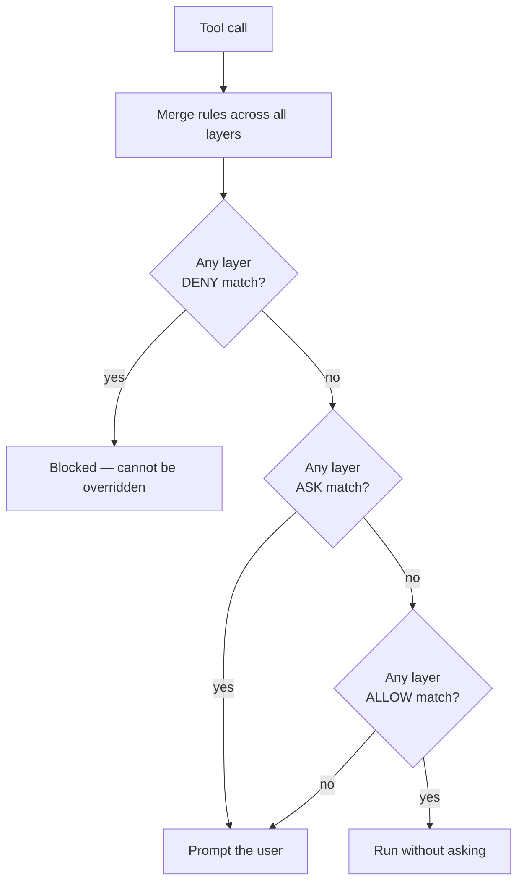
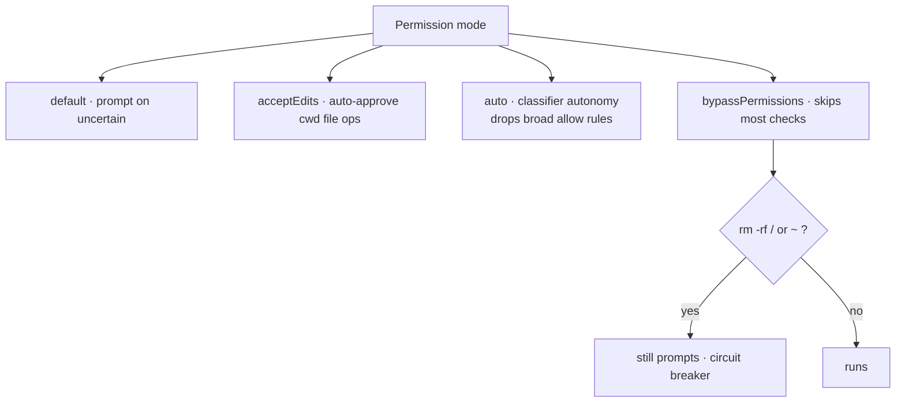
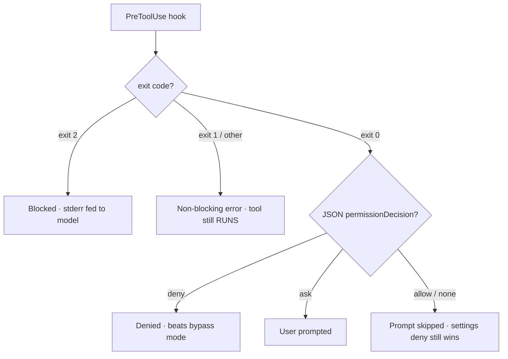
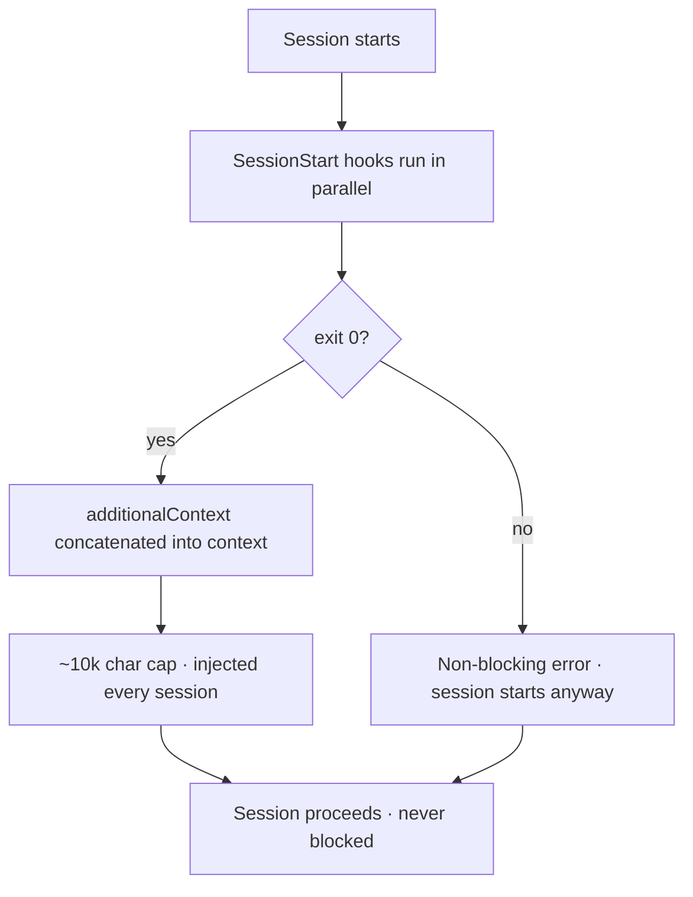
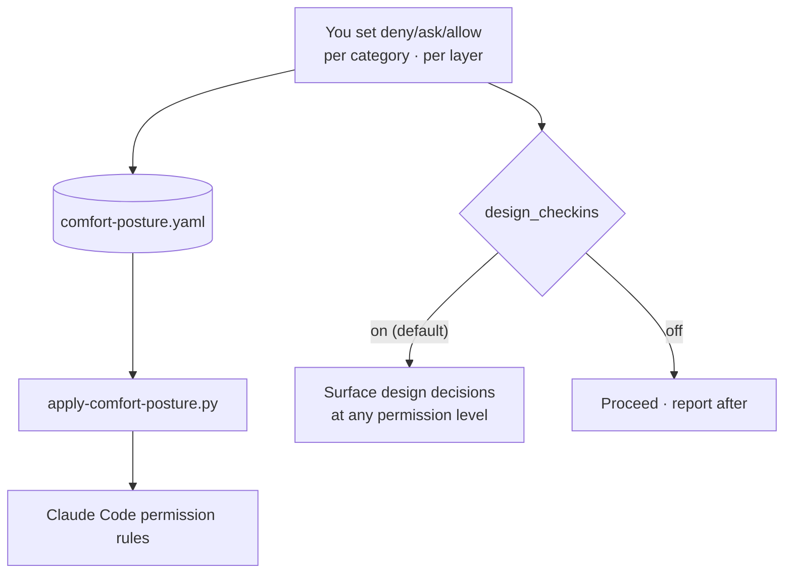
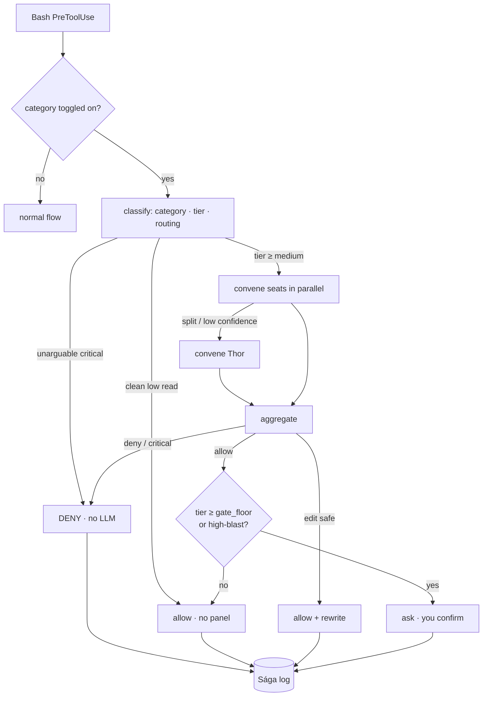
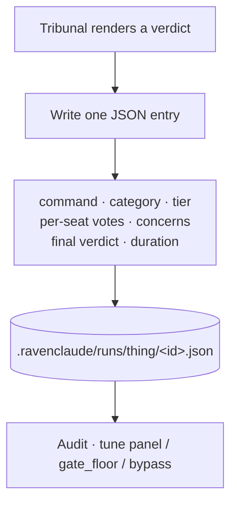
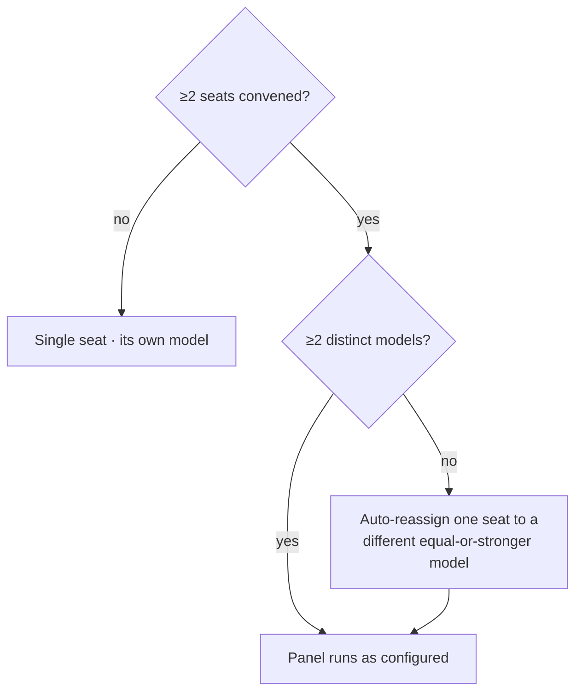
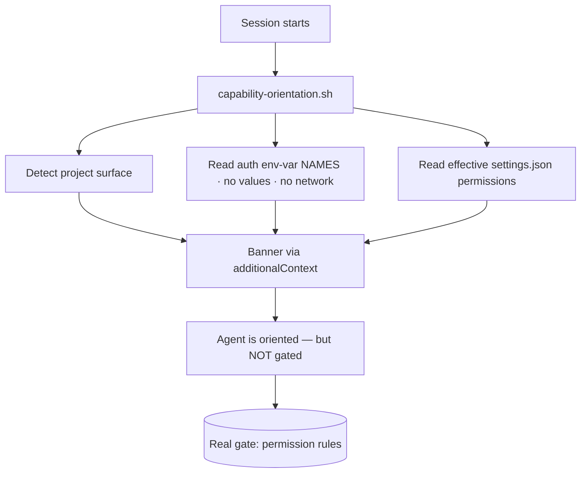

<!-- GENERATED by scripts/generate-concepts-doc.py from
     plugins/ravenclaude-core/knowledge/concepts/ — DO NOT EDIT BY HAND.
     Edit the concept source and re-run the generator. The dashboard's
     interactive "Learn" tab is built from the same source. -->

# How RavenClaude works — concept reference

A plain-language reference for the moving parts: the platform facts RavenClaude
builds on, and what it adds on top. Each concept below is mirrored — with
interactive diagrams, search, and live widgets — in the comfort-posture
dashboard's **Learn** tab (`/dashboard`).

## Platform model

### Permission layers & precedence · _platform fact_

> Four settings files merge — a deny in ANY layer wins, and you can't override it down from a later layer.

Permission rules live under `permissions.allow`, `permissions.ask`, and `permissions.deny` in any of the settings files. Each rule is either a bare tool name (`Bash`, `WebSearch`) or a tool plus a specifier (`Bash(git status:*)`, `Read(/etc/**)`).

**Within one file**, rules evaluate `deny → ask → allow` — the first match wins, so deny always beats ask and ask always beats allow.

**Across files**, the layers **merge** rather than override: a deny in *any* layer blocks the action regardless of allow rules elsewhere. You **cannot override down** — if your user-level settings deny `Bash(rm *)`, no project-level allow re-enables it. That's the safe behavior, but it surprises people who expect a later layer to win.

The most-surprising rule: a **bare-tool deny** (`deny: ["Bash"]`) removes the tool from Claude's context entirely — Claude never sees it. A **scoped deny** (`Bash(rm *)`) keeps the tool and blocks only matching calls.

**See also:** Hooks: verdicts & exit codes · Command-review tribunal (the Thing)

**Sources:** [Configure permissions](https://code.claude.com/docs/en/permissions) · [Claude Code settings](https://code.claude.com/docs/en/settings)

_Last verified: 2026-05-25_

---

### Permission modes · _platform fact_

> Six modes from default to bypassPermissions — but bypass still prompts on rm -rf /, and auto silently drops broad allow rules.

The permission **mode** sets the baseline posture on top of your allow/ask/deny rules. There are six: `default` (prompt when uncertain), `acceptEdits` (auto-approve common filesystem Bash inside the cwd), `plan` (read/think only — no writes), `auto` (research-preview classifier-driven autonomy), `dontAsk` (auto-deny anything not explicitly allowed — handy for CI), and `bypassPermissions` (skips most checks).

Two surprises bite. **`bypassPermissions` is not a total kill-switch:** `rm -rf /` and `rm -rf ~` *still* prompt as a circuit breaker, and a `PreToolUse` hook `deny` still blocks. **`auto` mode silently drops broad allow rules** — `Bash(*)`, wildcarded interpreters, `npm run *`, and all `Agent` allows are dropped while it's active (they restore when you leave), and `defaultMode: "auto"` is *ignored* in project settings — it must live in user-level `~/.claude/settings.json`.

**See also:** Permission layers & precedence · Hooks: verdicts & exit codes

**Sources:** [Choose a permission mode](https://code.claude.com/docs/en/permission-modes) · [Configure permissions](https://code.claude.com/docs/en/permissions)

_Last verified: 2026-05-25_

---

### Hooks: verdicts & exit codes · _platform fact_

> Only exit 2 blocks a tool call; a hook deny beats bypass mode, but a hook allow can't override a settings deny.

A `PreToolUse` hook reads the pending tool call as JSON on stdin and decides its fate. **Exit codes are the load-bearing, easy-to-get-wrong detail:** only **exit 2** blocks (and the hook's stderr is fed back to the model); **exit 0** allows; and **exit 1 or any other code is a *non-blocking* error — the tool still runs.** The trap is that `exit 1` is the conventional Unix "failure", so a policy hook that fails with `exit 1` *looks* like it blocked but doesn't.

For richer control, a hook can instead print a `hookSpecificOutput.permissionDecision` JSON on **exit 0**: `allow`, `deny`, `ask`, or `defer` (headless-only). When several hooks and rules apply, priority is **`deny` > `defer` > `ask` > `allow`**.

Two asymmetries make this safe: a hook **`deny` beats permission-mode bypass** (it blocks even under `bypassPermissions`), but a hook **`allow` does NOT override a settings `deny`** — hooks can *tighten* but never *loosen*. Note hooks **fail open**: on timeout or crash the tool proceeds, so a hook that must fail closed has to emit its own `deny` before its deadline.

**See also:** Permission layers & precedence · Command-review tribunal (the Thing)

**Sources:** [Hooks reference](https://code.claude.com/docs/en/hooks) · [Hooks guide](https://code.claude.com/docs/en/hooks-guide)

_Last verified: 2026-05-25_

---

### SessionStart context injection · _platform fact_

> SessionStart hooks inject additionalContext into every session — additive only; they can't block or delay startup and are capped near 10k chars.

`PreToolUse` hooks gate tool calls; **`SessionStart` hooks can't gate anything.** Their job is to add text to the session via a different field — `hookSpecificOutput.additionalContext` — and nothing more. The output is read **only on exit 0**; a non-zero exit is a non-blocking error and the session still starts. A SessionStart hook can never block or delay a session; its output is purely additive.

Rules that bite: `additionalContext` is **capped near ~10,000 characters** (it's injected every session, so it's a recurring token cost — keep it tight); **multiple SessionStart hooks run in parallel and their outputs are concatenated**; the optional `matcher` is `startup` / `resume` / `clear` / `compact`; and like other hooks it **fails open** on timeout. This is the mechanism RavenClaude's capability banner rides on.

**See also:** Hooks: verdicts & exit codes · Capability-orientation banner

**Sources:** [Hooks reference](https://code.claude.com/docs/en/hooks)

_Last verified: 2026-05-26_

---

## Security

### Comfort-posture dashboard · _RavenClaude-built_

> A point-and-click editor that writes Claude Code permission rules per category and layer — and keeps design check-ins independent of permission level.

**Comfort posture** is RavenClaude's friendly front-end over the raw permission model. Instead of hand-editing `settings.json`, you set a level — **deny / ask / allow** — per *category* of action (file reads, code execution, remote mutations, …) and per *layer* (user / local / project). The dashboard's Settings tab serializes that to `.ravenclaude/comfort-posture.yaml`, and `apply-comfort-posture.py` translates it into the actual Claude Code permission rules — so the layer-precedence rules still govern what finally wins.

The load-bearing subtlety: **permission level ≠ design judgment.** Setting a category to `allow` only removes the click-to-approve on tool calls — it does **not** tell Claude to stop surfacing architectural decisions. That behavior is a *separate* flag, `design_checkins` (on by default), so relaxing permissions to move faster never silently mutes design check-ins. The two are deliberately decoupled.

**See also:** Permission layers & precedence · Command-review tribunal (the Thing)

**Sources:** [ravenclaude-core constitution](plugins/ravenclaude-core/CLAUDE.md) · [apply-comfort-posture translator](plugins/ravenclaude-core/scripts/apply-comfort-posture.py)

_Last verified: 2026-05-26_

---

### Command-review tribunal (the Thing) · _RavenClaude-built_

> An opt-in panel of reviewer seats that votes ALLOW/EDIT/DENY on shell commands instead of interrupting you.

**Command review** — codename *the Thing* — is an opt-in panel of reviewer agents that adjudicates shell commands instead of stopping to ask you. It sits **on top of** comfort-posture: posture sets the policy (allow/ask/deny per category); the tribunal is the adjudicator you switch on for a category so a verdict lands in seconds.

Routing is **tiered**. Every command resolves to `low → medium → high → extreme` (its category base tier, bumped by a deterministic high/critical concern). A clean `low` read runs **no panel at all** (zero cost); seat count and the confidence bar escalate with the tier. Up to three seats run in parallel — **Forseti** (security), **Mímir** (code), **Heimdall** (injection) — with **Thor** (architect) convened only on a split.

The **`gate_floor`** knob (default `high`) is the lowest tier whose *confident ALLOW* is surfaced to you as an `ask`. DENY still blocks and EDIT still rewrites autonomously, so the tribunal pre-filters the dangerous and the fixable before either reaches you. Two hard overrides ignore the knob: **reads are never surfaced**, and **irreversible high-blast allows always are**. An abstaining panel always fails **closed**. It can never relax the `security_deny` floor.

**See also:** Comfort-posture dashboard · Permission layers & precedence · Hooks: verdicts & exit codes

**Sources:** [thing skill (operating reference)](plugins/ravenclaude-core/skills/thing/SKILL.md) · [Tribunal design](docs/tribunal-review-feature-design.md)

_Last verified: 2026-05-26_

---

### The Sága audit log · _RavenClaude-built_

> Every command-review verdict writes one JSON entry — command, category, tier, per-seat votes, concerns, final verdict — under .ravenclaude/runs/thing/.

Every tribunal verdict — allow, edit, deny, or ask — writes exactly **one JSON entry** to `.ravenclaude/runs/thing/<id>.json`, the **Sága log**. The entry records the command, its category, the resolved tier, each seat's verdict, the concerns cited, the final verdict (and the revised command on an EDIT), and the duration.

This is the observability substrate: it turns an otherwise opaque "the panel decided" into an auditable trail you can read after the fact to tune the panel, the `gate_floor`, or the bypass patterns. It's **gitignored by default** — the log is local operational data, not something to commit.

**See also:** Command-review tribunal (the Thing) · Model diversity on the panel

**Sources:** [thing skill (operating reference)](plugins/ravenclaude-core/skills/thing/SKILL.md)

_Last verified: 2026-05-26_

---

### Model diversity on the panel · _RavenClaude-built_

> When ≥2 reviewer seats convene, the tribunal guarantees ≥2 distinct model backbones run — so one model's blind spot can't pass the whole panel.

A panel of reviewers is only as strong as its diversity. If every seat runs on the same model, a single model's blind spot — a shared hallucination or a class of injection it doesn't catch — can pass the **whole** panel unnoticed. That's the **anti-correlated-hallucination** failure mode.

So the engine enforces a **model-diversity rule**: whenever **two or more seats convene, at least two distinct model backbones run**. If a `panel:` config override happens to collapse the seats onto one model, the engine **auto-reassigns one seat to a different, equal-or-stronger model** rather than letting a monoculture review the command. It's proven by Gate 22.

**See also:** Command-review tribunal (the Thing)

**Sources:** [ravenclaude-core constitution](plugins/ravenclaude-core/CLAUDE.md) · [Tribunal assessment & improvement plan](docs/tribunal-assessment-and-improvement-plan.md)

_Last verified: 2026-05-26_

---

## Orientation & capability

### Capability-orientation banner · _RavenClaude-built_

> A SessionStart hook injects what the project touches, the auth it holds (names only), and the effective permissions — so the agent never acts as if it has no access.

The `capability-orientation.sh` SessionStart hook assembles a **capability banner** and injects it via `additionalContext` every session. It states the project's detected external surface, the auth it holds (env-var **names/presence only — never values; no network calls**), the effective `.claude/settings.json` permissions, and a presence/staleness summary of `environment-context.md`.

Why it exists: the behavioral instruction "read the posture at session start" is prose the model often skips. The hook makes the summary impossible to miss. Crucially, it is a **salience boost, not enforcement** — the real gate is the permission rules; the banner just stops the agent acting as if it has no access (the "did you try X?" round-trip on actions it's already authorized for). The banner is a *pointer*; `environment-context.md` stays the authoritative source for per-environment detail.

**See also:** SessionStart context injection · Comfort-posture dashboard

**Sources:** [ravenclaude-core constitution](plugins/ravenclaude-core/CLAUDE.md) · [Claude Code permissions (SessionStart)](plugins/ravenclaude-core/knowledge/claude-code-permissions.md)

_Last verified: 2026-05-26_

---
