<!-- GENERATED by scripts/generate-concepts-doc.py from
     plugins/ravenclaude-core/knowledge/concepts/ — DO NOT EDIT BY HAND.
     Edit the concept source and re-run the generator. The dashboard's
     interactive "Learn" tab is built from the same source. -->

# How RavenClaude works — concept reference

A plain-language reference for the moving parts: the platform facts RavenClaude
builds on, and what it adds on top. Each concept below is mirrored — with
interactive diagrams, search, and live widgets — in the comfort-posture
dashboard's **Learn** tab (`/dashboard`).


## Foundations

### The agent loop: one turn · _platform fact_

> Every agent turn runs the same loop: assemble prompt → call model → run tools → feed results back → repeat until done. The 'harness' is the software wrapping the model that drives it.

A language model on its own is **stateless**: it forgets what it did three steps ago, a failed tool call would otherwise vanish silently, and its context window fills with noise. An **agent** is a model plus the software that fixes all that — the **harness**. As the saying goes, *"if you're not the model, you're the harness."*

The harness drives one **turn** as a loop, and every agentic tool — Claude Code, the Agent SDK, your own script — runs some version of it:

1. **Assemble the prompt** — system prompt + tool schemas + project memory (`CLAUDE.md` / `AGENTS.md`) + the conversation so far + your message.
2. **Call the model.**
3. **Classify the output** — did it ask to use a tool, or just answer? Plain text with no tool call ends the turn.
4. **Execute the requested tools** — and this is where permission gates, hooks, or a review panel can deny, edit, or wave the call through.
5. **Package the results** as the next message — crucially, an *error* comes back as a result the model can read and self-correct from, not a crash.
6. **Update context** (compacting when it fills) and loop back to step 1.

The same loop scales up: a lead agent can **dispatch a subagent** for a slice of work and fold its short summary back in at step 5. A guiding principle the better harnesses inherit: **treat memory as a hint and verify against real state before acting** — which is why a careful agent doesn't stop at "looks done," it stops when a verification step says it's done.

RavenClaude is one such harness layer: it rides on Claude Code's loop and adds orchestration, a review tribunal at step 4, and verification gates at the end — but the loop itself is how *any* agent works by default.

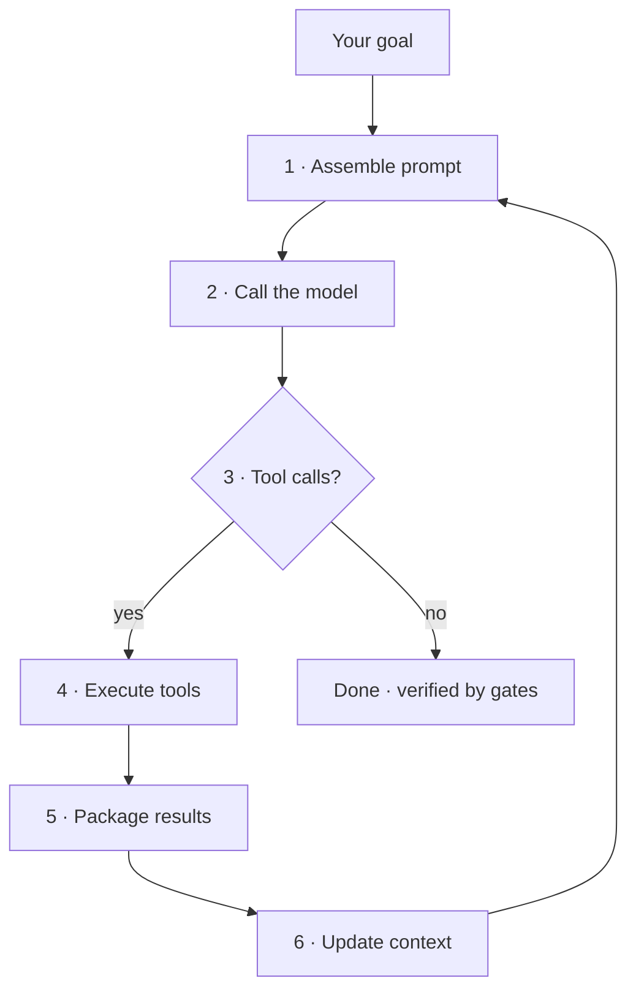
```mermaid
flowchart TD
  U[Your goal] --> P[1 · Assemble prompt]
  P --> L[2 · Call the model]
  L --> C{3 · Tool calls?}
  C -->|yes| T[4 · Execute tools]
  T --> R[5 · Package results]
  R --> X[6 · Update context]
  X --> P
  C -->|no| D[Done · verified by gates]
  class P,L,C,T,R,X,D built
```

**See also:** Tool use (function calling) · The context window · Subagents & orchestration

**Sources:** [Building agents with the Claude Agent SDK](https://code.claude.com/docs/en/agent-sdk) · ["The Anatomy of an Agent Harness" (Akshay Pachaar)](https://x.com/_avichawla/status/2062082282878627946)

_Last verified: 2026-06-05_


---

### Tool use (function calling) · _platform fact_

> A model can't act on its own — it asks for a tool by name, the harness runs it, and the result comes back as the next message. That request/result loop is every agent action.

A language model only produces **text**. It can't read a file, run a command, or call an API by itself. **Tool use** (also called *function calling*) is the bridge: you describe the available tools — each with a name, a description, and a JSON schema for its inputs — and the model, instead of answering in prose, emits a structured **tool-use request** naming one tool and the arguments to call it with.

The model never runs anything. The **harness** (Claude Code, the Agent SDK, your own loop) executes the requested tool, captures the output, and feeds it back as a **tool-result** message. The model reads that result on the next turn and decides what to do next — call another tool, or answer. Every single thing an agent *does* — edit a file, run a test, open a PR — is one trip around this request → execute → result cycle.

Three details that bite:

- **The model picks the tool, not the harness.** You can constrain it (`tool_choice` can force a specific tool, force *any* tool, or leave it `auto`), but in normal operation the model chooses. A vague tool description is the most common reason it picks the wrong one or fills arguments badly.
- **Errors are data, not crashes.** A failed tool call should return its error *as a tool-result* so the model can read it and self-correct. Throwing away the loop on the first failure is the classic broken-agent bug.
- **Results re-enter the context window.** Tool output isn't free — a command that dumps 10k lines lands all of it back in the prompt. This is why focused tools that return *conclusions* beat raw firehoses.

A permission layer can sit between the request and the execution: the model may *ask* for a tool, but the harness (or a hook, or a tribunal) can still deny, edit, or gate the call before it runs.

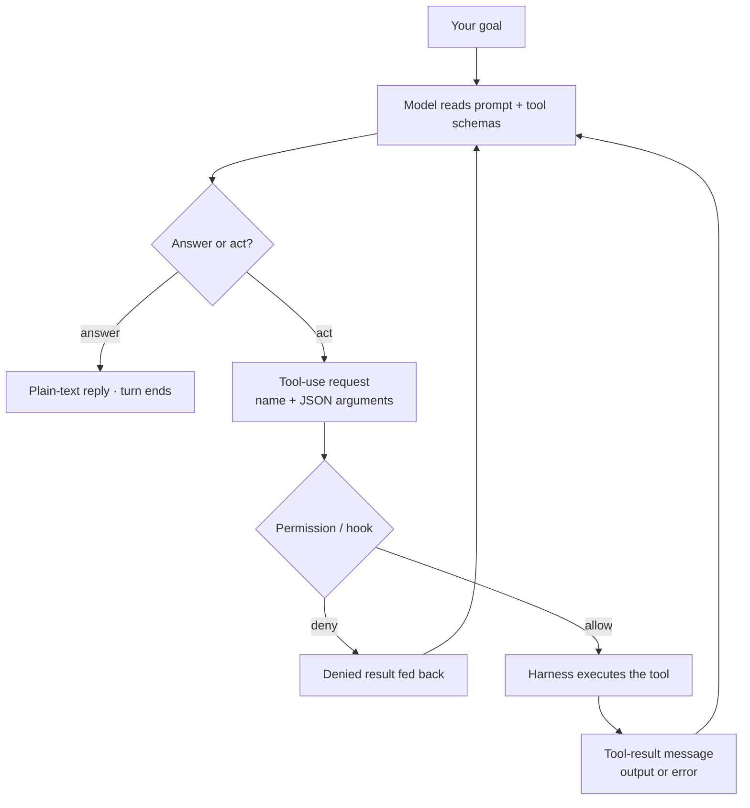
```mermaid
flowchart TD
  G[Your goal] --> M[Model reads prompt + tool schemas]
  M --> D{Answer or act?}
  D -- answer --> OUT[Plain-text reply · turn ends]
  D -- act --> REQ[Tool-use request<br/>name + JSON arguments]
  REQ --> GATE{Permission / hook}
  GATE -- deny --> BACK[Denied result fed back]
  GATE -- allow --> RUN[Harness executes the tool]
  RUN --> RES[Tool-result message<br/>output or error]
  RES --> M
  BACK --> M
  class M,REQ,RUN,RES fact
  class GATE built
```

**See also:** The agent loop: one turn · Permission layers & precedence

**Sources:** [Tool use (function calling) — Claude API](https://docs.claude.com/en/docs/build-with-claude/tool-use) · [Agent SDK — tools & permissions](https://code.claude.com/docs/en/agent-sdk)

_Last verified: 2026-06-05_


---

### The context window · _platform fact_

> Everything the model 'knows' this turn is the text in its context window — system prompt, tools, history, files. It's finite, it fills up, and when it's full the harness compacts.

A model has **no memory between turns.** Everything it "knows" while answering is whatever text sits in its **context window** right now: the system prompt, the tool schemas, the project instructions (`CLAUDE.md` / `AGENTS.md`), the conversation so far, and the contents of any file or tool result that's been pulled in. Nothing outside that window exists to the model — if it isn't in context, the model can't see it, no matter how relevant.

The window is **finite** (measured in tokens — roughly ¾ of a word each). Two consequences follow:

- **It fills up.** Long sessions, big files, and chatty tool output all consume the budget. As it fills, the *effective* room for reasoning shrinks, and far-back details get crowded out — the model can genuinely "forget" what happened early in a long session.
- **When it's nearly full, the harness compacts.** Claude Code summarizes the older part of the conversation into a compact recap and continues with that plus the recent turns. The work isn't lost, but it's now a *summary* — which is why durable facts belong in `CLAUDE.md` or committed files, not just in chat.

The practical model: treat context like a **desk, not a filing cabinet.** Things on the desk are usable now; everything else has to be fetched back on (a tool call, a file read) before the model can use it — and fetching it costs space. Good agent design keeps the desk clear: focused tool results, subagents that return short summaries instead of raw dumps, and important state written somewhere persistent.

This is also why a **SessionStart** context injection (the orientation banner) is deliberately kept small — it rides in *every* session's window, so it's a recurring tax on the budget.

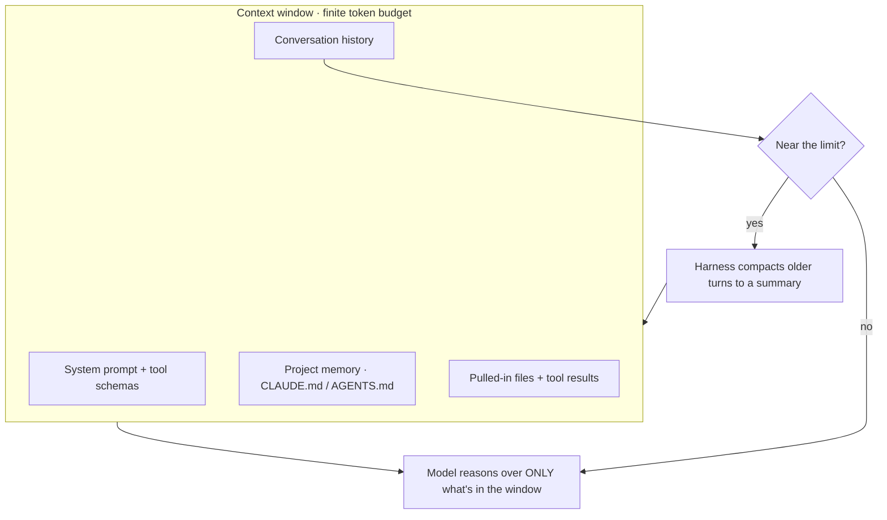
```mermaid
flowchart TD
  subgraph W[Context window · finite token budget]
    S[System prompt + tool schemas]
    P[Project memory · CLAUDE.md / AGENTS.md]
    H[Conversation history]
    F[Pulled-in files + tool results]
  end
  W --> M[Model reasons over ONLY what's in the window]
  H --> FULL{Near the limit?}
  FULL -- yes --> C[Harness compacts older turns to a summary]
  C --> W
  FULL -- no --> M
  class S,P,H,F,M fact
  class C built
```

**See also:** The agent loop: one turn · Tool use (function calling) · SessionStart context injection

**Sources:** [Context windows — Claude API](https://docs.claude.com/en/docs/build-with-claude/context-windows) · [Manage context — Claude Code](https://code.claude.com/docs/en/costs)

_Last verified: 2026-06-05_


---

### Subagents & orchestration · _platform fact_

> A lead agent can spawn focused subagents, each with its own clean context window, and get back a short summary — not the raw work. It's how big tasks stay inside finite context.

A single agent doing a sprawling task hits two walls: its **context window fills** with the noise of exploration, and a long linear chain has no parallelism. **Subagents** solve both. The lead agent (the *orchestrator*) hands a self-contained slice of work to a **subagent** — a fresh agent with its **own clean context window**, its own tools, and a focused brief. The subagent does the legwork and returns a **short summary** to the lead. The raw files it read and dead-ends it explored never touch the lead's context.

This is the **orchestrator–worker** pattern, and the load-bearing idea is *information hiding*: the lead pays only for the conclusion, not the investigation. A research subagent might read forty files and reply with a two-paragraph answer — forty files' worth of tokens spent in a context the lead never has to carry.

What it's good at, and where it bites:

- **Fan-out.** Independent slices run in parallel — three subagents searching three areas at once, returning three summaries. Big wall-clock win when the slices don't depend on each other.
- **Focus.** A narrowly-scoped subagent with the right tools beats one giant agent juggling everything, the same way a specialist beats a generalist.
- **The summary is the seam — and the risk.** The lead sees *only* what the subagent reports back. A subagent that summarizes badly, or drops a detail the lead needed, silently loses that information. Briefs should say what to return, not just what to do.
- **Subagents don't share memory with each other.** Each is isolated by design, so coordination happens through the lead, not sideways between workers.

RavenClaude's Team Lead is exactly this pattern with named specialists; the command-review tribunal's parallel reviewer seats are another instance — several focused agents, one aggregated verdict.

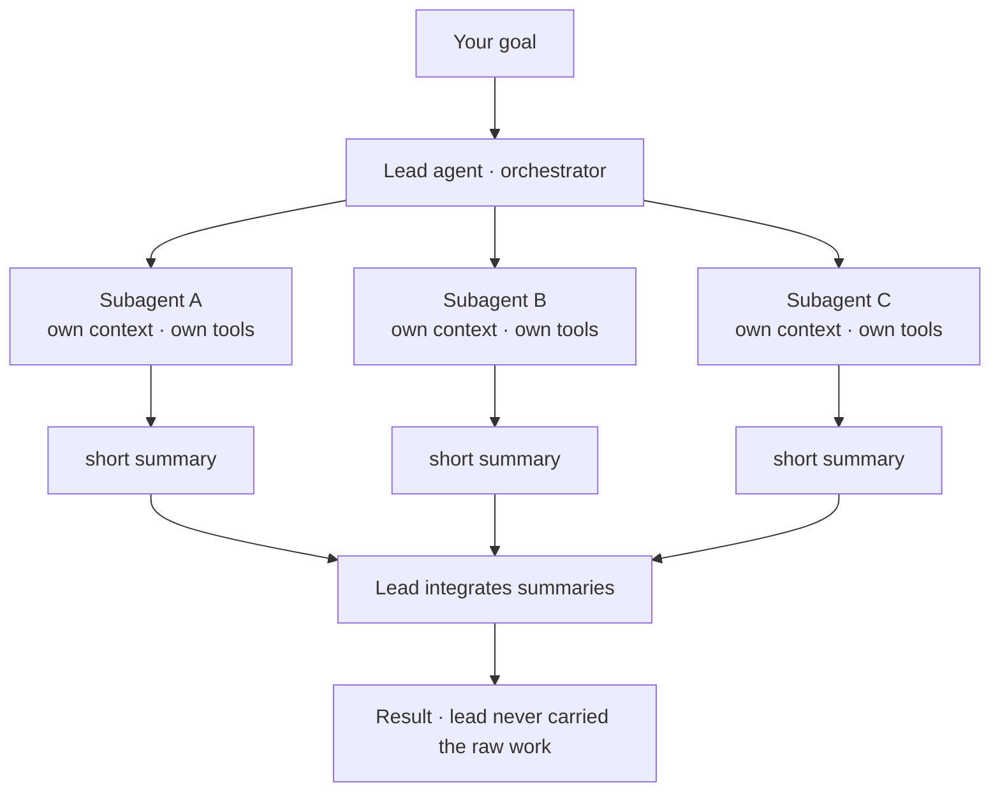
```mermaid
flowchart TD
  U[Your goal] --> L[Lead agent · orchestrator]
  L --> A[Subagent A<br/>own context · own tools]
  L --> B[Subagent B<br/>own context · own tools]
  L --> C[Subagent C<br/>own context · own tools]
  A --> SA[short summary]
  B --> SB[short summary]
  C --> SC[short summary]
  SA --> L2[Lead integrates summaries]
  SB --> L2
  SC --> L2
  L2 --> OUT[Result · lead never carried the raw work]
  class L,L2,A,B,C fact
  class OUT built
```

**See also:** The context window · The agent loop: one turn · Tool use (function calling)

**Sources:** [Subagents — Claude Code](https://code.claude.com/docs/en/sub-agents) · [Building agents with the Agent SDK](https://code.claude.com/docs/en/agent-sdk)

_Last verified: 2026-06-05_


---

### MCP: tools & data over a protocol · _platform fact_

> The Model Context Protocol is a standard way to plug external tools and data into any agent. Write a server once; every MCP-aware client can use it — no per-app glue.

Tool use lets a model call a tool — but who *supplies* the tools? If every integration (GitHub, a database, a ticketing system) had to be hand-wired into every agent, you'd rebuild the same connectors over and over. The **Model Context Protocol (MCP)** is the open standard that fixes this. It's often described as *"a USB-C port for AI"*: a single, uniform way for an agent to plug into outside tools and data.

The shape is **client ↔ server.** Your agent host (Claude Code, an IDE, a desktop app) is an **MCP client**. An **MCP server** is a small program that exposes capabilities over the protocol. Write the server once, and *any* MCP-aware client can use it — the glue is the protocol, not bespoke per-app code. Servers offer three kinds of primitive:

- **Tools** — actions the model can call (the GitHub tools this very session uses are an MCP server).
- **Resources** — data the agent can read (files, records, query results).
- **Prompts** — reusable prompt templates the server provides.

Two things worth knowing:

- **Servers run as separate processes** and connect over a transport (local stdio, or remote HTTP/SSE). A server may be on your machine or across the network — the client talks to both the same way.
- **MCP tools are still just tool use.** Once connected, an MCP tool appears to the model exactly like any built-in tool: same request/result loop, same permission gating. MCP standardizes *where tools come from*, not *how the model calls them*. (In Claude Code a server can show as "still connecting" at startup — its tools are name-only until the schema loads, which is a connection state, not an absent capability.)

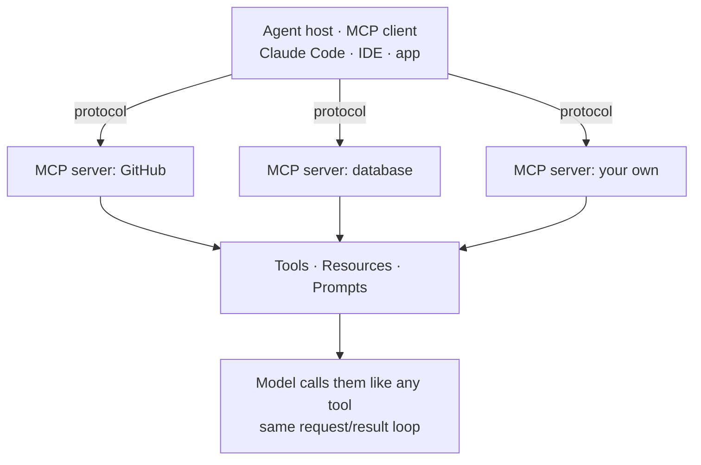
```mermaid
flowchart TD
  H[Agent host · MCP client<br/>Claude Code · IDE · app] -->|protocol| S1[MCP server: GitHub]
  H -->|protocol| S2[MCP server: database]
  H -->|protocol| S3[MCP server: your own]
  S1 --> P[Tools · Resources · Prompts]
  S2 --> P
  S3 --> P
  P --> M[Model calls them like any tool<br/>same request/result loop]
  class H,M fact
  class S1,S2,S3 built
```

**See also:** Tool use (function calling) · The agent loop: one turn

**Sources:** [Model Context Protocol — specification](https://modelcontextprotocol.io) · [Connect to MCP servers — Claude Code](https://code.claude.com/docs/en/mcp)

_Last verified: 2026-06-05_


---

### Choosing a model · _platform fact_

> Bigger isn't always better. Match the model to the job — a fast, cheap model for routine steps, a frontier model for hard reasoning — and use the strong one to supervise the cheap ones.

An agent isn't locked to one model, and the strongest model isn't always the right one. Picking a model is a **cost / latency / capability** trade, and the three tiers exist precisely so you can match the model to the work:

- **Frontier (e.g. Opus)** — deepest reasoning, hardest planning, gnarliest debugging. Slower and most expensive per token. Reach for it when the task genuinely needs it.
- **Balanced (e.g. Sonnet)** — the everyday workhorse: strong reasoning at much lower cost and latency. The sensible default for most agent work.
- **Fast (e.g. Haiku)** — quick, cheap, great for classification, routing, summarizing, and high-volume routine steps where frontier-grade reasoning is overkill.

Two ideas make this practical:

- **Mix models within one task.** A capable orchestrator can plan and supervise while dispatching the routine legwork to a faster, cheaper model — *strong model supervises, cheap models execute.* Subagents are the natural place to drop a tier: the lead reasons in Sonnet/Opus, the workers grind in Haiku.
- **Diversity is a safety property, not just a cost one.** When multiple agents *review* the same thing, running them all on the **same** model means one model's blind spot can pass the whole panel — the "anti-correlated hallucination" failure. Deliberately running ≥2 *different* backbones on a review panel catches what a monoculture would miss. (RavenClaude's command-review tribunal enforces exactly this.)

The wrong instinct is "always use the biggest model." The right instinct is "use the smallest model that reliably clears this specific bar," and let a stronger model check the cheaper ones' work.

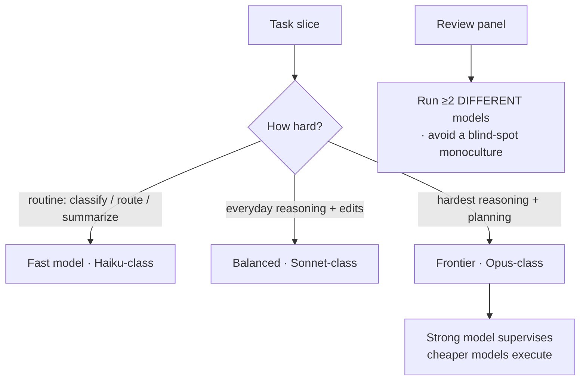
```mermaid
flowchart TD
  T[Task slice] --> Q{How hard?}
  Q -- routine: classify / route / summarize --> FAST[Fast model · Haiku-class]
  Q -- everyday reasoning + edits --> BAL[Balanced · Sonnet-class]
  Q -- hardest reasoning + planning --> FRONT[Frontier · Opus-class]
  FRONT --> SUP[Strong model supervises<br/>cheaper models execute]
  REV[Review panel] --> DIV[Run ≥2 DIFFERENT models<br/>· avoid a blind-spot monoculture]
  class FAST,BAL,FRONT,Q fact
  class SUP,DIV built
```

**See also:** The agent loop: one turn · Subagents & orchestration

**Sources:** [Models overview — Claude API](https://docs.claude.com/en/docs/about-claude/models) · [Choosing a model — Claude Code](https://code.claude.com/docs/en/model-config)

_Last verified: 2026-06-05_


---

### Source control basics · _platform fact_

> Git is a time-machine for your files. RavenClaude does most of the git work for you — this page is the vocabulary so you can follow along.

**Source control** (the tool is called **git**, the website is **GitHub**) is a time-machine for every file in a project: every change is saved as a labeled snapshot, and many people can work on the same project in parallel without overwriting each other. The load-bearing fact for you: **RavenClaude does almost all of the git work for you** — this page is the vocabulary so you understand what Claude Code is doing on your behalf, and can step in when something goes sideways.

**Four ideas cover almost everything you'll see:**

- **Commit** — one saved snapshot of your work, with a short message explaining _why_ (not what — the diff already shows what).
- **Branch** — a parallel timeline for a piece of work-in-progress, kept separate from the project's official timeline (the **main** branch).
- **Pull request (PR)** — a proposal that the work on a branch be merged back into main; it gets reviewed (by a person, by CI checks, sometimes by Claude) before anything moves.
- **Merge** — combining a branch's commits into main once the PR is approved.

**The minimum vocabulary** you'll see in commands and logs:

- `git status` — what's changed since the last snapshot
- `git add <file>` — stage a file for the next snapshot
- `git commit -m "why"` — take the snapshot
- `git push` — upload local commits to GitHub
- `git pull` — download new commits from GitHub
- `git log` — read the history

**Two patterns you'll actually encounter in this repo:**

1. **Docs commit straight to main, no PR.** Pure documentation under `docs/` (plans, designs, research notes, the rolling session log) commits direct to main because it can't break a consumer's `/plugin marketplace update`. Faster planning loop.
2. **Code, hooks, manifests, and CI go through a PR.** Claude Code creates the branch, makes the commits, opens the PR, and tells you the URL. You review in GitHub and click **Merge**.

**The safety nets** mean you can experiment without breaking things:

- The `guard-destructive.sh` hook blocks the truly destructive commands — **force-push to main**, `git reset --hard`, `git clean -f`, and `git branch -D` on a protected branch. It denies them before they run.
- The sanctioned way to retire a finished branch is `scripts/archive-branch.sh` — it **tags the branch tip** (so the work is recoverable forever on the tag), pushes the tag to GitHub, writes an audit log, then deletes the local branch. Work is never actually lost.

You will rarely type any of these commands yourself. The reason to learn the vocabulary is so that when Claude says _"I opened PR #238 on branch `feat/rc-hardener-followups`"_ or _"the guard denied a force-push"_, you know exactly what happened and what your next click is.

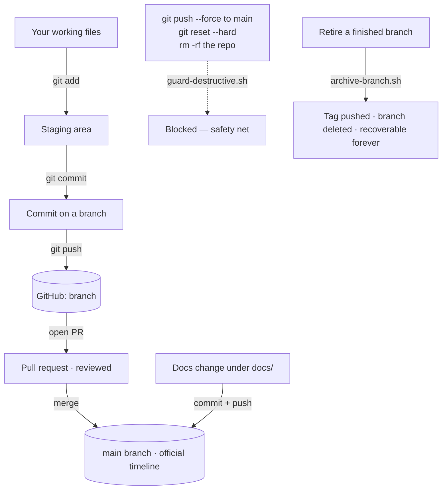
```mermaid
flowchart TD
  W[Your working files] -->|git add| S[Staging area]
  S -->|git commit| C[Commit on a branch]
  C -->|git push| GH[(GitHub: branch)]
  GH -->|open PR| PR[Pull request · reviewed]
  PR -->|merge| MAIN[(main branch · official timeline)]
  D[Docs change under docs/] -->|commit + push| MAIN
  X[git push --force to main<br/>git reset --hard<br/>rm -rf the repo] -.->|guard-destructive.sh| BLOCK[Blocked — safety net]
  R[Retire a finished branch] -->|archive-branch.sh| TAG[Tag pushed · branch deleted · recoverable forever]
  class C,PR,MAIN,TAG fact
  class BLOCK,GH built
```

**See also:** Getting started · Layout enforcement

**Sources:** [AGENTS.md — PR conventions](AGENTS.md) · [AGENTS.md — House rules (branch-archive)](AGENTS.md) · [branch-archive skill](plugins/ravenclaude-core/skills/branch-archive/SKILL.md) · [Pro Git — About Version Control](https://git-scm.com/book/en/v2/Getting-Started-About-Version-Control)

_Last verified: 2026-06-04_


---


## Getting started

### Getting started · _RavenClaude-built_

> Add the marketplace, install ravenclaude-core, run /dashboard. Needs jq + python3; under Copilot CLI it's `ravenclaude install`.

RavenClaude is a Claude Code **plugin marketplace**. To use the core plugin: add the marketplace, install the plugin, reload. `jq` and `python3` are required for the CI workflows and the layout-enforcement hook (both ship in the devcontainer).

```text
/plugin marketplace add mcorbett51090/RavenClaude
/plugin install ravenclaude-core@ravenclaude
/reload-plugins
```

After install, run **`/dashboard`** to launch the comfort-posture editor (point-and-click permission rules + command-review toggles, with one-click Save & apply). Domain plugins (`power-platform`, `finance`, …) build on core, so install it first. Running under **GitHub Copilot CLI** instead? Use `bash scripts/ravenclaude install` — and from then on, updating is just `git pull`.

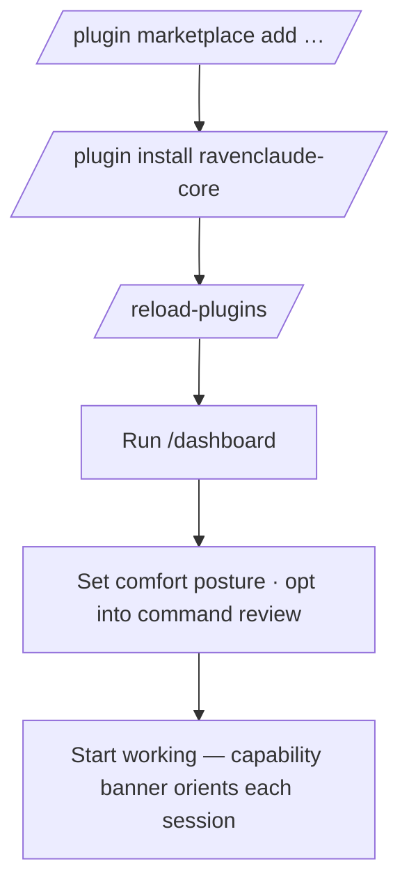
```mermaid
flowchart TD
  A[/plugin marketplace add …/] --> B[/plugin install ravenclaude-core/]
  B --> C[/reload-plugins/]
  C --> D[Run /dashboard]
  D --> E[Set comfort posture · opt into command review]
  E --> F[Start working — capability banner orients each session]
  class A,B,C,D,E,F built
```

**See also:** Comfort-posture dashboard · Capability-orientation banner

**Sources:** [ravenclaude-core README](plugins/ravenclaude-core/README.md) · [AGENTS.md — Setup commands](AGENTS.md)

_Last verified: 2026-05-26_


---


## Platform model

### Permission layers & precedence · _platform fact_

> Four settings files merge — a deny in ANY layer wins, and you can't override it down from a later layer.

Permission rules live under `permissions.allow`, `permissions.ask`, and `permissions.deny` in any of the settings files. Each rule is either a bare tool name (`Bash`, `WebSearch`) or a tool plus a specifier (`Bash(git status:*)`, `Read(/etc/**)`).

**Within one file**, rules evaluate `deny → ask → allow` — the first match wins, so deny always beats ask and ask always beats allow.

**Across files**, the layers **merge** rather than override: a deny in *any* layer blocks the action regardless of allow rules elsewhere. You **cannot override down** — if your user-level settings deny `Bash(rm *)`, no project-level allow re-enables it. That's the safe behavior, but it surprises people who expect a later layer to win.

The most-surprising rule: a **bare-tool deny** (`deny: ["Bash"]`) removes the tool from Claude's context entirely — Claude never sees it. A **scoped deny** (`Bash(rm *)`) keeps the tool and blocks only matching calls.

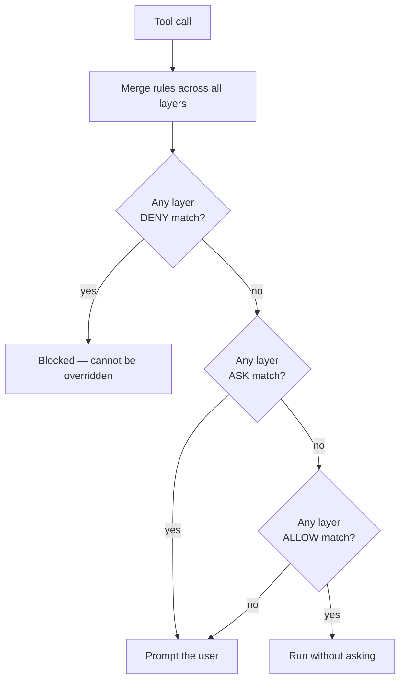
```mermaid
flowchart TD
  CALL[Tool call] --> MERGE[Merge rules across all layers]
  MERGE --> D{Any layer<br/>DENY match?}
  D -- yes --> BLOCK[Blocked — cannot be overridden]
  D -- no --> A{Any layer<br/>ASK match?}
  A -- yes --> PROMPT[Prompt the user]
  A -- no --> AL{Any layer<br/>ALLOW match?}
  AL -- yes --> RUN[Run without asking]
  AL -- no --> PROMPT
  class BLOCK built
  class D,A,AL fact
```

**See also:** Hooks: verdicts & exit codes · Command-review tribunal (the Thing)

**Sources:** [Configure permissions](https://code.claude.com/docs/en/permissions) · [Claude Code settings](https://code.claude.com/docs/en/settings)

_Last verified: 2026-05-25_


---

### Permission modes · _platform fact_

> Six modes from default to bypassPermissions — but bypass still prompts on rm -rf /, and auto silently drops broad allow rules.

The permission **mode** sets the baseline posture on top of your allow/ask/deny rules. There are six: `default` (prompt when uncertain), `acceptEdits` (auto-approve common filesystem Bash inside the cwd), `plan` (read/think only — no writes), `auto` (research-preview classifier-driven autonomy), `dontAsk` (auto-deny anything not explicitly allowed — handy for CI), and `bypassPermissions` (skips most checks).

Two surprises bite. **`bypassPermissions` is not a total kill-switch:** `rm -rf /` and `rm -rf ~` *still* prompt as a circuit breaker, and a `PreToolUse` hook `deny` still blocks. **`auto` mode silently drops broad allow rules** — `Bash(*)`, wildcarded interpreters, `npm run *`, and all `Agent` allows are dropped while it's active (they restore when you leave), and `defaultMode: "auto"` is *ignored* in project settings — it must live in user-level `~/.claude/settings.json`.

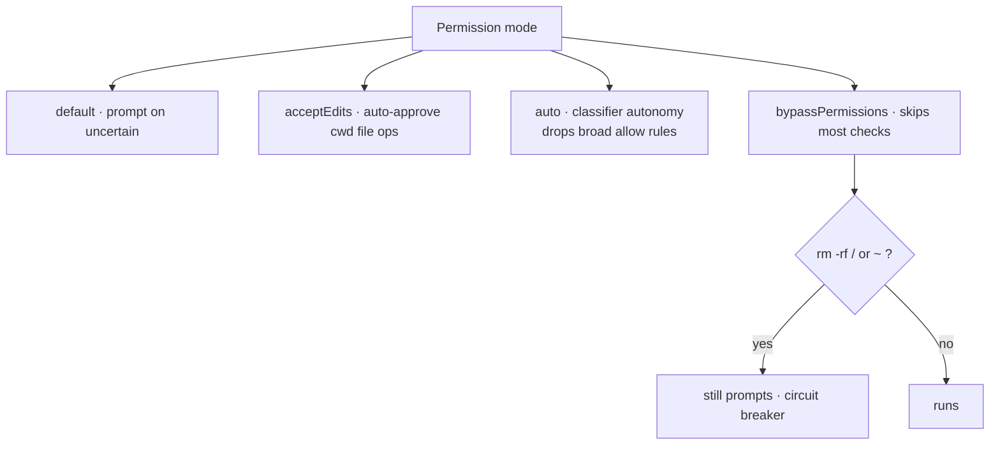
```mermaid
flowchart TD
  M[Permission mode] --> DEF[default · prompt on uncertain]
  M --> AE[acceptEdits · auto-approve cwd file ops]
  M --> AUTO[auto · classifier autonomy<br/>drops broad allow rules]
  M --> BP[bypassPermissions · skips most checks]
  BP --> CB{rm -rf / or ~ ?}
  CB -- yes --> STOP[still prompts · circuit breaker]
  CB -- no --> RUN[runs]
  class M,DEF,AE,AUTO,BP fact
  class STOP built
```

**See also:** Permission layers & precedence · Hooks: verdicts & exit codes

**Sources:** [Choose a permission mode](https://code.claude.com/docs/en/permission-modes) · [Configure permissions](https://code.claude.com/docs/en/permissions)

_Last verified: 2026-05-25_


---

### Hooks: verdicts & exit codes · _platform fact_

> Only exit 2 blocks a tool call; a hook deny beats bypass mode, but a hook allow can't override a settings deny.

A `PreToolUse` hook reads the pending tool call as JSON on stdin and decides its fate. **Exit codes are the load-bearing, easy-to-get-wrong detail:** only **exit 2** blocks (and the hook's stderr is fed back to the model); **exit 0** allows; and **exit 1 or any other code is a *non-blocking* error — the tool still runs.** The trap is that `exit 1` is the conventional Unix "failure", so a policy hook that fails with `exit 1` *looks* like it blocked but doesn't.

For richer control, a hook can instead print a `hookSpecificOutput.permissionDecision` JSON on **exit 0**: `allow`, `deny`, `ask`, or `defer` (headless-only). When several hooks and rules apply, priority is **`deny` > `defer` > `ask` > `allow`**.

Two asymmetries make this safe: a hook **`deny` beats permission-mode bypass** (it blocks even under `bypassPermissions`), but a hook **`allow` does NOT override a settings `deny`** — hooks can *tighten* but never *loosen*. Note hooks **fail open**: on timeout or crash the tool proceeds, so a hook that must fail closed has to emit its own `deny` before its deadline.

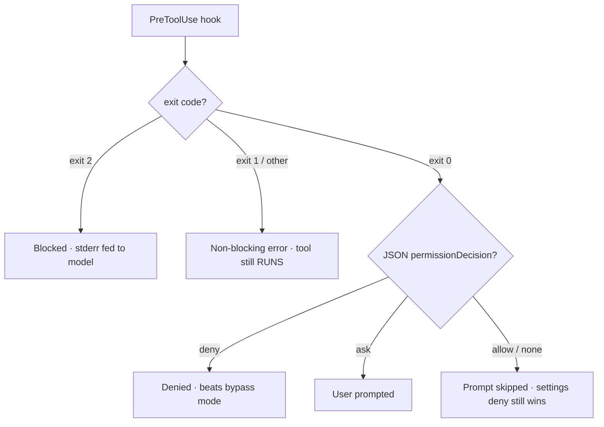
```mermaid
flowchart TD
  H[PreToolUse hook] --> EX{exit code?}
  EX -- "exit 2" --> BLOCK[Blocked · stderr fed to model]
  EX -- "exit 1 / other" --> NB[Non-blocking error · tool still RUNS]
  EX -- "exit 0" --> J{JSON permissionDecision?}
  J -- deny --> DEN[Denied · beats bypass mode]
  J -- ask --> ASK[User prompted]
  J -- "allow / none" --> ALL[Prompt skipped · settings deny still wins]
  class H,EX,J,NB,ASK,ALL fact
  class BLOCK,DEN built
```

**See also:** Permission layers & precedence · Command-review tribunal (the Thing)

**Sources:** [Hooks reference](https://code.claude.com/docs/en/hooks) · [Hooks guide](https://code.claude.com/docs/en/hooks-guide)

_Last verified: 2026-05-25_


---

### SessionStart context injection · _platform fact_

> SessionStart hooks inject additionalContext into every session — additive only; they can't block or delay startup and are capped near 10k chars.

`PreToolUse` hooks gate tool calls; **`SessionStart` hooks can't gate anything.** Their job is to add text to the session via a different field — `hookSpecificOutput.additionalContext` — and nothing more. The output is read **only on exit 0**; a non-zero exit is a non-blocking error and the session still starts. A SessionStart hook can never block or delay a session; its output is purely additive.

Rules that bite: `additionalContext` is **capped near ~10,000 characters** (it's injected every session, so it's a recurring token cost — keep it tight); **multiple SessionStart hooks run in parallel and their outputs are concatenated**; the optional `matcher` is `startup` / `resume` / `clear` / `compact`; and like other hooks it **fails open** on timeout. This is the mechanism RavenClaude's capability banner rides on.

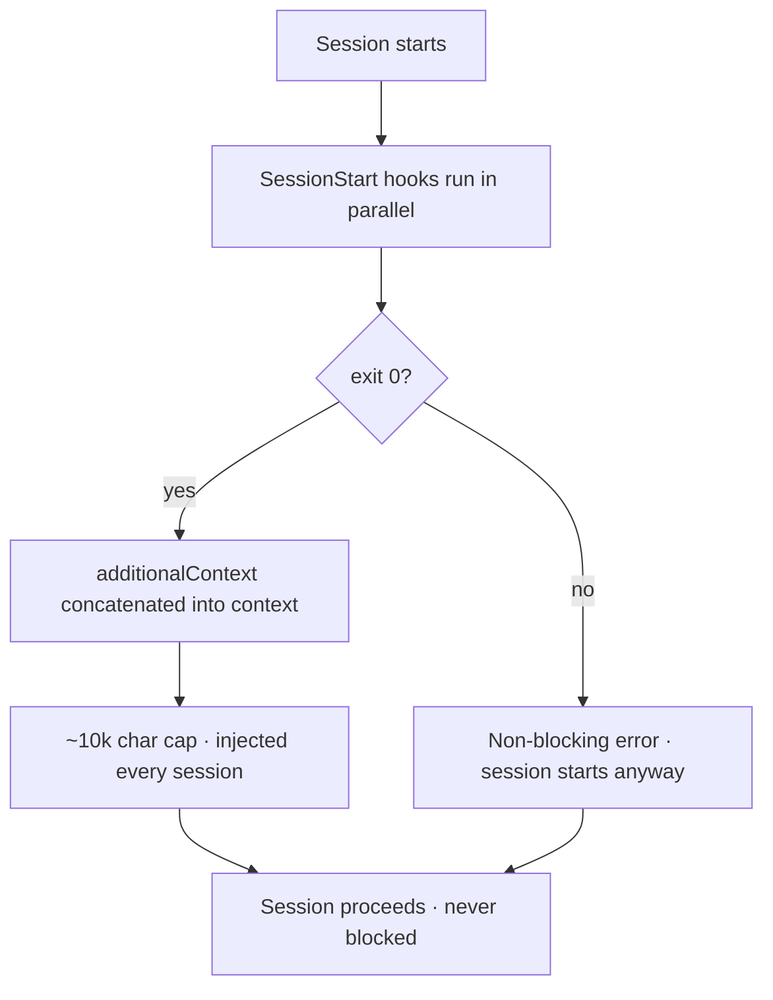
```mermaid
flowchart TD
  S[Session starts] --> H[SessionStart hooks run in parallel]
  H --> EX{exit 0?}
  EX -- no --> SKIP[Non-blocking error · session starts anyway]
  EX -- yes --> ADD[additionalContext concatenated into context]
  ADD --> CAP[~10k char cap · injected every session]
  CAP --> GO[Session proceeds · never blocked]
  SKIP --> GO
  class S,H,EX,SKIP,GO fact
  class ADD,CAP built
```

**See also:** Hooks: verdicts & exit codes · Capability-orientation banner

**Sources:** [Hooks reference](https://code.claude.com/docs/en/hooks)

_Last verified: 2026-05-26_


---


## Security

### Comfort-posture dashboard · _RavenClaude-built_

> A point-and-click editor that writes Claude Code permission rules per category and layer — and keeps design check-ins independent of permission level.

**Comfort posture** is RavenClaude's friendly front-end over the raw permission model. Instead of hand-editing `settings.json`, you set a level — **deny / ask / allow** — per *category* of action (file reads, code execution, remote mutations, …) and per *layer* (user / local / project). The dashboard's Settings tab serializes that to `.ravenclaude/comfort-posture.yaml`, and `apply-comfort-posture.py` translates it into the actual Claude Code permission rules — so the layer-precedence rules still govern what finally wins.

The load-bearing subtlety: **permission level ≠ design judgment.** Setting a category to `allow` only removes the click-to-approve on tool calls — it does **not** tell Claude to stop surfacing architectural decisions. That behavior is a *separate* flag, `design_checkins` (on by default), so relaxing permissions to move faster never silently mutes design check-ins. The two are deliberately decoupled.

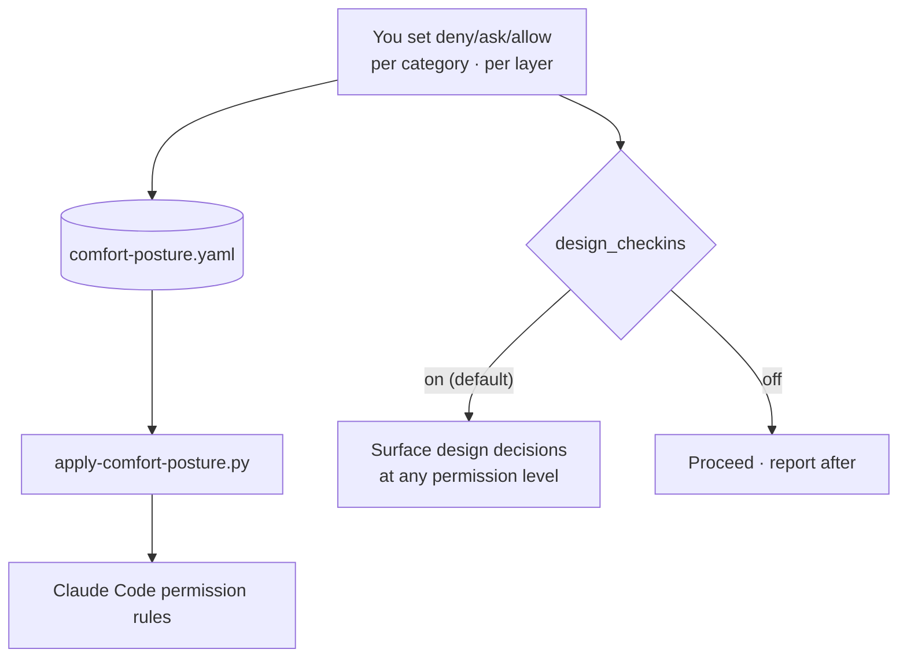
```mermaid
flowchart TD
  U[You set deny/ask/allow<br/>per category · per layer] --> Y[(comfort-posture.yaml)]
  Y --> T[apply-comfort-posture.py]
  T --> R[Claude Code permission rules]
  U --> DC{design_checkins}
  DC -- "on (default)" --> PAUSE[Surface design decisions<br/>at any permission level]
  DC -- off --> FAST[Proceed · report after]
  class Y,T,R,PAUSE,FAST built
  class DC fact
```

**See also:** Permission layers & precedence · Command-review tribunal (the Thing)

**Sources:** [ravenclaude-core constitution](plugins/ravenclaude-core/CLAUDE.md) · [apply-comfort-posture translator](plugins/ravenclaude-core/scripts/apply-comfort-posture.py)

_Last verified: 2026-05-26_


---

### Command-review tribunal (the Thing) · _RavenClaude-built_

> An opt-in panel of reviewer seats that votes ALLOW/EDIT/DENY on shell commands instead of interrupting you.

**Command review** — codename *the Thing* — is an opt-in panel of reviewer agents that adjudicates shell commands instead of stopping to ask you. It sits **on top of** comfort-posture: posture sets the policy (allow/ask/deny per category); the tribunal is the adjudicator you switch on for a category so a verdict lands in seconds.

Routing is **tiered**. Every command resolves to `low → medium → high → extreme` (its category base tier, bumped by a deterministic high/critical concern). A clean `low` read runs **no panel at all** (zero cost); seat count and the confidence bar escalate with the tier. Up to three seats run in parallel — **Forseti** (security), **Mímir** (code), **Heimdall** (injection) — with **Thor** (architect) convened only on a split.

The **`gate_floor`** knob (default `high`) is the lowest tier whose *confident ALLOW* is surfaced to you as an `ask`. DENY still blocks and EDIT still rewrites autonomously, so the tribunal pre-filters the dangerous and the fixable before either reaches you. Two hard overrides ignore the knob: **reads are never surfaced**, and **irreversible high-blast allows always are**. An abstaining panel always fails **closed**. It can never relax the `security_deny` floor.

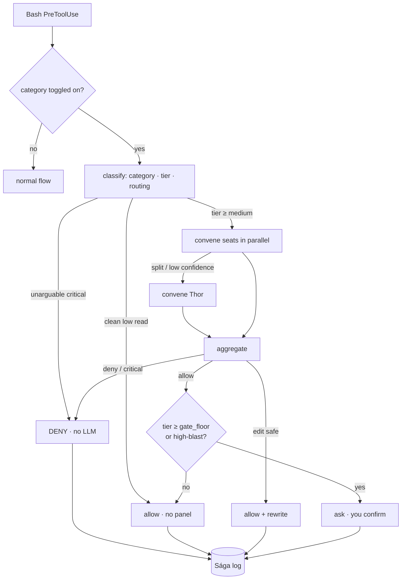
```mermaid
flowchart TD
  A[Bash PreToolUse] --> B{category toggled on?}
  B -- no --> Z[normal flow]
  B -- yes --> C[classify: category · tier · routing]
  C -- unarguable critical --> DENY[DENY · no LLM]
  C -- clean low read --> ALLOW[allow · no panel]
  C -- tier ≥ medium --> E[convene seats in parallel]
  E -- split / low confidence --> T[convene Thor]
  T --> AGG[aggregate]
  E --> AGG
  AGG -- deny / critical --> DENY
  AGG -- edit safe --> EDIT[allow + rewrite]
  AGG -- allow --> GATE{tier ≥ gate_floor<br/>or high-blast?}
  GATE -- yes --> ASK[ask · you confirm]
  GATE -- no --> ALLOW
  DENY & ALLOW & EDIT & ASK --> L[(Sága log)]
  class DENY,ALLOW,EDIT,ASK,E,T built
  class GATE fact
```

**See also:** Comfort-posture dashboard · Permission layers & precedence · Hooks: verdicts & exit codes

**Sources:** [thing skill (operating reference)](plugins/ravenclaude-core/skills/thing/SKILL.md) · [Tribunal design](docs/tribunal-review-feature-design.md)

_Last verified: 2026-05-26_


---

### The Sága audit log · _RavenClaude-built_

> Every command-review verdict writes one JSON entry — command, category, tier, per-seat votes, concerns, final verdict — under .ravenclaude/runs/thing/.

Every tribunal verdict — allow, edit, deny, or ask — writes exactly **one JSON entry** to `.ravenclaude/runs/thing/<id>.json`, the **Sága log**. The entry records the command, its category, the resolved tier, each seat's verdict, the concerns cited, the final verdict (and the revised command on an EDIT), and the duration.

This is the observability substrate: it turns an otherwise opaque "the panel decided" into an auditable trail you can read after the fact to tune the panel, the `gate_floor`, or the bypass patterns. It's **gitignored by default** — the log is local operational data, not something to commit.

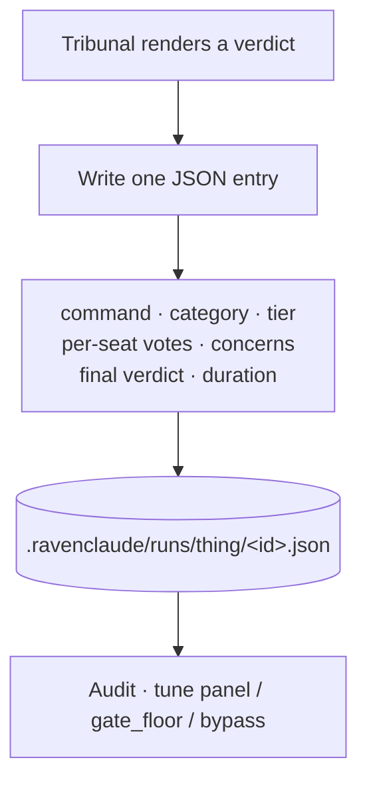
```mermaid
flowchart TD
  V[Tribunal renders a verdict] --> E[Write one JSON entry]
  E --> F[command · category · tier<br/>per-seat votes · concerns<br/>final verdict · duration]
  F --> D[(.ravenclaude/runs/thing/&lt;id&gt;.json)]
  D --> U[Audit · tune panel / gate_floor / bypass]
  class V,E,F,D,U built
```

**See also:** Command-review tribunal (the Thing) · Model diversity on the panel

**Sources:** [thing skill (operating reference)](plugins/ravenclaude-core/skills/thing/SKILL.md)

_Last verified: 2026-05-26_


---

### Model diversity on the panel · _RavenClaude-built_

> When ≥2 reviewer seats convene, the tribunal guarantees ≥2 distinct model backbones run — so one model's blind spot can't pass the whole panel.

A panel of reviewers is only as strong as its diversity. If every seat runs on the same model, a single model's blind spot — a shared hallucination or a class of injection it doesn't catch — can pass the **whole** panel unnoticed. That's the **anti-correlated-hallucination** failure mode.

So the engine enforces a **model-diversity rule**: whenever **two or more seats convene, at least two distinct model backbones run**. If a `panel:` config override happens to collapse the seats onto one model, the engine **auto-reassigns one seat to a different, equal-or-stronger model** rather than letting a monoculture review the command. It's proven by Gate 22.

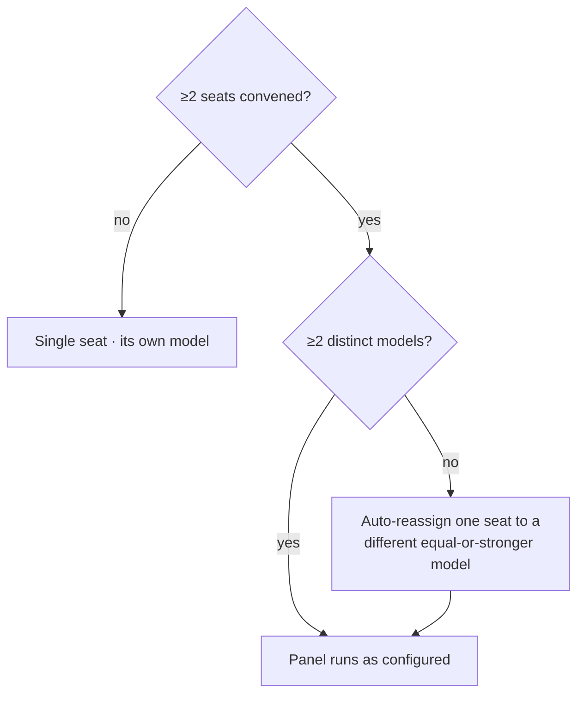
```mermaid
flowchart TD
  P{≥2 seats convened?} -- no --> ONE[Single seat · its own model]
  P -- yes --> CHK{≥2 distinct models?}
  CHK -- yes --> OK[Panel runs as configured]
  CHK -- no --> RE[Auto-reassign one seat to a<br/>different equal-or-stronger model]
  RE --> OK
  class P,CHK fact
  class ONE,OK,RE built
```

**See also:** Command-review tribunal (the Thing)

**Sources:** [ravenclaude-core constitution](plugins/ravenclaude-core/CLAUDE.md) · [Tribunal assessment & improvement plan](docs/tribunal-assessment-and-improvement-plan.md)

_Last verified: 2026-05-26_


---

### Decision-review tribunal · _RavenClaude-built_

> A sibling tribunal votes yes/no/defer on yes-or-no DECISIONS before they reach you — binding only if you opt in, and high-blast calls always defer.

The command-review tribunal adjudicates *shell commands*; the **decision-review** tribunal adjudicates *yes/no decisions* — the kind an agent would otherwise interrupt you with. The `decision-review` skill convenes the same seats on a yes/no question (engine: `thing-decide.py`) and returns **`yes` / `no` / `defer`**. A binding yes/no is acted on without pausing you; a `defer` asks you. The panel defers genuine preferences, low-confidence or split calls, and anything high-blast.

Two guardrails: **high-blast / irreversible decisions never auto-resolve** — force-push, deletes, prod actions, the `security_deny` family always `defer` to you, regardless of mode. And the mode knob `decision_review: off | advisory | binding` is **off by default**, so nothing is auto-decided unless you opt in. (The seats run via `claude -p`; without it the panel abstains and fails safe to `defer`.) After each PR, a retrospective routes the PR's decisions through the same panel and logs the verdicts.

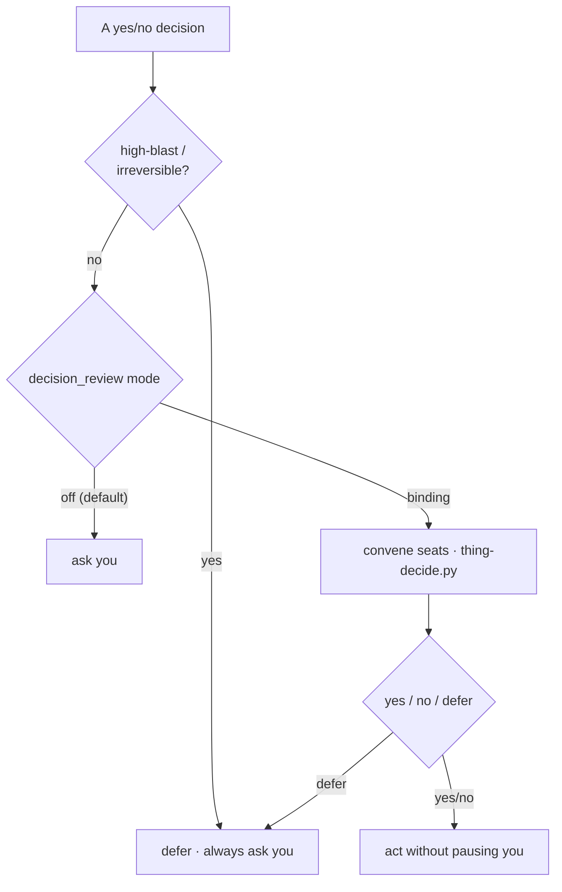
```mermaid
flowchart TD
  Q[A yes/no decision] --> HB{high-blast /<br/>irreversible?}
  HB -- yes --> DEFER[defer · always ask you]
  HB -- no --> MODE{decision_review mode}
  MODE -- "off (default)" --> ASK[ask you]
  MODE -- "binding" --> PANEL[convene seats · thing-decide.py]
  PANEL --> V{yes / no / defer}
  V -- yes/no --> ACT[act without pausing you]
  V -- defer --> DEFER
  class Q,HB,MODE fact
  class DEFER,ASK,PANEL,V,ACT built
```

**See also:** Command-review tribunal (the Thing) · Model diversity on the panel

**Sources:** [Post-PR decision review](docs/post-pr-decision-review.md) · [ravenclaude-core constitution](plugins/ravenclaude-core/CLAUDE.md)

_Last verified: 2026-05-26_


---


## Orientation & capability

### Capability-orientation banner · _RavenClaude-built_

> A SessionStart hook injects what the project touches, the auth it holds (names only), and the effective permissions — so the agent never acts as if it has no access.

The `capability-orientation.sh` SessionStart hook assembles a **capability banner** and injects it via `additionalContext` every session. It states the project's detected external surface, the auth it holds (env-var **names/presence only — never values; no network calls**), the effective `.claude/settings.json` permissions, and a presence/staleness summary of `environment-context.md`.

Why it exists: the behavioral instruction "read the posture at session start" is prose the model often skips. The hook makes the summary impossible to miss. Crucially, it is a **salience boost, not enforcement** — the real gate is the permission rules; the banner just stops the agent acting as if it has no access (the "did you try X?" round-trip on actions it's already authorized for). The banner is a *pointer*; `environment-context.md` stays the authoritative source for per-environment detail.

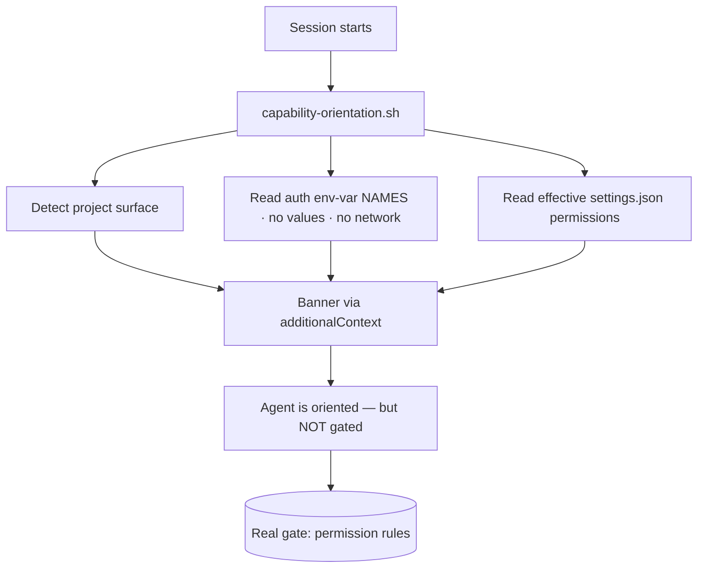
```mermaid
flowchart TD
  S[Session starts] --> H[capability-orientation.sh]
  H --> R1[Detect project surface]
  H --> R2[Read auth env-var NAMES · no values · no network]
  H --> R3[Read effective settings.json permissions]
  R1 & R2 & R3 --> B[Banner via additionalContext]
  B --> A[Agent is oriented — but NOT gated]
  A --> G[(Real gate: permission rules)]
  class S,H,R1,R2,R3 built
  class B,A built
  class G fact
```

**See also:** SessionStart context injection · Comfort-posture dashboard

**Sources:** [ravenclaude-core constitution](plugins/ravenclaude-core/CLAUDE.md) · [Claude Code permissions (SessionStart)](plugins/ravenclaude-core/knowledge/claude-code-permissions.md)

_Last verified: 2026-05-26_


---

### Environment context & discovery · _RavenClaude-built_

> An optional file maps which environments your creds reach and what's pre-authorized — so the agent acts without asking where allowed, and stops on forbidden actions.

`.ravenclaude/environment-context.md` (at the **consumer's** project root, optional) records each environment (DEV / TEST / PROD / named), its role, its **pre-authorized action categories**, and a **forbidden** list. The Capability Grounding Protocol does a **pre-action check** against it: if the current environment pre-authorizes the action category, the agent **executes without asking** (no "did you try X?" round-trip); if the action is forbidden, it **stops** for explicit confirmation regardless of role; if the file is silent, it falls through to alternate-methods enumeration.

When the file is absent, the agent offers the **environment-discovery** skill instead of asking you to fill in a template by hand — it probes installed CLIs read-only, decodes any acquired JWTs, and drafts the file for you to save/edit/skip. Discovery never runs without confirmation, is read-only by contract, and **never writes credentials** (those live in env vars / Key Vault; the file holds posture, not secrets).

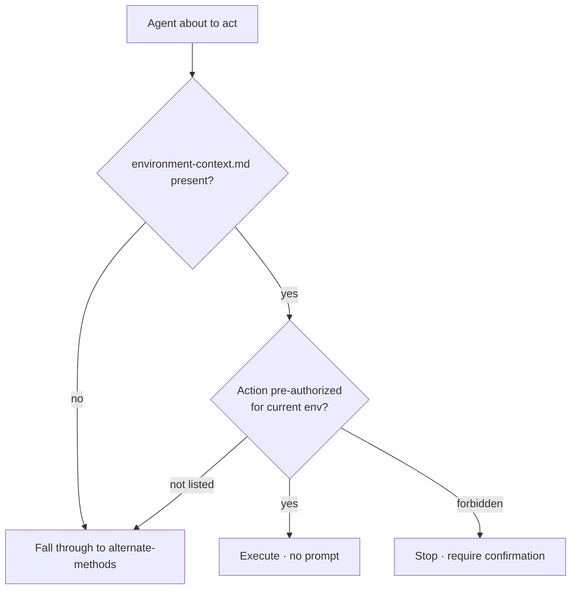
```mermaid
flowchart TD
  ACT[Agent about to act] --> F{environment-context.md present?}
  F -- no --> ALT[Fall through to alternate-methods]
  F -- yes --> CAT{Action pre-authorized<br/>for current env?}
  CAT -- yes --> RUN[Execute · no prompt]
  CAT -- forbidden --> STOP[Stop · require confirmation]
  CAT -- "not listed" --> ALT
  class ACT,F,CAT fact
  class ALT,RUN,STOP built
```

**See also:** Capability-orientation banner · Decision trees in knowledge files

**Sources:** [ravenclaude-core constitution](plugins/ravenclaude-core/CLAUDE.md) · [environment-context template](plugins/ravenclaude-core/templates/environment-context.md)

_Last verified: 2026-05-26_


---

### Decision trees in knowledge files · _RavenClaude-built_

> Knowledge files carry Mermaid decision trees the agent traverses BEFORE picking a method — preventing wrong-branch-from-the-start, with a mandatory staleness date.

When a knowledge file contains a `## Decision Tree: <Domain>` section, the agent must **traverse the Mermaid graph top-to-bottom before selecting a method** — resolving each condition node against the user's actual context (not keyword-matching the request), defaulting to the **leaf with the smaller blast radius**, and escalating to a higher-blast leaf only after the smaller one demonstrably fails.

This closes the **wrong-branch-from-the-start** failure mode (the agent picks the wrong method on the first try because the branches weren't visible). It composes with alternate-methods enumeration (which handles "method failed, try the next") and the environment-context check (which handles "I'm already authorized"). Every diagram-bearing knowledge file carries a mandatory **`last-verified` date**, and the Researcher's sweep flags any tree older than 90 days — the same discipline these Learn concepts follow.

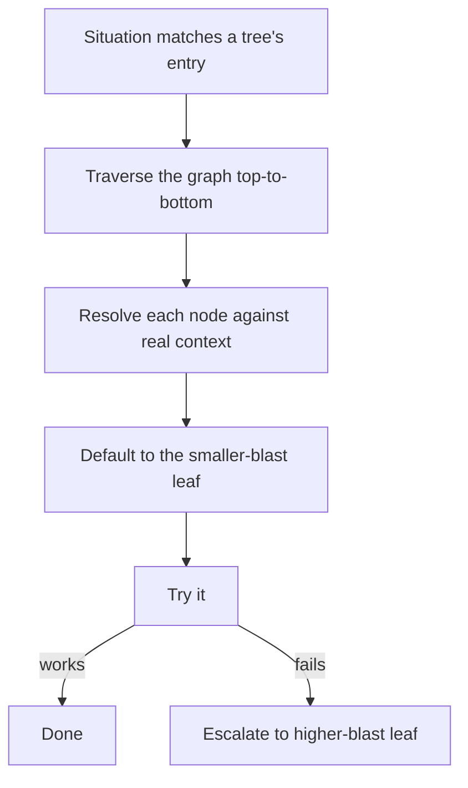
```mermaid
flowchart TD
  SIT[Situation matches a tree's entry] --> TRAV[Traverse the graph top-to-bottom]
  TRAV --> RES[Resolve each node against real context]
  RES --> LEAF[Default to the smaller-blast leaf]
  LEAF --> TRY[Try it]
  TRY -- works --> DONE[Done]
  TRY -- fails --> ESC[Escalate to higher-blast leaf]
  class SIT,TRAV,RES,LEAF,TRY,ESC,DONE built
```

**See also:** Environment context & discovery

**Sources:** [Decision trees in knowledge files](docs/best-practices/decision-trees-in-knowledge-files.md) · [ravenclaude-core constitution](plugins/ravenclaude-core/CLAUDE.md)

_Last verified: 2026-05-26_


---


## Marketplace engineering

### Layout enforcement · _RavenClaude-built_

> A PreToolUse hook plus a CI backstop block off-pattern file creation against .repo-layout.json — because path-scoped rule files load on Read, not Write.

`hooks/enforce-layout.sh` runs `PreToolUse` on `Write|Edit|MultiEdit`: it reads `.repo-layout.json`, matches the target path against `allowed_globs`, and **denies an off-pattern write with a suggested correct location**. If the manifest is absent it silently allows everything — so consumers who install the plugin without a layout manifest aren't surprised.

Why a hook **and** CI: Claude Code issue #23478 confirms that path-scoped rule files (`paths:` frontmatter) load only on **Read**, not on **Write** — they cannot prevent off-pattern file *creation*. So the in-loop hook gives fast feedback during a session (Claude only), and `.github/workflows/validate-layout.yml` is the **cross-tool backstop** that catches direct human commits, Cursor/Codex/Aider edits, and any case where the hook didn't fire.

```mermaid
flowchart TD
  W[Write / Edit / MultiEdit] --> H[enforce-layout.sh · PreToolUse]
  H --> M{path matches an<br/>allowed_glob?}
  M -- yes --> OK[allow]
  M -- no --> DENY[deny + suggest correct path]
  PR[Any commit · any tool] --> CI[validate-layout.yml]
  CI --> CIM{matches allow-list?}
  CIM -- no --> FAIL[CI fails]
  CIM -- yes --> PASS[CI passes]
  class W,H,M,PR fact
  class OK,DENY,CI,CIM,FAIL,PASS built
```

**See also:** The gate-audit meta-test · Hooks: verdicts & exit codes

**Sources:** [AGENTS.md — Layout & boundary rules](AGENTS.md) · [Claude Code issue #23478](https://github.com/anthropics/claude-code/issues/23478)

_Last verified: 2026-05-26_


---

### The gate-audit meta-test · _RavenClaude-built_

> Every CI gate is itself tested: audit-gates.sh proves each gate FAILS on a known-bad fixture and PASSES on a known-good one — so a gate can't silently rot into a no-op.

A CI gate that never fails is worse than no gate — it gives false confidence. So RavenClaude runs a **meta-test**: `scripts/audit-gates.sh` proves, for each gate, that it **fails on a known-bad fixture AND passes on a known-good one**. If a gate can't be made to fail on input it's supposed to reject, the gate is broken and the audit says so.

This is required reading before adding or changing any CI step — a new gate ships with its fail/pass fixtures, not just its happy path. And **a skip is not a pass**: when a gate can't run locally (e.g. the actionlint gate needs a Docker daemon), it **loudly** skips ("THIS IS NOT A PASS"), and in CI an unrunnable gate is a hard failure, never a silent skip.

```mermaid
flowchart TD
  G[For each CI gate] --> BAD[Run it on a known-BAD fixture]
  BAD --> FB{does it FAIL?}
  FB -- no --> BROKEN[Gate is broken · audit fails]
  FB -- yes --> GOOD[Run it on a known-GOOD fixture]
  GOOD --> FG{does it PASS?}
  FG -- no --> BROKEN
  FG -- yes --> TRUST[Gate trusted]
  class G,BAD,FB,GOOD,FG built
  class BROKEN built
  class TRUST built
```

**See also:** Layout enforcement

**Sources:** [CI gate audit](docs/best-practices/ci-gate-audit.md) · [AGENTS.md — Testing instructions](AGENTS.md)

_Last verified: 2026-05-26_


---

### GitHub Copilot CLI bridge · _RavenClaude-built_

> RavenClaude runs under GitHub Copilot CLI too — via a generated package + a hook adapter — and updating is just `git pull`, never a re-install.

Copilot CLI is itself a plugin host with the same lifecycle events (SessionStart / PreToolUse / …), Agent Skills, AGENTS.md, and MCP — so most of the plugin ports. Three pieces make it work: `generate-copilot-plugin.py` **projects** the canonical plugin into a Copilot package (generated, never hand-maintained, `--check`-gated like the dashboard); a **hook adapter** translates the I/O envelopes so the *unmodified* hook scripts run under Copilot (mapping its `toolName`/`toolArgs` ⇄ Claude's `tool_name`/`tool_input`, and the verdict shapes); and **enforcement hooks ship repo-level** in `.github/hooks/` because a Copilot bug stops plugin-level `preToolUse` hooks from firing.

The design pillar is **frictionless updates**: instead of Copilot's re-install-to-update flow, the plugin loads **live** via `copilot --plugin-dir copilot/`, so an update is just **`git pull`** (`ravenclaude update`). No re-install, ever.

```mermaid
flowchart TD
  CANON[Canonical plugin] --> GEN[generate-copilot-plugin.py]
  GEN --> PKG[copilot/ package · --check gated]
  CO[Copilot PreToolUse envelope] --> AD[hook adapter]
  AD --> CL[unmodified hook scripts]
  CL --> AD
  UP[Update] --> PULL[git pull · loads live]
  class CANON,GEN,PKG,AD,CL,UP,PULL built
  class CO fact
```

**See also:** Layout enforcement · Hooks: verdicts & exit codes

**Sources:** [ravenclaude-core constitution](plugins/ravenclaude-core/CLAUDE.md) · [generate-copilot-plugin.py](scripts/generate-copilot-plugin.py)

_Last verified: 2026-05-26_


---
