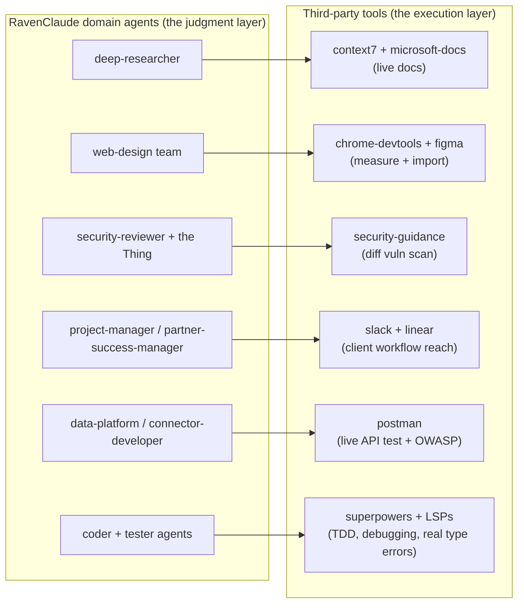

# RavenClaude — Comprehensive Gap Analysis

**Date:** 2026-05-28
**Author:** Claude Code (4-agent sweep: structural, knowledge/freshness, third-party overlap) + Team Lead synthesis
**Audience:** Matt, working ON the marketplace.
**Scope:** All 8 RavenClaude plugins + the ~22 third-party Claude Code plugins just installed.
**Method:** Read-only audit of the working tree. Cross-checked the load-bearing claims (broken links, stale versions) against disk by hand.

> **⚠️ RECONCILIATION (2026-05-28, post red-team) — read this first.** This audit was run against a working tree that is **18 commits behind `origin/main`** and **missing 3 entire plugins** (`microsoft-fabric`, `claude-app-engineering`, `azure-cloud` — the marketplace has **11** plugins on main, not the 8 audited here). Verification against `origin/main` shows most of Part A's internal findings are **ALREADY FIXED upstream**: the 10 broken `scenario-retrieval.md` links (FIXED), the `grounding-protocol` link (FIXED), the stale `architecture.md` status table (FIXED — rewritten, all 11 plugins listed), `applied-statistics` missing from architecture.md (FIXED), and the README "5 hooks" rot (FIXED → "22 skills, 11 hooks"). **Still open on `origin/main`:** power-platform `hooks.json` absent, 2 uncovered `.repo-layout.json` globs, vestigial `requires:` floors, and the 2026-08-19 knowledge-freshness cliff. Treat Part A below as a snapshot of a stale checkout; the live gap list and the remediation plan are maintained in [`gap-closure-plan-2026-05-28.md`](./gap-closure-plan-2026-05-28.md). Part B (strategic/third-party) is largely unaffected but should absorb the red-team's client-data-egress and per-tool-behavior-testing cautions.

---

## 1. Executive summary

Two questions, two answers.

**"Is the marketplace internally healthy?"** — Mostly yes. The CI-gated disciplines (version sync between `plugin.json` and `marketplace.json`, required files, scenario-authoring frontmatter) are **clean across all 8 plugins**. The problems are all in the *un-gated* corners: a documentation file that silently rotted, a batch of broken doc links left over from a skill migration, and one plugin missing a hook manifest. None of these break a consumer install; all are cheap to fix.

**"Now that I've installed 22 third-party plugins, what changes?"** — The strategic finding is clean and a little surprising: **almost nothing here is a true duplicate that should replace a RavenClaude asset.** The one genuine head-to-head (the stock `code-review` command vs. your command-review tribunal, "the Thing") is won by RavenClaude. The third-party value is overwhelmingly *capabilities your agents currently advise on but cannot execute* — live documentation lookup, real browser performance measurement, Figma import, external integrations (Slack/Linear/Postman/GitHub), real type-checking, and disciplined workflow primitives. **The move is to make your domain agents the orchestrators that call these tools — not to absorb, rebuild, or be replaced by them.**

The integration model in one picture:

---

## 2. Part A — Internal health audit

### 2.1 Scorecard

| Dimension | Verdict | Severity |
|---|---|---|
| `plugin.json` ↔ `marketplace.json` version sync (CI-gated) | **Clean** — 0 mismatches across 8 plugins | — |
| Required files (`plugin.json` / `README.md` / `CLAUDE.md`) | **Clean** — all 8 pass | — |
| Scenario-authoring frontmatter (all 55 agents) | **Clean** — 100% (14/14, 11/11, 7/7, 7/7, 6/6, 6/6, 4/4, 1/1) | — |
| `docs/architecture.md` status table | **Badly stale** — every version wrong; 2 plugins absent | **High** |
| Intra-repo doc links | **11 broken** across 6 CLAUDE.md files | **High** |
| `hooks.json` parity | **power-platform missing it** — its hook is inert on install | **Medium** |
| `.repo-layout.json` glob coverage | **2 uncovered paths** in power-platform | **Medium** |
| Knowledge-layer depth | **Imbalanced** — 3 plugins are skill-heavy / knowledge-light | **Medium** |
| Knowledge freshness | **No file stale yet**, but a ~25-file cliff lands ~2026-08-19 | **Medium (forward)** |
| Scenario banks | **Live in power-platform only**; skill is a no-op elsewhere (by design) | **Low** |

### 2.2 The high-severity items

**`docs/architecture.md` status table is comprehensively stale (line 193+).** Every listed version is wrong — `ravenclaude-core` shows `0.7.0` (actually `0.48.0`), `power-platform` `0.9.0` (actually `0.13.0`), `finance` `0.2.0` (`0.5.2`), `regulatory-compliance` `0.2.0` (`0.4.2`), `web-design` `0.3.0` (`0.4.3`), `edtech-partner-success` `0.1.0` (`0.5.2`). The core row says "5 hooks" (you now ship 10+ plus the orchestrator). **`data-platform` and `applied-statistics` are absent from the table entirely**, and the "Planned plugins" line still names only Salesforce. This is the marketplace's canonical inventory doc and it isn't CI-gated, so it rots silently. *Verified by hand.*

**11 broken doc links from the skill-format migration.** Two root causes, both matching the unfixed follow-ups in memory:
- *Cause A (10 links):* `../../ravenclaude-core/skills/scenario-retrieval.md` — the skill was migrated to the directory form (`scenario-retrieval/SKILL.md`), but 5 plugins' CLAUDE.md still point at the dead flat file (2 links each in `data-platform`, `edtech-partner-success`, `finance`, `regulatory-compliance`, `web-design`). Correct target: `…/scenario-retrieval/SKILL.md`.
- *Cause B (1 link):* `web-design/CLAUDE.md:241` → `../ravenclaude-core/skills/grounding-protocol` — that skill only exists in `power-platform`, not `ravenclaude-core`. (Line 101 in the same file points at the correct power-platform path, so just line 241 is wrong.)

*Both verified by hand.* Anyone following the "enable your scenarios bank" instructions hits a dead link today.

### 2.3 The medium-severity items

- **power-platform ships a hook script (`check-house-opinions.sh`) but no `hooks.json`.** The other 7 plugins all auto-register their advisory hook on `/plugin install`; power-platform's tells the consumer to hand-wire it into `.claude/settings.json`. So its house-opinions hook is **silently inert** on a normal install — a real parity break for your most-used domain plugin.
- **2 uncovered `.repo-layout.json` paths**, both in power-platform: `NOTICE.md` (the pbix-mcp MIT attribution) and `portable/**`. Both files are already committed so CI (added-files-only) isn't red — but the local `enforce-layout.sh` hook would **block any new file** added under `portable/`, and it violates the documented allow-list discipline.
- **Knowledge layer is imbalanced.** `edtech-partner-success` (16) and `data-platform` (13) are deep; `finance`, `regulatory-compliance`, and `web-design` have **1 knowledge file each** against 9 substantial skills. These three are *skill-heavy / knowledge-light*, not half-finished — the single knowledge doc each carries is genuinely good (decision-tree-driven, cited, dated), and the domain depth lives in the skills + agents. But each is one engagement away from needing a 2nd–3rd knowledge file.
- **Freshness cliff ~2026-08-19.** Every knowledge file is dated (good discipline — none are undated), but ~25 of them cluster at `2026-05-21`, much of it volatile vendor pricing (Supabase, Cube, Metabase, Khanmigo, ChurnZero). They'll all cross the ~90-day re-verification window within days of each other in mid-August. Plan a *batched* re-verification of the volatile-pricing files before then rather than letting them expire all at once.

### 2.4 Notes (low severity / informational)

- **Scenario banks** are live only in `power-platform` (4 scenarios). The other 7 plugins reference the `scenario-retrieval` skill but defer the bank until the first real engagement surfaces via `/wrap` — by design, but it means the skill is a no-op everywhere else.
- **applied-statistics** is a complete-but-small plugin (v0.1.0, 1 agent, 5 skills, 5 knowledge files, hook + `hooks.json`), well-integrated with a real seam into `data-platform` ("is this metric movement real or noise?"). Its only gap: it's missing from `docs/architecture.md` (same doc as the staleness issue above).

---

## 3. Part B — Strategic / third-party overlap

### 3.1 The core insight

Map the 22 installed plugins against your capabilities and they fall into three buckets:

- **True duplicate you already beat (1):** the stock `code-review` command is a confidence-gated multi-seat review panel — the same pattern as the Thing, but yours is posture-aware, issues EDIT verdicts, and keeps an audit trail. *Keep yours; don't route PR review through the stock command.*
- **Capabilities you advise on but can't execute (the majority):** live docs, live browser measurement, Figma import, external integrations, real type-checking, workflow primitives. *These are the prize.*
- **Out of scope for the business (a few):** `ralph-loop`, `imessage`, `playground`.

### 3.2 Overlap / redundancy matrix

| Third-party | Overlapping RavenClaude asset | Strength | Decision |
|---|---|---|---|
| superpowers (TDD, debugging, verification, plans) | tester-qa, code-reviewer, run-full-test-suite | PARTIAL | **Adopt as workflow substrate.** You have no dedicated TDD / systematic-debugging / verification-before-completion skill — pure gaps. Keep your agents as domain *roles* that invoke these. |
| superpowers (worktrees, parallel dispatch) | new-worktree, spawn-team | PARTIAL | **Keep yours** — more opinionated (team routing, `.claude/worktrees` convention). Borrow the parallel-dispatch discipline as a referenced prior. |
| skill-creator / superpowers `writing-skills` | prompt-engineer, agent-quality-rubric | PARTIAL | **Keep yours.** But use skill-creator's *eval / variance harness* to test trigger descriptions — a genuine gap. |
| code-review (command) | code-reviewer, the Thing | DUPLICATE | **Keep yours** — strictly more capable. |
| code-simplifier | code-reviewer | COMPLEMENTARY | **Adopt** as a post-review clarity pass. You review; you don't rewrite-for-clarity. |
| claude-md-management | init-agent-ready | COMPLEMENTARY | init-agent-ready *creates* boundary files; this *maintains* them. **Adopt the `revise-claude-md` loop** — you lack the maintenance half. |
| commit-commands + github | create-pr | PARTIAL | **Keep create-pr** (posture/tribunal-aware). Adopt `clean_gone` (worktree hygiene) + github MCP for richer PR/issue ops. |
| context7 + microsoft-docs + firecrawl | deep-researcher, researcher | COMPLEMENTARY | **Highest-value integration.** Gives the researcher live primary sources instead of training data. Keep deep-researcher as orchestrator. |
| figma + frontend-design | web-design (visual-designer, frontend-implementer) | PARTIAL | You have Fluent/token discipline but **no Figma import and no aesthetic-quality rubric.** Adopt both; keep your token discipline. |
| chrome-devtools-mcp | performance-engineer, core-web-vitals-tuning, accessibility-review | DUPLICATE (the *measurement*) | You *advise*; it *measures* live. **Wire it in** — turns advice into evidence. Keep the skills as the playbook. |
| postman | connector-developer, connector-configuration | COMPLEMENTARY | You document auth/rate-limits; it *tests the live API* + OWASP-API audit + agent-readiness score. **Adopt for connector work.** |
| stripe | finance, data-platform Stripe connector | PARTIAL | Yours is ELT-ingestion-focused; theirs is API-integration/error/upgrade. **Keep both, route by intent.** |
| security-guidance | security-reviewer, the Thing | PARTIAL | The Thing gates *commands*; this scans *code diffs* for vuln patterns + cross-file flow (IDOR/SSRF/auth-bypass). **Adopt** — you have no automated diff-level vuln scanner. |
| linear + slack | project-manager, partner-success-manager | COMPLEMENTARY | Pure capability add — your PM/PSM agents have no issue-tracker or Slack reach. **Adopt both.** |
| LSP group (pyright, typescript, csharp, rust, clangd) | coder agents, tester-qa | COMPLEMENTARY | Ground-truth type errors. **Install pyright + typescript** (your stack); skip the rest. |
| remember | MEMORY.md / user-memory convention | PARTIAL | Automates what you do manually but adds a *second* memory system. **Hold — pilot before adopting** (risk of dueling memory). |
| ralph-loop | (none) | — | **Skip** — autonomous-iteration loop collides with your human-in-loop posture. |
| imessage / playground | (none) | — | **Skip** — out of business scope. |

### 3.3 Integration opportunities, ranked by value to a solo consultant

1. **deep-researcher → context7 + microsoft-docs (+ firecrawl).** Live docs instead of training data. Directly serves your "fact-check researcher output against primary sources" rule, and MS Learn is *authoritative* for the Power Platform plugin's Dataverse/Power Apps claims. Highest leverage, lowest risk.
2. **web-design → chrome-devtools (measure CWV/a11y) + figma (import) + frontend-design (quality bar).** Turns the active marketing-site build from advice into measured evidence + real design import. Direct revenue impact.
3. **Adopt superpowers as the workflow layer.** Wire TDD, systematic-debugging, and verification-before-completion into tester-qa and the coder agents. `verification-before-completion` reinforces your "evidence before claims" discipline and the `run-full-test-suite` gate.
4. **security-reviewer → security-guidance** for automated diff/commit vuln scanning; keep the Thing for command gating. Two distinct layers, no conflict.
5. **project-manager → linear; partner-success-manager → slack.** Real reach into client workflows (`standup`, `channel-digest`, issue ops).
6. **connector-developer / data-platform → postman** for live API testing + OWASP-API audit on every connector.
7. **code-reviewer → code-simplifier** (post-review clarity); **cleanup-worktrees → commit-commands `clean_gone`**; **init-agent-ready → claude-md-management `revise-claude-md`** (the maintenance half).
8. **Install pyright-lsp + typescript-lsp** so coder/tester agents get ground-truth type errors.

### 3.4 The portability constraint (important)

These 22 plugins are installed in *your* environment, not bundled inside RavenClaude. A consumer who runs `/plugin install ravenclaude-core@ravenclaude` won't have them. So any wiring you add to RavenClaude agent prompts must be a **soft, use-if-available reference** ("if the `context7` MCP is available, prefer it for live docs; otherwise fall back to training data + the fact-check discipline"), never a hard dependency. This keeps `ravenclaude-core` domain-neutral and the domain plugins portable — the house rule still holds.

---

## 4. Part C — Prioritized action queue

### Quick wins (un-gated hygiene — minutes each, fix together in one `chore/` PR)

1. Fix the 10 broken `scenario-retrieval.md` links → `…/scenario-retrieval/SKILL.md` (5 plugins, 2 links each).
2. Fix the 1 broken `grounding-protocol` link at `web-design/CLAUDE.md:241`.
3. Refresh the `docs/architecture.md` status table: correct all 6 versions, add `data-platform` + `applied-statistics` rows, fix the "5 hooks" count, update the mermaid agent counts, and update the "Planned plugins" line.
4. Add a `hooks.json` to `power-platform` so its house-opinions hook auto-registers (parity with the other 7).
5. Add `.repo-layout.json` globs for `plugins/*/NOTICE.md` and `plugins/*/portable/**`.

> These are docs/manifest changes that ship inside `plugins/` or touch boundary files → they go through a small PR (not docs-only). Items 1–2 and the architecture refresh clear the exact follow-ups already recorded in memory.

### Medium (this month)

6. Schedule a **batched re-verification** of the ~25 volatile-pricing knowledge files before the ~2026-08-19 freshness cliff.
7. Grow the knowledge layer of `finance` / `regulatory-compliance` / `web-design` — one obvious 2nd file each (e.g. finance: accrual-reversal/cutoff patterns; regulatory: sanctions-list-version discipline; web-design: token/theming reference).
8. Normalize `data-platform`'s inline `as of 2026-05-21` date stamps to the standard `Last reviewed:` header so the staleness sweep parses them uniformly.

### Strategic (decisions for you — each is a small prompt-edit PR per agent)

9. Wire the **soft, use-if-available** third-party references into the agents in §3.3 order — start with deep-researcher (context7/ms-docs) and the web-design team (chrome-devtools/figma), since both serve active work.
10. Adopt superpowers' workflow skills as referenced priors in tester-qa + coder agents.
11. Decide on `security-guidance` (adopt), `linear`/`slack` for PM/PSM (adopt), `postman` for connectors (adopt), `code-simplifier`/`clean_gone`/`revise-claude-md` (adopt), pyright+typescript LSPs (install).
12. **Skip** ralph-loop / imessage / playground. **Hold + pilot** `remember` before adopting (dueling-memory risk with your existing MEMORY.md discipline).

---

## 5. What this analysis deliberately doesn't do

- **Doesn't fix anything.** Read-only sweep. The quick-win fixes are scoped above for a follow-up PR once you've pulled fresh `main`.
- **Doesn't recommend replacing any RavenClaude asset with a third-party one.** The only near-duplicate (the Thing vs. stock `code-review`) is won by RavenClaude.
- **Doesn't propose new plugins.** That's the job of `plugin-roadmap-analysis.md` (which itself needs a refresh — it predates `data-platform`, `edtech-partner-success`, and `applied-statistics` shipping).

## See also

- [`plugin-roadmap-analysis.md`](./plugin-roadmap-analysis.md) — the earlier "which plugins to build" analysis (now itself stale; doesn't know about the 3 newest plugins).
- [`architecture.md`](./architecture.md) — the marketplace structure doc whose status table this analysis flags as stale.
