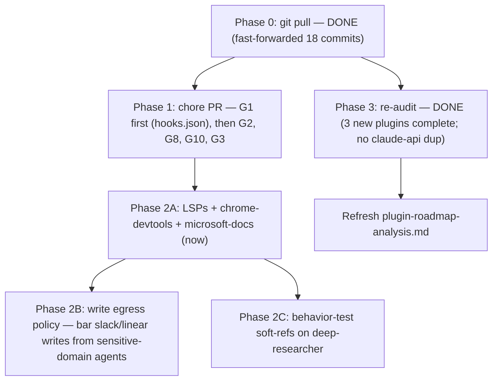

# RavenClaude — Gap-Closure Plan

**Date:** 2026-05-28
**Author:** Claude Code — synthesis of the gap analysis ([`gap-analysis-2026-05-28.md`](./gap-analysis-2026-05-28.md)) + an independent red-team pass + hand-verification against `origin/main`.
**Status:** Plan for review. Nothing has been changed in the plugins.

> **Why this plan supersedes the raw analysis.** The gap analysis was run on a checkout **18 commits behind `origin/main`**, missing 3 plugins (`microsoft-fabric`, `claude-app-engineering`, `azure-cloud`). A red-team review then challenged the recommendations, and I re-verified every load-bearing claim against `origin/main`. The result: most internal-health findings were already fixed upstream, the red-team was right about the strategic risks but wrong about the staleness (it only checked the working tree), and the genuinely-open gap list is much shorter than the analysis implied.

---

## 0. Two-eyes re-verification on the correct tree (2026-05-28)

After fast-forwarding onto `origin/main` (11 plugins), **two independent auditors** re-checked the gap list by answering the same 6 load-bearing questions. They **corroborated each other on every answer** — no genuine contradiction surfaced, so the third-agent adjudication wasn't triggered (the only divergence was completeness, not conflict: see **G8**). What changed:

- **G6 — ALREADY SHIPPED upstream (my "highest-leverage" item is done).** `validate-marketplace.yml` now runs `scripts/check-md-links.py` (relative-link checker across README/AGENTS/CLAUDE + `docs/**` + `plugins/**`), `scripts/check-marketplace-claims.py` (fails on an architecture.md plugin row missing, README "ships N plugins" drift, and skill-count drift), and `scripts/check-frontmatter.py` (scenario schema), plus a marketplace↔plugin.json version-pin cross-check, prettier, actionlint, and `audit-gates.sh`. **The doc-rot class that produced the original broken-link / stale-table findings is now gated.** *Confirmed by hand: all three scripts referenced in the workflow.*
- **The 3 new plugins (`microsoft-fabric`, `claude-app-engineering`, `azure-cloud`) are structurally complete** — required files present, in `marketplace.json` + `architecture.md`, all 21 agents carry scenario-authoring frontmatter, all ship `hooks.json`. No structural debt; Phase 3's "re-audit" is essentially done.
- **`claude-app-engineering` does NOT duplicate the third-party `claude-api` skill or `core/prompt-engineer`** — distinct lanes (live-API behavior vs committed-artifact authoring vs quick how-to). The Phase-3 duplication worry is resolved.
- **New gaps the fresh sweep surfaced:** ~18 knowledge files carry **no** verification date (escape the staleness sweep entirely) → **G8**; and the `microsoft-fabric ↔ power-platform/power-bi-engineer` seam is **one-directional** (fabric declares it, power-bi-engineer doesn't acknowledge it back) → **G10**.
- **Non-issue:** the CHANGELOG.md asymmetry (3 new plugins have one, the other 8 don't) is **policy-blessed** — the just-pulled `AGENTS.md` §"CHANGELOG convention" explicitly says it's optional and "don't add one just to satisfy symmetry." Dropped.

---

## 1. What the red-team got right, and where I corrected it

| Red-team claim | Verdict after verification |
|---|---|
| "Soft `use-if-available` references across 14+ agents are mostly dead prose with rotting upkeep" | **Right.** Behavior-test on one agent before any rollout. |
| "Data egress to external MCP clouds (Slack/Linear/Postman/Firecrawl/Stripe/Figma/context7) is under-weighted for the sensitive-data domains" | **Right and important.** finance / regulatory-compliance / edtech / azure-cloud handle client-confidential material. Gate behind a written egress policy. |
| "Solo-operator onboarding friction — 'adopt' implies parallel adoption of 10+ MCP servers" | **Right.** Sequence ruthlessly; only LSPs + chrome-devtools + microsoft-docs are no-friction wins. |
| "'The Thing beats stock code-review' is a category error" | **Partly right.** They run on different axes (the Thing = PreToolUse command/edit gating; stock code-review = PR-diff review with `gh` comment posting). Corrected: they're *complementary*. The stock command's confidence-gated, comment-posting PR pass is a workflow RavenClaude's `code-reviewer` agent could borrow. |
| "`requires:` floors are vestigial across the domain plugins" | **Right** (verified on `origin/main`: floors are `>=0.2.0` / `>=0.5.0` / `>=0.7.0` while core is `0.49.0`). Low severity. |
| "`remember` is *already running* — 'pilot before adopting' is moot" | **Right.** Decision is now keep-or-disable, not pilot. |
| "The `0.49.0` / pull-fresh caveat is invented; don't let it delay the quick wins" | **Wrong.** The critic only checked the working tree. `origin/main` is 18 commits ahead and the cache's source commit (`2696383`, PR #119) is real. The caveat was correct and understated — and it's the single most important finding, because it makes most of the "quick wins" moot. |

---

## 2. The live gap list (verified against `origin/main`)

### Already fixed upstream — drop from the plan
- 10 broken `scenario-retrieval.md` links (all 5 plugins) — FIXED.
- `grounding-protocol` link at `web-design/CLAUDE.md` — FIXED.
- `docs/architecture.md` stale status table + missing plugins — FIXED (rewritten, all 11 plugins listed).
- README "5 hooks" rot — FIXED ("22 skills, 11 hooks").

### Still open on `origin/main` — the real targets

| # | Gap | Severity | Type |
|---|---|---|---|
| G1 | `power-platform/hooks/hooks.json` absent — its house-opinions hook is inert on install (the other 8+ plugins auto-register) | Medium | Plugin fix → PR |
| G2 | `.repo-layout.json` doesn't cover `plugins/*/NOTICE.md` or `plugins/*/portable/**` — latent block on future edits there | Medium | Manifest fix → PR |
| G3 | `requires:` floors are vestigial (`>=0.2.0`/`>=0.5.0`/`>=0.7.0` vs core `0.49.0`) — a consumer can satisfy the constraint with a core too old to actually work | Low | Manifest hygiene → PR |
| G4 | Knowledge-freshness cliff: ~31 files dated `2026-05-21` cross the 90-day window on **2026-08-19** (volatile vendor pricing) | Medium (forward) | Scheduled re-verification |
| G5 | `finance` + `regulatory-compliance` still 1 knowledge doc each (web-design grew to 7 upstream) | Low | Content → PR |
| G6 | ~~Meta: doc-rot class not CI-gated~~ | ✅ **DONE upstream** | `check-md-links.py` + `check-marketplace-claims.py` + `check-frontmatter.py` all wired into `validate-marketplace.yml` |
| G7 | Local hygiene: `.remember/` (now active, auto-saving) is not in the root `.gitignore` — latent client-data commit-leak if its nested ignore is ever removed | Low | Local config |
| G8 | ~18 knowledge files carry **no** verification date (most data-platform connector docs, ~10 edtech docs, `dataverse-token-acquisition.md`, `programmatic-flow-creation.md`, 5 core files) → they escape the staleness sweep entirely | Low-Med | Content → PR |
| G10 | `microsoft-fabric` declares a reciprocal seam with `power-platform/power-bi-engineer`, but `power-bi-engineer.md` doesn't acknowledge it back — one-directional | Low | One-line back-ref → PR |

---

## 3. The plan

### Phase 0 — Re-baseline (blocks everything)
`git pull` to fast-forward this checkout 18 commits onto `origin/main` (HEAD is 0 commits ahead, so it's a clean fast-forward — no merge, no conflict risk). Without this, any fix is authored against a stale tree and risks redundancy or conflict. **After pulling, re-confirm G1–G3 still exist** (they did as of this verification, but re-check on the fresh tree).

### Phase 1 — Close the still-open internal gaps (one `chore/` PR, ~1 sitting)
> **G6 is already done** (the rot-prevention gates ship on main), so this is now a short hygiene list, not a rescue. The highest *consumer-impact* item is G1.
1. **G1 (highest consumer impact).** Add `power-platform/hooks/hooks.json` mirroring the other 10 plugins (and the 3 new ones) so `check-house-opinions.sh` auto-registers on `/plugin install` — right now it's silently inert for every consumer of the most-mature domain plugin.
2. **G2** — add `plugins/*/NOTICE.md` and `plugins/*/portable/**` globs to `.repo-layout.json` (tracked files currently outside the allow-list; the local `enforce-layout.sh` hook blocks re-edits and a fresh re-add fails `validate-layout.yml`).
3. **G8** — backfill `Last reviewed:` dates onto the ~18 undated knowledge files so the staleness sweep can see them.
4. **G10** — add a one-line back-reference in `power-platform/agents/power-bi-engineer.md` to `microsoft-fabric`, closing the one-directional seam.
5. **G3** — bump `requires:` floors to an honest minimum (or document that they're intentionally permissive). Low priority; needs a per-plugin judgment call.
6. **G5** (optional) — add an obvious 2nd knowledge doc to finance + regulatory-compliance.

Run the full gate locally (`scripts/audit-gates.sh`, prettier `--write` then `--check`, JSON validation) before pushing — per the repo's testing discipline.

### Phase 2 — Strategic third-party integration (sequenced by risk, NOT "adopt all")

**Step A — do now (local, zero egress, high value):**
- Install **pyright-lsp + typescript-lsp** → ground-truth type errors for coder/tester agents.
- Use **chrome-devtools-mcp** for the active marketing-site build → measured Core Web Vitals + a11y instead of advice.
- Lean on **microsoft-docs** for the three Microsoft-stack plugins — `power-platform`, **`microsoft-fabric`**, **`azure-cloud`** (newly on main) → authoritative live docs. Highest payoff now that the Microsoft surface is 3 plugins.

**Step B — gate behind a written client-data egress policy (decision artifact, not code):**
- Slack, Linear, Postman, Firecrawl, Stripe, Figma, context7, security-guidance all send content to external clouds. Before wiring any into finance / regulatory-compliance / edtech / azure-cloud / microsoft-fabric work, decide **per domain** what may leave the machine. Write it once (a short `docs/` policy or a `SECURITY.md` addendum — `SECURITY.md` already discusses MCP).
- **Sharpest hazard (both auditors / the second-eyes pass): `slack` + `linear`.** They are *write-capable SaaS sinks* — an agent summarizing a regulatory finding, a client's Fabric capacity-cost breakdown, or FERPA-adjacent data into a Linear issue or Slack message is a one-call exfiltration of MNPI/PII with no scrub in between. **Recommendation: bar `slack`/`linear` write tools from finance / regulatory-compliance / edtech / azure-cloud / microsoft-fabric agents via comfort-posture (or force egress through the regulatory PII-scrub hook).** `firecrawl` (inbound injection vector) + `postman` (can replay client secrets) are second-tier; `stripe`/`figma`/`context7`/`microsoft-docs` are low-risk (read-only or non-client-data).
- Then adopt within the policy: Slack/Linear for PM/PSM on **non-sensitive** engagements only; Postman for connector testing against **non-prod** data.

**Step C — behavior-test before any prompt edits:**
- The "soft-reference a tool in an agent prompt" idea is unproven. Pilot it on **one** agent (`deep-researcher` → microsoft-docs/context7), check whether it actually changes tool-reaching behavior, and only roll out if it does. Do **not** blanket-edit 14+ agents up front.

**Adopt opportunistically (low-risk workflow add-ons):**
- `code-simplifier` as a post-review clarity pass; `commit-commands` `clean_gone` for worktree hygiene; `claude-md-management` `revise-claude-md` for the boundary-file maintenance loop; superpowers' `verification-before-completion` / `systematic-debugging` as referenced priors (after a behavior check).

**Drop:** ralph-loop (fights human-in-loop posture), imessage, playground.
**Decide (not "pilot"):** `remember` is already running locally — choose keep-or-disable, and fix G7 either way.

### Phase 3 — Re-audit on the fresh tree — **mostly done**
The two-eyes sweep already audited the 3 previously-unseen plugins: all structurally complete, and **`claude-app-engineering` does not duplicate** the third-party `claude-api` skill or `core/prompt-engineer` (distinct lanes — verdict in §0). What remains:
- **microsoft-docs wiring is a *bounded* win, not busywork** — but lower priority than G8. The Microsoft-stack plugins are already heavily MS-Learn-cited (≈49 cites in fabric, 20 in azure, 30 in power-platform), so the value isn't rescuing ungrounded plugins; it's letting agents **re-verify a cited volatile fact live** (capacity-SKU pricing, preview→GA dates) instead of trusting a snapshot that decays on the G8/G4 clock. Best ROI: point the `*-2026-capability-map.md` rows at microsoft-docs. (Cost is near-zero — same MS-Learn MCP already advertised this session.)
- **Refresh `plugin-roadmap-analysis.md`**, which predates all 3 new plugins and still lists agentic-AI / Fabric / Azure as "defer."

---

## 4. Sequencing

**Recommended first move:** Phase 0 is done (tree is fresh) and G6 already shipped. So the next move is **Phase 1 G1** — give power-platform a `hooks.json` so its house-opinions hook stops being silently inert for consumers — bundled with the other small hygiene fixes (G2, G8, G10, G3) in one `chore/` PR.
