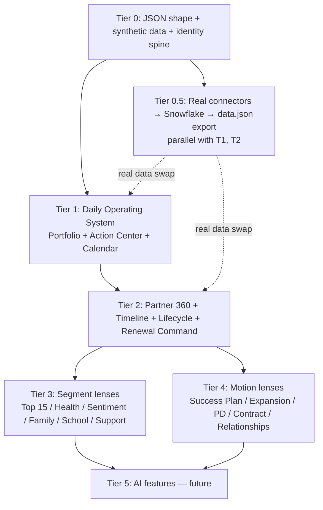

# Plan — Partner Success Command Center Dashboard

**Slug:** `partner-success-command-center` · **Depth:** quick → expand · **Date:** 2026-06-04 · **Route:** stays local (pending G7)

**Source:** verbatim spec at [`docs/research/2026-06-04-partner-success-dashboard-requirements/spec.md`](../../research/2026-06-04-partner-success-dashboard-requirements/spec.md) (Matt's wife, real PSM, edtech).

**Substrate inventory:** mapped in [`docs/research/2026-06-04-partner-success-dashboard-requirements/cross-references.md`](../../research/2026-06-04-partner-success-dashboard-requirements/cross-references.md). Home plugin: `plugins/edtech-partner-success/`. Connector layer: `plugins/data-platform/`. Design-layer consultee (when shipped): `data-viz-designer` (in flight per `project_data_viz_designer_in_flight` memory).

---

## Why we're doing this

A real Partner Success Manager (Matt's wife, k-12 edtech) wakes up every morning and has to swivel-chair Salesforce + Planhat + Snowflake + Support + Contracts + Success Plans + Calendar to answer **eight questions** before she can decide who to call. The spec captures every section she needs in **one operating surface** so the answer becomes "open the dashboard, do the top thing, then the next thing."

This serves three audiences in priority order:

1. **The PSM herself** — daily-operating-system. Single tenant. Real data. Built once, used every day. The primary win.
2. **Matt's consulting practice** — exemplar deliverable for a $25–50K Partner-Success-operations engagement (per `project_business_direction` memory). Hidden behind a `bi-report/data.json`-style data contract, swap one synthetic file → it works for any PSM org.
3. **The marketplace itself** — proves the `edtech-partner-success` + `data-platform` plugins ship something the lane was designed for. Tightens both plugins' agents/skills via a real exercise.

**Not in scope (deferred to v2):**
- Multi-tenant deployment (single-tenant first; multi-tenant if the consulting motion picks it up).
- AI feature set §"AI Features (Future State)" of the spec — explicit v2 boundary the spec already drew.
- Building a custom CSP (we use Planhat / Salesforce as systems of record, not replace them).

---

## Strategic shape — three load-bearing decisions

| # | Decision | Choice | Why | Alternatives kept on record |
|---|---|---|---|---|
| **S1** | Rendering platform | **v0: extend the `bi-report/` static pattern** (one JSON contract, regenerated `report.html`); **v1: Evidence** (SQL-on-warehouse, deployable as static or behind an auth proxy); **v2 only-if-needed: real React + Tremor** | v0 ships value tonight using the existing `scripts/generate-bi-report.py` plumbing; v1 unlocks dynamic filters / dates / drill-downs without inventing a backend. Evidence runs on Snowflake natively and has the lowest deploy ceremony of the three real-app options. | Superset (auth + caching but heavier); Metabase (similar tradeoff); Cube + custom React (max flexibility, max ceremony — wait for real ask). |
| **S2** | Identity spine | **Salesforce Account ID as the canonical `account_uid`**, every other system joined via `bridge_account_xref` per [`plugins/data-platform/skills/cross-system-identity-resolution/SKILL.md`](../../../plugins/data-platform/skills/cross-system-identity-resolution/SKILL.md). Planhat: `externalId == SFDC Account ID` (per `planhat-integration.md`). | SFDC is already the contracted system of record for the PSM org. Planhat's external-id convention makes the spine zero-cost. The `cross-system-identity-resolution` SKILL is in-plugin and already authored for this exact problem shape. | Email-domain as primary (drifts on M&A); name-similarity (false-positive prone); per-source IDs only (no cross-system joins). |
| **S3** | Priority Score rubric | **9-signal weighted average normalized 0-100, weights config-driven** in `bi-report/data.json` `priority_weights{}`. Wife tunes via direct JSON edit (v0) or a small admin pane (v1). Each "today's top accounts" row carries the **per-signal contribution breakdown** inline (Rule 4: "Cite the signal"). | Spec enumerates the 9 inputs but not the weights — making weights config-driven keeps the rubric tunable without code change. Per-signal breakdown closes Rule 4 *by construction*, not by discipline. | Hardcoded rubric (locks in opinion); Planhat-native score (vendor-tied); ML model (premature — no training data + no obvious target). |

---

## Phases — tier-shippable, each delivers standalone value

Each tier ships independently. Tier 0 is foundational and MUST precede every other tier. Tiers 1–4 can ship in any order once Tier 0 lands, but the order below is by **morning-value-density** (the wife's "daily operating system" lights up earliest).

### Tier 0 — Data layer + identity spine + JSON shape contract (3–5 days)

**Pre-build gate:** none (entry).

**The contract every later tier reads against:** `plugins/edtech-partner-success/bi-report/data.json` extended with a **partner-spine** + **per-source raw blocks** + **derived computed blocks**. Synthetic v0 data → real Snowflake-backed data in v1.

**Work:**

- **Define the JSON schema** (one source of truth, every later tier consumes it) — extend the existing `data.json` shape with:
  - `partners[]` — the spine. Per-partner: `{account_uid, name, segment, state, arr, contract_start, contract_end, renewal_date, funding_source, owner_psm, sfdc_owner, top15_status, lifecycle_stage, stage_entered_at, last_touchpoint_at, next_required_touchpoint_at, health_components{adoption, touchpoint, outcome, sentiment}, health_score, sentiment_score, engagement_score, priority_score, open_escalations, open_tickets, ticket_aging_days}`.
  - `contacts[]` — `{contact_uid, account_uid, name, title, role(champion|exec_sponsor|superintendent|tech_lead|family_engagement|stakeholder), influence_level, sentiment, last_interaction_at}`.
  - `timeline_events[]` — append-only event log per partner. Types: `closed_won|kickoff|data_mapping|go_live|training|qbr|checkin|success_plan_review|escalation|sentiment_change|renewal_conversation|expansion_conversation`. Each: `{event_uid, account_uid, type, ts, source(salesforce|planhat|support|snowflake|calendar|manual), summary, source_ref_url}`.
  - `usage_daily[]` — per `{account_uid, date}` row from Snowflake: `{active_users, active_teachers, active_admins, messages_sent, messages_received, family_invited, family_activated, family_engagement_rate, schools[{school_id, school_name, active_users, usage_level}]}`.
  - `success_plans[]` — `{plan_uid, account_uid, goal, owner, due_date, progress_pct, status(on_track|at_risk|complete|overdue)}`.
  - `contracts[]` — `{contract_uid, account_uid, doc_url, start, end, arr, multi_year, schools_included, licensed_users, products_purchased, pd_purchased_sessions, pd_completed_sessions}`.
  - `tickets[]` — `{ticket_uid, account_uid, opened_at, status, severity, theme, age_days, is_escalation}`.
  - `calendar_events[]` — `{event_uid, account_uid, type(qbr|checkin|renewal_meeting|strategic|pd_session|success_plan_review|sentiment_update|health_check), scheduled_at, duration_min, status(scheduled|completed|missed)}`.
  - `priority_weights` (config) — `{renewal_timing: 25, health_decline: 20, sentiment_decline: 15, days_since_touchpoint: 12, open_escalations: 10, ticket_volume: 5, arr: 5, top15_bonus: 5, usage_decline: 3}`. Normalized to 100.
- **Authoritative JSON schema** at `plugins/edtech-partner-success/bi-report/data.schema.json` so CI validates contract drift.
- **Synthetic-data generator** at `plugins/edtech-partner-success/bi-report/synthesize.py` — produces a realistic 25-partner sample matching the schema. Reproducible (`--seed=42`). FERPA-safe (no real student data; aggregate counts only).
- **`bridge_account_xref`** documented in `plugins/edtech-partner-success/knowledge/dashboard-identity-spine.md` — `{account_uid, salesforce_id, planhat_id, support_tool_id, snowflake_partner_key, match_method, confidence, last_verified_at}`. Real loader lives in `plugins/data-platform/` (Tier 0.5).

**Acceptance:**
- `python3 -m jsonschema -i data.json data.schema.json` exits 0 with the synthetic fixture.
- `bi-report/synthesize.py --seed=42` produces byte-identical output across runs.
- The synthetic 25-partner fixture includes ≥3 partners across each health band (green/yellow/red), ≥2 in each renewal bucket (180/120/90/60/30 days), and a mix of segments.

**New plugin assets:**
- `plugins/edtech-partner-success/bi-report/data.schema.json`
- `plugins/edtech-partner-success/bi-report/synthesize.py`
- `plugins/edtech-partner-success/knowledge/dashboard-identity-spine.md` (extends [`plugins/data-platform/skills/cross-system-identity-resolution/SKILL.md`](../../../plugins/data-platform/skills/cross-system-identity-resolution/SKILL.md))
- `plugins/edtech-partner-success/knowledge/dashboard-priority-score-rubric.md`

**Agents:** `data-engineer` (primary — schema + synthesize.py), `learning-analytics-analyst` (primary — score rubric + signal selection), `architect` (schema review), `security-reviewer` (FERPA — synthetic data must be FERPA-safe by construction).

---

### Tier 0.5 — Real data layer (in `plugins/data-platform/`, 5–8 days, parallel with Tiers 1–2)

**Pre-build gate:** Tier 0 schema frozen.

**Work:** stand up the real connectors per the existing `data-platform` knowledge files. Land raw JSON into a Snowflake schema `partner_success_raw.*`, shape into conformed `partner_success_dashboard.*` (matches the Tier 0 JSON contract), expose a SQL view + a `data.json` export script.

- **Salesforce** — managed connector (Fivetran / Airbyte / native), per `salesforce-integration.md`. Tables: `account`, `contact`, `opportunity`, `contract`, `quote`, `product`.
- **Planhat** — **BUILD** path per `planhat-integration.md`: watermark + MERGE loader, `externalId = sfdc_account_id`, raw-JSON-land-then-parse-in-dbt. Tables: `success_plan`, `note`, `health_score_history`, `sentiment_history`, `activity`.
- **Snowflake** — already the warehouse; **no new ELT**. Add a conformed view layer. Per CLAUDE.md Rule 10: don't reinvent.
- **Support data** — depends on the actual tool (Zendesk / Freshdesk / Intercom / SFDC Service Cloud). **Gap flagged in cross-references.md §B.2 — needs one research-and-knowledge-file pass before this connector ships.** If Intercom, `intercom-integration.md` already covers it; everything else is greenfield.
- **Contracts** — **Gap.** Often CPQ-inside-Salesforce (already covered) or Ironclad / DocuSign CLM (greenfield knowledge file needed).
- **Calendar** — **Gap.** Google / Outlook. Greenfield knowledge file. Read-only enough for v0 (countdowns derived from contract end + cadence rules, not synced events).
- **Identity loader** — implements `bridge_account_xref` per `plugins/data-platform/skills/cross-system-identity-resolution/SKILL.md`.
- **`data.json` export script** at `plugins/data-platform/scripts/export-partner-success-data.py` — runs the SQL view set, writes the dashboard-readable JSON. Idempotent. Single command the wife (or a cron) can run.

**Acceptance:**
- A real partner's data lands in Snowflake, joins via `bridge_account_xref`, exports to a `data.json` that **drops in as a replacement for the Tier 0 synthetic fixture** and renders correctly.
- Connector failures degrade gracefully — one source down → that source's block is empty in `data.json` with a `last_succeeded_at`, NOT a crash.
- Run-time budget: full ELT + export under 15 min.

**Gap-research items (must complete before this tier ships if applicable):**
- `plugins/data-platform/knowledge/zendesk-integration.md` OR `freshdesk-integration.md` (TBD on actual tool) — IF support tool is not Intercom.
- `plugins/data-platform/knowledge/contract-systems-integration.md` (CPQ vs Ironclad vs DocuSign CLM).
- `plugins/data-platform/knowledge/calendar-systems-integration.md` (Google Calendar vs Outlook).

**Agents:** `etl-pipeline-engineer` (primary), `data-engineer`, `architect`, `security-reviewer`.

---

### Tier 1 — Daily Operating System (1–2 days)

**Pre-build gate:** Tier 0 schema frozen + synthetic fixture lands.

**The four widgets that answer the morning's eight questions.** This is the **first dashboard the wife actually uses**. Ships against synthetic data and updates seamlessly when Tier 0.5 swaps in real data.

**Work:**
- Extend `plugins/edtech-partner-success/report.html` (or a new `dashboard.html` per S1's v1 path) with four top sections:
  - **Portfolio Summary** card — Total / Active / Top 15 / In Renewal Window / At Risk / Open Escalations / Need Outreach. All counts derived from `partners[]`.
  - **Portfolio Health Snapshot** card — average health / sentiment / engagement, count with declining usage, count with no touchpoint 90+ days.
  - **Daily Action Center** — sorted by `priority_score` desc; columns `partner_name | priority_score | reason | recommended_action | due_date`. Reasons are a deterministic enum from the signal that drove the score (rendered with per-signal contribution % per Rule 4). Recommended action looks up `knowledge/partner-health-decline-which-play.md`.
  - **Calendar / Upcoming Touchpoints** — countdown list (`15 days until next check-in`, `45 days until QBR`, `90 days until renewal planning`, `120 days until renewal outreach`). Derived deterministically from `contracts.end - today` + `k12-psm-operating-cadence.md` cadence rules.
- Extend `scripts/generate-bi-report.py` to render the new sections from the extended JSON.
- **Color discipline:** green ≥ 70, yellow 50–69, red < 50. From `data.json` `bands{}`. Same as existing Portfolio Report.
- **Provenance discipline (Rule 12):** every number renders with a hover-tooltip naming the source query + last refresh timestamp. The dashboard never claims a number without saying where it came from.

**Acceptance:**
- A PSM opening the dashboard knows in ≤ 15 seconds which partners need attention today, why, what to do, and when the next required touchpoint is.
- Visual diff against the existing `report.html` layout shows the additions don't break the Portfolio Report below them.
- A renewal-90-day partner appears in BOTH the Renewal Window count AND the Daily Action Center top-5 (cross-section consistency).

**Agents:** `frontend-coder` / `dashboard-builder` (primary), `partner-success-manager` (review — does this match how PSMs actually triage?), `learning-analytics-analyst` (score rendering).

---

### Tier 2 — Partner 360 drill-down + Timeline + Lifecycle + Renewal Command Center (3–4 days)

**Pre-build gate:** Tier 1 merged.

**Work:**
- **Partner 360** — clicking a partner in any list above opens a per-partner panel: account info, contacts (champion / exec sponsor / superintendent / tech lead / family engagement lead + roles + last interaction + sentiment), open escalations.
- **Account Timeline** — chronological event stream from `timeline_events[]`, filterable by source / type. Each event deep-links to its `source_ref_url`.
- **Lifecycle Tracking** — current stage badge (Deployment / BOI / MOI / Renewal sub-states per spec), date entered stage, days in stage, next milestone, next required activity. Read from `partners.lifecycle_stage` + the cadence rules.
- **Renewal Command Center** — segmented by 180/120/90/60/30-day buckets. Per partner: renewal amount, health, sentiment, renewal risk, expansion opportunity, owner, status.

**Acceptance:**
- Selecting any partner from any list opens the same Partner 360 view (single drill-down implementation, not per-page reimplementations).
- Timeline renders ≥ 3 source types (salesforce / planhat / support) for the synthetic top-15 fixture.
- Lifecycle stage badge is colored by days-in-stage vs cadence policy (e.g. > 90 days in MOI without progression → yellow).

**Agents:** `dashboard-builder` (primary), `partner-success-manager`, `partner-profile-curator` (the durable-record viewpoint), `architect`.

---

### Tier 3 — Account-segment lenses (3–4 days, can fan out across days)

**Pre-build gate:** Tier 2 merged.

Each is a dedicated page that reuses Tier 2's drill-down + Tier 0's data.

- **Top 15 Dashboard** — Community Top 15 partners with health / sentiment / renewal / usage trend / last touchpoint / next touchpoint / open risks / success plan status. Color-coded per the spec.
- **Health Dashboard** — usage / adoption / engagement / support activity / escalations / renewal risk / product utilization, current score + historical trend.
- **Sentiment Dashboard** — current, last update, trend, with reason / notes / action plan from `timeline_events.type=sentiment_change` payloads.
- **Family Engagement Dashboard** — invited / activated / activation% / reached / languages / read rates / response rates / two-way conversation rates, with current vs previous year and quarter.
- **School Level Adoption View** — for multi-school districts, per-school usage + health + last-activity + trend, with highest/lowest/intervention highlighting.
- **Support & Escalation Dashboard** — open tickets, escalations, aging, themes, history. Highlights accounts with multiple tickets / high-risk escalations / unresolved.

**Acceptance:** each lens renders against synthetic data; cross-section consistency (a Top-15 partner with declining health appears in BOTH the Top 15 page AND the Health Dashboard "declining" list with identical numbers).

**Agents:** `dashboard-builder`, `learning-analytics-analyst`, `partner-success-manager` (review the segment lenses).

---

### Tier 4 — Business motion lenses (3–4 days, can fan out)

**Pre-build gate:** Tier 2 merged.

- **Success Plan Dashboard** — goals, owners, due dates, progress, status. Tracks completed / at-risk / upcoming milestones.
- **Expansion Opportunity Dashboard** — auto-flags accounts with high adoption + high usage + high sentiment + strong engagement + additional school/product opportunities. Displays potential opportunity / estimated value / reason flagged.
- **Professional Development Tracker** — PD purchased / completed / remaining / upcoming / expiring. Highlights unscheduled / expiring / underutilized.
- **Contract Center** — current PDF, previous, amendments, renewal quotes, order forms; full contract details + alert bucket (180 / 120 / 90 / 60 / 30 / PD expiration).
- **Relationship Mapping** — stakeholder grid (name / title / role / influence / sentiment / last interaction).

**Acceptance:** each lens renders against the synthetic fixture; renewal / PD / expansion logic is deterministic (no LLM in scoring — that's Tier 5).

**Agents:** `dashboard-builder`, `success-playbook-designer` (success plan view), `qbr-composer` (PD tracker), `partner-profile-curator` (relationship mapping).

---

### Tier 5 — AI features (FUTURE; explicitly out of MVP per spec) (Researcher-cadence revisit)

**The spec already drew the boundary**: AI Features are "Future State." We honor that.

When unparked: an `ai-summary` agent (already designable from `partner-success-manager` + `learning-analytics-analyst` + the warehouse) renders the example summary on every Partner 360 drill-down and gates on a config flag. Re-evaluate **when Tiers 0–4 are in production and the wife asks for it** (not before — the daily-operating-system value is the primary win; AI is a polish layer).

**Re-park trigger:** wife asks for it after using Tiers 1–4 for ≥ 30 days, OR Matt's consulting motion uncovers a customer who'd pay for it.

---

## Dependency DAG

**Critical path to wife-uses-it-every-day:** T0 → T1 ≈ **4–7 days**. The dashboard is useful with synthetic data the moment T1 ships; real-data swap from T0.5 lands when ready.

**Critical path to consulting-deliverable-grade:** T0 → T0.5 → T1 → T2 ≈ **10–14 days**.

---

## Cross-plugin contracts (where each piece lives)

| Asset | Home plugin | Why |
|---|---|---|
| JSON schema + synthetic fixture + `synthesize.py` | `edtech-partner-success` (the PSM lane owns the dashboard contract) | The schema IS the dashboard's API. |
| Real connectors + Snowflake views + `data.json` export script | `data-platform` (the data-engineering lane) | Per CLAUDE.md domain-plugins-extend-core rule + the existing `salesforce-integration.md` / `planhat-integration.md` home. |
| `cross-system-identity-resolution` SKILL (consumed by Tier 0.5) | `data-platform` (already there) | Don't re-author. |
| Cadence rules consumed by Calendar widget | `edtech-partner-success/knowledge/k12-psm-operating-cadence.md` (already there) | Don't re-author. |
| Decline-to-play mapping consumed by recommended_action | `edtech-partner-success/knowledge/partner-health-decline-which-play.md` (already there) | Don't re-author. |
| Health score components + decay model | `edtech-partner-success` (already in `data.json` baseline) | Tier 0 extends it; doesn't replace it. |
| Chart components / WCAG floor / IBCS opt-in (when v1 rendering platform lands) | `ravenclaude-core/data-viz-designer` (in-flight; consulted) | Don't re-author when the agent ships. |
| `build-embedded-dashboard` SKILL (consumed if multi-tenant ever lands) | `data-platform` (already there) | Tier 5+ only. |

---

## Risk matrix

| # | Risk | P × I | Mitigation | Owner |
|---|---|---|---|---|
| **R1** | **FERPA-leak in synthetic data** — a future contributor pastes real student / partner names into `synthesize.py` to "make the demo realistic," ships to a public PR | M × H | `synthesize.py` is seeded + entirely synthetic; layout-allow-list keeps real data out of `bi-report/`; `security-reviewer` mandatory on every PR touching that dir. CI gate: `grep -rE '(STUDENT_RE|PARTNER_RE)' bi-report/` returns nothing. | `security-reviewer` |
| **R2** | **JSON contract drift** — Tier 1+ tiers diverge from Tier 0's schema; `data.json` from real connectors stops matching | M × H | Single authoritative `data.schema.json`; CI validates every committed `data.json` against it (extend existing `audit-gates.sh`); every new field requires both schema bump AND a synthetic-fixture row exercising it. | `architect` |
| **R3** | **Identity spine mismatches** — fuzzy joins silently group two distinct partners (same district name, different states) | M × H | Every join goes through `bridge_account_xref` with `match_method` + `confidence`; rows with `confidence < 0.9` get a dashboard banner ("identity-resolution uncertain — verify before acting"); per `cross-system-identity-resolution/SKILL.md`. | `data-engineer` |
| **R4** | **Priority score gives wrong answers** — the rubric scores a partner urgent who's actually fine, or vice versa | H × M | Config-driven weights (wife tunes in `data.json`); per-row contribution breakdown rendered inline (Rule 4); first 2 weeks of use = active calibration with the wife (NOT "ship and forget"); the rubric is a starting point, not an opinion. | `learning-analytics-analyst` |
| **R5** | **Calendar countdowns look authoritative but are derived** — wife trusts "120 days until renewal outreach" without realizing it's `contract.end - today - 120` rather than a scheduled meeting | L × M | Every countdown carries a tooltip: "derived from contract.end_date + cadence policy; not a calendar invite" until real calendar sync lands in Tier 0.5+. | `frontend-coder` |
| **R6** | **Connector gap blocks Tier 0.5** — the wife's support tool isn't Intercom (the only one covered today) and the research pass is hand-wavy | M × M | **Pre-Tier-0.5 gate:** confirm support tool with the wife; if not Intercom, prioritize the gap research pass (knowledge file + connector pattern) BEFORE Tier 0.5 starts. | `data-engineer` |
| **R7** | **Single-tenant tech debt turns multi-tenant into a rewrite** — v1 ships with `account_uid` keys hardcoded to the wife's org's IDs | L × H | Tier 0's schema is **already org-scoped** (`org_uid` field on every top-level table even when single-tenant) — costs nothing to add now, blocks the rewrite later. The `build-embedded-dashboard` SKILL is the eventual lift. | `architect` |
| **R8** | **Dashboard performance degrades as warehouse rows grow** — Tier 0.5's `usage_daily` is per-partner per-day; one year × 100 partners = 36k rows; year-over-year visuals get slow | L × M | Per `dashboard-performance-tuning/SKILL.md` widget-budget loop — pre-aggregate at the SQL layer; expose `usage_summary{}` in `data.json` rather than ship raw 36k-row arrays to the browser. Each visual targets ≤ 1k rows of data hydration. | `data-engineer` |
| **R9** | **Recommended action drifts from the play catalog** — `partner-health-decline-which-play.md` evolves and the dashboard's hardcoded reason → action mapping rots | L × M | The Daily Action Center reads the mapping from the knowledge file at render time (single source of truth); a knowledge-file test asserts every reason enum has a corresponding play entry. | `success-playbook-designer` |

---

## Definition of Done — per tier

### Tier 0
- [ ] `data.schema.json` validates the synthetic fixture (CI).
- [ ] `synthesize.py --seed=42` reproducible byte-for-byte.
- [ ] Synthetic 25-partner fixture spans health bands + renewal buckets + segments.
- [ ] `dashboard-identity-spine.md` + `dashboard-priority-score-rubric.md` written, scored ≥ 4/6 by `agent-quality-rubric`.
- [ ] FERPA grep returns zero hits.

### Tier 0.5
- [ ] At least one real partner's data lands end-to-end through the real ELT and renders correctly.
- [ ] Connector failures degrade gracefully (one source down ≠ dashboard crash).
- [ ] `data.json` export idempotent + under 15 min.
- [ ] Gap knowledge files written for the connectors the wife actually uses.

### Tier 1
- [ ] Four widgets render against synthetic data.
- [ ] Wife confirms the **eight-questions** answer < 15 sec.
- [ ] Per-signal contribution renders inline on every Daily Action Center row (Rule 4 by construction).
- [ ] Cross-section consistency holds (a 90-day-renewal partner appears in both Renewal Window count and top-5 Action Center).

### Tier 2
- [ ] Single Partner 360 drill-down reused everywhere.
- [ ] Timeline renders ≥ 3 source types.
- [ ] Lifecycle stage badge colored by cadence policy.
- [ ] Renewal Command Center 5-bucket layout.

### Tier 3 / 4
- [ ] Each lens renders from the synthetic fixture.
- [ ] Cross-lens consistency (same number on two pages → identical to the byte).

### Cross-cutting
- [ ] Every dashboard PR runs `npx prettier --check .` + `audit-gates.sh` clean.
- [ ] `plugins/edtech-partner-success/.claude-plugin/plugin.json` + `marketplace.json` mirror — version bumps lockstep.
- [ ] Layout allow-list extended for new dirs (`bi-report/data.schema.json`, `bi-report/synthesize.py`, etc.).
- [ ] No real partner / student data anywhere in the repo. Ever.
- [ ] Each tier ships with a 5-line `CLAUDE.md` milestone entry.

---

## Alternatives kept on record

| # | Decision | Chosen | Alternative(s) | Why chosen |
|---|---|---|---|---|
| A1 | Plugin home | `edtech-partner-success` (data) + `data-platform` (connectors) | New plugin (`partner-success-dashboard`) | Don't fragment — the PSM lane already exists and owns the priors. New plugin = duplicated CLAUDE.md / agents / skills. |
| A2 | First-tier render | Extend existing `bi-report/report.html` static pattern | Greenfield Evidence/Superset deploy | Ships value fastest; Evidence is the v1 lift once dynamic filters are a real ask. |
| A3 | Synthetic vs real data first | Synthetic first (Tier 0), real second (Tier 0.5 parallel) | Real-data first | Synthetic unblocks Tiers 1–4 in parallel with connector work; lets the wife eyeball the layout before the warehouse plumbing matters. |
| A4 | Priority weights | Config-driven (`priority_weights{}`) | Hardcoded | The wife is the rubric SME; she must be able to tune without a code change. |
| A5 | Calendar widget | Derived countdowns from contract + cadence rules | Real Google/Outlook sync | Defers the calendar connector; the derived countdowns answer the spec's "show countdowns" verbatim without the integration overhead. Real sync is Tier 0.5 if it ships, otherwise unparked. |
| A6 | Multi-tenant timing | `org_uid` field present in schema from day 1; multi-tenant deployment in v2 | Multi-tenant from MVP | Cheap insurance; the real cost of multi-tenant is the auth + isolation layer, not the schema. Schema-cost ≈ zero now. |
| A7 | AI features | Hard-deferred (spec calls them future) | Ship a simple summary in Tier 1 | Honor the spec's boundary. AI features earn their way in once the daily-operating-system is in use. |

---

## Settling steps for the open spec questions

The spec has six places it under-specifies that the plan must resolve **before** implementation (asking the wife is the cheap path — she's the SME):

| # | Open question | Settling step | When |
|---|---|---|---|
| Q1 | Which support tool does she use? (Zendesk / Freshdesk / Intercom / SFDC Service Cloud / other) | Ask. Determines whether Tier 0.5 needs a new knowledge file. | Before Tier 0.5 starts. |
| Q2 | Contract system-of-record? (Salesforce CPQ / Ironclad / DocuSign CLM / file-share) | Ask. Determines Tier 0.5 connector scope. | Before Tier 0.5 starts. |
| Q3 | Calendar tool? (Google / Outlook) | Ask. Determines if Tier 0.5 attempts real sync or stays derived-only. | Before Tier 0.5 starts. |
| Q4 | Top 15 partner list — where does it live today? (Salesforce list view? Spreadsheet? Manual?) | Ask. Drives Tier 0's `top15_status` field source. | Before Tier 0 ships. |
| Q5 | PSM-owned partners scoping — single PSM (her) or her team? | Ask. Determines whether `owner_psm` is a meaningful filter or constant. | Before Tier 1 ships. |
| Q6 | Sentiment "Green / Yellow / Red" — Planhat-native field or PSM-set? | Ask. Drives where the sentiment widget reads from. | Before Tier 1 ships. |

These are not gates the plan can resolve alone — they are settled by 5 minutes of conversation with the wife. Until they're answered, default to the smallest-blast-radius choice (assume Salesforce CPQ for contracts, Google Calendar, derived-only sentiment, single-PSM scoping) and re-do affected tier work if she contradicts.

---

## Open questions parked

- **Tenant isolation when productized** — Tier 0.5 stays single-tenant; multi-tenant lift is the build-embedded-dashboard SKILL's domain when a consulting customer asks.
- **AI features** — explicit spec boundary, parked per Tier 5.
- **Real Calendar write-back** (creating QBR invites from the dashboard) — read-only countdowns first; write-back is a Tier 0.5 stretch if the wife wants it.
- **Mobile responsive** — desktop-first; mobile defers until the wife actually tries to use it on her phone.
- **Embedded student-level metrics** — explicitly out of scope per FERPA. Dashboard surfaces aggregates only.

---

## What ships in the *very next* PR after this plan is approved

**Tier 0, scope minimum:** the JSON schema + synthetic fixture + `synthesize.py` + the two knowledge files (`dashboard-identity-spine.md` + `dashboard-priority-score-rubric.md`). No render changes. No connector work. This is the foundation every other tier reads against; everything else stacks on top.

After that lands, Tier 1 (the four widgets) is the next PR, and Tier 0.5 (real data) begins in parallel.
