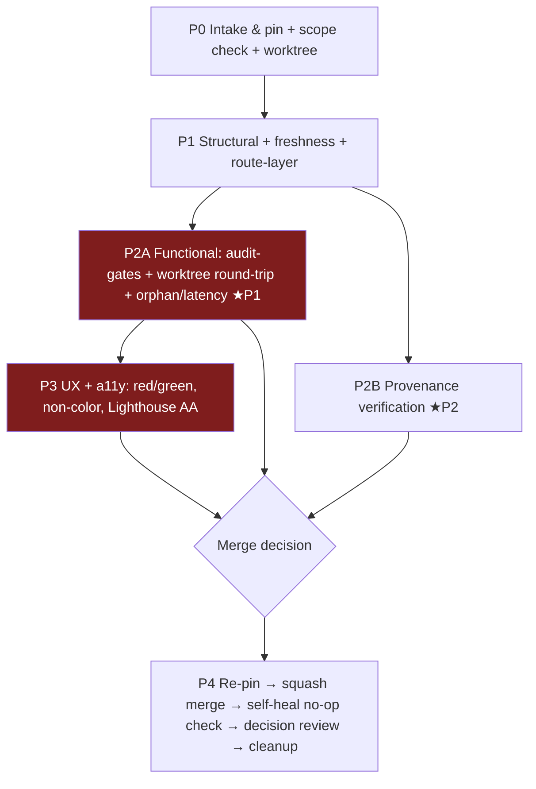

# Merge Gate — Ultraplan Pipeline+Settings PR
## FORGE-synthesized plan · forge: ultraplan-pipeline-settings-merge · 2026-06-04 · depth: deep

**What this is:** the review-and-acceptance gate to execute the moment the Ultraplan PR
(cloud session `session_01GqvKFSnkHU1AcCyLaeGWvb`) lands. The PR merges the dashboard's
settings surface into the pipeline view, adds per-step agentic-tool provenance, and adds
red/green state-colored toggles.

**Owner priorities (ordered):** (1) safe toggles — zero dashboard↔config drift;
(2) provenance accuracy; (3) one-screen, zero memorized commands.

**Provenance of this plan:** two divergent panels (Opus/Sonnet) → gap-delta (7 conflicts,
11 silences) → critic with 21 live-repo verifications (7 correlated errors X1–X7) →
tribunal-binding tiebreaks (C2 no / C6 yes / C7 yes) + expert synthesis rulings (C3, C4)
→ double red-team (E1–E7 execution, RT-01–06 process/adversarial). All artifacts in this
run dir. **No dangling conflicts; every G1 `[unverified]` claim has a settling step**
(claim #9 settles in Phase 2B; claim #11 in Phase 2A/latency check).

**Key fact corrections baked in (do not re-derive from stale memory):**
- Gate 32 (server endpoint parity) and Gate 35 (dashboard round-trip) ALREADY exist in CI
  (`scripts/audit-gates.sh:2120`, `:2196`). The "no freshness gate between server copies"
  memory is stale.
- `/__save` requires Origin/Host guard + per-process CSRF token + body
  `{"path": <target>, "content": <ENTIRE file string>}` — whole-file write, not key-value.
- `apply-comfort-posture.py` flags: `--source <enum>` and `--dry-run`. There is no `--provenance`.
- `yq` is absent in this devcontainer; use python3+PyYAML.
- `#/settings` may be iframe-private (not a top-level shell route) — establish the layer first.

---

## Phase 0 — Intake & pin (read-only; no mutations)

Pre-gate: PR exists. All steps fail-fast.

1. `gh auth status` must succeed (X4). All later `gh` content extraction has a
   `git fetch origin <branch> && git diff main...FETCH_HEAD` fallback — a gh failure must
   never masquerade as an empty/clean diff.
2. Pin the SHA: `gh pr view <PR> --json headRefOid` → record as `PINNED_SHA`.
3. `gh pr checks <PR>` fast-fail (S4).
4. `git merge-base` drift check vs current `origin/main` (S10) — note divergence.
5. **Diff-vs-mandate scope check (RT-06):** enumerate `git diff --name-only main...PINNED_SHA`.
   Expected surface: `scripts/generate-dashboards.py`, BOTH `serve-dashboards.py` copies,
   `plugins/ravenclaude-core/dashboard.html`, a provenance data file, manifests, tests/fixtures.
   Out-of-surface file → logged exemption. **Boundary files (`AGENTS.md`, `CLAUDE.md`,
   `.repo-layout.json`, `.github/`) or other plugins → hard block pending Matt.**
6. **Mirror filename check:** if either `serve-dashboards.py` is in the diff, both must be.
   One-sided → block immediately (PR #123 class; Gate 32 will also catch logic drift later).
7. **Gate-harness self-certification check (E5):**
   `git diff main...PINNED_SHA --name-only | grep -E 'audit-gates\.sh|check-.*\.(mjs|py)|\.github/workflows/'`
   — any hit → Phase 2A must run **main's** harness against the PR tree where possible,
   hand-diff every touched gate's must-fail half, and flag for explicit human review.
8. Create the isolated tree **outside the checkout** (E1):
   `git worktree add /tmp/forge-gate-<PINNED_SHA> <branch>` — never `.claude/worktrees/`
   (the `--project-root` guard at `serve-dashboards.py:1842` refuses in-checkout paths).

**Acceptance:** SHA pinned; scope conformance recorded; harness-touch flag set; worktree at /tmp.

---

## Phase 1 — Structural (cheap, fail-fast; run in the /tmp worktree)

1. JSON validity: marketplace.json, plugin.json, .repo-layout.json.
2. `bash -n` on touched hooks; executability preserved.
3. Layout allow-list script (AGENTS.md verification snippet) — zero violations.
4. Version bumped in **both** plugin.json and marketplace.json, no drift.
5. `git status --porcelain` clean, then `npx prettier --check .` (E6 — scratch artifacts
   can't pollute the /tmp worktree).
6. **dashboard.html freshness = HARD BLOCK (E7):** `python3 scripts/generate-dashboards.py`
   then `git diff --quiet plugins/ravenclaude-core/dashboard.html`. A diff means the PR ships
   a stale artifact — regenerate **in the PR**; never defer to the post-merge self-heal.
7. **Route-layer determination (X5):** read `PAYLOAD_ROUTES` in `index.html` AND the
   dashboard's internal router to establish where `#/settings` lives today (top-level shell
   route vs iframe-private tab). Only then assert continuity: the settings surface must
   remain reachable (embedded in `#/pipeline` or redirected) at the SAME layer it lives at.
   Gate 51 is the authority on top-level routes — don't re-grep.

---

## Phase 2A ∥ 2B — bounded parallel (C4 ruling). Merge decision stays serial: 2A red = stop regardless of 2B.

### Phase 2A — Functional verification (worktree only; PRIORITY 1)

1. **`audit-gates.sh`** (covers Gates 11/12/13/32/35/51 + the rest):
   - assert `git rev-parse HEAD` == PINNED_SHA in the tree first (E4);
   - FOREGROUND, never backgrounded;
   - after: `test -x plugins/ravenclaude-core/hooks/guard-destructive.sh && git diff --quiet`
     — dirty tree post-audit = stop (E4 trap-restore check);
   - Gate 10 may LOUD-skip locally without docker — a skip is not a pass; note it.
   - If Phase 0 step 7 flagged harness changes: use main's harness per E5.
2. **ONE worktree-scoped round-trip sanity test** (replaces both panels' per-toggle live
   curl gauntlets — X1/X3/Gate-35 rationale in tiebreaks.md):
   - `serve-dashboards.py --validate --project-root /tmp/forge-gate-<sha>` must print
     `project root OK:` and exit 0 BEFORE anything else; exit 2 = misconfigured stop (E1).
   - Start server foreground-managed with guaranteed teardown (trap kill on EXIT).
   - Client: target `http://127.0.0.1:<port>` with explicit `Host:` header; readiness-poll
     `GET /__csrf` for 200+token (503 = startup race, retry); POST `/__save` with
     `X-CSRF-Token` and `{"path": ".ravenclaude/comfort-posture.yaml", "content": <full
     reconstructed YAML>}`; **assert HTTP 200 + `applied:true`** — 403/400/503 = FAIL (E3).
   - Flip-then-revert; compare normalized YAML via python3+PyYAML (X2/S2) — byte-level
     after normalization, both `comfort-posture.yaml` and the worktree's `.claude/settings.json`.
   - `posture-events.jsonl` records both events (S1).
   - **Every** `apply-comfort-posture.py` invocation carries `--project-root /tmp/...`
     explicitly (E2 — the `.git`-file walk-up gotcha); flags: `--dry-run`, `--source cli-direct` (X7).
   - Before/after: snapshot the MAIN repo's `settings.json` + `comfort-posture.yaml`
     mtimes/inodes and verify untouched (E2 safety proof).
3. **Orphan-key check — general (S8):** every toggle's category key must exist in the
   EMISSIONS table. **Enabled orphan = block.** Disabled+TODO is acceptable (C2 tribunal,
   binding) ONLY if: the TODO points at a filed issue number or
   `docs/follow-ups/2026-06-04-comfort-posture-agent-category.md` (RT-02 anchor — a bare
   code comment does not qualify), AND **max 2 disabled toggles per PR** (RT-03 cap);
   more than 2 → scope the orphan toggles out of the diff, or Matt decides.
4. **Latency-label check (C3 synthesis):** a visible callout naming both latency classes
   AND every settings.json-target toggle individually marked (label or data-attribute,
   derivable from its EMISSIONS class). Marking absent entirely = **block**; present but
   hand-typed = accept + tracked follow-up (wire the generator so labels can't drift).
   This settles G1 claim #11 per-toggle.

### Phase 2B — Provenance verification (web-bound; PRIORITY 2; settles G1 claim #9)

1. Extract every per-tool row from the diff (gh, with git-fallback per X4).
2. Per-row primary-source verification: url + access-date inline. Copilot rows are
   highest-risk (S11 — no equivalency doc exists for `copilot-hook-adapter.sh`).
   Sources: code.claude.com/docs · docs.github.com/en/copilot · github.com/openai/codex ·
   docs.cursor.com. Use microsoft-learn MCP for Copilot/Microsoft surfaces.
3. **Budget stop rule (RT-01):** output is machine-readable (one row per line:
   claim | source | status | date) and resumable. **More than 5 rows still unverified when
   budget exhausts = no merge**; surface counts + specific claims to Matt.
4. Unverifiable rows are **softened or pulled, never shipped as fact**. Anchors (RT-02):
   PASS-soften = "Copilot CLI has no documented equivalent [unverified, checked 2026-06-04]";
   FAIL-soften = "may behave differently" with no marker.
5. **Staleness contract (RT-05):** verified rows must carry a freshness mechanism — either
   `verified_until` (+90 days, repo convention) rendered/checkable, or the data lives at
   `plugins/ravenclaude-core/knowledge/tool-provenance.md` (preferred — the existing 90-day
   sweep then covers it free). PR ships neither → require one before merge.
6. Cross-check: each row's "how the dashboard overrides it" half must agree with the
   Phase 2A round-trip truth.

---

## Phase 3 — UX & accessibility (after 2A; may overlap 2B)

1. **Red/green = state semantics, not direction:** guardrail OFF → red (less safe),
   ON → green; manually verify ≥3 dangerous-action toggles; physical direction consistent
   across all toggles.
2. **Non-color signal = hard gate** (WCAG 1.4.1). Anchor (RT-02): PASS = color + icon/
   border/text change; FAIL = color change only.
3. **Lighthouse AA contrast = HARD gate (C7, tribunal-binding).** Run via chrome-devtools
   against the served worktree `#/pipeline`; no regression vs main.
4. **One-screen check (priority 3):** merged view renders settings + pipeline flow +
   provenance + toggles in one place. **Assert structure, not counts (X6):** every stage
   has a live badge; every toggle maps to an EMISSIONS key — lane/stage counts may
   legitimately change.

---

## Phase 4 — Merge & post-merge

1. **Re-pin (R-NEW-2):** `gh pr view <PR> --json headRefOid` must still equal PINNED_SHA;
   a fixup pushed mid-gate → re-run Phases 1–3 on the delta.
2. Stacked-PR check, then **squash merge** (C6, tribunal-binding).
3. Post-merge: verify the `regenerate-artifacts.yml` self-heal commit is a **no-op** —
   a non-empty self-heal diff is a determinism bug to investigate, not a silent heal (E7).
4. **Post-PR decision review** (CLAUDE.md): enumerate the PR's decisions, route
   tribunal-eligible ones, log as a PR comment. The gate's verdict summary is posted as a
   PR comment regardless (RT-04 lightweight pairing).
5. Cleanup: `git worktree remove /tmp/forge-gate-<sha>`; assert no leaked server processes.

---

## Dependency DAG

Critical path: P0 → P1 → P2A → P3 → merge. P2B runs in parallel from P1 and is usually
the wall-clock-dominant leg. Failed P2A = stop regardless of P2B state (C4 ruling).

## Hard blockers (any one stops the merge)

P0: boundary-file/out-of-scope diff (pending Matt) · one-sided server edit ·
P1: stale dashboard.html · prettier/layout/version failures ·
P2A: audit-gates.sh red · round-trip failure (incl. exit-2 misconfig) · enabled orphan toggle ·
>2 disabled+TODO toggles · latency marking absent ·
P2B: >5 unverified provenance rows · unverified rows shipped as fact · no staleness contract ·
P3: color-only signaling · Lighthouse AA fail ·
P4: SHA drift without delta re-review.

## Decisions reserved for Matt (not auto-resolvable)

1. **Branch protection (RT-04):** today this gate is purely advisory — you can merge from
   the GitHub UI before it runs. Recommended: require 1 approving review on `main`
   (one-time setting); the gate posts its verdict as a PR comment, your approval confirms
   it ran. Alternative: accept the risk explicitly and we record the waiver.
2. **`.prettierignore` housekeeping (E6):** add `.ravenclaude/runs/` +
   `.ravenclaude/posture-events.jsonl` — one line, kills a false-fail class permanently.
3. **>2 disabled+TODO toggles** if it arises (RT-03 escalation).
4. Any boundary-file or out-of-scope change found at P0.

## Alternatives considered (recorded; losing options)

- Per-toggle live-server curl testing on both copies (Panel A) — rejected: X1 (CSRF/Origin/
  whole-file body), X3 (live mutation), duplicates Gates 32/35.
- Provenance-first ordering (Panel B Alt A) — rejected for bounded-parallel (C4).
- Static EMISSIONS audit only (Panel A B2) — kept as the orphan-key check, but cannot
  replace the one live round-trip (revert-asymmetry coverage).
- pytest fixture harness (Panel B Alt C) — deferred: worth building only if this PR ships
  5+ toggles; the worktree round-trip script is the seed for it.

## Risk matrix (consolidated, post-mitigation residuals)

| Risk | P×I | Residual after mitigation |
|---|---|---|
| Round-trip misconfig read as pass (E1/E3) | M×H | LOW — exit-code + HTTP-200 + applied:true assertions |
| Live-repo mutation via walk-up (E2/X3) | M×H | LOW — --project-root threading + inode/mtime proof |
| Gate self-certification (E5) | M×H | LOW-MED — main-harness fallback is partial; human review flagged |
| Unverifiable provenance at scale (RT-01/P-NEW) | H×M | MED — stop rule bounds it; some rows will ship softened |
| Advisory-gate bypass (RT-04) | M×H | OPEN — Matt decision #1 |
| Provenance rot (RT-05) | H×M | LOW if knowledge/ location chosen; MED with verified_until only |
| Reviewed≠merged artifact (E7/R-NEW-2) | M×H | LOW — re-pin + self-heal no-op check |

## Definition of done

- All hard blockers green; gate artifacts (this run dir) updated with per-phase results.
- PR comment posted: gate verdict + provenance verification table + any waivers.
- Post-PR decision review logged (CLAUDE.md).
- Worktree removed; no leaked processes; main repo settings/posture untouched (proven).
- If the PR added a skill/agent or changed counts: the per-phase regen discipline from
  forge-pipeline §G8 (quoted descriptions, count strings, dashboard/repo-guide/copilot
  regen, audit-gates fixture literals) verified — most arrive free via audit-gates.sh.
