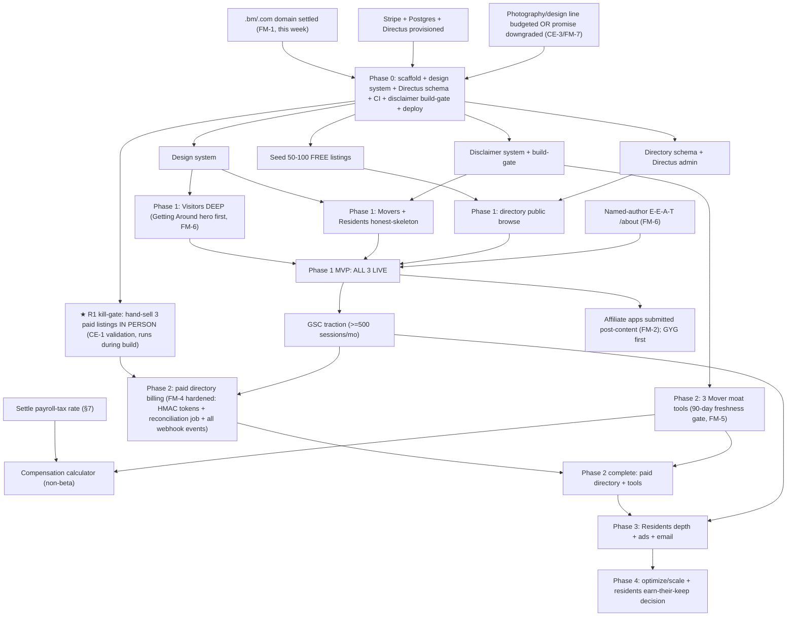

# Pilot.BM — Authoritative Build Plan (FORGE G6 Synthesis)

**Owner:** Matt. **Repo:** `Pilot.BM` (new, standalone — NOT RavenClaude). **Date:** 2026-06-10.
**Gate:** G6 Synthesize — merges scope.md, research-synthesis.md, plan-A.md (architect lens), plan-B.md (product/growth/cost-realism lens), gap-delta.md, critic-brief.md (G4a correlated-error), red-team.md (G5 execution failure modes).

**Owner DECISION (locked):** Build **all 3 audiences at launch** (Visitors / Movers / Residents). This plan honors that scope and does **NOT** adopt the critic's Visitors-first reframe. Instead, every critic + red-team finding is folded in as a **named, owner-acknowledged risk with a concrete mitigation** inside the all-3-at-launch scope — most importantly by converting the critic's "Visitors-first" instinct into a **depth asymmetry** (all 3 live, Visitors sequenced deepest) and by converting the riskiest premise (the directory sales motion) into an **early in-build validation experiment** rather than ignoring it.

---

## 1. Context

**What Pilot.BM is.** A high-end, design-forward Bermuda guide serving three audiences — **Visitors**, **People moving to Bermuda (Movers)**, and **Residents** — each with curated editorial we write, plus a **shared business directory** that is both a feature and the load-bearing revenue stream. The differentiator is genuine white space: every incumbent is brochure-ware (gotobermuda.com), budget-voiced (Nomadic Matt), news-dominated (Royal Gazette/Bernews), or aging/ugly (BermudaYP). No high-end, opinionated, logistically-complete Bermuda guide exists.

**Owner's locked scope.**
- **Launch:** all 3 audiences at once.
- **Content:** curated editorial we write (the high-end differentiator; maintenance burden budgeted, not wished away).
- **Revenue:** a **blended model** recommended from realistic-traffic economics — directory listings + affiliates + (later) ads + (Year-2 upside) a concierge tier.
- **Bar:** the site must **pay for its own running + content costs**.
- **Legal:** Movers content is never legal/immigration/tax advice — disclaimers + "verify at gov.bm" on every regulated page.

**Honest viability read (this is load-bearing — keep it in view).** Viability is **MARGINAL**. A blended model can cover running + content costs **only in the owner-writes-content scenario**, and the **load-bearing stream is paid directory listings, not ads** (ads are below hosting cost in Year 1; affiliates are real but small and were gutted by Booking.com's May-2025 "Bookinggeddon"). Break-even verdict from research: **owner-writes → +$3.2k Y1 / +$10.5k Y2; partial-freelance content → −$4.8k Y1, +$10.5k Y2; full outsource → never.** Traffic ceiling ~10–25k sessions/mo by Y2 (Google's Helpful Content Update punishes thin niche travel sites).

**The honesty the critic forced (G4a CE-6), stated plainly so the owner can't miss it:** "pays for itself" is true **only because owner content labor is counted at $0.** At a financial analyst's ~$50/hr opportunity cost, 12 hrs/wk ≈ $31k/yr of foregone value — so the project is cash-positive (small) but opportunity-cost-negative under its own best case. This is acceptable **if** the owner is deriving intrinsic value / strategic value (proof-of-craft, a Bermuda foothold) from it — but it must be a knowing choice, not a math illusion. **This plan proceeds on the owner's locked decision while making that trade explicit.**

---

## 2. Tech stack

Both panels converged independently on **Astro static-first**. This is the right altitude: the site is a static-first content marketing front-end with **one stateful island** — the directory + its paid-listings billing. Visitor/editorial pages are pre-rendered, CDN-cached HTML (near-zero marginal cost, top-tier Core Web Vitals = the best defense against Google HCU, and the "high-end feel" is a design+performance story, not a framework story). The only parts needing a database + server are the directory, paid-listing subscriptions, and the three Mover interactive tools (which are themselves client-side).

### 2.1 RECOMMENDED stack

| Layer | Pick | Why (tied to the constraints) |
|---|---|---|
| **Framework** | **Astro 5** (static-first, islands, content collections) | Zero-JS by default → fastest LCP → best HCU defense; islands let the tools + directory search be interactive without an app-wide bundle. Both panels agree. |
| **CMS / content + directory admin** | **Directus** (self-hosted, owner-GUI headless CMS + directory backend) — **PRIMARY** | **This resolves the CMS fork.** Owner-content-sustainability is the existential risk; the owner must manage directory listings *and* editorial without a developer. Directus ships a GUI admin panel out of the box (add/edit a listing in <5 min, no code). Postgres-backed, infrequent non-breaking releases, near-zero infra ops. |
| **CMS — lighter alternative (noted)** | **Decap CMS** (git-backed, free, commits MDX to the repo) | Lighter, free, version-controlled, and enforces typed/SEO-validated frontmatter at build. **The trade-off vs Directus:** Decap is excellent for *editorial* but does **not** give the owner a GUI to manage a *structured, billable directory* — directory rows want a real DB + admin, which is exactly what Directus provides. Choose Decap only if the directory is deferred or stays tiny; otherwise Directus is primary because the directory is the load-bearing revenue surface. |
| **Directory + listings DB** | **Postgres** (Railway ~$5–10/mo, or Neon serverless free→$19) | The directory is structured, queried by category/parish/audience/tier, and joined to billing — relational is correct. This is also Directus's backing store. |
| **Directory API + tools backend** | **Astro server endpoints** (Node adapter) — a handful of routes, one deployable | `/api/directory/search`, `/api/listings/checkout`, the Stripe webhook, the nightly reconciliation job. (See FM-4 / risk register — the *public claim+pay* flow is the genuinely app-shaped part and is NOT free in Directus; it is built here.) |
| **Payments / listing billing** | **Stripe** (Checkout + Billing for recurring listing subs; Payment Link for the one-off Concierge Pack) | Recurring $30–100/mo listings = Stripe Billing subscriptions; webhook flips `listing.tier`/`listing.status`. Stripe's own `past_due` dunning emails reduce the manual renewal-chase burden (FM-8 mitigation). |
| **Hosting** | **Cloudflare Pages** (static, free global CDN) **+** one small Node instance (Railway/Fly ~$5–10/mo) for SSR endpoints; **Vercel/Netlify** is the all-in-one alternative | Keeps run-cost inside the ~$2.5k/yr research budget. |
| **Search** | **Pagefind** (build-time static) for editorial; **Postgres `tsvector`/trigram** for the directory (needs live tier/active filters) | Zero-infra editorial search; DB search where freshness matters. |
| **Analytics** | **Plausible** ($9/mo or self-host) or **Cloudflare Web Analytics** (free) + **Google Search Console** (the directory-sales proof) | Privacy-first, no Core-Web-Vitals tax. GSC is non-optional — it's the traffic proof the directory pitch needs. |
| **Affiliate/link tracking** | First-party **`/go/:slug`** redirect endpoint (logs click, appends affiliate params, `rel="nofollow sponsored"`) with a **`fallback_url`** column | One place to swap a dead affiliate (Bookinggeddon / CJ-deactivation resilience — FM-3) and to measure which links earn. |

**Rough run-cost:** domain + Postgres + small Node instance + Plausible + Stripe fees ≈ **$1.5–2.5k/yr infra** — inside the research budget. **Caveat folded from the critic (CE-3) + red-team (FM-7):** this is **infra only**. "High-end" additionally requires a **one-time photography + design line** (see risk register CE-3 / FM-7) — budget **$500–1,500** for one on-island Bermuda photo shoot, or honestly downgrade the promise to "clean, fast, opinionated." Do not let "high-end" be an unfunded mandate.

### 2.2 Alternatives considered (≥2 with trade-offs, from both panels)

| Alternative | What it buys | Why it loses here |
|---|---|---|
| **Next.js (App Router) + Payload/Sanity CMS + PlanetScale/Neon** | Most powerful if the directory becomes app-like (accounts, self-serve portals); biggest hiring pool. | Bigger JS payload by default, higher hosting floor (Vercel cost cliff at traffic scale), **Payload requires code for schema edits — the owner can't self-manage listings.** Over-builds for a 90%-static reading product. Revisit at Phase 4 only if the directory outgrows Directus or the Concierge tier becomes real SaaS. |
| **WordPress (Bedrock/Sage) + a directory plugin (GeoDirectory/Directories Pro)** | Fastest to content-publish; owner may already know WP; mature out-of-the-box paid-directory plugins. | Heavier managed-WP hosting ($25–40/mo min), **perpetual plugin/security patching = the exact ongoing-maintenance risk the research flags**, slower Core Web Vitals (loses the HCU/speed fight that is our white space), "high-end design" fights the theme system. Acceptable fallback only if owner code-tolerance is near zero. |
| **Webflow + Airtable (no-code)** | Genuinely fastest to MVP for a non-dev; drag-and-drop design + built-in CMS. | Platform fees ~$516/yr before infra; hard CMS item caps; **a spreadsheet is the wrong backend for the load-bearing billable directory**; painful migration later. "Fastest prototype, worst long-term economics." |
| **Cube/Tremor dashboard stack** (named for completeness) | BI/analytics semantic layer + charts. | **Rejected outright** — Pilot.BM has no end-user analytics product. The "tools" are calculators/decision-trees, not dashboards over a warehouse. Infrastructure with no consumer. |

---

## 3. Information architecture

Three audience sections + a **shared directory spine** (one data source, three audience-filtered presentations). The directory is core infrastructure, not an afterthought — it serves all 3 audiences AND is the load-bearing revenue stream.

```
pilot.bm
├── /  (high-end hero; audience switch: Visiting · Moving · Living here)
│
├── /visit/                         ← VOLUME + MARGIN ENGINE (deepest at launch)
│   ├── /visit/getting-around/      ★ HERO TOOL — "How do I get around Bermuda?"
│   │     (tourists CANNOT rent cars → interactive cost/comfort matrix:
│   │      scooter vs electric minicar vs bus+ferry pass ($62/wk) vs taxi
│   │      ($60–85/hr), by trip type + party size + days. The sharpest SEO hook.)
│   ├── /visit/beaches/             (Horseshoe Bay, Tobacco Bay — opinionated tiers)
│   ├── /visit/do/                  (curated activities → Viator/GYG affiliates)
│   ├── /visit/eat/                 (curated dining → OpenTable / Table.bm)
│   ├── /visit/stay/                ("book early" — inventory ~75% of 2019 → Booking via CJ/Awin)
│   └── /visit/itineraries/         (editorial flagship: 3/5/7-day opinionated plans)
│
├── /move/                          ← HIGH-VALUE, LEGALLY FENCED (the moat)
│   ├── /move/work-permit/          (employer-sponsored gate; WFB program CLOSED Feb 2025 — disclaimered)
│   ├── /move/cost-of-living/       (rent ~186% above US, SHB health $400.31/adult/mo, school ~$24k/yr)
│   ├── /move/tools/
│   │   ├── /assessment-number/     ★ MOAT 1 — Assessment-Number / one-car-per-household "car trap" explainer + checker
│   │   ├── /compensation/          ★ MOAT 2 — compensation-reality calculator ("what BDA salary to break even vs US/UK?")
│   │   └── /pathway/               ★ MOAT 3 — immigration-pathway decision tree (employer vs EIRC $2.5M vs spouse vs reside-annually)
│   └── /move/vendors/   → filtered DIRECTORY view (relocation / shippers / realty / insurers)
│
├── /live/                          ← CREDIBILITY + RETENTION ANCHOR
│   ├── /live/events/   ★ resident-centric events calendar (the standalone gap; nothingtodoinbermuda.com got absorbed)
│   ├── /live/deals/    ★ resident-discount / deals aggregator (genuine unmet gap; the listing-tier hook)
│   ├── /live/eat/      (dining for regulars — different voice from /visit/eat)
│   └── /live/new-here/ (settling-in layer for ~20k non-Bermudian residents; shared with /move, not duplicated)
│
├── /directory/                     ★★ THE SHARED SPINE (serves all 3 + load-bearing $)
│   ├── /directory/                 (browse by category × parish × audience tag)
│   ├── /directory/:category/       (e.g. /directory/restaurants/)
│   ├── /directory/listing/:slug/   (business profile; Free / Standard $30 / Featured $50 / Anchor $100)
│   └── /directory/claim/           (THIRD-PARTY claim + upgrade → Stripe — the app-shaped surface, see FM-4)
│
├── /go/:slug   (first-party affiliate redirect + click log + nofollow + fallback_url)
├── /about (named-author E-E-A-T page — see FM-6), /contact
└── /legal/{terms, privacy, disclaimer, affiliate-disclosure}
```

**The 4 signature tools (build specs):**

1. **Visitor "Getting Around" hero tool** — input: trip type (airport→hotel / beach day / island tour / nightlife) + party size + days → ranked transport options with cost, "can tourists do this?" (cars = no), and a comfort/effort score. Pure client-side island over a static ruleset JSON. Affiliate CTAs to scooter operators. **This is the SEO spike — build it first, to 3,000+ words + the interactive tool (FM-6 defense).**
2. **Assessment-Number / car-trap explainer (Moat 1)** — explainer + a small interactive "do I trip the one-car-per-household rule?" walkthrough. Static ruleset + disclaimer. No PII stored.
3. **Compensation-reality calculator (Moat 2)** — input: target lifestyle (rent band, household size, school Y/N, health plan) + home-country salary → required Bermuda gross to break even, with cost-of-living deltas. Client-side compute; ruleset content-versioned with `source_url` + `verified_on` (gated on settling payroll-tax rate, §7). "Estimate only" disclaimer + a visible "last verified [date]" badge **on the output**.
4. **Immigration-pathway decision tree (Moat 3)** — branching Q&A → likely pathway + "what to confirm at gov.bm." Static decision-tree JSON. Heavy disclaimer.

Every `/move/*` regulated page and every tool output renders the `<Disclaimer/>` component + a "Verify at gov.bm" deep link (§6b).

---

## 4. Monetization

**Blended model, directory listings load-bearing.** Decoupled from traffic, reused across all 3 audiences, and the renewal lever (view/click proof) is built in from day one.

### 4.1 Paid directory listings (LOAD-BEARING — build first-class)

**Tiers:** Free (name + category only — the upsell hook) / Standard $30/mo / Featured $50/mo / Anchor $100/mo. Premium tiers buy top-of-category placement, photos, a "Pilot.BM Partner" badge, a do-follow link, and a deals field.

**Data model (Postgres):**
```
business(id, slug, name, category, parish, audience_tags, description, phone, url, hours, lat, lng, created_at)
listing(id, business_id FK, tier ENUM('free','standard','featured','anchor'),
        status ENUM('active','past_due','canceled'),
        stripe_customer_id, stripe_subscription_id, current_period_end, claimed_by_email)
listing_view/listing_click(listing_id, ts, source)   -- the renewal proof
affiliate_link(slug, network, target_url, fallback_url, params, active)  -- /go redirect table
```

**Flow:** `/directory/claim` → choose tier → **Stripe Checkout (subscription)** → **webhook** flips `listing.tier`/`status`. The value proof (monthly views/clicks per business) is what renews a marginal-economics ad product. **The webhook + claim flow is hardened per FM-4 (risk register) — this is the most complex thing in the build, not an afterthought island.**

### 4.2 The chicken-and-egg solution (Panel B; FM-2 sequencing) — affiliates AFTER content, not day 1

Directory listings are load-bearing, but businesses won't pay to be on a site with no traffic, and traffic takes 3–6 months of SEO. So:

- **Seed 50–100 FREE listings early** (Phase 0, manually from BermudaYP / Google Maps / gov.bm registry). Do **not** ask for payment. Contact each: "We've listed you free on Pilot.BM — claim and update your details." Foot-in-the-door; the directory looks alive on Day 1; the paid conversion later is a second ask to an existing relationship, not a cold ask.
- **Affiliates wired AFTER content exists, NOT day 1** (this is the red-team correction, FM-2): affiliate networks (CJ/Awin for Booking.com, Viator, GYG, OpenTable) run a **site-quality + traffic review** and reject/hold pre-content sites with a **4–8 week approval lag**. Submit applications during Phase 1 with the Getting Around page + 5–10 pieces live on a public staging URL — **GYG first** (fastest). Use direct (non-affiliate) deep-links via `/go/:slug` `fallback_url` as the placeholder until approval clears. **Do NOT count affiliate revenue in Month 1–2.**
- **Affiliate specifics:** Viator/GetYourGuide (8%, 30-day cookie) on `/visit/do`; **Booking.com via CJ/Awin** (NOT direct — the May-2025 "Bookinggeddon" gutted the direct small-affiliate program) on `/visit/stay`; OpenTable (~$1–2/reservation) + Table.bm on dining; travel insurance (15–35%) contextually on `/visit`. All `rel="nofollow sponsored"` (HCU defense, FM-6).
- **Display ads:** none at MVP — below hosting in Y1; revisit Mediavine Journey (25k sessions/mo) or Raptive (100k PV/mo) at Month 12–18, Visitor pages only (keep Movers/Residents ad-free for brand).

### 4.3 Concierge tier — Year-2 upside ONLY

The **Concierge Relocation Pack ($250–500)** is a **Stripe Payment Link** on `/move` plus a vetted-partner referral flag in the directory — **upside, not base case.** Corporate Concierge Bermuda has a 15-yr head start; the sales cycle is 12–24 months. Build it at Phase 2 *only if* the Mover tools drive real Mover traffic; never gate the revenue model or build sequence on it. Excluded from Year-1 projections.

---

## 5. Phased build (per-phase acceptance tests + DoD) + reconciled dependency DAG

**Sequencing principle (reconciles Panel A's "spine-first critical path" with Panel B's "Visitors-first economics" and the critic's depth-asymmetry, WITHOUT dropping any audience):** All 3 audiences are **live at launch**, but **Visitors is built deepest** and the **directory billing spine is the longest engineering pole**. Movers/Residents launch at honest skeleton depth (the Mover *moat tools* are Phase 2 — rushing legally-sensitive tools is a liability, per gap-delta Δ3 + FM-5). **Critically (CE-1 mitigation): a 3-paid-listing in-person sales experiment runs DURING the build as a kill-gate, not after.**

### Phase 0 — Foundation + validation setup (Weeks 1–4)
**Pre-build gates:** (a) **`.bm` domain eligibility settled THIS WEEK** (FM-1) or `.com` fallback decided *before* any design-system work; (b) Stripe + Postgres + Directus provisioned; (c) the 4 `[unverified]` claims assigned settling owners (§7); (d) photography/design line budgeted or "high-end" promise consciously downgraded (CE-3/FM-7).
**Build:** Astro scaffold + adapter; the high-end design system (tokens, type scale — the differentiator, invest here); Directus content + directory schema (categories, tiers, audience tags, deals field); Postgres migrations; CI (build, lint, prettier, content-schema validation incl. the disclaimer build-gate); CF Pages + Node-instance deploy pipeline; analytics + GSC + `/go` redirect skeleton; **seed 50–100 FREE directory listings**; legal pages drafted.
**Acceptance tests:** `astro build` green; a sample page renders; **Directus: owner adds/edits a listing in <5 min with no dev help**; DB migration applies + rolls back; **a `/move` page WITHOUT `disclaimer:true` FAILS CI** (prove the gate); Lighthouse ≥95 perf/SEO on the placeholder home; 50+ seed listings live.
**DoD:** styled empty site deploys to a preview URL on every push; the disclaimer build-gate demonstrably blocks a bad page; directory looks alive; **owner has begun in-person outreach for the 3-listing sales experiment (CE-1 kill-gate, see Risk Register R1).**

### Phase 1 — All-3 MVP launch (Weeks 5–10)
**Pre-build gate:** Phase 0 DoD met; payroll-tax rate **settled** before the comp calculator goes non-beta (§7) — else ship it behind a "beta — figures pending verification" flag, non-blocking.
**Build:**
- **Visitors (DEEP):** Getting Around hero tool + page (3,000+ words, FM-6); beaches; dining (20–30 curated picks); where-to-stay; 3/5/7-day itineraries.
- **Movers (skeleton, done well + disclaimered):** cost-of-living, work-permit explainer, healthcare (SHB), settling-in checklist. **Moat tools deferred to Phase 2.**
- **Residents (minimal viable):** events calendar (curation starts now; auto-fed where possible per FM-8) + deals + directory-filtered view.
- **Directory public browse** (Visitor/Mover/Resident filtered views) + **named-author /about page (E-E-A-T, FM-6)**.
- Full disclaimer system; legal + affiliate-disclosure pages; JSON-LD; sitemap; Pagefind.
**Acceptance tests:** Getting Around passes a fresh-eyes "does this answer every US-visitor transport question?" test; every `/move/*` page shows its disclaimer above the fold (automated crawl assertion); GSC ownership verified + first crawl confirmed; mobile Lighthouse ≥85 perf/SEO; valid JSON-LD (Rich Results); no thin (<substantive) pages indexed — skeletons stay `noindex` until they have depth (FM-6).
**DoD:** live at production URL; **all 3 audience sections present** with Visitors deep + Movers/Residents honest-skeleton; GSC tracking confirmed; affiliate applications submitted (GYG first) with `/go` fallback links live.

### Phase 2 — Directory monetization + Mover moat tools (Weeks 11–20)
**Pre-build gate:** the 3-listing sales experiment (R1) returned a verdict; payroll-tax rate settled.
**Build:**
- **Paid directory tiers live:** Stripe Checkout/Billing; **third-party claim+upgrade flow hardened (FM-4: HMAC-signed claim tokens, manual review of first 20 claims, webhook handles `checkout.session.completed` + `customer.subscription.updated/deleted` + `invoice.payment_failed`, nightly Stripe→Postgres reconciliation job).**
- **The 3 Mover moat tools** (assessment-number, compensation calculator, pathway tree) — each with the **90-day regulated-freshness gate (FM-5)**, `verified_on` badge on output, no-PII compute, disclaimer modal on first load.
- Affiliates now approved + live; view/click reporting for directory renewals.
**Acceptance tests:** Stripe test-mode → subscribe → webhook flips tier → cancel → reverts; **mid-cycle upgrade (Standard→Featured) correctly re-tiers in Postgres** (the FM-4(c) integration test); **nightly reconciliation corrects a deliberately-desynced listing**; claim token expires + rejects a reused token; each tool returns correct output for 5 golden inputs + renders disclaimer + persists no PII (network tab shows no POST of inputs); each tool's `next_review_date` CI check emails the owner same-day on lapse; GSC ≥500 sessions/mo from organic Visitor queries (directory-pitch credibility benchmark).
**DoD:** paid directory live end-to-end; reconciliation job shipped **before** go-live of billing; 2-of-3 moat tools shipped; ≥3 paid listings closed (or the R1 kill-gate verdict explicitly recorded).

### Phase 3 — Residents depth + ads + email (Months 6–12)
Events calendar editor workflow + submissions moderation; deals submission form; settling-in layer cross-linked with Movers; AdSense placeholder → Mediavine Journey when ≥25k sessions/mo (Visitor pages only); opt-in email digest; 3–5 vetted-partner referral agreements.
**DoD:** all 3 sections at full MVP depth; email list started; first ad revenue; vetted-partner referrals live.

### Phase 4 — Optimize + scale (Month 12+)
SEO expansion on top GSC queries; directory toward 25+ paying listings; Concierge Pack if not yet shipped; stack reassessment (Directus → Payload only if the directory outgrows it); **explicit decision: is the Residents section earning its editorial maintenance? If not, reduce to directory-only for residents and redirect content energy to Visitors.**

### Reconciled dependency DAG



**Critical path:** `domain/accounts → Phase 0 (design system + directory schema + R1 sales test) → Phase 1 all-3 MVP (Visitors deepest) → GSC traction → Phase 2 hardened billing + moat tools.` The **longest pole is NOT the billing code — it is the human directory-sales motion (CE-1)**, which is why R1 runs *during* the build as a kill-gate, not after.

---

## 6. Risk register (critic probability×impact + red-team failure modes)

**Reading:** R1–R4 are the High/High cluster the critic flagged as *correlated across both plans* and rooted in one shared anchor (the research revenue table + the locked 3-audience scope accepted without interrogating the owner-labor premise). The owner has **locked all-3-at-launch** — so these are carried as **named, owner-acknowledged risks with mitigations inside that scope**, not as a reframe.

| # | Risk | Prob | Impact | Mitigation (in-scope, all-3-at-launch) |
|---|---|---|---|---|
| **R1 — CE-1 ★ load-bearing** | Owner lacks founder-market-fit / willingness for recurring **in-person Bermuda B2B listing sales** → load-bearing revenue never materializes. The owner is a US-based financial analyst with *regulatory* ties, not a Bermuda-resident embedded in the local merchant community. | **H** | **H** | **EARLY-VALIDATION STEP (the key fold-in): attempt to close 3 paid listings IN PERSON DURING the build (Phase 0→2), as a kill-gate — NOT after launch.** If the owner can't close 3, the load-bearing stream is fiction and the economics revert to "ads can't pay for it" — surface that to the owner before Phase 2 billing engineering. View/click proof aids *renewal*; it does not substitute for the *first in-person close*. |
| **R2 — CE-6** | "Pays for itself" is only true by counting owner labor at $0; honestly priced (~$50/hr × 12–16 hrs/wk ≈ $31k/yr foregone), the project is opportunity-cost-negative under its own best case. | **H** | **H** | **Make the trade explicit and let the owner choose it knowingly** (done, §1). Treat the build as proof-of-craft / strategic Bermuda foothold whose ROI is partly non-cash. Re-state the honest break-even at every phase gate; do not let the directory-revenue line silently carry the whole bar. |
| **R3 — CE-2** | Three non-fungible labor jobs — SEO writing, recurring local field sales, perpetual regulated editorial — overload one solo owner → burnout → thin content → HCU penalty. A shared Postgres row unifies *storage*, not *labor*. | **H** | **H** | Depth asymmetry (Visitors deep, others skeleton at launch) reduces *content* hours; the R1 sales test isolates the *sales* skill early; the 90-day freshness gate (R6) automates the *regulated* canary. **Explicit pruning trigger (Phase 4): Residents depth goes first if cadence can't hold; Movers skeleton + Visitors stay.** |
| **R4 — CE-3 / FM-7** | "High-end" is an **unfunded perpetual mandate** (esp. rights-cleared Bermuda photography) → differentiation promise unmet → white space not captured. Astro buys *fast*, not *beautiful*. | **M–H** | **H** | **Phase-0 budget line: one on-island Bermuda photo shoot ($500–1,500 → 30–50 rights-cleared images no competitor can use), OR consciously downgrade the promise to "clean, fast, opinionated."** Apply for **Bermuda Tourism Authority approved-partner** status (unlocks licensed imagery + local sales legitimacy). MVP-before-photography: Wikimedia Commons CC (attributed), NOT Unsplash. |
| **R5 — CE-5 / FM-4** | The third-party **claim → pay → edit** flow is genuinely app-shaped (auth, sessions, webhook state, dunning) and is the load-bearing revenue surface — underweighted as a static-site "island." | **M** | **H** | **FM-4 hardening (Phase 2, before billing go-live):** (a) **HMAC-signed, time-limited claim tokens** (not bare UUIDs) + log claimant email/IP + manual review of the first 20 claims (anti-claim-fraud); (b) **nightly Stripe→Postgres reconciliation job** + webhook idempotency keys (catches missed-webhook tier desync); (c) handle **all** of `checkout.session.completed`, `customer.subscription.updated`, `customer.subscription.deleted`, `invoice.payment_failed` + an **integration test per event** asserting the correct `listing.tier`. |
| **R6 — FM-5 ★ needs plan change** | A Mover acts on a **stale regulated figure** (SHB premium, payroll tax, permit fee) → liability + reputational event ("that guide told me the wrong number and I moved my family"). Bermuda figures change in *months* (WFB closed Feb 2025, policy revised Oct 2025). | **M** | **H** | **Set the regulated-freshness gate to 90 DAYS (NOT 12 months) on ALL Mover tools + cost-of-living pages.** Each ruleset carries `source_url` + `next_review_date`; CI emits a **same-day email to the owner** on lapse (warning, not build-fail). **Visible "last verified [date]" badge on the tool output itself** (not a footnote). Disclaimer modal is the final backstop, not the only one. *Without the 90-day change this is an unmitigated High.* |
| R7 — FM-6 | Google HCU sandboxes a thin-but-growing niche travel site → traffic drops 50–70% → directory pitch loses its proof → cascade. | **M** | **H** | **Named-author E-E-A-T /about page** (owner's real Bermuda regulatory expertise — the single highest-leverage HCU defense) linked from every article; affiliate CTAs ≤2/article + `rel="nofollow sponsored"`; **Getting Around built to 3,000+ words + tool** (the "genuinely helpful" signal); skeleton Movers/Residents pages stay `noindex` until deep. |
| R8 — FM-1 | `.bm` domain ineligible (needs a Bermuda entity; a US-resident individual can't register via the standard path) → branding scramble. | **M** | **L–M** | **Settle this week** (Phase-0 pre-gate); `.com` (pilotbermuda.com / pilot-bm.com) fully adequate fallback — but decide *before* design-system work so the brand isn't built around an unobtainable name. |
| R9 — FM-2 | Affiliate networks reject/hold a zero-traffic pre-content site (CJ/Awin site-quality review, 4–8 wk lag). | **H** | **M** | **Submit affiliate apps AFTER content is live (Phase 1), not Phase 0** (folded into §4.2). GYG first (fastest). `/go` `fallback_url` direct deep-links until approval. **Zero affiliate revenue assumed Month 1–2.** |
| R10 — FM-3 | CJ/Awin auto-deactivates a below-earnings-threshold small affiliate before the first commission clears. | **M** | **M** | `/go/:slug` redirect table + `fallback_url` column (a dead param is a 5-min fix, not a site-wide break) + **weekly automated check that each `/go/*` destination returns 200**. Don't count Booking.com CJ revenue until the account survives ≥1 active quarter. |
| R11 — FM-8 | Solo-owner cadence lapse → events calendar goes stale first (most publicly dated), regulated figures age, renewals un-chased. | **M** | **M** | **Structural, not motivational:** auto-feed the events calendar where possible (BTA feed / Bernews); **Stripe's own `past_due` dunning emails** chase renewals (wire in Phase 1); the 90-day freshness CI (R6) is also the bus-factor canary. |
| R12 | Concierge tier over-invested as base-case (15-yr incumbent, 12–24mo cycle). | **L** | **M** | Kept strictly Year-2 upside; excluded from Y1 projections (§4.3). |
| R13 | Mover inflow volume too small to justify the Movers tier (`[unverified]`). | **M** | **M** | Settle via Immigration work-permit issuance stats (§7) before sizing the Movers/Concierge tier; doesn't block the build. |

---

## 6b. Legal

- **`<Disclaimer/>` component** (variants: `relocation`, `immigration`, `tax`, `general`) rendered automatically on every `/move/*` page and inside all Mover tool outputs. Copy: *"This information is for general educational purposes only. It is not legal, immigration, tax, or financial advice. Regulations and policies change frequently. Always verify current requirements at gov.bm before making any decisions."* Styled as a **visible amber inline callout**, not a footer footnote.
- **Build gate (enforcement, not hope):** the content schema requires `disclaimer: true` on `audience: move` and any `regulated`-tagged page; **CI fails the build otherwise** (proven in Phase 0 acceptance test).
- **Tool-level modal disclaimer** on the compensation calculator + pathway tree — one-time per session, explicit "I understand" before the tool loads.
- **"Verify at gov.bm" pattern:** every regulated figure carries a gov.bm deep link + a `verified_on` date; the comp calculator + pathway tree print "verify current rules at gov.bm" in their output.
- **No PII capture on regulated tools** — client-side compute, store nothing (avoids a data-handling/consent surface on legally sensitive inputs).
- **Site-wide legal set:** `/legal/terms`, `/legal/privacy`, `/legal/disclaimer`, `/legal/affiliate-disclosure` (FTC-compliant: clear affiliate statement on every page with affiliate links). Plausible is cookieless → light cookie/analytics notice.
- **Internal editorial policy** (not public): what Pilot.BM will/won't say on legal/immigration topics, authoritative sources (gov.bm, Bermuda Bar Association), and the policy-sensitive review cadence.

---

## 7. Alternatives considered + the 4 `[unverified]` claims

**Stack alternatives considered:** Next.js + Payload + PlanetScale; WordPress + directory plugin; Webflow + Airtable; Cube/Tremor — all with trade-offs in §2.2. **CMS fork resolved:** Directus primary (owner-GUI for the load-bearing directory) over Decap (lighter, git-backed, editorial-only). **Sequencing alternative considered + rejected:** the critic's "Visitors-only first" reframe — *not adopted* per the owner's locked all-3-at-launch decision; its insight is preserved as **depth asymmetry** + the **R1 early-sales kill-gate**.

**The 4 `[unverified]` claims + settling steps:**

| Claim | Settling step | Gates / blocks | When |
|---|---|---|---|
| **`.bm` domain cost/eligibility** (restricted ccTLD; needs a Bermuda nexus/entity) | Query the **.bm registry** (bm-registry.bm); confirm eligibility/cost. `.com` is the fallback. Repo is "Pilot.BM" — confirm the actual domain can be secured. | **Hard Phase-0 pre-build gate** (DNS + branding). | **This week — first action.** |
| **Annual mover-inflow volume** | Pull **Bermuda Dept. of Immigration work-permit issuance stats** (annual report / FOI). | Sizes the Movers tier + Concierge ROI; blocks *projection honesty*, not the build. | During Phase 0. |
| **Consumer-facing business count** (~500–2,000 of ~20k registered) | Manual count of **BermudaYP + gov directory** consumer categories. | Models directory ARR (the load-bearing number); blocks *launch sales targets*, not the build. | During Phase 0, before sales outreach. |
| **Payroll-tax marginal rate** (~10% at $100k+) | Read the **gov.bm payroll-tax schedule**. | Gates the **compensation calculator** going non-beta (tool accuracy is the legal shield — a wrong number is a liability). | Before Phase 1/2 comp-calc ships; else ship behind "figures pending" flag. |

---

## 8. Definition of Done

**Per-phase DoD** is specified in §5. **Overall DoD for "launched and meeting the success signal":**
- A live, on-brand, **all-3-audience** site (Visitors deep, Movers + Residents honest-depth) at a production URL, indexed in GSC/Bing.
- The **shared directory spine** live with ≥50 seed listings and a **hardened paid-listing flow** end-to-end (Stripe live mode, FM-4 reconciliation job shipped before go-live).
- The **4 signature tools** live, each disclaimered, no-PII, with the **90-day regulated-freshness gate** wired.
- The disclaimer build-gate demonstrably blocks a non-compliant `/move` page.
- **The R1 sales kill-gate has a recorded verdict** (≥3 paid listings closed in person, or an explicit owner decision to proceed knowing the load-bearing stream is unvalidated).
- A monthly owner report (Plausible + Stripe + `/go` clicks + stale-content count) — the live evidence for the success signal.
- The 4 `[unverified]` claims settled or explicitly flagged on-page.

**Build location:** this builds in the **SEPARATE `Pilot.BM` repository**, NOT in RavenClaude. RavenClaude is the plugin marketplace; Pilot.BM is a standalone product repo. Apply RavenClaude's own boundary-file discipline (AGENTS.md / CLAUDE.md / layout enforcement) to the new repo as a one-time `/init-agent-ready` setup, but keep the two repos fully separate.
