# FORGE plan — `prompt-engineering-learn` (G6 synthesis, authoritative)

**Run:** `prompt-engineering-learn` · **Owner:** Matt Corbett · **Date:** 2026-07-28 · **Depth:** standard
**Branch:** `feat/ravenclaude-core-0.216.0` (Decision 6 — **one branch, one PR**; everything to date is
already committed there, HEAD `fcdaf421`).

This document **supersedes** `plan-A.md` and `plan-B.md`. It folds in `scope.md`,
`scope-amendment-1.md`, `claims-table.md`, `gap-delta.md`, `tiebreaks.md` and `red-team.md`. Where the
panels disagreed, the tiebreak verdict is **carried, not re-litigated** (§0.2). Where the red team found a
break, the fix is **designed in**, not deferred (§6, §7, §8, §10).

---

## 0. Ground truth carried forward — do not re-plan any of this

### 0.1 Settled since the panels ran (facts, not proposals)

| # | Settled fact | Consequence for this plan |
|---|---|---|
| S1 | **`scripts/render-concepts.py` is FIXED and verified end-to-end.** It discovers a Puppeteer-managed Chrome and supplies `PUPPETEER_EXECUTABLE_PATH` **only as a repair** — attempt 1 remains puppeteer's own resolution, so hosts that already work never switch engines and committed SVG bytes cannot churn. A truncated-download guard rejects a cache entry with an executable stub but no payload. | The render lane is **not a phase**. Claims #11 / #11a / #11c / #11e are closed. It is now **committed** on this branch (R11's "completed edit, not completed prerequisite" objection is answered — verify once with `git log --oneline -1 -- scripts/render-concepts.py`). |
| S2 | **The 10,000-char hook-output cap IS documented** (hooks reference, JSON-output section). The concept was **corrected and re-verified**, not deleted. | No action. Do not re-open it as a suspected-false claim. |
| S3 | **The four expiring `platform-fact` concepts were genuinely re-verified and dated 2026-07-28.** | R1's mitigation #1 is **done**. The residual R1 exposure is only the *new* cluster this plan creates (§10, R1'). |
| S4 | **`regenerate-artifacts.yml` step-1b staleness abort is fixed** — it warns and continues; real generator failures stay fatal. | R1's mitigation #3 is **done**. The post-merge self-heal can no longer be taken down by a content-freshness problem. |
| S5 | **The estate is single-accent green; radii sharpened; commerce tints added as tokens. CSS-only, DOM unchanged.** | Every DOM number in this plan is measured against that estate. No re-derivation needed. |
| S6 | **Owner approved a +13 per-surface ratchet raise** (not +7): **+7** Control page + nav relink, **+6** `dashboard_autostart` off/serve/open control in the settings panel. | §5 states the arithmetic explicitly. |
| S7 | The working tree is **live** — a concurrent lane is landing the `+6` `dashboard_autostart` control (`_render_dashboard_autostart()` at `scripts/generate-dashboards.py:2631`, its ratchet row `"v0.216.0 (dashboard_autostart control)"` at 6,120 / 7,006, and a CHANGELOG entry). | **Do not re-author it.** Phase 1's first act is the pre-flight in §3.1 that establishes which half of the +13 has already landed. |

### 0.2 Tiebreak verdicts — carried verbatim, closed

| ID | Verdict | How this plan encodes it |
|---|---|---|
| **T1** | **JS-built (Prompt-Builder) pattern, ~+7/surface.** A's number is right; B was costing a Mímir-shaped page. Decisive on both budget (9× cheaper at zero slack) **and correctness** — the answer is inherently runtime, and the `<noscript>` fallback *is* the "cannot determine" state for free. | §5.2's **byte-level markup contract**: the panel is exactly `section > div#hc-root` + `noscript > p`. Every card, table and verdict is JS-built into `#hc-root`. B's "four card hosts" content spec is **overridden** (R7). |
| **T2** | **Two tier-pure category names.** Repo invariant (plugin `CLAUDE.md` v0.136.0), verified live: 12 categories, **zero** straddle both tiers. Derivable, so no owner question. | §2.1 picks and states them: **`Prompt engineering`** (platform-fact) and **`Prompting RavenClaude`** (ravenclaude-built). |
| **T3** | **Union the regen chains**, and enumerate generators **mechanically**, not from either plan's prose — the union was still incomplete in both. | §9.1 derives the chain from `grep -l shared-tokens scripts/*.py` (**five** generators, incl. `generate-bi-report.py`, which neither plan listed) plus the concept/route/copilot chain. |
| **T4** | **Adopt B's sequencing.** A over-serializes: it hard-gates relink → Control page on a mergeable-conflict concern, and gates *all* implementation behind owner approval when only the Control page + relink actually need it. | §3 phases and §4's DAG. Concept authoring is **budget-free** and sits **outside** the owner gate. Relink and Control page are **parallel tracks**, merging only at the generator run. |
| **T5** | **`render-concepts.py` is DONE.** | Carried as S1. Not a phase, not a deliverable. |

### 0.3 Red-team blockers that are **designed in** (not deferred)

- **`/__host`** — no hyphen, because Gate 32's `_ENDPOINT_RE = r"/__\w+"` (`scripts/check-dashboard-server-parity.py:46`) is **hyphen-blind** (proved: `re.findall(r'/__\w+', '/__host-context') == ['/__host']`). Reader is a module-level **`_read_host(...)`**, added **byte-identically to BOTH** `serve-dashboards.py` copies, so `_BODY_DIFF_PREFIXES = ("_read_", …)` (`:61`) buys body-parity enforcement for free. §6.3.
- **Closed literal allow-list of probed env NAMES** — a module constant, **never** `os.environ` iteration; **booleans, never paths**; plus a **Gate-19-shaped bidirectional** leak gate. §6.4, §8.1.
- **Verdict bound to session liveness** — a server started under Claude Code and reused from a later Copilot session would otherwise render a confident wrong host. Ships with the **inverse must-fail assertion**. §6.2, §8.1.
- **Gate 144 hardening uses a distinct class AND keeps `data-tab`** — omitting `data-tab` makes the new Learn & Help link highlight *Control* when clicked, because `syncSidebar()` (`scripts/generate-dashboards.py:9654-9658`) uses a first-match-only `querySelector`. §7.

---

## 1. Deliverables

| # | Deliverable | Surface | Budget cost |
|---|---|---|---|
| **D1** | **13 new concepts** — 7 `platform-fact` (`Prompt engineering`) + 6 `ravenclaude-built` (`Prompting RavenClaude`) | Learn tab, both tiers | **0** (islanded) |
| **D2** | **Prompt Builder relinked** under **Learn & Help**, *in addition to* its Control home | standalone + portal | **+1** / surface |
| **D3** | **Control → "Host & context" page** (`#/host-context`) — which CLI · which files it reads, in order · what belongs in them · what is actually wired | Control destination | **+6** / surface |
| **D4** | **`dashboard_autostart` off/serve/open control** in the settings panel (owner-added; largely landed by the concurrent lane — §3.1) | Settings panel | **+6** / surface |
| **D5** | **One owner-approved Gate 132 ratchet row** covering D2 + D3 (+7), on top of D4's +6 row → final tail **6,127 / 7,013** | `scripts/check-dom-budget.py` | — |
| **D6** | **Gate 152** — `scripts/check-host-context-render.mjs`: three render states + the **bidirectional leak** half + the **inverse liveness** must-fail | `scripts/audit-gates.sh` | — |
| **D7** | **Gate 153** — concept-SVG presence (`must_pass`, pure JSON + `os.path.isfile`, no Chromium) closing R2's blank-diagram hole | `scripts/audit-gates.sh` | — |
| **D8** | **Gate hardening**: Gate 32 non-`\w` endpoint warning; Gate 142 extended to every `/__*` route; Gate 144 must-fail extended | existing gates | — |

**Non-deliverables** (scope.md + amendment, unchanged): no portal Learn payload restoration; no change to the
Prompt Builder's Control home, assembler, linter or token logic; **no new skill or agent** (counts stay
**50 / 15**); no duplication of Learn teaching onto the Control page.

---

## 2. Content

### 2.1 Category names — T2, stated

| Tier (`kind`) | Category (`category:`) | `order` minimum | Renders under |
|---|---|---|---|
| `platform-fact` | **`Prompt engineering`** | **8** | *How agentic AI works* — 2nd, after Foundations (1), before Platform model (10) |
| `ravenclaude-built` | **`Prompting RavenClaude`** | **7** | *RavenClaude features* — 2nd, after Getting started (5) |

`load_concepts` sorts by `(cat_min_order, category, order, id)` (`scripts/concepts.py:249-253`), so a
category's position is its **minimum** `order`. `order` has no cross-category uniqueness constraint
(`_parse_one` validates type only), so `Prompt engineering`'s 10 and `Platform model`'s 10 coexist. **No
existing concept is renumbered.**

### 2.2 The 13 concepts — the reconciled union (closes every gap-delta silence on both sides)

Both panels converged thematically; each was silent where the other was strong. This set takes A's
overview/plugins/structured-output spine **and** B's agentic-craft and `prompt-engineer`-agent cards —
`gap-delta.md` §1.2 flagged the latter as *"a silence against the scope's own explicit motivating
sentence."*

**Tier 1 — `kind: platform-fact`, `category: Prompt engineering`** (7)

| order | id | Teaches | Live source anchor |
|---|---|---|---|
| 8 | `prompt-anatomy` | The parts — role/system, context, instructions, examples, input, output spec — and which knob to reach for when output is wrong. The map the others hang off. | best-practices §General principles; overview |
| 9 | `clear-and-direct` | Specificity over cleverness; numbered steps when order matters; the *"show it to a colleague with minimal context"* golden rule; **give the motivation** (`NEVER use ellipses` vs *"…read aloud by a TTS engine, so never use ellipses"*). | §Be clear and direct · §Add context to improve performance |
| 10 | `xml-structure` | Why tags disambiguate a prompt mixing instructions + context + examples + variable input; consistent descriptive names; nesting (`<documents>` → `<document index="n">` → `<source>` / `<document_content>`). **No canonical reserved tag list** — consistency is the mechanism. | §Structure prompts with XML tags |
| 11 | `few-shot-examples` | *"one of the most reliable ways to steer output format, tone, and structure."* Relevant / diverse / structured; `<example>` / `<examples>`; **3–5 examples**. | §Use examples effectively |
| 12 | `context-placement` | Longform data at the **top**, above the query/instructions/examples; queries-at-the-end improving quality **by up to 30%** on complex multi-document inputs; quote-grounding. `see_also: [context-window]`. | §Long context prompting |
| 13 | `prompt-agentic-craft` | **(from B — A's real coverage gap.)** Explicit tool-triggering language avoiding **both** under- and over-triggering; steering parallel tool calls; adaptive-thinking / self-check against criteria; confirm-before-destructive (force-push / `rm -rf` / shared-system writes); long-horizon state across context windows (state files, git-as-state, progress notes); avoiding overengineering + hardcoding-to-pass-tests. `see_also: [command-review-tribunal]`. | §Tool use · §Overeagerness · §Long-horizon tasks |
| 14 | `prompt-antipatterns` | **The anti-folklore card — author first.** Prefill is gone (Claude 4.6+ → **400**; five documented migrations). Over-prompting backfires (*"Instructions like 'If in doubt, use [tool]' will cause overtriggering."*). Token counts are estimates, never a gate. | §Migrating away from prefilled responses · §Overthinking · §Overeagerness |

**Tier 2 — `kind: ravenclaude-built`, `category: Prompting RavenClaude`** (6)

| order | id | Teaches | In-repo source |
|---|---|---|---|
| 7 | `prompt-builder-tour` | Three modes (Task / System / Few-shot), what the anti-folklore linter checks and why each check is cited, the structure score, and the **honest** token estimate that never gates an action. `try_it: {label: "Open the Prompt Builder", href: "#/prompt-builder"}`. | plugin `CLAUDE.md` v0.211.0 · `scripts/check-prompt-builder-render.mjs` |
| 8 | `prompt-pattern-catalog` | The 9 marketplace patterns — decision-tree traversal, alternate-methods, Structured Output, scenario-retrieval, mandatory-phrasing, citation-aware, environment-context, orchestrator-worker, scenario-authoring frontmatter — and one real in-repo consumer each. | `skills/prompt-pattern-library/SKILL.md` |
| 9 | `prompt-engineer-agent` | **(from B — closes scope.md's own motivating sentence.)** What the `prompt-engineer` agent does (author/critique/refine agent definitions, skill files, prompt patterns across RavenClaude and Expert repos) and how it differs from the Prompt Builder: a specialist that reviews/authors *elsewhere* vs a tool you drive *here*. | `agents/prompt-engineer.md` |
| 10 | `directing-the-agent` | **The amendment's Learn half.** The instruction-file precedence table, what belongs in each file, and the load-bearing rule: *a path referenced inside an auto-loaded file is not itself auto-loaded* — put must-have content directly in an auto-loaded file. **Cross-links `#/host-context`.** | `knowledge/copilot-cli-customization.md` §1, §7 · `code.claude.com/docs/en/memory` |
| 11 | `using-plugins-well` | **(from A — B's gap.)** Instructions vs skills vs agents (instructions for what applies to *almost every* task; skills load only when relevant); description-driven discovery; the **~15K agent-description budget** and why *enable only what you need* is the consumer's half. | root `AGENTS.md` · `copilot-cli-customization.md` §2–3 |
| 12 | `structured-output-in-practice` | **(from A — B's gap.)** The `---RESULT_START---` delimited-JSON pattern, why reasoning-then-JSON beats pure JSON, and why it is the modern replacement for prefill-forced formats. | plugin `CLAUDE.md` §Structured Output Protocol · best-practices §Migrating away from prefilled responses |

**Registry after:** 58 → **71 concepts**, 12 → **14 categories**.

### 2.3 Authoring constraints (mechanical, from `scripts/concepts.py`)

- `summary` **≤ 200 chars** (`:104`) — it is a tooltip, not a deck.
- Every concept **requires** a ` ```mermaid ` full diagram (`:170-171`, `_MERMAID_RE` at `:46`); ` ```mermaid-mini ` optional. **Diagram-less is schema-impossible**, not merely undesirable.
- `see_also` / `node_links` must resolve to real ids (`:240-247`) — cross-tier links are legal and wanted.
- `id` must equal the filename stem (`:95`), lowercase slug.
- **Ship NO steppers in v1.** Two reasons, and the second is load-bearing for CI: (a) budget/render cost — measured 191 elements/card stepper-less vs 794 with; (b) **R2** — the *only* PR-time file-existence check on concept artwork is the `stepper SVGs (each declared step has a committed .step-N.svg)` `must_pass` gate (`scripts/audit-gates.sh:2281`), which fires **only** for concepts that declare `steps`. A declared stepper with a missing frame hard-fails a PR gate the self-heal cannot rescue. B's open door on `prompt-prefill-deprecated` is **closed**.
- **Every `platform-fact` concept carries `sources[]` with the exact fetched `platform.claude.com` URL and a `last_verified` equal to its true verification date.** Cite `platform.claude.com` directly — `docs.claude.com/...` **302-redirects** there and ages worse under Gate 29.
- **Gate 29 trap (v0.194.0):** `check-md-links.py` strips inline code spans **before** extracting links, so a path inside backticks is never validated on any host. Every cross-reference this plan adds to a `.md` must be a **real markdown link**, not a backticked path.

---

## 3. Phases — pre-build gates and acceptance tests

Sequencing per **T4** (B's shape). The owner gate binds **only** the two budget-consuming tracks. Concept
authoring, source verification and the knowledge-file projection run **ahead of and beside** it.

### Phase 0 — Pre-flight (blocking, ~15 min, no code)

**Pre-build gate:** none — entry phase.

**Work.**
1. `git rev-parse --abbrev-ref HEAD` → must be `feat/ravenclaude-core-0.216.0`. Work continues **on this branch** (Decision 6).
2. `git status --porcelain` — establish what the concurrent lane (S7) has already landed. Specifically: does `scripts/check-dom-budget.py` already carry the `"v0.216.0 (dashboard_autostart control)"` row at 6,120 / 7,006, and does `scripts/generate-dashboards.py` already define `_render_dashboard_autostart()`? **If yes, D4 is done — do not re-author it**; this plan's ratchet ask reduces to the **+7** row on top.
3. `git log --oneline -1 -- scripts/render-concepts.py` → confirms S1 is committed, not just edited (R11).
4. `python3 scripts/check-dom-budget.py --count plugins/ravenclaude-core/dashboard.html` and `--count index.html` → **record the baseline**, whatever it is (6,114 / 7,000 pre-D4, 6,120 / 7,006 post-D4).
5. `python3 scripts/generate-dashboards.py --check` → if it says STALE, the artifacts trail the generator; that is expected mid-D4 and is resolved by the Phase 6 regen, **not** by an ad-hoc regen now.

**Acceptance:** a one-paragraph pre-flight note in this run dir recording (a) branch, (b) D4 landed-or-not,
(c) the measured baseline pair, (d) that S1 is committed. Nothing else may cite a DOM number that is not
this measured pair.

> **Never import `scripts/generate-dashboards.py` or `scripts/check-dom-budget.py` as a module to
> "just measure something."** Both are executable generators. Use their CLIs (`--count`, `--check`,
> `--report`) or `measure_text()` on an in-memory string only.

---

### Phase 1 — Source ledger (parallel, budget-free, blocks concept bodies)

**Pre-build gate:** Phase 0 acceptance.

**Work.** Produce `<RUN DIR>/source-ledger.md`: one row per `platform-fact` concept →
`{concept id, section heading, exact quoted sentence, URL, retrieval date}`, fetched from
`https://platform.claude.com/docs/en/build-with-claude/prompt-engineering/claude-prompting-best-practices`
(and `…/overview`). **Author bodies from the ledger, never from memory** — claim #12 is the only remaining
BLOCK-tier claim and this is the step that settles it (§12).

**Acceptance:**
1. All **7** `platform-fact` rows present, each with a verbatim quote and a `platform.claude.com` URL.
2. Each row's retrieval date is the date it will become that concept's `last_verified`.
3. **Stagger plan recorded** (R1'): the 7 rows are grouped into **≥3 verification waves on ≥3 distinct
   calendar dates**, so this change does not create a single-day staleness cliff of its own. Dates are the
   **true** verification dates — never back- or forward-dated. If the build genuinely lands inside one day,
   record that as an explicit accepted decision plus the dated calendar item, and say so in the CHANGELOG.

---

### Phase 2 — Concept authoring (parallel, budget-free, **NOT behind the owner gate**)

**Pre-build gate:** Phase 1 rows exist for the concept being written. **Phase 5 (owner ratchet) is NOT a
prerequisite** — concepts cost **0** counted DOM elements (`panel-learn` is islanded into
`<script type="application/json">`; `html.parser` treats it as CDATA). Verified independently three times.

**Work.** Author 13 `.md` files under `plugins/ravenclaude-core/knowledge/concepts/`. Fan out — the files
are independent. **Run the regeneration once, at the end**, not per file: `see_also` targets must all exist
before `concepts.py` validates (`:240-247` raises before the registry is written).

```bash
python3 scripts/concepts.py --root .               # regenerate concepts.json
python3 scripts/render-concepts.py --root .        # render the 13 new SVGs
python3 scripts/generate-concepts-doc.py --root .  # regenerate docs/concepts.md
```

**Acceptance:**
- `python3 scripts/concepts.py --check` → `Concepts OK — 71 concept(s)`, **no staleness violation**.
- `python3 scripts/render-concepts.py --check` → exit 0; exactly **13 new** `visuals/<id>.svg` (+ any minis) added, **zero** pre-existing SVGs modified. A re-render that rewrites the ~186 committed SVGs means normalizer/mmdc drift — **stop and diagnose, do not commit the churn.**
- **R2 floor, verified by name not by "the render ran":** `git status --porcelain plugins/ravenclaude-core/knowledge/concepts/visuals/` lists **13 added `<id>.svg` files**, enumerated against the 13 ids.
- `python3 scripts/generate-concepts-doc.py --check` → `docs/concepts.md is fresh.`
- `concepts.json` `categories[]` contains **both** `Prompt engineering` and `Prompting RavenClaude`, and **neither straddles a tier** (re-run the tier-purity check that produced T2: group by category, assert one distinct `kind` each).
- Eyeball `docs/concepts.md`'s two new `##` sections once.

---

### Phase 3 — D2: relink the Prompt Builder under Learn & Help (parallel track A)

**Pre-build gate:** **owner ratchet approval (Phase 5) before *merge*, not before *authoring*.** Draft and
review freely; do not push a state where Gate 132 is red without the ratchet row in the same commit.

**Work.**
1. `scripts/generate-dashboards.py`, sidebar template — the **Learn & Help** `ds-group` ends at `:13458`
   (`plugin-vars`). Append **one** anchor:
   ```html
   <a class="ds-sub ds-xref" href="#/prompt-builder" data-tab="prompt-builder">Prompt Builder</a>
   ```
   **Both halves are load-bearing** (§7): `ds-xref` makes Gate 144 order-*independent*; `data-tab` is what
   makes the link highlight when clicked.
2. Same file, `syncSidebar()` at **`:9654-9658`** — change the singular selector to
   `querySelectorAll(...).forEach(el => el.classList.add("active"))`. JS-only, **+0 DOM**. Without it, both
   entries cannot light; **with `data-tab` omitted, this fix would be a provable no-op** (R9).
3. Portal: add the matching sub-item to `navChildren("catalog")` in `scripts/_index_dashboard_template.py`
   (the `catalog` branch; the `control` branch is `:1043-1066`). `GROUP_TO_DESTINATION["learn & help"] = "catalog"`, so this is the portal's honest home for the second entry. The link is a JS string inside `<script>` → CDATA → **+0 counted**.

**Acceptance:**
- `node scripts/check-prompt-builder-render.mjs plugins/ravenclaude-core/dashboard.html` → all checks pass and it derives **`home destination … 'control'`** (not `catalog`). Same for `index.html`.
- **Must-fail proof (run it, don't assume):** temporarily reorder the `ds-group`s so Learn & Help precedes Control, regenerate, and confirm Gate 144 **still** derives `control` **and** `document.querySelectorAll('.ds-sub[data-tab="prompt-builder"]').length === 2`. Revert.
- `node scripts/check-committed-routes.mjs` — **expected to move**: `dashboard.href_count 23 → 24` with `distinct_static` unchanged at 16 (`scripts/check-committed-routes.mjs:261-262` asserts `href_count` **exactly**). Re-emit the fixture (§9.1 step 6) and **state the delta in the PR body** (R10) so a reviewer can tell a legitimate delta from a laundering attempt — that is the whole point of the PB-2 floor.
- Manual: from a fresh `rc dashboard`, the Learn & Help group shows a Prompt Builder entry that navigates to `#/prompt-builder` **and highlights under Learn & Help**.

---

### Phase 4 — D3: the Control "Host & context" page (parallel track B)

**Pre-build gate:** same as Phase 3 — owner ratchet before **merge**. **Phase 3 is NOT a prerequisite**
(T4). The two tracks touch different regions of `scripts/generate-dashboards.py` (a one-line `ds-group`
append vs a new render function + its own Control-group link + tab-btn + panel). Land them as **two small
non-overlapping diffs**; the only true merge point is the generator run (Phase 6).

**4a — the static shell (byte-level contract, §5.2).** Exactly six counted elements per surface:
`<a class="ds-sub" href="#/host-context" data-tab="host-context">` in the **Control** `ds-group` (after
`:13437`), `<button class="tab-btn" … data-tab="host-context">` in the `tab-bar`,
`<section class="tab-panel" id="panel-host-context" data-tab="host-context" role="tabpanel">`,
`<div id="hc-root">`, `<noscript>`, `<p>`. Portal: `DASH_OWNER["host-context"] = "control"`
(`scripts/_index_dashboard_template.py:937`) + a `navChildren("control")` sub-item (`:1043-1066`).

**4b — the content projection, from existing knowledge.** The amendment is explicit: this is a
*surface-existing-content* job. Add a generator-time **projection** in `scripts/generate-dashboards.py`
that reads `plugins/ravenclaude-core/knowledge/copilot-cli-customization.md` and emits **only** the two
structures the page needs — the **precedence table** and the **what-belongs-where** rows. **Do not** pipe
the file through `_md_to_html` (concept-body-scoped, not a general table renderer — that is a separate,
larger change with its own gate surface: §11 ALT-4). The projection must **fail loudly at generate time**
if an expected section heading is missing, so a knowledge-file restructure surfaces as a build error rather
than an empty table.

The **Claude Code half** of the same table has no in-repo source (`gap-delta.md` §1.5 — Plan A's
acceptance criteria could not be met without it). Source it live from
`https://code.claude.com/docs/en/memory` and record it in the source ledger alongside the concept rows:
managed-policy → user `~/.claude/CLAUDE.md` → project `./CLAUDE.md` / `./.claude/CLAUDE.md` → local
`./CLAUDE.local.md`; the ancestor-directory walk; `.claude/rules/` (unconditional or `paths:`-scoped);
`@path` imports (4-hop cap, external-import approval dialog); **Claude Code does not read `AGENTS.md`
natively** — the documented bridge is `@AGENTS.md` inside `CLAUDE.md` (this repo's own root `CLAUDE.md`
line 3, a live "is this project wired" check); and auto-memory `MEMORY.md` as a separate mechanism.

**4c — the detector.** §6 in full. One-sided, liveness-bound, leak-safe, honest.

**4d — the wired-state card.** **Booleans keyed by a fixed relative-path list**, never absolute paths,
never a directory listing, never a count derived from enumerating user files (R4): `AGENTS.md`,
`CLAUDE.md`, `.claude/settings.json`, `.ravenclaude/comfort-posture.yaml`,
`.ravenclaude/environment-context.md`, `.github/copilot-instructions.md`. Render ✓/✗ plus the remediation
command.

**4e — cross-link, do not duplicate.** The page links to Learn → `directing-the-agent` for the *teaching*;
`directing-the-agent` links back to `#/host-context` for the *state*. Neither restates the other.

**Acceptance:**
- `python3 scripts/check-dashboard-server-parity.py` (Gate 32) green, with `/__host` **and** `_read_host` byte-identical in both `scripts/serve-dashboards.py` and `plugins/ravenclaude-core/scripts/serve-dashboards.py`.
- `node scripts/check-shell-router.mjs index.html` and `node scripts/check-shell-router.selftest.mjs index.html` pass. **Do not edit the selftest driver** — it is what proves a re-authored gate is not weaker.
- `node scripts/check-router-execution.mjs` passes **with `{ section: "control", route: "#/host-context" }` added to `FLOOR` (`scripts/check-router-execution.mjs:81`)** — R14. `--selftest`/`--mutate` then proves the mutation goes red for free.
- `node scripts/check-committed-routes.mjs` passes after re-emit; `#/host-context` added to `required_routes.dashboard` and `.index` (PB-2 anti-laundering floor). Expected `href_count` deltas stated in the PR body.
- **Gate 152** (D6) green, including its three halves — states, leak, liveness (§8.1).
- `python3 scripts/check-dom-budget.py --check` green against the new tail (§5.3).
- Manual: `rc dashboard` → Control → **Host & context** names this host correctly *or* honestly says it cannot, with the precedence table and the wired-state summary.

---

### Phase 5 — D5: the one combined owner-approved ratchet raise (**the only human-blocking step**)

**Pre-build gate:** Phases 3 + 4 have **real generated markup** to measure. Per T4/R8, the owner ask goes
out against a **measured** number, not an estimate — but the number is already known to the element
(§5.2's byte-level contract + R7's simulation), so this is a confirmation, not a discovery.

**Work.** Append **one** row per surface to `RATCHET[DASHBOARD]` and `RATCHET[INDEX]` in
`scripts/check-dom-budget.py`, **as the last row** (`budget_for()` is `RATCHET[surface][-1][1]`,
`:459` — a row inserted mid-table silently puts a different budget in force), and **lift every prior row
in lockstep** to the new tail so the monotonic-non-increasing assertion (`:671-674`) holds. Land the row
**in the same commit as the markup that consumes it** — never ahead (a raise with no markup buys unearned
headroom).

**Acceptance:**
- Owner approval recorded in this run dir, phrased as **"+13 attributable to this change"** (decomposed +6 / +7), **not** as the literal `6127/7013` — so a data-driven ±1 from merge skew is a reconciliation, not a re-approval (R8).
- `python3 scripts/check-dom-budget.py --check` → green at the new tail.
- `python3 scripts/check-dom-budget.py --check --budget-override $((COUNT-1))` → **fails** (teeth derived as `count - 1`, **never** a literal — the ratchet's own Phase-0 comment records a plan that shipped a literal which would have *passed*).
- `python3 scripts/check-dom-budget.py --exempt-integrity` and `--exempt-integrity --must-fail` → green. **`panel-settings` is an `EXEMPT_PANELS` / `MUST_STAY_LIVE` panel** (`:97`, `:110`): D4's control lives inside it and **must stay live markup** — islanding it would corrupt posture silently with every gate green.

---

### Phase 6 — Single regen + reconciliation

**Pre-build gate:** Phases 2, 3, 4 have all landed their source-side edits.

**Work.** §9.1's chain, in order, as **one uninterrupted sequence immediately before push**:
`rebase → run every generator → re-count → reconcile the ratchet row → prettier → push` (R8).

**Acceptance:**
- Every `--check` in §9.1 green.
- A **second consecutive** run of each generator produces byte-identical output (determinism).
- `dashboard.html` / `index.html` diffs are confined to the expected regions (nav, tab-bar, the new panel, the learn payload).

---

### Phase 7 — Gates, release hygiene, DoD

**Pre-build gate:** Phase 6 clean.

See §9.2–§9.4. **Definition of done** (scope.md's success signal, made mechanical): from a fresh
`rc dashboard` — **Learn & Help → Learn** shows a **Prompt engineering** category whose cards render
diagrams and cite live sources; a **Prompt Builder** entry is reachable **and highlights** under Learn &
Help; **Control → Host & context** names this host correctly *or* honestly says it cannot; the settings
panel exposes `dashboard_autostart`; and `scripts/audit-gates.sh` is **fully green with no gate skipped for
a reason this change introduced**.

---

## 4. Dependency DAG

```mermaid
flowchart TD
  P0["Phase 0 · pre-flight<br/>branch · D4 status · measured baseline"]

  P1["Phase 1 · source ledger<br/>(claim #12) · BUDGET-FREE"]
  P2["Phase 2 · author 13 concepts<br/>+ render + docs · DOM COST: ZERO"]
  P4b["Phase 4b · knowledge projection<br/>+ Claude Code precedence source · BUDGET-FREE"]

  P3["Phase 3 · D2 relink<br/>+1/surface · track A"]
  P4["Phase 4 · D3 Host & context<br/>+6/surface · track B"]
  D4["D4 · dashboard_autostart control<br/>+6/surface (concurrent lane)"]

  P5["Phase 5 · ONE ratchet row<br/>+13 total · OWNER GATE"]
  P6["Phase 6 · regen + reconcile"]
  P7["Phase 7 · gates 152/153 + hygiene + PR"]

  P0 --> P1 --> P2
  P0 --> P4b
  P0 --> P3
  P0 --> P4
  P0 --> D4
  P4b --> P4
  P3 --> P5
  P4 --> P5
  D4 --> P5
  P2 --> P6
  P5 --> P6 --> P7

  class P5 owner
  classDef owner fill:#3a2a00,stroke:#ffb454,stroke-width:2px
```



**Critical path:** `P0 → P1 → P2 → P6 → P7` — concept authoring is the long pole (13 bodies + 13 diagrams
+ 7 source-verified frontmatter blocks), and it is **budget-free**, so it never waits on the owner.

**Parallelizes:**
- `P1 ∥ P3 ∥ P4 ∥ P4b ∥ D4` — four independent tracks off the pre-flight.
- **`P3 ∥ P4`** — T4's central correction. A's `P3 → P4` edge was a *testing-order* concern ("keep the Gate 144 must-fail proof uncontaminated"), not a code dependency; satisfy it by running that one proof before Phase 4's markup merges, not by blocking Phase 4's authoring and review.
- **`P2 ∥ P5`** — the owner gate blocks **only** the two budget-consuming tracks. This is the single largest schedule win.
- **Within P2** — the 13 concepts are independent files; fan out. Only the regeneration is serialized (once, at the end).

**Genuinely blocking:**
- `P1 → P2` for the 7 `platform-fact` bodies (no ledger row ⇒ no body; writing from memory fails claim #12 and, 90 days on, claim #6's gate).
- `P4b → P4` — the page cannot render a table it has no source for.
- `{P3, P4, D4} → P5` — the ratchet row must be measured against real markup and land in the same commit as it.
- `{P2, P5} → P6` — a partial regen either omits content or produces a count that does not reflect the final ask.

---

## 5. DOM budget — the arithmetic, stated

### 5.1 Concept cards cost **zero** counted elements

`panel-learn` ships its entire markup inside `<script type="application/json">`
(`scripts/generate-dashboards.py`, `"learn_json": json.dumps(_render_learn_tab(plugin_dir))`), which
`html.parser` treats as CDATA. Measured: `panel-learn` counts **6** (dashboard) / **5** (index) while its
payload holds ~23,850 elements. **13 concepts add ~+2,400 payload elements and +0 counted elements.**
Payload growth is currently unmetered by design — note the new island size in the CHANGELOG so the trend
stays visible; **do not** add a payload gate in this change (a separate, arguable control with its own
must-fail burden).

### 5.2 What consumes budget — byte-level contracts, not descriptions (R7)

| Item | Exact counted markup | dashboard | index |
|---|---|---|---|
| **D2 relink** | one `<a class="ds-sub ds-xref" href="#/prompt-builder" data-tab="prompt-builder">`. Portal `navChildren` link is a JS string inside `<script>` → CDATA → 0. | **+1** | **+1** |
| **D3 Host & context** | `<a class="ds-sub">` + `<button class="tab-btn">` + `<section id="panel-host-context">` + `<div id="hc-root">` + `<noscript>` + `<p>` | **+6** | **+6** |
| **D4 autostart control** | `<div id="dash-autostart-bar">` + `<h3>` + `<select id="dash-autostart-mode">` + 3 `<option>` | **+6** | **+6** |
| **13 concepts** | islanded CDATA | **0** | **0** |
| | | **+13** | **+13** |

**Three traps this contract exists to close:**

1. **No `<h2>`, no `<p class="…-sub">` intro on `panel-host-context`.** That 4-element panel body is unique
   to `panel-prompt-builder`; every other house-style panel opens with a heading + intro. Adding them makes
   it **6,129 / 7,015** and fails Gate 132 *after* the owner already approved 6,127.
2. **`<noscript>` contents ARE counted** — only `script`/`style` are CDATA to `html.parser`. Exactly **one**
   `<p>` inside the noscript.
3. **B's "four card hosts" content spec is void.** T1 ruled the JS-built pattern; B's §2 content section was
   never rewritten to match it. Folding that list in verbatim would blow the approved number by ~+30. The
   title, precedence table, detector verdict and wired-state cards are **all** JS-built into `#hc-root`
   (the `pbEl` pattern).

D4's control is likewise a measured **6** — its first cut measured **10** (a badge `<span>`, an explainer
`<p>` and two `<b>`) and was trimmed by moving the ⚙ marker into the heading text and the explainer into
`title=`. Same discipline, same reason.

**Put the sentence *"any static element beyond these listed ones re-opens the owner gate"* inside the
ratchet row's own text**, where the next author will actually read it.

### 5.3 The ratchet raise

```
plugins/ravenclaude-core/dashboard.html :  6,114  →  6,127   (+13)
index.html                              :  7,000  →  7,013   (+13)
```

Decomposed: **+6** `dashboard_autostart` control (row `"v0.216.0 (dashboard_autostart control)"`, 6,120 /
7,006 — landing on the concurrent lane) **+7** relink + Host & context (this plan's row). **The tail that
must be in force at merge is 6,127 / 7,013**, and **every prior row lifts in lockstep to that value** so
`check()`'s monotonic-non-increasing assertion (`scripts/check-dom-budget.py:671-674`) holds. If both
halves land in one commit, collapse them into a single row at 6,127 / 7,013 — the arithmetic is identical.

Proposed row text (append **last**, both tables):

> **`v0.217.0 (Prompt engineering Learn area + Host & context)`** — `6127` / `7013` — *"Two additive
> surfaces on top of v0.216.0's +6 autostart control. (a) The Prompt Builder gains a SECOND nav entry under
> Learn & Help alongside its Control home (+1 `ds-sub`, class `ds-sub ds-xref` so Gate 144's exact-prefix
> `indexOf` can only ever match the Control link; the portal's `navChildren` link is CDATA and uncounted).
> (b) A new `#/host-context` Control page: +6 static elements — sidebar link + tab-btn + panel section +
> `#hc-root` mount + noscript + p — the same audited shape as the v0.211.0 Prompt Builder tab. The
> detector, precedence table and wired-state cards are JS-built into `#hc-root` and uncounted.
> **Any static element beyond these — a heading, an intro paragraph, a card host, a second noscript
> paragraph — re-opens the owner gate.** The 13 new Learn concepts add ZERO counted elements: `panel-learn`
> is DOM-islanded, so all ~2,400 of their elements live in the `learn_json` CDATA payload. Owner-approved
> +13/surface across both rows (6,114→6,127 / 7,000→7,013); the frozen tail lifted in lockstep. Zero
> slack."*

Zero slack is preserved deliberately, so the `count - 1` teeth still bite.

---

## 6. The detection contract (BINDING — a wrong verdict is worse than no verdict)

### 6.1 One-sided by design, not by shortfall

Claude Code is positively detectable (`CLAUDECODE`, `CLAUDE_CODE_ENTRYPOINT`, reproduced twice in-session).
**Copilot is not**: `COPILOT_DEBUG_NONCE` is present *inside a Claude Code session* (two independent
probes), and `docs.github.com/en/copilot/how-tos/use-copilot-agents/use-copilot-cli` (retrieved
2026-07-28) documents exactly one variable — `COPILOT_HOME`, an MCP config location — and **no
session-detection variable**; the CLI reference page 404s. `COPILOT_HOME` is user-set configuration, not a
session marker, and is disqualified for the same reason.

**Therefore the page renders exactly three states and NEVER renders "GitHub Copilot CLI" in v1.** Encode
the disqualification as a code comment citing the probe, so the next author does not "fix" it.

### 6.2 Bind the verdict to session **liveness**, not env presence (R5 — the blocker)

`CLAUDECODE` is exported, reaches grandchildren, and **survives `nohup`/detach**. The dashboard server is
deliberately long-lived and reuse-first (`scripts/open-dashboard.sh` probes-then-reuses;
`plugins/ravenclaude-core/hooks/dashboard-autostart.sh` "NEVER DUPLICATES … if a dashboard already answers
there it does nothing at all"). So: start `rc dashboard` in a Claude Code session → end it → open a
**Copilot** session in the same repo → autostart stands down → the reused server still carries
`CLAUDECODE=1` → the page asserts **"You're in Claude Code"** on a Copilot host, with no possible
contradicting signal. One-sidedness makes this *worse*, not safer.

**The design:**

```
detect_host(project_root):
    # 1. Positive, ordered env signals — closed allow-list only (§6.4).
    env_hit = any(n in os.environ for n in _HOST_SIGNAL_NAMES_CLAUDE)
    if not env_hit:
        return ("cannot-determine", "no positive signal in this server's environment")

    # 2. LIVENESS — the verdict is only as good as the session that started this server.
    #    Reuse _read_mimir's existing reachability mechanism; do NOT invent a second one.
    if not _session_is_live(project_root):
        return ("cannot-determine", "this server was started by a different session")

    return ("claude-code", "CLAUDECODE / CLAUDE_CODE_ENTRYPOINT present, session live")
```

`_session_is_live()` reuses the reachability question `_read_mimir` already answers (`cwd == project_root`
and `status == "busy"` against `~/.claude/sessions/<pid>.json`), optionally corroborated by a
**hash prefix** of `CLAUDE_CODE_SESSION_ID` captured at server start — **a hash prefix, never the value**
(§6.4). No live match ⇒ **cannot determine**.

**Always-visible inheritance caveat, regardless of state** (this is not optional prose): *"Detected when
this dashboard server started. If you are now in a different terminal or a different host CLI than the one
that launched `rc dashboard`, this may be stale."* And **never an unqualified present-tense headline** —
render *"Claude Code (detected when this server started, N min ago)"*.

**Before rendering "cannot determine", probe the second, session-scoped source** (R6): the freshest
`.ravenclaude/runs/<id>/` for this project, or the `~/.claude/sessions/<pid>.json` match. Otherwise the page
reads "cannot determine" on the launch paths this repo itself ships — the VS Code task, the Codespace
`postStartCommand`, and `open-dashboard.sh`'s probe-then-reuse — which is honest but useless. Frame the
state as *"cannot determine **from this server's environment**"* and name which launch paths do and do not
inherit; that turns a dead end into the teaching the page exists for.

### 6.3 The endpoint: `/__host` + `_read_host` (R3 — the blocker)

Three verified defects in the gate both plans leaned on:

- **Hyphen-blind.** `_ENDPOINT_RE = re.compile(r"/__\w+")` (`scripts/check-dashboard-server-parity.py:46`); `re.findall(r'/__\w+', '/__host-context')` → `['/__host']`. Today the gate already sees `/__knowledge` and `/__concern`, not `/__knowledge-health` / `/__concern-stats`. **Plan B's claim that the gate "auto-detects `/__host-context`" is factually wrong.**
- **One-directional.** `expected = root - INTENTIONALLY_EXCLUDED; missing = expected - plugin` (`:166-169`) — an endpoint present only in the plugin copy is never reported.
- **No body parity for a hand-duplicated reader.** The two copies are 110,378 vs 105,368 bytes and already differ; "diff them before commit" is the weakest available control.

**Binding decisions (these fix two names, so they precede the first line of code):**

1. **Endpoint is `/__host`** — no hyphen — so the gate's token equals the route.
2. **Reader is a module-level `def _read_host(project_root, …)`** in **both** copies, byte-identical.
   `_BODY_DIFF_PREFIXES = ("_read_", "_mimir_")` (`:61`) then enforces byte-identity for free.
3. If the reader ever cannot carry the `_read_` prefix, add its exact name to `_BODY_DIFF_NAMES` (`:73`) in
   the same commit — the file's own CODE-SHAPE RULE already mandates this.
4. **Harden the gate (D8):** warn when any `/__*` string in either copy contains a character outside `\w`,
   so the truncation trap is surfaced rather than rediscovered.
5. **`/__host` must call `self._local_request_ok()` first** (`scripts/serve-dashboards.py:1574-1577`'s own
   NOTE — *"Any NEW data-returning GET endpoint added here MUST call `self._local_request_ok()` first"*).
   **Nothing enforces that comment today** (R13): extend **Gate 142** to iterate **every** `/__*` route the
   server dispatches and assert an evil-`Origin` request returns 403. One loop, real teeth, covers every
   future endpoint.
6. **Add `/__host` to the `do_HEAD` allow-list** (`scripts/serve-dashboards.py:1565-1572`) in **both**
   copies — otherwise HEAD 404s while GET 200s, and the `/__csrf` served-mode probe is a HEAD request.

### 6.4 Leak-safety: a closed allow-list of NAMES, booleans not paths (R4 — the blocker)

The sink is **a browser page** — screenshotted, pasted into Slack, and whose static twin (`index.html`) is
**published to GitHub Pages**. That is a different exposure class from `capability-orientation.py`'s
model-context banner (which iterates `os.environ` at `:152`), and the precedent **must not** be copied.

1. **A closed literal allow-list of probed env NAMES as a module constant**, e.g.
   `_HOST_SIGNAL_NAMES = ("CLAUDECODE", "CLAUDE_CODE_ENTRYPOINT", "CLAUDE_CODE_SESSION_ID")` — emitting
   `[{"name": …, "present": true|false}]`. **Never iterate `os.environ`.** A constant makes any widening
   visible in the diff.
2. **Never a value**, and never a session-id value — only a **hash prefix** if corroboration is needed.
3. **The wired-state card emits booleans keyed by a fixed relative-path list** — never an absolute path
   (which discloses `$HOME` and the username), never a directory listing, never a count derived from
   enumerating user files. Gate 19's runtime half exists precisely because a raw path in a deny event was a
   leak.
4. **Fixed-string errors only.** `send_error(403, "refused: cross-origin or non-local Origin/Host")` is the
   convention; never echo the query string.
5. **A one-time manual grep is not a control** — it does not survive the next edit. The control is
   **Gate 152's bidirectional leak half** (§8.1).

---

## 7. Gate 144 hardening — all three changes, they are orthogonal (R9)

`scripts/check-prompt-builder-render.mjs:280` does
`src.indexOf('<a class="ds-sub" href="#/prompt-builder"')` — an **exact-prefix** match — then walks back to
the nearest `<div class="ds-label">`. Today it derives `control` only because the Control group is emitted
**first** (`scripts/generate-dashboards.py:13433-13434`, Learn & Help at `:13453-13458`) — **order-luck**.

| Change | Why it is required | What breaks without it |
|---|---|---|
| Secondary link gets **`class="ds-sub ds-xref"`** | The exact-prefix literal requires `ds-sub"` immediately followed by ` href=`, so a `ds-sub ds-xref` link **cannot** match. Gate 144 becomes order-**independent** instead of order-lucky. | A later `ds-group` reorder silently flips the derived home to `catalog`, mismatches `DASH_OWNER`, and fails Gate 144. |
| Secondary link **keeps `data-tab="prompt-builder"`** | `syncSidebar()` (`:9654-9658`) highlights via `document.querySelector('.ds-sub[data-tab="…"]')`. | **Omitting it produces a worse artifact than the one it avoids**: the user clicks under Learn & Help and the sidebar lights up **Control**. Plan A's "honest about what it is" rationale is false. |
| `syncSidebar()` → **`querySelectorAll(...).forEach(...)`** | Two links share `data-tab`; the singular selector lights only the first. JS-only, **+0 DOM**. | With `data-tab` omitted this fix matches exactly one node and is a **provable no-op** — the plan would ship a defect *and* a fix that does nothing. |

**Extend Gate 144's must-fail proof:** after the group reorder, assert `homeDestination` still derives
`control` **and** `querySelectorAll('.ds-sub[data-tab="prompt-builder"]').length === 2`.

---

## 8. New and hardened gates

### 8.1 Gate 152 — `scripts/check-host-context-render.mjs` (D6)

Highest gate number in `scripts/audit-gates.sh` is **151** (verified this session); confirm at build time
in case another lands first. Register in **both** the main sequence and the `--check` per-gate dispatcher
(the `Gate 151` block at `:331` / `:5017` is the shape to copy). Mirrors the house one-gate-per-panel
convention (`check-mimir-render.mjs`, `check-heimdall-render.mjs`, `check-norns-render.mjs`,
`check-vidarr-render.mjs`).

Three halves, all with teeth:

1. **States.** Off a real extracted render function, assert the page renders exactly one of
   `claude-code (qualified with age)` / `cannot-determine (both precedence tables stacked)` /
   `static-degraded ("open the served dashboard")` — and **never** the string `GitHub Copilot CLI`.
   *Forward must-fail:* `CLAUDECODE` unset **and** `COPILOT_DEBUG_NONCE` set ⇒ **cannot determine**.
2. **Leak, Gate-19-shaped and bidirectional.** Plant **both** a secret *value* and an **unlisted
   secret-shaped NAME** (e.g. `ACME_API_KEY`) in the server's env; assert **neither** appears anywhere in
   the `/__host` JSON. *Must-fail half:* remove the allow-list constant (restore `os.environ` iteration) and
   prove the gate goes red.
3. **Liveness — the inverse must-fail neither plan had.** `CLAUDECODE` **set** on a server whose session is
   **gone** ⇒ the page must **not** render an unqualified "Claude Code". This is the amendment's binding
   constraint made mechanical; the forward assertion alone is not.

### 8.2 Gate 153 — concept-SVG presence (D7)

R2: `_inline_concept_svg` returns `""` for a missing file with no error; the concept-SVG sync gate and the
`concepts.py` clean-tree gate were **deliberately relocated off the PR path** to `regenerate-artifacts.yml`,
which swallows a render failure as `::warning::`. The **only** PR-time artwork check is the stepper gate
(`scripts/audit-gates.sh:2281`), which fires only for concepts declaring `steps`. So 13 concepts can ship
with blank diagram wells, fully green, and miss scope's own success signal.

Build it in **the exact shape of the existing stepper gate** — pure JSON read + `os.path.isfile`, CI-safe,
**no Chromium**: *every concept in `concepts.json` carrying a non-empty `svg` has a committed file at that
path*, with a `must_fail` half that deletes one SVG. If judged out of scope, the **floor** is Phase 2's
acceptance criterion: 13 added `visuals/<id>.svg` verified **by name**.

### 8.3 Hardened existing gates (D8)

- **Gate 32** — warn on any `/__*` token containing a non-`\w` character (§6.3 #4).
- **Gate 142** — iterate every dispatched `/__*` route and assert evil-`Origin` → 403 (§6.3 #5).
- **Gate 144** — must-fail extended with the two-link assertion (§7).
- **`check-router-execution.mjs`** — `#/host-context` added to `FLOOR` (`:81`) (R14).
- **`committed-routes.json`** — `#/host-context` added to `required_routes.dashboard` and `.index`.

---

## 9. Regen chain, gates, and release hygiene

### 9.1 Generators that MUST re-run, in this order (T3 — the **union**, derived mechanically)

| # | Command | Produces | Skip it and… |
|---|---|---|---|
| 1 | `python3 scripts/concepts.py --root .` | `plugins/ravenclaude-core/concepts.json` | concepts freshness gate fails |
| 2 | `python3 scripts/render-concepts.py --root .` | `knowledge/concepts/visuals/*.svg` + `.render-manifest.json` | render `--check` fails (source-hash mismatch) |
| 3 | `python3 scripts/generate-concepts-doc.py --root .` | `docs/concepts.md` | `docs/concepts.md is STALE` — **PR-time gate KEPT** |
| 4 | `python3 scripts/generate-dashboards.py` | `plugins/ravenclaude-core/dashboard.html` | Gate 13 dashboard freshness |
| 5 | `python3 scripts/generate-index-dashboard.py` | `index.html` | index freshness. **A separate script** — Plan B folded it into #4 incorrectly (`gap-delta.md` §1.8) |
| 6 | `node scripts/check-committed-routes.mjs --emit …` | `tests/fixtures/routes/committed-routes.json` | `href_count`/route enumeration fails (R10) |
| 7 | `python3 scripts/generate-copilot-plugin.py` | `plugins/ravenclaude-core/copilot/**` | **"copilot: package freshness" fails on EVERY version bump** — the one people forget |
| 8 | **Only if `shared-tokens.css` was touched:** `for g in $(grep -l shared-tokens scripts/*.py); do python3 "$g"; done` | also `feedback-report.html`, `report.html`, BI report | `feedback-report freshness (clean tree)` is **must_pass at PR time** (`scripts/audit-gates.sh:4313-4314`) and the self-heal does **not** rescue it |

> **R12, and it is the reason T3 said "enumerate mechanically."** `grep -l shared-tokens scripts/*.py`
> returns **five** generators — `_index_dashboard_template.py`, `generate-bi-report.py`,
> `generate-feedback-report.py`, `generate-dashboards.py`, `generate-index-dashboard.py`. Neither plan
> listed `generate-bi-report.py`; `feedback-report.html` staled from a shared-token edit **this very
> session**. **Prefer a panel-scoped style block inside `generate-dashboards.py` over a
> `shared-tokens.css` edit** — that confines the blast radius to the two dashboards and avoids the trap
> entirely.

### 9.2 Gates that fire

| Gate | Trigger | Note |
|---|---|---|
| `concepts.py --check` | any concept change | schema + **staleness (`platform-fact` > 90d, `STALE_DAYS = 90` at `scripts/concepts.py:38`)** + registry freshness |
| `render-concepts --check` | any diagram change | manifest hash; **no Chromium in CI** |
| `generate-concepts-doc --check` | any concept change | PR-time gate KEPT |
| **132** DOM budget | markup change | needs §5.3's row; plus `--exempt-integrity` (+ its `--must-fail`) because `panel-settings` is on the F3 rail |
| **144** Prompt Builder render + nav | sidebar/portal change | derives home; must-fail extended (§7) |
| **51** shell-router + selftest | nav/router change | **do not edit** `check-shell-router.selftest.mjs` |
| router-execution + `--selftest` | new route | FLOOR entry required (§8.3) |
| committed-routes | relink **and** new route | asserts `href_count` **exactly** (`:261-262`) — state deltas in the PR body |
| **32** server parity | `/__host` added | both copies; `_read_` prefix buys body parity |
| **142** loopback security floor | `/__host` added | extended to every `/__*` route |
| **152 / 153** | new | §8.1 / §8.2 |
| **13** dashboard freshness | any generator change | exact byte match |
| **29** `check-md-links.py` | any `.md` change | **strips backticked paths** — use real markdown links |
| `check-marketplace-claims.py` / `check-frontmatter.py` | always | **skills 50 / agents 15 must not move** |
| **141** plugin-detail island | portal payload change | zero-content-loss contract |
| **151** dashboard autostart opt-in | D4 | absent ⇒ OFF; never duplicates |
| prettier · ruff | always | **whole-tree readers** |

### 9.3 Version bump + docs

- `plugins/ravenclaude-core/.claude-plugin/plugin.json` `version` → **`0.217.0`** (minor: additive
  user-visible feature) **and** the mirrored version in `.claude-plugin/marketplace.json` — CI fails on drift.
- `plugins/ravenclaude-core/CHANGELOG.md` — new top entry (the plugin **has** a CHANGELOG, so per
  `AGENTS.md` its top entry must stay current on every bump). Record the **new island size** and the
  **staleness horizon** of the 7 new `platform-fact` concepts.
- `plugins/ravenclaude-core/CLAUDE.md` — a milestone section recording: the two tier-pure categories; the
  zero-DOM-cost islanding finding (so a future author does not re-litigate the budget); the combined **+13**
  with its decomposition; **the one-sided, liveness-bound detector and why Copilot is not detected**, so
  nobody "completes" it with a `COPILOT_*` guess; and the `/__host` + `_read_host` naming rationale.
- `docs/concepts.md` — regenerated, **never** hand-edited.
- **Migration note:** none required — additive Learn content, one additive nav link, one additive read-only
  Control page, one additive settings control. Nothing a consumer relies on changes on
  `/plugin marketplace update`.

### 9.4 Formatting + final

```bash
npx --yes prettier@3.9.4 --write . --log-level warn
npx --yes prettier@3.9.4 --check . --log-level warn   # must exit 0
pip install --quiet ruff && ruff check .              # must exit 0
scripts/audit-gates.sh                                # the meta-test — fully green
```

PR against `main` from `feat/ravenclaude-core-0.216.0` (**one branch, one PR** — Decision 6). This ships
inside `plugins/` and touches `scripts/`, so it is **not** a docs-only straight-to-main change.

---

## 10. Risk matrix — every red-team finding, with its mitigation

| # | Risk | Sev | Likelihood | Mitigation (and where it lives) |
|---|---|---|---|---|
| **R1** | 90-day `platform-fact` gate detonates mid-build and used to take the self-heal with it | ~~CRITICAL~~ **→ mostly settled** | — | **S3** (four expiring concepts re-verified, dated 2026-07-28) + **S4** (step-1b warns and continues) close mitigations 1 and 3. |
| **R1′** | *Residual:* 7 new `platform-fact` concepts create a **new** single-day cliff (~2026-10-26) | MED-HIGH | High by construction | **Phase 1 acceptance #3** — ≥3 verification waves on ≥3 true dates; actionable `refresh_when:` on each; the horizon recorded in `CHANGELOG.md` **and** as a dated calendar item. `refresh_when:` prose alone is a reminder, not a mitigation for a hard gate. |
| **R2** | 13 concepts ship with **blank diagram wells**, every gate green | HIGH | Medium | **Gate 153** (§8.2), floor = Phase 2's by-name `git status` check. **Plus: no steppers in v1** — a declared stepper missing a frame hard-fails a PR gate the self-heal cannot rescue (§2.3). |
| **R3** | Gate 32 is one-directional and **hyphen-blind**; a hyphenated endpoint gets **zero** body parity | HIGH | Certain if unaddressed | **`/__host` (no hyphen) + module-level `_read_host` byte-identical in both copies** (§6.3), `_BODY_DIFF_NAMES` fallback, and a non-`\w` warning added to the gate. |
| **R4** | `/__host` leaks an **env-NAME enumeration into a shareable, Pages-published page** | HIGH | High if the natural design is followed | **Closed literal allow-list constant, never `os.environ`; booleans keyed to a fixed relative-path list, never absolute paths; hash-prefix only for session ids; fixed-string errors** (§6.4) — enforced by **Gate 152's bidirectional leak half**, not by a manual grep. |
| **R5** | The one-sided detector **asserts a WRONG host** on a reused server — the amendment's own binding prohibition | HIGH | High (autostart + `open-dashboard.sh` are reuse-first **by design**) | **Verdict bound to session liveness** via `_read_mimir`'s existing reachability mechanism; always-visible inheritance caveat; age-qualified headline; **inverse must-fail** in Gate 152 (§6.2, §8.1). |
| **R6** | False *"cannot determine"* on the launch paths this repo ships (VS Code task, Codespace `postStartCommand`, probe-then-reuse) | MED-HIGH | High | Probe a **second session-scoped source** before rendering the state; frame it as *"cannot determine **from this server's environment**"* and name the inheriting vs non-inheriting launch paths (§6.2). |
| **R7** | The `+7` is right **only** for the 4-element panel body; house style would add a heading + intro and blow the approved number | MED-HIGH | High | **Byte-level markup contract** (§5.2) + *"any static element beyond these re-opens the owner gate"* **inside the ratchet row text**. `<noscript>` contents are counted. B's four-card-host content spec explicitly voided. New row appended **last** (`budget_for` reads `[-1]`). |
| **R8** | Merge skew makes a pre-approved zero-slack number wrong through no fault of this change | MED-HIGH | Medium-High (documented twice in the ratchet's own history) | T4's post-build ask, **plus** one hard DoD step: `rebase → run every generator → --count → reconcile the row → push` as one uninterrupted sequence. Approval recorded as **"+13 attributable to this change"**, not as a literal. |
| **R9** | Gate 144 hardening holds, but omitting `data-tab` makes the new link **highlight Control**, and cancels the `querySelectorAll` fix | MEDIUM | Certain if `data-tab` is omitted | **All three orthogonal changes** — `ds-xref` **and** `data-tab` **and** `querySelectorAll` — plus the extended must-fail (§7). |
| **R10** | The relink alone trips `check-committed-routes` on `href_count`, reading like a laundering attempt | MEDIUM | Certain | Re-emit after **each** of the relink and the new route; state the expected per-surface `href_count` deltas (+1 relink, +1 host-context, +1 if a portal `navChildren` link is added) in the PR body (§3, §9.2). |
| **R11** | `main` was dirty with an unrelated in-flight feature; `git status` acceptance tests unsatisfiable | ~~MEDIUM~~ **→ resolved** | — | All of it is **committed** on `feat/ravenclaude-core-0.216.0` (HEAD `fcdaf421`). **Residual:** a concurrent lane is landing D4 in the same tree — **Phase 0 pre-flight** establishes what has already landed instead of assuming (S7). |
| **R12** | A `shared-tokens.css` edit stales `feedback-report.html`, whose PR gate **is** live | MEDIUM | High if styling goes to shared tokens | **Prefer a panel-scoped style block** in `generate-dashboards.py`; if a shared-token edit is unavoidable, derive the chain mechanically from `grep -l shared-tokens scripts/*.py` — **five** generators (§9.1 #8). |
| **R13** | `do_HEAD`'s hardcoded list, and the *"new GET must call `_local_request_ok()`"* rule enforced by **nothing** | LOW-MED | Medium | `/__host` added to `do_HEAD` in both copies; **Gate 142 extended** to iterate every `/__*` route with an evil `Origin` (§6.3 #5–6). |
| **R14** | `#/host-context` missing from `check-router-execution`'s FLOOR ⇒ click-reachability/highlight never executed | LOW | Certain if omitted | `{ section: "control", route: "#/host-context" }` added to `FLOOR` (`:81`); `--selftest` proves the mutation red for free. |
| **R15** | `_discover_chrome()` sorts newest-first by string and can pick Chrome 151 against a mermaid-cli pinned to 148; the hint installs unpinned | LOW | Low (byte-identical output measured on this host) | Pin the hint to `chrome@148.0.7778.97`; prefer an **exact** version match over newest-first when present in the cache. Residual CI concern only, and the self-heal's `::warning::` swallow is the amplifier — both one-liners. |
| **P1** | Re-render churns the ~186 committed SVGs (normalizer/mmdc drift) | MEDIUM | Low-Medium | Phase 2 acceptance asserts **zero** pre-existing SVGs modified; on churn **stop and diagnose**, never commit it. |
| **P2** | Knowledge-file restructure silently empties the Control page's projected tables | MEDIUM | Medium | The projection **fails loudly at generate time** when an expected heading is missing (§4b). |
| **P3** | A future author "completes" the detector with a `COPILOT_*` guess | MEDIUM | Medium | The disqualification is a **code comment citing the probe**, a `CLAUDE.md` milestone paragraph, **and** Gate 152's assertion that the string `GitHub Copilot CLI` never renders. |
| **P4** | Concurrent-lane collision on `generate-dashboards.py` / `check-dom-budget.py` | MEDIUM | Medium (live today) | Phase 0 pre-flight; three small non-overlapping diffs (relink / Control page / autostart) rather than one; regen **last**, immediately before push. |

---

## 11. Alternatives considered

| # | Alternative | Trade-off | Verdict |
|---|---|---|---|
| **ALT-1** | **Mímir-shaped Control page** (static card hosts, ~+38/surface) instead of the JS-built mount (+6) | Matches four existing server-fetching precedents (`panel-mimir` 36, `panel-heimdall` 39, `panel-norns` 32, `panel-vidarr` 24) and reads more "house style". But ~5.5× the budget at exact zero slack, and — decisively — **static markup bakes in a verdict that is wrong or empty exactly when honesty matters most**; the JS-built pattern's `<noscript>` *is* the "cannot determine" state for free. | **Rejected — T1.** |
| **ALT-2** | **One shared category name** across both tiers | Matches the owner's "one area, two tiers" phrasing more literally and needs no schema change. But `_render_learn_tab` groups by category *within* a tier, so one name renders as two identically-titled groups under different headers, and it would be the **first** category in the repo to straddle the tier divide — the exact confusion the invariant exists to prevent. | **Rejected — T2.** |
| **ALT-3** | **Move** the Prompt Builder to Learn & Help instead of adding a second link | Cheaper (+0 DOM) and no Gate 144 order-fragility. But it reverses the v0.214.0 owner decision that `scope.md` explicitly forbids re-litigating, flips `HOME_DESTINATION`, and forces a `DASH_OWNER` change. | **Rejected by scope.** |
| **ALT-4** | Render the whole `copilot-cli-customization.md` through an upgraded `_md_to_html` | One code path, whole file surfaced. But the file is table-heavy and `_md_to_html` is concept-body-scoped; upgrading it is a larger change with its own gate surface, and it bloats the page with §4–§6 detail the Control page does not need. | **Deferred** to its own plan; §4b's projection is the shape now. |
| **ALT-5** | Put "Host & context" under **Learn & Help** rather than Control | Keeps all new surface in one destination and needs no Control nav edit. But it is *state*, not teaching; the amendment's §C split (Control = what am I in / what is wired) is an explicit owner decision. | **Rejected.** |
| **ALT-6** | Fewer, larger concepts (e.g. 5 "mega" cards instead of 13) | Fewer 90-day obligations, fewer renders, smaller R1′ exposure. But it buries findable topics inside long bodies and defeats the per-concept search / deep-link that makes the Learn tab useful. | **Rejected**; R1′ is managed by wave-staggering instead. |
| **ALT-7** | Detect Copilot from `COPILOT_HOME` presence | Gives a two-sided detector and a nicer page. But `COPILOT_HOME` is user-set configuration, not a session marker, and would mislabel a Claude Code shell where `ravenclaude install` exported it — the same defect class as `COPILOT_DEBUG_NONCE`. | **Rejected.** |
| **ALT-8** | Ship concepts **diagram-less** if the render lane were ever broken again | Would remove the Chromium dependency. But `scripts/concepts.py:170-171` **requires** a ` ```mermaid ` block — schema-impossible, not merely undesirable. The only real fallback is hand-authored SVG, which needs a manifest strategy and is genuinely worse. | **Moot** — S1. |
| **ALT-9** | Skip Gate 152 and rely on the router/parity gates | Smaller diff, no new gate to maintain. But the Host & context page would be the **only** reader tab in the marketplace without a dedicated render test, and R4's leak and R5's wrong-host would have **no** mechanical control at all. | **Rejected** — Gate 152 is the single strongest carry-over from Plan B. |
| **ALT-10** | Leave `render-concepts.py` unchanged and document two manual host-prep steps | Zero code risk to a script outside this task's scope. | **Moot** — the fix is already built and committed (S1/T5). |

---

## 12. Every `[unverified]` / BLOCK-tier claim → the step that settles it

| Claim | Status entering this plan | Settling step | Verified by |
|---|---|---|---|
| **#12** — Anthropic's current prompting guidance (structure, XML, few-shot, system-vs-task, context placement) | **BLOCK — the only one still open** | **Phase 1 source ledger**: one row per `platform-fact` concept with a verbatim quote + `platform.claude.com` URL + true retrieval date; bodies authored **from the ledger**, never from memory | `concepts.py --check` staleness (`STALE_DAYS = 90`) at PR time + Gate 29 link resolution + the ledger file itself in this run dir |
| **Copilot-exclusive session signal** — `[unverified — no documented signal]` | **Unsettleable this session** (two env probes + a doc fetch + a 404) | **Designed around, not deferred**: the detector is one-sided by construction (§6.1). The v1.1 settling probe is owner-run and one line — inside a real Copilot CLI session, `copilot help environment`, capture emitted variable **NAMES**; if a session-set Copilot-exclusive name exists, add it as signal #2 behind the same positive-ordered rule, marked `[verified <date> — copilot help environment]` | **Gate 152 asserts the string `GitHub Copilot CLI` never renders in v1**, so the unverified claim cannot leak into the UI |
| **#11 / #11a / #11c / #11e** — Chromium render lane | **SETTLED (works)** — T5 | Carried as **S1**. R11's "completed edit, not completed prerequisite" objection answered by Phase 0 step 3 | `git log --oneline -1 -- scripts/render-concepts.py` + `render-concepts.py --check` in Phase 2 |
| **#13** — three anti-folklore corrections (prefill deprecated · stacked imperatives over-trigger · token counts are estimates) | WARN-settled in-repo; *"re-cite live sources for the concept bodies"* | The `prompt-antipatterns` ledger rows carry the **verbatim** live quotes (prefill 400 + the five migrations; *"you can use more normal prompting like 'Use this tool when…'"*). Token-count-is-an-estimate stays an in-repo behavioral claim, cited to `scripts/check-prompt-builder-render.mjs` | Ledger rows + Gate 29 |
| **#6** — the `platform-fact` > 90-day gate | WARN-settled, **armed** | Phase 1 acceptance #3's wave-stagger + `refresh_when:` + the CHANGELOG horizon (R1′) | `concepts.py --check` |
| **#8 / #9** — DOM budget at exact zero slack; ratchet convention | WARN-settled | Phase 0's measured baseline + Phase 5's measured row + the monotonic lockstep lift | `check-dom-budget.py --check`, `--budget-override count-1`, `--exempt-integrity` |
| **#14** — Gate 144 derives the home destination | WARN-settled by today's rewrite | Phase 3's **reorder must-fail proof**, extended with the two-link assertion | `check-prompt-builder-render.mjs` on both surfaces |
| **#16** — skills 50 / agents 15 | WARN-settled | No skill or agent is added; asserted every run | `check-marketplace-claims.py`, `check-frontmatter.py` |
| **Plan B's Gate-32 auto-detection claim** | **FALSIFIED by R3** (`/__\w+` truncates at the hyphen) | Superseded by §6.3's `/__host` + `_read_host` decision | `python3 -c "import re; print(re.compile(r'/__\w+').findall('/__host-context'))"` → `['/__host']` |
| **Plan B's single-generator claim** | **FALSIFIED by gap-delta §1.8** | `generate-index-dashboard.py` listed as a separate step (§9.1 #5) | `ls scripts/generate-index-dashboard.py` |

---

## 13. Open owner decisions

**One, and it is already granted in principle (S6):** the **+13 / +13** ratchet raise, confirmed in Phase 5
against the measured post-build count and recorded as *"+13 attributable to this change"*.

Everything else is decided and carried: category names (T2), panel pattern (T1), sequencing (T4), the
render lane (T5), the regen union (T3), steppers (out — §2.3), `#/host-context` in `required_routes` and in
the router-execution FLOOR (in — §8.3), and the endpoint/reader names (`/__host` / `_read_host` — §6.3).
