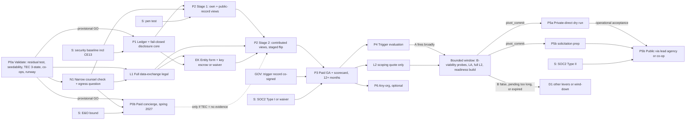

# Buying Power: Synthesized Build Plan

FORGE gate **G6 (Synthesize)** · produced 2026-09-23 · depth `standard` · owner: Matt (founder, matt@ravenpower.net)

**This is the authoritative plan.** It replaces `plan-A.md` and `plan-B.md` for every purpose. A build team, counsel,
or Ultraplan should be able to work from this file alone. It was synthesized from all nine run-dir inputs:

| input | what it contributed |
|---|---|
| `scope.md` (G0) | intent, the founder's steer, the depth floor, `privacy=sensitive` |
| `claims-table.md` (G1/G3b) | 54 fact rows, C1–C54. C39 is partially settled. All rows are search-summary grade. |
| `plan-A.md` (G2, architect lens) | the structural base |
| `plan-B.md` (G3, scanner lens) | pre-mortem discipline, early real-user contact, the public-record-only fallback posture |
| `gap-delta.md` (G3) | 15 agreements, 10 disagreements, the silences, and an over-serialization check |
| `critic-brief.md` (G4a) | correlated errors CE1–CE18, single-plan defects A-1…A-9 and B-1…B-11, rows K1–K8, and risk matrix R1–R23 |
| `tiebreaks.md` (G4b) | 5 binding rulings |
| `founder-decisions.md` | D1 (two-sided pivot gate) and D2 (GPO strictly as contingency) |
| `red-team.md` (G5) | 12 failure modes, F1–F12 (6 High, 6 Medium), each with a mitigation |

**Precedence used to settle every conflict** (highest first):

1. **Founder decisions** D1 and D2, applied exactly.
2. **The five G4b tiebreak rulings**, applied exactly as ruled and not re-argued.
3. **Red-team mitigations** F1–F12. Four of them (F1, F5, F7, F10) touch founder-owned choices and are flagged for sign-off in §0.4.
4. **Critic fixes** (CE1–CE18, A-1…A-9).
5. **Plan-A** as the structural default for everything not settled above (tiebreaks.md closing note).
6. **Plan-B** only where this plan adopts it explicitly and names it.

Appendices A–C trace every conflict, red-team finding and critic finding to the plan change that absorbed it.

### Epistemic key (used throughout)

| marker | meaning |
|---|---|
| `(Cn)` | A claims-table row. Search-summary grade: the page body was not read (G1 provenance note). |
| `(Kn)` | A row the critic added (K1–K8). Same grade. |
| `[unverified — training knowledge]` | Recall that was not checked this session. |
| `[unverified — requires legal review]` | A legal question this plan deliberately leaves to counsel. |
| **Proposed default** | A starting parameter, not a fact. The named owner ratifies or changes it. |
| **inference (G6)** | A conclusion this gate drew. The leap is named. |

Every `[unverified]` item still open is listed in §10, together with the step that settles it.

---

## 0. Executive summary

### 0.1 What Buying Power is

Buying Power helps schools, and later any organization, stop overpaying for SaaS. The architecture is general from
day one.

**The launch product is a renewal desk, not a price library.** At the moment a member must decide whether to renew,
Buying Power puts in front of it:

- its own contract, normalized to an effective unit price with its terms extracted (escalators, auto-renew, notice
  windows);
- where that price sits against peers;
- how many of its seats are actually used;
- a price-reasonableness memo for the procurement file.

**The data comes from public records first** (C41, C43, C44) and from member contributions second. Members pay for the
workflow (C24, C25): a per-renewal concierge brief, a Renewal Desk subscription, or a regional license.

**The broker model is a contingency and never a parallel growth channel (D2).** Buying Power becomes a group-purchasing
program administrator only if *transparency has failed by pre-committed signals* **and** *a GPO is independently proven
viable* (D1). Under that model it earns disclosed vendor fees. For public districts it can operate only through a
public lead agency or an existing co-op, because a private company cannot award a bid-exempt master agreement (C6, C39).

### 0.2 The plan in ten decisions

| # | decision | why | source |
|---|---|---|---|
| 1 | **Validate with a test that can actually fail.** P0a pre-registers a residual-dispersion test with real power (a pooled design of 2–3 products at n ≥ 15–20 each, a regression null model, and a measured noise floor). It also measures **seedability** (how much of each contract public records actually yield), runs a **three-state TEC pre-mortem**, interviews **co-ops**, and produces a **runway budget**. | Both source plans' P0 tests would pass on noise. A G6 simulation shows the naive raw-ratio test passes 42–78% of the time when real residual dispersion is about 1.05 (§6, P0a). | CE1, CE3, CE12, CE15, F11 |
| 2 | **Get revealed preference in the first reachable renewal season (P0b, spring 2027).** Sell paid concierge Renewal Briefs built only from public records, after a *narrow* counsel check. | Stated willingness to pay tests nothing. This protects a full year of evidence against a P1 slip. | CE4, CE15, tiebreak #2 |
| 3 | **One ledger, many lenses.** Plan-A's append-only, versioned line-item ledger with reproducibility hashes, **trimmed of the empty P4/P5 tables**. Those tables arrive in the P4 readiness window. | Bundles, mixed pricing metrics, `service_kind`, and unwinding a poisoning incident all need it. Tables reserved for later phases were premature. | tiebreak #4, CE14 |
| 4 | **Seed from public records, but treat them as authentic, not accurate.** Resolve conflicts toward the *more granular* source. Exclude not-to-exceed totals from unit-price cells. | Board packets sample the contracts where dispersion is smallest (above-threshold, competed), and their totals bias high. | CE1, CE2 |
| 5 | **Counsel owns the disclosure rules; code enforces them, failing closed.** k is counted only over *contributed* observations and at the **price-setting parent**, with **l-diversity**, **banded percentiles**, **partition cohorts**, a fixed recompute cadence, and a **counsel-set minimum data age per data class**. | At k = 5, raw P25/P50/P75 publish three real prices. A diocese's five schools at one price satisfy k = 5. A hard 12-month floor makes the only novel data stale at renewal. | tiebreak #3, CE13f, F4 |
| 6 | **Records law is an output channel too.** A fail-closed `public_regime_member` audience means nothing downloadable by a public-regime member contains contributed data. Strategy content (target, walk-away) is never written into Buying Power's records for those members. | Otherwise every public-district member becomes a silent public-records feed to vendors and aggregators. | F2 |
| 7 | **Contributed data cannot be sold, even in a wind-down.** Contributed price fields get per-tenant envelope encryption, and the key-encryption keys go into **independent escrow that destroys them on a trigger**, paired with an entity-form decision. The alternative is an explicit, member-facing charter waiver. Either must be in place before the first display of contributed data. | Wind-down is an explicit branch of the fallback menu. A contract clause is weakest against an insolvency trustee. | F10, CE7, A-4 |
| 8 | **The pivot is a two-sided contingency, restructured so it can actually fire.** The trigger is **A and B-viability**, with B restated to match D1's own text. **B-readiness** is the exit gate of a **bounded readiness window**. B has three values (true, false, pending), fallbacks are pre-classified, and a runway floor forces a decision. | As drafted, the gate could never fire (B5 was circular). A naive repair would make it vendor-gameable. | D1, D2, F1, F5, F12 |
| 9 | **If the broker comes, it is three channels behind C39, and it cannot grade itself.** Invariants I1–I3 and I6 (a program-independent benchmark) apply. "Recommended" fails closed against a hash-pinned snapshot. Bids are evaluated against a sealed benchmark. Each program has exactly one role, spec-advisor **or** administrator. | Program purchases would otherwise become the benchmark that judges them. Program pages would publish pooled cells. A fee-earning spec drafter invites a bid protest or a Single Audit finding. | C39, CE6, F3, F8 |
| 10 | **Subscriptions continue through the pivot.** Double-charging ends member by member, through a per-member fee offset, with any global proof period capped at 4 quarters. | This avoids a revenue cliff at the moment of weakness and keeps "no double charge" true without a global cost-allocation bar that can be gamed. | tiebreak #5, F7 |

### 0.3 What the synthesis changed, in one screen

- **Removed from plan-A:**
  - the "A false, B strongly true → GPO as a growth channel" row (D2);
  - B4 and B5 as trigger conditions (F1);
  - the P5 tables reserved empty from P1 (tiebreak #4);
  - the overlapping cohort lattice with complementary suppression (CE13f), replaced by partitions;
  - the vendor-quote baseline for A4 and savings-share (A-1);
  - the "recommended with an exception note" path (F3);
  - the default public normalized-price index (CE5).
- **Removed from plan-B:**
  - the vendor-initiated positive trigger (D2);
  - the one-sided negative trigger (D1);
  - the flat schema (tiebreak #4);
  - self-declared org identity and deferred RLS (critic D7, D8);
  - the hard 12-month age floor (tiebreak #3);
  - shipping public-record views with no legal check at all (tiebreak #2);
  - SMBs in the first broker segment (D20).
- **Added (not in either source plan):**
  - seedability, residual-dispersion and noise-floor testing;
  - the P0b paid concierge;
  - the N1 narrow counsel check;
  - the `public_regime_member` audience;
  - contributed-only, price-setting-unit k with l-diversity and banding;
  - I6 and I9;
  - the authenticity-versus-accuracy split;
  - the CE13 security controls;
  - key escrow and the EK gate;
  - the split of A4 into A4-price and A4-volume, a pinned version tuple, and a co-signed decision record;
  - the restated B;
  - the bounded window and the three-valued B;
  - the per-member fee offset;
  - the Mode S / Mode A role split and the involvement log;
  - pseudonymous contributors and honest charter language.
- **Corrected in the critic's own fix.** The critic's P0 criterion ("residual P75/P25 with a bootstrap CI that excludes 1.0") can never fail, because P75/P25 ≥ 1 by construction. This plan gates instead on the **lower bound of the CI** against a threshold set above a **measured normalization-noise floor** (§6, P0a).

### 0.4 ⛔ Needs final founder sign-off before build

Four red-team mitigations change, or give concrete shape to, something the founder already decided or owns. They are
written into this plan as **recommended defaults**, and none of them is final until Matt signs. Declining without the
stated alternative turns three of them (F1, F5, F10) back into **blockers**, per red-team §5.

| item | what Matt already decided or owns | what this plan changes | recommended | alternative | if declined with no alternative |
|---|---|---|---|---|---|
| **F1: how far D2 reaches, plus the bounded readiness window** | D1: adopt plan-A's two-sided gate. D2: GPO work only if transparency's success signals fail. | Plan-A's gate as written **cannot fire**. B5 (firewall and governance built) can only become true *after* P4 builds it, and P4 builds it only *after* the trigger fires. **Fix:** the trigger becomes **A and B-viability**. B4 (legal) and B5 (governance and firewall) become **B-readiness**, the exit gate of a **bounded window** that opens only once A fires. Under the **strict reading of D2**, nothing that faces a vendor or a lead agency (L2 memos, the LA track, term sheets) happens before A fires. Only the passive B1 ledger check and an L2 *quote* are allowed. | **Strict D2.** Window length 2 quarters (a proposed default; Matt sets 2–3, because a public-partner instrument signed from a cold start inside 2 quarters is optimistic, per G6 inference). A **runway reserve** is set aside at the start of P3, sized for the window plus P5a. | **The looser reading:** L2 counsel memos run in parallel with P3, still with no vendor or partner contact. It saves about 2 quarters in exchange for some focus and brand risk. Record it as a dated amendment to D2. | **Blocker.** With neither, the GPO path is unreachable and the scope's "designed trigger" is defeated. |
| **F5: restating Condition B to match D1's own text** | D1: B = "demand concentration for a specific product, a public lead-agency/co-op partner lined up, vendor willingness to pay a fee". | Plan-A's B1–B3 were **weaker than D1**. B1 was automatically true for any annual product once there were about 25 members. B2 was a free letter. B3 could be met by private orgs alone. **Restated:** **B1**, switchable demand for **one named product**; **B2**, priced, signed term sheets that **accept a named fee**, excluding vendors that drove the A4 failures; **B3**, a signed instrument with a **public lead-agency or co-op partner**. A4 is also reported per vendor, so a failure concentrated in two or fewer vendors routes to a targeted-vendor review, not a pivot (§5.4). | Adopt as restated. **Decide explicitly** whether private-direct-only viability may satisfy B3. The recommendation is **no**: private-direct is a dry run (CE10). | An explicit, recorded waiver accepting that B may be met by non-binding evidence, with the reasoning written down. | **Blocker.** Without a restatement or a waiver, a vendor-steerable misfire can walk through a one-way door. |
| **F7: the mechanism behind tiebreak #5** | Tiebreak #5 (binding): subscriptions continue through the pivot and a bounded proof period, and sunset to free only once broker revenue is demonstrated. | The ruling stands. Its example bar ("consecutive quarters of fee revenue covering the transparency product's cost") is effectively unreachable (about $30M of routed sales a year to cover about $300K of cost), and it can be gamed through cost allocation. **Mechanism:** a **per-member fee offset**. Each quarter, Buying Power's net fee share from a subscriber's program purchases is credited against that member's subscription, capped at its price. Any global proof period is **time-boxed to 4 quarters or fewer, with a default outcome set in advance**. Buying Power's own subscription goes on a co-op that does not run edtech-SaaS programs. | Adopt. | The literal global bar, with its cost allocation frozen in the pivot-commit record, plus the same time-box. | Not a blocker. The double charge risks becoming permanent (Medium). |
| **F10: key escrow or waiver, plus entity form** | Nothing yet. This is new, but the founder owns it: it involves cost, corporate structure and exit value. | Before the first display of contributed data (P2 Stage 2), **either** contributed price fields are envelope-encrypted per tenant with key-encryption keys held by an **independent escrow agent or data trustee obliged to destroy them** on an insolvency filing, a wind-down resolution, or a vendor-affiliated acquirer, **or** Matt signs an **explicit member-facing waiver**: the charter states that contributed data may transfer in insolvency, and contributions are limited to extracted terms. Either way it is paired with the **entity-form decision** (PBC, nonprofit data trustee, member-owned, or a C-corp plus a data trust) and a change-of-control clause (CE7). | Escrow, plus a PBC or a data trust. It is also a real differentiator: "your data cannot be sold, even if we fail." | The explicit waiver. | **Blocker.** A silent default would let the likeliest change of control (a wind-down) hand member data to the parties the charter excludes. |

### 0.5 Other founder-owned parameters to ratify (these set numbers; they do not reopen decisions)

- **P0a, before data collection starts:** the pre-registered test design and GO thresholds (§6, P0a). Proposed: the
  90% CI lower bound of residual P75/P25 ≥ 1.10; seedability ≥ 40%.
- **P0b:** the per-brief price and the revealed-preference bar. Proposed: ≥ 10 paid briefs from ≥ 6 organizations.
- **At P0a exit:** the launch state, re-ranked on five factors (§4.1). Texas is the default candidate. California is the
  fallback.
- **Before P3 starts, in the co-signed trigger decision record:**
  - A1–A4 thresholds;
  - restated-B parameters (N, $X, Y);
  - window length;
  - runway reserve and runway floor;
  - the fallback classification;
  - the D2 reading;
  - the pinned version tuple;
  - the **second signer** (an independent advisor, an investor, or an advisory board acting in an advisory role, per F6).
- Pricing bands (§4.4).
- Whether non-member districts' public records may be shown at record level (critic D11, jointly with counsel).
- Whether SOC 2 Type I can be deferred past P3 if buyer evidence shows it isn't required (A-9).

### 0.6 The honest bottom line

- **The idea is not unsound.** Buyer-side aggregation is lawful and proven (C13, C28), and buyers really do lack what
  vendors can already see (C22).
- **The weak leg is capturing value** (critic §3.2):
  - For public districts, headline prices are often already public, so what Buying Power sells is normalization,
    workflow and timing, and willingness to pay for those is unproven.
  - The segment where data is truly novel (private schools) is legally encumbered (CE9).
  - TEC ran this exact arc nine years ago and is not the visible winner (C14–C17, K1).
- **The plan is built to find out cheaply.** P0a and P0b produce an honest GO or STOP by roughly mid-2027, on a
  budget of weeks and counsel fees rather than an engineering team.
- **The GPO is not a rescue.** It needs the same engaged members and trusted data that transparency needs (critic
  §3.4). It is slow: about $100K a year per $10M of routed sales, paid in arrears (plan-A §4.9). On the rough calendar
  in §7, the earliest vendor-fee receipts arrive around 2030.
- **Runway is the constraint nobody has modeled yet.** P0a must produce it.

---

## 1. Design inputs: what the evidence forces

### 1.1 The load-bearing findings and the design response to each

| finding | rows | design response |
|---|---|---|
| **TEC ran this exact arc: give-to-get pricing in 2017, then a $20K premium tier, then a 10% negotiation service. Its fate is still unknown.** | C14–C17, K1 | The P0a pre-mortem is a hard gate, with a three-state outcome and probes that don't need TEC's cooperation (F11). Differentiators are hypotheses, each with a test (§1.2). |
| **Public-district prices are often already public, and vendors already buy them** (GovSpend-style tools) | C22, C40–C44 | Public records seed the dataset. The product is normalization, terms, timing and buyer-side access. Positioning: "vendors already see what you pay." |
| **Public records sample the wrong population.** Board packets carry above-threshold, often competed contracts, with not-to-exceed totals and no quantities. Sub-threshold SaaS, where discrimination is most plausible, is the least visible. | CE1, K7, K8 | P0a measures seedability by contract-size band and samples sub-threshold contracts on purpose. Not-to-exceed totals are excluded from unit-price cells. Contributions and usage data carry the sub-threshold picture. |
| **Antitrust:** buyer co-ops are lawful under the rule of reason, but the info-exchange safe harbors are gone and new guidance is pending. The 2025 worker guidelines are a closer, *buyer-side* intermediary template than RealPage. | C28–C34, K4, K5 | Full L1 is a named dependency, and it gates contributed-data display only (tiebreak #2). The disclosure policy is versioned data owned by counsel. There are no coordination features. L1 must address K4 and the seller-side facilitation theory. |
| **Bid-exempt group contracts for public districts require a public lead agency, a JPA or an existing co-op.** | C6, C8, C9, C11, C38, C39 | From day one, a product rule (R-C39): never present anything as bid-exempt. The broker phase has three channels. I1–I3 are enforced in code once programs exist (P4). |
| **The premise rests on one conflicted source, about 10 years old.** The rest is anecdote (C46) and qualitative opacity findings (C48, C49). Waste evidence is stronger. | C45–C54 | A pre-registered residual-dispersion test (P0a), plus revealed preference (P0b). Utilization is first-class, and utilization-first is the P0 pivot branch. |
| **Texas has three entrenched co-ops** (BuyBoard, Choice Partners, TIPS). TIPS serves private schools too. | K6 | Co-ops are both *competitors* and possible licensees. Co-op interviews happen in P0a. The launch state is re-ranked on co-op saturation (§4.1). |
| **Records law is an output channel.** Artifacts given to public members can be obtained by vendors. | F2 (Gov't Code §552.002/.022 `[unverified]`) | A fail-closed `public_regime_member` audience, a records-request clause, watermarking, and L1 deliverable 9. The question is also added to the N1 narrow check. |
| **Transparency can raise prices.** In Denmark, published transaction prices raised prices 15–20% (K2). | K2, CE5 | Success is measured by difference-in-differences, not by dispersion. There is no public price index by default. The low tail of the distribution is monitored. |
| **GPO failure is correlated with transparency failure.** | critic §3.4 | The two-sided gate (D1), a restated B, a named non-GPO fallback menu, and a runway floor. |

### 1.2 Why Buying Power, given TEC: differentiators as hypotheses (plan-A §1.2, with F11 folded in)

TEC's actual fate is unknown (C17, K1). This plan does not claim to know why TEC failed to become the category winner.
Each row below is a hypothesis with a P0a test. **If P0a establishes a TEC failure cause that is not in this table,
P0a fails its gate until the plan answers it.**

| # | hypothesized TEC failure cause (inference) | Buying Power's design response | P0a test |
|---|---|---|---|
| T1 | **Cold start.** Collecting contracts is labor that districts don't have. | Seed from public records. "Claim, don't upload." Stewards do the extraction. | Contribution rates from TEC or former members. Seedability measurement (CE1). |
| T2 | **Data not comparable.** Headline totals, with hardware mixed in (C45). | SaaS-only scope. Normalization to effective unit price, terms and bundles. | The residual-dispersion test, run on both raw and normalized prices. |
| T3 | **A library, not a workflow.** | A product driven by renewal events: a Renewal Brief 120 days before the notice deadline. | Interviews: when did the buyer last *use* a benchmark? |
| T4 | **Knowledge without leverage.** | The brief, usage-aware true-down, and A4-price measures it. The broker contingency exists for exactly this case. | Interviews with buyers who had benchmarks. P0b outcomes against the prior-term price. |
| T5 | **Dependence on a partner that a vendor later owned** (LearnPlatform → Instructure) | Own the stack. An honest charter. Key escrow (F10). Deciding the entity form (CE7). | Whether districts distrust analytics owned by a vendor. |
| T6 | **A buyer-paid 10% fee is expensive and hard to procure.** Note that C16 does not say who paid; P0a settles it. | Buyer-paid pricing kept under purchase thresholds. The member-free, vendor-paid norm is used only after the pivot. | How many took the 10% tier, and who paid (B-10). |
| T7 | **TEC is alive and doing fine.** | Compete where TEC is weak, or partner with it. | Current-activity evidence (F11 probes). |

**The TEC criterion has three states (F11).** P0a's TEC finding is recorded as one of:

1. **Cause established.** It passes if the cause is addressed above or a new design response is added.
2. **Indirect evidence only.** It passes if that evidence is consistent with causes already addressed.
3. **No evidence.** It passes *provisionally only*. P2 Stage 2 is then gated on P0b's revealed-preference result,
   because the base rate set by the prior attempt stands unrebutted.

Silence from TEC is evidence about the probe (cause class F/I), not about the market.

**Probes that don't need TEC to cooperate:**

- TEC's IRS Form 990 filings (IRS TEOS or ProPublica Nonprofit Explorer `[unverified — confirm the EIN and that it files]`);
- Wayback Machine snapshot history;
- board-packet searches for TEC membership or fee approvals, and for when they end;
- interviews with *former member districts* (C16's 100+).

The same logic applies to LearnPlatform (C19) and GovSpend's agency product (C23). If P0a demos show that either
already serves normalized, buyer-side price benchmarks in the launch state, the STOP/PARTNER branch applies.

### 1.3 The premise on four legs, and how each is tested (critic §3)

| leg | claim | evidence state | the step that tests it |
|---|---|---|---|
| P1 | Vendors price-discriminate against schools on SaaS. | Unproven. It is hardest to observe exactly where it would be largest (CE1). | P0a residual dispersion, with a stratified sample |
| P2 | A transparency product can capture value. | **The weakest leg.** | P0b revealed preference, then the P3 scorecard (A1–A3) |
| P3 | Buying Power can beat prior art and incumbents. | TEC's base rate counts against it. Co-ops are unexamined. | P0a: TEC three-state finding, demos, co-op interviews |
| P4 | A GPO rescues the business if P2 fails. | Correlated with the failure of P2. Slow and low-margin. | The pivot gate (§5): A-and-B-viability, with B restated |

---

## 2. Product model

### 2.1 Segments: same product, different value, different law

A segment is **data on each organization** (`org_type`, `procurement_regime`, `records_regime`), not a marketing
label. Disclosure, contribution terms, records egress and broker eligibility all key off it.

| segment | pricing already public? | what's new from Buying Power | contribution posture (L1 decides; CE9) | records regime → artifact egress (F2) | broker vehicle (P5, contingency only) |
|---|---|---|---|---|---|
| Public school districts | Often (C40–C43), but mostly above-threshold totals (CE1) | Normalization, terms, timing, renewal workflow, buyer-side access | Voluntary upload is a counsel question, **not** "low risk" by default (CE9) `[unverified — requires legal review]` | **Public regime.** Exported artifacts are public-audience only. | Public lead agency, an existing co-op (`partner_coop`), or a sub-threshold rate card (C6, C9, C39) |
| Charter schools / CMOs | Varies by state `[unverified — training knowledge]` | As public or as private, depending on regime | Per regime | Per `records_regime`, resolved per org | Per regime |
| Private / independent / diocesan schools | No (C44) | Genuinely novel data, plus the public benchmark | **Highest risk** (confidentiality clauses). Branch (a) full, (b) extracted terms only, or (c) consume only. | Private regime. Artifact confidentiality comes from the member agreement. | Private-direct (a dry run, CE10). TIPS already serves Texas private schools (K6). |
| Later (P6): municipalities, nonprofits | Municipalities yes; nonprofits no | Same engine, new cohorts | Per regime | Municipalities are public regime | Mixed |
| **Not planned: companies** | No | — | Higher info-exchange risk (C32) | — | Excluded (critic D20; the corporate category is crowded, C24) |

### 2.2 Day one for a member

**A public district in the launch state:**

1. **Sign-in and verification.**
   - The admin signs in with Google Workspace or Microsoft Entra SSO, with MFA.
   - The org is matched to its NCES LEA ID `[unverified — training knowledge that NCES covers all US public LEAs]`.
   - Authority is confirmed by email domain, plus a human call for the first admin.
   - The vendor-domain blocklist stops vendor email domains from holding member roles.
2. **The admin accepts the member agreement.** It includes:
   - the antitrust compliance policy;
   - the **records-request clause** (F2): notify Buying Power of any request touching its materials, and route it
     through third-party notice;
   - artifact confidentiality;
   - the honest data charter (F9).
3. **"We found N of your contracts in public records."**
   - Each contract is normalized and linked to its source.
   - The member's job is to confirm, correct or add.
   - Contracts backed only by a not-to-exceed total are shown as *"total only: add your order form to see a unit
     price"* and are excluded from unit-price cells (CE1).
4. **Immediately visible:**
   - The **renewal calendar**: term end, notice deadline, auto-renew, escalator.
   - The **position of each product against public-record peers**, in partition cohorts, as **banded** percentiles.
5. **Contributed-data cells are *off* by default for public-regime members.**
   - They appear only in-app, view-only, and only in a state where the L1 records-egress memo concludes they can be
     protected (F2).
   - The UI says so plainly: *"additional peer data from contributing members is not shown to public agencies in this
     state."*
6. **Optional usage upload** (seats licensed vs. active; C20, C51). It turns "am I overpaying per seat?" into "am I
   paying for seats nobody uses?"

**A private school:**

1. The same SSO and verification. The school is matched to its NCES PSS ID where one exists
   `[unverified — training knowledge]`, otherwise to its EIN or domain.
2. **Accept the member agreement and the contribution terms**, using the branch L1 chose (CE9):
   - **(a) Full contribution.** Attest per document. `retained = false` is the default: extract the terms, then discard
     the document (F9).
   - **(b) Extracted terms only.** The member keys or uploads, a steward extracts, and the document is never kept.
   - **(c) Consume only.** The school sees public-record benchmarks and any contributed cells it is permitted to see,
     and contributes nothing.
3. Under (a) or (b), upload or email-forward 3–10 SaaS order forms or invoices. Email goes to a **per-tenant secret
   address**, is checked for DMARC alignment, and is **held until the member confirms** it (CE13d).
4. The school sees benchmarks.
   - Private-only cells use a stricter policy: a higher k, or corroboration (CE13e).
   - Early on they will often be suppressed, and the UI says so rather than hiding it.

**What every member can do on day one:**

- see its own contracts normalized, and its renewal deadlines;
- see its percentile band;
- 120 days before a notice deadline, receive a **Renewal Brief**:
  - its current effective price, and the cohort's **banded** P25/P50/P75;
  - its escalator against the peer norm;
  - seats used vs. seats bought;
  - a **clauses-to-request checklist**, drawn from *term-prevalence cells* computed by the disclosure engine under the
    same k and l rules (A-5), never from any one peer's extracted terms;
  - a **target and walk-away worksheet the member fills in itself**, client-side, which is never written to Buying
    Power's records for public-regime members (F2);
- receive a **price-reasonableness memo** for the procurement file.
  - It is built only from public-audience cells for public-regime members.
  - It carries methodology disclaimers (CE17).
  - After any pivot, it refuses to issue, or prominently flags, any product sold through a Buying Power program (CE17).

**Why the memo matters.** Federal-funds procurement standards (C36) require documenting price reasonableness, and in
some cases a cost or price analysis (2 CFR 200.320 and 200.324 `[unverified — training knowledge; N1 confirms the
exact language]`). That turns nice-to-know data into an artifact someone *has* to produce. P0a interviews test whether
purchasing directors see it that way.

### 2.3 Artifacts and the records-law egress rule (F2)

A public-regime member's copy of anything Buying Power gives it can become a public record. Examples: a memo attached
to a board agenda item, then posted to BoardDocs and harvested by aggregators (C22, C43); or a PIA request to the
member district for "all Buying Power reports". Buying Power receives the §552.305 notice (K8) only if the district
seeks a ruling. The rule therefore **fails closed, whatever counsel concludes**.

| artifact | private-regime member | public-regime member |
|---|---|---|
| In-app benchmark view | Member-audience cells (public-record and contributed) | Public-record cells. Contributed cells **off by default**; in-app view-only only where L1's egress memo clears that state. |
| Renewal Brief (download, print, email) | Member-audience cells, watermarked | **Public-audience cells only**, meaning cells derived from public records, watermarked. Target and walk-away are client-side only. |
| Price-reasonableness memo | Member-audience cells, disclaimers | Public-audience cells only, disclaimers, watermarked |
| Export (CSV or PDF) | Own data plus member-audience cells, formula-neutralized (CE13c) | Own data plus public-audience cells only |
| Concierge documents (P0b; P2 concierge mode) | As a brief | As a brief. Public-record data only in P0b, whatever the regime. |

**Supporting controls:**

- Every issued artifact is logged in `artifact_issue`, with its audience, the cells it used and a watermark ID, so a
  leak can be attributed.
- Buying Power pre-files its proprietary-information position with each public member district.
- **Accepted residual.** Artifact content derived from public records will be public. That is acceptable because it was
  public already. Leakage of the *paid product* through Buying Power's own public-record compilations is an accepted
  Medium commercial residual.

### 2.4 Data flow

```
IN                                              CORE (single source of truth)                                   OUT (all via disclosure engine)
records requests / check registers ─┐
board packets (C43) ────────────────┼─► document ─► isolated extraction worker ─► steward review ─► AGREEMENT + LINE_ITEM ledger
member upload / secret-address email┤    (sanitized,   (LLM: no tools, 1 doc,      (rasterized     (append-only; contributed price
usage exports (C20) ────────────────┘     scanned)      schema-constrained)         viewer)          fields envelope-encrypted per tenant)
                                                                                                          │
                                                                          normalization (versioned, pure) ▼
                                                              PRICE_OBSERVATION (derived; pseudonymous contributor;
                                                                  price-setting unit; acquisition_channel; encrypted)
                                                                                                          ▼
                                            BENCHMARK_SVC — sole cross-tenant reader — DISCLOSURE ENGINE (policy vN)
                                            audiences: own │ member │ public_regime_member │ public
                                                  │            │               │                   │
                            own contracts, renewals   member cells   in-app (default off for     exported artifacts to public
                                                                     contributed) + public cells  members; prospect reports;
                                                                                                  [P5] program pages
[P4+] vendor sales reports ─► separate vendor-portal deployable ─► fee ledger / per-member offsets
      (reconciled against member-side agreements; NEVER a benchmark input — I4; never renders comparison cells)
```

**Flow rules:**

- Data enters only as a document or a provenance-carrying record.
- Nothing reaches another member except through `benchmark_svc`.
- Nothing leaves the app for a public-regime member except public-audience cells (I7).
- Nothing reaches a vendor, with one exception: after P4, a vendor sees its own program records.

### 2.5 Trust in the data

**Threat model.** This is plan-A §2.4 plus CE2, CE13 and F4. The dominant *real* risk is honest error. The
adversarial rows are what separate this plan from TEC-era give-to-get.

| threat | actor | control(s) |
|---|---|---|
| Honest error: a multi-year total read as annual, a bundle read as one SKU, per-teacher read as per-student, a not-to-exceed read as actual | members, stewards, public records | Steward review. Unit checks (per-student price × enrollment ≈ total). `granularity_confidence` on every agreement. Not-to-exceed-only totals excluded from unit-price cells. **Conflicts resolve toward the more granular source, adjudicated by a steward**, not automatically toward the public record (CE2). |
| A fake member posts inflated prices to anchor buyers high | vendor, reseller | Registry verification (NCES, EIN), vendor-domain blocklist, a human call for the first admin, a document required before data counts, a weight cap per price-setting unit |
| Fake low prices for a rival's product | competing vendor | The same identity controls, plus documents, robust outlier review, and the weight cap |
| **Forged document** ("document verified" confirms the extraction, not that the document is real) | anyone | `authenticity_signals` kept separate from `extraction_verified`: corroboration against public records, PO/invoice consistency, vendor-document metadata. Private-only cells need a higher k or corroboration (CE13e). |
| Sybil orgs used to break k-anonymity | anyone | Only verified orgs count. k is counted at the **price-setting unit** (below). |
| **Hierarchy homogeneity** (F4): a diocese's five schools, one negotiated price, five "contributors" | legitimate orgs | k and the weight cap are counted at the **ultimate price-setting parent**: `parent_org_id` is collapsed along `controls_purchasing` edges, and an unknown edge type collapses, failing closed. Identical `(seller, net unit price, term_start)` tuples count as one unit. **l-diversity** (l ≥ 3 distinct prices). A must-fail fixture tests all of this. |
| Differencing: overlapping cohorts, or temporal (a contributor joins or leaves) | a member | **Partition-only cohorts**, with no overlapping lattice until a statistician signs off. No ad-hoc filters over contributed data. A fixed recompute cadence with minimum-change thresholds. Banded percentiles below n ≈ 20 (CE13f). |
| Alias poisoning: one tenant's raw text remaps prices to a rival's product | a member | Aliases apply only after steward confirmation, never automatically from a single tenant's input (CE13g). |
| Prompt injection via an uploaded document | anyone | The extraction model has **no tools**, sees a single document, and must return schema-constrained output. There are no cross-tenant few-shot examples. Normalization sanity checks validate the output (CE13a). |
| A malicious document compromises a steward session, which has cross-tenant privilege | anyone | Server-side rasterization, a sandboxed viewer, strict CSP, and short-lived steward sessions with step-up authentication (CE13b). Upload hardening per CE13c: a type allow-list, size and page caps, scanning, and parsing in an isolated worker. |
| Stale data presented as current | the system | Every cell shows its effective-date window and n-bucket. Freshness SLOs per product. |
| Steward error or misuse | staff | Least-privilege roles, an append-only audit of every cross-tenant read, and a second reviewer for any deletion |

**Evidence tiers and authenticity.** Authenticity and accuracy are separate axes (CE2).

| tier | what it is | authenticity | in the benchmark by default? |
|---|---|---|---|
| `public_record` | A document fetched **directly** from a .gov or district domain, or received from a records request | `gov_fetched_direct` | Yes, weighted by `granularity_confidence`. Not-to-exceed-only totals are excluded from unit-price cells. |
| `member_document_verified` | A member's contract, invoice or PO with a steward-confirmed extraction | `member_supplied`, plus `authenticity_signals` | Yes, under the contributed-data rules |
| `member_self_reported` | A form entry with no document | none | **No.** Shown only to the contributor. Upgraded if a document is attached. |
| `vendor_reported` | P4+ sales reports | `vendor_supplied` | **Never** (I4) |

A "public record" forwarded by a member is `member_supplied`, not `public_record`.

**Trust weight.** Each observation is weighted by four inputs:

- its evidence tier;
- its granularity confidence;
- the reputation of its **pseudonymous** contributor (history of corrections and disputes);
- corroboration by other sources, and a robust outlier score (MAD within the cell).

The weight cap applies per price-setting unit.

**Right of reply (A-3 resolved).** A vendor can dispute a *public-record-derived* observation through an out-of-band
intake form.

- There is no vendor account and no vendor-facing product before P4.
- A steward adjudicates, and the ledger records the decision append-only.
- Responses never confirm or deny that contributed data exists.
- Intake is rate-limited.

**Reproducibility, stated honestly.** Every served cell records
`(observation_set_hash, normalization_version, policy_version, cohort_version, catalog_version)`.

- A cell can be recomputed exactly for as long as its inputs exist.
- When a contributor withdraws, or when escrowed keys are destroyed, those inputs are crypto-shredded. The cell's hash
  survives but its inputs do not. The charter says exactly this (A-4).

### 2.6 Hard product boundaries

- **What members never see:**
  - another member's document;
  - any price linked to another member's identity;
  - any contributed cell that fails k, l or the age floor;
  - any contributed cell in an artifact that leaves the app for a public-regime member (I7).
- **Vendors never see the pooled layer** (I5).
  - The charter wording is honest: *"never sold or shown to sellers, except as compelled by law. We will notify you
    and seek protective treatment"* (F9).
  - Contributed data is escrow-protected against a sale in insolvency (F10), or the waiver is disclosed.
- **No coordination features, ever,** outside a formal joint-purchasing program that counsel has signed off (C28, C34).
  - No member-to-member messaging about vendors.
  - No pledges or price ceilings.
  - No boycott tooling.
  - Negotiation support is individual.
- **No public normalized-price index by default** (CE5).
  - Public surfaces are limited to personalized prospect reports built from the prospect's own public records and
    public-record peers.
  - After the pivot, program pages show only public-cleared cells.
  - Any wider public surface needs explicit counsel limits, covering the seller-side facilitation theory (L1).
- **No student data, by design.**
  - Extraction strips personal data.
  - The SDPC National DPA is the low-friction answer to district DPA requirements (C26).
  - Whether this keeps Buying Power outside the student-data-processor regime is `[unverified — requires legal review]`.
- **Rule R-C39.** Nothing is ever presented as bid-exempt. No surface, template or artifact may describe any agreement
  as bid-exempt, a qualifying cooperative contract, or piggybackable, unless `can_purchase_via` (I3) returns eligible.
  - Enforced by manual review in P0b, and by a CI copy lint from P1.
  - This is how C39 lives in the product *before* any program tables exist (CE14).

---

## 3. Technical architecture and data model

### 3.1 Principles

1. **One write model.** `agreement`, `line_item`, `document` and `steward_decision` are the only authoritative
   pricing state. Everything else is a rebuildable projection (plan-A).
2. **Policy is versioned data with named owners.**
   - The data lead owns normalization rules, the cohort partitions and catalog releases.
   - Counsel owns the disclosure policy and the jurisdiction rules.
   - From P4, the advisory board holds approval rights over the methodology tables.
3. **One cross-tenant reader.** Only `benchmark_svc` reads across tenants. This is enforced by Postgres RLS and role
   grants, not only by application code (critic D7).
4. **Fail closed at every disclosure boundary.** An unknown audience is treated as `public`. An unknown hierarchy edge
   collapses to one unit. A suppressed comparison means "not evaluated". An unknown records regime is treated as public.
5. **Minimize what exists.**
   - Documents are not retained by default for private-regime contributions.
   - Contributors are pseudonymous after verification.
   - Contributed price fields are encrypted at rest, and their keys can be escrowed (F9, F10).
6. **Trust boundaries become deployables; nothing else does.**
   - The system is a modular monolith.
   - The only separate deployable is the P4+ vendor portal.
   - There are no microservices, streams or warehouse. At about 10⁵ agreements this is small data (inference, to be
     revisited at P6).
7. **Defer, don't reserve (tiebreak #4, CE14).**
   - Keep the cheap generality from day one: one party model, extensible agreement kinds, regimes as data, and an
     `acquisition_channel` field.
   - `program`, `program_eligibility`, `vendor_sales_report`, `fee_ledger_entry` and `member_fee_offset` arrive in the
     P4 readiness window, built to the L2 legal model that exists by then.
   - Until then, C39 is enforced as the product rule R-C39.
8. **Generality is proven by test.** A synthetic `us_municipality` fixture onboards from P1 with zero changes to the
   ledger, normalization or benchmark modules.

### 3.2 System shape

```
┌──────────────────────────── member web app (P2) ──────────────────────────────┐
│ SSO+MFA · org verification · contracts · renewals · benchmarks (banded) ·     │
│ briefs/memos (audience-aware, watermarked) · uploads · usage import ·         │
│ client-side target/walk-away worksheet · regional dashboard (delegated only)  │
└──────────────────────────────────┬────────────────────────────────────────────┘
                                   │ member-scoped API; RLS session bound to tenant
┌──────────────────────────── core modular monolith ────────────────────────────┐
│ identity & orgs (hierarchy + delegation) │ catalog (releases) │ ledger        │
│ ingestion (records-request tracker, board-packet capture, secret-address      │
│ email) │ normalization (pure, versioned) │ benchmark_svc + disclosure engine  │
│ (audiences, k/l/banding, cadence) │ workflow (renewals, briefs, memos,        │
│ artifact_issue log) │ governance (policy, jurisdiction rules, decision        │
│ records, involvement log, audit, disputes) │ billing (P2) │ scorecard (P3)    │
│ [P4+] programs · eligibility · fee ledger · member offsets (flag-gated)       │
└───────┬──────────────────────────────┬──────────────────────────┬─────────────┘
        │                              │                          │
 Postgres (RLS; per-module     object storage (documents;   KMS: per-tenant DEKs;
 schemas; encrypted contributed envelope-encrypted)          KEKs held by independent
 price columns)                                              escrow/trustee (F10)

┌── isolated extraction worker ──┐ ┌── steward console (internal) ──┐ ┌── vendor portal (P4+ only) ──┐
│ sanitize/scan/parse; OCR; LLM  │ │ rasterized sandboxed viewer;  │ │ separate deployable + auth   │
│ (no tools, 1 doc, schema out,  │ │ strict CSP; step-up auth;     │ │ realm; DB role with zero     │
│ zero-retention provider)       │ │ short sessions; audited       │ │ grants on pooled tables;     │
└────────────────────────────────┘ └───────────────────────────────┘ │ never renders comparisons   │
                                                                      └──────────────────────────────┘
```

**Stack.** The stack is not load-bearing; boring, team-dependent choices are fine (plan-A).

- **Backend:** Python (Django or FastAPI). Django's admin shortens the steward console.
- **Database and jobs:** Postgres with RLS, and a job queue that runs on Postgres.
- **Storage:** S3-compatible object storage.
- **Key management:** cloud KMS, with the key-encryption keys in an account controlled by the escrow agent or trustee.
- **Extraction:** OCR plus an LLM under **zero-data-retention, no-training** terms (a P1 pre-gate, because data is
  `privacy=sensitive`).
- **Frontend:** server-rendered.

### 3.3 Data model (revised)

Tenant-owned tables carry `owner_tenant_id` and are protected by RLS. The system tenant `public_records` owns
everything harvested from government sources.

```text
-- ── Parties: ONE party model ──
organization(id, display_name, org_type_code, parent_org_id NULL,
             parent_relation NULL,        -- controls_purchasing | affiliation   (F4; NULL/unknown ⇒ treated as controls_purchasing)
             jurisdiction_code, procurement_regime_code, records_regime_code,   -- records_regime drives public_regime_member (F2)
             public_authority BOOLEAN,    -- may award a bid-exempt master agreement (used from P4)
             verification_status, verified_at)
org_type(code, label, size_metric_codes[], registry_scheme, default_cohort_dims[])
org_identifier(org_id, scheme, value)                      -- nces_lea | nces_pss | ipeds | ein | uei | state_id ; unique(scheme,value)
org_size_metric(org_id, metric_code, value, as_of, source)
org_role(org_id, role, effective_from, effective_to)       -- member | vendor | reseller | coop | channel_partner  (lead_agency: P4)
app_user(id, org_id, email, idp, role, mfa, verified_at)   -- vendor-domain blocklist enforced for member roles
membership(org_id, tier, member_agreement_version, antitrust_policy_ack_at,
           contribution_terms_version, contribution_branch,    -- full | extracted_terms_only | consume_only  (CE9)
           records_clause_version NULL,                         -- public regime (F2)
           status)
delegation(parent_org_id, child_org_id, scope, granted_by_user_id, granted_at, revoked_at)   -- regional license consent (A-2)

-- ── Catalog ──
product(id, vendor_org_id, name, category_code)
offering(id, product_id, edition, pricing_metric_code, active_from, active_to)
offering_alias(id, raw_text_norm, vendor_org_id, offering_id, confidence,
               confirmed_by NOT NULL-before-apply, confirmed_at)   -- CE13g: never auto-applied from one tenant
pricing_metric(code, label, denominator_metric_code NULL)
catalog_release(version, released_at, change_log)                   -- part of the pinned tuple (F6)

-- ── Ledger: the source of truth (append-only; a correction is a new version with supersedes_id) ──
document(id, owner_tenant_id, source_kind,        -- public_record_request | board_packet | check_register | member_upload | email_ingest | vendor_report
         source_ref, sha256, storage_uri NULL, retained BOOLEAN,        -- default false for private-regime contributions (F9)
         authenticity_class,                      -- gov_fetched_direct | member_supplied | vendor_supplied  (CE2)
         sanitize_status, pii_scan_status, received_at)
agreement(id, owner_tenant_id, version, supersedes_id NULL,
          kind,                                   -- FK agreement_kind (quote|order_form|contract|renewal|invoice|purchase_order; P4 inserts master_agreement, participating_addendum)
          buyer_org_id NULL, seller_org_id, reseller_org_id NULL,
          price_setting_org_id NULL,              -- F4: defaults to ultimate controls_purchasing ancestor of buyer; steward may set negotiating entity
          acquisition_channel,                    -- direct | reseller | coop_vehicle | bp_program (bp_program activated in P4)  (CE3, F5-B1, I6)
          coop_vehicle_ref NULL, awarding_org_id NULL,
          term_start, term_end, auto_renew, notice_days, escalator_pct, escalator_cap_pct, payment_terms,
          provenance_class,                       -- public_record | member_document | member_self_reported | vendor_reported
          granularity_confidence,                 -- nte_total_only | total_with_qty | line_item_full  (CE1/CE2)
          source_document_id NULL, status)
line_item(id, agreement_id, offering_id NULL, raw_description, service_kind,   -- subscription | implementation | training | support | hardware
          quantity, pricing_metric_code,
          list_unit_price, net_unit_price, extended_price,   -- ENCRYPTED columns under owner tenant DEK when owner ≠ public_records (F10, A-4)
          term_months, bundle_group_id NULL, currency)
extraction_run(id, document_id, model_id, prompt_version, output_json, schema_valid, status)
steward_decision(id, subject_type, subject_id, decision, reason, actor_id, at)     -- append-only
dispute(id, subject_type, subject_id, raised_by_org_id NULL, intake_channel, evidence_document_id, status, resolution, decided_by)

-- ── Derived: rebuildable projections, never hand-edited ──
price_observation(id, line_item_id, normalization_version, offering_id, effective_date,
                  annual_unit_price, annual_effective_price_per_denominator,  -- ENCRYPTED for contributed rows; decrypted only in benchmark_svc memory
                  cohort_keys JSONB, provenance_class, evidence_tier, authenticity_signals JSONB,
                  trust_weight, contributor_pseudonym, price_setting_unit_pseudonym,   -- F9 + F4
                  acquisition_channel)                                                 -- I6
benchmark_cell(id, offering_id, pricing_metric_code, cohort_id, time_window,
               audience,                    -- own | member | public_regime_member | public
               basis,                       -- all | program_independent  (I6)
               n_bucket, k_units, l_distinct,
               p25_band, p50_band, p75_band,           -- banded/rounded or noised when n < ~20 (CE13f); never raw at small n
               suppressed, suppression_reason,
               observation_set_hash, normalization_version, policy_version, cohort_version, catalog_version,
               cadence_epoch, computed_at)
term_prevalence_cell(id, term_code, cohort_id, audience, share_band, k_units, suppressed, ...)   -- "clauses to request" (A-5)
renewal_event(agreement_id, notice_deadline, term_end, status)
usage_snapshot(org_id, offering_id, period, licensed_units, active_units, source)

-- ── Governance ──
disclosure_policy(version, segment_scope, params JSONB,  -- see §3.6
                  counsel_approved_by, approved_at, effective_from)
cohort_definition(id, version, org_type_code, partition_dims JSONB)   -- partitions only (CE13f)
normalization_rule_set(version, rules JSONB, owner, approval_record_id NULL, effective_from)   -- approval required from P4
jurisdiction_rule(jurisdiction_code, rule_type, value JSONB, citation, owner, counsel_verified, verified_at, review_by)
     -- rule_type: records_pricing_public | records_egress_protectable | negotiation_exception
     --          | small_purchase_threshold (state/local; A-8) | coop_piggyback_scope | ratecard_permitted | ethics_gift_limits
decision_record(id, kind, body JSONB,     -- kind: p0_preregistration | trigger_thresholds | window_open | pivot_commit | ...
                pinned_versions JSONB,    -- (normalization, cohort, catalog, policy) (F6)
                signed_by[] (≥2 required), signed_at, supersedes_id NULL)
artifact_issue(id, member_org_id, artifact_kind, audience, cell_ids[], watermark_id, issued_at)   -- F2
involvement_log(id, counterparty_org_id, topic, contains_spec_content BOOLEAN, at, by)           -- F8, from first contact
key_escrow_binding(tenant_id, kek_ref, escrow_agent, destroy_triggers, status)                  -- F10 (or NULL + waiver flag)
audit_event(id, actor_id, action, subject_type, subject_id, cross_tenant BOOLEAN, at)            -- append-only

-- ── Introduced in the P4 readiness window (NOT reserved from P1; tiebreak #4) ──
program(id, name, channel,               -- public_lead_agency | partner_coop | private_direct | sub_threshold_ratecard
        role_mode,                        -- S (spec advisor, flat fee) | A (administrator, fee-earning)  (F8)
        awarding_org_id, solicitation_ref, category_scope, eligible_regimes[], term_start, term_end,
        fee_terms JSONB, independent_snapshot_hash, independent_snapshot_cell_ids[], recommended_status, status)   -- F3/I9
program_eligibility(program_id, org_id, interlocal_document_id NULL, eligible_from, status, reason)
vendor_sales_report(id, program_id, vendor_org_id, period, submitted_at, document_id)
fee_ledger_entry(id, program_id, vendor_org_id, period, reported_sales, fee_due, fee_received, split JSONB,
                 reconciliation_status, variance_vs_member_records)
member_fee_offset(member_org_id, period, net_fee_share_attributed, credit_applied, subscription_cap)          -- F7
```

**Why `acquisition_channel` exists from P1.** It is the one small field that serves four needs at once:

- the channel term in P0a's regression (CE3);
- B1's "not already buying through a co-op" test (F5);
- I6's exclusion of program purchases (CE6);
- the co-op-share measurement in the co-op interviews (CE12).

**Deduplication across tenants.** One underlying contract can exist both as a harvested public record and as a member
upload.

- A steward links the two, and the action is audited.
- The linked observation takes the most granular source's values.
- Its disclosure class is **contributed** if any field came only from the member document. This fails closed.

### 3.4 Invariants

Each invariant is enforced as a DB constraint, trigger or role grant, **and** in the service layer. Each has a
failing-case test.

| id | invariant | live from |
|---|---|---|
| **R-C39** (product rule) | No surface, template or artifact presents anything as bid-exempt or as a qualifying cooperative contract unless I3 returns eligible. Enforced by a CI copy lint plus manual review of artifacts. | P0b (manual), P1 (lint) |
| I1 | If `program.channel = public_lead_agency`, the awarding org has `public_authority = true` and holds the `lead_agency` role. | P4 |
| I2 | If `agreement.kind = master_agreement`, then `program_id` is not null and `awarding_org_id = program.awarding_org_id`. | P4 |
| I3 | `can_purchase_via(program, org)` gates any bid-required org. It returns **eligible** in only two cases. **Route 1:** all three of (a) the channel is `public_lead_agency` or `partner_coop`, (b) an eligibility row exists with an interlocal document on file (C11), and (c) the state's `coop_piggyback_scope` covers the category (C38). **Route 2:** a `sub_threshold_ratecard` channel, with the order under the org's `small_purchase_threshold`, and `ratecard_permitted` in its state. Every refusal returns a reason. **Its output is framed as "the lead agency's position; your counsel decides"**, and its rules are date-stamped with named owners (A-6). | P4 |
| I4 | No row with `evidence_tier = vendor_reported` is ever an input to any benchmark or prevalence cell. | P1 |
| I5 | Only the `benchmark_svc` role reads `price_observation` across tenants. From P4, the `vendor_portal` role has zero SELECT on `price_observation`, `benchmark_cell`, `agreement` and `document` outside its own program scope, and it never renders comparison cells. | P1 / P4 |
| **I6** (program-independent basis; CE6) | Any cell used to judge, rank or recommend a program, or displayed beside one, uses `basis = program_independent`. That basis excludes every observation with `acquisition_channel = bp_program`. The program's share of each `all`-basis cell is shown, and comparisons are made **net of the disclosed fee**. | Field from P1; enforced from P4 |
| **I7** (egress; F2) | Any artifact that leaves the app (download, export, print, email) for a member with a public `records_regime` is computed at audience `public`. Contributed cells for public-regime members are in-app only, and only where `jurisdiction_rule.records_egress_protectable` is true. **Default off.** | P1 (engine); P0b (manual rule) |
| **I8** (counting; CE13f, F4) | k and the weight cap count only **contributed** observations, at the **price-setting unit**, and require **l** distinct price values. Public-record observations never pad a contributed k. A mixed cell is served only if its contributed subset alone passes, otherwise it falls back to public-record-only. | P1 |
| **I9** (fail-closed recommendation; F3) | A program may carry `recommended` only if a **non-suppressed** program-independent comparison was captured at award as a hash-pinned snapshot on the program row. If the comparison is suppressed, the status is "not evaluated — insufficient independent data". **There is no exception-note path.** | P4 |
| **I10** (no plaintext contributed price at rest; F10, A-4) | Contributed price columns in `line_item` and `price_observation`, their backups and their logs hold ciphertext only. Plaintext exists only in `benchmark_svc` and normalization-worker memory. | P1 (encryption); EK (escrow) |

### 3.5 Normalization engine: the core IP

Normalization is a pure function:
`normalize(line_item, agreement, org_size_snapshot, rules_vN) → observation | reject(reason)`. It applies these rules:

- **Annualize.** Divide multi-year totals by the term. Model escalators explicitly, keeping both year 1 and the term
  average. Separate out prepaid-discount structures.
- **Normalize units.** Keep the contracted metric. Also compute an effective per-denominator price from the org's size
  metric at the effective date, clearly labeled as such.
- **Separate services.** Implementation, training, PD and support each get their own `service_kind`. Subscription
  benchmarks exclude them.
- **Decompose bundles.** Allocate by list-price ratio when list prices are known, flagged `allocated`. Otherwise
  benchmark at bundle level only.
  - List-price allocation is a methodology choice that a vendor may dispute (F9).
  - It is published in the methodology and is disputable through the right-of-reply process.
- **Sanity checks.** Unit price × quantity ≈ extended price, plus a plausibility band per offering. Failures go to the
  steward queue. These checks also act as the validator for LLM output (CE13a).
- **Granularity gate.** `nte_total_only` rows never produce unit-price observations. They feed the renewal calendar and
  coverage metrics only.
- **Versioning.** A rule change creates a new `normalization_version`. Observations are regenerated from the ledger, and
  old cells stay addressable. The trigger decision record pins the version tuple (F6), so a rule change cannot silently
  move the scorecard.

### 3.6 Disclosure engine: audiences, counting, banding, age floor

`disclose(observations_in_cell, policy_vN, audience) → cell | suppressed(reason)` is the **only** way pooled data
leaves the system.

**Audience matrix.**

| data class | own tenant | `member` (private regime) | `public_regime_member`, in-app | `public_regime_member`, exported (= `public`) | `public` (unauthenticated) | vendors |
|---|---|---|---|---|---|---|
| Own agreements, documents, observations | Full | — | — | Own data only | — | Never |
| Public-record observations | n/a | Aggregate. Record-level only if N1 and counsel approve. Non-member districts aggregate by default (D11). | Same | Aggregate, banded | None by default (CE5). Personalized prospect reports only. | Never |
| Contributed by a public-regime member | Full | Aggregate, with k, l, banding and the age floor | **Off by default.** In-app view-only where L1 clears the state. | **Never** | Never | Never |
| Contributed by a private member | Full | Aggregate under the stricter private segment (higher k, or corroboration) | As above | **Never** | Never | Never |
| Term-prevalence cells (contributed) | — | Aggregate, with k and l | As above | Never | Never | Never |
| P4+ program prices | n/a | Program price, plus program-independent comparison cells (members only when the comparison is contributed) | Program price, plus public-cleared comparison | Program price, plus public-cleared comparison | Program price, plus public-cleared comparison only (F3) | Own program's price only. **Never comparison cells.** |

**Policy parameters.** Counsel sets them in L1 (the N1 subset first). All values below are **proposed defaults**,
because the safe harbors they echo were withdrawn (C29, C30, C31).

| parameter | proposed default | note |
|---|---|---|
| `k_min` (contributed, per price-setting unit) | 5 | Public-record observations never count toward it (I8) |
| `k_min_private_only` | 8, or corroboration | Sparse private cells are where forgery has the most pull (CE13e) |
| `l_min` (distinct price values) | 3 | Guards against homogeneity (F4; Machanavajjhala et al. 2006 `[training knowledge]`) |
| `max_weight_per_unit` | 25% | Counted per price-setting unit (F4) |
| Banding | When n < 20, each percentile is reported as a band on a fixed log grid (for example, ±5% steps around the band median) or with calibrated noise. Never exact. | CE13f. A statistician signs off in P1. |
| `min_age_days_by_class` | **Set by counsel per data class** (tiebreak #3). `public_record` is arguably exempt `[unverified — requires legal review]`. `contributed` is set with freshness at renewal in mind. | RealPage's 12 months (C33) is a seller-side settlement remedy to *consider*, not a template to copy. K4 is the closer buyer-side reference. |
| Recompute cadence and minimum-change threshold | Monthly. A cell whose change since the last epoch would isolate one unit is suppressed for that epoch. | Temporal differencing (CE13f) |
| Cohorts | **Partitions** (`org_type × size band × region`). No served nesting. | Replaces plan-A's lattice with complementary suppression |
| Ad-hoc filters over contributed data | Never | Plan-B's paid "deeper segment cuts" are dropped |
| `public_regime_member_contributed_mode` per state | `off` | Set per state by L1 deliverable 9 (F2) |
| `n` displayed | Bucketed: "5–9", "10–24", "25+" | Plan-A |
| `record_level_public_records` | Member districts: counsel's call (N1). Non-members: `false`. | D11 is a counsel-plus-GTM decision |

**Structural insight, retained from plan-A.** If counsel sets a meaningful age floor on contributed data, **freshness
comes from public records** and **novelty and coverage come from contributions**. That is the whole point of
`min_age_days_by_class`. Because of CE1, the public-record backbone is strongest for above-threshold contracts and
weakest for the sub-threshold SaaS where the pain may concentrate. P0a measures that gap, so the product can promise
only what the data supports.

### 3.7 Schools first, any org: generality in the architecture

- **Organizations are typed by data.** `org_type` holds size metrics, the identity registry and the default cohort
  dimensions. Adding municipalities means inserting a type, a registry (e.g. the Census of Governments
  `[unverified — training knowledge]`) and cohort partitions.
- **Pricing metrics, cohorts, regimes and disclosure segments are all data.** Companies, if ever admitted, would carry a
  stricter policy segment (C32) without forking the code.
- **The hierarchy is generic** (ESC over districts, diocese over schools, CMO over charters).
  - The `parent_relation` edge type is what separates *service affiliation* (an ESC) from *purchasing control* (a
    diocese). That distinction is load-bearing for F4.
  - Regional dashboards read child data only through `delegation` records (A-2).
- **The test.** The synthetic `us_municipality` fixture must onboard with zero changes to the ledger, normalization or
  benchmark modules. This is a P1 test, repeated in P6.

### 3.8 Security, privacy and key management

- **Identity.**
  - SSO with MFA.
  - Registry-matched orgs, a vendor-domain blocklist, and a human call for the first admin (critic D8).
  - Per-org roles: `admin`, `contributor`, `viewer`.
  - Internal steward roles are least-privilege.
- **Tenant isolation.** RLS, a single cross-tenant role, CI privilege tests, and an append-only cross-tenant audit
  (critic D7).
- **Document security** (the CE13 controls, with plan-A's baseline):

| # | control | covers |
|---|---|---|
| a | The extraction LLM gets no tools, a single-document context and schema-constrained output. No cross-tenant few-shot examples. Sanity checks validate. The model and prompt version are logged. Provider terms: zero retention, no training. | prompt injection |
| b | The steward console renders documents rasterized on the server, in a sandboxed viewer, under strict CSP, with short sessions and step-up authentication | malicious documents at cross-tenant privilege |
| c | A type allow-list, size and page caps, file scanning, parsing in an isolated worker, and formula neutralization in exports | PDF exploits, polyglots, decompression bombs, CSV injection |
| d | A per-tenant secret ingest address, a DMARC-aligned sender check, and "held until the member confirms" | spoofed email ingest |
| e | Authenticity signals kept separate from extraction verification. Private-only cells need a higher k or corroboration. | forged documents |
| g | Aliases apply only after steward confirmation | cross-tenant catalog poisoning |

- **Encryption and key escrow** (F10, A-4).
  - Documents and contributed price fields are envelope-encrypted with per-tenant data keys (DEKs).
  - The key-encryption keys (KEKs) sit in a KMS account controlled by an **independent escrow agent or data trustee**,
    with Buying Power's application role granted decrypt.
  - Contractually, the trustee must revoke and schedule deletion on any of three triggers: an **insolvency filing**, a
    **wind-down resolution**, or an **acquirer affiliated with a vendor** (as defined in the charter).
  - After a trigger, the estate holds only ciphertext of contributed data.
  - Served aggregates, and public-record data in the system tenant, survive.
  - Whether this holds against an insolvency trustee is `[unverified — requires legal review]` (ipso facto limits; the
    Code's privacy ombudsman covers individuals, not institutional pricing). That is why the key-destroy mechanism is
    technical, not only contractual.
  - **If the founder chooses the waiver instead:** the charter discloses that contributed data may transfer in
    insolvency, and contributions are limited to extracted terms.
- **Minimization and pseudonymity** (F9).
  - Private-regime contributions default to `retained = false`.
  - After verification, observations carry a **keyed pseudonym of the price-setting unit** (an HMAC with a KMS key held
    by a break-glass dispute role, whose use is audited).
  - The org-to-pseudonym link is usable only while a dispute is open, plus a counsel-set retention period.
  - Members hold a withdrawal token.
  - k counting, weight caps, reputation and reproducibility all work on pseudonyms.
- **Withdrawal semantics** (the honest version of plan-A §3.7).
  - Withdrawal destroys the member's DEK, which crypto-shreds its documents and contributed price fields.
  - Its observations drop at the next scheduled recompute, and cells that would isolate it are suppressed for that
    epoch.
  - Served cells keep their hashes but lose reproducibility for those inputs.
  - Public-record rows about the member remain, because they are public records.
- **The charter** covers four commitments:
  - members own their contributions;
  - withdrawal works as described above;
  - data is never sold or shown to sellers, *except as compelled by law, with notice and a request for protective
    treatment*;
  - the methodology is published, and the advisory board gains approval authority over it from P4.
- **Security milestones (track S).**

| milestone | when |
|---|---|
| Baseline design, including the controls above and a key hierarchy compatible with escrow | P1 pre-gate |
| **E&O insurance** | before the first paid artifact (P0b), per CE17, moved up |
| Penetration test | before P2 Stage 1 |
| SOC 2 Type I | before P3, unless P0a/P2 buyer evidence shows it isn't required (a recorded waiver, A-9) |
| SOC 2 Type II | before P5b |
| Penetration test and escrow-revocation drill | annually |

### 3.9 Deliberately not built

- a mobile app;
- any vendor-facing product before P4;
- member-to-member messaging or coordination tooling;
- ad-hoc queries or "deeper cuts" over contributed data;
- a public price index by default;
- a warehouse, streams or microservices;
- a marketplace or checkout;
- payment processing (fees are invoiced to vendors, after P4 only);
- AI negotiation agents;
- the P4/P5 tables before the P4 window.

Each of these widens a trust boundary, creates coordination or egress surface, or is premature at this scale.

---

## 4. GTM and monetization (the transparency era)

### 4.1 Choosing the launch state: re-ranked, not assumed

Both source plans chose Texas on a single row (C41). This plan keeps **Texas as the default candidate** and
**California as the fallback**, but the choice is made at P0a exit, using measured inputs. The founder decides.

| factor | why it matters | Texas (from current evidence) |
|---|---|---|
| Strength of records law for prices, and for terms | Legal footing for seeding (C41). Terms may still be contested (CE1). | Strong on prices (§552.0222). Terms `[unverified]`. |
| **Seedability** (measured in P0a) | Whether public records actually yield quantity, metric and term (CE1) | Unknown until P0a |
| **Co-op saturation** | Lower dispersion among co-op buyers, plus a co-op competitor that could add a benchmark (CE12) | **High**: BuyBoard, Choice Partners, TIPS (K6) |
| Private-school population | Where contributed data is novel (C44) | Large `[unverified — training knowledge]` |
| Lead-agency conflict exposure | The natural lead agencies already run competing co-ops (CE11, F8) | High (K6) |
| Records egress (F2) | Stronger records law means more egress. The I7 fail-closed rule makes egress safe in either case, so strong records law stays net positive. | High, handled by I7 |

California has Ed Tech JPA (C9), which is both a potential partner or licensee and a direct competitor for the edtech
GPO role. P0a adds one or two further candidates if co-op interviews show a less saturated state with workable records
law.

### 4.2 ICP, personas, seasonality

- **ICP hypotheses** (P0a validates or kills them):
  - public districts of roughly 2K–50K students;
  - private schools with centralized purchasing: diocesan offices and independent-school business offices.
- **Personas:**
  - CTO / technology director;
  - business manager / CFO;
  - purchasing director, who is the buyer of the memo.
- **Seasonality** `[unverified — training knowledge; P0a confirms from seeded term dates]`.
  - July-1 fiscal years cluster notice deadlines in spring.
  - **P0b targets the spring 2027 season.** P2 must span both fall 2027 purchasing and spring 2028 notice windows.

### 4.3 Positioning

- **Headline: "Vendors already know what you pay. Now you do too."** This is grounded: GovSpend-style tools sell buyers'
  data to vendors (C22).
- **Against TEC-style libraries: "Not a price library. Your renewal desk."**
- **Against corporate SaaS tools:** built for public procurement rules, school cohorts and school fiscal calendars
  (C24, C25).
- **Neutrality you can verify.** The methodology is published and member-governed, the charter is honest, and with F10
  adopted, contributed data *cannot be sold even if Buying Power fails*. No incumbent in the claims table offers that.
- **SDPC and CoSN are trust and channel partners, not evidence.** SDPC proves districts will pool *cooperative,
  non-sensitive* artifacts through a nonprofit. It does **not** prove they will pool prices (CE8).

### 4.4 Packaging and pricing

**Every price below is a hypothesis.** P0a tests stated willingness to pay; P0b and P3 test revealed willingness.

| tier | who | what | price (proposed; founder sets) |
|---|---|---|---|
| **Contributor** (free) | Any verified org | Own contracts normalized, renewal calendar, public-record benchmark bands, and give-to-get percentiles for products the org confirmed or contributed | $0 |
| **Concierge Renewal Brief** | Any org, per renewal | A steward-built brief and memo, audience-aware. This is P0b's product. It continues as an à-la-carte option and as D1's "concierge" lever. | Per brief, low four figures, under the federal micro-purchase threshold (C37) |
| **Renewal Desk** | Districts, private schools | Full benchmarks, briefs, memos, usage import, and steward-assisted extraction of all contracts | Annual, banded by size. Set under **the member's binding threshold**: the state or local competitive threshold (e.g. Texas $50K aggregated over 12 months, K7; SB 1173's $100K `[unverified]`), and, where paid from federal funds, the federal micro-purchase threshold of $15K (C37). This corrects A-8. |
| **Regional license** | ESCs, dioceses, CMOs, associations | Renewal Desk for **consenting** child orgs (via `delegation` records, A-2), plus a regional dashboard | Negotiated. ESC purchasing authority varies by state `[unverified — requires legal review]`. |
| **Savings-share** (optional) | Orgs that won't pay upfront | A percentage of documented savings, measured against the **escalator-adjusted prior-term effective price**, never against the vendor's initial quote (A-1). **Never charged on purchases through a Buying Power program** (F12). | Proposed 20–30%. Contingency fees may not be procurable by public entities `[unverified — requires legal review]`. |

**Reference points:** TEC charged $20K a year for premium and 10% for negotiation (C16). Vendr starts around $12K a
year (C25). SpendHound is free below 1,000 employees (C24). **Free give-to-get is table stakes. The paid value is the
workflow and the savings.**

### 4.5 Channels

1. **Founder-led outbound, from P0b.** Each target district gets a personalized report built from its *own* public
   records against public-record peers. That artifact is public-audience by construction (I7).
2. **ESCs, dioceses and associations** buying regional licenses (P3). These are **pure transparency sales**:
   - Under D2, no GPO or solicitation topic comes up before A fires.
   - Every contact with an organization that could later be a lead agency or co-op is recorded in `involvement_log`
     from the first conversation (F8).
3. **Associations:** state CTO and business-official associations, and CoSN (C27), for credibility and events.
   SDPC (C26) is a trust and distribution partner (CE8).
4. **Private-segment channels:** diocesan education offices and independent-school associations
   `[unverified — training knowledge]`.
5. **Buying Power's own procurement vehicle (P3).** Put Buying Power's subscription on a cooperative contract, so
   larger districts can buy without a bid.
   - Use **a co-op that does not run edtech-SaaS programs**, so that a later pivot doesn't create a channel conflict
     (F7).
   - This is Buying Power acting as a *vendor* to a co-op. It is not GPO work.
6. **Inbound vendor approaches** ("feature us", "can we be listed") are **logged and declined** under a published
   no-vendor-money policy. **They are never a trigger** (D2 drops plan-B's positive trigger).

### 4.6 Measuring success honestly

**The core measure is savings, estimated by difference-in-differences (CE5).**

- For each Brief-assisted renewal, compare the new effective unit price with the **escalator-adjusted prior-term
  effective unit price**: what the prior term would have become under its own escalator.
- Compare that change against the change in the **non-member public-record trend** for the same offering over the same
  window.
- Dispersion shrinking is **not** a success metric, because transparency can shrink dispersion *upward* (K2).

**A4 is split in two (F6):**

- **A4-price**: the share of Brief-assisted renewals that reach at least a 5% net unit-price reduction against that
  baseline. This carries the diagnostic weight and the veto.
- **A4-volume**: seat true-downs, reported separately. It measures utilization value, not leverage.

**A backfire monitor (K2).** For offerings with high member penetration, track the P10 and P25 of the public-record
series over time. If the low tail rises while members' DiD savings fall, review publication granularity with counsel.

**Unit-economics instrumentation, emitted from P3 and computed at both the pinned and the current version tuple (F6):**

- CAC by channel;
- steward minutes per document and per brief (cost-to-serve);
- documented DiD savings per member;
- gross margin;
- NRR;
- A4-price per vendor, and A4-volume;
- the B1 ledger component (passive).

---

## 5. The pivot: transparency → GPO/broker, with corrected mechanics

### 5.1 Governing decisions, and what they removed

- **D1 (founder).** Pivot to GPO/broker only when **both** of these hold:
  - (a) transparency has genuinely failed by defined signals; and
  - (b) the GPO path is independently proven viable. D1 names three things: demand concentration for a specific
    product, a public lead-agency or co-op partner lined up, and vendor willingness to pay a fee.

  If only (a) holds, try other monetization levers first. Matt chose this knowing the critic's finding that the GPO
  tends to fail for the same reasons transparency does.
- **D2 (founder).** GPO work is **contingency only**. It starts only if transparency's success signals fail, and never
  as an opportunistic parallel channel.
- **Removed as a result:**
  - plan-B's vendor-initiated positive trigger;
  - plan-B's one-sided negative trigger;
  - plan-A's "A false, B strongly true → GPO as a growth channel" row;
  - plan-B's framing of the GPO as a parallel growth channel.
- **Restructured** (red-team F1, F5 and F12, pending founder sign-off in §0.4):
  - B split into viability and readiness;
  - B restated to match D1's text;
  - a bounded window, with B taking three values;
  - pre-classified fallbacks and a runway floor.

### 5.2 Pre-commitment: the trigger decision record

Before P3 starts, the founder ratifies one `decision_record` of kind `trigger_thresholds`. It is **co-signed by a
second signer**: an independent advisor, an investor, or the advisory board acting in an advisory role (F6). It fixes
all of the following:

1. The A1–A4 thresholds and the B-viability parameters (N, $X, Y, and the window definition).
2. **The metric definitions**, including exactly how A4-price, A4-volume and B1 are computed.
3. **The pinned version tuple** `(normalization_version, cohort_version, catalog_version, policy_version)`.
   - The scorecard is computed at both the pinned and the current tuple, and both are reported.
   - A divergence that crosses any threshold requires review by the second signer before it counts.
4. The **D2 reading** (strict, or the looser option) and the **readiness-window length**.
5. The **runway reserve**, set aside at the start of P3 and sized for the window plus P5a, and the **runway floor**:
   the months of runway remaining at which a decision is forced.
6. The **fallback classification** (§5.7).

The record can be amended only by a new, co-signed record that supersedes it. The evaluation always runs against the
record in force when the evaluation opened.

**Cadence:**

- A quarterly scorecard from the start of P3.
- Formal decision points at **month 12** of paid GA, and a **final** one at **month 18**.
- An early-evaluation condition (§5.6).
- **After month 18, the scorecard keeps running.** Any later evaluation needs a **new** co-signed trigger record, with
  thresholds re-ratified against the economics at that time. A record ratified before P3 never rolls forward silently
  into year three.

### 5.3 Condition A: transparency is not sustaining the business

A holds if **any** of these signals fires at a decision point. The thresholds are plan-A's defaults; the founder
ratifies them.

| id | signal | proposed threshold |
|---|---|---|
| A1 | Transparency contribution margin: subscription revenue, minus steward, data and support cost, minus allocated S&M. The cost allocation is frozen in the decision record. | Negative at month 12, **and** no credible path to breakeven within 24 months at the observed NRR and CAC |
| A2 | Paid conversion of active verified orgs | < 15% |
| A3 | Net revenue retention | < 90% |
| A4-price | Share of Brief-assisted renewals achieving at least a 5% net unit-price reduction against the escalator-adjusted prior-term effective price (§4.6), **reported per vendor** | < 30%, over ≥ 30 renewals |

**Diagnostic reading, from plan-A with F5 and F6 folded in:**

- **A4-price is the signal that says *why*.** A low A4-price means members have the knowledge but not the leverage.
  That is the one failure case aggregation can actually fix (critic §3.4).
- **A1–A3 fire but A4-price is healthy.** The problem is pricing, packaging or GTM, not the mechanism. Run D1's other
  levers first (§5.6, step 2).
- **A4-price failure is concentrated.** If two or fewer vendors account for more than 60% of the failures (a proposed
  default), the finding is a targeted-vendor problem: run a **targeted-vendor review**, not a pivot (F5).
- **A4-volume never vetoes and never fires anything.** A true-down is a utilization win (C51), not proof of price
  leverage (F6).

### 5.4 Condition B, split into viability and readiness (F1 and F5)

**B-viability** consists of market facts that Buying Power does not control. **It is the second half of the pivot
trigger.** Each signal takes one of three values: **true**, **false**, or **pending**. A pending signal carries a
dated probe and may be held for at most one quarter (F12).

| id | signal (restated to match D1's own text) | proposed default | notes |
|---|---|---|---|
| **B1**: demand concentration for **one named product** | Count ≥ N **paid or engaged** member orgs (paying subscribers, or orgs that used a Brief in the last 2 quarters; free sign-ups don't count) for whom **all** of the following hold: (i) the current agreement's term end or notice deadline falls inside the 12 months after the window opens; (ii) no multi-year lock runs past that window; (iii) the org does not buy through an existing co-op vehicle (`acquisition_channel ≠ coop_vehicle`); (iv) the org has signed a **non-binding intent to participate**. The **ACV at those renewals** must also be ≥ $X. | N = 25, $X = $2M | Conditions (i)–(iii) are the **B1-ledger** component: computed passively, and allowed before A fires. Condition (iv) is member-facing GPO solicitation, so it is collected **only after A fires**. Measured on *public* demand where the public channel is the target (CE10). |
| **B2**: vendor willingness **to pay a fee** | Priced, signed **term sheets** from ≥ 2 vendors of that product. Each names **the fee it accepts** and offers a price at or below the **program-independent P25**, taken from a hash-pinned snapshot evaluated privately (I6, F3) and **not disclosed to vendors as a target**. Vendors whose renewals made up more than Y% of A4-price failures **do not count**. | Y = 25% | A free letter saying "we'd respond to a solicitation" no longer counts. If the independent snapshot is suppressed, the declared coarser fallback cohort is used, labeled as such (F3). If that is suppressed too, B2 cannot be met. This fails closed. |
| **B3**: a public lead-agency or co-op partner lined up | A **signed instrument** with the partner type D1 names. That means one of: (a) a lead agency's board-approved resolution or signed sponsorship agreement committing it to run a solicitation on a stated timeline; or (b) a signed participation agreement with an existing co-op (`partner_coop`). A non-binding MOU is **not** enough. | — | Private-direct-only viability satisfies B3 **only** by an explicit, dated amendment to D1 (§0.4). |

**B-readiness** is internal work that Buying Power controls. It is **not** part of the trigger; it is the **exit gate**
of the readiness window:

| id | readiness item |
|---|---|
| B4 | L2 counsel sign-off for the chosen channel(s) and the launch state. This includes the 2 CFR 200.319(b) and state organizational-conflict-of-interest opinion (F8), the legality of the fee offset and share-back (F7), and the joint-purchasing antitrust review, citing K4. |
| B5 | Governance and firewall built and green: <br>• program tables, with I1–I3, I6 and I9 live; <br>• the vendor portal and its firewall suite; <br>• fee-disclosure components; <br>• binding advisory-board approval on the methodology tables; <br>• the `member_fee_offset` ledger; <br>• E&O extended to broker activity; <br>• a separate entity, if L2 recommends one. |

### 5.5 What may happen before A fires

**Strict reading of D2 (the recommended default).** Before A fires, only passive activity that faces neither vendors
nor partners is allowed:

- computing the **B1-ledger** component, which the scorecard computes anyway;
- getting **L2 scoping**: a quote from counsel, with no memo spend.

Everything else waits for A:

- any vendor contact about fees or programs;
- any lead-agency or co-op conversation about solicitations;
- L2 memos;
- member intent collection (B1-iv).

Transparency GTM with ESCs and associations continues normally, with every contact recorded in `involvement_log`.

**The looser option.** Offered as a dated founder option, not a default. Under it, L2 counsel memos also run during
P3, still with no vendor or partner contact. It saves about 2 quarters of window time in exchange for some focus and
brand risk (F1).

### 5.6 The decision procedure

At each decision point (month 12, month 18, or an early evaluation), with the scorecard computed at the pinned tuple:

1. **If A is false:** stay transparency-first. There is no GPO work (D2), and inbound vendor approaches are logged and
   declined.
2. **If A is true through A1–A3 only, with A4-price healthy:** the diagnosis is packaging, pricing or GTM. Run D1's
   GPO-compatible levers (§5.7) and re-evaluate at the next point.
   - At the **month-18 final point**, if A still holds after the levers have been tried, go to step 4.
   - The GPO can then only be a *monetization choice*, gated by exactly the same B-viability test (critic §3.4, row 4).
3. **If A4-price is failing but the failure is concentrated in two or fewer vendors (§5.3):** run a targeted-vendor
   review, for example vendor-specific member playbooks and alternative-product analysis. Re-evaluate at the next point.
   No window opens.
4. **If A4-price is failing broadly** (or the step-2 month-18 case applies, or the early-evaluation condition is met):
   **open the bounded window.**
   - Record a co-signed `window_open` decision.
   - The length is as ratified: 2 quarters by default.
   - The runway reserve is released for window spending only.
5. **Inside the window, three things run concurrently:**
   - the **B-viability probes**: member intents, vendor term sheets evaluated against the sealed snapshot, and the
     partner instrument through the LA track;
   - the **B-readiness build**: L2 memos, program tables, the firewall, governance;
   - D1's **GPO-compatible levers**.

   While any B signal is **pending**, only GPO-compatible levers are allowed.
6. **At window exit:**
   - **B-viability all true, readiness met, and A still true at the pinned tuple** → a co-signed `pivot_commit` record,
     then **P5**.
   - **B-viability all true, but readiness incomplete** → **one** extension of at most 1 quarter, for readiness only.
     This is internal work Buying Power controls. Viability is never extended.
   - **Any B-viability signal false, or still pending past its maximum hold, or the window expired** → the **D1
     other-levers branch**. Every lever, including those that foreclose a later GPO, is now allowed, and the founder
     chooses. Alternatively, wind down, which triggers the EK key destruction (or discloses under the waiver).
7. **Hysteresis (F12).** Once opened, the window runs to its bounded end even if A recovers midway, so the plan cannot
   oscillate.
   - If **A is false at exit**, D2 governs: **do not commit the pivot**.
   - Readiness work is shelved behind flags, not deleted.
   - Readiness spending is sunk by design, and the reserve bounds it.
8. **Runway floor.** At any time, reaching the ratified runway floor forces a decision among three options:
   - continue with levers;
   - wind down;
   - commit the pivot, but only if B-viability is true.

**Early evaluation.** Convene early if **all** of the following hold:

- after ≥ 20 Brief-assisted renewals, **A4-price < 20%**;
- the failures are **not** concentrated in two or fewer vendors;
- the **B1-ledger** component is met for at least one named product.

This replaces plan-A's rule, which (per F5) reduced to "A4 alone on n = 20".

### 5.7 The fallback levers, classified in advance (F12)

| lever | description | compatible with a later GPO? | conditions |
|---|---|---|---|
| (i) Concierge negotiation service (buyer-paid) | D1's named lever: steward-assisted negotiation for a per-renewal fee or a re-based savings-share | **Compatible** | No buyer fee on any purchase made through a Buying Power program, so buyer and seller never both pay on the same transaction. The baseline is the prior-term price (A-1). |
| (ii) Utilization repositioning | Lead with right-sizing (C51) | **Compatible** | `usage_snapshot` is already first-class |
| (iii) License aggregates and the engine to an existing co-op | Become a co-op's benchmark provider (C9, CE12) | **Forecloses** Buying Power's own GPO in that state (K6) | Only under L1's pre-authorized contribution terms: aggregated outputs only, to public buyer-side licensees, under the same disclosure policy, with an opt-out. Otherwise, public-record-derived data plus the engine only. |
| (iv) Wind down | — | **Forecloses** | Triggers F10 key destruction, or the waiver disclosure |
| (v) Pricing, packaging and tier changes | D1's "paid tiers" | **Compatible** | — |

### 5.8 Broker design, if the pivot commits

Buying Power is a private company. It cannot award a master agreement that public districts may use in place of
competitive bidding (C39, partially settled by the G3b ABA Model Procurement Code probe; state specifics remain open).
So the broker phase is **channels with different legal vehicles**, not one GPO. This is plan-A §4.6, amended.

| channel | who | vehicle | fee | role in the plan |
|---|---|---|---|---|
| `private_direct` (P5a) | Private schools, dioceses, nonprofits. **Not companies.** | Buying Power negotiates master agreements directly. Members sign participation terms. | Vendor-paid admin fee. The market norm is 0.5–2% (C2, C4); edtech co-ops run up to 3.5% (C9). | **An operational and legal dry run** (CE10). Its commercial outcome is **not** evidence for B. Its plumbing (reconciliation, fee ledger, firewall) *is* a prerequisite for P5b. |
| `public_lead_agency` (P5b) | Public districts | A public lead agency runs the solicitation and awards the agreement (C6, C8). Districts join through interlocal agreements (C11). | Split per the administration agreement | **The primary public route.** Its instrument is B3. |
| `partner_coop` (2b) | Public and private | Plug into an existing co-op program (C6, C8, C9) | The lowest capture | **Raised in priority (CE12).** It is the no-sponsor fallback and may itself satisfy B3(b). |
| `sub_threshold_ratecard` (optional) | Bid-required orgs buying below their small-purchase threshold | Vendors publish a committed schedule, and the district buys under its own small-purchase rules. The memo documents reasonableness. | **None by default**, until L2 says otherwise | The UI never suggests splitting a purchase. Availability is gated by `jurisdiction_rule` (C37). |

**One role per program, chosen before any solicitation content is discussed (F8):**

| mode | what Buying Power does | how it is paid | what it may not do |
|---|---|---|---|
| **Mode S** (spec advisor) | Advises the lead agency on the specification | A flat fee from the lead agency, independent of the award | It becomes **ineligible** for the administrator role or any fee share on that program |
| **Mode A** (administrator) | Demand aggregation, vendor recruitment, contract marketing, sales-report collection, reconciliation, fee administration | A share of the admin fee | It does **not author the specs**. Lead-agency staff write them from Buying Power's *published* methodology, the SaaS term requirements (escalator caps, no silent auto-renew, true-down rights, notice windows) and **public-cleared** market reports. All of these are released to every bidder with the solicitation. |

Additional controls:

- **No spec content** enters any LA-track conversation until the L2 opinion on 200.319(b) and state OCI rules is signed.
  `involvement_log` records every contact from the first one.
- **A sealed benchmark (F3).** Bids are evaluated against a **sealed**, hash-pinned, program-independent price snapshot
  that is **not** published in the solicitation. The comparison is published after award.
  - This keeps both F3 and F8 intact. Bidders get *equal access* to public-cleared information, which answers the
    unequal-access protest risk. They do *not* get a price target, which answers the anchoring risk.
- **Never:** a Buying Power-awarded agreement presented to a public-regime member as bid-exempt (I3, R-C39).
- **Deferred:** forming a public-adjacent entity such as a JPA (plan-A Alt 4, plan-B's own-JPA option). This is
  revisited only after P5b has worked in one state.

### 5.9 The conflict-of-interest firewall

**The risk.** GAO recorded concern that percentage-of-price fees push GPOs toward *higher* prices (C12). Healthcare
GPOs rely on a fee-disclosure safe harbor, which is healthcare-only (C35). A transparency brand that takes vendor fees
is the sharpest version of that conflict.

**Controls:**

1. **The benchmark judges the broker, and cannot grade itself.**
   - I6: program purchases are excluded from the judging basis. The program's share of each cell is shown, and
     comparisons are net of the fee.
   - I9: "recommended" fails closed against the hash-pinned snapshot at award, with no exception-note path.
   - The declared coarser fallback cohort is used, labeled, if the primary cell is suppressed.
   - A member-level DiD check: the member's own prior-term price against the program price (F3).
2. **Audiences are pinned (F3, I5).**
   - Public program pages show only public-cleared cells.
   - Contributed comparisons are members-only.
   - The vendor portal never renders comparison cells.
3. **Methodology is governed outside the GPO business line.** Normalization, cohort and disclosure-policy rows need an
   advisory-board approval record, and the GPO team has no write grant.
4. **Fee disclosure everywhere.** Every program page, and every brief or memo that mentions a program, shows the fee
   percentage, who pays it, and the share-back or offset.
5. **Fee design that blunts the incentive.** Prefer a flat per-unit fee or a capped percentage over an uncapped
   percentage of price. `fee_terms` supports all three.
6. **Offset or share-back.** The per-member fee offset (§5.10) applies. Public share-back is used only where L2 clears
   it state by state (C35 note). As a precedent, healthcare GPOs reportedly pass back about 70% (C12).
7. **The memo refuses to certify its own programs (CE17).** A price-reasonableness memo for any product sold through a
   Buying Power program is refused, or carries a prominent conflict flag.
8. **Data never flows to vendors:**
   - I5, tested in CI;
   - I7 (egress);
   - the honest charter (F9);
   - escrow (F10).

### 5.10 Pricing through and after the pivot (tiebreak #5, with F7's mechanism)

**The ruling (binding, applied as ruled):**

- Subscriptions **continue, unaffected, through the pivot** and through a **bounded proof period** after fee revenue
  starts.
- The member tier moves to free **only once broker revenue is demonstrated**.
- Plan-A's fairness goal of no double charge is honored, but *deferred until the broker leg is proven*.

**The mechanism (F7; founder sign-off, §0.4):**

- **Per-member fee offset.** Each quarter, Buying Power's net fee share from a subscribing member's program purchases
  is credited against that member's subscription, capped at the subscription price.
  - The free tier therefore arrives **member by member**, as that member's own program purchases demonstrate broker
    revenue.
  - There is no revenue cliff, and no global cost allocation to game.
  - It applies first in the private-direct channel. For public members it applies only where L2 clears the credit as a
    lawful rebate or share-back in that state.
- **A time-boxed global proof period.** At most 4 quarters from first fee receipt. The pivot-commit record sets its
  default outcome in advance: **continue offsets, no global sunset**. The global move to plan-A's target state (a free
  member tier plus premium analytics) happens only if a pre-stated bar is met, with cost allocation frozen in the
  record.
- **Continuity base.** Subscribers who bought through a co-op vehicle are excluded from the base used to judge
  subscription continuity. Buying Power's own subscription vehicle sits on a co-op that does not compete in edtech-SaaS
  programs.
- **The Contributor tier stays free throughout.**

### 5.11 What changes at the pivot, and what doesn't

| layer | unchanged (why this is not a rebuild) | changes or activates (in the P4 window, then P5) |
|---|---|---|
| Data model | The party model (`public_authority`, roles, regimes); the ledger; `acquisition_channel`, which already has a `bp_program` value; normalization; the disclosure engine; pseudonyms; encryption | New tables: `program` (with `role_mode` and the pinned snapshot), `program_eligibility`, `vendor_sales_report`, `fee_ledger_entry`, `member_fee_offset`. New `agreement_kind` rows. I1–I3, I6 enforcement and I9 go live. **These are built to the L2 legal model**, not to a model guessed in P1 (CE14). |
| Services | Ingestion; the steward console; `benchmark_svc` | Programs module flag; the eligibility engine and its UI (A-6 framing); **the vendor portal as a separate deployable**; fee invoicing; reconciliation against member-side agreements (a native advantage, because the platform already holds member contracts) |
| Legal | The member agreement core; the antitrust policy (amended); the charter | Participation terms; vendor master agreements with termination-for-convenience and no auto-renew; the lead-agency agreement (Mode S or A, with termination and transition-assistance clauses); possibly a separate entity; E&O extended |
| Commercial | The Renewal Desk; the concierge; benchmarks | Vendors become counterparties. Fee offsets. Subscriptions continue (§5.10). |
| Brand | "Member-governed, methodology published, data escrowed" | "Vendor-fee-funded" becomes true and is disclosed everywhere (§5.9). The brand shift is the part that is not reversible. |

### 5.12 Honest economics and timeline of the fallback

- **Revenue.** Routed annual sales × fee rate × Buying Power's share. At a 2% fee with a 50% split, $10M routed yields
  about $100K a year, quarterly and in arrears (plan-A §4.9).
- **Private-direct is small.** Twenty private schools probably route well under $1M a year, which means roughly $10K a
  year in fees (CE10; G6 inference, inputs unverified). That is why P5a is a dry run.
- **Covering costs is far off.** A lean transparency cost of about $300K a year would need about $30M a year routed
  (F7; inference). The global "fees cover cost" bar is therefore distant, which is why the offset is per member.
- **Timeline.** On §7's rough calendar, the earliest window opens around **Q1 2029**, the earliest pivot commit is
  around **Q3 2029**, the first private-direct contracts come around **Q4 2029–Q1 2030**, and the first fee receipts
  and the P5b award land around **2030**. The looser D2 reading pulls this about 2 quarters earlier.
- **What this implies:**
  - The GPO needs demand concentration first, which is exactly why B1 is restated.
  - Incumbents already aggregate enormous volume (C3, C5, C10, K6). A Buying Power program must win on SaaS-specific
    terms and on price proven against the benchmark, not on breadth.
  - Budget P5 as a multi-quarter investment, never as a rescue. If the runway can't carry the window plus P5a, the
    right move is lever (i), (ii) or (v), not the GPO (plan-A §4.9, restated against §5.7).

---

## 6. Phased build plan

**How to read this.**

- Phases run in sequence unless a parallel track is named. The DAG is in §7.
- Durations are rough planning estimates. No team size was given, so they are inference.
- `depends_on_claims` lists claims-table rows (C) and critic-added rows (K), both search-summary grade.
- `reversibility` follows tiebreak #1's split wherever mechanism and trust consequence differ.
- Each phase ends with a **reconciled from** note, so nothing is silently duplicated from either source plan.

### P0a: Validate the premise, prior art, seedability, competition and runway (10–14 weeks; near-zero code)

**Goal.** Reach GO, PIVOT or STOP on evidence that *could have come out the other way*.

**Work:**

1. **Pre-register before collecting any data.** A co-signed `decision_record` of kind `p0_preregistration` fixes:
   - the 2–3 products;
   - the sampling frame, **stratified by contract-size band**, deliberately including **sub-threshold** contracts (CE1);
   - the model, the thresholds and the exclusion rules.
2. **Collect contracts.** Target **n ≥ 15–20 per product (45–60 in total)**.
   - Board packets are fast but often not-to-exceed totals (C43).
   - **Check registers** give actual totals (CE1).
   - Records requests for order forms are slow if contested: 10 business days of notice, then 45+10 for an AG ruling
     (K8).
   - Pilot orgs may share their own contracts **under NDA, for internal analysis only**, if counsel scoping confirms.
   - A GovSpend trial is acceptable for internal validation only (plan-A Alt 6).
3. **Measure seedability (CE1).** For every sampled contract and each size band, record which fields public records
   actually yield (quantity, metric, term, escalator), how long they took to obtain, and the contested-request rate.
4. **Analyze dispersion. This is the corrected P0 test (CE3).**
   - Hand-normalize with the draft §3.5 rules.
   - **Measure the noise floor.** Two people independently normalize at least 10 contracts, which estimates the
     normalization-noise SD, σ_m.
   - **Null model.** Regress log effective unit price on log volume, term length, contract year and acquisition
     channel (direct, reseller or co-op), with product fixed effects.
   - **Sensitivity run.** Add purchase timing relative to fiscal-year end, because C48 names timing and
     spend-it-or-lose-it pressure as discount drivers. It is a sensitivity analysis, not the primary model: at this n,
     every extra covariate costs power.
   - **Anecdotes are not evidence here.** The C46 examples ($90 Chromebook gaps, $11→$19 quotes) and the opacity
     finding (C49) motivate the test. They do not count toward it.
   - **Statistic.** The noise-corrected residual P75/P25 is exp(1.349·√(σ̂²_resid − σ̂²_m)). Take a 90% CI from a
     bootstrap stratified within product.
   - Report the raw-total ratio alongside it, to quantify how much normalization matters (T2).
5. **TEC pre-mortem (F11).**
   - Outreach to TEC, plus probes that don't need its cooperation: IRS Form 990s, Wayback snapshots, board-packet
     searches for TEC membership and fee approvals, and interviews with former member districts.
   - Settle who paid C16's 10% fee (B-10).
   - Record a three-state finding.
6. **Incumbent demos.** LearnPlatform (C19) and GovSpend's agency product (C23).
7. **Co-op interviews (CE12).** Two to four co-ops across the candidate states. Ask:
   - what share of target-product SaaS spend already flows through co-ops;
   - whether they plan a buyer-side benchmark;
   - whether they would license one.
8. **Buyer interviews.** 20–25 in total: about 15 public (CTO, CFO, purchasing) and 5–10 private. Test:
   - T3, T4 and the memo wedge;
   - willingness to pay per tier;
   - private willingness to contribute, given confidentiality clauses;
   - seasonality;
   - security-questionnaire expectations (SOC 2);
   - **whether they would attach a memo to a board packet** (F2, path a).
9. **Re-rank the launch state** on the §4.1 factors.
10. **Counsel scoping.** Engage N1 counsel. Get quotes for L1 and for L2 *scoping*. Record the status of the DOJ/FTC
    collaboration guidance (C31, K5).
11. **Runway and fixed-cost budget (CE15).** Cover N1, L1, EK, the penetration test, SOC 2, E&O, a litigation reserve,
    steward labor and founder burn. Propose the P3 runway reserve and the runway floor.

**Power check.** G6 inference: a simulation under stated assumptions. It is illustrative, not a guarantee.

- **Model:** log unit price with a volume elasticity of −0.15, plus term, year and channel effects, measurement noise of
  σ_m = 0.05, and the GO rule "90% CI lower bound ≥ 1.10".
- **The naive test fails badly.** Plan-A's criterion (raw P75/P25 ≥ 1.20) **passed 42–78% of the time when true
  residual dispersion was only 1.05**, driven purely by legitimate volume and term effects.
- **Per-cohort n ≈ 6 has zero power** under the corrected rule.
- **The pooled design works:**

| design | false GO at true ≤ 1.10 | power at true 1.15 | power at true 1.20 |
|---|---|---|---|
| 3 products × 20 | ≈ 0–1% | ≈ 65% | ≈ 99% |
| 3 products × 15 | ≈ 0–1% | ≈ 41% | ≈ 94% |
| 2 products × 20 | ≈ 0–1% | ≈ 34% | ≈ 90% |

- **This corrects the critic's own fix.** "A CI that excludes 1.0" is vacuous, because P75/P25 ≥ 1 by construction.
  The gate is the **lower bound against a threshold** set above the measured noise floor.

**Pre-build gates:**

- founder time;
- a budget for records fees, counsel scoping and possibly a GovSpend trial;
- a signed pre-registration record;
- no technical gates.

**Acceptance tests (exit criteria).** These are proposed defaults, ratified in the pre-registration record.

**Provisional GO** unlocks P1, L1, EK and P0b. It needs **all** of:

- **(a) Residual dispersion.**
  - The pooled 90% CI lower bound of noise-corrected residual P75/P25 is ≥ 1.10.
  - The point estimate is ≥ 1.10 in at least 2 of the products.
- **(b) Seedability.**
  - At least 40% of sampled *above-threshold* target-product contracts yield quantity, metric and term from public
    records within 60 days.
  - The *sub-threshold* rate is measured and reported. If it is below 20%, the day-one flow for sub-threshold products
    becomes "add your order form", and P1's coverage targets are re-sized.
- **(c) Demand.**
  - At least 8 of about 15 public buyers name a specific renewal in the next 12 months where they would use a
    benchmark.
  - At least 5 non-binding pilot LOIs, of which 2 or more are private (conditional on L1).
- **(d) TEC three-state result** (§1.2). "Cause established and addressed" and "indirect evidence only, consistent"
  both pass. **"No evidence"** passes only provisionally: P2 Stage 2 is then gated on P0b's revealed-preference bar.
- **(e) No incumbent** (LearnPlatform, GovSpend or a co-op) already serves normalized, buyer-side price benchmarks in
  the launch state at comparable depth.
- **(f) Runway.** The budget covers P0b, P1, L1, EK and P2 Stage 1, with a reserve, under the founder's own
  assumptions.

**PIVOT to utilization-first (Alt, §9)** when both hold:

- the residual lower bound is below 1.10;
- interviews show strong unused-seat pain (C51).

P1 then proceeds with `usage_snapshot` promoted to a first-class input.

**STOP / PARTNER** when any one holds:

- (e) fails;
- TEC failed for a *demand-side* cause that is now established (districts won't pay for, or act on, price data);
- residual dispersion is no larger than the noise floor **and** there is no utilization pain;
- (f) fails.

`depends_on_claims: [C14, C15, C16, C17, C18, C19, C22, C23, C31, C41, C43, C44, C45, C46, C48, C49, C51, C53, C54, K1, K5, K6, K7, K8]`

`reversibility: two-way-door` — spreadsheets, conversations and records requests.

*Reconciled from:* plan-A P0 for breadth, plus plan-B Phase 0's kill signal, plus CE1, CE3, CE12 and CE15, plus F11.
Plan-A GO (a) and plan-B's "10–15% spread" test are both **replaced**.

---

### N1: Narrow counsel check for public-record views and artifacts (4–8 weeks; parallel with P0a)

**Goal.** Clear what tiebreak #2 requires before any public-record-derived view or artifact ships: a narrow check, not
the full antitrust memo. The records-*egress* question is added, because P0b's paid artifacts go out before L1 exists
(F2).

**Deliverables:**

1. The legality of the harvest method: records requests, versus board-packet capture, versus website terms that limit
   automated collection (CE16).
2. Republication and ToS exposure for showing public records to members, including whether record-level display is
   allowed for member and non-member districts (D11).
3. A per-state citation for the launch state (the `records_pricing_public` rule, with its citation).
4. **A pre-written cease-and-desist response playbook** (plan-B §0 #5).
5. **Records egress for delivered artifacts (F2).**
   - Whether briefs and memos a district receives are public information in the launch state (§552.002, .022).
   - Whether a negotiation-period exception applies, and when it expires (§552.104).
   - All `[unverified]` until this memo.
6. Price-reasonableness memo language: 2 CFR 200.320 and 200.324 (C36), methodology disclaimers, and the R-C39
   phrasing (CE17).

**Explicitly not in scope:** the antitrust info-exchange memo, which is L1.

**Pre-build gates:** counsel engaged from P0a scoping. N1 can start mid-P0a.

**Acceptance tests:**

- A signed short memo exists, and the C&D playbook is filed.
- The launch-state `jurisdiction_rule` rows carry `counsel_verified = true`.
- The memo and brief templates are approved.
- The egress answer is recorded. If egress is unprotected, the P0b artifacts are already public-audience by
  construction.

`depends_on_claims: [C36, C37, C40, C41, C42, C43, K7, K8]`

`reversibility: two-way-door` — legal work product.

*Reconciled from:* tiebreak #2, CE4, CE16 and F2 (mitigation 4).

---

### P0b: Revealed-preference concierge in the first reachable season (Feb–Jun 2027)

**Goal.** Test **revealed** willingness to pay, early leverage and seasonality together (CE4). Doing it in spring 2027
means a P1 slip cannot cost a year of evidence (CE15).

**Product.** A paid Concierge Renewal Brief, built **only from public records plus the member's own contract**. It
contains:

- the normalized own-contract;
- public-record peer bands;
- renewal and notice dates;
- an escalator and terms checklist;
- usage data, if the member supplies it;
- a target and walk-away **worksheet the member fills in itself** (F2);
- a price-reasonableness memo with disclaimers.

Pricing: a per-brief fee under the micro-purchase threshold (§4.4). Stewards produce the briefs with spreadsheets or
early P1 tooling.

**Pre-build gates:**

- P0a provisional GO;
- **N1 complete**;
- **E&O insurance bound** (CE17, moved up to the first paid artifact);
- a member engagement letter with the records-request clause and artifact confidentiality (F2);
- a watermarking and artifact-issue log (a spreadsheet is fine);
- a manual R-C39 review of every artifact template.

**Acceptance tests.** These are measurements. Only the first line is a gate.

1. **≥ 10 paid briefs at list price, from ≥ 6 distinct orgs** (proposed). This is the compensating bar when TEC is at
   "no evidence" (F11), and a gate for P2 Stage 2 in that case.
2. Renewal outcomes are recorded against the escalator-adjusted prior-term price, with DiD against the public-record
   non-member trend. These are the first A4-price observations.
3. Seasonality is confirmed from term dates, and steward minutes per brief are recorded.
4. Conversion intent is measured: second-brief or subscription commitments.
5. **Zero artifacts** to public-regime orgs contain anything but public-record-derived content. Checked against the
   issue log.

`depends_on_claims: [C36, C37, C41, C43, C44, C50, C51, C54, K2, K7]`

`reversibility: two-way-door` (mechanism) — the artifacts delivered to public districts become records. Their content
is public-record-derived only, which is accepted (F2 residual). First-customer relationships form here.

*Reconciled from:* CE4, CE15, critic D12 and D13, and plan-B's early real-user contact, run as a concierge on public
data (not plan-B's Phase 1 lookup UI).

---

### P1: Ledger, catalog, normalization and disclosure core (internal; ~3–4 months; starts at P0a provisional GO)

**Goal.** Build the single source of truth, the fail-closed disclosure engine, and the seeded launch-state dataset. The
only users are internal stewards. P1 also tools up P0b's concierge production.

**Build:**

- the §3.3 schema, **without** the P4/P5 tables (tiebreak #4);
- invariants R-C39 (the copy lint), I4, I5 (part 1), I7, I8 and I10, as constraints and tests;
- `acquisition_channel`, including the reserved `bp_program` value;
- RLS and the `public_records` system tenant;
- ingestion: upload, secret-address email (CE13d), a records-request tracker, and board-packet and check-register
  capture;
- an **isolated extraction worker** with the CE13a and CE13c controls;
- the **steward console** with rasterized sandboxed rendering and step-up authentication (CE13b): review queue, alias
  mapping with confirmation (CE13g), disputes, and a coverage view;
- the canonical catalog: 25–40 products, **sized from P0a seedability**;
- the versioned normalization engine, with a granularity gate for not-to-exceed totals;
- the observation projection, with **per-tenant envelope encryption of contributed price fields**, pseudonymous
  contributors and price-setting units;
- the disclosure engine:
  - four audiences;
  - contributed-only k at the price-setting unit;
  - l-diversity;
  - banding;
  - partitions;
  - cadence and minimum-change rules;
  - term-prevalence cells;
- authenticity signals;
- audit, `artifact_issue` with watermarking, `decision_record` requiring two signatures, `involvement_log`, and the
  `delegation` table;
- the synthetic `us_municipality` fixture.

**Pre-build gates:**

- P0a provisional GO, the launch state confirmed and the target products fixed;
- an LLM provider signed on zero-retention and no-training terms;
- a security baseline reviewed (the CE13 controls, the RLS pattern, audit, and a key hierarchy compatible with escrow);
- draft normalization rules from P0a;
- **a statistician engaged** to sign off the partition and banding scheme (CE13f).

**Acceptance tests:**

1. **Rebuild determinism.** Truncate the derived tables and regenerate them. The output hashes are identical for the
   same version tuple.
2. **Extraction quality.** On a held-out, hand-labeled set of 50 documents:
   - post-review field accuracy is ≥ 99% for price, quantity, term, metric and escalator;
   - auto-extraction accuracy is reported (target ≥ 85%).
3. **Steward cost.** Median ≤ 15 minutes per document, recorded for unit economics.
4. **Coverage**, sized from P0a. The default is ≥ 300 normalized observations across ≥ 25 offerings, with ≥ 10
   offerings having ≥ 5 independent price-setting units in public-record data.
5. **Replay.** The pipeline reproduces P0a's residual-dispersion estimate within ±5%.
6. **Isolation.** Negative tests show a tenant cannot read another tenant's `document`, `agreement` or `line_item`, and
   only `benchmark_svc` reads across tenants. I4 and I5 hold.
7. **Generality.** The `us_municipality` fixture onboards with **zero** changes to the ledger, normalization or
   benchmark modules.
8. **R-C39 lint.** CI fails on any template containing bid-exempt, cooperative-contract or piggyback language outside
   an I3-eligible context.
9. **Disclosure must-fail fixtures.** Each must be suppressed, banded or refused:
   - (i) an n = 5 cell whose raw percentiles would be real prices → it serves bands only;
   - (ii) 4 public observations plus 1 contributed → the contributed value is not recoverable;
   - (iii) **diocese homogeneity**: 5 schools at one price → suppressed (F4);
   - (iv) temporal differencing on withdrawal → suppressed for the epoch;
   - (v) an export of a contributed cell to a public-regime member → refused (I7);
   - (vi) alias poisoning from one tenant → not applied.
10. **Encryption at rest (I10).**
    - A scan finds no plaintext contributed price in the DB, backups or logs.
    - A **crypto-shred drill**: destroy a test tenant's DEK, confirm its fields become unreadable, and confirm its cells
      recompute.
11. **Adversarial documents.**
    - A corpus of prompt-injection PDFs produces schema-valid output, no cross-document content, and sanity flags.
    - A malicious-PDF and XSS corpus causes no script execution in the steward console.
    - A spoofed-sender email is held.

`depends_on_claims: [C22, C39, C41, C43, C44, C54, K7]`

`reversibility: two-way-door` — internal software, with no member data exposed.

*Reconciled from:* plan-A P1 (minus the reserved tables, per tiebreak #4), plus CE13a–g, CE13f, CE1, CE2, F2, F4, F9
and F10. Plan-B's app-layer-only tenancy is rejected (critic D7).

---

### L1: Full data-exchange legal design (parallel with P1; blocks P2 Stage 2 only)

**Goal.** Counsel-authored rules for what contributed data may be shown to whom, and the documents members sign.
Public-record views are **not** gated here. N1 cleared them (tiebreak #2).

**Deliverables** (plan-A's eight, renumbered, plus additions):

1. **The antitrust memo.** It covers:
   - the withdrawn safe harbors (C30, C31/K5);
   - buyer-side exposure (C32);
   - RealPage (C33) **and the 2025 worker guidelines (K4)**, the closer buyer-side template;
   - **the seller-side facilitation theory** (CE5), including normalized aggregates that reach vendors through records.
2. **`disclosure_policy` v1 per segment:**
   - `k_min`, `k_min_private_only`, `l_min`, the weight cap;
   - **`min_age_days_by_class`** (tiebreak #3);
   - banding or noise, cadence, geographic granularity, n-bucketing;
   - `record_level_public_records`;
   - `public_regime_member_contributed_mode` per state.
3. **Member agreement, antitrust compliance policy, privacy policy and ToS.** They include:
   - the **records-request clause** (F2);
   - **artifact confidentiality**, with no sharing with vendors;
   - the **honest charter** (F9);
   - the **change-of-control clause** (CE7);
   - **withdrawal semantics** (A-4).
4. **The contribution answer, per segment (CE9).** Branch (a) full, (b) extracted terms only, or (c) consume only, for
   private orgs, **and** the public-district voluntary-upload confidentiality question.
5. Harvesting method, building on N1.
6. The vendor right-of-reply process: out-of-band intake, with no vendor accounts (A-3).
7. The no-coordination product rule set (C34).
8. `jurisdiction_rule` rows for the launch state.
9. **Records-law egress analysis per launch state (F2).** It covers contractor-held information, memos as core public
   information, and negotiation exceptions and their expiry. It sets `records_egress_protectable`.
10. **A commercial-litigation playbook and a defense budget line (CE16, F9):** C&D letters, tortious interference and
    inducement, website terms, and subpoena response with member notice.
11. **Contribution terms that pre-authorize fallback (iii)** (F12): aggregated outputs only, to public buyer-side
    licensees, under the same policy, with an opt-out.
12. The student-data and DPA stance (the SDPC National DPA, C26).

**Pre-build gates:**

- P0a provisional GO;
- counsel engaged using the scope from P0a;
- N1 output available for reuse.

**Acceptance tests:**

- The signed memo exists.
- Policy v1 is loaded with `counsel_approved_by` populated.
- All 12 deliverables are present.
- Counsel has reviewed the P2 UI mock **and every export path** for coordination and egress risk.
- The status of C31/K5 is recorded as of the memo date.

`depends_on_claims: [C28, C29, C30, C31, C32, C33, C34, C40, C41, C44, K4, K5]`

`reversibility: two-way-door` — documents only, nothing exposed.

*Reconciled from:* plan-A L1, plus plan-B Phase 3's "guardrails enforced as predicates", plus tiebreaks #2 and #3,
plus CE5, CE7, CE9, CE16, F2, F9 and F12.

---

### EK: Entity form and data-trust / key-escrow decision (founder and counsel; before P2 Stage 2)

**Goal.** Close the two non-voluntary exits from "never shown to vendors": a change of control or wind-down (CE7, F10).
Close them *technically* before the one-way door of the first contributed display.

**Decisions and deliverables:**

1. **Entity form:** a PBC, a nonprofit data trustee, member ownership, or a C-corp plus a data trust.
2. A **change-of-control clause**, with "vendor-affiliated acquirer" defined.
3. **Either** a key-escrow agreement **or** an explicit member-facing waiver (§0.4).
   - **Escrow:** an independent agent or trustee holds the KEKs, and is contractually obliged to destroy them on an
     insolvency filing, a wind-down resolution, or a vendor-affiliated acquirer.
   - **Waiver:** the charter discloses that contributed data may transfer in insolvency, and contributions are limited
     to extracted terms.
4. Counsel's view on enforceability against an insolvency trustee `[unverified — requires legal review]`.

**Pre-build gates:**

- a draft L1 charter;
- P1 per-tenant encryption built;
- a founder decision (§0.4, F10).

**Acceptance tests:**

- The escrow agreement is signed, **and** a drill passes: the escrow agent revokes a test KEK, the application loses
  decrypt within the SLA, and aggregates and public-record data are unaffected.
- **Or** the waiver is signed and published in the charter, and the contribution flow is restricted to extracted
  terms.
- The entity decision is recorded.

`depends_on_claims: [C15, C18, C22, C24]` — the likely-acquirer set.

`reversibility: one-way-door`, by design. Destroy-on-trigger is irreversible *on purpose*, and an entity conversion is
costly to undo.

*Reconciled from:* CE7, F10 and A-4. This track exists in neither source plan.

---

### P2: Member beta, transparency plus Renewal Desk (15–25 orgs; spans fall 2027 purchasing and the spring 2028 notice window)

**Goal.**

- Real members verify, claim and contribute.
- They see benchmarks that comply with the policy.
- They use briefs at real renewals.
- Measure A4-price and DiD honestly.

**Build:**

- the member web app (§2.2): SSO with MFA, verification, the blocklist, and the agreement flow with the records clause;
- claim-your-contracts;
- the renewal calendar;
- the benchmark view (partitions, bands);
- audience-aware Renewal Briefs and memos, with a client-side worksheet and term-prevalence checklists;
- CSV usage import;
- member-side disputes, with the out-of-band vendor intake;
- poisoning controls;
- the `disclosure_mode` kill switch: `off`, `public_records_only` or `full`;
- regional-license delegation, if sold in the beta (A-2);
- **billing plumbing** (annual invoicing and payment by PO), pulled forward from P3 (the gap-delta decoupling);
- **concierge mode** as a fallback if the app would miss the window (plan-A). Its documents obey I7.

**Staged rollout.** Tiebreak #1 requires one-way-door rigor for the first contributed exposure.

| stage | what members see | gate |
|---|---|---|
| **Stage 1** | Own contracts, renewals, and public-record benchmark bands | P1 acceptance, N1, penetration test |
| **Stage 2a (shadow)** | Nothing new. Contributed cells are computed and reviewed in staging by stewards and counsel against production data. | L1 complete, EK complete |
| **Stage 2b (first flip-on)** | Contributed cells, for **5 or fewer consenting pilot orgs** | A signed **exposure review** (founder, counsel and data lead) confirming: the disclosure suite is green, including the F4, I7 and CE13f fixtures; a kill-switch drill has passed; and P0b's bar is met if TEC was at "no evidence" |
| **Stage 2c** | All beta members | Stage 2b ran one full cadence epoch with zero disclosure incidents, and the review was re-signed |

**Branch on L1's contribution answer (CE9):**

- **(a) Full:** the current private gates apply.
- **(b) Extracted terms only:** gate on the extraction-only flow.
- **(c) Not allowed:** private orgs become benchmark *consumers*, and the private contribution criteria are dropped.

**Pre-build gates:**

- **Stage 1:**
  - P1 acceptance passed;
  - N1 complete;
  - penetration test done, with criticals fixed;
  - an incident-response plan;
  - pilot member agreements executed;
  - the beta starts before the renewal and notice window.
- **Stage 2:**
  - L1 complete, with policy v1 loaded;
  - **EK complete**;
  - the exposure review signed;
  - the P0b bar met if TEC was at "no evidence".

**Acceptance tests:**

1. **Onboarding** (depends on the branch). At least 15 orgs.
   - At least 70% of public pilots confirm or correct their seeded contracts within 30 days.
   - Private pilots, branch (a) or (b): at least 60% contribute 3 or more contracts within 30 days.
   - Branch (c): private pilots are counted as consumers only.
2. **Use at decision time.** At least 10 real renewals with a Brief.
   - Each outcome is recorded against the prior-term baseline, with DiD. These are the A4-price data points.
   - A4-volume is reported separately.
   - **There is no success threshold. This is measurement, reported honestly.**
3. **Disclosure enforcement** (an automated suite):
   - no served cell fails k, l or the weight cap at the price-setting unit;
   - differencing across partitions and epochs recovers no contributor;
   - every served cell reproduces from its hashes;
   - **the F4, I7 and CE13f must-fail fixtures all pass.**
4. **Poisoning red-team.** Sybil orgs with and without documents, **plus forged documents in private-only cells**:
   - no served band moves;
   - undocumented entries are excluded by their tier.
5. **Access audit.**
   - Zero unaudited cross-tenant reads.
   - Regional dashboards read only delegated children (A-2).
6. **Kill switch.** It removes contributed cells from all in-app surfaces within 15 minutes, tested in staging and in
   production. **An `artifact_issue` audit confirms zero contributed cells in any artifact issued to a public-regime
   member.**
7. **Watermark attribution.** A test leak is attributed to the right member.

`depends_on_claims: [C14, C16, C20, C26, C30, C32, C33, C36, C40, C44, C45, C51, C54, K2, K4]`

`reversibility: mechanism: two-way-door / trust-consequence: one-way-door` (tiebreak #1).

- **Rollback:**
  - set `disclosure_mode` to `public_records_only` or `off`;
  - crypto-shred on member exit.
- **What cannot be undone:**
  - aggregates already seen;
  - exported artifacts (which is why I7 exists);
  - member trust once it is formed.

*Reconciled from:* plan-A P2, with tiebreak #1 (split tag plus staged rollout), CE9 (branching), F2, F4 and CE13f
(fixtures), A-2 and A-5, gap-delta §4 (billing plumbing pulled forward), and plan-B Phase 2's seeded red-team input.

---

### P3: Paid GA, channel and scorecard (launch state plus 1–2 adjacent states; ≥ 12 months of observation)

**Goal.** Prove or disprove that transparency sustains the business, with the trigger's metrics instrumented from day
one.

**Build:**

- tiers and entitlements (§4.4);
- regional licenses, with delegation;
- usage integrations: ClassLink or CatchOn-class tools where partnerships allow (C20), CSV otherwise;
- **multi-state ingestion**, with each state's `jurisdiction_rule` rows, including `records_egress_protectable`, which
  is **off** until L1's egress analysis covers that state;
- the **scorecard**: A1–A3, A4-price per vendor, A4-volume, DiD, the low-tail monitor, and the passive B1-ledger
  component, computed at the pinned and the current tuple;
- Buying Power's own subscription vehicle on a **non-competing co-op** (F7);
- a **member advisory board**, chartered in an advisory role;
- L2 **scoping** (a quote only) under strict D2. Under the founder's looser option, L2 memos run here, with no vendor or
  partner contact.

**Pre-build gates:**

- P2 Stage 2c acceptance items 3–7 passed, and at least 5 beta orgs paying or committed. **P3 does not wait for P2's
  renewal-use measurement to finish.** That measurement continues into the scorecard.
- **The trigger decision record is ratified and co-signed** (§5.2).
- SOC 2 Type I, or a recorded waiver based on buyer evidence (A-9).
- At least 1 channel agreement.
- Pricing under members' binding thresholds (A-8), or a co-op vehicle secured.
- **The runway reserve set aside** (F1).

**Acceptance tests:**

1. The scorecard computes automatically each quarter. One sampled quarter reconciles by hand against billing and the
   ledger.
2. By month 12, at least 30 Brief-assisted renewals are observed for A4-price, with a per-vendor breakdown.
3. Adjacent-state ingestion meets the P1 bars for extraction quality and steward cost.
4. No regression. The disclosure, isolation and egress suites stay green on every deploy.
5. DiD-documented savings are published to members, with the methodology.
6. **Version drift.** The pinned tuple is unchanged, or a divergence report has been reviewed by the second signer (F6).
7. **The involvement log is complete** for every ESC or co-op contact (F8). No GPO topic was raised before A (D2), as
   confirmed by a sample audit.

`depends_on_claims: [C20, C22, C24, C25, C26, C27, C37, C50, C51, K6, K7]`

`reversibility: two-way-door` — pricing, packaging and states can all be revised.

*Reconciled from:* plan-A P3, plus plan-B Phase 4's monetization test, plus A-1, A-8, CE5, F6, F7 and F8. The
gap-delta decoupling lets GA start before P2's measurement tail ends.

---

### P4: Trigger evaluation and the bounded viability/readiness window

**Goal.** Evaluate the pre-committed trigger exactly as §5.6 specifies. If the window opens, run the B-viability probes
and build B-readiness **inside a bounded window**, without signing anything binding with vendors or public agencies.

**Work: the evaluation** (every decision point):

- Compute the scorecard at the pinned and the current tuple.
- Apply §5.6, steps 1–4.
- Record a co-signed decision.

**Work: inside the window** (only if step 4 opens it):

- **B-viability.**
  - Collect member intents (B1-iv).
  - Collect vendor **term sheets** that name the fee, evaluated privately against the **sealed** program-independent
    snapshot (B2). Term sheets are under NDA and there is no public announcement.
  - Run the **LA track**: choose Mode S or Mode A before any solicitation content, keep the involvement log, and pursue
    a signed B3 instrument, or a `partner_coop` agreement as B3(b).
- **B-readiness.**
  - **Full L2 memos.**
  - Introduce the program tables, with I1–I3, I6 enforcement and I9.
  - The eligibility engine, with the A-6 framing.
  - **The vendor portal** as a separate deployable, with its firewall suite.
  - Sales-report ingestion, the fee ledger, reconciliation, and `member_fee_offset`.
  - Fee-disclosure components.
  - Binding advisory-board approval on the methodology tables.
  - A separate entity, if L2 recommends one.
  - E&O extended.
- **Concurrently:** D1's GPO-compatible levers (§5.7).

**Exit.** Per §5.6, steps 6–8:

- pivot commit;
- one readiness-only extension;
- the other-levers branch;
- wind-down;
- or a runway-floor forced decision.

**Pre-build gates:**

- month-12 or month-18 scorecard data exists, or the early-evaluation condition is met;
- the trigger decision record is in force;
- the runway reserve is intact;
- **for the window only:** a co-signed `window_open` record.

**Acceptance tests:**

1. The decision record cites the scorecard against the ratified thresholds, at both the pinned and the current tuple,
   and is co-signed.
2. If the window opened, every B signal is true, false or pending, with dated evidence. Nothing stays pending for more
   than 1 quarter.
3. **The firewall suite is green:**
   - the `vendor_portal` role has zero SELECT on `price_observation`, `benchmark_cell`, `agreement` and `document`
     outside its program scope;
   - realm isolation holds, and no member tokens can be minted;
   - **the vendor portal renders no comparison cells**.
4. **The eligibility engine** passes a table-driven test over every regime × channel × jurisdiction combination in the
   launch state.
   - A public-regime org is never offered a `private_direct` program as bid-exempt.
   - Its output reads "the lead agency's position; your counsel decides", and its rules carry dates and owners.
5. Reconciliation detects a seeded 5% under-report on synthetic data.
6. The methodology tables reject writes that lack an advisory-board approval record.
7. **I6 and I9 fixtures:**
   - program purchases never enter the `program_independent` basis;
   - a suppressed independent cell yields "not evaluated", `recommended = false`, and **no exception-note path exists
     in code**.
8. `member_fee_offset` computes credits correctly on synthetic data, including the cap at the subscription price.

`depends_on_claims: [C1, C4, C6, C8, C9, C11, C12, C13, C35, C36, C38, C39, K3, K6]`

`reversibility: mechanism: two-way-door / trust-consequence: partly one-way-door`.

- Code sits behind flags, term sheets and instruments are pre-binding, and an entity is cheap to dissolve.
- But vendors and partners learn that Buying Power is exploring fee-taking. That is the D2 pay-to-play perception risk.
  NDAs, no announcement and the bounded length contain it.

*Reconciled from:* plan-A P4, plus F1 (split B, bounded window), F5 (restated B), F12 (three values, hysteresis,
runway floor), CE6, F3 and F8. It is also where tiebreak #4's deferred tables finally arrive.

---

### P5a: Private-direct channel, as an operational dry run (4–6 months to first contracts)

**Goal.** The first Buying Power-negotiated master agreements, in use by private members. This **proves the plumbing**
(reconciliation, fee ledger, offsets, firewall) before the public channel depends on it.

**Pre-build gates:**

- a co-signed `pivot_commit`;
- B2 term sheets converted into signed master agreements, with **termination-for-convenience and no auto-renew**;
- the L2 private-channel memo and templates;
- E&O extended;
- the firewall suite green;
- the entity formed, if L2 recommended it.

**Acceptance tests:**

1. At least 1 master agreement is live.
   - Its `recommended` status exists only through a pinned, non-suppressed independent snapshot.
   - Otherwise it reads "not evaluated" (I9).
2. At least 10 member orgs purchase under it.
3. Vendor sales reports reconcile with member-side records within ±3%, and any variance is investigated.
4. The fee ledger balances. Disclosure appears on every program surface. Per-member offsets are credited.
5. The audit log shows zero firewall violations. The memo generator flags or refuses the program's products (CE17).
6. **P5a's commercial results are not used as evidence for B** (CE10).

`depends_on_claims: [C2, C4, C7, C9, C12, C13, C16, C35]`

`reversibility: one-way-door` — vendor contracts, fee obligations, and the brand shift.

- **Rollback:**
  - termination-for-convenience;
  - the programs flag stops new orders;
  - the data platform runs on independently.
- **What cannot be undone:** orders run to their term, and the brand shift.

*Reconciled from:* plan-A P5a and plan-B 5a, re-scoped as a dry run (CE10), plus I9, CE17 and F7.

---

### P5b: Public channel via a lead agency or co-op (6–12 months; bound by the solicitation cycle)

**Goal.** A public lead agency awards a master agreement (C6), or an existing co-op program is joined (`partner_coop`).
Buying Power acts in its **one declared role**, and public districts buy through interlocal membership (C11).

**Pre-build gates:**

- the pivot commit, with the B3 instrument in hand;
- the lead-agency or co-op agreement executed, with **Mode S or Mode A fixed** and termination and transition clauses;
- **the L2 public memo, including the 200.319(b) and state OCI opinion**;
- the solicitation run **by the lead agency**, under its own rules;
- in Mode A, **specs authored by lead-agency staff** from published materials released to all bidders;
- **bid evaluation against the sealed benchmark**;
- SOC 2 Type II;
- the co-op scope for the category marked `counsel_verified`;
- **P5a *operational* acceptance passed** (tests 3–5). P5a's commercial acceptance is *not* required, and P5b
  solicitation prep may begin at pivot commit (CE10 and gap-delta §4).

**Acceptance tests:**

1. The award is made by the lead agency. `program.awarding_org_id` resolves to `public_authority = true` (I1).
2. At least 10 public districts are eligible with interlocal documents on file, and at least 5 purchase.
3. Award price against the program-independent benchmark is **published after award** (F3), net of the fee (I6).
4. The fee split and offsets are executed per the agreement, with the offset **only where L2 cleared it for that
   state**. Reconciliation is within ±3%.
5. No surface presents a non-lead-agency program as bid-exempt: I3 tests plus a manual UX audit.
6. **An involvement-log audit** shows that no spec content passed through Buying Power outside the declared mode (F8).

`depends_on_claims: [C1, C6, C8, C9, C10, C11, C12, C36, C38, C39, K3, K6]`

`reversibility: one-way-door`.

- **Rollback:**
  - the administration agreement's termination and transition clauses;
  - the lead agency owns the master agreement, so it can survive Buying Power's exit, which makes the exit orderly;
  - the programs flag.
- **What cannot be undone:** the public-agency relationship, and a public procurement record that names Buying Power.

*Reconciled from:* plan-A P5b and plan-B 5b (partner model), plus F3, F7, F8, CE10 and CE11.

---

### P6: Any-org expansion (optional; after P3 hits its NRR target; independent of P4 and P5)

**Goal.** Extend to a non-school segment where corporate incumbents (C24) are weakest. **Public bodies and nonprofits
first. Not companies** (C24, C32; critic D20).

**Pre-build gates:**

- school-segment NRR at or above the founder-set target;
- a segment chosen that has a size-metric reference source;
- an **L1 addendum** covering the segment's disclosure policy **and its records-egress analysis**, since municipalities
  are a public regime (F2).

**Acceptance tests:**

1. The new `org_type` onboards with **zero** migrations to the ledger, normalization or benchmark modules.
2. At least 10 orgs of the new type are active.
3. The same suites enforce the segment's policy **and** I7 for its public-regime members.

`depends_on_claims: [C3, C4, C24, C25, C32, C40, C52]`

`reversibility: two-way-door`.

*Reconciled from:* plan-A P6, plus F2. Plan-B's SMB and enterprise segment is rejected.

---

### Parallel tracks

**S: security and compliance.** Detail in §3.8.

- Baseline design, including the CE13 controls and an escrow-compatible key hierarchy (P1 pre-gate).
- **E&O insurance before P0b.**
- Penetration test before P2 Stage 1.
- SOC 2 Type I before P3, or a recorded waiver.
- SOC 2 Type II before P5b.
- Annually: a penetration test and an **escrow revocation drill**.
- *Acceptance:* each milestone is complete before the phase it gates.
- `depends_on_claims: []` — driven by the scope's `privacy=sensitive` classification and by buyer expectations, which
  P0a interviews confirm `[unverified — training knowledge]`.
- `reversibility: two-way-door`.

**GOV: governance.**

- Co-signed decision records: P0a pre-registration, the P3 trigger thresholds, the P4 window-open, and the pivot commit.
- An advisory board: advisory from P3, binding over the methodology tables from the P4 window.
- The methodology is published.
- *Acceptance:* every threshold-bearing decision has two signatures and a pinned tuple (F6).
- `depends_on_claims: [C12]`.
- `reversibility: two-way-door`.

**L2: broker legal structure.**

- **Timing:** scoping, as a quote only, in P3 (strict D2). The full memos run inside the P4 window, or during P3 under
  the looser option.
- **Deliverables:**
  - channel-by-channel analysis for the launch state: co-op and piggyback scope for SaaS (C38), interlocal
    requirements (C11), **whether a lead agency must procure its administrator**, **2 CFR 200.319(b) and state OCI
    applied to Modes S and A** (K3, F8), rate-card permissibility and anti-splitting guidance (C37), public-employee
    ethics, gift and rebate rules (C35), federal-funds compatibility (C36), **Single Audit exposure**, and the
    obligations of private schools that receive federal funds;
  - **the legality of the fee offset and share-back, state by state** (F7);
  - the entity structure;
  - fee design and disclosure;
  - templates: vendor master agreement, lead-agency agreement (Mode S and Mode A variants), and participation terms;
  - the joint-purchasing antitrust review, citing K4 (R7b);
  - `jurisdiction_rule` rows with `counsel_verified = true`.
- *Acceptance:* signed memos for the chosen channels; the templates; verified rules; counsel's review of the I3 logic
  and its framing.
- `depends_on_claims: [C6, C8, C9, C11, C12, C28, C34, C35, C36, C37, C38, C39, K3, K4, K6]`.
- `reversibility: two-way-door`.

**LA: lead-agency and co-op partner track.**

- **Timing:** inside the P4 window only, under either reading of D2, because it faces partners.
- **Work:** choose Mode S or Mode A per program before any solicitation content is discussed, and keep the involvement
  log from first contact.
- *Acceptance:* either a signed B3 instrument, or a documented no-sponsor finding. With no sponsor, the public channel
  goes to `partner_coop` or is deferred.
- `depends_on_claims: [C6, C8, C9, C39, K3, K6]`.
- `reversibility: two-way-door` (mechanism); partly one-way (trust), as in P4.

---

## 7. Reconciled dependency DAG and critical path



### Two critical paths

There is an **evidence path** and a **build path**. Separating them is the main scheduling change from both source
plans (critic D12 and CE15; gap-delta §4).

- **Evidence path:** **P0a → N1 → P0b** (spring 2027).
  - This produces revealed willingness to pay, the first A4-price points, and a seasonality read.
  - It is independent of P1's engineering, so a P1 slip cannot cost a year of evidence (R19).
- **Build path:** **P0a → P1 → P2 Stage 1 → [L1 + EK] → P2 Stage 2 → P3 (≥ 12 months) → P4 → window (≤ 2 quarters) → P5a → P5b.**

### What can slip the build path

| slip | why it happens | mitigation |
|---|---|---|
| **L1 and EK turnaround** | Both join the critical path if they finish after P1. EK is new, and it needs an escrow agent or trustee plus an entity decision. | Start both the day P0a says provisional GO. Stage 1 can ship without either. |
| **P0a records-request latency** (K8) | Contested requests take 2–3 months or more | Lean on board packets, check registers and pilot NDA contracts, and start requests in week 1 |
| **Missing the renewal window for P2** | — | Concierge mode (plan-A). P0b has already banked one season. |
| **The P3 observation window** | This is the longest pole, and it cannot be shortened honestly: A4-price needs ≥ 30 renewals, and renewals are seasonal. | Early evaluation is the only honest accelerator (§5.6). |
| **Strict D2** | L2 memos and LA both sit inside the window | The looser option pulls the window about 2 quarters earlier (§0.4, F1) |

### What runs in parallel

- N1 ∥ P0a.
- L1 ∥ EK ∥ P1.
- P0b ∥ P1.
- The S track and the GOV track, throughout.
- Inside the window: the B-viability probes ∥ the readiness build ∥ D1's levers.
- P5a ∥ P5b solicitation prep, once the pivot commits.
- P6 ∥ P4/P5. They are architecturally independent, but deferring P6 for founder bandwidth is recommended.

### What cannot start early (D2)

Under the strict reading, none of the following starts before A fires:

- vendor fee or program conversations;
- lead-agency solicitation topics;
- L2 memos;
- member GPO intent collection.

Plan-A's "private-direct vendor conversations during P3" is **removed**.

### Rough calendar

This is G6 inference. Team size is unknown, and the start is assumed to be October 2026.

| phase | calendar | month # |
|---|---|---|
| P0a | Oct 2026 – mid-Jan 2027 | 0–3.5 |
| N1 | Nov – Dec 2026 | 1–3 |
| P0b | Feb – Jun 2027 (spring 2027 notice window) | 4–9 |
| P1 | mid-Jan – May 2027 | 3.5–8 |
| L1 | Jan – Jun 2027 | 3–9 |
| EK | Jan – Jul 2027 | 3–10 |
| P2 Stage 1 | Jun 2027 | 8–9 |
| P2 Stage 2 (2a → 2c) | Aug/Sep 2027 → measurement through May 2028 | 10–20 |
| P3 paid GA | ~Jan 2028 onward | 15+ |
| P4 month-12 evaluation / month-18 final | ~Q1 2029 / ~Q3 2029 | ~27 / ~33 |
| Window (≤ 2 quarters), if opened | earliest Q1–Q3 2029 | 27–33 |
| P5a first contracts | ~Q4 2029 – Q1 2030 | 36–42 |
| First fee receipts; P5b award | ~2030 | 39–48 |

---

## 8. Risk matrix (merged and deduplicated: critic R1–R23 plus red-team F1–F12, plus CE17)

**How to read it.**

- The scales run from P = 1 (rare) to 5 (near-certain), and from I = 1 (nuisance) to 5 (business-ending).
- **Pre** is the critic or red-team score against the source plans. Where the plans differed, it is plan-A's score,
  since plan-A is the base.
- **Residual** is G6's inference after this plan's mitigations.
- Rows are ordered by the pre score.
- Where a critic risk and a red-team finding are the same risk, they are **one row**, with both mechanisms listed.

| id | risk: mechanisms | category | sources | P | I | pre | mitigation in this plan | residual |
|---|---|---|---|---|---|---|---|---|
| RM-01 | **The pivot gate can't fire.** B5 is circular with P4, and strict D2 locks the ordering. | pivot design | F1 | 5 | 4 | 20 | B split into viability (trigger) and readiness (window exit); bounded window; runway reserve (§5.4–5.6) | 1×4 = **4**, if Matt ratifies either D2 reading. **Blocker** if B5 stays a firing condition. |
| RM-02 | **Public-regime members become a records-law feed to vendors and aggregators**: memos in board packets, PIA requests. The leak is silent and one-way. | data egress | F2 (and part of R8) | 4 | 5 | 20 | I7 fail-closed audience; client-side target and walk-away; records clause; watermarking; N1 and L1 #9 (§2.3) | 1×3 = **3**. Public-record-derived content becomes public (accepted). |
| RM-03 | The pain is real, but districts won't pay for normalized public data | premise, monetization | R2, CE4 | 4 | 4 | 16 | P0b revealed preference; A1–A3 scorecard; D1's levers | 3×3 = **9**. Detected early, not removed. |
| RM-04 | The GPO is too slow or low-margin, **and** fails for the same reasons transparency does | fallback | R17, critic §3.4 | 4 | 4 | 16 | D1's two-sided gate; restated B; classified levers; P5a treated as a dry run (§5) | 3×3 = **9** |
| RM-05 | *(Conditional on the pivot)* **The vendor-fee brand erodes neutrality, and the benchmark grades itself.** The firewall fails open in sparse cohorts, program pages publish pooled cells, and bids anchor under P25. | brand, integrity | R18, CE6, F3 | 4 | 4 | 16 | I6 program-independent basis net of fee; I9 fail-closed snapshot; sealed evaluation; pinned audiences; fee disclosure; per-member offset; advisory board | 2×4 = **8**. Brand risk is never fully architected away. |
| RM-06 | Actionable residual dispersion is too small to sell. The source test was set to pass. | premise | R1, CE3, C53, C54 | 3 | 5 | 15 | A pre-registered pooled residual test with a noise floor, a CI lower bound and a stratified sample; the utilization pivot | 3×2 = **6**. Probability unchanged; impact bounded to P0a's cost. |
| RM-07 | **Fails the way TEC did, and TEC's silence passes the gate** | competition | R3, F11, C17, K1 | 3 | 5 | 15 | TEC criterion (d) with three states; probes that don't need TEC; the P0b compensating bar | 2×3 = **6** |
| RM-08 | **Runway runs out before or during the decision.** Causes: the long observation window, the time cost of strict D2, and a stall in the ambiguous middle. | execution | R20, CE15, F1, F12 | 3* | 5 | 15 | P0a runway budget; P3 reserve; runway floor forces a decision; P0b banks early evidence | 2*×5 = **10**. *Runway is unknown until P0a. **The top residual.** |
| RM-09 | **Condition B is vacuous or vendor-manufactured,** so a vendor-steered misfire walks through a one-way door | pivot integrity | F5, R22 (B side) | 3 | 5 | 15 | Restated B1–B3 per D1; per-vendor A4; B2 exclusion; term sheets priced against the sealed snapshot | 1×5 = **5** |
| RM-10 | **A wind-down or change of control transfers member data to excluded parties** | trust, governance | R23, CE7, F10, A-4 | 3 | 5 | 15 | Per-tenant encryption of price fields; KEK escrow with destroy-on-trigger; entity form, all via EK; or the explicit waiver | Escrow: 1×5 = **5**. Waiver: 2×3 = **6**. |
| RM-11 | Pre-emption by LearnPlatform, GovSpend's agency product, or a co-op adding a benchmark | competition | R4, CE12, K6 | 3 | 4 | 12 | P0a demos and co-op interviews; STOP/PARTNER branch; launch-state re-rank; lever (iii) | 2×4 = **8** |
| RM-12 | Knowledge without leverage: benchmarks don't move locked-in vendors | premise | R5, T4 | 3 | 4 | 12 | A4-price measures it; this is the case the contingency exists for | 3×3 = **9**. This is what the pivot bets on. |
| RM-13 | **Re-identification or exact-price disclosure.** Mechanisms: small-k exact percentiles, mixed public and contributed cells, temporal differencing, lattice differencing, **hierarchy homogeneity** (a diocese at one price), and ad-hoc cuts. | privacy, disclosure | R13, CE13f, F4 | 3 | 4 | 12 | I8 (contributed-only, price-setting-unit k, l-diversity); banding; partitions; cadence; must-fail fixtures | 1×4 = **4** |
| RM-14 | **Commercial legal exposure.** Mechanisms: vendor C&D letters, tortious interference or inducement, website terms, and discovery subpoenas reaching member data. | legal, commercial | R9, CE16, F9 | 4 | 3 | 12 | N1 C&D playbook and terms review; L1 #10 litigation budget; `retained = false`; pseudonyms; honest charter with notice | 3×2 = **6**. Compelled production of retained data is accepted. |
| RM-15 | **Honest normalization error at scale,** including bias from not-to-exceed totals and wrong public records winning conflicts | data trust | R11, CE2 | 4 | 3 | 12 | Steward review; granularity gate; conflicts go to the granular source; unit checks | 2×3 = **6** |
| RM-16 | **Lead agency.** Mechanisms: no sponsor; disintermediation or re-procurement of the administrator; the **200.319(b) spec-drafting conflict** leading to a bid protest or Single Audit finding; Texas co-ops as competitors | public channel | R16, CE11, F8, K3, K6 | 4 | 3 | 12 | Mode S or Mode A; involvement log; no spec content before the L2 opinion; `partner_coop` fallback; state re-rank | 3×2 = **6** |
| RM-17 | The first renewal season is missed, costing a year | execution | R19 | 4 | 3 | 12 | P0b targets spring 2027 regardless of P1; concierge mode in P2 | 2×2 = **4** |
| RM-18 | Seeding is thinner or slower than planned: request delays, not-to-exceed totals, no quantities, sub-threshold contracts invisible | execution, data | R21, CE1, K7, K8 | 4 | 3 | 12 | P0a seedability gate; check registers; coverage sized from measurement; upload-first for sub-threshold | 3×2 = **6** |
| RM-19 | **The post-pivot proof period never ends, is gamed through cost allocation, or triggers churn to the free program** | monetization | F7, A-7 | 4 | 3 | 12 | Per-member fee offset; time box of 4 quarters or fewer; non-competing co-op vehicle | 2×2 = **4** |
| RM-20 | **Cross-tenant breach** through the steward console, a malicious document, prompt injection, an RLS gap, or a regional dashboard reading outside `benchmark_svc` | security | R14, CE13a–d/g, A-2 | 2 | 5 | 10 | RLS; a single cross-tenant role; the CE13 controls; delegation records; penetration tests; audit | 1×5 = **5** |
| RM-21 | Transparency backfires: vendors withdraw deep discounts or hide prices | market dynamics | R6, K2, CE5 | 3 | 3 | 9 | DiD metrics; low-tail monitor; no public index | 3×2 = **6**. Can be detected, not prevented. |
| RM-22 | **The A-side scorecard is corrupted** by the vendor-quote baseline, true-downs counted as leverage, or definitions drifting between ratification and evaluation | pivot integrity | R22, A-1, F6 | 3 | 3 | 9 | Prior-term baseline; A4 split; pinned tuple; dual computation; co-signed record | 1×3 = **3** |
| RM-23 | Private contribution is blocked by confidentiality clauses, and the novel-data segment collapses | legal, premise | R10, CE9 | 3 | 3 | 9 | P2 branches (a), (b), (c), so the gates stay reachable either way | 3×2 = **6** |
| RM-24 | **The ambiguous middle**: B pending forever, oscillation in A, or a fallback that forecloses the GPO | pivot process | F12 | 3 | 3 | 9 | Three-valued B with a 1-quarter hold; hysteresis; classified levers; L1 #11 terms | 1×3 = **3** |
| RM-25 | **Reliance liability** for memos and briefs, and a certification conflict after the pivot | legal | CE17 | 3 | 3 | 9 | E&O from P0b; disclaimers; the memo refuses or flags program products | 2×2 = **4** |
| RM-26 | Sybil or forged-document poisoning of sparse private cells | data trust | R12, CE13e, B-1 | 2 | 4 | 8 | Registry identity; authenticity signals; higher private k or corroboration; weight cap per unit; red-team | 1×4 = **4** |
| RM-27 | Antitrust exposure in the GPO era (a buyer agent holding competitor prices while taking seller fees) or in P6 | legal, antitrust | R7b, K4 | 2 | 4 | 8 | No companies; L2 joint-purchasing review citing K4; the firewall | 1×4 = **4** |
| RM-28 | Seller-side facilitation through a public index or exported benchmarks | legal, antitrust | R8, CE5, F2 | 2 | 3 | 6 | No public index by default; I7; L1 seller-side analysis | 1×3 = **3** |
| RM-29 | Sales implies public districts get a bid exemption | public channel | R15, C39 | 1 | 5 | 5 | R-C39 lint from P1; I1–I3 from P4; A-6 framing | 1×5 = **5** |
| RM-30 | Antitrust enforcement over buyer-side exchange among schools | legal, antitrust | R7a, C28, C32, C34 | 1 | 4 | 4 | L1; policy as data; no coordination features | 1×4 = **4** |

**Residual heat grid** (G6 inference):

```
               IMPACT →  1        2                              3                                 4                           5
P  5 |
R  4 |
O  3 |                   RM-06 RM-14 RM-16 RM-18 RM-21 RM-23     RM-03 RM-04 RM-12
B  2 |                   RM-17 RM-19 RM-25                       RM-07 RM-15 RM-10(waiver)        RM-05 RM-11                 RM-08*
   1 |                                                           RM-02 RM-22 RM-24 RM-28           RM-01 RM-13 RM-26 RM-27 RM-30   RM-09 RM-10(escrow) RM-20 RM-29
```

**What the matrix says.**

- **After mitigation, the top of the residual matrix is market and premise risk, not controllable risk:**
  - runway (RM-08);
  - willingness to pay (RM-03);
  - the fallback's economics (RM-04);
  - leverage (RM-12);
  - pre-emption (RM-11);
  - brand, conditional on the pivot (RM-05).

  The plan does not remove these. It **detects them early and bounds what they cost**, through P0a, P0b, the scorecard
  and the window.
- **Every data-disclosure, security and pivot-design risk is driven to a residual of 5 or less:** RM-01, 02, 09, 10,
  13, 20 and 22. Most of these were introduced or sharpened by the critic and the red team, so they are the ones the
  source plans missed.
- **The critic's calibration finding still holds.** Antitrust enforcement against schools (RM-30) is among the lowest
  risks. The gate stays, but most of the rigor goes where probability and impact actually are.
- **Three conditions would turn a residual back into a blocker** (red-team §5):
  - B5 kept as a firing condition, or neither D2 reading ratified (RM-01);
  - B not restated and no waiver given (RM-09);
  - neither escrow nor waiver (RM-10).

---

## 9. Alternatives considered

The three strongest alternative *strategies* from either plan, and why each was not chosen as the primary path. Each
survives somewhere in this plan.

### Alt 1: GPO-first, or data provider to co-ops first

**Proposed by:** plan-A Alt 1; the critic's "strongest surviving version" and CE12.

**What it is.** Skip or subordinate transparency. Become a sourcing, administration or benchmark partner to an existing
co-op (TIPS, Ed Tech JPA, OMNIA lead agencies; C6, C8, C9) from day one, and monetize through admin-fee share or a data
license.

**For it:**

- It is a proven revenue shape (C13).
- It avoids the transparency willingness-to-pay question (RM-03).
- Co-ops already hold transaction data and lead-agency authority (CE12).

**Why not chosen:**

1. **D2 forbids GPO work while transparency is untested.** This is the founder's call, made with the critic's
   correlated-failure finding in hand.
2. There is no data moat or neutral brand before the vendor-fee conflict arrives (C12).
3. It makes Buying Power a thin intermediary in an entrenched channel, and Texas specifically is saturated (C3, C5, K6).
4. Licensing to the state's incumbent co-op **forecloses Buying Power's own later GPO in that state** and needs
   contribution terms that cover third-party licensing (F12).

**Where it survives:**

- as fallback lever **(iii)**, restricted to aggregated outputs under L1's pre-authorized terms;
- as the `partner_coop` channel (raised in priority);
- in P0a's co-op interviews, which test whether co-ops even want a benchmark provider.

### Alt 2: A permanent public-record-only aggregator ("GovSpend for buyers")

**Proposed by:** plan-B Alt 2; the gap-delta §3.2 silence.

**What it is.** Build only the public-record product, forever. Never accept contributed data. Sell subscriptions to
procurement offices.

**For it:**

- It **removes** the antitrust info-exchange surface, the contribution-confidentiality problem (CE9), the
  private-cell poisoning problem, and most of the key-escrow need.
- It ships fastest.

**Why not chosen as the plan:**

1. Public records lag, are incomplete, and are biased toward above-threshold not-to-exceed totals. The sub-threshold
   SaaS where the pain may concentrate is least visible (CE1).
2. It cannot serve private schools or "any org" (C44).
3. It never builds the engaged, contributing member base that D1's B1 needs, so it quietly rules out the contingency.

**Where it survives, as a first-class degraded mode, with no rebuild needed:**

- P2 **Stage 1** *is* this product.
- `disclosure_mode = public_records_only` reverts to it within 15 minutes.
- If L1 answers (c) for every segment, or EK is declined with no waiver, the plan runs as Alt 2 by construction.

### Alt 3: Utilization-first positioning

**Proposed by:** plan-A Alt 3; plan-B Alt 1.

**What it is.** Lead with right-sizing unused seats (C51: 43–67% unused, the better-evidenced pain), using each org's
own usage against its own spend. Pooled pricing is secondary.

**For it:**

- It is better evidenced than price dispersion (C51 vs. C53).
- It carries much lower legal and trust risk, and no antitrust dependency.
- It validates quickly.

**Why not chosen as the lead:**

1. It collides with ClassLink, CatchOn and LearnPlatform analytics (C18, C20, C21), which already do it.
2. It does not test the leverage premise the founder wants validated.
3. It builds no pooled-price asset.

**Where it survives:**

- as **P0a's PIVOT branch**;
- `usage_snapshot` is first-class from P1;
- seats used vs. bought appears in every Renewal Brief;
- A4-volume tracks it;
- fallback lever **(ii)**, which is GPO-compatible.

### Also considered

These are architecture and structure alternatives.

| alternative | source | disposition |
|---|---|---|
| A buyer-paid negotiation service as *the* fallback, instead of a GPO | plan-A Alt 2; Vendr (C25); TEC (C16) | **Kept as lever (i).** GPO-compatible, provided there is no buyer fee on program purchases. |
| Paid-only B2B benchmarking with no free tier | plan-B Alt 3 | Partly adopted: P0b is paid from the first artifact. The free Contributor tier stays, for give-to-get and seeding. |
| Form an own public-adjacent entity (a JPA or interlocal body) | plan-A Alt 4; plan-B own-JPA | Deferred until P5b has worked in one state. It is a hard one-way door and state-specific. |
| Federated or clean-room benchmarking | plan-A Alt 5 | Rejected. It kills steward-in-the-loop normalization, which is the moat. Encryption, RLS and fail-closed disclosure bound the risk instead. |
| Buying or licensing the data layer (GovSpend, LearnPlatform) | plan-A Alt 6 | P0a internal validation only. Redistribution terms are unknown, and vendor dependency repeats T5. |
| A database per tenant | plan-A Alt 7 | Rejected. It turns the one legitimate cross-tenant read into distributed ETL. |
| A flat `contracts` schema with no versioning | plan-B §2 | Rejected by tiebreak #4. It cannot represent bundles or `service_kind`, reproduce a served number, or unwind poisoning. |

---

## 10. Every open `[unverified]` item, and the step that settles it

The G1 provenance note applies: every C and K row is search-summary grade. **Re-read any figure at its primary source
before it goes into external copy** (U8).

| # | open item | status | where it bites | settling step | if it resolves badly |
|---|---|---|---|---|---|
| U1 | TEC's current status and failure cause (C17, K1) | unverified | P0a (d); premise P3 | P0a probes: 990s, Wayback, board packets, former members, outreach | A demand-side cause means STOP. "No evidence" means the P0b bar gates P2 Stage 2. |
| U2 | Who paid TEC's 10% (C16, B-10) | ambiguous at source | T6; lever (i) pricing | P0a TEC probes | Recalibrate lever (i) |
| U3 | Does LearnPlatform serve cross-district price benchmarks? (C19) | unverified | P0a (e) | P0a demo | STOP or PARTNER |
| U4 | Does GovSpend's agency product give districts benchmarks? (C23) | unverified | P0a (e) | P0a demo | STOP or PARTNER |
| U5 | Co-op SaaS share and co-op benchmark plans (K6, CE12) | unexamined | P0a (e); launch state; lever (iii) | P0a co-op interviews | Re-rank the state. STOP, PARTNER, or lever (iii). |
| U6 | SaaS-specific price dispersion at current resolution (C53, C54) | hypothesis | P0a (a) | P0a pre-registered residual test | PIVOT or STOP |
| U7 | Seedability of public records, including sub-threshold contracts (C44, CE1) | inference | P0a (b); P1 coverage; the day-one flow | P0a seedability measurement | Re-size. Upload-first for sub-threshold. |
| U8 | Figures in C21, C45–C47 and C52 | search summary only | pitch and external copy | Re-read the primary source before any external use | Drop the figure |
| U9 | Post-ESSER renewal increases (C50) | weakly sourced | positioning | P0a interviews | Drop the claim |
| U10 | Stated willingness to pay overstates revealed willingness `[training]` | training knowledge | P0 design | P0b measures revealed willingness directly | — |
| U11 | Spring clustering of notice deadlines under July-1 fiscal years `[training]` | training knowledge | P0b and P2 timing | P0a, from the term dates of seeded contracts | Re-time P0b and P2 |
| U12 | Coverage of NCES LEA and PSS IDs `[training]` | training knowledge | verification | P1 registry integration test | Add registries (EIN, state IDs) |
| U13 | 2 CFR 200.320 and 200.324 price-reasonableness language `[training]` | training knowledge | the memo wedge | N1 | Reframe the memo |
| U14 | Whether Texas SB 1173 ($100K threshold) was enacted (K7) | unverified | pricing bands; sub-threshold scope | N1 | Re-band pricing |
| U15 | Public-records scope across 50 states, and Arizona pricing (C40, C42) | low-authority source | multi-state ingestion | `jurisdiction_rule` citations at each state's entry (N1 for the launch state, P3 for adjacent states) | Skip the state |
| U16 | Records egress: whether memos are public information (§552.002/.022), and the §552.104 negotiation exception | training knowledge, legal | I7 mode; F2 | N1 (launch artifacts) and L1 #9 (per state) | Stay off (the fail-closed default) |
| U17 | Whether public records are exempt from the data-age floor | legal | the freshness backbone | L1 #2 | Freshness must come from contributions, which weakens renewal-time value |
| U18 | Whether new DOJ/FTC collaboration guidance has issued (C31, K5) | unverified | L1 | Recorded at the L1 memo date, and re-checked at each policy version | Bump the policy version |
| U19 | Whether the 2025 worker guidelines (K4) remain in force | uncertain | L1, L2 | L1 memo | — |
| U20 | LGAA damages immunity for districts (C34) | training knowledge | L1 | L1 | — |
| U21 | Private-org confidentiality clauses and inducement; public-district voluntary upload (CE9) | legal | P2 branch | L1 #4 | Branch (b) or (c) |
| U22 | Whether Buying Power avoids the student-data-processor regime | legal | product boundaries | L1 #12 | Take on DPA obligations |
| U23 | ESC authority to buy regional licenses for its districts | legal | the regional-license tier | N1 or L1, per state | Sell per district |
| U24 | Whether public entities can procure contingency (savings-share) contracts | legal | the savings-share tier; lever (i) | L1 | Drop savings-share for public members |
| U25 | Charter-school regime by state | training knowledge | segments | L1 per state | — |
| U26 | Procurement obligations of private schools receiving federal funds | legal | P5a eligibility | L2 | Narrow private-direct eligibility |
| U27 | State co-op scope (C38), and whether a private company can ever award (C39, partially settled) | partly settled | P5 channels | L2 per state | Channel choice changes |
| U28 | State ethics, gift and rebate rules for share-back and fee offsets (C35) | legal | §5.9 #6; §5.10 | L2 per state | Offsets limited to private members |
| U29 | Whether a lead agency must competitively procure its administrator | legal | P5b | L2 | Mode S, or `partner_coop` |
| U30 | Whether 2 CFR 200.319(b) and state OCI rules reach a fee-earning administrator that does not bid (K3) | legal | F8 | L2, before any spec content | Mode S only |
| U31 | The Single Audit threshold ($1M) and exposure `[training]` | training knowledge | F8 | L2 | — |
| U32 | Whether escrow destroy-on-trigger holds in bankruptcy (ipso facto limits; the privacy ombudsman's scope) | legal | F10, EK | EK counsel | The waiver path |
| U33 | Districts pay by PO, not card `[training]` | training knowledge | billing | P2 billing plumbing | Add card payment |
| U34 | Buyers expect a pen test and SOC 2 `[training]` | training knowledge | S-track timing | P0a interviews | Waiver or re-timing (A-9) |
| U35 | Texas private-school population; 20 ESCs `[training]` | training knowledge | launch-state rank | P0a | Re-rank |
| U36 | Whether the banding scheme is adequate; l-diversity reference `[training]` | training knowledge | disclosure | P1 statistician sign-off | Redesign the bands |
| U37 | About 10⁵ agreements is "small data" | inference | architecture | Revisit at P6 | Scale the storage and compute tier |
| U38 | The Census of Governments as a municipal registry `[training]` | training knowledge | P6 | P6 pre-gate | Use another registry |
| U39 | Runway, the fixed-cost stack, and launch-state ARR (possibly under $0.5M, CE15) | unknown | RM-08 | P0a runway budget | STOP (f) |
| U40 | GovSpend's redistribution terms | unverified | Alt 6 | P0a trial terms | Internal use only |
| U41 | Whether the P0a power-simulation assumptions hold (residual normality, a shared residual variance, σ_m ≈ 0.05) | G6 inference | the P0a design | Check against P0a data: residual diagnostics, per-product heterogeneity, measured σ_m | Increase n, or gate per product |

---

## Appendix A: Conflict-resolution ledger

This covers every entry in the critic's disagreement register (D1–D24), every tiebreak, and every founder decision.

| id | topic | resolution in this plan | authority |
|---|---|---|---|
| D1 | Trigger shape | Two-sided: A and B-viability. B restated to match D1's text. Readiness moved to the window exit. | **Founder D1**, plus F1 and F5 (sign-off, §0.4) |
| D2 | GPO while transparency succeeds | Never. Plan-B's positive trigger and plan-A's growth-channel row are both dropped. Inbound vendor approaches are logged and declined. | **Founder D2** |
| D3 | Trigger specificity | Plan-A's pre-commitment. Matt sets the numbers before P3, in a co-signed record, with the definitions and version tuple pinned. | Plan-A default, plus F6 |
| D4 | Leverage metric | A4-price against the escalator-adjusted prior-term price, per vendor. A4-volume separate. | Plan-A, plus A-1 and F6 |
| D5 | Legal gate for public-record views | N1 (narrow) before any public-record view or artifact. Full L1 only for contributed views. The egress question is added. | **Tiebreak #2**, plus F2 |
| D6 | Data-age floor | Counsel-set `min_age_days_by_class`. Not hard-locked at 12 months. | **Tiebreak #3** |
| D7 | Tenant isolation | RLS from P1, a single cross-tenant role, CI privilege tests | Critic lean (plan-A) |
| D8 | Org identity | Registry match, blocklist, human call for the first admin, SSO with MFA | Critic lean (plan-A) |
| D9 | Schema depth | Plan-A's versioned line items, trimmed of the empty P4/P5 tables | **Tiebreak #4** |
| D10 | Cohort model | No ad-hoc cuts. **Partitions, not a lattice.** Banded percentiles. | Critic CE13f |
| D11 | Showing public records at record level | Counsel-gated (N1). Non-member districts aggregate by default. | Plan-A default; founder and counsel parameter (§0.5) |
| D12 | Time to first real user | P0b concierge on public data in spring 2027, then P2 Stage 1 | Critic lean |
| D13 | When willingness to pay is tested | P0b revealed preference | Critic lean |
| D14 | Transparency-era packaging | Plan-A's tiers, plus a concierge tier. Savings-share re-based and excluded from program purchases. Regional licenses with delegation. Pricing against the member's binding threshold. | Critic lean, plus A-1, A-2, A-8 and F12 |
| D15 | Pricing at the pivot | Subscriptions continue, then a bounded proof period, then free only once revenue is demonstrated. Mechanism: the per-member offset. | **Tiebreak #5**, plus F7 (sign-off) |
| D16 | Broker channels | Plan-A's three, with `partner_coop` raised. Rate cards need L2 plus an anti-splitting control. Private-direct is a dry run. | Critic lean, plus CE10 and CE12 |
| D17 | Own-JPA vehicle | Deferred until after P5b | No conflict |
| D18 | When lead-agency courting starts | **Inside the P4 window**, which changes plan-A's "parallel with P3" | F1 under D2 (strict) |
| D19 | Brand and entity separation | Plan-A's firewall, plus I6, I9, sealed evaluation, and the EK gate before P2 Stage 2 | CE6, CE7, F3 and F10 (sign-off) |
| D20 | Any-org expansion | P6: public bodies and nonprofits. Not companies. | Critic lean (plan-A) |
| D21 | Security program | Plan-A's program, plus CE13a–g. SOC 2 timing driven by buyer evidence. E&O moved up. | Critic lean, plus CE17 |
| D22 | Reading C16 | Settled at source in P0a | Critic |
| D23 | P0 breadth | Plan-A's breadth, plus seedability, a residual test, revealed preference, co-ops, runway, and the three-state TEC finding | Critic, plus F11 |
| D24 | Private-contribution legal risk | Plan-A's position, plus the CE9 three-way branch | Critic |
| TB1 | Reversibility of the first pooled exposure | `mechanism: two-way-door / trust-consequence: one-way-door`, with a staged flip-on and a signed exposure review | **Tiebreak #1** |
| — | Sub-threshold rate-card channel (gap-delta §2.5) | Kept as optional, with no fee by default | Plan-A default |
| — | Beachhead specificity (gap-delta §2.10) | Texas is the default candidate, California the fallback, **re-ranked at P0a exit** | Plan-A, plus CE12 |
| — | Plan-B's consolidated open-items list (gap-delta §3.2) | Adopted as §10 | Plan-B |
| — | Plan-B's "refuse to invent thresholds" | Honored in substance: every number is a proposed default Matt ratifies in a dated, co-signed record. Plan-A's pre-commitment mechanism is kept. | Synthesis |

## Appendix B: Red-team traceability (F1–F12)

| F | severity | plan change | where | founder sign-off? |
|---|---|---|---|---|
| F1 | High | B split into viability (trigger) and readiness (exit gate of a bounded window). Strict D2 as the default. Runway reserve. The looser option offered, dated. | §5.4–5.6, P4, §7 | **Yes** |
| F2 | High | `public_regime_member` audience (I7), failing closed. Client-side target and walk-away. Records clause. Watermark and `artifact_issue`. N1 item 5. L1 #9. | §2.3, §3.4, §3.6, N1, L1, P2 | No |
| F3 | High (conditional) | I9 fail-closed recommendation against a hash-pinned snapshot. Declared fallback cohort. Member-level DiD. Pinned audiences. Sealed bid evaluation. No exception-note path. | §3.4, §5.8, §5.9, P4, P5 | No |
| F4 | High | k and weight counted at the ultimate price-setting parent (collapse along `controls_purchasing`; unknown edges fail closed). Deduplication of identical tuples. l-diversity. A must-fail fixture. | §2.5, §3.3, §3.4 (I8), §3.6, P1, P2 | No |
| F5 | High | B restated: one named product with switchable demand and intents; priced fee-accepting term sheets with vendor exclusion; a signed public or co-op instrument. A4 per vendor, with targeted-vendor review. | §5.3, §5.4, §5.6 | **Yes** |
| F6 | Medium | A4-price and A4-volume split. Pinned version tuple with dual computation. A second signer. | §4.6, §5.2, §5.3, GOV | No (Matt names the co-signer) |
| F7 | Medium | Per-member fee offset. Global proof period of 4 quarters or fewer, with a preset default. A non-competing co-op vehicle. Continuity base excludes co-op buyers. | §5.10, §4.5, P3 | **Yes** (mechanism) |
| F8 | Medium | Mode S or Mode A per program. Involvement log from first contact. No spec content before the L2 opinion. Texas re-examined. Single Audit exposure in L2. | §5.8, P3, P4, P5b, L2, LA | No |
| F9 | Medium | `retained = false` default. Pseudonymous contributors. Member-held withdrawal token. Honest charter with notice. Litigation budget. | §2.6, §3.8, L1 #3 and #10 | No |
| F10 | High | Per-tenant encryption of contributed price fields (I10). KEK escrow with destroy-on-trigger. Entity form. **Or** an explicit waiver. The EK gate before P2 Stage 2. | §3.8, EK, P1 | **Yes** |
| F11 | Medium | TEC criterion (d) with three states. Probes that don't need TEC. The compensating P0b bar. | §1.2, P0a, P0b, P2 gate | No |
| F12 | Medium | Three-valued B with a hold of at most 1 quarter. Runway floor. Levers classified. Fallback (iii) terms in L1 #11. Hysteresis. No buyer fee on program purchases. | §5.6, §5.7, L1, §4.4 | No |

## Appendix C: Critic traceability

| id | fix adopted | where |
|---|---|---|
| CE1 | Seedability as a GO criterion; check registers; stratified sampling including sub-threshold contracts; not-to-exceed excluded from unit prices; coverage sized from measurement | P0a (b), §3.5, P1 |
| CE2 | Authenticity (`authenticity_class`) separated from accuracy (`granularity_confidence`); conflicts resolved toward the granular source, adjudicated by a steward | §2.5, §3.3 |
| CE3 | Pre-registered pooled residual test with a noise floor and a CI lower bound. **The "excludes 1.0" wording is corrected.** | P0a |
| CE4 | P0b paid concierge from public records | P0b |
| CE5 | DiD success metrics; no public index; L1 covers the seller-side theory; low-tail monitor | §4.6, §2.6, L1 #1 |
| CE6 | I6 program-independent basis, net of fee | §3.4, §5.9 |
| CE7 | Entity form and change-of-control clause before the one-way door | EK, L1 #3 |
| CE8 | SDPC downgraded to a trust and channel partner | §4.3 |
| CE9 | P2 branches (a), (b), (c); public voluntary upload is not assumed low-risk | §2.1, P2, L1 #4 |
| CE10 | Private-direct is a dry run; B measured on public demand | §5.8, P5a |
| CE11 | 200.319(b), administrator procurement and co-op conflicts in L2 and LA | L2, LA, F8 |
| CE12 | Co-op interviews; launch-state re-rank; `partner_coop` raised; co-op licensing as lever (iii) | P0a, §4.1, §5.8 |
| CE13a–g | The extraction, console, upload, email, authenticity, disclosure and alias controls | §2.5, §3.8, P1 |
| CE14 | P4/P5 tables deferred to the window; R-C39 as a day-one product rule | §3.1, §3.4 |
| CE15 | Runway budget; the evidence critical path in spring 2027 | P0a, P0b, §7 |
| CE16 | K4 cited; commercial-litigation line and budget; website terms reviewed | N1, L1 #1 and #10 |
| CE17 | E&O from P0b; disclaimers; the memo refuses or flags program products | §2.2, §5.9, S |
| CE18 | Resolved by founder decision D2 | §5.1 |
| A-1 | Baseline is the prior-term effective price, not the vendor quote | §4.4, §5.3 |
| A-2 | Regional dashboards read only through delegation records | §3.3, P2 |
| A-3 | Out-of-band right of reply, with no vendor accounts | §2.5, L1 #6 |
| A-4 | Price fields encrypted per tenant; withdrawal semantics stated honestly | §3.8 |
| A-5 | "Clauses to request" come from term-prevalence cells | §2.2, §3.3 |
| A-6 | Eligibility output framed as "the lead agency's position; your counsel decides"; dated, owned rules | §3.4 (I3), P4 |
| A-7 | Resolved by tiebreak #5 and F7 | §5.10 |
| A-8 | Pricing against the member's binding threshold | §4.4 |
| A-9 | Partitions instead of a lattice; no reserved tables; SOC 2 timing driven by buyer evidence | §3.6, §3.1, S |
| B-1…B-11 | Plan-B defects superseded by adopting plan-A's structure and the rulings above. B-6 by D1. B-7 by tiebreak #3. B-8 by tiebreak #2. B-9 by D20. B-10 in P0a. B-11 by A4-price. | Appendix A |

---

*End of plan.* Next gates:

- **G7** routes it. Per scope, `privacy=sensitive` hard-caps execution to local.
- **G8** checks the definition of done.

Nothing in this plan authorizes a build step until Matt has signed the four items in §0.4.
