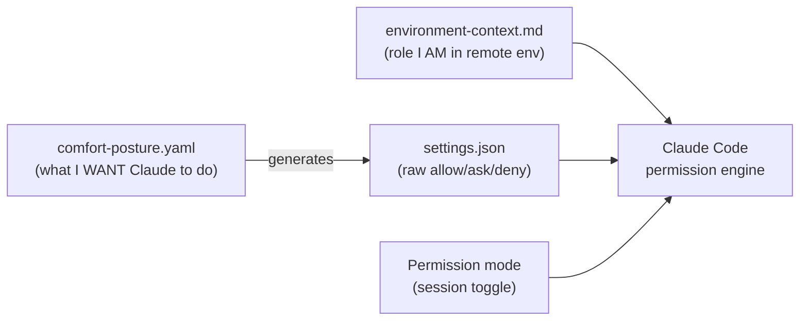
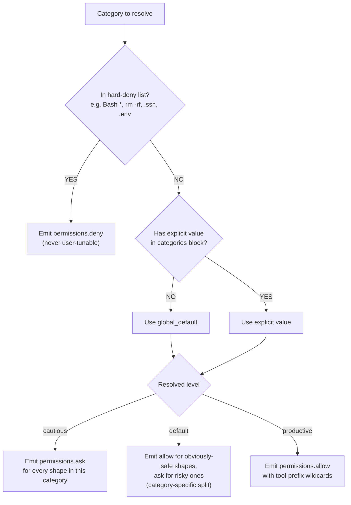

# Comfort-posture mechanism for `ravenclaude-core`

*Proposed by Matt 2026-05-22. Researched by deep-researcher 2026-05-22.*

---

## 1. Problem (plain language)

Right now, every Claude Code user who wants Claude to stop asking permission for the safe stuff has to either (a) live with the prompts, (b) hand-author dozens of allow rules in `.claude/settings.json`, or (c) flip the whole IDE to "auto" mode and pray. There is no middle path that says "I am comfortable with category X but not category Y, generate the rules for me."

What the user wants to say is something like: *"I'm a financial analyst. I'm fine letting Claude read and edit files in this project, and I want it to run safe shell commands without asking. But I want it to ask before installing packages, before pushing to GitHub, and before running arbitrary Python. And I never want it to touch my home directory or send anything to a server I didn't name."*

That sentence should produce a working `.claude/settings.json`. Today it doesn't. **This proposal designs the mechanism that translates a short, plain-language "comfort posture" into the right `.claude/settings.json` permission rules.**

---

## 2. How this differs from sibling mechanisms

Three mechanisms now live in adjacent space. Confusion between them is the biggest risk; this section is the disambiguation table.

| Mechanism | Question it answers | Where it lives | Authored by |
|---|---|---|---|
| **`environment-context.md`** (proposal 001, accepted) | *What is the user's role authority in a remote environment (DEV/TEST/PROD)?* — e.g., "I am sysadmin in DEV via this SPN" | `.ravenclaude/environment-context.md` in consumer project | Consumer |
| **`comfort-posture.yaml`** (this proposal) | *How much autonomous action is the user personally comfortable with Claude taking?* — e.g., "I'm fine with edits, ask before installs" | `.ravenclaude/comfort-posture.yaml` in consumer project | Consumer |
| **`.claude/settings.json` permission rules** | *The raw allow/ask/deny rules Claude Code's engine actually evaluates* | `.claude/settings.json` (project) and `~/.claude/settings.json` (user) | Generated by this proposal; hand-edited otherwise |
| **Permission modes** (`auto`, `acceptEdits`, `plan`, etc.) | *Session-scoped autonomy override* — temporary, not declarative | Per-session toggle | User, ad-hoc |



**Axis test:** environment-context is about *capability the user has*; comfort-posture is about *autonomy the user grants Claude*. They are orthogonal — a user can be sysadmin in DEV and still be cautious about letting Claude run shell commands without asking.

---

## 3. Prior-art summary

Eight systems surveyed for category + spectrum patterns. One-to-two-sentence verdict per system.

| System | Pattern we'd borrow | Pattern we'd reject |
|---|---|---|
| **iOS location permissions** (3 options: Always / While Using / Ask Next Time) [1] | The **per-category short ladder** — 3 levels is the documented sweet spot for user comprehension. | Modal prompts at runtime — our equivalent is generated rules, not runtime ladders. |
| **Android runtime permissions** [2] [3] | Per-category granularity (camera, mic, location grouped meaningfully); contextual prompts at first use. | "Permission groups" hidden taxonomy — Android groups requests in ways users don't understand. We expose the taxonomy. |
| **Apple App Tracking Transparency** (3-option + rationale string) [4] | The **rationale string** — every category in our YAML carries a one-line "what this means" so the user understands the trade-off. | Treating it as binary in practice — research shows most users pick extreme answers regardless of rationale [4]; design assumes they'll skim, not read. |
| **AWS IAM permissions boundaries + SCPs** [5] [6] | **Layered ceiling + floor model** — SCPs set the max permissions, identity policies set actuals, explicit deny always wins. Our user-level posture is the ceiling, project posture is the actual. | The complexity. AWS policy evaluation is famously hard. Our spectrum must NOT require users to think about cross-layer evaluation. |
| **macOS app sandboxing entitlements** | Per-capability entitlements declared in a plist — concept of "I declare what I need, OS enforces." | Static, install-time, requires Apple Developer ID — not portable to our flow. |
| **Cursor "Auto-Run" / YOLO mode** [7] | The category model (allowlist of commands) and the lesson learned. | **Denylists. Cursor removed their denylist feature after it was shown to be ineffective — agents bypassed it by chaining commands with `&&`** [8]. Our mechanism MUST NOT pretend a comfort-level deny is a security boundary. Comfort is convenience; security is hooks + sandbox. |
| **Aider `--yes-always` / `--auto-accept-architect`** | Per-action-type toggles (architect vs code mode) — closer to category-level than session-level. | All-or-nothing `--yes` flags — proposes the same failure shape Matt is trying to avoid. |
| **Claude Code's own `auto` / `acceptEdits` / `plan`** | The vocabulary already exists; the user knows what "auto" means. | These are **session-scoped** and silently drop broad allow rules. Our mechanism is **declarative and durable** — a different shape. |

**Two HCI papers that shaped the design:**

- Felt et al. (2012), *Android Permissions: User Attention, Comprehension, and Behavior* [9] — establishes warning fatigue as a real cost; supports keeping the **number of categories small** (8-12, not 30+) and the spectrum **short** (≤5 levels).
- Koch et al. (2023, USENIX Security), *The OK Is Not Enough: A Large Scale Study of Consent Dialogs* [10] — most consent dialogs are dark-pattern-laden; users develop "OK blindness." Argument for **inverting the default: ask for elevation, not for restriction** — the user picks the comfort level once, doesn't get re-prompted to confirm it.

---

## 4. Proposed mechanism

### 4.1 Category taxonomy (12 categories)

Categories are chosen to map cleanly to **rule shapes Claude Code can actually express** (per the schema in `knowledge/claude-code-permissions.md`). One category = one or more `Tool(specifier)` patterns the generator emits.

| # | Category | Plain-language meaning | Maps to Claude Code rules |
|---|---|---|---|
| 1 | `file_read_project` | Read files inside this project | `Read(./**)` |
| 2 | `file_read_global` | Read files anywhere on the machine (incl. `~`) | `Read(~/**)`, `Read(//**)` |
| 3 | `file_edit_project` | Create / edit / move files inside this project | `Edit(./**)`, `Write(./**)` |
| 4 | `file_edit_global` | Edit files anywhere on the machine | `Edit(~/**)`, `Write(~/**)` |
| 5 | `shell_readonly` | Inspection commands (`ls`, `cat`, `git status`) | **Mostly already auto-allowed** [11]; this lights up the few extras (e.g., `tree`, custom CLIs the user names) |
| 6 | `shell_local_mutate` | Local-only state changes (`mkdir`, `chmod`, `git add/commit`, `npx prettier --write`) | `Bash(mkdir:*)`, `Bash(chmod:*)`, `Bash(git add:*)`, `Bash(git commit:*)`, etc. |
| 7 | `shell_remote_mutate` | Anything that talks to a server (`git push`, `gh pr create`, `gh pr merge`) | `Bash(git push:*)`, `Bash(gh pr create:*)`, etc. |
| 8 | `shell_package_install` | Package managers (`npm install`, `pip install`, `apt`, `brew`) | `Bash(npm install:*)`, `Bash(pip install:*)`, `Bash(brew install:*)` |
| 9 | `shell_code_exec` | Arbitrary code execution (`python`, `node`, `bash -c`, `npx <unknown>`) | `Bash(python:*)`, `Bash(node:*)`, `Bash(bash:*)`, etc. — **default: ask, never auto-allow** (per permission-hygiene §"Anti-patterns") |
| 10 | `network_read` | `WebFetch`, `curl/wget GET` | `WebFetch(domain:*)` |
| 11 | `network_write` | POST/PUT/DELETE, sending email/Slack, webhooks | `Bash(curl -X POST:*)` (note: documented-fragile [12]; generator emits a hook-based guard instead) |
| 12 | `mcp_tools` | MCP server tools (per-server) | `mcp__<server-name>__*` (one entry per server the user names) |

**Deliberately omitted from the taxonomy:**
- Agent spawns — covered by `ravenclaude-core/CLAUDE.md` orchestrator-worker rule already; not a per-user comfort lever.
- File deletion — folded into `file_edit_*`; Claude Code's rule schema has no "delete-only" specifier.
- "Sandbox / no sandbox" — that's `bypassPermissions` mode territory, not a comfort setting.

### 4.2 Spectrum design — **the recommended choice is `Cautious / Default / Productive` (3-level, per-category, with a global default fallback)**

#### Alternatives considered

| Design | Verdict |
|---|---|
| **3-level per-category (CHOSEN)** | Best signal-to-noise. Matches iOS's three-option pattern (the documented sweet spot for comprehension [1]). Each category gets one of 3 values OR inherits the global default. |
| 5-level (Watcher/Cautious/Default/Productive/Yolo) | Rejected. Two extra levels create indecision; HCI research [9] suggests users default to the middle when given 5 options regardless of fit. The "Yolo" level also tempts users to flip everything on at once — exactly the Cursor failure mode [8]. |
| Likert 1-5 per category | Rejected. Forces 12 × 5 = 60 micro-decisions. Authoring fatigue. |
| Binary (off/on) + global default | Rejected — loses the "ask" middle, which is the highest-value safety level. Binary is what `auto` mode already does badly. |
| Earned-trust auto-promotion (start cautious, promote categories with N successful approvals) | Interesting but deferred to phase 4. Requires telemetry the marketplace doesn't have yet, and adds non-determinism (what the rules say today depends on what happened yesterday). |

#### The chosen ladder, per category

| Comfort level | Generator behavior | Mnemonic |
|---|---|---|
| **`cautious`** | Emits `permissions.ask` rules. Claude asks every time before acting in this category. | *"Ask before you act."* |
| **`default`** | Emits `permissions.ask` for risky shapes within the category, `permissions.allow` for the obviously-safe shapes. Mirrors Claude Code's built-in `READONLY_COMMANDS` boundary for shell categories. | *"Use judgment."* |
| **`productive`** | Emits `permissions.allow` rules with tool-prefix wildcards (`Tool:*` shape). No prompt unless the engine itself escalates. | *"Just do it."* |
| *(unspecified)* | Inherits `global_default`. | — |

**Note:** there is no `yolo` / "permit everything" level. That would emit `Bash(*)` — which `auto` mode silently drops anyway [11], so the bet doesn't compose forward. The `permission-hygiene` skill already names `Bash(*)` as an anti-pattern to delete on sight; the generator inherits that policy.

### 4.3 Wire format — YAML at `.ravenclaude/comfort-posture.yaml`

YAML (not JSON) because users hand-edit this file and YAML's comments + lower visual noise matter. The generator reads YAML, the output is JSON (`.claude/settings.json`).

```yaml
# .ravenclaude/comfort-posture.yaml
schema_version: 1
generated_for: matt@ravenpower.net
last_updated: 2026-05-22

# One-line fallback for any category not listed below.
global_default: cautious

# Per-category overrides. Omit a category to inherit global_default.
categories:
  file_read_project: productive
  file_edit_project: productive
  shell_readonly: productive
  shell_local_mutate: default       # ask before git commit; allow mkdir
  shell_remote_mutate: cautious     # always ask before git push, gh pr
  shell_package_install: cautious   # always ask before npm/pip install
  shell_code_exec: cautious         # python/node always asks
  network_read: default             # WebFetch ask on unknown domains
  network_write: cautious           # always ask before POSTs
  file_read_global: cautious        # ask before reading ~/.ssh, etc.
  file_edit_global: cautious        # ask before writing outside project
  mcp_tools: default

# Optional time-boxed elevations (see §6 Edge cases).
elevations: []

# Optional: explicit MCP servers the user has wired up.
# Each becomes its own allow/ask scope under mcp_tools.
mcp_servers:
  - name: microsoft_learn
    trust: productive   # read-only documentation server, safe to allow
  - name: uber
    trust: cautious     # third-party demand server, ask every time
```

**Hard rules (NOT user-tunable):**

- `Bash(*)`, `Bash(python *)`, `Bash(node *)`, `Bash(npx *)`, `Bash(bash *)`, `Bash(eval *)`, `Bash(rm -rf *)`, `Bash(curl http://... *)` → **never** emitted as allows by the generator, regardless of comfort level. These are anti-patterns from `permission-hygiene.md` and the Cursor lesson [8].
- `permissions.deny` for `Read(~/.ssh/**)`, `Read(**/.env*)`, `Edit(**/.env*)`, force-push, `npm publish`, `curl | sh` → **always** emitted, regardless of comfort level. Floor, not ceiling.

### 4.4 Generator surface — **the recommended choice is a slash command `/set-posture`**

#### Alternatives considered

| Surface | Verdict |
|---|---|
| **Slash command `/set-posture` (CHOSEN)** | Interactive, discoverable, can show diff before writing. Matches the precedent of `/init-agent-ready`. User can re-run it any time to bump a category. |
| Skill (markdown-only) | Rejected as primary. A skill is a procedure for the agent; this is a tool the user invokes. Skill can complement (call from inside the slash command), but should not be the front door. |
| Hook (auto-regenerate on YAML edit) | Rejected as primary. Side effects on every save are surprising; not all consumers want auto-regen. Could ship as opt-in later. |
| Standalone CLI (`npx ravenclaude posture set ...`) | Rejected — adds a non-Claude-Code dependency; the marketplace is markdown + shell + JSON only (per `AGENTS.md` §"Setup commands"). |

The slash command is shipped at `plugins/ravenclaude-core/commands/set-posture.md` and writes:
1. `.ravenclaude/comfort-posture.yaml` (the source of truth, hand-editable after)
2. `.claude/settings.json` `permissions.*` blocks (generated; marked with a `_generated_by` marker key so the user knows not to hand-edit those blocks)

Re-running the command **regenerates the `permissions.*` blocks from YAML**; any hand-edits to those blocks are reverted with a one-line warning. The rest of `.claude/settings.json` (hooks, env, etc.) is preserved.

### 4.5 The resolver (decision tree)

This is the logic the generator follows for each category. Per the decision-tree convention in `docs/best-practices/decision-trees-in-knowledge-files.md`:

**Decision Tree: comfort-posture → settings.json**

**When this applies:** generating `.claude/settings.json` `permissions.*` from `comfort-posture.yaml`. One pass per category.

**Last verified:** 2026-05-22 against Claude Code permissions docs at `code.claude.com/docs/en/permissions`.



**Rationale per leaf:**
- *Emit deny (hard floor)* — protects against the user accidentally widening into the documented Cursor/Aider failure modes [8].
- *Emit ask* — preserves human-in-the-loop for risk-bearing categories; matches the Koch et al. finding that "consent at point-of-use" is the most-effective consent shape [10].
- *Emit mixed* — the `default` level is the productive middle: mirrors Claude Code's own built-in `READONLY_COMMANDS` partition [11].
- *Emit allow* — explicit, durable, audit-friendly; survives the `auto`-mode-drops-broad-rules surprise [11] because the generator never emits `Tool(*)`-shape — only `Tool(<verb>:*)`.

---

## 5. Worked example — Matt-as-financial-analyst's 90-day posture

### 5.1 Matt's YAML

```yaml
# .ravenclaude/comfort-posture.yaml
schema_version: 1
generated_for: matt@ravenpower.net
last_updated: 2026-05-22

global_default: cautious

categories:
  file_read_project: productive       # poke around freely
  file_edit_project: productive       # generate / refactor freely
  shell_readonly: productive          # ls/cat/git status — never ask
  shell_local_mutate: default         # mkdir auto, git commit asks
  shell_remote_mutate: cautious       # git push / gh pr always asks
  shell_package_install: cautious     # never install silently
  shell_code_exec: cautious           # python/node ask every time
  network_read: default               # WebFetch on known domains OK
  network_write: cautious             # POST always asks
  file_read_global: cautious          # asks before ~ reads
  file_edit_global: cautious          # asks before ~ writes
  mcp_tools: default

mcp_servers:
  - name: microsoft_learn
    trust: productive
  - name: uber
    trust: cautious
```

### 5.2 Generated `.claude/settings.json` (excerpt)

```jsonc
{
  "permissions": {
    "_generated_by": "ravenclaude-core /set-posture v0.1 — DO NOT HAND-EDIT this block",
    "_generated_at": "2026-05-22",
    "_source": ".ravenclaude/comfort-posture.yaml",
    "deny": [
      "Read(~/.ssh/**)",
      "Read(**/.env)",
      "Read(**/.env.*)",
      "Edit(**/.env)",
      "Bash(rm -rf:*)",
      "Bash(git push --force:*)",
      "Bash(npm publish:*)",
      "Bash(curl * | sh)",
      "Bash(python:*)",
      "Bash(node:*)",
      "Bash(bash -c:*)"
    ],
    "ask": [
      "Bash(git commit:*)",
      "Bash(git push:*)",
      "Bash(gh pr create:*)",
      "Bash(gh pr merge:*)",
      "Bash(npm install:*)",
      "Bash(pip install:*)",
      "Bash(brew install:*)",
      "Read(~/**)",
      "Edit(~/**)",
      "WebFetch(domain:*)"
    ],
    "allow": [
      "Read(./**)",
      "Edit(./**)",
      "Write(./**)",
      "Bash(mkdir:*)",
      "Bash(chmod:*)",
      "Bash(git add:*)",
      "Bash(tree:*)",
      "WebFetch(domain:learn.microsoft.com)",
      "WebFetch(domain:code.claude.com)",
      "mcp__microsoft_learn__*"
    ]
  }
}
```

The user authored 12 lines of YAML. The generator produced ~30 lines of permission rules. The user did not have to learn the `Tool(specifier)` syntax, the gitignore-style path anchors, or the `auto`-mode silently-drops-broad-rules surprise [11].

---

## 6. Edge cases

### 6.1 Per-category overrides

Already covered by the schema — any category absent from `categories:` inherits `global_default`. No special syntax needed.

### 6.2 Time-boxed elevation ("yolo for the next hour")

```yaml
elevations:
  - category: shell_package_install
    raise_to: productive
    expires_at: 2026-05-22T17:00:00Z
    reason: "running npm install for a big refactor"
```

The generator emits the elevated rules with a `// expires 2026-05-22T17:00:00Z` JSON-comment marker. A periodic skill (`posture-expire-elevations`) sweeps and re-generates when an elevation expires. **Open question:** does Claude Code support time-checked rules natively? **Answer: no** (per `knowledge/claude-code-permissions.md`); enforcement is the skill, not the engine.

### 6.3 Team-shared posture vs personal posture

Two layers:
- **`.ravenclaude/comfort-posture.yaml`** — checked in, team default (cautious by default).
- **`.ravenclaude/comfort-posture.local.yaml`** — gitignored, personal override. Per-category fields in the local file override the team file.

The generator merges them (local wins per-category, never wins on hard-deny floor). This mirrors the existing `.claude/settings.json` ↔ `.claude/settings.local.json` precedence [13] and matches what users already know.

### 6.4 `auto` mode interaction

Critical edge case from the just-merged knowledge file: **`auto` mode silently drops broad allow rules** including `Bash(*)`, `Bash(python*)`, `Agent` allows, etc. [11]

The generator's defense:
- Never emits `Tool(*)`-shape allows.
- Never emits interpreter-wildcard allows (`Bash(python*)`).
- All `productive`-level allows use the colon-prefix-wildcard shape (`Bash(verb:*)`) which is not in the drop list.

This is documented in the generator's output as a comment so a reviewer can verify.

### 6.5 What if the user has no `.ravenclaude/comfort-posture.yaml`?

The generator does nothing. The plugin's other artifacts (`permission-hygiene` skill, etc.) still work. **Silent no-op, not an error** — same posture as the layout-enforcement hook when `.repo-layout.json` is absent.

---

## 7. Composition with existing artifacts

| Existing artifact | How comfort-posture composes |
|---|---|
| `.claude/settings.json` precedence (5 layers) [13] | Generator writes the **project layer**. User-level `~/.claude/settings.json` denies still beat any project-level allow we emit. Floor preserved. |
| `environment-context.md` (proposal 001) | Orthogonal. Environment-context says *"agent is sysadmin in DEV via SPN."* Comfort-posture says *"and I'm comfortable letting it `git commit` without asking."* Both can be true; both compose into the same agent session. |
| `permission-hygiene` skill | The skill remains the design discipline for hand-authored rules (when the user wants a one-off rule not covered by a category). Generator output is one input to the skill's cleanup-ritual sweep. |
| `knowledge/claude-code-permissions.md` | The schema reference is what the generator's hard-deny floor and category-to-rule mappings cite. If Anthropic ships a new permission feature, this is the file that updates first; generator follows. |
| `/fewer-permission-prompts` (Claude Code core skill) | Complementary, not redundant. That skill is data-driven (look at recent prompts, propose allows). This proposal is declarative (state your posture, get rules). Use both. |

---

## 8. Open questions for Matt

1. **Categories — too many or too few?** 12 categories is on the high side of the "5-12 categories" HCI sweet spot [9]. Should we collapse `network_read`/`network_write` into one and `file_read_*`/`file_edit_*` into one? That would yield 8 categories.
2. **Spectrum naming.** `cautious / default / productive` is clear but bland. `watcher / default / autopilot`? `ask-mostly / balanced / hands-off`? Naming matters because users will say it out loud ("set me to autopilot").
3. **MCP per-server vs per-tool granularity.** Today the proposal grants trust per-server. Should `productive` for a server mean "all tools," or should there be per-tool overrides (some MCP servers expose 30+ tools, including writes)?
4. **Earned-trust phase 4.** Worth building, or premature? Requires logging successful approvals over time; the marketplace doesn't currently log.
5. **Default posture out-of-box.** If a consumer installs `ravenclaude-core` and runs `/set-posture` with no flags, what's the default? My recommendation: `global_default: cautious` and an empty `categories:` block — the user explicitly opts into productive per category. Conservative default per Koch et al.'s "OK blindness" finding [10].

---

## 9. Implementation phases

| Phase | Deliverable | Status |
|---|---|---|
| **1** | This proposal lands | (this PR) |
| **2** | JSON schema for `comfort-posture.yaml` + a `generate-settings.sh` script + tests on a fixture posture | not started |
| **3** | `/set-posture` slash command (interactive: pick categories, see the diff, write the file) at `plugins/ravenclaude-core/commands/set-posture.md` | not started |
| **4** | Earned-trust auto-promotion (logs successful approvals, surfaces "promote `shell_local_mutate` to productive?" suggestion after N) | deferred until phase 3 has 30 days of real use |

Phase 2 ships with no UI; phase 3 is the consumer-facing wrapper. The split is intentional — phase 2 produces a working artifact even if phase 3 slips.

---

## 10. Citations

[1] [iOS Location Permissions — Pulsate docs](https://docs.pulsatehq.com/reference/location-permissions) — three-option permission ladder ("Always" / "While Using App" / "Allow Once / Ask Next Time"). Retrieved 2026-05-22.
[2] [Runtime permissions — Android Open Source Project](https://source.android.com/docs/core/permissions/runtime_perms) — primary source for Android's category-grouped runtime permission model. Retrieved 2026-05-22.
[3] [Cao et al. (2021), *A Large Scale Study of User Behavior, Expectations and Engagement with Android Permissions*](https://security.csl.toronto.edu/wp-content/uploads/2021/06/wcao-usenixsec2021-privadroid.pdf) — USENIX Security 2021; 72% of runtime permissions are expected by users, deny rates jump from 12.2% (expected) to 26.9% (unexpected) — argument for context-rich category names. Retrieved 2026-05-22.
[4] [Exploring User Motivations Behind iOS App Tracking Transparency Decisions — CHI 2023](https://dl.acm.org/doi/10.1145/3544548.3580654) — finding: "not a single participant discussed the tracking prompt's text in their response" — purpose strings barely register. Argument for designing for skim, not read. Retrieved 2026-05-22.
[5] [Permissions boundaries for IAM entities — AWS docs](https://docs.aws.amazon.com/IAM/latest/UserGuide/access_policies_boundaries.html) — primary source for layered ceiling/floor model. Retrieved 2026-05-22.
[6] [Service control policies (SCPs) — AWS docs](https://docs.aws.amazon.com/organizations/latest/userguide/orgs_manage_policies_scps.html) — "SCPs do not grant permissions… they set permission guardrails." Retrieved 2026-05-22.
[7] [Cursor Agent Overview docs](https://cursor.com/docs/agent/overview) — autonomy slider concept (Tab → Cmd+K → Agent Mode). Retrieved 2026-05-22.
[8] [The Register, *Cursor AI safeguards easily bypassed in YOLO mode*, 2025-07-21](https://www.theregister.com/2025/07/21/cursor_ai_safeguards_easily_bypassed/) — primary source for the "Cursor removed denylist" finding; agents bypassed allowlists via `&&`-chaining. Lesson: convenience-tier mechanism must not be sold as a security boundary. Retrieved 2026-05-22.
[9] [Felt et al. (2012), *Android Permissions: User Attention, Comprehension, and Behavior*](https://www2.eecs.berkeley.edu/Pubs/TechRpts/2012/EECS-2012-26.pdf) — canonical paper on warning fatigue + category comprehension. Retrieved 2026-05-22.
[10] [Koch et al. (2023, USENIX Security), *The OK Is Not Enough: A Large Scale Study of Consent Dialogs in Smartphone Applications*](https://www.usenix.org/system/files/usenixsecurity23-koch.pdf) — "OK blindness" + dark-pattern survey across ~5000 apps; only 11.9% of dialogs give users actionable choice. Retrieved 2026-05-22.
[11] [Choose a permission mode — code.claude.com](https://code.claude.com/docs/en/permission-modes) — primary source for `auto` mode silently dropping broad allow rules (`Bash(*)`, `Bash(python*)`, `Agent` allows). Retrieved 2026-05-22 (also cited in `knowledge/claude-code-permissions.md`).
[12] [Configure permissions — code.claude.com](https://code.claude.com/docs/en/permissions) — primary source for the documented fragility of Bash argument-constraint patterns (curl options-first, protocol-swap, redirects, variable-substitution, whitespace bypasses). Retrieved 2026-05-22.
[13] [Claude Code settings — code.claude.com](https://code.claude.com/docs/en/settings) — primary source for the 5-layer settings precedence and deny-wins-cross-layer rule. Retrieved 2026-05-22.

