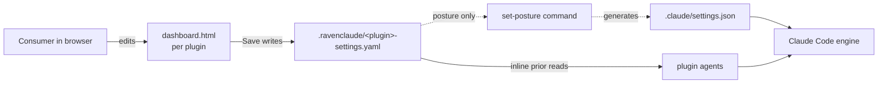
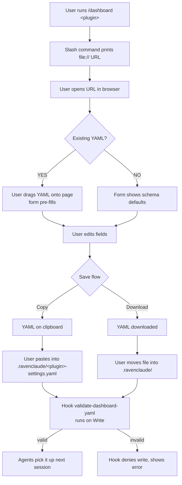

# Per-plugin interactive dashboard for consumer settings

*Proposed by Matt 2026-05-22. Researched by deep-researcher 2026-05-22. Architect review 2026-05-22. Accepted with modifications.*

---

## 1. Problem (plain language)

Today, a consumer who installs a RavenClaude plugin has no place to **change** how it behaves short of hand-editing YAML / JSON in a code editor and hoping the agents notice. Three concrete pain shapes:

- **Comfort posture** (proposal 002) needs a way for the user to say "I'm fine with edits but ask before git push." Today that means typing twelve YAML keys correctly.
- **Domain plugins** like the future `finance` plugin will have settings the user genuinely needs to set per-engagement — materiality threshold, reporting currency, board cadence — and the *agent* needs to read them.
- **The `ravenclaude-core` meta-settings** (favorite agents, opt-in skills) have no surface at all.

What good looks like: each plugin ships a dashboard the user opens in a browser. Four tabs — Settings, Commands, Trees, Activity — let the user change how agents behave, launch slash commands with a click, inspect decision trees, and review what the agents did. **The dashboard is the UI; a versioned YAML file is the source of truth.**

This proposal designs the chassis. Proposal 002's comfort-posture is its first concrete passenger.

---

## 2. How this differs from sibling mechanisms

| Artifact | Role | Where it lives | Who edits it | Who reads it |
|---|---|---|---|---|
| **`repo-guide.html`** | Read-only catalog of marketplace agents / skills / trees | Repo root, served via GitHub Pages | Maintainer (regenerated) | Anyone evaluating the marketplace |
| **Per-plugin dashboard** *(this proposal)* | Interactive editor for consumer's per-plugin settings + command launcher + tree viewer + activity feed | `plugins/<plugin>/dashboard.html` + opened locally after install | Consumer (browser UI) | Plugin's agents (via the YAML file) |
| **`comfort-posture.yaml`** *(proposal 002)* | ONE category: how autonomous the user wants Claude to be | `.ravenclaude/comfort-posture.yaml` | Consumer (via this dashboard) | `permission-hygiene` skill + posture generator |
| **`.claude/settings.json`** | Claude Code's native config (perms, hooks, env) | `.claude/settings.json` | Claude Code + posture generator | Claude Code's engine |



**Axis test:** `repo-guide.html` is the marketplace's read-only catalog. The per-plugin dashboard is the consumer's editable control panel. Comfort-posture is one panel on that dashboard. `.claude/settings.json` is what the engine reads after generation.

---

## 3. Prior-art summary

Twelve systems across three families. The load-bearing common pattern is named at the end.

### Agentic-AI tools

| System | Borrow | Reject |
|---|---|---|
| **Continue.dev `config.yaml`** [1] [2] | Single YAML at a known path, hand-editable, gear-icon shortcut. YAML chosen for comments + lower visual noise. | The IDE-embedded panel — we can't ship UI inside Claude Code's REPL. |
| **Cursor rules** [3] | Per-project `.cursor/rules/*.mdc` + User-vs-Project Rules split mirrors team-vs-personal. | Free-form text box — no structure, no validation. We want fields. |
| **Aider `.aider.conf.yml`** [4] | YAML at home / repo / cwd, last-wins precedence. | No UI at all. Authoring fatigue is real for non-developers. |
| **Claude Code `/config` + `settings.json`** [5] | Tabbed settings panel; 5-layer precedence. Mirror precedence so users learn one model. | `/config` only edits fixed toggles; richer changes drop to "edit JSON yourself." |

### Config-file + companion-UI patterns

| System | Borrow | Reject |
|---|---|---|
| **VS Code settings.json + Settings UI** [6] | The canonical "file is truth, UI is one editor" model. JSON Schema annotations drive the UI. | Full settings-UI machinery is overkill for ~10-30 settings per plugin. |
| **dbt `dbt_project.yml` + dbt Cloud UI** [7] | YAML is portable + version-controlled; UI sits above the file. Survives offline. | dbt Cloud is hosted SaaS. We have no backend. |
| **Decap CMS / Netlify CMS** [8] [9] | **Closest single analogue:** static UI, commits YAML / JSON back to repo, no backend. Git as database. | Git-commit-on-save requires authenticated Git backend. Too heavy for a checkbox flip. |
| **JSON Schema + `react-jsonschema-form`** [10] [11] | JSON Schema → auto-generated HTML form. Exactly our pattern. | React + npm. We'll vendor ~200 lines of vanilla JS; marketplace stays "markdown + shell + JSON" per `AGENTS.md`. |

### Local-file-as-UI patterns

| System | Borrow | Reject |
|---|---|---|
| **GitHub Issue Forms (`.github/ISSUE_TEMPLATE/*.yml`)** [12] [13] | **The schema shape that produces a form** — public YAML format defining `type: input | dropdown | checkboxes | textarea`. We'll mirror its vocabulary. | The "fills an issue" output. Ours is a YAML settings file. |
| **Jupyter / Papermill / Voila** | Single file as both document and interactive surface. | Notebook runtime is way too heavy. |
| **Excel as the UI for financial modeling** | Matt's native idiom. Analysts tolerate complexity *if it looks like a spreadsheet*. | Binary, doesn't diff, agents can't read. YAML substrate + Excel-inspired layout density. |
| **"Settings.md" / markdown-checkbox patterns** | Discoverable in any markdown editor. | Parsing checkboxes back is brittle. YAML round-trips cleanly. |

### The load-bearing common pattern

Six design choices recur in every system that works. **This is the shape this proposal copies.**

| # | Design choice | Why load-bearing |
|---|---|---|
| 1 | **File is source of truth, UI is one editor.** | Survives the UI being unavailable. File is the contract; UI is convenience. |
| 2 | **Schema-validated, not free-form.** | UI knows what fields exist; hooks reject malformed; agent can trust what it reads. |
| 3 | **YAML over JSON for hand-edits.** | Comments + multi-line + lower noise. JSON stays for engine-read files. |
| 4 | **Known path, no discovery.** | Agent always knows where to look. No `find`, no env-var indirection. |
| 5 | **Layered precedence (team file + personal override).** | Same project, different teammates and machines. |
| 6 | **Plain text on disk so Git tracks history.** | `git log` is the audit trail when an agent surprises you. |

The three **failure modes** we design against:

- **Round-trip drift** (UI writes a shape it can't re-read). Cursor's free-form rules suffer this. Mitigation: validate-on-read; UI banners on parse failure.
- **Hosting required** (dbt Cloud, Decap+Git Gateway). We ship fully-static HTML with no fetch/POST. Save = "give the YAML to the user" (see §4.3).
- **Discovery cost** (must learn JSON Schema before flipping a setting). Mitigation: ship an empty schema-valid skeleton on first run.

---

## 4. Proposed mechanism

### 4.1 Settings file location & shape — `.ravenclaude/<plugin>-settings.yaml`

One YAML file per plugin, in the consumer's project, under the shared `.ravenclaude/` directory (same dir as `environment-context.md` and `comfort-posture.yaml`).

```
<consumer-project>/
├── .ravenclaude/
│   ├── environment-context.md         (proposal 001, accepted)
│   ├── comfort-posture.yaml           (proposal 002, first concrete settings file)
│   ├── ravenclaude-core-settings.yaml (this proposal — meta-dashboard)
│   ├── finance-settings.yaml          (when finance plugin ships)
│   └── dashboards/                    (rendered HTML, gitignored)
│       ├── ravenclaude-core.html
│       └── finance.html
└── .claude/settings.json              (generated from comfort-posture; left alone otherwise)
```

**Why one file per plugin (not combined):** plugins version independently — combined file is a merge risk; agent's inline prior points at *its* plugin's file; removing a plugin = deleting one file.

**Why YAML (not JSON / markdown):** comments embed help text from the schema; consistency with proposal 002; JSON stays the substrate for engine-read files. Continue migrated JSON → YAML for the same reason [1].

**Why `.ravenclaude/`:** plugins live in `~/.claude/plugins/cache/...` and are blown away on `/plugin marketplace update`. Consumer settings must live in the project tree.

### 4.2 Schema — JSON Schema at `plugins/<plugin>/dashboard-schema.json`

Each plugin ships a JSON Schema (draft 2020-12 [14]) describing its dashboard fields. The schema is the single source of truth for: (a) the rendered HTML form, (b) the YAML validator hook, (c) what the agent expects to read.

Borrowed vocabulary from GitHub Issue Forms [12] — `type`, `attributes`, `validations`, `description` — so anyone who's written `.github/ISSUE_TEMPLATE/*.yml` recognizes the shape.

```jsonc
// plugins/ravenclaude-core/dashboard-schema.json (excerpt)
{
  "$schema": "https://json-schema.org/draft/2020-12/schema",
  "title": "ravenclaude-core dashboard",
  "type": "object",
  "presets": {
    "cautious":   { "shell_remote_mutate": "cautious", "file_edit_project": "cautious" },
    "default":    { "shell_remote_mutate": "cautious", "file_edit_project": "default" },
    "productive": { "shell_remote_mutate": "default",  "file_edit_project": "productive" }
  },
  "properties": {
    "comfort_posture": {
      "type": "string",
      "enum": ["cautious", "default", "productive"],
      "default": "cautious",
      "description": "How autonomous to let the agents be. See proposal 002."
    }
  }
}
```

**Preset mechanic — root-level `presets:` block:** The `presets:` key at the schema root lists each named preset and the field values it applies. The generator reads this block to know which fields participate in the preset bar. There is no per-field `x-preset-aware: true` annotation — the generator infers membership from the preset block. Single source of truth; tighter and easier to diff.

#### Widget vocabulary

The schema's `type` + `enum` drive which widget the form renderer picks. `x-widget` overrides the default choice when the schema alone is ambiguous.

| Widget kind | Render shape | When used |
|---|---|---|
| `text` | Single-line text input | `type: string` with no `enum` |
| `dropdown` | `<select>` element | `type: string` with `enum` and more than ~4 options |
| `checkbox` | Single toggle checkbox | `type: boolean` |
| `multi-checkbox` | One checkbox per option, multiple selectable | `type: array` with `items.enum` |
| `radio-vertical` | Vertical list of radio buttons | `type: string` with `enum` ≤ 4 options |
| `segmented` | Three pill-shaped buttons in a row, selected one filled | `type: string` with `enum` of exactly 3 options **or** `x-widget: "segmented"` explicit override. The shape used for Cautious / Default / Productive per category. |
| `currency` | Number input with currency prefix | `type: integer` + `x-widget: "currency"` |
| `date` | Date picker | `type: string`, `format: date` |

The `segmented` widget is the form surface for comfort-posture categories. Underneath it is `<input type="radio">` inside `role="radiogroup"`, so keyboard navigation (Tab between groups, Arrow keys within, Space to select) is browser-native with no custom scripting. Accessible screen-reader output is "1 of 3, Cautious" automatically — a raw slider would require hand-rolled `aria-valuetext` per step.

#### Tab layout — four tabs, hash routing

One `dashboard.html` per plugin, four tabs reachable via hash routes that work under `file://` (hash routing uses `location.hash`; the History API requires a server):

| Tab | Hash | What it shows | Ships in |
|---|---|---|---|
| **Settings** | `#/settings` | Segmented-radio rows per permission category + preset bar at top. Copy/Download YAML save flow. | v0.1.0 |
| **Commands** | `#/commands` | Cmd-K palette of plugin `/commands`. Three actions per command: Copy slash command, Open in Claude Code (deep link), Show help. | v0.1.0 |
| **Trees** | `#/trees` | Pre-rendered static SVG decision trees. Click a node to open a rationale side-panel. Pan/zoom deferred. | v0.2.0 (stub in v0.1.0) |
| **Activity** | `#/activity` | Card-per-run timeline reading `.ravenclaude/runs/`. Individual / Team / All toggle. Client-side redaction. | v0.2.0 (stub in v0.1.0) |

The `#/commands` tab is always visible and clickable from a bookmark (e.g., `dashboard.html#/commands`). This is the load-bearing way to honor the "no memorized commands" design constraint — the dashboard is the canonical surface; slash commands remain the power-user shortcut.

### 4.3 Dashboard form factor — **static HTML page extending the `generate-repo-guide.py` pattern**

| Form factor | Verdict |
|---|---|
| **Static HTML page, generated per plugin** *(CHOSEN)* | Composes with `repo-guide.html`; no backend; no npm; works offline; testable in CI. Save = Copy YAML or Download YAML. |
| In-REPL slash-command walkthrough (`/dashboard finance`) | Rejected as primary. Text walk through 20 fields is worse than one scrollable page. Could be a phase-4 alternate surface. |
| IDE-native panel (Continue.dev model) | Rejected. Requires shipping a VS Code / Cursor / Claude Code extension. Out of scope. |
| Editable markdown checkbox file (`Settings.md`) | Rejected as primary. Brittle round-trip; no enum dropdowns; no help tooltips. |
| Hosted SaaS panel (dbt Cloud / Decap+Git Gateway) | Rejected. No backend, no CI / CD for one. Adds auth complexity for zero offline-resilience. |
| Excel workbook (Matt-native) | Considered for the finance plugin specifically. Reject as primary — agents can't read `.xlsx`. But ship Excel *export* of the "scenarios" panel later. |

The chosen page is **self-contained** (inline CSS + vanilla JS, no CDN, mirroring `repo-guide.html`'s discipline), **schema-driven** (form rendered from `plugins/<plugin>/dashboard-schema.json` — the `react-jsonschema-form` pattern [10] without React), **two-pane within the Settings tab** (left: fields; right: live YAML preview in v0.2.0), **save-by-copy** ("Copy YAML" / "Download YAML" — the page never writes the filesystem; no `fetch` to a backend, no Chromium-only File System Access API), and **round-trip-able** (drop existing YAML onto the page, form pre-fills).

Hosted in two places:
1. **GitHub Pages** at `https://mcorbett51090.github.io/RavenClaude/dashboards/<plugin>.html` — browse latest without installing.
2. **Locally** at `~/.claude/plugins/cache/ravenclaude/<plugin>/<version>/dashboard.html` — opened after install. A slash command `/dashboard <plugin>` prints the file:// URL.

#### File-size budget

Pre-rendering decision trees at generator time eliminates the need to ship the Mermaid JavaScript library (3.3 MB uncompressed — verified via CDN `content-length` header) at runtime. Revised estimate:

| Component | Budget | Notes |
|---|---|---|
| Inlined CSS | 30 KB | unchanged from original estimate |
| Inlined JS (form rendering, hash routing, substring search, click handlers, redaction) | 40 KB | 10 KB down after dropping fuse.js |
| Pre-rendered tree SVGs (inline `<svg>`) | 50–150 KB | replaces the 162 KB Mermaid + svg-pan-zoom budget; varies by plugin |
| Inline schema-derived form HTML | 30 KB | unchanged |
| Inline command list + activity-feed shell | 100 KB | unchanged |
| **Revised total** | **~250–350 KB** | well under GitHub Pages 100 MB-per-file limit; loads in <500 ms |

The Mermaid JavaScript library is **not vendored** into the dashboard. Trees are pre-rendered to static `<svg>` by the generator (`generate-dashboards.py` calls `mermaid-cli` at build time). Runtime cost for trees: zero. If interactive tree editing is ever required (not on any roadmap), pin to Mermaid 10.x (~700 KB) and accept the budget regression then.

### 4.4 Read / write mechanics



**Rather than build a backend, the copy/paste step is a feature** — explicit user gesture meaning "I approve this YAML." Matches the iOS App Tracking Transparency lesson cited in proposal 002 §3.

### 4.5 Agent read path — inline prior + resolver skill

Two changes to consuming plugins:

1. **Inline prior** on every agent that reads settings: *"Before acting on plugin-relevant decisions, read `${CLAUDE_PROJECT_DIR}/.ravenclaude/<plugin>-settings.yaml`. File is optional; absence = use schema defaults. Use the `dashboard-settings-resolver` skill to load + validate."*
2. **`dashboard-settings-resolver` skill** in `ravenclaude-core/skills/` — thin skill that (a) loads the YAML, (b) validates against `dashboard-schema.json`, (c) merges team + `.local.yaml` overrides, (d) returns the resolved dict. One skill, every plugin's agents.

### 4.6 Schema validation — JSON Schema + a PreToolUse hook

`hooks/validate-dashboard-yaml.sh` runs `PreToolUse` on `Write|Edit|MultiEdit` whose target matches `.ravenclaude/*-settings.yaml`. It looks up the plugin's schema, validates the proposed write, denies with a one-line error if malformed. Mirrors the existing `enforce-layout.sh` pattern (silent when schema absent; denies with suggestion when violated).

### 4.7 Activity feed (v0.2.0)

> **Scope note:** this surface ships as a stub tab in v0.1.0 and fills in during v0.2.0. One prerequisite must land first: the `events.jsonl` template in `templates/run-artifacts/` (today that directory has only `summary.md.template` and `structured-result.json.template`). Until it lands, the feed degrades gracefully to `summary.md` + `structured-output.json` only.

The activity feed is a card-per-run timeline reading from the run artifacts the plugin writes to `.ravenclaude/runs/<id>/` (per `plugins/ravenclaude-core/CLAUDE.md` §"Run Artifacts & Observability Standard").

**Load mechanic under `file://` — inline everything at generator time:**

> **Revised 2026-05-22 after Spike 2 verification.** The original recommendation was a JSONP shim (`<script src="runs/index.js">`) on the theory that `<script src>` is exempt from CORS. **That theory is wrong for modern browsers under `file://`.** Default Chrome and default Firefox (since 2019) block ALL cross-file subresource loads — `fetch()`, `<script src>`, `<link>`, etc. — when the parent page is at `file://`. The "JSONP exempt from CORS" pattern applies only to http:// origins. Verified empirically in `docs/research/2026-05-22-dashboard-ux/spikes/jsonp-shim/REPORT.md` §1.

The fix: inline the entire activity-feed data into a `<script>` block in `dashboard.html` at generator time. The `/wrap` slash command regenerates the dashboard after each run completes.

```html
<!-- dashboard.html (excerpt) -->
<script>
  window.__ravenclaude_runs = [
    {
      "id": "2026-05-22-abc",
      "type": "team",
      "title": "Drafted proposal 003",
      "status": "complete",
      "specialists": ["documentarian"],
      "duration_s": 420,
      "summary_md_inline": "## Summary\n\n...",        // full content inline
      "structured_output_inline": { ... }              // full content inline
    },
    // ...more runs
  ];
</script>
```

**Size at Matt's scale:** 10 runs ≈ 25 KB inline; 50 runs ≈ 120 KB; 100 runs ≈ 240 KB. The dashboard's total budget is 500 KB, so the inline activity feed comfortably fits through dozens of runs. Above ~100 runs, fall back to inline-last-50 + per-run static HTML files for older runs (separate `runs/<id>.html` files opened in new tabs — each one self-contained, no cross-file loading needed).

The `/wrap` command's regen step: one shell-out to `generate-dashboards.py --plugin <name> --quick`, ~2-5s per regen.

**Feed layout:**

- **Left pane: timeline**, newest-first, grouped by date ("Today / Yesterday / This week / Older"). Each card shows: status badge (complete / partial / blocked — icon + text, never color alone), one-line summary, specialists involved, duration.
- **Right pane: run detail**, populated on click. Renders `summary.md` as markdown + an "Artifacts" list (links to `structured-output.json`, `changes.diff`, `decisions.md`, `events.jsonl` if present).
- **Toggle at top: Individual / Team / All.** "Team" = runs where ≥ 2 specialists appeared in the handoff chain. "Individual" = single-agent dispatches. Default: All.

Lazy-load on scroll using `IntersectionObserver` (~20 lines vanilla JS). No auto-refresh — the dashboard reads at page-load only, matching the "agents read at session start" mental model in §7.7.

**Privacy redaction:**

Redaction happens client-side at render time. The artifacts on disk stay raw (they are gitignored anyway). The redaction rule is an **allow-list of field key names** — if a field's key matches `/(\.env|secret|token|password|api[_-]?key)/i`, the value is replaced with `[redacted]` before rendering. This is tighter than content-scanning (which false-positives on prose like "the user asked about password reset") and matches the "key-level" approach the architect review's S4 recommends.

Full file paths under `~/.ssh/`, `~/.aws/`, `~/.config/` are also redacted.

### 4.8 Decision-tree viewer (v0.2.0)

> **Scope note:** this surface ships as a stub tab in v0.1.0 and fills in during v0.2.0. Prerequisite: the Mermaid-CLI pre-render spike confirms the generator can shell out to `mermaid-cli` (or run Mermaid headless via Node) and produce stable `<svg>` output.

Decision trees are pre-rendered to static SVG at **generator time**, not at browser runtime. This keeps the bundle small (no 3.3 MB Mermaid library). The generator calls `mermaid-cli` once per tree source file; the resulting `<svg>` is inlined into `dashboard.html`.

**Click-to-expand a leaf:**

The generator also emits a JSON sidecar at `plugins/<plugin>/dashboard-assets/decision-trees.json` mapping Mermaid node IDs to rationale prose (the generator already extracts this text at `DECISION_TREE_HEADING_RE`). A click handler on `.node` elements looks up the rationale and renders it in a right-side panel. When the tree source `.md` changes, the generator must regenerate both the SVG and the sidecar together — they share provenance.

**Pan/zoom:**

`svg-pan-zoom` (~30 KB, MIT, vanilla JS) is deferred to v0.2.0 and only added if real demand surfaces. Pre-rendered SVG at a sensible default size covers the first 80% of use cases.

**"Highlight current path from settings" — DROPPED:**

This stretch goal requires the dashboard JS to parse natural-language condition strings out of Mermaid node labels (e.g., "if `comfort_posture == 'productive'`"). The decision-tree convention has no enforced shape for these labels — they are prose. Pattern-matching is brittle to any label edit. This feature is dropped from all phases and parked as a research idea contingent on a structured-condition annotation convention that does not yet exist.

---

## 5. Worked example — finance plugin dashboard

### 5.1 The YAML

```yaml
# .ravenclaude/finance-settings.yaml
schema_version: 1
last_updated: 2026-05-22
engagement:
  client_code: "ACME-2026"
  reporting_currency: USD
  fiscal_year_end: "2026-12-31"
materiality:
  overall_threshold_usd: 250000        # quant materiality (PM in audit terms)
  performance_threshold_pct: 75        # PM = 75% of overall is the firm default
  trivial_threshold_usd: 12500         # below this, flagged but not investigated
fx_policy:
  hedge_horizon_months: 12
  approved_pairs: [USD/EUR, USD/GBP, USD/CAD]
  forward_contract_max_notional_usd: 5000000
board_cadence:
  meeting_frequency: quarterly         # monthly | quarterly | semi_annual | annual
  pack_lead_time_days: 7
  pack_includes:
    - cashflow_actual_vs_forecast
    - covenant_headroom
    - ar_aging
    - top_5_customer_concentration
reporting:
  default_period: month
  show_prior_year_comparison: true
  variance_threshold_pct: 5            # flag MoM variances above this
```

~30 lines. Future `audit-coach`, `board-pack-builder`, `cashflow-modeler` agents read it and stop asking the user what materiality is on every interaction.

### 5.2 The rendered form (sketch)

Each section in the YAML becomes a panel; each field becomes a widget. Widget choice is driven by the schema's `type` / `enum`.

| Panel | Field | Widget | Schema-driven detail |
|---|---|---|---|
| Engagement | Client code | text input | `type: string` |
| Engagement | Reporting currency | dropdown | `enum: [USD, EUR, GBP, CAD, ...]` |
| Engagement | Fiscal year end | date picker | `format: date` |
| Materiality | Overall threshold | currency input + tooltip "(?) what auditors call PM" | `type: integer`, `description:` becomes tooltip |
| Materiality | Performance % | number input with `%` suffix | `type: integer`, `minimum: 0`, `maximum: 100` |
| FX policy | Approved pairs | multi-checkbox | `type: array`, `items.enum` |
| Board cadence | Meeting frequency | radio group | `enum: [monthly, quarterly, semi_annual, annual]` |
| Board cadence | Pack includes | multi-checkbox | `type: array`, `items.enum` |
| Reporting | Default period | dropdown | `enum: [week, month, quarter, year]` |
| Reporting | Show prior-year comp | checkbox | `type: boolean` |

Top bar: `[Load existing YAML] [Reset to defaults]`. Footer: `[Copy YAML] [Download YAML]`, with a live YAML preview pane on the right (v0.2.0). A financial analyst recognizes every field — no `Tool(specifier)` syntax, no JSON Schema literacy.

---

## 6. Second worked example — `ravenclaude-core` meta-dashboard

```yaml
# .ravenclaude/ravenclaude-core-settings.yaml
schema_version: 1
last_updated: 2026-05-22
# Comfort posture (proposal 002) — headline setting. Dashboard or /set-posture can write it.
comfort_posture:
  global_default: cautious
  categories:
    file_edit_project: productive
    shell_remote_mutate: cautious
# Bias the Team Lead's dispatch.
agent_preferences:
  prefer_lightweight_dispatch: true   # skip architect for one-file changes
  always_dispatch: []
  never_dispatch: []
# Opt-in skills (off by default).
opt_in_skills:
  - knowledge-file-staleness-sweep
  # - researcher-weekly-deep-dive
# Session-start behavior.
session_start:
  offer_environment_discovery: true
  load_environment_context: true
```

One screen, three sections — `ravenclaude-core` is domain-neutral so categories are fewer.

---

## 7. Edge cases

### 7.1 Per-machine vs per-project

Same precedence as proposal 002 §6.3, Aider's load order [4], and Claude Code's 5-layer precedence [5]. Team file (`.ravenclaude/<plugin>-settings.yaml`) checked in; personal override (`.ravenclaude/<plugin>-settings.local.yaml`) gitignored. Per-field overrides win; team's hard-deny floors are still respected. The dashboard surfaces both via a per-field "lives in the local file" toggle; Save produces two YAMLs.

### 7.2 Conflicts with `.claude/settings.json`

Only the `comfort_posture` block generates `.claude/settings.json` rules, and only via the explicit `/set-posture` slash command from proposal 002. **The dashboard never writes `.claude/settings.json` directly.** Hand-edits to the generated permissions block are reverted with a one-line warning on re-run.

### 7.3 Comfort-posture migration

Proposal 002 ships standalone `.ravenclaude/comfort-posture.yaml`; this proposal nests `comfort_posture:` under `.ravenclaude/ravenclaude-core-settings.yaml`. **Both coexist** — resolver reads the new file first, falls back to the standalone. After the dashboard ships, `/set-posture` writes the new location; old files emit a one-line "migrated" message.

### 7.4 Team-shared vs personal (gitignore)

`.repo-layout.json` allow-list permits `.ravenclaude/*-settings.yaml` (team) but NOT `.ravenclaude/*-settings.local.yaml` (gitignored). Both globs added at ship time.

### 7.5 Plugin without a schema

Generator skips it silently. No `dashboard.html` emitted; plugin still works. Same silent-no-op posture as the layout hook with no `.repo-layout.json` (proposal 002 §6.5 precedent).

### 7.6 YAML version

Every settings YAML carries `schema_version: <int>`. Resolver applies migrations (phase-3 concern; phase-2 ships only v1).

### 7.7 Mid-session edits

Agents read at session start (Team Lead's orientation pass — same pattern as `environment-context.md`). Mid-session edits don't propagate until next session. **Intentional** — predictable beats live-reload surprise. `/reload-settings` can ship in phase 4 if asked for.

---

## 8. Composition with existing artifacts

| Existing artifact | How the dashboard composes |
|---|---|
| **`repo-guide.html`** | Sibling page, same self-contained-HTML discipline. Repo-guide is read-only catalog; dashboard is editable settings + command launcher + tree viewer + activity. Both rendered by the same generator or a sibling. |
| **`comfort-posture.yaml`** (proposal 002) | Dashboard becomes the recommended editor. `/set-posture` remains the text-based alternative. Two surfaces, one file. |
| **`environment-context.md`** (proposal 001) | Dashboard *displays* env-context for the project (read-only panel), does NOT edit (prose, not a structured form). "Run environment-discovery" button could trigger the skill. |
| **`permission-hygiene` skill** | Remains the design discipline. Dashboard's comfort-posture panel is the consumer-facing surface; the skill is the agent-facing surface. |
| **`.claude/settings.json` engine** | Dashboard never writes directly; only `/set-posture` does. Boundary preserved. |
| **`.repo-layout.json`** | New globs needed: `plugins/*/dashboard-schema.json`, `plugins/*/dashboard.html`, `plugins/*/dashboard-assets/`, and the consumer-side `.ravenclaude/*-settings.yaml` (informational only since the layout hook fires on marketplace writes). |
| **GitHub Pages hosting** | Already enabled. Dashboards publish under `/dashboards/<plugin>.html` alongside `repo-guide.html`. |
| **`generate-repo-guide.py`** | A sibling `generate-dashboards.py` is added (see §10 phase 2). Same Python, same inline-CSS-and-JS discipline. The two scripts share no state — repo-guide reads the marketplace catalog; dashboard generator reads per-plugin schemas, commands, and trees. |

---

## 9. Security & threat model

### Deep links — general URL-handler hygiene

The `claude-cli://` deep-link handler exists in Claude Code v2.1.91+ (verified at [code.claude.com/docs/en/deep-links](https://code.claude.com/docs/en/deep-links)). It pre-fills the prompt box; the user must press Enter to execute. **As of 2026-05-22, no published CVE targets this surface specifically** (verified against [GitHub Security Advisories for `anthropics/claude-code`](https://github.com/anthropics/claude-code/security/advisories) — see `plugins/ravenclaude-core/knowledge/claude-code-permissions.md` "Past CVEs that shaped the permission model"). The dashboard nonetheless applies standard URL-handler defense-in-depth:

1. **Feature-availability floor: Claude Code v2.1.91+** (when deep links were introduced). If the user's OS reports no handler for the `claude-cli://` scheme, the "Open in Claude Code" button degrades to "Copy slash command" silently. No security floor is imposed — the broader CC update cadence is the right lever, surfaced via the standard `claude --version` discipline.
2. **Hard-coded `q` values only.** The dashboard generates deep links from a small helper function with a closed allow-list of parameters (`q`, `cwd`, `repo`). The `q` value is a hard-coded slash command (e.g., `?q=%2Finit-agent-ready`). **Never accept free-form user input into the link.** Users cannot type a custom `q` value that flows into the generated URL.
3. **`cwd` is the consumer's project directory, derived from the dashboard's own file path.** It is never sourced from a form field or URL parameter.

Matt's current Claude Code version (v2.1.148) easily supports the deep-link feature.

### Settings files as a security boundary (cross-reference)

Five verified Claude Code CVEs in 2026 (CVE-2026-25725 settings.json injection; CVE-2026-33068 trust-dialog bypass via repo-controlled settings; CVE-2026-35603 Windows ProgramData LPE; CVE-2026-39861 symlink sandbox escape; CVE-2026-40068 git-worktree spoof) all flow through some variant of attacker-controlled configuration. The full table + design implications live in [`plugins/ravenclaude-core/knowledge/claude-code-permissions.md`](../../plugins/ravenclaude-core/knowledge/claude-code-permissions.md) under "Past CVEs that shaped the permission model." Dashboards inherit two implications:

- The dashboard never writes `defaultMode: "auto" | "bypassPermissions"` into a repo-shared `.claude/settings.json` (that's exactly the attack vector CVE-2026-33068 exploited).
- Any hook the dashboard generates into a project's `.claude/settings.json` is a security-critical artifact and must pass code review.

### Audit-trail note — earlier fact-check failure

Earlier on 2026-05-22, an external blog post (`0day.click`) claimed CVE-2026-39861 was a deep-link parameter-injection RCE patched in v2.1.118. NVD and the actual GitHub Security Advisory both confirm CVE-2026-39861 is a different vulnerability (symlink-traversal sandbox escape, patched v2.1.64). The blog page additionally contained a prompt-injection payload designed to manipulate AI assistants reading it. The research → architect verification chain initially propagated the misattribution; the Team Lead's independent NVD check on 2026-05-22 caught it. This section reflects the corrected understanding. Lesson recorded in auto-memory `feedback_verify_cve_claims_at_team_lead.md`.

---

## 10. Open questions for Matt

1. **One generator or two?** Weak preference for sibling `generate-dashboards.py` (keeps `generate-repo-guide.py` under 1,500 lines; no shared state between the two). Architect confirms sibling. Resolve at phase 2 kickoff.
2. **Schema authoring — JSON Schema directly or a friendlier YAML manifest compiled to JSON Schema?** JSON Schema is verbose; GitHub-Issue-Forms-style YAML [12] would be friendlier for domain-plugin authors. Phase 2 or 3?
3. **Mermaid-CLI as a build dependency — accept Node + mermaid-cli in CI?** The marketplace already runs `npx prettier` in CI, so `npx -p @mermaid-js/mermaid-cli mmdc` is precedent-compatible. But it adds Node to the CI environment more explicitly. Accept or find an alternative pre-render path?
4. **Excel export for the finance "scenarios" panel.** Worth phase 3, or scope creep? Matt's native idiom says yes; minimalism says no.
5. **Naming — "dashboard" or "settings panel"?** "Dashboard" implies metrics; "settings panel" is more accurate for the Settings tab but doesn't cover Commands, Trees, or Activity.

---

## 11. Implementation phases

| Phase | Deliverable | Notes | Status |
|---|---|---|---|
| **1** | This proposal lands; architect + security review | Accepted with modifications (B1–B4, S1) | done |
| **2** | Spike 1 (Mermaid pre-render via mermaid-cli) ran 2026-05-22 — **PASSED.** Then: `generate-dashboards.py` + `dashboard-schema.json` + form renderer + **Settings tab** + **Commands tab** (with deep links, hard-coded `q` allow-list, silent degrade if `claude-cli://` scheme unsupported) + `dashboard-settings-resolver` skill + `validate-dashboard-yaml.sh` hook + `.repo-layout.json` globs + **finance plugin pilot** | Deep links bumped from phase 4 to here — load-bearing for no-memorized-commands constraint. v0.1.0 honest estimate: 17–26 hours. | not started |
| **3** | **Trees tab** (pre-rendered SVG + click-to-expand rationale side-panel) + **Activity feed tab** (inline-at-generator-time + card-per-run + client-side key-level redaction + `/wrap` regenerates dashboard after each run) + roll out to all plugins (`ravenclaude-core` meta-dashboard first, then power-platform, then others as they ship) | Activity feed requires `events.jsonl` template to land before chronological-events view ships; degrade to `summary.md` only until then. Spike 2 (JSONP shim) ran 2026-05-22 — **REJECTED the JSONP approach; inline-everything is the revised mechanic.** | not started |
| **4** | Optional: live YAML preview pane in Settings tab; pan/zoom on trees (svg-pan-zoom, ~30 KB) if real demand surfaces; `/reload-settings` slash command; Excel export for finance | none mandatory | not started |

Phase 2 ships **with the finance plugin** — the schema design needs a real domain to constrain it. Comfort-posture folds in during phase 3 as the meta-dashboard's headline panel.

---

## 12. Citations

[1] [How to Configure Continue — Continue Docs](https://docs.continue.dev/customize/deep-dives/configuration) — primary source for Continue.dev's gear-icon config flow + YAML choice. Retrieved 2026-05-22.

[2] [config.yaml Reference — Continue Docs](https://docs.continue.dev/reference) — primary source for Continue's YAML schema (models, rules, context, tools). Retrieved 2026-05-22.

[3] [Rules — Cursor Docs](https://cursor.com/docs/rules) — primary source for Cursor's three-layer rules model (User / Project / Legacy `.cursorrules`). Retrieved 2026-05-22.

[4] [YAML config file — aider docs](https://aider.chat/docs/config/aider_conf.html) — primary source for Aider's load order (home → repo → cwd) and last-wins precedence. Retrieved 2026-05-22.

[5] [Claude Code settings — code.claude.com](https://code.claude.com/docs/en/settings) — primary source for `.claude/settings.json` 5-layer precedence and `/config` tabbed settings interface. Retrieved 2026-05-22.

[6] [Default settings reference — VS Code Docs](https://code.visualstudio.com/docs/reference/default-settings) (and [User and workspace settings](https://code.visualstudio.com/docs/configure/settings)) — primary sources for VS Code's `defaultSettings.json` + Settings UI being two views of the same file. Retrieved 2026-05-22.

[7] [dbt_project.yml — dbt Developer Hub](https://docs.getdbt.com/reference/dbt_project.yml) — primary source for `dbt_project.yml` keys and the dbt-cloud section. Retrieved 2026-05-22.

[8] [Overview — Decap CMS](https://decapcms.org/docs/intro/) — primary source for Git-as-database + static-UI model. Retrieved 2026-05-22.

[9] [Configuration Options — Decap CMS](https://decapcms.org/docs/configuration-options/) — primary source for Decap's `config.yml` collection / field / backend schema. Retrieved 2026-05-22.

[10] [Introduction — react-jsonschema-form](https://rjsf-team.github.io/react-jsonschema-form/docs/) — primary source for the JSON-Schema-to-form pattern + onChange / onSubmit lifecycle. Retrieved 2026-05-22.

[11] [JSON Schema — react-jsonschema-form](https://rjsf-team.github.io/react-jsonschema-form/docs/json-schema/) — primary source for supported field types (object, array, enum, integer). Retrieved 2026-05-22.

[12] [Syntax for issue forms — GitHub Docs](https://docs.github.com/en/communities/using-templates-to-encourage-useful-issues-and-pull-requests/syntax-for-issue-forms) — primary source for the YAML form-definition shape (type: input / dropdown / checkboxes / textarea). Retrieved 2026-05-22.

[13] [Syntax for GitHub's form schema — GitHub Docs](https://docs.github.com/en/communities/using-templates-to-encourage-useful-issues-and-pull-requests/syntax-for-githubs-form-schema) — primary source for form-element attributes + validations. Retrieved 2026-05-22.

[14] [JSON Schema Draft 2020-12 — json-schema.org](https://json-schema.org/draft/2020-12) — primary source for the schema dialect this proposal recommends. Retrieved 2026-05-22.

[15] [Launch sessions from links — Claude Code Docs](https://code.claude.com/docs/en/deep-links) — primary source for `claude-cli://open?q=...&cwd=...&repo=...` parameter shape; v2.1.91+ feature floor; "populated but not executed" semantics. Verified by architect 2026-05-22.

[16] [Claude Code GitHub Security Advisories](https://github.com/anthropics/claude-code/security/advisories) — canonical source for Claude Code CVEs / GHSAs. The five 2026 permission-model CVEs (CVE-2026-25725, -33068, -35603, -39861, -40068) and their actual scope are documented in `plugins/ravenclaude-core/knowledge/claude-code-permissions.md` "Past CVEs that shaped the permission model." Verified by Team Lead 2026-05-22 against NVD + GHSA primary sources after an earlier misattribution in the research chain was caught and corrected.

[17] [WAI-ARIA APG radio group pattern](https://www.w3.org/WAI/ARIA/apg/patterns/radio/) — primary source for `radiogroup` role + keyboard model (Tab between groups, Arrow keys within, Space to select). Retrieved 2026-05-22.

[18] [WAI-ARIA APG slider pattern](https://www.w3.org/WAI/ARIA/apg/patterns/slider/) — primary source for `slider` as "input where the user selects a value from within a given range" — the ARIA semantics that rule out a slider for 3-option categorical data. Retrieved 2026-05-22.
