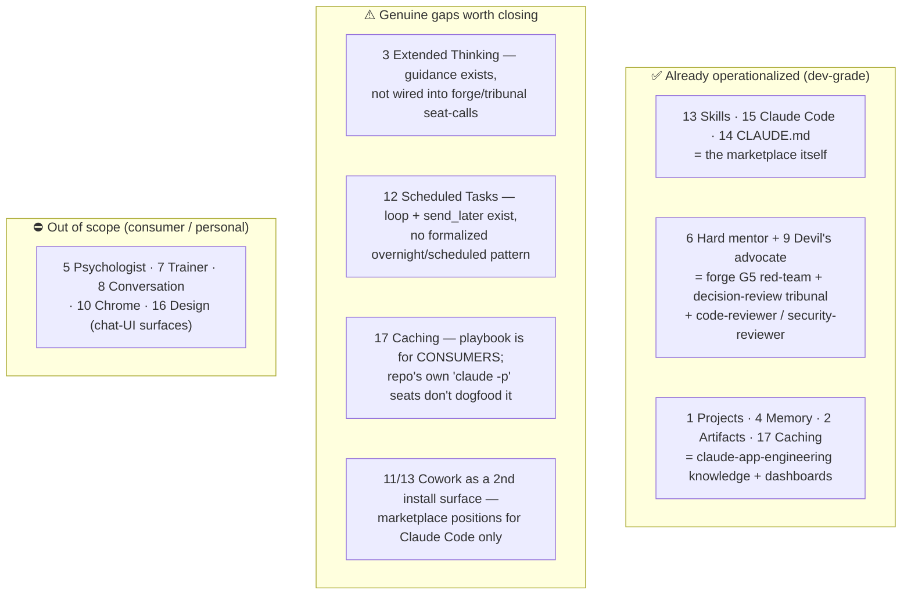

# Gap analysis: RavenClaude vs. "Claude Can Do All of This" (Kopadze, 17 features)

**Date:** 2026-06-04
**Source:** `@AnatoliKopadze` on X — *"Claude Can Do All of This. Most People Have No Idea"* (`x.com/AnatoliKopadze/status/2057813254617858078`)
**Author of analysis:** Claude Code (RavenClaude session `claude/gap-analysis-article-1i6jJ`)

---

## Context — what this is and why

Matt asked for a gap analysis between **what RavenClaude does today** and **what is possible** according to the linked article.

A transparency note on retrieval, because it shaped the work: this remote session's network is locked down — `WebFetch` returns HTTP 403 for *every* host (verified against `x.com`, `claude.com`, and `example.com`; it is globally disabled here), and Bash `curl` is allow-listed to `github.com` only. So I could not fetch the post in-session. My first pass mis-identified the article — the author's adjacent posts that week were about Claude Code "Dynamic Workflows," and lacking the text I reconstructed the analysis against *that* frontier. That was wrong. The **full verbatim article text was then supplied directly**, and this document is rebuilt against the actual content. The episode is itself a small lesson: a confident reconstruction from neighbouring evidence is not the source, and it pays to say so.

The actual post is a consumer-awareness listicle enumerating **17 Claude capabilities**:

| # | Feature | # | Feature |
|---|---|---|---|
| 1 | Projects (persistent context) | 10 | Claude in Chrome |
| 2 | Artifacts (working apps in chat) | 11 | Claude Cowork (desktop + filesystem) |
| 3 | Adaptive / Extended Thinking | 12 | Scheduled Tasks ("works while you sleep") |
| 4 | Memory (profile over time) | 13 | Skills (Cowork plugins) |
| 5 | Personal-psychologist role prompt | 14 | CLAUDE.md (rules read every session) |
| 6 | Hard-mentor role prompt | 15 | Claude Code (terminal coding agent) |
| 7 | Personal-trainer role prompt | 16 | Claude Design (visual work) |
| 8 | Practice-a-conversation role prompt | 17 | Prompt Caching (developer, ~90% cost cut) |
| 9 | Devil's-advocate role prompt | | |

## Framing — the right question for a marketplace

RavenClaude is a Claude Code **plugin marketplace** for *building with* Claude — not a consumer end-user of the chat product. So "does the repo click the Artifacts button" is the wrong test. The right question, per feature, is:

> Does the marketplace already operationalize the **developer-grade** version of this capability — is there a **genuine gap** — or is it **out of scope** for a domain-neutral dev marketplace?

Every one of the 17 sorts into one of those three buckets.

---

## Bucket A — already covered (cite, don't rebuild)

| Article feature | RavenClaude embodiment |
|---|---|
| **13 Skills, 15 Claude Code, 14 CLAUDE.md** | The marketplace's entire reason for being: `plugins/*/skills/`, `.claude-plugin/marketplace.json`, and `CLAUDE.md`/`AGENTS.md` as the spine. The article frames these as "hidden features"; RavenClaude treats them as the product. |
| **6 Hard mentor + 9 Devil's advocate** | `plugins/ravenclaude-core/skills/forge-pipeline/SKILL.md` G5 **red-team** + G4a **critic**; the `decision-review` **tribunal** (`plugins/ravenclaude-core/scripts/thing-decide.py`); and the `code-reviewer` / `security-reviewer` agents. The article's "stop validating, start stress-testing" prompt is, here, an architectural principle rather than a one-off chat trick. |
| **1 Projects / 4 Memory** | `plugins/claude-app-engineering/knowledge/context-engineering-2026.md` (the dev-grade treatment), plus the repo's own `MEMORY.md` index, `.ravenclaude/` state, and the Sága run dirs under `.ravenclaude/runs/`. |
| **2 Artifacts** | `scripts/generate-dashboards.py` → `plugins/ravenclaude-core/dashboard.html` and `repo-guide.html`; the `structured-output` skill and `plugins/claude-app-engineering/knowledge/tool-use-and-structured-output.md`. |
| **17 Prompt Caching** | `plugins/claude-app-engineering/knowledge/prompt-caching-playbook.md` already teaches it — but consumer-facing only; see gap **B3** for the dogfooding half. |
| **3 Thinking / 16 Design** | `plugins/claude-app-engineering/knowledge/model-selection-and-2026-capability-map.md` covers thinking modes; the `web-design` plugin + `designer` agent cover visual work. Both partial — see **B1**. |

**Read:** of the 17, roughly ten already exist in developer-grade form, and three of those (Skills, Claude Code, CLAUDE.md) are the marketplace's core product, not add-ons.

## Bucket B — genuine gaps (the actionable core)

### B1 · Extended Thinking is documented but not wired into the deliberation engines
`model-selection-and-2026-capability-map.md` explains thinking modes for *consumers building apps*. But the repo's own high-stakes reasoning paths — `forge-pipeline` seats and the `decision-review` tribunal, both invoked via `claude -p` — carry **no explicit thinking-budget guidance**. That is exactly the "complex decision / strategic analysis" case the article says benefits most from Extended Thinking.
**Gap:** a thinking-budget convention for seat / critic / red-team / tribunal calls (when to engage extended thinking, and how much).

### B2 · No formalized "works while you sleep" pattern
The pieces exist — the `loop` skill, the `send_later` self-check-in tool, and `subscribe_pr_activity` PR-babysitting — but there is no single documented **scheduled / overnight-run** pattern that ties them into the article's "Scheduled Tasks" idea, nor a comfort-posture that sanctions a scoped unattended run.
**Gap:** a knowledge note + a posture for sanctioned unattended/scheduled runs, sitting inside the existing guardrails (`guard-destructive.sh`, `comfort-posture.yaml`).

### B3 · Caching is taught but not dogfooded *(cheapest, highest-ROI)*
The repo fires many `claude -p` subprocesses (forge seats, tribunal decisions) whose prompts repeat large stable context — `CLAUDE.md`, gate prompts, rubrics — i.e. prime `cache_control` candidates. Yet `prompt-caching-playbook.md` aims at *consumers*, not the repo's own machinery.
**Gap:** apply the existing playbook internally to the seat/tribunal call sites to cut their cost. The knowledge already exists; only the application is missing.

### B4 · Single install surface *(strategic, not code)*
Article item 13 shows Skills installing into **Cowork** ("Browse plugins → install"), and items 11 (Cowork) and 12 (Scheduled Tasks) are themselves plugin/skill consumers. RavenClaude positions exclusively as a *Claude Code* marketplace.
**Gap / question for Matt:** is Cowork a second distribution surface worth claiming for these plugins, or is Claude Code-only a deliberate focus? This is a genuine-preference call, surfaced here rather than decided.

## Bucket C — out of scope for a domain-neutral dev marketplace

Considered and deliberately excluded (House rule #1 keeps `ravenclaude-core` domain-neutral):

- **5 Personal psychologist / 7 Personal trainer / 8 Practice a conversation** — personal-life role prompts; no place in a build-tooling marketplace.
- **10 Claude in Chrome** — browser automation; not a marketplace concern today.
- **16 Claude Design (chat-UI surface)** — the *visual-design-tool* surface is consumer; the repo's design needs are met by the `web-design` plugin and `designer` agent.

These are listed so the reader can see they were weighed, not missed.

---

## Headline finding

RavenClaude already operationalizes the **developer-grade version of ~10 of the 17** capabilities, and treats three of them (Skills, Claude Code, CLAUDE.md) as its core product. The real gaps are narrow and all about **dogfooding and reach**, not missing knowledge:

1. **B3 — dogfood prompt caching** in the repo's own `claude -p` seats. Cheapest, highest ROI; the playbook already exists.
2. **B1 — thinking-budget convention** for forge/tribunal reasoning calls.
3. **B2 — formalize the overnight/scheduled-run pattern** from the loop / `send_later` / PR-babysitting pieces.
4. **B4 — decide whether Cowork is a second audience** (strategic question for Matt).

The consumer/personal items (Bucket C) are correctly out of scope.

## Recommendations (prioritized — proposals, not committed work)

| Priority | Action | Why first / notes |
|---|---|---|
| **P1** | Dogfood `cache_control` on the forge-seat and tribunal `claude -p` call sites, per the existing `prompt-caching-playbook.md`. | Highest ROI, lowest risk; knowledge already in-repo. Measure seat-call token cost before/after. |
| **P1** | Add a thinking-budget convention to `forge-pipeline` and `decision-review` (when seats/critic/red-team engage extended thinking). | Directly improves the repo's highest-stakes reasoning; small, localized doc + prompt change. |
| **P2** | Write an overnight/scheduled-run pattern note tying `loop` + `send_later` + `subscribe_pr_activity` together, gated by a new comfort-posture. | Must respect the existing destructive/high-blast guards; design before building. |
| **P2 (decision)** | Resolve B4 — Cowork as a second install surface — with Matt before any packaging change. | Genuine-preference call; route through the tribunal / `AskUserQuestion` per repo convention. |

Each recommendation is a separate effort; this document does not implement any of them.
