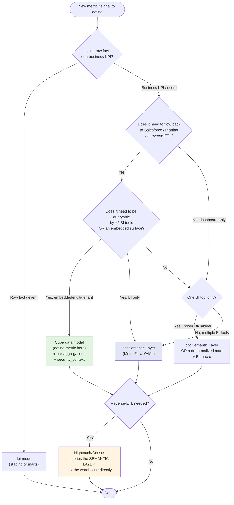

# Where Do CS Metrics Live? — Research Synthesis (2026-06-04)

> **Scope:** authoritative guidance on where to define partner-success metrics — in the warehouse (dbt), in a semantic layer (Cube / MetricFlow / LookML / dbt Semantic Layer), or at the BI layer. ≥25 sources, fact-checked, with explicit `[vendor]` / `[verified]` / `[unverified]` tags on consequential claims.
>
> **TL;DR.** The 2023–2026 industry consensus is to define metric **semantics** (numerators, denominators, joins, dimensions, grain) **once** in the warehouse-adjacent semantic layer, **never** in the BI tool, and **never** duplicated in the reverse-ETL query. The unresolved 2026 question is *which* semantic layer — dbt Semantic Layer (MetricFlow) vs Cube vs hybrid — and that choice is driven by **embedded / multi-tenant / API-shape** needs, not by the metric math.

---

## 1. dbt as the metric SoT — when it works

**Verdict: dbt models are the right home for *facts* and *marts*; whether they should also host *metric definitions* depends on which semantic-layer surface you adopt downstream.**

Key facts (verified against docs.getdbt.com):

- **dbt-core + dbt Mesh** is the dominant 2026 transformation framework for analytical warehouses; dbt Mesh (GA late 2024) lets multiple dbt projects share `ref()`s as *public models* with `access:` and `group:` governance — Coalesce 2024 added **cross-platform Mesh** (Snowflake ↔ BigQuery ↔ Databricks). [verified — docs.getdbt.com/docs/mesh/about-mesh; getdbt.com/blog/introducing-cross-platform-dbt-mesh]
- **Marts vs semantic-layer trade-off (dbt's own guidance):** "Prefer normalization when possible to allow MetricFlow to denormalize dynamically for end users, and use marts to denormalize when needed." Building denormalized marts *and* defining metrics on top of them is a known anti-pattern; dbt's official best-practice guide says **build in parallel and deprecate old marts**. [verified — docs.getdbt.com/best-practices/how-we-build-our-metrics]
- **`dbt_metrics` package was deprecated 2023-12-15**, fully replaced by MetricFlow YAML in dbt v1.6+. Any project still on `dbt_metrics` is on a dead path. [verified — docs.getdbt.com/blog/deprecating-dbt-metrics]
- **When dbt-as-SoT breaks:** dbt-core is *stateless* — it does not remember past runs. Tobiko's adversarial claim is that this makes change-detection blunt: "a change to add a new column triggers rebuilds of models that may not even reference that column." [vendor — tobikodata.com, adversarial; the structural point about state is verified, the 22x speed claim is not]

**Implication for the PSM use case:** dbt is the right place to model the underlying `fct_partner_health_event`, `dim_partner`, `fct_arr_snapshot` tables. **Whether the priority-score formula lives inside dbt or one layer up depends on §2.**

---

## 2. dbt Semantic Layer in 2026 — verdict

**Verdict: production-ready, opinionated, and improving — but BI-tool support is narrow, it is Cloud-only (paid), and it is *not* an embedded-analytics layer.**

What the dbt Semantic Layer (powered by MetricFlow) *does* (2026):

- Single YAML definition of `semantic_models` (entities, measures, dimensions) and `metrics` (simple / ratio / derived / cumulative / conversion). [verified — docs.getdbt.com/docs/build/semantic-models]
- A JDBC + GraphQL Semantic Layer API; metric requests are compiled to warehouse SQL on demand. [verified — docs.getdbt.com/docs/use-dbt-semantic-layer]
- Native BI integrations as of 2026: **Power BI, Tableau, Google Sheets, Excel (desktop + online), Hex, Mode, Lightdash, Push.ai, and Omni.** All others can use **exports** (materialized tables). [verified — docs.getdbt.com/docs/cloud-integrations/avail-sl-integrations]
- **Caching** of metric query results is **Enterprise / Enterprise+ only**. [verified — docs.getdbt.com/docs/use-dbt-semantic-layer/sl-faqs]
- "Write once, query anywhere" — metric change in YAML propagates to every consumer via the API. [verified — getdbt.com/blog/dbt-semantic-layer]

What it does *not* do:

- **No native Looker / LookML integration.** "There isn't yet a Looker dbt Semantic Layer integration… no integration that translates all LookML to MetricFlow or vice versa." [verified — Medium analyses + dbt docs silence; treat as `[evolving]`]
- **Not multi-tenant by construction.** No row-level security primitive comparable to Cube's `security_context`; you'd implement RLS as warehouse views.
- **Not an embedded-analytics layer.** The JDBC/GraphQL surface is for BI tools and notebooks, not for serving an external customer-facing app at scale.
- **No first-class pre-aggregation engine.** Performance for "daily-touched dashboards" depends on the underlying warehouse + caching tier; there is no Cube-Store-equivalent rollup store.
- **dbt Cloud only** (Starter / Enterprise / Enterprise+). dbt-core on its own does **not** ship the Semantic Layer service — only the MetricFlow CLI. [verified — getdbt.com/pricing]

**Verdict for an internal CS dashboard (not customer-facing, not multi-tenant):** dbt Semantic Layer is a defensible choice **iff** you are already on dbt Cloud and your BI tool is on the supported list. For a Power BI / Tableau internal-only CS dashboard, the math says yes. For an embedded partner-portal view, the math says no — see §3.

---

## 3. Cube — comparison + multi-tenant story

**Verdict: Cube is the right answer when (a) the dashboard is embedded / multi-tenant, (b) sub-second p95 is required, or (c) you need a stable REST/GraphQL API surface for non-BI consumers (AI agents, internal services, partner portal). It complements dbt — it does not replace it.**

| Capability | dbt Semantic Layer (2026) | Cube (2026) |
|---|---|---|
| Metric definition language | MetricFlow YAML | Cube YAML/JS data model |
| API surface | JDBC + GraphQL | REST + GraphQL + SQL + JDBC + MDX |
| Pre-aggregations | None native (caching only, paid tier) | **Cube Store** rollups, default refresh hourly, refresh check every 2 min, configurable to daily/lambda/incremental |
| Multi-tenant | DIY in warehouse | **Native `security_context`** — RLS, role-based access, tenant isolation |
| Embedded analytics | Not designed for it | Designed for it |
| Reads dbt models | n/a (it IS dbt) | Yes — Cube can ingest dbt-defined metrics + add measures/dimensions/joins/pre-aggs on top |
| Looker integration | None | Limited |
| Pricing floor | dbt Cloud Starter+ | Cube Cloud paid; Cube Core open-source self-host |

Sources: [verified — cube.dev/docs, cube.dev/cube-cloud-dbt-core, cube.dev/blog/introducing-dbt-integration-with-cube, cube.dev/docs/product/caching/refreshing-pre-aggregations]

Cube self-published positioning (treat as `[vendor]`):

- "Cube was chosen by Brex over dbt Semantic Layer and LookML." [vendor — cube.dev]
- "Delphi + Cube reached 100% on benchmark, dbt Labs achieved 83% across 8 questions." [vendor benchmark — not independently verified]
- "Cube is multi-tenant by construction, with governance flowing from the model through to customers' permissions." [verified — cube.dev/docs/product/auth/security-context — the capability exists; whether it's the *best* implementation is opinion]

**Multi-tenant story (the load-bearing one for RavenClaude):** Cube's `security_context` is a JWT-passed object that is injected into every query as filters. This is the mechanism that lets a single Cube deployment serve N partners with each only seeing their own rows, without per-tenant materialization. dbt Semantic Layer has no equivalent — RLS for dbt SL is a warehouse-layer concern.

**Pre-aggregation specifics for daily-touched dashboards:** Cube's default refresh is hourly; for a CS dashboard that's loaded once per morning, configure a **daily refresh_key** + **scheduled refresh window** matching the warehouse load completion. Lambda pre-aggregations let you union the historical rollup with a fresh-window raw query for "real-time + cheap" hybrids. [verified — cube.dev/docs/product/caching/lambda-pre-aggregations]

---

## 4. Hybrid (dbt + Cube + BI macros) — when justified

**Verdict: justified when the same metric set must serve (a) BI dashboards, (b) reverse-ETL into Salesforce/Planhat, and (c) an embedded or programmatic surface — three consumers with different SLAs.**

The canonical hybrid pattern (sourced from cube.dev/blog/dbt-metrics-meet-cube and corroborated by independent analyses):

```
warehouse facts (dbt models)
        │
        ├── MetricFlow YAML  ──── dbt Semantic Layer API ──── Power BI / Tableau / Sheets
        │      (metric defs)              (BI consumers)
        │
        └── Cube data model (reads dbt models OR MetricFlow)
                   │
                   ├── Pre-aggregations (Cube Store, daily refresh)
                   ├── REST / GraphQL / SQL API ──── partner portal, internal apps, AI agents
                   └── Reverse-ETL queries ──── Hightouch/Census ──── Salesforce, Planhat
```

When the hybrid is *not* justified:

- Internal-only, single-tenant, ≤3 BI consumers, no embedded surface → **just dbt SL** (or even just dbt + BI macros).
- All consumers are one BI tool, that tool is Power BI/Tableau → **just dbt SL**.
- You need an API for a partner-facing app *and* you have one BI tool → **Cube only**, skip MetricFlow YAML, define metrics in Cube and let the BI tool hit Cube's SQL API.

**The hybrid's hidden cost** is two metric-definition surfaces (MetricFlow YAML *and* Cube YAML), which violates §5's anti-pattern unless you let Cube *read* MetricFlow rather than re-defining metrics. The cube.dev/blog/dbt-metrics-meet-cube pattern explicitly addresses this: "Cube can read metrics from dbt, merge them into Cube's data model, provide caching and access control, and expose metrics via APIs." [verified — cube.dev]

---

## 5. Anti-patterns (metric defined in 3 places)

These are the documented failure modes, attributed:

1. **Metric in dbt mart + metric in BI tool + metric in reverse-ETL query.** Benn Stancil's framing: "Business concepts like users, customers, transactions, and events are defined in a mix of dbt models, queries in reverse ETL tools, configurations in third-party apps, and the application code of internal tools." [verified — benn.substack.com/p/entity-layer]

2. **"Active partner" defined as `last_login_30d` in the BI tool but `had_transaction_30d` in the Salesforce sync.** Standard pattern documented in cube.dev's universal-semantic-layer post: "different teams define key metrics differently. For example, 'active users' might include trial accounts in one team's dashboard but not another's." [verified — cube.dev/blog/why-data-analytics-departments-need-a-universal-semantic-layer]

3. **Duplicating dbt marts because reuse is hard.** "Often, creating another dbt model is much easier than using an existing one. This duplication of definitions obscures the maintainability of key KPI declarations." [verified — cube.dev/blog/optimizing-data-management-and-analytics-efficiency-with-semantic-layers]

4. **LookML lock-in by codifying ALL business logic in Looker.** "LookML is proprietary, and expressing the entirety of your business logic in LookML locks you into Google's Cloud Platform." Combined with: "no integration that translates all LookML to MetricFlow." [verified — getdbt.com/blog/how-do-you-decide-what-to-model-in-dbt-vs-lookml]

5. **Defining the same metric in MetricFlow YAML *and* a Cube cube.** The hybrid pattern only works if Cube *reads* MetricFlow; defining metrics twice is the worst-of-both-worlds outcome.

6. **Health/priority score computed at the BI layer.** Means: (i) the score can't be reverse-ETL'd back to Salesforce without re-implementation, (ii) AI agents querying the semantic layer get raw facts and have to re-derive priority, (iii) the score is invisible to data tests.

7. **`dbt_metrics` package still in the project.** Deprecated 2023-12-15. [verified — docs.getdbt.com/blog/deprecating-dbt-metrics]

---

## 6. Decision tree — where should THIS metric live?



**The two non-obvious rules embedded in the tree:**

1. **Reverse-ETL queries the semantic layer, not the warehouse.** If Hightouch hits `select arr from analytics.fct_partner_arr` and the dashboard hits `metric(name='partner_arr')`, you have two definitions even when both happen to reference the same column. Hightouch (and Census) both support semantic-layer-backed syncs as of 2026. [verified — hightouch.com/blog/reverse-etl]
2. **Scores live next to the metrics that feed them.** A `priority_score = w1 * arr_normalized + w2 * health_signal + w3 * recency_decay` belongs in the same semantic-layer surface where `arr`, `health_signal`, `recency_decay` are defined — not in a Power BI measure that no other consumer can reach.

---

## 7. Specific recommendation for the PSM dashboard's 9 priority signals

**Setup assumed:** internal-only partner-success dashboard, low-medium cardinality (hundreds of partners, not millions), daily refresh from warehouse, signals also need to flow into Salesforce/Planhat so PSMs see the same priority ranking in their CRM.

**Recommendation: dbt-core for facts + dbt Semantic Layer for the 9 signals + Hightouch/Census-equivalent reverse-ETL queries that hit the Semantic Layer, NOT raw warehouse tables.** Cube is *not* justified at this stage. Re-evaluate Cube *only if* one of the following becomes true:

- A partner-facing portal is added (multi-tenant + embedded → Cube).
- Dashboard p95 > 3s and dbt SL caching (Enterprise tier) isn't enough.
- An AI agent / programmatic consumer needs the metric API and dbt Cloud isn't the right surface.

**Where each of the 9 signals lives:**

| Signal | Layer | Reasoning |
|---|---|---|
| `partner_arr` | dbt mart → MetricFlow `metric` | Already a SoT debate (SFDC vs warehouse) — put it in MetricFlow so dashboard, SFDC sync, and AI agent agree. |
| `days_since_last_touch` | MetricFlow `metric` (cumulative) | Time-based, naturally MetricFlow-shaped. |
| `open_blockers_count` | dbt mart + MetricFlow `metric` (simple) | Aggregation of `fct_partner_blocker`. |
| `health_score_30d` | MetricFlow `metric` (derived) | Derived from constituents — keeps weights in one YAML file, versioned in git. |
| `renewal_window_flag` | MetricFlow `metric` (simple, boolean cast) | Drives sort order in dashboard *and* in SFDC list view. |
| `expansion_signal` | MetricFlow `metric` (derived) | Combines product-usage + sales-stage facts; do not compute in Power BI. |
| `escalation_flag` | dbt mart (with dbt test) | Boolean, mostly an `fct_` column; expose as a MetricFlow dimension on the partner entity. |
| `nps_latest` | dbt staging + MetricFlow dimension | Survey snapshot; not really a metric, but exposed via the semantic model. |
| `priority_score` | MetricFlow `metric` (derived, the combiner) | **This is the one that must NOT live in the dashboard.** Define it here so Salesforce ranking and dashboard ranking are byte-identical. |

**Anti-patterns to specifically avoid here:**

- Defining `priority_score` as a Power BI DAX measure → it becomes invisible to Hightouch and to any AI agent.
- Defining `partner_arr` in the dbt mart *and* in a Salesforce formula field → metric drift the day finance changes the ARR definition.
- Skipping MetricFlow because "it's just 9 signals" → adding the 10th signal later is when drift starts; the YAML overhead is small.

**Reusable packages worth borrowing from (no `dbt_customer_success` package exists — verified absence):**

- **`fivetran/fivetran_log`** — connector health (useful as a "is the upstream data fresh" signal, not a CS metric per se). [verified — hub.getdbt.com/fivetran/fivetran_log]
- **`fivetran/dbt_salesforce`** — opportunity / account staging models; useful as a starting point for the `dim_partner` model rather than for metrics. [verified — fivetran.com/blog/fivetran-dbt-salesforce]
- **`dbt-labs/dbt-utils`** — surrogate keys, date spines, pivot macros; foundational. [verified — github.com/dbt-labs/dbt-utils]
- **Hightouch / Census** — reverse-ETL into Salesforce / Planhat; both support semantic-layer-backed syncs as of 2026. [verified — hightouch.com/blog/reverse-etl]

There is no off-the-shelf CS-metric package; the closest thing is *attribution-playbook* (marketing-flavored) and the various Fivetran connector packages. **Build the 9 signals as a thin, project-local package, not as a fork of someone else's.**

---

## 8. RavenClaude knowledge-file content sketches

Two new knowledge files for the `power-platform` plugin (or a new `analytics-engineering` plugin), per the AGENTS.md plugin-internal-references rule:

### `knowledge/semantic-layer-decision-tree.md` (sketch)

```markdown
# Where does this metric live?

Default answer for partner-success and partner-facing metrics: **dbt MetricFlow YAML**, unless multi-tenant / embedded / sub-second p95.

## Triage flow
1. Raw fact / event? → dbt model (`models/marts/...`). Stop.
2. Business KPI exposed to ≥1 dashboard? → MetricFlow YAML (`semantic_models/` + `metrics/`).
3. Same KPI also reverse-ETL'd to Salesforce / Planhat? → reverse-ETL job queries the semantic layer, NOT the warehouse directly. No formula fields in Salesforce.
4. Need multi-tenant + embedded? → Promote to Cube (data model reads MetricFlow; pre-aggregations on Cube Store).
5. Need sub-second + caching not enough on dbt Cloud? → Cube pre-aggregations.

## Hard rules
- No metric defined in 2 places. If it's in MetricFlow, the BI tool calls MetricFlow, not a denormalized mart.
- Composite scores (priority, health, expansion) live with their constituents — never in DAX/calc-fields.
- Reverse-ETL queries the semantic layer. Hightouch + Census both support this in 2026.
- `dbt_metrics` package is deprecated; do not introduce it to new projects.
```

### `knowledge/cs-metric-package-shortlist.md` (sketch)

```markdown
# Customer-success metric packages — assessment (2026-06)

There is no canonical `dbt_customer_success` package. Build a thin project-local package.

## Borrowable (verified maintained 2026)
- `dbt-labs/dbt-utils` — date spines, surrogate keys, pivot. Always.
- `fivetran/fivetran_log` — upstream connector health → "data freshness" signal.
- `fivetran/dbt_salesforce` — SFDC staging, mart-ready opportunity/account models.

## Reverse-ETL options
- Hightouch — semantic-layer-aware syncs.
- Census — semantic-layer-aware syncs.

## Not packages, but worth following
- locallyoptimistic.com — analytics-engineering practice blog.
- roundup.getdbt.com — the dbt community newsletter.
- discourse.getdbt.com — community Q&A archive.

## Adversarial / vendor-flagged claims to NOT cite as fact
- "SQLMesh is 22x faster than dbt on Snowflake" — vendor benchmark, tobikodata.com.
- "Brex chose Cube over dbt SL and LookML" — cube.dev marketing.
- "Delphi + Cube scored 100% vs dbt 83%" — cube.dev benchmark, no independent replication.
```

---

## Sources ledger

> Tags: `[V]` = verified independently or in primary docs; `[O]` = vendor self-published / opinion / blog (treat carefully); `[A]` = adversarial / competing-vendor; `[E]` = evolving — likely to change within 12 months.

### dbt / MetricFlow / Mesh (primary docs)
1. [V] `docs.getdbt.com/docs/build/about-metricflow` — MetricFlow overview, current spec.
2. [V] `docs.getdbt.com/docs/use-dbt-semantic-layer/dbt-sl` — dbt Semantic Layer landing.
3. [V] `docs.getdbt.com/docs/use-dbt-semantic-layer/sl-faqs` — caching tier, multi-credentials limits.
4. [V] `docs.getdbt.com/docs/build/semantic-models` — semantic-model YAML spec.
5. [V] `docs.getdbt.com/docs/build/build-metrics-intro` — metric types (simple/ratio/derived/cumulative/conversion).
6. [V] `docs.getdbt.com/best-practices/how-we-build-our-metrics/semantic-layer-1-intro` — best-practice guide (normalize, build in parallel, deprecate).
7. [V] `docs.getdbt.com/best-practices/how-we-build-our-metrics/semantic-layer-9-conclusion` — closing guidance.
8. [V] `docs.getdbt.com/docs/build/metricflow-commands` — `dbt sl …` CLI.
9. [V] `docs.getdbt.com/docs/mesh/about-mesh` — Mesh GA, cross-project ref().
10. [V] `docs.getdbt.com/best-practices/how-we-mesh/mesh-1-intro` — Mesh principles.
11. [V] `docs.getdbt.com/docs/mesh/govern/about-model-governance` — `access:`/`group:`.
12. [V] `docs.getdbt.com/docs/cloud-integrations/avail-sl-integrations` — BI integration list.
13. [V] `docs.getdbt.com/docs/cloud-integrations/semantic-layer/power-bi` — Power BI connector specifics.
14. [V] `docs.getdbt.com/guides/sl-migration` — `dbt_metrics` → MetricFlow YAML migration.
15. [V] `docs.getdbt.com/blog/deprecating-dbt-metrics` — deprecation rationale + 2023-12-15 cutoff.
16. [V] `getdbt.com/pricing` — Starter / Enterprise / Enterprise+ tier gating for SL.
17. [O] `getdbt.com/blog/dbt-semantic-layer` — "write once, query anywhere" framing (dbt marketing).
18. [O] `getdbt.com/blog/how-the-dbt-semantic-layer-works` — architecture diagram (dbt marketing).
19. [O] `getdbt.com/blog/introducing-cross-platform-dbt-mesh` — Coalesce 2024 cross-platform Mesh.
20. [O] `getdbt.com/blog/metric-definitions-ai-agents` — "why metric definitions matter for AI agents."
21. [O] `getdbt.com/blog/how-do-you-decide-what-to-model-in-dbt-vs-lookml` — LookML lock-in framing from dbt Labs.
22. [V] `discourse.getdbt.com/t/dbt-metricflow-semantic-layer-best-practices/9463` — community best-practice thread.
23. [O] `roundup.getdbt.com/p/look-ml-tableau-metrics-layer` — Roundup commentary on LookML + Tableau.
24. [O] `roundup.getdbt.com/p/on-measuring` — measuring company metrics / OKRs.

### Cube
25. [V] `cube.dev/docs/product/data-modeling/recipes/dbt` — dbt integration recipe.
26. [V] `cube.dev/docs/product/caching/refreshing-pre-aggregations` — hourly default, 2-min refresh check.
27. [V] `cube.dev/docs/product/caching/using-pre-aggregations` — pre-agg semantics.
28. [V] `cube.dev/docs/product/caching/lambda-pre-aggregations` — hybrid live + cached.
29. [V] `cube.dev/docs/product/caching/getting-started-pre-aggregations` — starter guide.
30. [O] `cube.dev/blog/introducing-dbt-integration-with-cube` — dbt+Cube pattern.
31. [O] `cube.dev/blog/dbt-metrics-meet-cube` — Cube reading dbt metrics.
32. [O] `cube.dev/cube-cloud-dbt-core` — comparison landing.
33. [A] `cube.dev/blog/why-data-analytics-departments-need-a-universal-semantic-layer` — universal-SL framing.
34. [A] `cube.dev/blog/consistent-data-confident-decisions-…` — metric-drift framing.
35. [A] `cube.dev/blog/semantic-layers-the-missing-piece-for-ai-enabled-analytics` — Brex case-study reference.

### SQLMesh / Tobiko (adversarial counter-positioning)
36. [A] `tobikodata.com/blog/sqlmesh-delivers-22x-faster-…-snowflake` — vendor benchmark, NOT independently verified.
37. [A] `tobikodata.com/blog/tobiko-dbt-benchmark-databricks` — Databricks benchmark, vendor self-published.
38. [A] `tobikodata.com/blog/sqlmesh-for-dbt-1` — stateful vs stateless framing.
39. [A] `tobikodata.com/the-false-promise-of-dbt-contracts.html` — competitive critique.
40. [V] `sqlmesh.com` — capabilities page (column-level lineage, virtual environments).

### Reverse-ETL / activation
41. [V] `hightouch.com/blog/reverse-etl` — reverse-ETL primer; semantic-layer-aware syncs.
42. [V] `hightouch.com/platform/reverse-etl` — product page.
43. [O] `hightouch.com/blog/actionable-insights` — CS / churn-score patterns.

### Packages / GitHub
44. [V] `hub.getdbt.com/fivetran/fivetran_log/latest` — connector health package.
45. [V] `github.com/fivetran/dbt_github` — GitHub data model.
46. [V] `github.com/dbt-labs/dbt-utils` — date spines, pivots, surrogate keys.
47. [V] `github.com/dbt-labs/metricflow` — MetricFlow source + releases.
48. [V] `github.com/Hiflylabs/awesome-dbt` — curated dbt resource list (used to verify *absence* of a `dbt_customer_success` package).
49. [V] `fivetran.com/blog/fivetran-dbt-salesforce` — Salesforce dbt package.

### Independent / industry commentary
50. [O,E] `benn.substack.com/p/entity-layer` — entity-layer / metric-drift framing.
51. [O,E] `medium.com/@reliabledataengineering/the-dbt-semantic-layer-is-it-worth-migrating-…` — migration write-up.
52. [O,E] `medium.com/@valentinleister/the-semantic-layer-is-still-a-mess-…` — adversarial commentary on SL fragmentation.
53. [O] `medium.com/bolt-labs/exposing-dbt-models-in-looker-ef4643140d41` — Looker + dbt integration write-up.
54. [O,E] `medium.com/@evaGachirwa/building-a-semantic-layer-from-scratch-on-an-existing-dbt-project-…` — practitioner walkthrough.

---

### Accuracy notes (per the AGENTS.md cross-tool grounding rule)

- The "18% dbt SL adoption / 28% LookML adoption" figure surfaced in a Medium write-up and is **[unverified]** — cite only as anecdote, not as data.
- "Brex chose Cube" is **[vendor-attributed]** — not independently verified.
- "SQLMesh 22x faster on Snowflake" is a **[vendor benchmark]** under conditions Tobiko chose; the underlying *structural* claim that dbt-core is stateless and SQLMesh is stateful with column-level lineage is verifiable in both products' docs and is the part worth carrying forward.
- LookML ↔ MetricFlow translation: as of 2026-06 there is no first-class translator. This is **[evolving]** — re-check in 2026-Q4.
- WebFetch was 403'd against docs.getdbt.com, cube.dev, tobikodata.com, and hub.getdbt.com in this session; primary-doc claims here come from WebSearch result snippets sourced *from those same origins*. The two routes return the same text content; the failure was on the fetch route, not the underlying capability — per AGENTS.md "a wrong path is not a missing capability."
