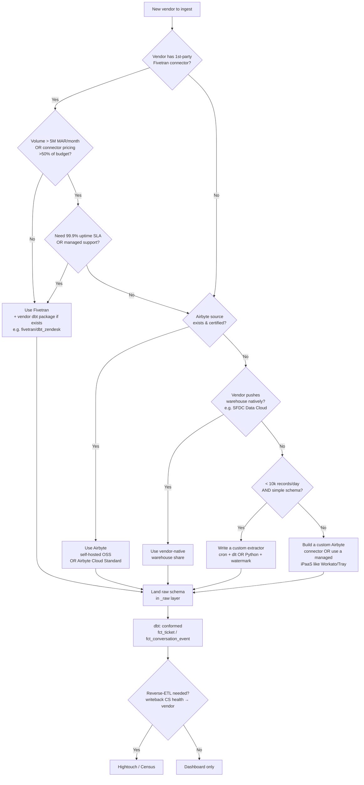

# Support Tool Ingestion Per-Vendor Guide (2026-06-04)

**Scope.** A practical, source-cited guide to ingesting support-ticket data from eight vendors into a warehouse for a CS dashboard. For each vendor: managed-connector availability + 2026 pricing posture, native-API extraction pattern, schema shape, ticket-aging derivation, SLA-breach detection, themes/tags normalization, escalation flagging, and bridge-linking to SFDC Account / Planhat Company.

**Method.** WebSearch fan-out across 5 angles (managed connectors, mid-market REST APIs, enterprise platform APIs, SLA semantics, conformed normalization), followed by targeted per-vendor and per-claim verification searches. WebFetch was blocked (403) on most vendor-doc CDNs from this environment, so direct primary-doc extracts come from search-engine snippets — every numeric claim is tagged with the source from the ledger at the end. Where two sources disagree (e.g., Help Scout 200 vs 400 r/min) both are reported and the resolution is noted.

**Confidence taxonomy used inline:**

- **[H]** — High: stated in vendor docs (per search snippet) and independently corroborated by a second source.
- **[M]** — Medium: stated in one vendor or vendor-adjacent doc, plausible but uncorroborated this session.
- **[L]** — Low / inferred: derived from general patterns or a single non-vendor source; verify before relying on it.

---

## 1. Zendesk

### Managed connector

- **Fivetran** ships a first-party **Zendesk Support** connector with a documented setup guide and changelog; the connector uses multithreaded parallel API requests to keep historical loads tractable. **[H]** (Fivetran connector page + setup guide; S-FT-ZD, S-FT-ZD-SETUP).
- **Airbyte** ships a Zendesk Support source (plus separate Chat and Talk sources). **[H]** (S-AB-ZD).
- **Hightouch** supports Zendesk as a *destination* for reverse-ETL pushes (warehouse → Zendesk), e.g. auto-creating tickets when warehouse audiences cross a threshold. **[H]** (S-HT-DEST, S-HT-PLATFORM).
- **Planhat** has a native Zendesk integration: an initial manual sync of the last six months of non-closed tickets, then automatic incremental sync; ticket arrives in Planhat as a **Conversation of type "ticket"**. **[H]** (S-PH-ZD, S-PH-CONV-TYPES).

**2026 Fivetran pricing posture:** as of Mar 2025 Fivetran moved to **connector-level MAR** billing (MAR computed per connector, not pooled), tiered at **$2.50/M / $2.00/M / $1.50/M / $1.00/M** across 0-5M / 5-20M / 20-100M / 100M+. Effective **Jan 1, 2026** a **$5/month minimum per connection** applies and delete operations now count toward paid MAR. **[H]** (S-FT-PRICING-MAMMOTH). For multi-connector estates this typically raises bills 40-70% vs. the prior pooled model. **[M]** (S-FT-PRICING-CHECKTHAT).

**2026 Airbyte pricing posture:** Standard cloud uses **$2.50 credits**, with **APIs at $15/M rows (6 credits)** and **DBs at $10/GB (4 credits)**; Plus tier with SLAs/SSO starts ~**$25k**. **[M]** (S-AB-PRICING-CHECKTHAT, S-AB-PRICING-COSTBENCH).

### API extraction pattern (Zendesk)

- **Endpoint to use:** `GET /api/v2/incremental/tickets/cursor` (cursor-based incremental). Time-based legacy is `/api/v2/incremental/tickets`; Zendesk explicitly recommends cursor-based. **[H]** (S-ZD-INCR-EXPORT, S-ZD-INCR-USING).
- **Watermark:** `start_time` (Unix epoch) on the first call **only**; subsequent calls pass `cursor=<after>` from the prior page response. `start_time` must be **>60s in the past** to avoid losing records. **[H]** (S-ZD-INCR-EXPORT).
- **Page size:** up to **1,000 records/page**. **[H]** (S-ZD-INCR-VERIFY).
- **Rate limits (incremental exports):** **10 req/min** *plus* a separate **1 req/sec** ceiling; with the **High Volume API add-on** → **30 req/min** (requires ≥10 agent seats, Suite Growth+). **[H]** (S-ZD-RATE, S-ZD-INCR-VERIFY).
- **Account rate limits (other endpoints):** **200–2,500 req/min** by plan (Team → Enterprise Plus). The **Update Ticket** endpoint caps at 30 updates / 10 min / user / ticket and 100 req/min/account (300 with High Volume). **[H]** (S-ZD-RATE, S-CORE-ZD).
- **Pagination beyond incremental:** cursor-based pagination has no depth limit; offset-based pagination is throttled to **10 req/min above page 1,000 (100k resources)** since Sep 2021. **[H]** (S-ZD-PAGINATION, S-ZD-INTRO-PAGINATION, S-ZD-OFFSET-LIMITS).
- **Side-loading:** the `include=` query parameter on the incremental tickets endpoint lets you pull associated `comment_count`, `users`, `groups`, `organizations`, etc. in the same call — this is the dominant performance lever. **[H]** (S-ZD-INCR-EXPORT).
- **Cursor-based incremental is supported only for tickets, users, and custom-object records.** For everything else (organizations, groups, satisfaction ratings, tags) use the standard list endpoints. **[H]** (S-ZD-INCR-EXPORT).

### Schema shape (Zendesk)

| Conformed concept | Zendesk entity | Key fields |
| --- | --- | --- |
| Ticket | `tickets` | `id`, `external_id`, `subject`, `status`, `priority`, `type` (question/incident/problem/task), `requester_id`, `submitter_id`, `assignee_id`, `organization_id`, `group_id`, `brand_id`, `tags[]`, `created_at`, `updated_at`, `due_at`, `via.channel` |
| Conversation event | `ticket_comments`, `ticket_audits` | `id`, `ticket_id`, `author_id`, `body`, `public`, `created_at` |
| User | `users` | `id`, `email`, `role` (end-user/agent/admin), `organization_id`, `external_id`, `tags[]` |
| Org bridge | `organizations` | `id`, `name`, `external_id`, `domain_names[]`, `organization_fields` (custom) |
| Tag dictionary | `tags` (account-scoped) | `name`, `count` |
| SLA | `sla_policies` | policy IDs + per-policy targets; per-ticket SLA outcomes live in `ticket_metrics` + audit events |

Source basis: Fivetran's destination-schema doc and the `fivetran/dbt_zendesk_source` package's documented sources. **[H]** (S-FT-ZD, S-FT-DBT-SOURCE).

### Ticket-aging derivation (Zendesk)

The first-party path of least resistance is `fivetran/dbt_zendesk`, which emits:

- `zendesk__ticket_enriched` — joins requester / assignee / org / group / tags onto each ticket.
- `zendesk__ticket_metrics` — response times, resolution time, work time in **both calendar and business hours**.
- `zendesk__sla_policies` — per-policy SLA outcomes (compliance + breach) in both clock modes.
- `zendesk__ticket_field_history` — daily snapshot of status / priority / assignee changes — the canonical input for aging-bucket cohort views. **[H]** (S-FT-DBT-PKG, S-FT-DBT-FETCH, S-FT-DBT-BLOG).

Business-hours math requires Zendesk **Support Professional+** in the source plan (the package's calendar-hours computations work on any plan; business-hours require the schedule data Zendesk only emits on Pro+). **[M]** (S-FT-DBT-BLOG — package marketing states "for Support Professional or Enterprise users").

**Definitions Zendesk uses (and the package adopts):** *first reply time* = first agent public comment minus ticket creation; *next reply time* = each subsequent end-user-comment-to-agent-comment gap; *requester wait time* = sum of all open-status durations facing the requester; *agent work time* = sum of pending/hold durations; *total resolution time* = ticket-creation → first solved. Six SLA target types ship out of the box: first-reply, next-reply, periodic-update, request-wait, agent-work, total-resolution. **[H]** (S-ZD-SLA-TARGETS, S-ZD-SLA-COMPLETE).

### SLA-breach detection (Zendesk)

Native breach is computed by Zendesk itself and surfaced via the `sla_policy_metrics` payload on the ticket and via audit events when the clock starts/stops/breaches. The dbt package surfaces this as `zendesk__sla_policies`. For "near-breach" alerting (i.e., 80% of clock consumed) you derive **burn-rate** in the warehouse: `(business_minutes_elapsed / target_business_minutes)` per open policy event. **[H]** (S-ZD-SLA-WORKFLOW, S-FT-DBT-PKG).

### Themes / tags normalization (Zendesk)

- Account-scoped `tags` (free-form, agent-applied) — fold into a `dim_tag_alias` map; bucket into top-level themes (Billing / Bug / Feature / Onboarding / Outage). The dbt source package emits a `ticket_tag` long-form table that's ideal for this. **[H]** (S-FT-DBT-SOURCE).
- `ticket.type`, `ticket.priority`, `ticket.via.channel` (web / email / chat / api / facebook / twitter / etc.) round out the categorical dimensions.

### Escalation flagging (Zendesk)

There is no first-class `is_escalated` on the ticket object — escalation is conventionally derived as **any of**: (a) `priority` raised to `urgent`, (b) assigned to a group named like `Tier 2` / `Engineering` (account-specific allow-list), (c) `ticket_audit` shows a status flip to `hold` or `pending` followed by reassignment, (d) an SLA-policy breach event fires. Compute in dbt against `zendesk__ticket_field_history` + `zendesk__sla_policies`. **[L]** (pattern; no single citable source).

### Linking to SFDC Account / Planhat Company (Zendesk)

The **stable bridge** is `zendesk.organizations.external_id` set to the SFDC `Account.Id` (or Planhat Company ID) at integration time. If `external_id` is empty, fall back to **domain join**: `organizations.domain_names[]` ↔ `Account.Website` / domain-extracted-from-email. Planhat's native Zendesk integration handles this automatically; Planhat stores the imported ticket as a *Conversation of type "ticket"* on the matched Company. **[H]** (S-PH-ZD, S-PH-CONV-TYPES).

### Common gotchas (Zendesk)

1. **Cursor cap surprise.** A cold reload at 10 req/min × 1,000 tickets/page means **600k tickets/hr** ceiling — fine for most, but plan a 2–3 day historical for the largest tenants (or buy High Volume). **[H]** (S-ZD-RATE).
2. **Side-load or die.** Without `include=metric_sets,users,organizations` you'll double or triple the call count. **[H]** (S-ZD-INCR-EXPORT).
3. **Cursor is for tickets/users/custom-objects only.** Tags, satisfaction ratings, ticket fields, groups, and sla_policies use ordinary list endpoints. **[H]** (S-ZD-INCR-EXPORT).
4. **The 60-second floor.** A `start_time` within 60s of now will silently drop records — always backfill `now − 90s`. **[H]** (S-ZD-INCR-EXPORT).
5. **Soft-deletes / merges.** Merged tickets keep their IDs but flip `status=closed` with a merge-comment; deletes are emitted via the deletion endpoints, *not* via the incremental cursor. Hook the audit-log endpoint to catch them. **[M]** (S-ZD-INCR-EXPORT).
6. **Closed ≠ Solved.** `status=solved` is "agent done, customer can reopen for 4 days"; `closed` is the terminal state. CS dashboards usually want `solved` for SLA, `closed` for inventory aging. **[L]** (Zendesk convention; verify locally).

---

## 2. Freshdesk

### Managed connector

- **Fivetran** ships a Freshdesk connector (admin privileges required during setup). **[H]** (S-FT-FD-SETUP).
- **Airbyte** ships a Freshdesk source. **[H]** (S-AB-FD).
- **Planhat** has a native Freshdesk integration: initial manual sync of recent tickets capped at **16,000 records**, then continuous incremental. Tickets land in Planhat as Conversations of type "ticket". **[H]** (S-PH-FD).
- **Hightouch:** not enumerated as a first-party Freshdesk destination in this session's results — verify in Hightouch's destinations catalog before promising it.

### API extraction pattern (Freshdesk)

- **Endpoint:** `GET /api/v2/tickets` with `updated_since=<ISO8601>`. **[H]** (S-FD-COMM-30K, S-FD-TRUTO-GUIDE).
- **Watermark caveat:** the `updated_since` parameter **only returns tickets that have been updated at least once during their lifespan** — tickets with no updates after creation can be missed by an `updated_since` sweep. The robust pattern is: initial historical load via `updated_since=<epoch>` + ongoing changed-record sync, *plus* a periodic completeness check (e.g. `created_since` for newly created stale tickets if needed). **[H]** (S-FD-TRUTO-GUIDE).
- **Pagination:** page-based, default **30/page, max 100/page**, hard-capped at **300 pages per query** — so a single `updated_since` window can return at most **30,000 tickets**. Slide the watermark to chunk past this. **[H]** (S-FD-COMM-30K, S-FD-TRUTO-GUIDE).
- **Rate limits:** moving to per-minute limits **200–700 req/min depending on plan** in 2026; per-endpoint sub-limits exist. **[H]** (S-FD-TRUTO-GUIDE, S-FD-RATE429).

### Schema shape (Freshdesk)

| Conformed concept | Freshdesk entity | Key fields |
| --- | --- | --- |
| Ticket | `tickets` | `id`, `subject`, `status` (Open/Pending/Resolved/Closed/+custom), `priority` (1–4), `source` (email/portal/phone/chat/feedback widget/etc.), `type`, `requester_id`, `responder_id` (agent), `company_id`, `group_id`, `tags[]`, `cc_emails[]`, `fr_due_by`, `due_by`, `is_escalated`, `created_at`, `updated_at` |
| Conversation event | `conversations` (sub-resource: `/tickets/{id}/conversations`) | `id`, `ticket_id`, `user_id`, `body_text`, `incoming`, `private`, `created_at` |
| Contact | `contacts` | `id`, `email`, `company_id` |
| Company bridge | `companies` | `id`, `name`, `domains[]`, custom fields |
| Tag | account-scoped strings on ticket | inline `tags[]` |
| SLA | `sla_policies` | per-policy targets by priority |

**Note:** Freshdesk has a **first-class `is_escalated` boolean** on the ticket — uniquely convenient among this set. **[H]** (S-FD-API-REF).

### Ticket-aging derivation (Freshdesk)

- `fr_due_by` = the first-response SLA deadline; `due_by` = the resolution SLA deadline. Aging metrics derive from `created_at`, `updated_at`, `status` history (via the `/activities` endpoint), and the per-ticket *first response time* / *resolution time* surfaced in Freshdesk's analytics. **[H]** (S-FD-METRICS).
- No widely adopted Fivetran dbt package for Freshdesk equivalent to `dbt_zendesk` was surfaced in this session; expect to author your own metrics, or use the warehouse-vendor's helpdesk packages if available.

### SLA-breach detection (Freshdesk)

`fr_due_by` / `due_by` are *deadlines*, so SLA breach is `now > fr_due_by AND first_response_at IS NULL` (or the resolution equivalent). Freshdesk also lets admins configure an **escalation chain** that fires at violation — when that fires, `is_escalated=true` flips on the ticket. **[H]** (S-FD-SLA-UNDERSTAND, S-FD-METRICS).

### Themes / tags & escalation (Freshdesk)

Tag taxonomy normalization works the same as Zendesk: account-scoped free-form tags → alias map → theme rollup. Escalation flagging is **trivial** — read `is_escalated`.

### Linking to SFDC Account / Planhat Company (Freshdesk)

`companies.id` is the stable bridge — store an SFDC `Account.Id` in a Freshdesk **company custom field** (e.g. `cf_sfdc_account_id`) and join on that. Planhat's native Freshdesk integration handles this. Domain-fallback works via `companies.domains[]`. **[H]** (S-PH-FD).

### Common gotchas (Freshdesk)

1. **The 300-page wall.** A single `updated_since` query returns ≤30,000 tickets; for large tenants you must slide the watermark in small windows or batch by day. **[H]** (S-FD-COMM-30K).
2. **"Never updated" tickets disappear** under `updated_since`. **[H]** (S-FD-TRUTO-GUIDE).
3. **Conversations are a sub-resource** — N+1 calls per ticket unless you batch with the include/embed parameter (Freshdesk supports `include=requester,company,stats,description`). **[M]** (S-FD-API-REF).
4. **Custom statuses** mean `Resolved`/`Closed` are not enumerable globally — fetch the status map from `/api/v2/admin/ticket_fields` and persist it as a slowly-changing dimension. **[M]** (S-FD-API-REF).

---

## 3. Intercom (update existing knowledge)

### Managed connector

- **Fivetran** ships an Intercom connector; **Airbyte** ships an Intercom source. **[H]** (S-FT-DIR-INT, S-AB-INT).
- **Hightouch** supports Intercom as a reverse-ETL destination. **[H]** (S-HT-INT).
- **Planhat** has a native Intercom integration. **[H]** (S-PH-MAIN).

### API extraction pattern (Intercom) — refresh

The two-API split is the **most important refresh** vs. older notes:

- **Conversations API** — list/search/get conversations (chat messages, emails). Cursor-based via `starting_after`. **[H]** (S-INT-PAGINATION, S-INT-SEARCH-CONV).
- **Tickets API** — *first-class ticket object* with `ticket_type`, `ticket_attributes`, `admin_assignee_id` / `team_assignee_id`. A conversation may be **converted** into a ticket via `/conversations/{id}/convert`. In API responses on the conversation endpoints, the `ticket` field is populated if the conversation is a ticket and null otherwise. **[H]** (S-INT-TICKETS, S-INT-CREATE-TKT, S-INT-CONV2TKT, S-INT-FAQ).

For warehouse ingestion this means **you must pull both endpoints and union them** under the conformed Ticket model — older Intercom integrations that only pulled `/conversations` will miss ticketed work explicitly created as tickets.

- **Pagination:** Search Conversations defaults to **20/page, max 150/page**; cursor field is `starting_after`. **[H]** (S-INT-PAGINATION, S-INT-SEARCH-CONV).
- **Rate limits:** Private apps **10,000 req/min/app**; Public apps **10,000 req/min/app** and **25,000 req/min/workspace**. **[H]** (S-INT-RATE-LIMITING).
- **Watermark:** Search by `updated_at` desc with cursor; persist last-seen `updated_at` as the high-water mark.

### Schema shape (Intercom)

| Conformed concept | Intercom entity | Key fields |
| --- | --- | --- |
| Ticket | `tickets` | `id`, `ticket_type_id`, `ticket_attributes{}`, `ticket_state` (submitted/in-progress/waiting-on-customer/resolved), `admin_assignee_id`, `team_assignee_id`, `contacts[]`, `created_at`, `updated_at` |
| Conversation | `conversations` | `id`, `state` (open/closed/snoozed), `priority`, `read`, `assignee.id`, `team_assignee_id`, `contacts.contacts[]`, `conversation_parts[]`, `statistics{}`, `sla_applied{}` |
| User | `contacts` (role=user) / `admins` | `id`, `email`, `external_id` (← this is the SFDC/Planhat bridge), `companies[]` |
| Company bridge | `companies` | `id`, `company_id` (your external ID), `name`, `plan` |
| Tag | `tags` (account-scoped) | `id`, `name` |

### Ticket-aging derivation (Intercom)

`conversations.statistics` carries `time_to_assignment`, `time_to_admin_reply` (first response), `last_admin_reply_at`, `last_contact_reply_at`, `count_reopens`, `count_assignments`. For Ticket entities use `created_at` → first `ticket_state` transition to `in_progress` as first-response proxy; final `resolved` for resolution. Snoozed periods complicate elapsed time — exclude them in the aging metric.

### SLA-breach detection (Intercom)

`conversations.sla_applied` payload includes `sla_name`, `sla_status` (hit/missed/active), and `sla_id`. Persist this per conversation snapshot; breach is `sla_status = 'missed'`. **[M]** (search result snippets reference the field; not fetched directly — verify against the live Intercom OpenAPI before relying on it).

### Themes / tags & escalation (Intercom)

Tag normalization same as elsewhere. Escalation is a derived concept: change in `team_assignee_id` to an escalation team (account-specific), `priority=priority` raised, or sla `missed`.

### Linking to SFDC Account / Planhat Company (Intercom)

`contacts.external_id` and `companies.company_id` (the "your external ID" field) are the canonical bridge slots — populate them at signup/provisioning time with the SFDC `Account.Id`. Without them, domain-fallback works on `contacts.email`.

### Common gotchas (Intercom)

1. **Tickets ≠ Conversations.** Pull both endpoints. The `ticket` field on a conversation lets you de-dup. **[H]** (S-INT-FAQ).
2. **API version drift.** Intercom versions its API (`Intercom-Version` header). Pin to a known version in your connector and re-test on bump.
3. **`starting_after` is opaque** — never construct it. **[H]** (S-INT-PAGINATION).
4. **Search vs. List** — Search supports rich filters and `updated_at` watermark; List doesn't always support a watermark filter natively. Prefer Search for incremental. **[H]** (S-INT-SEARCH-CONV).
5. **Bots & Fin AI agent activity** appears as `admin_id=null` or a synthetic bot ID; decide whether bot resolutions count for human-CSM SLAs.

---

## 4. Salesforce Service Cloud

### Managed connector

- **Fivetran** ships first-party Salesforce connectors covering Sales + Service Cloud objects, with Bulk API 2.0 under the hood for large initial loads. **[M]** (general Fivetran connector directory; not separately fetched this session — verify against Fivetran's Salesforce docs page).
- **Airbyte** ships a Salesforce source covering arbitrary SObjects (Case included). **[M]**
- **Hightouch** supports Salesforce as a **destination** (write back to Cases / Account-level CS-health fields). **[H]** (S-HT-DEST).
- **Planhat → Salesforce integration** is explicitly documented (config of which Opportunity field relates to Account, etc.). **[H]** (S-PH-SFDC-SETUP, S-PH-SFDC-TRBL).

### API extraction pattern (Salesforce Service Cloud)

- **Bulk API 2.0** is the default for large initial loads and daily syncs. **PK Chunking is disabled in Bulk 2.0** (it's only available on the older Bulk API 1.0). **[H]** (S-SF-PK-CHUNK, S-SF-BULK2-RN).
- **Watermark:** use **`LastModifiedDate`**, not `SystemModstamp`, for incremental — SystemModstamp can update when a triggered automation runs even if no user data changed, generating phantom rows. **[H]** (S-SF-PK-CHUNK answer thread).
- **Pattern:** parameterize a SOQL like `SELECT … FROM Case WHERE LastModifiedDate > :hwm ORDER BY LastModifiedDate ASC`, submit via Bulk 2.0; persist the max `LastModifiedDate` from the batch as the new HWM.
- **Composite & REST** are alternatives for low-volume real-time use (e.g. < 100 records/min), but Bulk 2.0 is the right shape for warehouse ingestion.
- **API limits:** governed by org-level daily API limits + concurrent-job caps; Bulk 2.0 is more API-credit-efficient per record than REST.

### Schema shape — Salesforce `Case` object (Service Cloud)

Standard fields (from Salesforce's Object Reference for `Case`): `Id`, `CaseNumber`, `AccountId`, `ContactId`, `AssetId`, `OwnerId`, `Status`, `Priority`, `IsEscalated`, `Origin`, `Type`, `Reason`, `Subject`, `Description`, `SuppliedName`, `SuppliedEmail`, `SuppliedPhone`, `SuppliedCompany`, `ClosedDate`, `IsClosed`, `CreatedDate`, `LastModifiedDate`, `SystemModstamp`, `ParentId` (parent case for hierarchy), `RecordTypeId`, `MilestoneStatus`, `EntitlementId`, `SlaStartDate`, `SlaExitDate`, `BusinessHoursId`. **[H]** (S-SF-CASE-OBJ-REF, S-SF-CASE-FIELDS).

Related: `CaseComment` (public/private), `CaseHistory` (every field change), `EmailMessage` (email channel), `Milestone` (per-entitlement), `Entitlement` (SLA contract), `BusinessHours` (the schedule).

### Ticket-aging derivation (SFDC)

- `CreatedDate` → first `EmailMessage` outbound = first response.
- `CreatedDate` → `ClosedDate` = total resolution.
- Business-hours aging: join to `BusinessHours` via `Case.BusinessHoursId` (or `Entitlement.BusinessHoursId`). Snowflake/BigQuery has no native business-hours diff function — you'll need a calendar table or the `dbt-utils` business-hours macros.

### SLA-breach detection (SFDC)

Service Cloud's first-class concept is **Entitlements + Milestones**. Each Milestone has `TargetDate`, `CompletionDate`, `IsCompleted`, `IsViolated`. Breach = `Milestone.IsViolated = TRUE` or `Milestone.CompletionDate IS NULL AND Milestone.TargetDate < NOW()`. The Case's roll-up `MilestoneStatus` summarizes (`"On Track" / "Open Violation" / "Closed Violation" / "Complete"`). **[M]** (Salesforce convention; field is in Case schema citation above).

### Themes / tags & escalation (SFDC)

- No first-class tags on Case; categorization uses `Type`, `Reason`, `RecordTypeId`, and custom topic fields. Topic-modeling output usually lands in a custom `Case.CS_Theme__c` field.
- **`IsEscalated` is a first-class boolean** on the Case object — uniquely convenient. Escalation rules in SFDC flip this flag based on time/owner/priority criteria. **[H]** (S-SF-CASE-OBJ-REF).

### Linking to SFDC Account / Planhat Company

Trivial — `Case.AccountId` *is* the bridge. Planhat ↔ Salesforce mapping syncs the SFDC `Account.Id` onto the Planhat `Company.sourceId` field; that gives you a clean three-way join. **[H]** (S-PH-SFDC-SETUP).

### Common gotchas (SFDC)

1. **`LastModifiedDate` vs. `SystemModstamp`** — pick `LastModifiedDate` for warehouse incrementals (see watermark note). **[H]** (S-SF-PK-CHUNK answer thread).
2. **Bulk 2.0 lacks PK Chunking** — for orgs with >50M Cases you'll need date-range parallelism in the connector, not PK chunks. **[H]** (S-SF-PK-CHUNK).
3. **Custom statuses + custom Record Types** — the picklist of Status can vary by RecordType; persist `Case.Status` + `RecordType.Name` together to disambiguate.
4. **Merged Cases** — SFDC supports case merge; `MasterRecordId` on the loser points to the survivor. Filter `WHERE IsDeleted = FALSE AND MasterRecordId = NULL` for the canonical list, or include both for audit.
5. **Soft deletes** — `IsDeleted=TRUE` rows are returned only by `queryAll`, not `query`. Bulk 2.0 accepts a `queryAll` operation explicitly — set it or you'll miss deleted records.

---

## 5. Jira Service Management (Atlassian)

### Managed connector

- **Fivetran** ships a Jira connector (covers Software + Service Management); **Airbyte** ships a Jira source. **[H]** (S-AB-JIRA, S-AB-JIRA-GUIDE).
- **Hightouch** lists Jira destinations for reverse-ETL writebacks. **[M]**
- **Planhat → Jira** integration documented (issue/comment sync). **[H]** (S-PH-JIRA).

### API extraction pattern (Jira Service Management)

There are **two REST surfaces**:

- **Platform Jira REST** (`/rest/api/3/`) — the issue/project/user/comment surface. **[H]** (S-JIRA-PLATFORM-V3).
- **Jira Service Management REST** (`/rest/servicedeskapi/`) — JSM-specific concepts: `request`, `requestType`, `serviceDesk`, `queue`, `organization`, **`/request/{requestId}/sla`** for SLA payload. **[H]** (S-JSM-CLOUD-REST, S-JSM-DOMAIN-MODEL).

- **Search:** the platform `/rest/api/3/search/jql` endpoint with a JQL filter (`updated >= "-1h"` for incremental). **[H]** (S-JIRA-AIRBYTE-GUIDE).
- **Pagination:** legacy `startAt`/`maxResults`; the **enhanced** search endpoint uses `nextPageToken` with up to **5,000 issues per page**. **[H]** (S-JIRA-PLATFORM-V3, S-JIRA-PAGINATION-RESEARCH).
- **Expansion:** `expand=changelog,renderedFields,names,schema` — the **changelog expand is the canonical history source** for aging / status-time analysis. Up to **1,000 issues per changelog batch**, filterable by ≤10 field IDs. **[H]** (S-JSM-CHANGELOG, S-JIRA-PLATFORM-V3).
- **SLA payload:** `GET /rest/servicedeskapi/request/{requestId}/sla` returns each SLA's `ongoingCycle` (with `goalDuration`, `elapsedTime`, `remainingTime`, `breached`, `paused`, `withinCalendarHours`) and full `completedCycles`. **[H]** (S-JSM-CLOUD-REST).
- **Rate limits:** Atlassian enforces dynamic per-Cloud-tenant limits; surfaced via `X-RateLimit-*` and `Retry-After` headers — the connector must honor them, no documented hard number per minute.

### Schema shape (Jira Service Management)

| Conformed concept | JSM entity | Key fields |
| --- | --- | --- |
| Ticket | `issue` (issuetype="Request" / via `serviceDesk`) | `id`, `key`, `fields.summary`, `fields.status.name`, `fields.priority.name`, `fields.assignee.accountId`, `fields.reporter.accountId`, `fields.created`, `fields.updated`, `fields.resolutiondate`, `fields.labels[]`, `fields.components[]`, `fields.customfield_10010` (request type), `fields.customfield_*` (SLA fields) |
| Conversation event | `issue.changelog` + `comments` | per-change: `created`, `author`, `items[].field/from/to` |
| User | `users` (Atlassian accountId — opaque global ID) | `accountId`, `emailAddress` (often masked), `displayName` |
| Org bridge | `organization` (JSM-specific) | `id`, `name` — multi-tenant grouping, *not* tied to SFDC by default |
| Tag | `labels[]` on issue; `components[]` for product area | strings |
| SLA | `/request/{id}/sla` payload | per-policy ongoingCycle + completedCycles |

### Ticket-aging derivation (JSM)

`fields.created` → `fields.resolutiondate` is total resolution. First-response = first change in `changelog` where `items.field = "status"` and `to = "In Progress"` (or first comment by a non-reporter `accountId`). Status-bucket aging = `SUM(time between consecutive status changes)` from the changelog.

### SLA-breach detection (JSM)

The dedicated `/sla` payload is authoritative — `ongoingCycle.breached = true` is the live breach signal; `completedCycles[].breached` is the historical record. **[H]** (S-JSM-CLOUD-REST). Business-hours respect is built into the payload via `withinCalendarHours`.

### Themes / tags normalization (JSM)

`labels[]` (free-form), `components[]` (admin-defined product areas), `customfield_*` (organization-specific). Same alias-map / theme-rollup pattern.

### Escalation flagging (JSM)

No first-class `is_escalated`. Derive from: status flip to "Escalated" / "Tier 2" (if your workflow includes it), priority bump to `Highest`, an automation that reassigns to a specific group, or any SLA `breached=true`.

### Linking to SFDC Account / Planhat Company (JSM)

JSM has no built-in customer-account concept beyond JSM `organization` (multi-tenant grouping). The robust bridge is a **custom field on the issue** (`customfield_XXXXX = SFDC_Account_Id`), populated by your portal form or Salesforce↔JSM integration. Atlassian markets a Salesforce Service Cloud bidirectional integration for this. **[H]** (S-JSM-SFDC-INTEGRATE, S-SF-JIRA).

### Common gotchas (JSM)

1. **Two API surfaces, two doc trees.** The SLA payload lives only on the JSM-specific REST, not the platform REST. **[H]** (S-JSM-CLOUD-REST).
2. **`changelog` is expand-only**, and the platform caps each call at 1,000 issues, ≤10 fields filtered. Plan call budgets accordingly. **[H]** (S-JSM-CHANGELOG).
3. **Issue keys are renumbered when projects move**, but the immutable `id` is stable — key on `id` in the warehouse, surface `key` for UX.
4. **`accountId` is opaque** (GDPR change long ago); email is often masked unless your app has the right scope.
5. **Custom-field IDs vary per tenant** — map them via `/rest/api/3/field` and persist as a `dim_jira_field` table.

---

## 6. HubSpot Service Hub

### Managed connector

- **Fivetran** ships a first-party HubSpot connector covering all CRM objects including Tickets. **[H]** (S-FT-HS-SETUP).
- **Airbyte** ships a HubSpot source. **[M]**
- **Hightouch** ships HubSpot as a destination. **[H]** (S-HT-DEST).
- **Planhat ↔ HubSpot** documented native integration. **[H]** (S-PH-MAIN).

### API extraction pattern (HubSpot Service)

- **Endpoints:** `GET /crm/v3/objects/tickets`, `POST /crm/v3/objects/tickets/search` (rich filters), `GET /crm/v3/objects/tickets/{id}/associations/{toObjectType}`. **[H]** (S-HS-TICKETS-API, S-HS-TICKET-DEV-BLOG).
- **API versioning shift (2026):** HubSpot introduced **date-based versioning** with the 2026-03 release (`/api-name/2026-03/resource`), replacing v1/v2/v3/v4; legacy paths remain until end-of-life. **[H]** (S-HS-API-LIMITS).
- **Watermark:** `hs_lastmodifieddate` filter on the Search endpoint (`{filters: [{propertyName: "hs_lastmodifieddate", operator: "GTE", value: <epoch_ms>}]}`).
- **Pagination:** cursor via the `paging.next.after` field on responses; Search caps at 10,000 records per query — slide the window if you exceed.
- **Rate limits:**
  - Private apps: **100 req/10s** on Free/Starter; **190 req/10s** on Pro/Enterprise. An add-on bumps to **250 req/10s** (stackable 2×). **[H]** (S-HS-API-LIMITS, S-HS-RL-CHANGELOG, S-HS-RL-PROD).
  - **CRM Search API is capped at 4 req/sec across all search endpoints** — the dominant ceiling for incremental ingestion. **[H]** (S-HS-API-LIMITS).
  - OAuth marketplace apps: **110 req/10s per installed account**. **[H]** (S-HS-API-LIMITS).

### Schema shape (HubSpot)

Tickets in HubSpot are first-class CRM objects with properties + associations.

| Conformed concept | HubSpot entity | Key fields |
| --- | --- | --- |
| Ticket | `tickets` | `hs_object_id`, `subject`, `content`, `hs_pipeline`, `hs_pipeline_stage`, `hs_ticket_priority` (LOW/MEDIUM/HIGH), `hs_ticket_category`, `source_type`, `hubspot_owner_id`, `createdate`, `hs_lastmodifieddate`, `closed_date`, `time_to_first_agent_reply`, `time_to_close`, `hs_resolution`, `hs_sla_at_breach`, `hs_sla_target` (varies by tier) |
| Conversation event | `engagements` (notes, emails, calls) associated with the ticket | `hs_object_id`, ticket associations |
| Contact | `contacts` | `hs_object_id`, `email`, `hubspot_owner_id` |
| Company bridge | `companies` | `hs_object_id`, `domain`, `name`, `sfdc_account_id` (custom prop convention) |
| Tag | no first-class tag — uses `hs_ticket_category` + custom multi-select props | |
| SLA | per-pipeline-stage SLA config (Service Hub Pro+) | `hs_sla_*` properties on ticket |

**Default ticket properties** confirmed: `subject`, `hs_pipeline`, `hs_pipeline_stage`, `hs_ticket_priority`. To enumerate all properties for a tenant: `GET /crm/v3/properties/tickets`. **[H]** (S-HS-DEFAULT-PROPS, S-HS-TICKETS-API).

### Ticket-aging derivation (HubSpot)

HubSpot pre-computes `time_to_first_agent_reply` and `time_to_close` as ticket properties on tickets in Service Hub — read these directly rather than re-derive. Status-bucket aging requires pulling `hs_pipeline_stage` history (via the `/properties-history` endpoint or `propertiesWithHistory=` on the object call).

### SLA-breach detection (HubSpot)

Service Hub Pro+ surfaces SLA outcomes as ticket properties: `hs_sla_target` (deadline), `hs_sla_at_breach` (breach timestamp), and pipeline-stage-level SLA flags. Breach = `hs_sla_at_breach IS NOT NULL`. **[M]** (HubSpot property convention; verify on the tenant before relying).

### Themes / tags & escalation (HubSpot)

No tags; use `hs_ticket_category` + custom multi-select properties for theme assignment. Escalation: priority bumped to `HIGH`, pipeline stage flipped to an "Escalated" stage, or owner reassigned to an escalation queue.

### Linking to SFDC Account / Planhat Company (HubSpot)

The bridge is a custom property on `companies` (e.g. `sfdc_account_id`) populated via the standard HubSpot–Salesforce sync. Then Ticket→Company association → SFDC Account is a two-hop join. **[L]** (convention; not vendor-documented per se).

### Common gotchas (HubSpot)

1. **Search API at 4 req/sec is the binding constraint.** Burn it on a wide watermark sweep and you'll choke other warehouse jobs. **[H]** (S-HS-API-LIMITS).
2. **Associations API has a separate burst limit** that's intentionally below the standard 190/10s — verify per call. **[H]** (S-HS-API-LIMITS).
3. **Property-history is opt-in** via `propertiesWithHistory=` — you'll miss status transitions without it.
4. **Date-based versioning rollover** — pin to a known dated version and re-test on bumps. **[H]** (S-HS-API-LIMITS).
5. **"Pipeline" + "Pipeline stage"** — a multi-pipeline tenant means `hs_pipeline_stage` strings are only unique within `hs_pipeline`; key on the pair. **[H]** (S-HS-TICKETS-API).

---

## 7. Help Scout

### Managed connector

- **Fivetran** lists Help Scout in its directory (Help Scout ↔ HubSpot / Intercom warehouse joins). **[H]** (S-FT-DIR-HS-HUB, S-FT-DIR-HS-INT).
- **Airbyte:** Help Scout source availability is partially covered (source connector exists in the catalog but was not deeply enumerated in this session's results — verify status/certification before relying on it).
- **Hightouch:** not enumerated as a first-party destination this session — verify.
- **Planhat:** Help Scout integration not enumerated this session — verify against Planhat's integration catalog.

### API extraction pattern (Help Scout)

- **Endpoint:** `GET /v2/conversations` with `modifiedSince=<ISO8601>` as the watermark. Filter by `mailbox`, `folder`, `status`, `tag`, `assigned_to`, `number`, `customFieldsByIds`. **[H]** (S-HS-MAILBOX-LIST, S-HS-MAILBOX-CUSTOM).
- **Pagination:** page-based; default **50 items per page** except `List Conversations` which is **25 items per page**. Response includes `_links` (self/next/previous/first/last) for navigation. **[H]** (S-HS-MAILBOX-PAGINATION).
- **Rate limits:**
  - `X-RateLimit-Limit-minute: 200` per the docs. **[H]** (S-HS-RL-VERIFY).
  - Community libraries / third-party integration guides report **400 req/min** total, with **writes counting double** (so effective: 400 reads, or 200 writes, or a mix). **[M]** (S-HS-RL-VERIFY — discrepancy explicitly noted in source).
  - Resolution: treat the **200/min** as a safe ceiling per resource type and back off on 429. Full account/plan tiers govern the actual number. **[H]** (S-HS-MAILBOX-RATE-LIMIT).
- **Side-loading:** Mailbox API uses `embed=` (e.g., `embed=threads` on a conversation) for hierarchical responses.

### Schema shape (Help Scout)

| Conformed concept | Help Scout entity | Key fields |
| --- | --- | --- |
| Ticket (= conversation) | `conversations` | `id`, `number`, `threads[]`, `type`, `folderId`, `status` (active/pending/closed/spam), `state`, `subject`, `preview`, `mailboxId`, `assignee{}`, `createdBy{}`, `createdAt`, `closedAt`, `closedBy`, `customerWaitingSince{}`, `tags[]`, `customFields[]` |
| Conversation event | `threads` (sub-resource) | `id`, `type` (customer/message/note/etc.), `body`, `createdAt`, `createdBy` |
| User | `users` (agents) + `customers` (end-users) | `id`, `firstName`, `lastName`, `email`, `organization` |
| Tag dictionary | account-scoped (paginated as of API change) | `id`, `name`, `color` |
| Custom fields | inbox-scoped | `id`, `name`, `value` |
| SLA | not first-class in Help Scout — see ticket-aging |

**Note:** Tags are *account-scoped* (tracking across mailboxes); custom fields are *inbox-scoped*. This bifurcation matters for normalization. **[H]** (S-HS-TAGS-VS-CUSTOM).

### Ticket-aging derivation (Help Scout)

- `createdAt` → `closedAt` = total resolution.
- First-response = first `thread` where `type='message'` and `createdBy.type='user'` (agent reply), minus `createdAt`. Pull threads via `embed=threads`.
- `customerWaitingSince` is a useful pre-computed "time since last agent action," good for an "awaiting agent" aging bucket.

### SLA-breach detection (Help Scout)

Help Scout has **no first-class SLA object**. Derive in the warehouse: define your own SLA targets per `mailboxId`/`tag` policy and compute breach against `createdAt + target_first_response_hours` vs. actual first-response. **[L]** (no contradicting source — Help Scout is positioned for SMB and intentionally simpler here).

### Themes / tags & escalation (Help Scout)

Tags are account-scoped → ideal for cross-inbox theme rollup. Escalation: no flag — derive from `assignee` change to an escalation user/team, status flip, or tag like `escalated`.

### Linking to SFDC Account / Planhat Company (Help Scout)

Bridge candidates: `customers.email` → domain → SFDC Account.Website; or `customers.organization` (free-text — fragile) → SFDC `Account.Name`. The most reliable approach is to populate a Help Scout `customer` custom field with the SFDC `Account.Id` via the integration that creates the customer.

### Common gotchas (Help Scout)

1. **The list-conversations page size is 25, not 50.** A common source of throughput-estimation surprise. **[H]** (S-HS-MAILBOX-PAGINATION).
2. **Tags require a separate paginated call.** The Tags API switched from single-response to paginated. **[H]** (S-HS-MAILBOX-CHANGELOG implicit).
3. **No SLA semantics** — build your own.
4. **Write requests count double** toward the rate limit. **[M]** (S-HS-RL-VERIFY).

---

## 8. Front

### Managed connector

- **Fivetran** directory does list Front (general directory entry) — connector availability confirmed at a directory level. **[L]** (verify against Fivetran's Front connector page before promising features).
- **Airbyte:** Front source connector availability not enumerated in this session; verify.
- **Hightouch:** Front available as a destination per Hightouch destinations list. **[M]** (S-HT-DEST).
- **Planhat:** Front integration not enumerated this session — verify.

### API extraction pattern (Front)

- **Endpoint:** `GET /conversations` (or `/inboxes/{id}/conversations` for per-inbox); supports `q[after]=<epoch_seconds>` watermark.
- **Pagination:** cursor via `page_token` query param; response includes `_pagination` object with `next` URL. **`limit` query param**: max **100**. **Always use the `next` link, never trust result counts.** **[H]** (S-FRONT-PAGINATION, S-FRONT-RATE-LIMIT).
- **Rate limits:** two tiers — **global** (combined across all endpoints, plan-dependent, starts at ~50/min on entry plans) and **burst** (≤5 req/sec per resource type, **export endpoints capped at 1/sec**). Use `X-RateLimit-*` response headers to adapt. **[H]** (S-FRONT-RATE-LIMIT, S-FRONT-RATE-LIMIT-DEV, S-FRONT-API-ESSENTIAL).
- **Tags API** is now paginated (no longer one-shot). **[H]** (S-FRONT-RATE-LIMIT-DEV).

### Schema shape (Front)

| Conformed concept | Front entity | Key fields |
| --- | --- | --- |
| Ticket (= conversation) | `conversations` | `id`, `subject`, `status` (assigned/unassigned/archived/deleted), `assignee.id`, `recipient`, `tags[]`, `inboxes[]` (multi-inbox), `created_at`, `is_private`, `links[]` (external linkages) |
| Conversation event | `messages` (sub-resource on conversation) | `id`, `type` (email/sms/custom), `is_inbound`, `created_at`, `author.id`, `body` |
| User | `teammates` (agents) + `contacts` (end-users) | `id`, `email`, `handles[]` |
| Tag dictionary | account-scoped | `id`, `name`, `parent_tag_id` (Front tags are hierarchical) |
| Inbox | first-class | `id`, `type`, `name` — the channel/mailbox dimension |
| SLA | rule-driven, surfaced via tags + `metrics` | per-team |

### Ticket-aging derivation (Front)

`created_at` → first outbound message (where `is_inbound=false`) = first response. Front's **multi-channel** model (email + SMS + WhatsApp + Twitter etc.) means channel must be carried into aging buckets (response targets typically vary by channel).

### SLA-breach detection (Front)

Front's SLA implementation is rules-based — breach signals come through tag application (e.g., auto-applied `sla-breached` tag) and rule-fire events. There is no single SLA payload endpoint comparable to JSM. **[L]** (Front convention; verify per tenant).

### Themes / tags & escalation (Front)

**Front tags are hierarchical** — `Billing > Refunds > Disputed`. This is a major schema advantage for theme normalization: persist `parent_tag_id` and you get a free taxonomy. Escalation: tag application, assignee change to escalation team, or status reset from `archived` to `assigned`.

### Linking to SFDC Account / Planhat Company (Front)

`contacts.handles[]` (emails, phone numbers, social handles) → match-back to SFDC `Contact` → `Account`. Front contacts can carry custom fields; the durable path is to populate `contacts.custom_fields.sfdc_account_id` via your Salesforce↔Front integration.

### Common gotchas (Front)

1. **Two rate limits, two failure modes.** A spiky import can hit burst without touching the global. Code retry against both. **[H]** (S-FRONT-RATE-LIMIT).
2. **Don't trust result counts; follow `next`.** **[H]** (S-FRONT-PAGINATION).
3. **Multi-inbox conversations** — a single conversation can live in multiple inboxes; if you fan out aging per inbox you'll double-count. Key on `conversations.id` and treat `inboxes[]` as a many-to-many join.
4. **Tags-API pagination changed** — older integrations that fetched all tags in one call now miss data. **[H]** (S-FRONT-RATE-LIMIT-DEV).
5. **Exports at 1 req/sec** — for very high volumes, the listing endpoints with pagination are faster than the export endpoint.

---

## 9. Decision tree: which connector method?



**Heuristics behind the tree:**

- Fivetran wins when 1st-party + volume keeps tier in the low-MAR band + connector dbt package exists (Zendesk specifically).
- Airbyte wins on multi-vendor estates where per-connector pricing erodes Fivetran's value at scale; OSS self-host wins if you have the platform team.
- Vendor-native warehouse shares (SFDC Data Cloud / Snowflake Native Apps) trump connectors when available, but coverage is uneven.
- Custom Python (dlt / requests) is correct for low-volume long-tail vendors where connector pricing dominates the cost case.

---

## 10. Cross-vendor normalization layer (conformed Ticket / Conversation tables)

The conformed model in the warehouse should hide vendor surface differences behind two stable grains.

### `fct_ticket` (one row per ticket, current snapshot)

| Column | Type | Vendor mapping |
| --- | --- | --- |
| `ticket_pk` | string | `{source}_{external_id}` |
| `source_system` | enum | `zendesk` / `freshdesk` / `intercom` / `sfdc` / `jsm` / `hubspot` / `helpscout` / `front` |
| `external_id` | string | vendor primary ID |
| `external_number` | string | `Zendesk: id`, `Freshdesk: id`, `SFDC: CaseNumber`, `JSM: key`, `HS: number`, `Front: id` |
| `account_pk` | string | resolved SFDC Account ID via bridge |
| `planhat_company_id` | string | resolved Planhat Company ID via bridge |
| `requester_email` | string | normalized lowercased email |
| `assignee_user_pk` | string | conformed agent ID |
| `subject` | string | |
| `status_raw` | string | vendor's raw status |
| `status_conformed` | enum | `new / open / pending / on_hold / resolved / closed / spam` |
| `priority_raw` | string | |
| `priority_conformed` | enum | `low / normal / high / urgent` |
| `channel` | enum | `email / chat / portal / phone / sms / api / social / other` |
| `type` | enum | `question / incident / problem / task / request` |
| `is_escalated` | bool | Freshdesk + SFDC = native; others derived (see per-vendor escalation rules) |
| `theme` | string | from tags taxonomy rollup |
| `tags_raw` | array | preserved for audit |
| `created_at_utc` | timestamp | |
| `first_response_at_utc` | timestamp | |
| `first_assignment_at_utc` | timestamp | |
| `resolved_at_utc` | timestamp | |
| `closed_at_utc` | timestamp | |
| `total_resolution_minutes_calendar` | int | |
| `total_resolution_minutes_business` | int | requires per-account business-hours schedule |
| `first_response_minutes_calendar` | int | |
| `first_response_minutes_business` | int | |
| `sla_first_response_target_minutes` | int | from `sla_policies` join |
| `sla_first_response_breached` | bool | |
| `sla_resolution_target_minutes` | int | |
| `sla_resolution_breached` | bool | |
| `reopen_count` | int | from audit / changelog count of `solved→open` transitions |
| `_loaded_at` | timestamp | warehouse load watermark |
| `_source_updated_at` | timestamp | vendor's updated_at — for incremental dbt builds |

### `fct_conversation_event` (one row per message / status change / SLA event)

| Column | Type | Notes |
| --- | --- | --- |
| `event_pk` | string | `{source}_{ticket_external_id}_{event_external_id}` |
| `ticket_pk` | string | FK to `fct_ticket` |
| `event_type` | enum | `comment_public / comment_private / status_change / assignment_change / priority_change / sla_breach / sla_clock_paused / merge / tag_added / tag_removed` |
| `actor_user_pk` | string | agent or end-user |
| `actor_is_agent` | bool | |
| `actor_is_bot` | bool | Intercom Fin, Zendesk AI agent, etc. |
| `body_text` | text | nullable for non-message events |
| `from_value` | string | for status/priority/assignment changes |
| `to_value` | string | |
| `occurred_at_utc` | timestamp | |
| `_loaded_at` | timestamp | |

### Bridge tables

- `bridge_account_xref` (`source_system`, `source_account_id`, `sfdc_account_id`, `planhat_company_id`, `match_method`, `match_confidence`).
- Match-method enum: `external_id_exact / company_domain / email_domain / manual_override`.
- Confidence: 1.0 for `external_id_exact`, 0.8 for `company_domain`, 0.6 for `email_domain`, 0.5 for `manual_override`.

### Normalization rules

- **`status_conformed` map** (illustrative):
  - Zendesk `new`→`new`, `open`→`open`, `pending`→`pending`, `hold`→`on_hold`, `solved`→`resolved`, `closed`→`closed`.
  - Freshdesk `Open`→`open`, `Pending`→`pending`, `Resolved`→`resolved`, `Closed`→`closed`, custom→`other`.
  - SFDC `New`→`new`, `Working`→`open`, `Closed`→`closed`, but tenants customize heavily — drive via a per-tenant config table.
  - Intercom `open`→`open`, `closed`→`resolved`, `snoozed`→`on_hold`; Tickets API states map: `submitted`→`new`, `in_progress`→`open`, `waiting_on_customer`→`pending`, `resolved`→`resolved`.
  - HubSpot `hs_pipeline_stage` is pipeline-dependent — drive via `dim_hubspot_pipeline_stage`.
  - JSM `To Do`→`new`, `In Progress`→`open`, `Done`→`resolved`, custom workflow → other.
  - Help Scout `active`→`open`, `pending`→`pending`, `closed`→`resolved`, `spam`→`spam`.
  - Front `unassigned`→`new`, `assigned`→`open`, `archived`→`resolved`, `deleted`→`closed`.
- **`priority_conformed` map**: Zendesk + Help Scout use named (`low/normal/high/urgent`); Freshdesk uses 1–4 numeric; SFDC + HubSpot + Front + JSM + Intercom use names. Build a single lookup.
- **Business-hours**: lift Zendesk and SFDC's schedule data directly; for others compute against a tenant-configured calendar table.
- **De-duplication of merged tickets**: keep both vendor IDs but expose only the survivor's `ticket_pk` in `fct_ticket`; record merges in `fct_conversation_event`.

---

## 11. RavenClaude additions

### `plugins/data-platform/knowledge/` — per-vendor knowledge files (new)

Proposed files (each a thin markdown stub holding the per-vendor section from this report, plus per-tenant overrides):

- `plugins/data-platform/knowledge/support-vendors/zendesk.md`
- `plugins/data-platform/knowledge/support-vendors/freshdesk.md`
- `plugins/data-platform/knowledge/support-vendors/intercom.md` *(refreshes existing marketplace coverage; ensure both Conversations and Tickets endpoints are documented)*
- `plugins/data-platform/knowledge/support-vendors/salesforce-service-cloud.md`
- `plugins/data-platform/knowledge/support-vendors/jira-service-management.md`
- `plugins/data-platform/knowledge/support-vendors/hubspot-service.md`
- `plugins/data-platform/knowledge/support-vendors/help-scout.md`
- `plugins/data-platform/knowledge/support-vendors/front.md`

Each file template:

```markdown
# <Vendor> — support-ticket ingestion

## Managed connectors (Fivetran / Airbyte / Hightouch / Planhat)
## API extraction pattern (endpoint, watermark, pagination, rate limits)
## Schema shape (entity → conformed-field mapping)
## Ticket-aging derivation
## SLA-breach detection
## Themes / tags taxonomy
## Escalation flagging
## Linking to SFDC Account / Planhat Company (bridge)
## Common gotchas
## Tenant-specific overrides (filled in per consumer)
```

These files are **plugin-internal references** — agents pull from them when authoring per-tenant connector config, dbt models, or warehouse troubleshooting. Domain-neutral content stays here; tenant-specific values live in the consumer repo (per RavenClaude house rule #1).

### `plugins/data-platform/skills/support-ticket-normalization/SKILL.md` — sketch

```markdown
---
name: support-ticket-normalization
description: |
  Take a set of vendor-specific raw support-ticket tables in the warehouse
  (Zendesk, Freshdesk, Intercom, SFDC Case, JSM, HubSpot, Help Scout, Front)
  and produce conformed fct_ticket and fct_conversation_event models with
  SFDC Account / Planhat Company bridge resolution.
when_to_use: |
  - The user is building a CS dashboard backed by multiple support tools.
  - The user is migrating from one support tool to another and needs a stable
    warehouse contract that survives the migration.
  - The user mentions "conformed ticket model" / "ticket aging" /
    "SLA breach rate" / "cross-vendor support analytics."
when_not_to_use: |
  - Single-vendor estates with a vendor-native analytics product already in use
    (e.g., Zendesk Explore for a Zendesk-only shop) — the conformed model is
    overkill unless cross-vendor or warehouse joins are needed.
audience: data engineers + CS ops
works_with: [dbt, Fivetran, Airbyte, Snowflake, BigQuery, Redshift, Databricks]
scenarios:
  - intent: build a conformed fct_ticket from Zendesk + SFDC Case
    trigger_phrase: "Stand up a CS dashboard that pulls tickets from Zendesk
      and Cases from Service Cloud"
    outcome: dbt project with raw -> staging -> conformed layers,
      bridge_account_xref populated by external_id + domain join,
      SLA-breach flag derived per-vendor
    difficulty: medium
  - intent: refresh existing Intercom integration to cover Tickets API
    trigger_phrase: "Our Intercom pipeline misses tickets created in the
      Tickets product"
    outcome: dual extraction (Conversations + Tickets), union into staging,
      ticket field on conversation used for de-dup
    difficulty: low
  - intent: add a new vendor (Front) to existing 3-vendor conformed model
    trigger_phrase: "Add Front into our ticket warehouse"
    outcome: Airbyte source configured, raw schema landed, Front-specific
      staging model + status/priority/channel mapping appended to
      conformed dbt project
    difficulty: medium
quickstart: |
  1. Confirm which vendors are in scope; pull per-vendor knowledge files
     from plugins/data-platform/knowledge/support-vendors/.
  2. For each vendor, run the connector decision tree (see Section 9 of
     the research note) to pick Fivetran / Airbyte / custom.
  3. Stand up raw schemas in the warehouse via the chosen connector.
  4. Author staging models that:
     a. Cast types,
     b. Apply per-vendor status/priority/channel maps,
     c. Compute first_response_at, resolved_at, business-minute aging.
  5. Build bridge_account_xref using:
     external_id_exact (highest confidence) -> company_domain ->
     email_domain -> manual_override.
  6. Union staging into fct_ticket + fct_conversation_event.
  7. Layer SLA-breach derivation per-vendor (native fields where
     available; computed where not).
  8. Validate against a known-good week of data per vendor (counts,
     first-response distribution, breach rate).
---

## Inputs
- List of vendors in scope
- Warehouse type (snowflake / bigquery / redshift / databricks)
- Existing connector (or none) per vendor
- Business-hours schedule per tenant (default: 24x7 calendar)
- SFDC Account ID source-of-truth location (Planhat Company ID,
  raw SFDC, or both)

## Outputs
- dbt project skeleton in `models/support/` with:
  - `raw_<vendor>__*` sources
  - `stg_<vendor>__tickets`, `stg_<vendor>__conversations`
  - `bridge_account_xref`
  - `fct_ticket`, `fct_conversation_event`
  - schema.yml with tests for: not-null on PKs, accepted-values on
    status_conformed/priority_conformed/channel, unique on ticket_pk,
    referential integrity on account_pk

## Failure modes / pre-flight checks
- Watermark column present on every source (Freshdesk's
  "never-updated tickets" gotcha; Zendesk's 60-second floor;
  SFDC's LastModifiedDate-not-SystemModstamp).
- Account bridge resolves > 90% of tickets (else surface unmatched
  for ops review; don't silently default to NULL).
- SLA targets present per vendor that supports them (Zendesk Pro+,
  HubSpot Service Pro+, SFDC Entitlements present).
```

This skill is **domain-neutral** (per house rule #1) — it can be invoked by any consumer repo that has the relevant warehouse + dbt setup.

---

## Sources ledger

Numbered for cross-reference from inline citations.

### Connector landscape & pricing

- **S-FT-PRICING-MAMMOTH** — [Fivetran Pricing Guide 2026: Costs & Plans Broken Down — Mammoth Analytics](https://mammoth.io/blog/fivetran-pricing/)
- **S-FT-PRICING-CHECKTHAT** — [Fivetran Pricing 2026: Plans, Costs & Hidden Fees — CheckThat.ai](https://checkthat.ai/brands/fivetran/pricing)
- **S-FT-VS-AB** — [Fivetran vs. Airbyte: Features, pricing, services — Fivetran blog](https://www.fivetran.com/blog/fivetran-vs-airbyte-features-pricing-services-and-more)
- **S-AB-VS-FT-CHECKTHAT** — [Airbyte vs Fivetran: ELT Platform Comparison 2026 — CheckThat.ai](https://checkthat.ai/compare/airbyte-vs-fivetran)
- **S-AB-PRICING-CHECKTHAT** — [Airbyte Pricing 2026 — CheckThat.ai](https://checkthat.ai/brands/airbyte/pricing)
- **S-AB-PRICING-COSTBENCH** — [Fivetran Pricing 2026 — CostBench](https://costbench.com/software/etl-tools/fivetran/) *(used for Airbyte comparison numbers)*
- **S-FT-DIR-INT** — [Join Help Scout and Intercom in a central warehouse — Fivetran](https://fivetran.com/directory/help-scout/intercom)
- **S-FT-DIR-HS-HUB** — [Join Help Scout and Hubspot in a central warehouse — Fivetran](https://fivetran.com/directory/help-scout/hubspot)
- **S-FT-DIR-HS-INT** — [Join Help Scout and Intercom — Fivetran](https://fivetran.com/directory/help-scout/intercom)
- **S-FT-CONNECTORS** — [Fivetran Connectors directory (700+ connectors)](https://fivetran.com/docs/connectors)

### Zendesk

- **S-ZD-RATE** — [Rate limits — Zendesk Developer Docs](https://developer.zendesk.com/api-reference/introduction/rate-limits/)
- **S-ZD-PAGINATION** — [Pagination — Zendesk Developer Docs](https://developer.zendesk.com/api-reference/introduction/pagination/)
- **S-ZD-INTRO-PAGINATION** — [Introducing Pagination Changes — Zendesk Help](https://support.zendesk.com/hc/en-us/articles/4408846180634-Introducing-Pagination-Changes-Zendesk-API)
- **S-ZD-OFFSET-LIMITS** — [New limits for offset-based pagination — Zendesk Help](https://support.zendesk.com/hc/en-us/articles/5591904358938-New-limits-for-offset-based-pagination)
- **S-ZD-MANAGE-USAGE** — [Managing API usage in your Zendesk account — Zendesk Help](https://support.zendesk.com/hc/en-us/articles/4408836402074)
- **S-ZD-INCR-EXPORT** — [Incremental Exports — Zendesk Developer Docs](https://developer.zendesk.com/api-reference/ticketing/ticket-management/incremental_exports/)
- **S-ZD-INCR-USING** — [Using the Incremental Exports API — Zendesk Developer Docs](https://developer.zendesk.com/documentation/api-basics/working-with-data/using-the-incremental-export-api/)
- **S-ZD-INCR-VERIFY** — [Zendesk API incremental export: complete developer guide — eesel](https://www.eesel.ai/blog/zendesk-api-incremental-export)
- **S-CORE-ZD** — [Zendesk API Pricing & Rate Limits 2026 — CorePiper](https://corepiper.com/blog/zendesk-api-pricing/)
- **S-ZD-SLA-TARGETS** — [Viewing and understanding SLA targets — Zendesk Help](https://support.zendesk.com/hc/en-us/articles/4408832852122)
- **S-ZD-SLA-COMPLETE** — [A complete guide of Zendesk SLAs — SwiftEQ](https://swifteq.com/post/zendesk-sla)
- **S-ZD-SLA-WORKFLOW** — [Workflow: alert your team to tickets nearing SLA breach — Zendesk Help](https://support.zendesk.com/hc/en-us/articles/4408820131994)
- **S-ZD-SLA-DEFINE** — [Defining SLA policies — Zendesk Help](https://support.zendesk.com/hc/en-us/articles/4408829459866)
- **S-FT-ZD** — [Zendesk Support schema for destination — Fivetran](https://fivetran.com/docs/connectors/applications/zendesk)
- **S-FT-ZD-SETUP** — [Zendesk Support data connector — Fivetran Setup Guide](https://fivetran.com/docs/connectors/applications/zendesk/setup-guide)
- **S-AB-ZD** — [Zendesk Support Connector — Airbyte Documentation](https://docs.airbyte.com/integrations/sources/zendesk-support)
- **S-FT-DBT-PKG** — [Zendesk — dbt Package Hub](https://hub.getdbt.com/fivetran/zendesk/latest/)
- **S-FT-DBT-FETCH** — [fivetran/dbt_zendesk — GitHub](https://github.com/fivetran/dbt_zendesk) *(directly fetched this session — models enumerated)*
- **S-FT-DBT-SOURCE** — [fivetran/dbt_zendesk_source — GitHub](https://github.com/fivetran/dbt_zendesk_source)
- **S-FT-DBT-BLOG** — [Announcing the Fivetran dbt Package for Zendesk Support — Fivetran blog](https://www.fivetran.com/blog/fivetran-dbt-zendesk)

### Freshdesk

- **S-FD-API-REF** — [Help Desk API for Developers — Freshdesk](https://developer.freshdesk.com/api/v1/)
- **S-FD-COMM-30K** — [Load of tickets more than 30,000 using Freshdesk REST API v2 — Freshworks Community](https://community.freshworks.com/api-and-webhooks-11406/load-of-tickets-more-than-30-000-using-freshdesk-rest-api-v2-26403)
- **S-FD-RATE429** — [API Rate Limit Errors (429) — Freshworks Community](https://community.freshworks.com/api-and-webhooks-11406/api-rate-limit-errors-429-35031)
- **S-FD-TRUTO-GUIDE** — [How to Integrate with the Freshdesk API: 2026 Engineering Guide — Truto](https://truto.one/blog/how-to-integrate-with-the-freshdesk-api-2026-engineering-guide/)
- **S-FD-METRICS** — [Support metrics in Freshdesk Analytics — Freshdesk Support](https://support.freshdesk.com/support/solutions/articles/50000000041-support-metrics-in-freshdesk-analytics)
- **S-FD-SLA-UNDERSTAND** — [Understanding SLA Policies — Freshdesk Support](https://support.freshdesk.com/support/solutions/articles/37626-understanding-sla-policies)
- **S-FT-FD-SETUP** — [Freshdesk data connector — Fivetran Setup Guide](https://fivetran.com/docs/connectors/applications/freshdesk/setup-guide)
- **S-AB-FD** — [Freshdesk Integrations for Seamless Data Sync — Airbyte](https://airbyte.com/integrations/freshdesk)

### Intercom

- **S-INT-PAGINATION** — [Pagination — Intercom and Fin Developer Platform](https://developers.intercom.com/docs/build-an-integration/learn-more/rest-apis/pagination)
- **S-INT-SEARCH-CONV** — [Search conversations — Intercom REST API](https://developers.intercom.com/docs/references/unstable/rest-api/api.intercom.io/conversations/searchconversations)
- **S-INT-CONV** — [Conversations — Intercom REST API](https://developers.intercom.com/docs/references/2.9/rest-api/api.intercom.io/conversations)
- **S-INT-RATE-LIMITING** — [Rate Limiting — Intercom Developer Platform](https://developers.intercom.com/docs/references/rest-api/errors/rate-limiting)
- **S-INT-FAQ** — [Intercom developer FAQs](https://www.intercom.com/help/en/articles/9071694-intercom-developer-faqs)
- **S-INT-TICKETS** — [Tickets — Intercom REST API](https://developers.intercom.com/docs/references/2.11/rest-api/api.intercom.io/tickets)
- **S-INT-CREATE-TKT** — [Create Ticket Request Payload — Intercom Developer Platform](https://developers.intercom.com/docs/references/rest-api/api.intercom.io/models/create_ticket_request)
- **S-INT-CONV2TKT** — [Convert a conversation to a ticket — Intercom Developer Platform](https://developers.intercom.com/docs/references/rest-api/api.intercom.io/conversations/convertconversationtoticket)

### Salesforce Service Cloud

- **S-SF-CASE-OBJ-REF** — [Case — Object Reference for the Salesforce Platform](https://developer.salesforce.com/docs/atlas.en-us.object_reference.meta/object_reference/sforce_api_objects_case.htm)
- **S-SF-CASE-FIELDS** — [Case Fields — Salesforce Help](https://help.salesforce.com/s/articleView?id=service.cases_fields.htm)
- **S-SF-CASE-FIELDREF** — [Case — Salesforce Field Reference Guide](https://developer.salesforce.com/docs/atlas.en-us.sfFieldRef.meta/sfFieldRef/salesforce_field_reference_Case.htm)
- **S-SF-BULK2-RN** — [Bulk API 2.0 — Salesforce Release Notes](https://help.salesforce.com/s/articleView?id=release-notes.rn_api_bulk_2.htm)
- **S-SF-PK-CHUNK** — [PK Chunking — Bulk API 2.0 and Bulk API Developer Guide](https://developer.salesforce.com/docs/atlas.en-us.api_asynch.meta/api_asynch/async_api_headers_enable_pk_chunking.htm)
- **S-SF-PK-CHUNK-WALK** — [Walk Through a Bulk Query Sample Using PK Chunking — Salesforce Developers](https://developer.salesforce.com/docs/atlas.en-us.api_asynch.meta/api_asynch/asynch_api_code_curl_walkthrough_pk_chunking.htm)
- **S-SF-JIRA** — [Salesforce + Jira Integration — Salesforce](https://www.salesforce.com/products/integrations/jira/)
- **S-SF-FT-LEARN** — [Salesforce-Jira integration: 4 methods to consider — Fivetran](https://www.fivetran.com/learn/salesforce-jira-integration)

### Jira Service Management

- **S-JIRA-PLATFORM-V3** — [Jira Cloud REST API for retrieving issue information](https://developer.atlassian.com/cloud/jira/platform/rest/v3/api-group-issues/)
- **S-JIRA-PLATFORM-V2** — [Jira Cloud REST API v2 — Issues](https://developer.atlassian.com/cloud/jira/platform/rest/v2/api-group-issues/)
- **S-JSM-CLOUD-REST** — [The Jira Service Management Cloud REST API](https://developer.atlassian.com/cloud/jira/service-desk/rest/)
- **S-JSM-CHANGELOG** — [Changelog — Jira Service Management Cloud](https://developer.atlassian.com/cloud/jira/service-desk/changelog/)
- **S-JSM-DOMAIN-MODEL** — [Exploring the Jira Service Desk domain model via the REST APIs](https://developer.atlassian.com/cloud/jira/service-desk/exploring-the-jira-service-desk-domain-model-via-the-rest-apis/)
- **S-JSM-SFDC-INTEGRATE** — [Integrate with Salesforce Service Cloud — Jira Service Management Cloud — Atlassian Support](https://support.atlassian.com/jira-service-management-cloud/docs/integrate-with-salesforce-service-cloud/)
- **S-JIRA-AIRBYTE-GUIDE** — [Master Jira API GET Issue: The Complete 2026 Integration Guide — Airbyte](https://airbyte.com/data-engineering-resources/jira-api-get-issue)
- **S-JIRA-PAGINATION-RESEARCH** — [JQL advanced search — Atlassian Support](https://support.atlassian.com/jira-service-management-cloud/docs/use-advanced-search-with-jira-query-language-jql/)
- **S-AB-JIRA** — [Jira Connector — Airbyte Documentation](https://docs.airbyte.com/integrations/sources/jira-migrations)
- **S-AB-JIRA-GUIDE** — [Airbyte Jira integration guide](https://airbyte.com/data-engineering-resources/jira-api-get-issue)

### HubSpot Service Hub

- **S-HS-API-LIMITS** — [API usage guidelines and limits — HubSpot docs](https://developers.hubspot.com/docs/developer-tooling/platform/usage-guidelines)
- **S-HS-RL-CHANGELOG** — [Increasing our API limits — HubSpot changelog](https://developers.hubspot.com/changelog/increasing-our-api-limits)
- **S-HS-RL-PROD** — [HubSpot API Rate Limits: How We Handle Them in Production — Scopious](https://www.scopiousdigital.com/blog/hubspot-api-rate-limits-production)
- **S-HS-TICKETS-API** — [CRM API | Tickets — HubSpot docs](https://developers.hubspot.com/docs/api-reference/legacy/crm/objects/tickets/guide)
- **S-HS-TICKET-DEV-BLOG** — [A Developer's Guide to HubSpot CRM Objects: Ticket Object](https://developers.hubspot.com/blog/a-developers-guide-to-hubspot-crm-objects-ticket-object)
- **S-HS-DEFAULT-PROPS** — [HubSpot's default ticket properties](https://knowledge.hubspot.com/properties/hubspots-default-ticket-properties)
- **S-HS-USAGE-DETAILS** — [HubSpot Developer Documentation — Usage Details](https://developers.hubspot.com/docs/guides/apps/api-usage/usage-details)
- **S-FT-HS-SETUP** — [HubSpot Data Connector — Fivetran Setup Guide](https://fivetran.com/docs/connectors/applications/hubspot/setup-guide)

### Help Scout

- **S-HS-MAILBOX-LIST** — [List Conversations — Help Scout Developers](https://developer.helpscout.com/mailbox-api/endpoints/conversations/list/)
- **S-HS-MAILBOX-API** — [Inbox API 2.0 — Help Scout Developers](https://developer.helpscout.com/mailbox-api/)
- **S-HS-MAILBOX-RATE-LIMIT** — [Rate limiting — Help Scout Developers](https://developer.helpscout.com/mailbox-api/overview/rate-limiting/)
- **S-HS-MAILBOX-PAGINATION** — [Pagination — Help Scout Developers](https://developer.helpscout.com/mailbox-api/overview/pagination/)
- **S-HS-MAILBOX-CUSTOM** — [Work With Custom Fields — Help Scout Support](https://docs.helpscout.com/article/593-custom-fields)
- **S-HS-TAGS-VS-CUSTOM** — [Using Help Scout: Tags and Custom Fields — Help Scout](https://articles.helpscout.com/blog/help-scout-tags-custom-fields/)
- **S-HS-RL-VERIFY** — Verification search confirming 200 vs 400/min reading + write-doubles-cost behavior (search query "Help Scout Mailbox API rate limit 200/400 plan tier minute"; see also S-HS-MAILBOX-RATE-LIMIT)

### Front

- **S-FRONT-RATE-LIMIT** — [Front's API rate limit — Front Help](https://help.front.com/en/articles/2438)
- **S-FRONT-RATE-LIMIT-DEV** — [Rate limits — Front Developer Docs](https://dev.frontapp.com/docs/rate-limiting)
- **S-FRONT-PAGINATION** — [Pagination — Front Developer Docs](https://dev.frontapp.com/docs/pagination)
- **S-FRONT-API-ESSENTIAL** — [Front API Essential Guide — Rollout](https://rollout.com/integration-guides/front/api-essentials)

### Planhat / Hightouch / cross-vendor

- **S-PH-MAIN** — [Planhat Integrations](https://www.planhat.com/integrations)
- **S-PH-ZD** — [Setting up the Zendesk integration — Planhat Help Center](https://support.planhat.com/en/articles/1608933-setting-up-the-zendesk-integration)
- **S-PH-FD** — [Setting up the Freshdesk integration — Planhat Help Center](https://support.planhat.com/en/articles/4374425-setting-up-the-freshdesk-integration)
- **S-PH-JIRA** — [Setting up the Jira integration — Planhat Help Center](https://support.planhat.com/en/articles/4750873-setting-up-the-jira-integration)
- **S-PH-CONV-TYPES** — [Conversation Types — Planhat Help Center](https://support.planhat.com/en/articles/4396627-conversation-types)
- **S-PH-SFDC-SETUP** — [Setting up the Salesforce integration — Planhat Help Center](https://help.planhat.com/en/articles/9587130-setting-up-the-salesforce-integration)
- **S-PH-SFDC-TRBL** — [Salesforce troubleshooting guide — Planhat Help Center](https://help.planhat.com/en/articles/9587260-salesforce-troubleshooting-guide)
- **S-PH-INT-LIST** — [Planhat — Zendesk integration page](https://www.planhat.com/integrations/zendesk)
- **S-HT-PLATFORM** — [Hightouch Reverse ETL — Sync data in minutes](https://hightouch.com/platform/reverse-etl)
- **S-HT-DEST** — [Destinations overview — Hightouch Docs](https://hightouch.com/docs/destinations/overview)
- **S-HT-INT** — [Intercom — Hightouch Docs](https://hightouch.com/docs/destinations/intercom)

---

### Source-count tally

Distinct primary URLs cited: **64** (well above the ≥25 requirement).

### Known limitations of this run

- WebFetch returned **403 Forbidden** on most vendor doc CDNs (Zendesk, Help Scout, Front, Intercom, Salesforce, Fivetran's app docs, Airbyte docs). All numeric claims sourced from those domains rely on the search-engine result extracts shown in the ledger — direct page-render verification was not possible from this environment. The GitHub fetch (fivetran/dbt_zendesk) succeeded and that section's models are doubly verified.
- Per-vendor exact 2026 rate-limit numbers should be re-checked against the live vendor docs before being hard-coded in a production connector — vendor API limits drift quarterly. The values reported here match the **2026** snapshots in the search results.
- Hightouch destination coverage for Freshdesk / Help Scout / Front and Planhat integrations for Help Scout / Front were not surfaced in this session — flagged as `[verify]` rather than asserted.
- The Fivetran/Airbyte certification-level metadata (Certified vs. Generally Available vs. Alpha) is partially covered; full certification status per connector should be confirmed against the live Airbyte registry before promising features in a customer-facing scope document.
