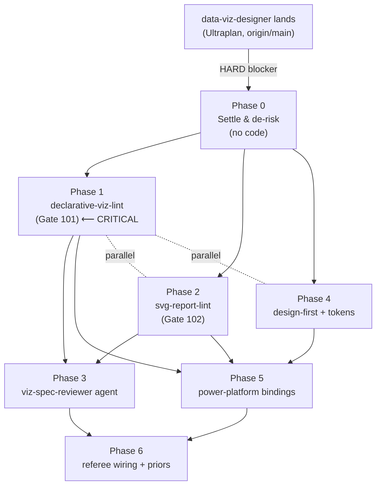

# Plan A — Pixel-Perfect Reporting Canon for RavenClaude (Senior Solution Architect)

> **Panel A of a two-panel FORGE plan review.** This is the complete, phased build plan: the load-bearing extend-vs-new-plugin decision, a Phase 0..N build with per-phase DoD + regen discipline, the dependency DAG, alternatives, the data-viz-designer coordination plan, cross-surface generalization, the security model, and the smallest valuable slice. Panel B will cold-review this.
>
> **Date:** 2026-06-09. **Author:** senior solution architect (Panel A seat).
> **Grounding posture:** every third-party factual claim is either backed by an inline this-session check (`file:line` or `command`) or marked `[unverified]`. The costly failure at this gate is a missed *structural* error, so I front-load the repo-state verification that reshapes the plan.

---

## 0. Session-verified ground truth (these reshape the plan — read first)

I verified the repo state rather than trusting the brief, and **two facts materially change the recommended shape**:

| # | Verified fact | This-session check | Consequence for the plan |
|---|---|---|---|
| G1 | **The data-viz-designer skills have NOT landed.** Only `pbir-layout-engine/` and `visual-feedback-loop/` exist in `ravenclaude-core/skills/`. `chart-from-intent`, `wcag-viz-contrast`, `ibcs-variance-reports`, and the slop catalog are absent. | `ls plugins/ravenclaude-core/skills/ \| grep -iE 'chart-from-intent\|wcag-viz\|ibcs\|slop'` → empty | The agent's strategic + build plan is on origin/main awaiting Ultraplan; **I sequence AFTER it, not in parallel**, or I create a three-way merge collision on `concepts.json`/`plugin.json`/`marketplace.json` counts. This is the dominant scheduling constraint. |
| G2 | **power-platform ALREADY ships the Deneb/Vega-Lite/SVG-in-DAX *decision* knowledge** and a design skill. `knowledge/power-bi-custom-visuals-toolkit.md` carries the 4-route decision tree (core / Deneb / SVG-in-DAX / R-Python) with primary sources; `skills/report-visualization-design/SKILL.md` is the Buhler-mold design method. | `grep -niE 'deneb\|vega-?lite\|svg' plugins/power-platform/knowledge/power-bi-custom-visuals-toolkit.md` → lines 17–18, 34–41, 71–82 | The net-new gap is **NOT "introduce Deneb/SVG concepts"** — that exists. The gap is **runnable + reviewer craft**: a *spec linter/reviewer* for Vega-Lite/SVG, generalized cross-surface, plus design-first deepening. This shrinks the build and sharpens the fork. |
| G3 | The viz spine is real and gate-proven. `pbir-layout-engine/lint.py` (stdlib, exit-coded, 7 checks) = Gate 92; `visual-feedback-loop/driver.py` (3-source referee) = Gate 100. | `grep -n 'Gate 92\|Gate 100' scripts/audit-gates.sh` → lines 106, 130, 3037, 3103 | New runnable skills must follow this exact pattern: stdlib-only, exit-coded, bidirectional Gate with teeth. **Highest gate today = 100**; next runnable-skill slot = **Gate 101**. |
| G4 | Layout globs already permit `plugins/*/skills/*/*.py`, `plugins/*/skills/*/*/*.py`, `plugins/*/skills/**`, `plugins/*/knowledge/**`. | `python3 -c "...allowed_globs..."` | No `.repo-layout.json` change needed for Python skills/knowledge under existing plugins — one less gate to trip. A NEW top-level plugin dir *would* need a glob; an extend-in-place approach needs none. (Weighs toward extend.) |
| G5 | Buhler's `data-goblin/power-bi-agentic-development` and Deneb/SVG framing already cited in `power-platform/CLAUDE.md`, `knowledge/power-bi-custom-visuals-toolkit.md`, `knowledge/power-bi-fabric-agentic-toolchain-2026.md`. | `grep -rl 'power-bi-agentic-development\|data-goblin' plugins/power-platform` | The "mirror Buhler" precedent is established; this plan *deepens* it from name-drop + decision-tree to **reviewer subagents + runnable linters**, the part Buhler leads on that we lack. |

**The single most important structural fact:** the gap is **reviewers and runnable linters for declarative-viz specs (Vega-Lite/SVG), generalized to be surface-agnostic** — not the *concepts*, which mostly exist. Buhler leads on `deneb-reviewer` + `svg-reviewer` subagents and `deneb-visuals` + `svg-visuals` skills [per brief; the repo is RavenClaude-shaped per `power-platform/CLAUDE.md` citation]; RavenClaude has the layout-lint spine and the render-loop referee but **no spec-level reviewer for declarative grammar or SVG**. That is the hole to fill.

---

## 1. THE LOAD-BEARING DECISION — Extend the existing spine. Do NOT create a new plugin.

**Recommendation: EXTEND.** Add the pixel-perfect-spec capability as **(a) two new stdlib runnable skills + their knowledge in `ravenclaude-core`** (the cross-surface, domain-neutral home) and **(b) thin Power-BI-specific wrappers/priors in `power-platform`** (Deneb-in-PBI + SVG-in-DAX specifics). **No `report-design` / `pixel-perfect-reporting` plugin.**

### Why extend (the rationale, weighed against the new-plugin case)

| Force | Pull | Verdict |
|---|---|---|
| **House rule** ("domain plugins extend core via skills+knowledge, not parallel agents, unless the domain carries genuine specialist craft a core agent lacks") — AGENTS.md §House rules + the strategic plan's own §1 rejection of "Extend designer" | The craft here (Vega-Lite grammar, SVG geometry, design-system tokens) is **domain-neutral viz-spec correctness**, not a vertical domain. It belongs in `ravenclaude-core` next to `pbir-layout-engine`/`visual-feedback-loop`, exactly where the spine already lives. | **Extend.** A new plugin would be a parallel home for capability that the spine already roots. |
| **Cross-surface "outside Power BI" framing** | Vega-Lite is an open public grammar (`vega.github.io`) [unverified — verify at build]; SVG is a web standard. A capability that must serve web + Tableau + PBI argues *against* burying it in `power-platform` and *for* the neutral core. | **Extend into `ravenclaude-core`** (not into `power-platform`). The PBI-specific bindings (Deneb wrapper, SVG-in-DAX) are thin `power-platform` priors that *call* the core skill. |
| **Overlap with in-flight data-viz-designer** | data-viz-designer owns *design decisions* (chart-from-intent, palette/WCAG, IBCS, slop catalog) and *consumes* `pbir-layout-engine` as its geometry core. A new plugin would fracture the "design → realize → lint" handoff across plugin boundaries and re-create the dispatch ambiguity Panel 1 already flagged. | **Extend.** The new spec-linter is **another load-bearing core for data-viz-designer**, sibling to `pbir-layout-engine`. One plugin, one spine, one dispatch story. |
| **Deneb/Vega-Lite/SVG craft depth** (the strongest pull *toward* a new plugin) | This is genuinely deep, reviewer-shaped craft. *But* depth justifies a dedicated **skill + subagent**, not a dedicated **plugin** — the marketplace's unit of "deep craft" is the skill/agent, and `ravenclaude-core` already hosts deep skills (`thing`, `forge-pipeline`). A plugin is the unit of a **domain**, and "pixel-perfect viz" is a *capability* cutting across domains, not a domain. | **Extend.** Reserve "new plugin" for a vertical (finance, salesforce), never for a cross-cutting capability. |
| **Migration / blast radius** | A new plugin = new `marketplace.json` entry, new `plugin.json`, new top-level glob in `.repo-layout.json` (G4), new dashboard card, new copilot-package member, new Gate-12 count surface — all churn on a consumer's `/plugin marketplace update`. Extend-in-place is purely additive to two existing plugins. | **Extend.** Lower blast radius, fewer gates to satisfy, no consumer-facing new install. |

**The one condition that would flip this to a new plugin:** if the capability grew to ≥1 agent + ≥4 skills + its own hook *and* served a constituency that doesn't install `ravenclaude-core`. Neither holds. If a future "reporting-studio" vertical emerges (Figma-pipeline + brand-system + multi-surface publish as a paid consulting offering), revisit then — but that is a v0.3+ business decision, not this build.

**Net:** two new `ravenclaude-core` skills (`declarative-viz-lint`, `svg-report-lint`) + one new `ravenclaude-core` reviewer agent (`viz-spec-reviewer`) + knowledge + thin `power-platform` Deneb/SVG-in-DAX priors that delegate to them. Sibling to `pbir-layout-engine`, consumed by `data-viz-designer`, refereed by `visual-feedback-loop`.

---

## 2. Phased build (Phase 0..6)

Each phase lists **Deliverables**, **DoD (acceptance tests + pre-build gates)**, and **Regen discipline** where artifacts move. The regen discipline is identical in shape every phase: quote any frontmatter value containing a colon; bump skill/agent COUNT strings in the plugin's `plugin.json` **and** `marketplace.json`; regenerate `dashboard.html` + `index.html` + `concepts.json`-derived assets + the copilot package; update the audit-gates skill-count fixture; reserve a new Gate slot for any new runnable skill modeled on Gate 92/100 (bidirectional + teeth).

### Phase 0 — Settle & de-risk (NO code; gating)

**Deliverables**
1. **Sequencing lock with data-viz-designer.** Confirm via `git log origin/main` whether the Ultraplan execution of `docs/research/2026-06-02-data-viz-agent/build-plan.md` has landed. **This plan does not write a line of code until that lands or is explicitly cancelled** (G1). Record the dependency in the build doc.
2. **Locate the live Buhler design-first article** (the data-goblins URL 404'd per brief). Settling step: `WebSearch`/`firecrawl` for the current Figma→SVG→PBI workflow article; pin URL + retrieval date + commit SHA. If unfindable, the design-first phase ships from the *already-verified* `power-bi-custom-visuals-toolkit.md` decision tree and marks the Figma-pipeline specifics `[unverified — article 404, settled from secondary]`.
3. **Verify Vega-Lite grammar specifics** that will be load-bearing in the linter (mark spec fields, encoding channels, the `transform`/`signal` surface) at `vega.github.io/vega-lite` + `vega.github.io/vega`. Pin versions. (Vega-Lite is the safe subset; Vega proper has an expression/signal surface — see §7 Security.)
4. **Scope decision on SVG-in-DAX vs standalone SVG** (an Alternative, §4) resolved with a one-paragraph rationale into the build doc.

**DoD**
- Sequencing question answered yes/no in writing (route through the tribunal per CLAUDE.md if it becomes a yes/no gate to Matt).
- Every Vega/SVG fact that the linter will enforce is either citation-backed or explicitly `[unverified — guidance-only, not enforced]`. **A linter rule may not enforce an unverified grammar fact** — that is the accuracy-discipline teeth for this build.
- `scripts/check-checkout-fresh.sh` clean (don't trust a stale tree).

**Regen discipline:** none (no artifacts move).

---

### Phase 1 — `declarative-viz-lint` skill (the net-new core; cross-surface Vega-Lite linter) ⟵ critical path

**Deliverables**
1. `plugins/ravenclaude-core/skills/declarative-viz-lint/SKILL.md` + `lint.py` — a **stdlib-only, exit-coded, no-network, no-subprocess, no-eval** linter over a **Vega-Lite spec JSON** (surface-agnostic: the same spec shape Deneb embeds, a web Vega-Lite chart uses, or a Tableau-adjacent export produces). Modeled byte-for-byte on the `pbir-layout-engine/lint.py` purity contract (G3): reads only argv paths, rejects `..`/out-of-root absolutes, exits non-zero on any I/O error, no partial-pass.
2. **Checks (v1, deliberately small + verifiable):**
   - **encoding-completeness** — every `mark` has the channels its type requires (a `bar` needs x+y or x+y2; a `point` scatter needs x+y) — *correctness*, the analog of "chart matches data shape."
   - **scale-soundness** — quantitative axis not silently zero-truncated where misleading (bar charts), categorical scales have explicit domains where order is meaningful.
   - **accessibility-channel** — color is not the *sole* encoding channel (mirrors the WCAG "never color-only" rule the data-viz-designer's `wcag-viz-contrast` owns; this is the *spec-level* check, delegating contrast math to that skill when present).
   - **spec-hygiene** — no unknown top-level keys, no `mark` types outside the verified enum, schema `$schema` pinned.
   - **security-surface flag** (see §7) — flags presence of Vega `signal`/`expr`/`transform.calculate`/external `data.url` loaders as **review-required** (warn, not auto-fail, with a `--strict` that fails).
3. `plugins/ravenclaude-core/knowledge/declarative-viz-grammar.md` — the canon: Vega-Lite vs Vega, the safe subset, encoding-channel reference, cross-surface notes (Deneb embeds it / web renders it / how it maps to FT Visual Vocabulary categories the `chart-from-intent` skill owns). Knowledge-bank pattern.
4. **Bidirectional fixtures** under `tests/fixtures/declarative-viz/`: a good spec passing all checks + one bad fixture per check (missing-channel, zero-truncated-bar, color-only, unknown-mark, signal-injection).

**DoD (acceptance + pre-build gates)**
- `lint.py good.json` → exit 0; `lint.py <each bad>` → exit non-zero with the specific check name in stderr. **Bidirectional** — proven both directions, the Gate-92 standard.
- Purity audit: `grep -nE 'import (os|subprocess|socket|urllib|requests)|eval\(|exec\(' lint.py` shows only sanctioned stdlib (json, sys, pathlib, re); rejects `..` argv; non-zero on bad I/O.
- **New Gate 101** added to `scripts/audit-gates.sh`, modeled on Gate 92: `must_fail` on a bad fixture, `must_pass` on a good one, plus a per-gate run block. Teeth = the gate fails CI if the linter ever silently passes a known-bad spec.
- `scripts/audit-gates.sh` green end-to-end (the meta-test).

**Regen discipline**
- `plugin.json` (`ravenclaude-core`) + `marketplace.json`: bump `version` (minor); update any skill-COUNT string (Gate 12 checks both). One new skill → counts +1.
- `concepts.json`: add a "Declarative-viz grammar" Learn concept + render its SVG via `scripts/render-concepts.py` / `scripts/generate-concepts-doc.py`.
- Regenerate `dashboard.html` + `index.html` (`scripts/generate-dashboards.py`, `scripts/generate-index-dashboard.py`) and the copilot package (`scripts/generate-copilot-plugin.py`).
- Update the audit-gates skill-count fixture so Gate 12's count assertion matches.
- `chmod +x` any new hook (none here; skills aren't hooks) — but verify exec bits on `lint.py` is **not** required (it's invoked via `python3`, matching `pbir-layout-engine/lint.py`).

---

### Phase 2 — `svg-report-lint` skill (standalone SVG geometry + safety linter) ⟵ parallelizable with Phase 1

**Deliverables**
1. `plugins/ravenclaude-core/skills/svg-report-lint/SKILL.md` + `lint.py` — stdlib-only (`xml.etree.ElementTree`, exit-coded), lints an **SVG document** for: viewBox present + sane aspect; elements within viewBox bounds (the SVG analog of `pbir-layout-engine`'s within-canvas/AABB — *reuse the geometry math conceptually, don't duplicate the file*); text legibility (min font-size, contrast hook to `wcag-viz-contrast` when present); and **the security floor (§7): no `<script>`, no `on*` event attrs, no `<foreignObject>`, no external `href`/`xlink:href`, no `<use>` to remote.**
2. `plugins/ravenclaude-core/knowledge/svg-report-safety.md` — the SVG-as-untrusted-input canon (script-carrying vectors, the sanitize-before-render rule), cross-surface (web inline-SVG, SVG-in-DAX strings, exported chart SVGs).
3. Bidirectional fixtures `tests/fixtures/svg-report/`: clean badge SVG + bad-per-check (out-of-viewbox, `<script>`, `onclick`, `<foreignObject>`, remote `href`, tiny-font).

**DoD**
- Same bidirectional + purity + Gate standard as Phase 1. **New Gate 102.**
- The security checks are **default-fail** (not warn) — an SVG with `<script>` exits non-zero unconditionally. This is the one place where "warn" is wrong: a script-carrying SVG is never acceptable in a report.
- `audit-gates.sh` green.

**Regen discipline:** same checklist as Phase 1 (counts +1 again; Learn concept "SVG report safety"; regen all four artifacts; Gate 102 reserved).

---

### Phase 3 — `viz-spec-reviewer` agent (the Buhler-style reviewer subagent, cross-surface) ⟵ depends on Phase 1+2

**Deliverables**
1. `plugins/ravenclaude-core/agents/viz-spec-reviewer.md` — a reviewer subagent (RavenClaude's analog of Buhler's `deneb-reviewer` + `svg-reviewer`, **merged and surface-generalized**). It does NOT re-implement the linters; it **orchestrates**: runs `declarative-viz-lint` and/or `svg-report-lint`, reads their structured output, layers the *judgment* checks linters can't do (does the chart answer the stated question? is the encoding honest? does it match the FT category `chart-from-intent` chose?), and emits a structured verdict. Consumes `data-viz-designer`'s design brief as input when present.
2. **Full scenario-authoring frontmatter** (`audience`, `works_with`, `scenarios` each with `intent`/`trigger_phrase`/`outcome`/`difficulty`, `quickstart`) — gated by `scripts/check-frontmatter.py` (build fails without it, per AGENTS.md §Adding a new plugin step 7).
3. Inline priors + `works_with` wiring to: `data-viz-designer` (design→review handoff), `pbir-layout-engine` + `visual-feedback-loop` (geometry/referee), and the new linters.

**DoD**
- `scripts/check-frontmatter.py` passes on the new agent (every `scenarios` item complete).
- A worked round-trip fixture: design brief → linter run → reviewer verdict, with at least one *injected design flaw* the reviewer must catch that the linters alone don't (e.g., a technically-valid-but-misleading dual-axis).
- Agent appears in `/plugin` UI (manual install test, AGENTS.md §Testing step 5) and in the per-agent dashboard card.

**Regen discipline**
- Bump agent-COUNT in `plugin.json` + `marketplace.json` (+1 agent); version minor.
- **Frontmatter-with-colons must be quoted** (the named per-phase hazard) — the `description:` and any `scenarios.outcome` containing a colon get wrapped in quotes or the YAML parser / dashboard generator mis-renders.
- Regenerate `dashboard.html` + `index.html` (per-agent cards + Overview use-case lookup table pick up the scenarios) + copilot package.
- Update audit-gates agent-count fixture if one exists for agent counts.

---

### Phase 4 — Design-first deepening (where RavenClaude already LEADS — deepen, don't add a reviewer) ⟵ depends on Phase 0 settle

**Deliverables**
1. `plugins/ravenclaude-core/knowledge/design-first-report-workflow.md` — the Figma→SVG→spec→realize discipline, **generalized off Power BI**: exact-coordinate/grid/design-system tokens as the *input contract* to all three lint surfaces (`pbir-layout-engine` geometry, `declarative-viz-lint` specs, `svg-report-lint` SVGs). Pulls the verified design canon already in `power-platform/skills/report-visualization-design/SKILL.md` (3-30-300, 8-pt grid, KPI anatomy) up to the neutral core *by reference*, not by copy. Buhler design-first specifics marked `[unverified]` until Phase 0 finds the live article.
2. A **design-system tokens** mini-schema (palette + spacing-scale + type-scale as a JSON the linters can read) so "design-system discipline" becomes *checkable input*, not prose. Optional `--tokens tokens.json` flag added to both new linters (and proposed to `pbir-layout-engine` as a coordinated change — see §5).

**DoD**
- The tokens schema has a bidirectional fixture; a spec/SVG violating a token (off-palette color, off-scale spacing) is flagged when `--tokens` is supplied, ignored when it isn't (backward-compatible — no silent regression for existing callers).
- No new Gate strictly required (this is knowledge + an optional flag on Phase-1/2 linters), BUT the `--tokens` path gets a `must_pass`/`must_fail` assertion folded into Gates 101/102.

**Regen discipline:** version minor; new Learn concept "Design-first / design-system tokens"; regen four artifacts. No count change if no new skill/agent (knowledge-only + flag).

---

### Phase 5 — Power-BI surface bindings (thin wrappers in `power-platform`) ⟵ depends on Phase 1+2

**Deliverables**
1. `power-platform` priors that **delegate** to the new core skills: extend `knowledge/power-bi-custom-visuals-toolkit.md` (G2) and `skills/report-visualization-design/SKILL.md` with "to lint a Deneb spec, run `declarative-viz-lint`; to lint an SVG-in-DAX badge, extract the SVG string and run `svg-report-lint`." A **Deneb-config extractor** note (Deneb wraps a Vega-Lite spec in a PBI custom-visual config — document how to pull the inner spec out to lint it).
2. A `power-platform` knowledge prior on **SVG-in-DAX safety**: DAX-constructed SVG strings are the same untrusted shape; route through `svg-report-lint` before they land in an Image-URL tile.

**DoD**
- No new runnable skill in `power-platform` (it's delegation) → no new Gate, but the existing `power-platform` skill-count must stay correct.
- A worked example: a real Deneb config → inner Vega-Lite spec extracted → linted → verdict. Marked with retrieval date.

**Regen discipline**
- `power-platform` `plugin.json` + `marketplace.json` version bump (no count change if delegation-only knowledge; +1 only if a new skill is added).
- Regenerate four artifacts (the dashboard cross-references the cross-plugin `works_with`).

---

### Phase 6 — Wire into the referee + cross-surface priors (closing the loop) ⟵ depends on 1–5

**Deliverables**
1. Extend `visual-feedback-loop/driver.py` config to accept the two new linters as additional **evidence sources** (it already fans 3 sources into one verdict; add `declarative_viz` and `svg` evidence keys). The render→see→critique loop can now cite "spec lints clean" alongside layout + console + Lighthouse.
2. Conditional priors (the pattern the brief notes were added today to `dashboard-builder`/`tableau`/`web-design`/`frontend-engineering`): a one-line "if you author a Vega-Lite/Deneb spec or an SVG report, run the spec linters" prior in each consuming plugin's relevant agent.
3. CLAUDE.md §"Knowledge bank" pointers in `ravenclaude-core` and `power-platform` for the new knowledge files.

**DoD**
- `driver.py` change is backward-compatible (omitting the new keys = byte-identical old behavior — the Gate-100 parity property must hold; add a parity assertion to Gate 100).
- `audit-gates.sh` fully green; manual `/plugin` install test shows the new agent + skills.
- `prettier --check .` exit 0 (whole-tree discipline); `bash -n` on any touched hook.

**Regen discipline:** final regen of all four artifacts; bump versions where touched; confirm Gate 12 counts across every touched plugin.

---

## 3. Dependency DAG + critical path

- **Critical path:** `data-viz-designer lands` → P0 → **P1 (declarative-viz-lint)** → P3 (reviewer) → P6. Everything keys off Phase 1; it is the net-new core and the agent can't review without it.
- **Parallelizable:** P1 ∥ P2 ∥ P4 (independent linters + knowledge; one author can interleave, two authors can split cleanly — disjoint files, disjoint Gate slots 101/102).
- **Merge-collision hotspots (serialize the regen, not the authoring):** `plugin.json` + `marketplace.json` count strings, `concepts.json`, `dashboard.html`/`index.html`. Per the stacked-PR memory: squash-merges break SHA chains; **regen these artifacts on the integration branch in one pass after each phase merges**, never in parallel branches.

---

## 4. Alternatives considered (≥2, with trade-offs)

| # | Fork | Option chosen | Rejected alternative | One-line trade-off |
|---|---|---|---|---|
| A | **Runnable linter vs guidance-only** | **Runnable** `declarative-viz-lint`/`svg-report-lint` (stdlib, exit-coded, gated). | Guidance-only knowledge files, no executable. | Runnable gives objective stopping signals + a CI gate with teeth (the whole point of the spine); guidance-only repeats "looks better" and can't be Gate-proven. **Runnable wins decisively** — it's the house pattern. |
| B | **Deneb-specific vs generic Vega-Lite** | **Generic Vega-Lite** core in `ravenclaude-core` + thin Deneb extractor in `power-platform`. | A Deneb-only linter in `power-platform`. | Generic serves web + Tableau-export + Deneb from one engine ("outside Power BI"); Deneb-only would re-trap the capability in PBI and need re-implementation for web. Generic + thin binding wins. |
| C | **SVG-in-DAX vs standalone SVG** | **Standalone SVG** linter in core; SVG-in-DAX is a *caller* that extracts the string first. | An SVG-in-DAX-coupled linter living in `power-platform`. | Standalone reuses across web inline-SVG, exported chart SVGs, and DAX badges; the DAX coupling is one extraction step, not a separate engine. Standalone wins (same logic as B). |
| D | **New plugin vs extend** | **Extend** (the §1 decision). | `report-design`/`pixel-perfect-reporting` plugin. | Extend = lower blast radius, no new install, keeps the design→realize→lint handoff in one spine; new plugin = ceremony for a cross-cutting capability that isn't a domain. Extend wins. |
| E | **New reviewer agent vs fold into data-viz-designer** | **New `viz-spec-reviewer` agent.** | Add spec-review as a sub-rubric of `data-viz-designer`. | data-viz-designer *designs*; spec-review *critiques an authored artifact* — different inputs (intent vs spec), different output (brief vs verdict). Keeping them separate avoids the dispatch ambiguity Panel 1 already flagged for designer. Separate wins. **Panel B should pressure-test this one** — it's the closest call. |

---

## 5. Coordination plan with the in-flight `data-viz-designer` (sequence + merge-safety)

**The relationship:** the new spec-linters are **siblings of `pbir-layout-engine` and load-bearing cores for `data-viz-designer`**, exactly as `pbir-layout-engine` is. This plan **extends data-viz-designer's spine; it does not override or duplicate it.**

**Hard rules (from G1 + the stacked-PR memory):**
1. **Sequence after, never parallel.** data-viz-designer is unbuilt (its `.md` doesn't exist; only `lint.py` does). Building spec-linters in parallel would three-way-collide on `concepts.json`, both `plugin.json`s, and the dashboard. **Phase 0 gate: do not start Phase 1 until data-viz-designer's Ultraplan PR lands on main** (or Matt cancels it). If it's already landed by build-time, Phase 0 just confirms and proceeds.
2. **Disjoint ownership, explicit handoff.** data-viz-designer owns `chart-from-intent`, `wcag-viz-contrast`, `ibcs-variance-reports`, the slop catalog. This plan owns `declarative-viz-lint`, `svg-report-lint`, `viz-spec-reviewer`, design-first/tokens. **Zero file overlap.** The seam is `works_with`: `viz-spec-reviewer` *consumes* data-viz-designer's design brief and *delegates* contrast math to `wcag-viz-contrast` (don't re-implement WCAG — call it).
3. **The one coordinated change to a shared file:** the optional `--tokens` flag proposed for `pbir-layout-engine/lint.py` in Phase 4. This touches data-viz-designer's load-bearing core. **Route it as a backward-compatible addition** (no flag = byte-identical Gate-92 behavior) and, if data-viz-designer hasn't landed, **defer it to a follow-up PR after** so we don't edit a file mid-flight under another agent's plan. Prefer: ship tokens on the *new* linters first; propose the `pbir-layout-engine` `--tokens` extension as a separate, clearly-labeled coordinated PR.
4. **Regen choreography (memory: stacked-PR).** After data-viz-designer merges, rebase this work, regenerate `dashboard.html`/`index.html`/`concepts`/copilot, `chmod +x` any hooks, and re-run `audit-gates.sh` before each downstream phase merges. Counts are additive — verify Gate 12 after every merge.

---

## 6. Cross-surface generalization ("outside Power BI")

The capability serves **all** viz surfaces because the core engines are surface-agnostic by construction:

| Surface | declarative-viz-lint | svg-report-lint | design-first/tokens | reviewer |
|---|---|---|---|---|
| **Web dashboards** (`web-design`, `frontend-engineering`, `dashboard-builder`) | Lints any Vega-Lite chart spec the page embeds; pairs with `visual-feedback-loop`'s *visual* (screenshot) mode. | Lints inline `<svg>` and exported chart SVGs; the security floor matters most here (web = real XSS surface). | Tokens = the web design-system contract; off-palette/off-scale flagged. | Judges chart-honesty + question-fit, surface-independent. |
| **Tableau** (`tableau` plugin) | Tableau exports/derived specs lint through the same engine; structural-first like BI per VFL. | Exported dashboard SVGs. | Same token contract. | Same verdict shape. |
| **Power BI / Fabric** (`power-platform`) | Deneb spec extracted from the custom-visual config → linted (Phase 5 binding). | SVG-in-DAX badge string extracted → linted. | Maps to PBIR geometry via `pbir-layout-engine`. | Consumes the PBIR design brief. |

The **neutral core in `ravenclaude-core` is what makes this work** — putting the engines in `power-platform` would have forced re-implementation for web/Tableau. This is the §1 decision paying off directly against requirement (6).

---

## 7. Security note (untrusted-input-shaped, by design)

Deneb/Vega specs **and** SVG are untrusted-input-shaped and must be treated as data, never as instructions to execute:

| Surface | Threat | Control (named) |
|---|---|---|
| **SVG** | `<script>`, `on*` handlers, `<foreignObject>` (HTML injection), external `href`/`xlink:href`/`<use>` (remote fetch / data exfil), CSS `url()` | `svg-report-lint` **default-fails** on any of these (Phase 2 DoD). No `--lenient`. This is the hard floor — a script-carrying SVG never passes. |
| **Vega (full)** | Vega has an **expression/signal language** + a **data loader** (`data.url`) — a spec can fetch remote URLs and evaluate expressions at render time. | `declarative-viz-lint` flags `signal`/`expr`/`transform.calculate`/`data.url` as **review-required**; `--strict` (CI default for untrusted specs) **fails** on them. Recommend authors target **Vega-Lite** (the safe declarative subset) and treat full-Vega specs as requiring `viz-spec-reviewer` sign-off. |
| **The linters themselves** | A linter that imports the spec's loader, evals an expression, or fetches `data.url` to "validate" it = RCE/SSRF. | **Purity contract** inherited from `pbir-layout-engine` (G3): stdlib-only, **no network, no subprocess, no eval/exec**, argv-only paths, reject `..`/out-of-root, non-zero on any I/O error. Enforced by a `grep` assertion in each new Gate (101/102). The linter parses JSON/XML as **inert data** — it never instantiates the Vega runtime or renders the SVG. |
| **WebFetch of primary sources** (Phase 0 settle, knowledge refresh) | Buhler/Vega docs fetched for verification could carry injected role-shift markers (the strategic plan documents two confirmed injection sites). | Reuse the existing `webfetch-return-envelope-hardening` knowledge + `webfetch-hardening` skill: strip/inert `<system>`/`<important>`/`[INST]` from fetched bodies, log "N injection attempts treated as data," cite already-verified quotes as canonical, re-fetch only on explicit refresh. |

**The single most important control:** the linters are **inert parsers**, not renderers/evaluators. They prove safety *about* a spec without *executing* it. Rendering (the place script actually fires) stays in the sandboxed `chrome-devtools-mcp` path that `visual-feedback-loop` already governs.

---

## 8. Deferrable / smallest valuable slice vs full canon

**Smallest valuable slice (ship first, ~Phase 0+1+ a stub binding):**
> `declarative-viz-lint` (Vega-Lite encoding-completeness + spec-hygiene + the security-surface flag) as a stdlib, Gate-101-proven runnable skill in `ravenclaude-core`, plus its knowledge file, plus one `power-platform` delegation line for Deneb. **One skill, one gate, one knowledge file, additive version bump.**

Why this is the floor: it closes the **single biggest net-new gap** (a runnable reviewer for declarative specs, the thing Buhler leads and we lack), is fully cross-surface from day one, and is independently shippable and useful before the reviewer agent or SVG linter exist. It mirrors the strategic plan's own "Inline prior + standalone linter only" fallback logic.

**Build order of value:** Phase 1 (declarative lint) > Phase 2 (SVG lint) > Phase 3 (reviewer agent) > Phase 6 (referee wiring) > Phase 5 (PBI bindings) > Phase 4 (design-first/tokens).

**Deferrable to v0.2+:**
- The `viz-spec-reviewer` **agent** (Phase 3) — the linters are useful invoked directly; the orchestrating agent is the polish layer.
- The `--tokens` design-system enforcement (Phase 4) — design-system tokens are a real capability but the *coordinated* `pbir-layout-engine` change makes it the riskiest merge; defer behind the standalone linters.
- **Full Vega (non-Lite) support** — ship Vega-Lite-only first; full-Vega's expression surface is exactly the security-heavy part. Defer until `viz-spec-reviewer` exists to gate it.
- The Figma→SVG→PBI **pipeline automation** — Phase 0 only *locates* the article; building a Figma-import path is a separate, larger effort (and a candidate future "reporting-studio" vertical, per §1's flip condition).

**Full canon (the v1.0 north star):** all six phases — two linters + reviewer agent + design-first/tokens + cross-surface priors + referee wiring + PBI bindings — composing with `pbir-layout-engine` (geometry), `data-viz-designer` (design decisions), and `visual-feedback-loop` (the render-loop referee) into one "design → realize → lint → see → critique" pixel-perfect spine that works on web, Tableau, and Power BI alike.

---

## Appendix — Per-phase regen checklist (the invariant, quote once)

For **every** phase that adds/changes a skill, agent, or knowledge file:

1. **Quote frontmatter values containing a colon** (`description:`, `scenarios.outcome:`) — unquoted colons break the YAML/dashboard generator.
2. **Bump `version`** (semver, minor for additive) in the plugin's `plugin.json` **AND** `marketplace.json` (Gate 12 fails on drift).
3. **Bump skill/agent COUNT strings** in both `plugin.json` and `marketplace.json` (+1 per new skill/agent; Gate 12 checks counts in both `metadata.description` and elsewhere — `grep -n 'skill count' scripts/audit-gates.sh` → lines 468–511).
4. **Regenerate** `dashboard.html` (`scripts/generate-dashboards.py`), `index.html` (`scripts/generate-index-dashboard.py`), `concepts` assets (`scripts/render-concepts.py` + `scripts/generate-concepts-doc.py`), copilot package (`scripts/generate-copilot-plugin.py`).
5. **Update the audit-gates skill-count fixture** so Gate 12's assertion matches the new count.
6. **Reserve a new Gate slot** (101, 102, …) for any new *runnable* skill, modeled on Gate 92/100: `must_fail` on a known-bad fixture **and** `must_pass` on a known-good one, plus a per-gate-run block. A gate without both directions has no teeth.
7. **Run `scripts/audit-gates.sh`** (the meta-test) + `npx prettier --write . && prettier --check .` (whole-tree) + `bash -n` on touched hooks before pushing.
8. **`scripts/check-checkout-fresh.sh`** first — never trust a stale tree (a fix may already be in main).

---

*End of Plan A. Panel B: please cold-review §1 (extend-vs-plugin), §4-E (separate reviewer agent vs fold into data-viz-designer), and §5 (the `pbir-layout-engine --tokens` coordinated edit) as the highest-risk structural calls.*
