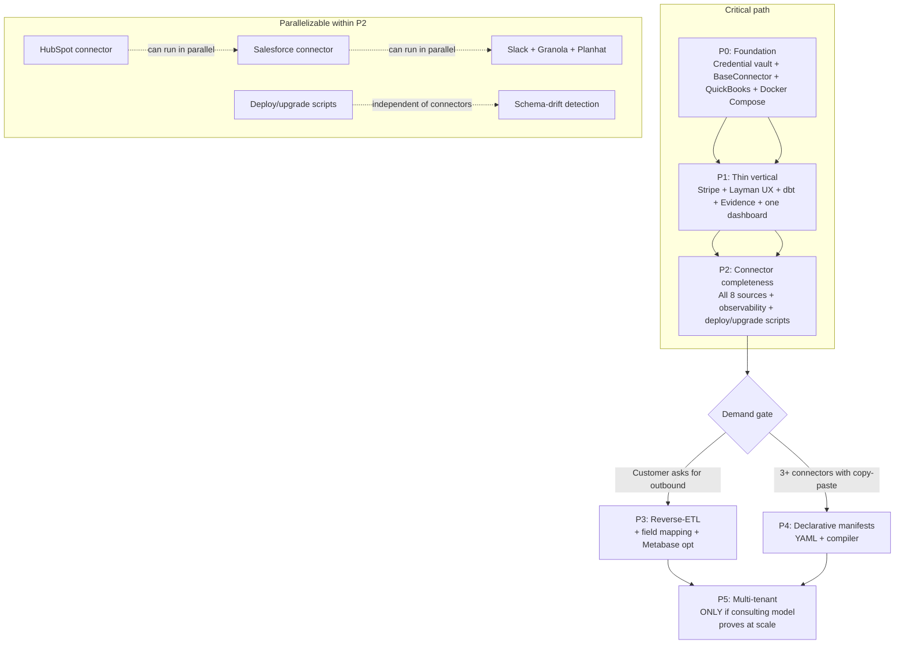

# Plan B — Unified Data Hub Platform
## Lens: Pragmatic / Fastest-Defensible-Path-to-Value + Skeptic
**Panel:** B (Sonnet) · **Date:** 2026-06-24 · **Slug:** data-hub-platform

---

## 0. Up-front position statement

The architecture-first panel will give you a beautiful, fully-layered system. This plan gives you
something a real customer is using in 6–8 weeks, with every security non-negotiable satisfied, and
a clear-eyed accounting of where "build from scratch" will bite you and what it costs.

The difference is sequencing. Architecture-first builds the SDK, then the semantic layer, then the
connectors, then the UX, then ships. This plan ships one thin vertical first, then uses what you
learned from a real customer to build the rest. The SDK and semantic layer still arrive — they
just arrive in service of real evidence, not pre-commitment.

---

## 1. Stack recommendation (lean, boring, self-hostable)

| Layer | Choice | One-line justification |
|---|---|---|
| **Runtime** | Node 22 + TypeScript (monorepo) | Matt already builds connectors in JS/TS; no context switch; vibecoder onboards fast |
| **Web framework** | Hono (edge-native, fast, tiny) | 10× lighter than Express/Fastify for a single-tenant app; runs anywhere Node runs |
| **Database** | PostgreSQL 16 (self-hosted, Docker Compose) | Single-tenant = no shared-schema complexity; excellent JSON support for semi-struct connector data |
| **ORM** | Drizzle ORM | Type-safe, schema-as-code, zero-overhead migrations; no runtime magic |
| **Credential vault** | Per-app AES-256-GCM + AWS KMS / GCP KMS as KEK | Satisfies G1 1a hard block; one KMS call at startup decrypts the master KEK into memory |
| **Job / sync engine** | BullMQ + Redis | Battle-tested queue; per-source job isolation; visibility, retries, dead-letter built in |
| **Dashboard runtime** | Evidence.dev (SQL + Markdown) | G1 5c says this fits Claude-authoring better than GUI; versioned, diff-able, deploys as static site |
| **Metrics layer** | dbt Core (open-source, local) | One place defines MRR/ARR/health; Evidence reads compiled dbt models; no Cube license needed in v1 |
| **Auth (user login)** | Lucia Auth (TS-native, PostgreSQL adapter) | Simple session-based auth for a tiny user base; no third-party dependency in the auth path |
| **Deployment** | Docker Compose → single-host VPS per customer | One `docker-compose up` provisions a customer; no Kubernetes overhead for a solo consultant |
| **Secrets at deploy** | .env.vault (Doppler or dotenv-vault) | Per-customer secret files encrypted at rest; no hand-edited prod secrets files |

**What this is NOT:** microservices, Kubernetes, a shared cloud DB, a vendor runtime dependency for
connectors (Airbyte/Nango/Merge as runtime — forbidden by pinned decision), or an event-bus
architecture. All of those are reversible future choices, not v1 requirements.

---

## 2. Credential vault design (non-negotiable — satisfies G1 claim 1a)

```
┌────────────────────────────────────────────────────────┐
│  KMS (AWS KMS / GCP KMS / Azure Key Vault)             │
│  Holds: Customer KEK (key-encrypting key)              │
│  Never touches app DB.                                 │
└──────────────────────────┬─────────────────────────────┘
                           │ KMS.Decrypt (once at startup / on first use)
                           ▼
┌────────────────────────────────────────────────────────┐
│  App memory: decrypted KEK (short-lived; cleared on    │
│  shutdown; never logged or serialized)                 │
└──────────────────────────┬─────────────────────────────┘
                           │ AES-256-GCM wrap
                           ▼
┌────────────────────────────────────────────────────────┐
│  PostgreSQL: credentials table                         │
│  Row: connector_id | encrypted_blob | dek_ciphertext   │
│  • DEK per secret (derived, envelope-wrapped by KEK)   │
│  • Blob = AES-256-GCM(plaintext, DEK)                  │
│  • KMS key ID stored for rotation traceability         │
└────────────────────────────────────────────────────────┘
```

**Implementation contract:**
- The `CredentialStore` class is the ONLY place in the codebase that calls KMS and touches plaintext credentials. All connector code receives a typed `HttpClient` pre-injected with the bearer token; it never sees raw credential material.
- DEK rotation: re-encrypt the blob with a new DEK on any key-rotation event; the KEK rotation path calls KMS re-wrap.
- No fallback to plaintext env vars for connector tokens in production. The app refuses to start without a valid KMS reference.
- Audit log: every `decrypt()` call writes a structured log row (connector_id, actor, timestamp, purpose). Never logs the plaintext.

**On Supabase Vault (G1 1c):** viable if you choose Supabase as the DB. Target the Vault interface, not raw pgsodium. But for a self-hostable single-tenant app, plain Postgres + an external KMS is simpler to understand and audit.

---

## 3. Connector approach — pragmatic take on the SDK question

### The honest cost of "from scratch" (G1 claim B.4)

- Initial build per non-trivial OAuth connector: 2–10 days (varies by API maturity; Salesforce is 2 weeks; QuickBooks is 1 week; Slack is 2 days).
- Ongoing breakage: each source breaks 1–4×/year. At 8 sources × 3 breaks/yr × 2hr fix = ~48 hours/year of connector maintenance. That is ~6 full consulting days. **For a solo consultant, this is the existential risk.**
- Mitigation: a thin base-class + versioned connector registry makes each break a 30-minute fix instead of a 2-hour archaeology session. Without it, "from scratch" silently means N unmaintained hand-built scripts.

### Recommended approach: thin base-class NOW, declarative manifest LATER

**Do not build a full declarative YAML/CDK manifest system in v1.** You do not have enough connectors to know what the manifest needs to express. Build the minimum that avoids the maintenance trap:

**Phase 1–2 (v1 connectors):**

```typescript
// The only abstraction you need in v1
abstract class BaseConnector {
  abstract readonly meta: ConnectorMeta;         // { id, name, version, authDescriptor }
  abstract fetchRecords(ctx: SyncContext): AsyncIterable<RawRecord[]>;
  abstract transformRecord(raw: RawRecord): NormalizedRecord;

  // Provided by base: retry budget, rate-limit backoff, pagination cursor tracking,
  // OAuth token refresh injection, dead-letter on exhausted retries
  protected async paginatedFetch(url: string, params: Record<string, string>): ...
  protected handleRateLimit(response: Response): Promise<void>
}
```

Each connector is a single TypeScript class extending this base. The base class owns: retry budget,
rate-limit backoff, OAuth token refresh injection, cursor persistence, and dead-letter routing.
The concrete class owns: one API's pagination, field mapping, and quirks.

**ConnectorMeta includes:**
- `id`, `name`, `version` (semver) — the versioned registry
- `authDescriptor` — OAuth params (auth URL, token URL, scopes, PKCE yes/no, refresh strategy)
- `streams` — array of `{ name, cursorField, primaryKey }` — enough to drive incremental sync without per-stream code

**What this defers without pain:**
- A full YAML declarative manifest (Airbyte CDK pattern) — build when you have 12+ connectors and a clear pattern for the weird 20%
- A separate "connector registry service" — the registry is a JSON file and a version field in v1
- Hot-reload of connector updates — restart the sync worker; acceptable for consulting deploy

**When to graduate to declarative manifests:** when you have 3+ connectors with identical auth patterns and you find yourself copy-pasting the authDescriptor. That is the signal, not a pre-commitment.

### The hybrid question (G1 B.4 mitigation)

The scope says "connections live in the application." This is satisfied by building auth+transport in the app. But for the **HTTP client layer** (pagination, field shape, request signing), leaning on well-typed SDK clients per source (e.g., `stripe` npm package for the Stripe type system, `@hubspot/api-client` for HubSpot models) does NOT violate "from scratch" for the connector logic — it just means you're not hand-writing REST calls for types that already exist. **My recommendation:** use vendor SDK clients for type definitions and request construction where they exist; write the sync/transform/cursor logic yourself. This is cheaper and does not compromise the "connections live in the app" requirement.

---

## 4. Reporting / semantic layer — lightest path to avoid SQL sprawl

**The risk (G1 5a):** without a shared metrics layer, Claude builds a different SQL query for MRR
on every customer. You end up with N slightly-different definitions of the same metric. This is the
"SQL sprawl" trap.

**The lightest defensible answer: dbt Core + Evidence.dev**

- **dbt Core** (open-source, runs locally/in CI): define MRR, ARR, churn, health-score, etc. once as a dbt model. Each customer instance has one `models/` directory. Claude writes and edits `.sql` files in `models/`; dbt materializes them into the Postgres schema.
- **Evidence.dev**: dashboards are Markdown + SQL files. Claude authors `reports/mrr_trend.md` with embedded SQL referencing the dbt model output. The Evidence build step generates a static dashboard site.

**Why not Cube in v1:** Cube adds a runtime service, a semantic layer API, a deployment target, and a new DSL. For a 2-source, 1-customer MVP, it is massively over-engineered. The value of Cube (multi-tenant caching, REST/GraphQL API, fine-grained access control) arrives when you have 5+ customers and Claude needs to query metrics programmatically. **Defer Cube to Phase 3+.**

**The dbt graduation path:** when a customer wants self-serve exploration (not just Claude-built static dashboards), add Metabase (open-source, self-hostable) pointing at the dbt-materialized schema. Metabase can expose the dbt models as a curated data catalog without a metrics-layer rewrite.

**Concrete metric-sprawl prevention rule:** no dashboard file may contain a raw JOIN across more than one source table. Any cross-source logic lives in a dbt model. This is enforced by a pre-commit lint rule (sqlfluff or a simple grep), not a runtime system.

---

## 5. Persona UX surfaces (minimal)

### Layman (guided OAuth connections)

**Three screens, nothing more in v1:**

1. **Sources screen** — card grid of available connectors (8 curated). Each card shows: name, logo, connection status (connected / disconnected / error), last-sync timestamp, a "Connect" or "Reconnect" button. That is all the layman ever sees.
2. **Connect modal** — guided OAuth flow: "Click to authorize [Source]. You'll be redirected to [Source] and asked to grant read access. We store your credentials securely." One button. Redirect. Callback. Done. No form fields, no manual token entry, no configuration.
3. **Dashboard view** — static Evidence.dev site embedded in an iframe (or served from the same origin). Read-only for the layman. Claude and the vibecoder built what's here; the layman consumes it.

**Notably absent from v1 layman UX:** field mapping UI, sync schedule control, source config options, any data browsing. These are vibecoder territory or Phase 2.

### Vibecoder (Claude-built dashboards)

**Not a UI — a workflow:**

The vibecoder's interface is a Git repo (per customer) containing:
- `connectors/` — connector config (which sources are active, which streams)
- `models/` — dbt SQL models
- `reports/` — Evidence.dev markdown dashboards

Claude is invoked by the vibecoder with context: the dbt schema, the available connector streams, the customer's business questions. Claude writes `.md` + `.sql` files. The vibecoder commits and pushes; the CI pipeline runs dbt compile + Evidence build and deploys the updated static dashboard.

**The admin/vibecoder UI (thin):** a minimal web panel showing sync status, run logs, connector health, and a "trigger sync now" button. Built with Hono + HTMX (no React). No dashboard builder — the builder IS Claude + the Git repo.

---

## 6. Phased delivery

### Phase 0 — Foundation (Week 1–2)
**Goal:** Local dev environment runs; credential vault works; one connector syncs data into Postgres.

**Deliverables:**
- Monorepo scaffold (Node/TS, Hono, Drizzle, PostgreSQL, BullMQ/Redis, Docker Compose)
- `CredentialStore` class: AES-256-GCM envelope encryption + KMS integration (real KMS, not a stub)
- `BaseConnector` abstract class with retry, rate-limit, cursor, dead-letter skeleton
- **One connector: QuickBooks** (Matt has prior experience; it exercises OAuth + refresh; it is the most common first source for consulting clients)
- OAuth callback handler: state param, PKCE, token exchange, credential storage
- BullMQ sync job: run QuickBooks connector, write normalized records to Postgres, persist cursor
- Drizzle schema: `connectors`, `credentials`, `sync_jobs`, `sync_records`, `audit_log`
- Docker Compose: app + Postgres + Redis (+ KMS emulator for local dev)

**Pre-build gates:**
- KMS integration: write a test that encrypts a credential, restarts the app, and decrypts it — must round-trip without touching plaintext env vars
- OAuth flow: manual walkthrough against QuickBooks sandbox; token stored encrypted; refresh works

**Acceptance tests:**
- `POST /connections/quickbooks/connect` initiates OAuth; callback stores encrypted token
- BullMQ sync job runs; QuickBooks invoice records land in `sync_records`; cursor persists; second run fetches only new records (incremental)
- `audit_log` has one row per `decrypt()` call
- `docker-compose down && docker-compose up` recovers full state (no data loss)
- KMS emulator replaced by real AWS KMS in staging: test passes unchanged

**Exit criteria:** QuickBooks incremental sync works end-to-end on a real QuickBooks sandbox account; credential never appears in any log or env var.

---

### Phase 1 — Thin vertical to first customer value (Week 3–5)
**Goal:** One real customer connects two sources, data lands, Claude builds one working dashboard.

**Deliverables:**
- **Second connector: Stripe** (high value for consulting clients; simpler auth than Salesforce)
- Layman UX: Sources screen + Connect modal (two source cards: QuickBooks, Stripe)
- dbt Core scaffold: `models/finance/mrr.sql`, `models/finance/revenue_by_customer.sql` (2 models, no more)
- Evidence.dev scaffold: one dashboard `reports/revenue_overview.md` (Claude authors this)
- Vibecoder workflow: Git repo per customer, CI pipeline (GitHub Actions or local Makefile) runs `dbt run` + `evidence build` + deploys static site
- Admin panel (HTMX): sync status per connector, last-run timestamp, "Sync now" button, last 20 sync-job log lines
- Sync health: per-connector last-success timestamp, row count, error badge on Sources screen

**Pre-build gates:**
- Phase 0 exit criteria all still pass
- dbt compile passes on clean schema; Evidence build produces a static site without a running server

**Acceptance tests:**
- Layman opens Sources screen; connects QuickBooks (OAuth flow completes; status shows "Connected")
- Layman connects Stripe (same flow)
- Both sync jobs run; records land in Postgres; dbt runs; Evidence dashboard loads in browser showing real data
- Layman sees dashboard without any technical interaction (no SQL, no config)
- "Reconnect" flow: revoke QuickBooks token; Sources screen shows error badge; layman clicks Reconnect; re-auth completes; sync resumes
- Claude (in a fresh context with schema + business question) produces a valid `reports/new_report.md` that Evidence builds without errors

**Exit criteria:** One real consulting customer (Matt deploys for them) completes Phase 1 acceptance tests against their real QuickBooks + Stripe accounts. Matt reports: "This is useful right now."

---

### Phase 2 — Connector completeness + observability (Week 6–10)
**Goal:** All 8 pinned sources connected; sync is reliable enough to trust for client reporting.

**Deliverables (in priority order):**
- Connectors: HubSpot, Salesforce, Google Calendar (Matt has prior code — port to BaseConnector pattern)
- Connectors: Slack, Granola, Planhat (port or build)
- Schema-drift detection: when a source adds/removes a field in a stream, surface a badge in the admin panel (don't silently drop)
- Dead-letter queue UI: failed records visible and replayable in the admin panel
- Sync schedule: per-connector cron (default: every 4 hours); configurable in admin panel
- Connector version registry: `connector_registry.json` tracks `{ id, version, changelog_url }` per deployed instance; admin panel shows version + "update available" badge when the monorepo has a newer version
- Per-customer deploy script: `scripts/deploy-customer.sh --customer-id acme --kms-key-arn arn:...` provisions a new instance (Docker Compose up + KMS key creation + DB init + connector config) in < 15 minutes
- **Automated upgrade path**: `scripts/upgrade-customer.sh` pulls new connector code, runs `dbt run`, restarts sync workers — zero manual migration SQL

**Acceptance tests (per phase exit):**
- All 8 connectors sync incremental records without full-refresh; cursors persist across restarts
- Schema-drift: add a synthetic field to a mock API response; admin panel shows drift badge within one sync cycle
- Dead-letter: inject a record that fails transformation; it appears in the dead-letter queue; replay succeeds
- New customer provisioned in < 15 minutes via deploy script
- Existing customer upgraded via upgrade script; no data loss; sync resumes from cursor

**Exit criteria:** 2+ customers running all 8 connectors; no manual SQL or file edits required for provisioning or upgrades.

---

### Phase 3 — Reverse-ETL + vibecoder power tools (Week 11–16, demand-gated)
**Goal:** Outbound push capability; Claude builds more complex dashboards with richer metric models.

**Only build Phase 3 if:** at least one customer has explicitly asked for a reverse-ETL use case (e.g., "push updated contact health scores back to HubSpot"). Do not build it speculatively.

**Deliverables:**
- Outbound sync engine: upsert key + dedupe per destination object (G1 3a); dry-run preview before first write
- Destinations (first 2): HubSpot (update contact properties), Salesforce (update account fields)
- dbt model expansion: cross-source joins (e.g., QuickBooks revenue × Planhat health score)
- Field-mapping UI (minimal): drag-source-field → destination-field in admin panel; custom field support
- Metabase (optional, per customer request): connect to dbt-materialized Postgres schema for layman self-serve exploration
- Cube.dev evaluation: if 3+ customers need programmatic metric APIs (e.g., Claude querying metrics via REST), pilot Cube on one instance

**Acceptance tests:**
- Outbound sync: push updated field to HubSpot sandbox; verify dedupe (run twice, one write not two); dry-run shows preview
- Cross-source dbt model: MRR from QuickBooks joined to customer health from Planhat compiles and materializes

**Exit criteria:** one customer successfully runs a reverse-ETL sync to HubSpot or Salesforce with idempotent writes.

---

### Phase 4 — Declarative connector manifests (Week 17+, scale-gated)
**Goal:** New connectors cost hours, not days; maintenance fixes are one-file changes.

**Only build Phase 4 if:** you have 3+ connectors where the BaseConnector pattern is generating obvious copy-paste duplication in the authDescriptor and stream definitions.

**Deliverables:**
- YAML connector manifest format (borrowing Airbyte CDK's declarative pattern for streams, pagination, cursors, auth)
- Manifest compiler: TypeScript code-generator that produces a BaseConnector subclass from a YAML manifest
- Escape hatch: any connector that can't be expressed in YAML falls through to a hand-written subclass
- Port 2–3 existing connectors to YAML as proof; leave the rest as subclasses until they break
- Connector registry: version bumps trigger a GitHub Actions workflow that validates manifests and publishes a diff

**Exit criteria:** one new source (e.g., Xero, Intercom) goes from zero to working sync using only a YAML manifest, with no TypeScript written.

---

## 7. Dependency DAG



**Critical path:** P0 → P1 → P2. Nothing else matters until a real customer is using P1.

**P0 is NOT parallelizable.** The credential vault must exist before any connector is written. The BaseConnector must exist before QuickBooks can be built on top of it. Do not start connector work until the vault compiles and the KMS round-trip test passes.

**P2 parallelizes within the phase.** The 6 remaining connectors (HubSpot, Salesforce, Google Calendar, Slack, Granola, Planhat) can be built in parallel by one person or handed off. The deploy script is independent and can run in parallel.

**P3 and P4 are demand-gated.** Building them speculatively is gold-plating. The demand gate is explicit.

---

## 8. Alternative approaches

### Alternative A: Use Nango as the auth+transport layer (not as a runtime dependency, but as a pattern fork)

Nango is open-source and self-hostable. You could deploy it as a sidecar service per customer instance — it handles OAuth flows, token refresh, credential storage, and a proxy layer. Your connector logic calls the Nango proxy instead of calling vendor APIs directly.

**Trade-off:** you get OAuth + refresh for free and your connector code shrinks by ~40%. But you add a third-party service to every customer deployment (operational complexity), you take a dependency on Nango's API surface (breakage risk), and "connections live in the application" is now partially satisfied by a sidecar rather than truly in-app. **My call: don't use it as a runtime.** Study its 3-primitive split (Auth / Proxy / Functions) as a design pattern and replicate the structure in your BaseConnector. The architecture-first panel may recommend this more favorably.

### Alternative B: Evidence.dev replaced by Observable Framework

Observable Framework (from the Observable team) is a newer BI-as-code system with stronger interactivity (reactive JS components, file attachments, live data loaders). It fits the "Claude authors the dashboard" model equally well.

**Trade-off:** Evidence.dev is more mature for SQL-first reporting; Observable Framework is more powerful for interactive visualizations but requires more JS knowledge from the vibecoder. For a consulting client whose primary need is "show me MRR trend by month," Evidence.dev is enough and the vibecoder learns it in an hour. **My call: start with Evidence.dev; switch if a client needs interactivity beyond static charts.**

---

## 9. What I'd cut / defer (gold-plating refusal list)

| Feature | Why defer |
|---|---|
| **Cube.dev headless semantic layer** | Adds a runtime service, a new DSL, and a deployment dependency for a problem (metric consistency) that dbt Core solves 80% as well with zero new infrastructure. Evaluate at Phase 3 when you have 3+ customers with programmatic metric needs. |
| **Full declarative connector manifest system (YAML/CDK)** | You need 3+ connectors before you know what the manifest must express. Building it up front means building it twice. The BaseConnector abstract class is the correct v1 abstraction. |
| **Field-mapping UI** | No consulting client has asked for this yet. The vibecoder can do field mapping in dbt. Build only when a client has a field-mapping problem that can't be solved in SQL. |
| **Dead-letter queue UI (v1)** | In Phase 0–1, dead-letter records go to a Postgres table. The vibecoder queries it directly. A UI adds 2 days of build for a problem you haven't hit in production yet. Add the UI in Phase 2 when you have enough volume to need it. |
| **Sync schedule UI for the layman** | The layman should not be configuring sync schedules. Default 4-hour cadence is correct for all consulting clients. The vibecoder configures per-connector schedules via config file. |
| **Multi-tenant / shared-instance deployment** | Scope explicitly says single-tenant per customer. Any work toward shared tenancy before a consulting model at scale is proven is speculative investment. |
| **Metabase (v1)** | Laymen don't need self-serve exploration in v1 — they need the dashboards Claude built. Add Metabase only when a client says "I want to explore the data myself." |
| **Common Data Model per category** | Useful for a HubSpot→Salesforce swap story. But if you have one customer with one CRM, you don't have the problem yet. Add normalization to dbt models when you have 2+ customers with the same category and different sources. |
| **Webhook-based ingest (real-time)** | All 8 pinned sources work fine on polling. Webhooks add inbound routing complexity, replay risk, and a persistent listener requirement. Polling every 4 hours is correct for reporting. Evaluate real-time only if a client has a < 5-minute freshness SLA. |
| **Per-customer CI/CD pipeline** | The vibecoder's Git repo + a Makefile is enough. A full GitHub Actions per-customer pipeline is ceremony. |

---

## 10. Divergence-bait — where Panel A will disagree with me

These are the 10 decisions where the architecture-first panel and this pragmatic plan most likely
diverge. They feed the gap-delta document.

| # | Decision | My position (Panel B) | Expected Panel A position |
|---|---|---|---|
| 1 | **When to build the declarative connector SDK** | Phase 4, demand-gated (after 8+ connectors, pattern clear) | Phase 1–2 up front (Airbyte CDK-inspired YAML from the start) |
| 2 | **Semantic layer choice** | dbt Core (open-source, no runtime) + Evidence.dev in v1; Cube deferred to Phase 3+ | Cube.dev headless from the start; defines the metrics API before any dashboard is written |
| 3 | **Stack: monolith vs services** | Single Hono monorepo with BullMQ workers; no service boundaries in v1 | Separate services: API / connector-worker / sync-engine / dashboard-server; event bus (Kafka/NATS) between them |
| 4 | **Deploy model complexity** | Docker Compose + shell scripts; one VPS per customer; upgrade script | Kubernetes (k3s or similar); Helm chart per customer; GitOps for upgrades |
| 5 | **Connector SDK abstraction depth** | Thin abstract class (TypeScript) + JSON metadata; YAML manifests deferred | Full declarative manifest compiler (YAML/CDK) from day one as the only way to write connectors |
| 6 | **Vendor SDK clients (npm packages per source)** | Use them for type definitions and request construction; write sync/transform yourself | Never; build all HTTP calls from scratch to avoid transitive dependency risk |
| 7 | **Reporting: BI-as-code vs GUI builder** | Evidence.dev (SQL + MD, Claude authors) with no GUI builder in v1 | Metabase or Lightdash from the start as the layman's dashboard surface (self-serve exploration) |
| 8 | **Phase 1 scope** | Single thin vertical: one connector → secure store → one dashboard; nothing else | Phase 1 ships the connector SDK + semantic layer + 2–3 connectors before any UX |
| 9 | **Common Data Model** | Deferred; add to dbt when you have 2+ customers with different CRMs | Defined up front per category (CRM, accounting, calendar) as a stable target schema |
| 10 | **Ops / multi-instance management** | Addressed in Phase 2 via scripts; explicit "upgrade across instances" is a shell loop | First-class management plane (API + dashboard) for provisioning and upgrading all customer instances |

---

## 11. Definition of done

The platform is "done" (v1.0) when:

1. **Security:** A third-party security review (or a structured internal audit using OWASP ASVS L2) finds no critical or high vulnerabilities in the credential vault implementation. No connector credential ever appears in a log, env var dump, or error response.

2. **Connector completeness:** All 8 pinned sources (QuickBooks, Stripe, Salesforce, HubSpot, Google Calendar, Slack, Granola, Planhat) sync incremental records with per-stream cursors. Full-refresh is a manual admin action only, never the default.

3. **Layman UX:** A non-technical user (tested with one real consulting client) completes the guided OAuth flow for 2+ sources without assistance from Matt or the vibecoder.

4. **Dashboard delivery:** Claude + the vibecoder builds a working dashboard for one real customer from scratch (no prior dashboard files) in < 4 hours of elapsed work.

5. **Deployment:** A new customer instance is provisioned from zero (new VPS + new KMS key + no pre-existing data) in < 15 minutes using the deploy script, with no manual secret editing.

6. **Upgrade:** An existing customer instance is upgraded to a new connector version in < 5 minutes using the upgrade script, with no data loss and sync resuming from the last cursor position.

7. **Maintenance budget:** The connector maintenance overhead (break-fix time per year) is estimated at < 2 days/year based on Phase 2 production experience. If it exceeds this, Phase 4 (declarative manifests) is triggered.

8. **Observability:** Every sync job has a result (success / partial / failed), a row count, a last-cursor value, and an error message if failed — visible in the admin panel without querying the database directly.

---

*Panel B · 2026-06-24 · lens: pragmatic/skeptic · for gap-delta synthesis with Panel A*
