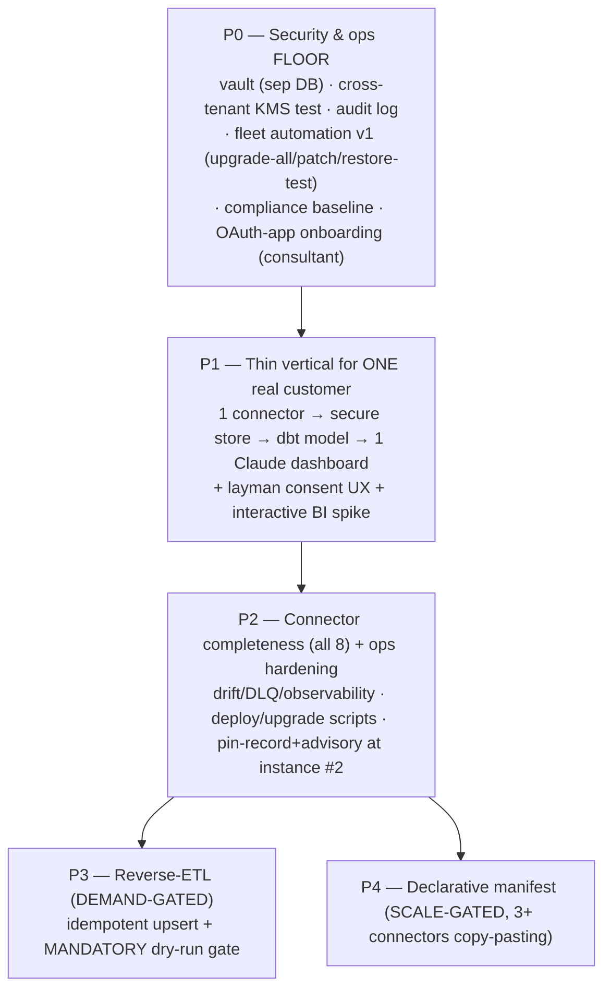

# FORGE Plan — Unified Data Hub Platform ("Planhat-but-yours")

**Slug:** data-hub-platform · **Date:** 2026-06-24 · **Depth:** standard · **Owner:** Matt
**Pipeline:** G0 scope → G1 research+verify → G2/G3 two panels (opus/sonnet) → G4a critic → G4b
tiebreak → G5 red-team → G6 synthesis (this doc). Run artifacts in
`.ravenclaude/runs/forge/data-hub-platform/`.

---

## 1. What we're building (scoped)
A **per-customer, single-tenant** web app. A **layman** connects their SaaS sources via guided OAuth;
the app **pulls data IN** for reporting (primary) and **pushes OUT** (secondary, reverse-ETL).
**Connectors built from scratch** (Matt's pinned call — made sustainable, not relitigated).
**Built-in secure credential vault.** **Claude + a vibecoder build the reporting** per customer.
Delivered by a **solo consultant** across N instances. Curated small source set per instance (not a
700-connector catalog). Sources in play: QuickBooks, Stripe, Salesforce, HubSpot, Google Calendar,
Slack, Granola, Planhat.

**Success signal:** a layman connects ≥2 real sources (zero hand-edited secrets), data lands in secure
per-customer storage, and Claude builds a working dashboard on top — no per-customer hand-coded SQL
sprawl, no credential ever in a log.

**The billable core is dashboards + the data model** (critic verdict). Connectors are a bounded,
curated, *measured* cost; platform infra is built **reactively from measured pain**, never speculatively.

---

## 2. ⚠️ The one decision to confirm before building (G4b T1 / critic CE-7 / red-team RT-01)
**The headline "a layman wires the connections" is only partly true.** End-user consent (click →
authorize) is one-click — but it requires an OAuth **app** already registered in each provider's
developer portal, and *that* is hard/admin-gated (Salesforce Connected App, Intuit production app with
review, HubSpot app, Google consent-screen verification). **Resolution baked into this plan:** the
**consultant registers ONE OAuth app per provider** (consultant-owned client_id/secret); the layman
only ever does consent. **Salesforce & QuickBooks are consultant-onboarded, not fully self-serve.**

> **CONFIRMED by Matt (2026-06-24):** yes — someone always registers an OAuth app per provider. The
> product's job is to **ship a guided, per-provider SETUP WALKTHROUGH** ("how to create the OAuth app
> in *this* provider's developer portal — where to go, what scopes, what callback URL, what to paste
> back") so whoever holds the admin permissions can self-serve the registration. This is a **first-class
> feature**, not a hidden manual step: each connector ships its own setup guide + a paste-back form for
> client_id/secret + a "test connection" check.
>
> Persona model: **layman *consents*; an admin (consultant or the customer's own admin) follows the
> in-app guide to *register the app* once per provider.** Salesforce/QuickBooks guides are the most
> detailed (admin-gated, review steps). The per-provider `client_secret` is a **global** secret (see
> threat model §6) — accepted while the consultant controls every host.

**New build requirement (P0/P2):** a **connector setup-guide framework** — each connector definition
carries its provider's registration walkthrough (steps, screenshots/links to the dev portal, required
scopes, callback URL), surfaced in the connect flow, with a paste-back form + live "test connection"
validation. Treat this guide as part of the connector contract, versioned alongside it.

---

## 3. Stack (reconciled — Panel B's lean line won the forks; see tiebreaks.md)
| Layer | Choice | Tiebreak |
|---|---|---|
| Runtime | TypeScript / Node 22 LTS | both agreed |
| Backend | Hono (lean) | D8 |
| DB | Postgres 16, **vault in a separate DB/instance from analytics** | both + C1 |
| ORM | Drizzle | B |
| Sync | BullMQ + Redis (Temporal deferred until durability pain is measured) | D3 |
| Connectors | thin TS **base-class**; **vendor npm SDK clients allowed for types/transport**, you own sync/transform/cursor; declarative manifest deferred until measured | D1, D4 |
| Metrics | dbt Core (Cube deferred to 5+ customers) | D2 |
| Dashboards | Evidence.dev for Claude-authored canonical reports **+** Metabase/Lightdash on the same marts for layman self-serve filter/drill (pending §5 spike) | D8/CE-3 |
| Vault | app-level AES-256-GCM, per-customer DEK, KEK in cloud KMS off the app DB | both |
| Deploy | Docker Compose, one host per customer; **fleet automation is a P0/P1 deliverable, not deferred** | D7 + RT-10/11 |

---

## 4. Reconciled dependency DAG

**Critical path:** P0 → P1 → P2. Nothing matters until a real customer uses P1. Within P2, the 6
remaining connectors parallelize once the base-class is frozen. P3/P4 are gated on real demand/scale.

---

## 5. Phases (with per-phase acceptance tests + gates)

### P0 — Security & ops FLOOR (amended per red-team: fleet + compliance pulled in)
**Deliverables:** monorepo scaffold; **CredentialStore** (the ONLY KMS-touching code) — AES-256-GCM,
per-customer DEK, KEK in cloud KMS; **vault in a separate DB/role from analytics**; hash-chained audit
log; OAuth callback handler (state, PKCE, exchange, encrypted storage, refresh, reconnect);
**consultant OAuth-app onboarding runbook** (one app per provider); **fleet automation v1**
(`upgrade-all`, automated patching, monitored backups + **restore test**); **compliance baseline**
(region pinning, at-rest encryption on the warehouse, deletion/KEK-destruction on deprovision,
DPA + sub-processor statement, "Claude sees schema not rows" invariant).
**Acceptance:**
- Encrypt→store→restart→decrypt round-trips with **no plaintext env fallback**; DB dump has no
  plaintext secret and no KEK.
- **Negative test (C1/RT-?):** the analytics/dashboard DB role gets `permission denied` on the vault
  schema.
- **Cross-tenant negative test (C2/RT-01):** instance B's KMS principal gets `AccessDenied` on instance
  A's key.
- Audit log is append-only (UPDATE/DELETE fails) and its hash chain verifies.
- `restore-customer.sh` rebuilds an instance from backup; connections + cursors + audit intact.
- Deprovision destroys the customer KEK → all stored ciphertext is permanently unreadable.

### P1 — Thin vertical to first customer value
**Deliverables:** `BaseConnector` (owns retry budget, rate-limit backoff, token-refresh injection,
cursor persistence, DLQ routing); **Stripe** connector (clean OAuth, rich demo data); layman consent
UX (Sources screen + Connect modal + reconnect); minimal **stable CDM target for one category**
(accounting) in dbt; one Evidence dashboard Claude authors **from a versioned template** (config, not
freehand); the **interactive-BI spike** (real customer's top-5 questions vs Evidence inputs → decide
Metabase/Lightdash in/out for v1).
**Acceptance (the scope success signal):**
- Layman completes consent for the self-serve sources with zero hand-edited secrets.
- Incremental sync lands data; **re-run writes no duplicate rows** (cursor correct).
- Claude builds a dashboard from the template; its SQL references **only dbt models** (lint fails on
  raw-table refs).
- Spike verdict recorded: does the layman get filter/drill/export without an LLM rebuild?
- One **real consulting customer** completes P1 against their real accounts; Matt: "useful right now."

### P2 — Connector completeness + ops hardening
**Deliverables:** HubSpot, Salesforce, Google Calendar, Slack, Granola, Planhat (Salesforce/QuickBooks
via the consultant-onboarded path); schema-drift detection (badge); DLQ replay; per-connector
schedule; **promote the connector registry from a JSON file to a pin-record + advisory the moment a 2nd
instance exists** (C5); `deploy-customer.sh` (<15 min) / `upgrade-customer.sh` (no manual SQL).
**Acceptance:** all 8 sync incrementally; drift badge fires on a synthetic field add; **hard-delete
detection** present (RT-07) — a deleted source record is reflected, not phantom-retained; DLQ replays;
new customer provisioned <15 min; existing customer upgraded with no data loss; **connector break-fix
time is measured** (gates any P4 manifest investment — C5/R7).

### P3 — Reverse-ETL (DEMAND-GATED) — build only when a customer asks
**Deliverables:** outbound engine with **idempotent upsert (dedupe key) + MANDATORY dry-run gate**
before any write (D5/RT — the safety coupling is non-negotiable even though timing is demand-gated);
HubSpot/Salesforce first destinations; minimal field-mapping.
**Acceptance:** run an outbound sync **twice** → destination has zero duplicates; dry-run aborts write
nothing; unchanged source → zero outbound rows.

### P4 — Declarative connector manifest (SCALE-GATED) — only at 3+ connectors copy-pasting
**Deliverables:** YAML manifest (Airbyte-CDK-inspired) + compiler + escape hatch; port 2–3 connectors
as proof. **Trigger:** measured copy-paste duplication AND a measured break-fix-time threshold, not a
calendar date.

---

## 6. Threat model & top risks (critic + red-team merged)
| ID | Risk | P×I | Status / mitigation |
|---|---|---|---|
| RT-01/R1 | **Global consultant `client_secret` leak = fleet-wide account-takeover** of every customer's connected accounts | H×H | Mitigated: secret only on consultant-controlled hosts; per-provider least scope; rotation via P0 fleet automation; **re-open before any customer-controlled infra**. Residual accepted while consultant owns every host. |
| R1/CE-7 | Layman can't self-register OAuth apps → headline promise false | H×H | Mitigated by §2 (consultant onboards Salesforce/QuickBooks); **Matt confirms**. |
| RT-10/11 | Solo × N ops cascade (one CVE/provider-deprecation = N simultaneous fires); rotation needs automation | H×H | **Mitigated by amendment:** fleet automation pulled to **P0** (was deferred). Explicit ops ceiling before scaling past ~3. |
| RT-17 | No compliance/data-residency posture → blocks finance-customer procurement | H×H | **Mitigated by amendment:** compliance baseline is a **P0** deliverable. |
| R2/CE-1 | Vault shares trust boundary with analytics → SQL reads `credentials` | M×H | Mitigated: separate DB/role, zero grant, negative test (P0). |
| R3/CE-2 | Per-customer KMS/IAM isolation collapses at N>3 | M×H | Mitigated: cross-tenant negative test + reviewed IAM template (P0). |
| RT-05/06/07/09 | Incremental-sync data loss: cursor-boundary, no-modstamp, invisible hard-deletes, Intuit refresh-token rotation + concurrent workers | M×H | Mitigated: BaseConnector contract requires overlap/idempotent cursor windows, periodic reconcile for no-modstamp sources, delete-detection, single-flight token refresh. P2 acceptance. |
| R4/CE-3 | Static Evidence can't satisfy layman interactivity | H×M | Mitigated: P1 spike → Metabase/Lightdash if ≥2 questions fail. |
| R6/CE-4 | Dashboard drift + uncounted recurring LLM rebuild cost | H×M | Mitigated: template library is the source artifact; renders without an LLM in the loop; rebuild-cost in DoD. |
| RT-12/13 | Claude writes wrong-but-lint-passing SQL / silent template break across instances | M×H | Mitigated: metrics defined once in dbt (not per dashboard); template changes versioned + tested across instances; numeric spot-check in P1 acceptance. |
| RT-15 | Malicious source data → XSS / CSV-formula / SQL-param injection in the pipeline | M×H | Mitigated: treat all source data as untrusted; parameterized queries; output-encode in dashboards; CSV-injection guard. |
| RT-04 | N-host supply chain — poisoned transitive dep runs in-process with DEK + global secret | M×H | Mitigated: lockfile pinning, dep CVE scanning in fleet automation, minimal vendor-SDK surface. |
| R7/CE-6 | Connector break-fix is archaeology, not a one-liner (registry bet unproven) | M×H | Mitigated: measure break-fix time in P2 before investing in P4 manifest. |
| R10 | Reverse-ETL double-write corrupts a customer CRM | L×H | Mitigated: idempotent upsert + dry-run gate (P3, non-negotiable). |
| R11 | Granola/Planhat API + OAuth-app availability immature | M×M | Mitigated: spike each long-tail source before promising it in a curated set. |

**HIGH count: managed. No HIGH is unmitigated after the P0 amendments.** (Red-team's two unmitigated
HIGHs — fleet ops + compliance — are resolved by pulling both into P0.)

---

## 7. Alternatives considered (carried from panels)
- **Vendor unified-API (Nango/Merge) instead of from-scratch** — rejected per Matt's pin; "connections
  live in the app" is a data-sovereignty differentiator. *Borrow the patterns* (Nango 3-primitive
  split, Airbyte manifest), not the runtime.
- **Cube semantic layer from day 1** — deferred; dbt Core covers 80% with no extra per-instance service.
- **Temporal durable workflows** — deferred; BullMQ covers retry/DLQ now.
- **Kubernetes/GitOps fleet** — deferred; Docker Compose + fleet scripts fit a solo operator.

## 8. G1 unverified claims — settling steps
- HashiCorp Vault Transit (1d, training-knowledge) — settled by the P0 KMS-posture decision (pick AWS/
  GCP KMS or Vault; any KMS keeping the KEK off-DB satisfies 1a).
- RFC 7009 revocation (2c, partial) — settled by the P0 OAuth handler implementing refresh + reconnect.
- Per-connector $ maintenance figure (B.4, reasoned-Medium) — settled by **measuring** break-fix time
  in P2 (the gate for P4).
- Lucia Auth / Drizzle / Granola API maturity (panel-B open items) — settled by P1/P2 spikes.

## 9. Definition of done (v1.0)
1. **Security:** internal review (OWASP ASVS L2) finds no critical/high in the vault; no credential in
   any log/env-dump/error; vault isolated from analytics role; cross-tenant KMS isolation proven.
2. **Compliance baseline** present (residency, at-rest encryption, deletion-on-deprovision, DPA +
   sub-processor statement, Claude-schema-only).
3. **Connectors:** all 8 sync incrementally with cursors + delete-detection; break-fix time measured.
4. **Layman UX:** consent for the self-serve sources unassisted; consultant-onboarded path documented
   for Salesforce/QuickBooks.
5. **Dashboards:** Claude builds a working dashboard from a template in <4h; layman interactivity need
   met (spike-decided surface); no raw-table SQL.
6. **Ops:** provision <15 min; `upgrade-all` + automated patching + monitored backups with a passing
   **restore test**; explicit ops ceiling set.
7. **Reverse-ETL (if built):** run-twice → zero duplicates; dry-run gate enforced.
8. **Economics:** per-customer recurring cost line (LLM rebuilds + ops) documented; connector break-fix
   < the threshold that triggers P4.

---
*Synthesized by FORGE G6. Residual: this raises the floor on plan quality; it does not guarantee
correctness. The OAuth-app-ownership confirmation (§2) is the single highest-leverage open item.*
