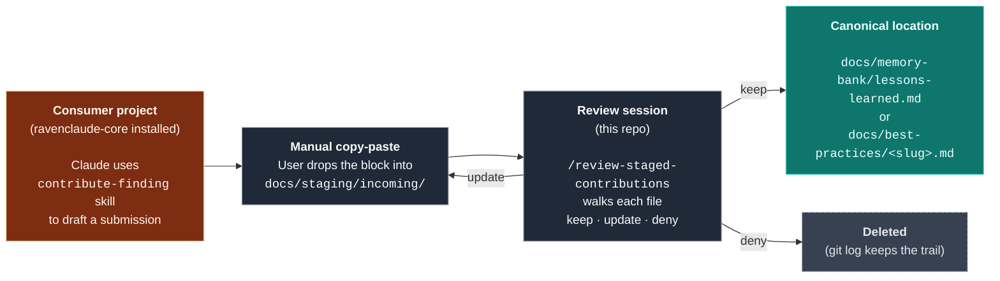

# Staging area for incoming contributions

This directory receives **proposed** lessons and best-practice docs from consumer projects that have `ravenclaude-core` installed. Files here are **not canonical** — they're awaiting maintainer review.



---

## How submissions arrive

**Consumer side.** Claude (with `ravenclaude-core` installed) follows the [`contribute-finding`](../../plugins/ravenclaude-core/skills/contribute-finding.md) skill: qualifies the finding, picks the shape (lesson, best-practice, or both), and prints a copyable `RAVENCLAUDE-STAGING-SUBMISSION` block in canonical format.

**Maintainer side.** Matt (or whoever is reviewing) drops the block into a new file at:

```
docs/staging/incoming/YYYY-MM-DD-<slug>.md
```

The date and slug should match the values inside the submission's metadata. The file *is* the staged content — no wrapping or extra formatting.

---

## How submissions are reviewed

In any Claude session running in this repo with `ravenclaude-core` active, invoke:

```
/review-staged-contributions
```

The skill walks `docs/staging/incoming/` file by file, oldest first. For each, it shows the metadata + the rendered body + what would happen on approval, then asks:

| Choice | What happens |
|---|---|
| **Keep** | Body is promoted to its canonical home (`docs/memory-bank/lessons-learned.md` for lessons, `docs/best-practices/<slug>.md` for best-practices). The staged file is deleted. For lessons, the count in `docs/architecture.md` is bumped. Commit: `docs(...): promote staged ...` |
| **Update** | Staged file stays in `incoming/`. The maintainer revises it (or directs Claude to revise), then re-runs the review. No commit. |
| **Deny** | Staged file is deleted with a one-line reason in the commit. Commit: `chore(staging): deny <filename> — <reason>` |

The git history is the audit trail — every accept and deny shows up in `git log docs/staging/`.

---

## File shape

Every file in `incoming/` opens with a metadata block as an HTML comment, then the proposed content in its final canonical shape (so promotion is a content-move, not a rewrite):

```html
<!-- RAVENCLAUDE-STAGING-METADATA
type: lesson | best-practice
proposed-by: <short context — e.g. "consumer project working on Flow retries">
proposed-on: YYYY-MM-DD
target-file: docs/memory-bank/lessons-learned.md  (or)  docs/best-practices/<slug>.md
status: pending
-->
```

If a finding produces both a lesson AND a best-practice, expect **two staged files** — they promote independently and cross-link on the maintainer side.

---

## What goes here vs. what doesn't

✅ **Cross-domain findings** — rules or stories that apply to any Claude work, any plugin, any project.

❌ **Domain-specific findings** — Power Platform / finance / EdTech / Salesforce specifics belong inside the relevant plugin's `skills/<skill>/resources/` folder, not in cross-domain `docs/`.

❌ **Personal preferences** — editor configs, individual working-style quirks. Those go in consumer-side personal memory at `~/.claude/projects/.../memory/`.

❌ **Project-specific incident reports** — if it's only useful to one consumer project, it stays in that project's repo, not here.

The [`contribute-finding`](../../plugins/ravenclaude-core/skills/contribute-finding.md) skill enforces these checks on the consumer side. If something does slip through, deny it.

---

## See also

- [`contribute-finding`](../../plugins/ravenclaude-core/skills/contribute-finding.md) — consumer-side authoring playbook
- [`review-staged-contributions`](../../plugins/ravenclaude-core/skills/review-staged-contributions.md) — maintainer-side review playbook
- [`lessons-vs-best-practices`](../best-practices/lessons-vs-best-practices.md) — meta-process for deciding whether a finding is a lesson, a best-practice, or both
- [`pr-vs-direct-push`](../best-practices/pr-vs-direct-push.md) — when to push promoted submissions to main directly vs open a PR
- [`CONTRIBUTING.md`](../../CONTRIBUTING.md) — the alternative flow for contributors with direct write access to this repo (PR-based, no staging step)
