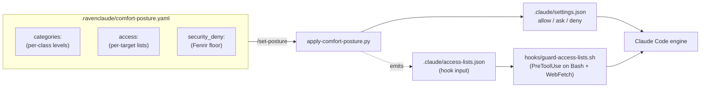

# Allow-list / block-list access-control mechanism

*Drafted by Team Lead 2026-05-23. Design doc — not yet implemented.*

> **⚠ BLOCKING prerequisite (2026-05-23 review): verify whitelist mode before building it.** Whitelist (strict) mode emits a **bare-tool `WebFetch` deny + per-domain allows** and assumes the scoped allows escape the bare-tool deny (§5.4, §6.1). But the repo's own `knowledge/claude-code-permissions.md` — and §6.3 of this very doc (line ~347) — say a **bare-tool deny removes the tool from Claude's context entirely**, which would make whitelist mode produce "no web at all" instead of "only these domains." The doc is internally contradictory on this point. **Run the §13-Q4 spike first** (5-minute scratch-project test: `deny: ["WebFetch"]` + `allow: ["WebFetch(domain:docs.anthropic.com)"]` — does the allowed domain succeed, or does the tool vanish?), record the result in `knowledge/claude-code-permissions.md`, and treat all `mode: whitelist` sections as **PENDING that verification**. If the tool vanishes, whitelist mode needs a hook-only default-deny, not an engine bare-tool deny (the documented `Tool(*)` fallback is unsafe — auto-mode silently drops it).
>
> **Terminology:** this doc uses "whitelist/blacklist" throughout, but the canonical terms (including the YAML `mode:` values) should be **`allowlist` / `blocklist`** — clearer and the modern standard. Renaming the `mode:` values is a schema decision worth making **before `schema_version: 5` ships** (a post-publish rename is a migration burden).
>
> **RECONCILIATION (2026-05-29): spike ANSWERED — the current mechanism is unsafe; redesign before building.** The §13-Q4 question is now resolved in two places written after this draft: `knowledge/claude-code-permissions.md` confirms a **bare-tool deny removes the tool from context entirely** (so whitelist mode as written produces "no web at all" — exactly the feared failure), and `docs/autonomous-guardrails-research-2026-05-29.md` documents the correct native primitives that **change this design's premise**: the sandbox **`allowedDomains`** config + native **`auto`** mode + a **PreToolUse default-deny hook** ("hooks can only tighten, never loosen"; "don't constrain Bash/tool args with allow patterns — deny the binary or use a PreToolUse hook"). **Action:** rewrite whitelist mode around `allowedDomains` + scoped `WebFetch(domain:)` allows + a PreToolUse hook — never an engine bare-tool deny — and adopt the `allowlist/blocklist` rename before any schema ships. Keep as design; do not build the current bare-tool-deny mechanism.

---

## 1. Problem (plain language)

Comfort-posture answers the question *"how autonomous do I want Claude to be in this category?"* with one of five levels per category. That works for **category-shaped policy** ("ask before any web write") but is too blunt for the more common ask: *"I want Claude to fetch docs freely from `docs.anthropic.com` and `learn.microsoft.com`, but never from any pastebin or paste-style sharing site, and pause on anything else."*

Today there is no per-target way to say that. The consumer can:

- Hand-author `WebFetch(domain:docs.anthropic.com)` allows in `.claude/settings.json` (which the next `/set-posture` overwrites).
- Add patterns to `security_deny:` (always-on, but only deny — no positive allow-list).
- Bend the per-pattern overrides inside a category (works for commands; not expressive for domains).

What's missing is a first-class **access list** mechanism that:

1. Lets the user **whitelist** or **blacklist** specific targets — domains, command patterns, tools/MCP servers, file paths — with semantics distinct from the category-level posture.
2. Plays cleanly with comfort-posture's existing translator and the security-deny floor (the **Fenrir** lane — un-overridable hard-denies).
3. Surfaces a **Heimdall**-style perimeter view: what was allowed, what was denied, by which list, when.
4. Is honest about what Claude Code can actually enforce — and where a hook is the only viable surface.

This proposal designs that mechanism as a coherent extension of comfort-posture, not a parallel system.

---

## 2. How this differs from sibling mechanisms

| Mechanism | Question it answers | Where it lives | Shape |
|---|---|---|---|
| **`comfort-posture.yaml` `categories:`** | *How autonomous in each category?* | `.ravenclaude/comfort-posture.yaml` | 12 categories × 5 levels |
| **`comfort-posture.yaml` `security_deny:`** (Fenrir lane) | *What is always denied, no exceptions?* | same file, top-level list | Flat list of patterns, deny-only |
| **`comfort-posture.yaml` `categories.<cat>.overrides`** | *Within one category, which exact patterns differ from the category level?* | nested under a category | Map: pattern → level |
| **`access:` block** *(this proposal)* | *Which specific external targets are allow-listed vs deny-listed, per target type?* | same file, new top-level block | Per-target-type: mode + allow + deny lists |
| **Claude Code `permissions.{allow,ask,deny}`** | *The raw rules the engine evaluates* | `.claude/settings.json` (generated) | Flat lists of `Tool(specifier)` strings |

**Axis test:** category levels answer *"how cautious in a class of actions?"* Access lists answer *"which specific instances escape the class default in either direction?"* They compose — access lists are a per-target stripe drawn across categories at translation time.



The access lists feed **two** enforcement surfaces because Claude Code's native permission engine handles some target shapes (domains via `WebFetch(domain:...)`) cleanly and others (Bash argument patterns) poorly. The honest answer is "engine where it works, hook where it doesn't" — see §6.

---

## 3. Target types this covers

Each target type is a class of action with a distinct enforcement surface. The schema treats them uniformly; the translator emits the right surface for each.

| # | Target type | Examples | Enforcement surface (primary) |
|---|---|---|---|
| 1 | **Web domains** | `docs.anthropic.com`, `*.github.com`, `pastebin.com` | `WebFetch(domain:...)` rules + `guard-access-lists.sh` for `curl`/`wget`/`gh api` |
| 2 | **Command patterns** | `docker compose up:*`, `aws s3 rm:*`, `gh workflow run:*` | `Bash(...)` rules (when narrow enough) + `guard-access-lists.sh` |
| 3 | **Tools & MCP servers** | `mcp__microsoft_learn__*`, `mcp__filesystem__write_file`, `Agent`, `WebSearch` | Bare-tool / `mcp__<server>__<tool>` rules |
| 4 | **File paths** *(opt-in)* | `~/Documents/work/**`, `~/.ssh/**`, `/etc/**` | `Read(...)` / `Edit(...)` / `Write(...)` rules — with explicit caveat about subprocess access (§6.4) |

**Deliberately excluded** from v0.1.0:

- **Network egress at IP/port level.** Claude Code's permission engine has no IP-level primitive. The right surface is the OS-level sandbox (macOS Seatbelt / Linux Landlock), not this mechanism. Pretending otherwise would repeat the Cursor denylist failure mode (proposal 002 §3).
- **Per-process resource quotas.** Different problem class.
- **Time-of-day allowlists** ("no `git push` after 6 PM"). Doable as a hook extension; deferred until asked for.

---

## 4. Data model — extend `comfort-posture.yaml`

### 4.1 Where the lists live

**Decision: extend `comfort-posture.yaml` with a new top-level `access:` block.** Rejected alternatives:

| Option | Verdict |
|---|---|
| **Extend `comfort-posture.yaml` `access:` block (CHOSEN)** | Single file = single edit = single dashboard tab; same translator; same audit trail. Matches the "one YAML per plugin" rule from proposal 003. The lists ARE part of the posture; splitting is bureaucratic. |
| Sibling `.ravenclaude/access-lists.yaml` | Rejected. Two files to remember, two save flows, two validators, and the resolver has to merge them anyway. Plus a per-pattern collision question between the two files that doesn't arise if they share a file. |
| Per-target-type files (`web-allowlist.yaml`, `command-denylist.yaml`, …) | Rejected. Bureaucratic; nobody wants to remember six paths. |
| Inline in `.claude/settings.json` directly | Rejected. That file is generated, hand-edits get wiped by `/set-posture`. Posture YAML is the only durable source-of-truth surface. |

The new schema bumps to `schema_version: 5` (current is 4). Old v4 files load with `access:` defaulted to empty — no migration friction.

### 4.2 Schema shape (YAML excerpt)

```yaml
# .ravenclaude/comfort-posture.yaml
schema_version: 5
global_default: mostly-ask

categories:
  network_read: mostly-allow
  network_write: always-ask
  shell_remote_mutate: always-ask
  shell_code_exec: always-ask
  # ...

security_deny:                      # Fenrir lane — un-overridable
  - "Bash(rm -rf:*)"
  - "Read(.env)"
  - "Read(**/*.pem)"
  - "WebFetch(domain:0day.click)"   # known prompt-injection site

# NEW in schema_version 5
access:
  web:
    mode: blacklist                 # whitelist | blacklist | mixed (see §5)
    allow:
      - "docs.anthropic.com"
      - "code.claude.com"
      - "*.github.com"
      - "learn.microsoft.com"
    deny:
      - "pastebin.com"
      - "paste.ee"
      - "*.dropbox.com"
      - "transfer.sh"
    on_unlisted: ask                # what to do when target matches neither list
  commands:
    mode: blacklist
    allow:
      - "Bash(docker compose:*)"    # always allow (overrides category level)
      - "Bash(make test:*)"
    deny:
      - "Bash(aws s3 rm:*)"         # always ask (or deny — see precedence §5)
      - "Bash(gh workflow run:*)"
    on_unlisted: inherit            # fall through to category level
  tools:
    mode: blacklist
    allow:
      - "mcp__microsoft_learn__*"   # whole server trusted
      - "mcp__nimble__nimble_search"
    deny:
      - "mcp__filesystem__write_file"
      - "mcp__filesystem__delete_file"
    on_unlisted: inherit
  paths:                            # opt-in v0.2.0; see §6.4 for caveats
    mode: blacklist
    allow_read:
      - "~/Documents/work/**"
    deny_read:
      - "~/.ssh/**"
      - "~/.aws/**"
      - "~/.netrc"
    allow_edit: []
    deny_edit:
      - "//etc/**"
      - "~/.ssh/**"
    on_unlisted: inherit
```

### 4.3 Field semantics

| Field | Required | Meaning |
|---|---|---|
| `mode` | yes | `whitelist`, `blacklist`, or `mixed`. Governs how `on_unlisted` is resolved when omitted. See §5. |
| `allow` | no, defaults `[]` | Patterns that escape upward toward `allow`. Deny in security_deny still wins. |
| `deny` | no, defaults `[]` | Patterns that escape downward to `deny`. Never to `ask` — `deny` means deny. |
| `on_unlisted` | no, defaults per mode | What to do when a target matches neither list: `allow`, `ask`, `deny`, or `inherit` (fall through to the category level). |

Three modes (renaming the abstract whitelist/blacklist semantics into concrete behavior):

| Mode | Default `on_unlisted` | Meaning |
|---|---|---|
| `whitelist` | `deny` | Only listed allow targets are permitted; everything else denied. **Strict.** |
| `blacklist` | `inherit` | Allow what's in `allow` (escapes ask); deny what's in `deny`; everything else falls through to the category level. **Permissive baseline with named exceptions.** |
| `mixed` | `ask` | Both lists active; unlisted targets prompt. **Conservative middle.** |

The user can always override the default `on_unlisted` explicitly. `mode` is a labeling convenience that picks a sensible default — it does not exclude either list.

> **Fail-closed guard on `on_unlisted: allow` (2026-05-23 review).** `on_unlisted: allow` is a user-authorable fail-open switch: one setting turns "ask on the unknown" into "permit every unlisted target." It must (a) emit a translation-time warning, (b) render in the dashboard with the same red treatment as a `security_deny` edit, and (c) require an explicit confirmation. Symmetrically, the schema rejects blanket allows (`allow: ["*"]`, `allow: ["**"]`, bare-tool allows) at least as strictly as blanket denies — a blanket allow is the safety-subtracting direction.

### 4.4 Why three modes, not two

A pure "whitelist OR blacklist" binary forces the user into a corner. In practice we want:

- **Strict whitelist mode** for high-stakes runs (audit work, prod-adjacent sessions): only the named domains, period.
- **Blacklist with category fallthrough** for daily work: most things behave per category, but a few named targets get specifically promoted or demoted.
- **Mixed mode** for new categories the user hasn't reasoned about yet: ask on anything unlisted; over time, items migrate to allow or deny lists as the user makes the same decision repeatedly.

The architect's precedent for "third option that subsumes the binary" pattern: proposal 002 §4.2 picked 3-level posture over 2-level for the same reason.

---

## 5. Whitelist vs blacklist semantics & precedence

### 5.1 The single source of truth: deny wins

Claude Code's engine already enforces `deny > ask > allow` within a settings file, and `deny in any layer > allow in any layer` across layers (per `knowledge/claude-code-permissions.md` §Precedence). The access-list mechanism preserves this exactly. There is **no scenario** where adding a target to `allow:` un-denies a security_deny entry.

### 5.2 Resolution order (per-target evaluation)

For any single target (`docs.anthropic.com`, `Bash(git push:*)`, `mcp__foo__bar`, etc.), the resolver walks this chain top-to-bottom. **First match wins.**

```mermaid
flowchart TD
    START["Target = (type, value)"] --> Q1{Matches security_deny<br/>(Fenrir floor)?}
    Q1 -->|YES| DENY1["deny<br/>(NON-OVERRIDABLE)"]
    Q1 -->|NO| Q2{Matches access.&lt;type&gt;.deny?}
    Q2 -->|YES| DENY2["deny"]
    Q2 -->|NO| Q3{Matches access.&lt;type&gt;.allow?}
    Q3 -->|YES| ALLOW["allow"]
    Q3 -->|NO| Q4{access.&lt;type&gt;.on_unlisted<br/>set explicitly?}
    Q4 -->|YES| ONUNLISTED["use that value"]
    Q4 -->|NO| Q5{mode default}
    Q5 -->|whitelist| DENY3["deny"]
    Q5 -->|blacklist| INHERIT["inherit category level"]
    Q5 -->|mixed| ASK["ask"]
```

**Key invariants:**

1. **`security_deny` always wins.** A target listed in both `security_deny` and `access.web.allow` resolves to deny. The translator strips the conflicting allow entry and prints a warning. **(Correction, 2026-05-23 review: the existing `apply-comfort-posture.py` stripping is _exact-string set membership only_ — it does NOT do glob-aware subset matching. The glob-aware stripping this section relies on, e.g. recognizing `0day.click` is covered by `*.click` (§8.3), is _net-new Phase-2 work_, not existing logic. Implement it with `fnmatch` of every `access.*.allow` entry against every `security_deny` glob; do not ship claiming the current exact-string stripper covers globs.)**
2. **`access.<type>.deny` beats `access.<type>.allow`** within the same target type. The same pattern can't be both — the translator errors on overlap. (Less surprising than silently dropping one.)
3. **Specificity does NOT win.** If `*.github.com` is in `allow` and `raw.githubusercontent.com` is in `deny`, the deny wins because of rule 2 (deny lists checked first). Users wanting "allow github except raw" write the deny explicitly. Specificity-wins would break the security floor (a more-specific allow could re-permit a denied domain).
4. **Access-list allows escape upward** past the category's ask level. A category at `always-ask` with a domain in `access.web.allow` results in that domain emitted into `permissions.allow`. This is the **whole point**: lists override category default.
5. **Access-list denies escape downward** to deny (not to ask). The label "deny" means deny.

### 5.3 Why deny-wins-over-specificity (rule 3)

This is the load-bearing decision and worth its own subsection because it diverges from how some firewall systems work.

**Common alternative: specificity wins.** `*.github.com` allow, `raw.githubusercontent.com` deny → the deny wins because it's more specific. Many firewall DSLs use this.

**Why we reject it:** specificity-wins lets a user accidentally re-enable a denied target by writing a broader allow. With deny-wins, the security floor is monotonic — adding allow entries can never reduce safety.

**The cost:** users who genuinely want "allow `*.github.com` except `raw.githubusercontent.com`" must write both the allow AND the deny explicitly. We accept this cost. The dashboard surfaces the "what's denied within this allow scope?" relationship visually so the user can see what's being subtracted.

### 5.4 Worked precedence example

```yaml
security_deny:
  - "WebFetch(domain:0day.click)"

categories:
  network_read: always-ask        # ask on every web read by default

access:
  web:
    mode: whitelist
    allow:
      - "docs.anthropic.com"
      - "*.github.com"
    deny:
      - "raw.githubusercontent.com"
      - "0day.click"              # redundant — security_deny already covers
    on_unlisted: deny             # strict
```

| Target | Resolution |
|---|---|
| `docs.anthropic.com` | matches `access.web.allow` → **allow** |
| `api.github.com` | matches `*.github.com` (allow) → **allow** |
| `raw.githubusercontent.com` | matches `access.web.deny` → **deny** (specificity does NOT promote it back to allow) |
| `0day.click` | matches `security_deny` first → **deny** (Fenrir wins; the `access.web.deny` entry is redundant) |
| `stackoverflow.com` | unlisted; mode=whitelist; on_unlisted=deny → **deny** |
| `internal-wiki.acme.local` | unlisted → **deny** (whitelist mode is strict) |

Translation emit (excerpt):

```json
{
  "permissions": {
    "deny": [
      "WebFetch(domain:0day.click)",
      "WebFetch(domain:raw.githubusercontent.com)",
      "WebFetch"
    ],
    "allow": [
      "WebFetch(domain:docs.anthropic.com)",
      "WebFetch(domain:*.github.com)"
    ]
  }
}
```

The bare-tool `WebFetch` deny implements the "default-deny everything else" of whitelist mode. The specific-domain allows escape it. The Claude Code engine evaluates deny → ask → allow within the file; the more-specific allows win where they apply because the deny matches only the bare tool, not the `WebFetch(domain:...)` shape (per the schema in `knowledge/claude-code-permissions.md` §The schema — bare-tool vs scoped denies).

⚠ **Honest limit:** the bare-tool-deny + scoped-allow combination is one place where the Claude Code engine behavior must be re-verified before ship — see §10 open question Q4.

---

## 6. Enforcement — surface per target type

The honest story: Claude Code's permission engine can express some of these target types natively and some not at all. The translator emits engine rules **where they work** and a hook input file **for the rest**, and `guard-access-lists.sh` enforces the hook side.

### 6.1 Web domains — primary surface: `WebFetch(domain:...)`

**Works natively.** `WebFetch(domain:github.com)` is a first-class permission shape. The translator emits one rule per domain pattern. Wildcards (`*.github.com`) are documented to work for domain patterns.

**Limit:** `WebFetch` is only one of several ways an agent fetches the web. `Bash(curl ...)`, `Bash(wget ...)`, `Bash(gh api ...)`, and any MCP tool that fetches URLs also bypass `WebFetch(domain:...)` rules entirely. Per `knowledge/claude-code-permissions.md` §"Bash patterns — the documented fragility", argument-constraint patterns like `Bash(curl https://example.com *)` are bypassed by options-before-URL, protocol-swap, redirects, variable substitution, and whitespace. So:

- The translator emits `WebFetch(domain:...)` rules per the access list.
- The translator **also denies** `Bash(curl:*)`, `Bash(wget:*)`, `Bash(gh api:*)` at translation time when `access.web` has any list defined, redirecting all web reads through `WebFetch` where the domain rule applies.
- The hook (`guard-access-lists.sh`) is a belt-and-suspenders second check: any `Bash` command containing a URL is parsed and the URL's domain is checked against the list.

**Net surface:** `WebFetch` engine-enforced + curl/wget/gh-api blocked-at-engine + hook-enforced URL detection for anything left over. Not airtight (a Python subprocess can `urllib.request.urlopen` to any URL — see §6.4) but close.

### 6.2 Command patterns — primary surface: hook

**Engine works for narrow patterns.** `Bash(docker compose up:*)` works. `Bash(rm:*)` works. The translator emits these into allow/ask/deny per the access list.

**Engine fails for argument-shape constraints.** "Allow `gh api GET ...` but deny `gh api POST ...`" is documented-fragile — the user can write `gh api -X POST ...` or `gh api --method POST ...` and the rule misses. For these, the translator emits a **hook-enforced** entry into `.claude/access-lists.json` (the hook input), and `guard-access-lists.sh` parses the command robustly (recognizing both `-X METHOD` and `--method METHOD` shapes, etc.) and denies on match.

**The translator decides which surface per pattern:**

```python
# pseudocode
def emit(pattern: str, decision: str):
    if is_simple_prefix(pattern):              # "Bash(docker compose up:*)"
        emit_engine_rule(pattern, decision)
    else:                                       # "Bash(gh api POST:*)" — fragile
        emit_engine_rule("Bash(gh api:*)", "ask")  # broad ask as safety net
        emit_hook_entry(pattern, decision)         # hook decides
```

The `permission-hygiene` skill's existing "narrow patterns only" discipline applies here: prefer engine where pattern can be expressed narrowly, hook where it can't.

### 6.3 Tools & MCP servers — primary surface: engine

**Works cleanly.** `mcp__<server>__<tool>` is a first-class permission shape. `mcp__microsoft_learn__*` allows all tools from one server; `mcp__filesystem__write_file` denies a specific tool.

**Bare-tool denies** for `Agent`, `WebSearch`, `Task` etc. are also first-class — the engine removes the tool from Claude's context entirely. The schema treats these uniformly with MCP rules; the translator emits whichever shape matches the pattern.

### 6.4 File paths — primary surface: engine, with caveat

**Engine works** via `Read(...)` and `Edit(...)` rules with gitignore-style anchors. Translator emits per the access list.

**⚠ Critical limit:** per `knowledge/claude-code-permissions.md` §"Read/Edit path anchors", **path rules do not protect against subprocess access**. A `Read(**/.env)` deny does not stop a Python script Claude writes (`python -c "open('.env').read()"`) from reading the file. The translator already pairs path denies with `shell_code_exec: always-ask` (or stricter) via category levels; the access-list documentation must repeat this caveat prominently in the dashboard.

This is also why `paths:` is opt-in (v0.2.0) and gated behind a dashboard banner that names the limit explicitly: *"Path-based access lists are best-effort. They do not block a subprocess from reading or writing the path. Pair with shell_code_exec ≥ always-ask for meaningful coverage."*

### 6.5 Honest summary of what we can and can't enforce

| Target | Engine alone | Engine + hook | OS sandbox (out of scope) |
|---|---|---|---|
| `WebFetch(domain:foo.com)` | ✅ | n/a (engine sufficient) | n/a |
| `Bash(curl https://foo.com)` | ❌ (bypassable 6 ways) | ✅ with curl-arg-parsing hook | ✅ outbound network policy |
| `Bash(python -c "urllib.request.urlopen(...)")` | ❌ | ❌ (we don't parse arbitrary Python) | ✅ outbound network policy |
| `Bash(docker compose up:*)` | ✅ narrow allow | n/a | n/a |
| `Bash(gh api POST:*)` | ❌ (`-X POST` bypass) | ✅ with method-arg hook | n/a |
| `mcp__server__tool` | ✅ | n/a | n/a |
| `Read(~/.ssh/**)` | ✅ for Claude's `Read` tool | n/a for `Read` tool; still bypassable via Python | ✅ filesystem ACL |
| `Edit(~/.ssh/**)` via Python `open(..., 'w')` | ❌ | ❌ | ✅ filesystem ACL |

The mechanism's honest framing in the dashboard: *"Access lists are convenience and policy clarity, not a security sandbox. For untrusted code paths, pair this with `shell_code_exec: always-ask` and the OS-level Claude Code sandbox feature."*

---

## 7. Layering with existing settings scopes

### 7.1 The Claude Code 5-layer model still applies

Per `knowledge/claude-code-permissions.md` §Precedence: managed > CLI args > project-local > project-shared > user. **Deny in any layer beats allow in any other layer.**

The access-list translator writes into the **project-shared** layer (`.claude/settings.json`) only. Personal overrides go in `.claude/settings.local.json` and survive `/set-posture` runs unchanged (per the comfort-posture v0.17.0 contract).

### 7.2 The local-override path

A consumer can ship a team `comfort-posture.yaml` (checked in) with a baseline whitelist, and override personally via a gitignored sidecar:

```
.ravenclaude/
├── comfort-posture.yaml          # team baseline, checked in
└── comfort-posture.local.yaml    # personal override, gitignored
```

The translator merges them with **last-wins per-list**: personal `access.web.allow` extends the team one; personal `access.web.deny` extends the team one; personal `mode` overrides the team one. The Fenrir floor (`security_deny`) is **not extendable downward** — personal config can ADD to security_deny but cannot REMOVE.

This matches the existing `.claude/settings.json` vs `.claude/settings.local.json` precedence and the proposal 003 §7.1 team-vs-personal pattern.

### 7.3 Fenrir (security_deny) interaction — un-overridable floor

`security_deny:` is the hard-deny lane. The access-list mechanism composes thus:

| Action | Allowed? |
|---|---|
| Add a domain to `security_deny` | ✅ Always allowed |
| Remove a domain from `security_deny` (team file) | ⚠ Allowed but flagged: emits a warning at translation time |
| Override `security_deny` via personal `access.web.allow` | ❌ Translator strips it with a warning |
| Override `security_deny` via personal `comfort-posture.local.yaml` security_deny removal | ❌ Personal layer can only ADD to security_deny, not subtract |

The reason: security_deny is the marketplace's recommended floor + the consumer's organizational floor. Per-user override of that floor would be the **exact attack vector** CVE-2026-25725 (settings.json injection) exploited — a malicious repo committing a settings file that subtracts safety. Comfort-posture v0.17.0 already prevents this at the translator; this proposal preserves it.

### 7.4 Auto-mode interaction

`auto` mode silently drops broad allow rules (per `knowledge/claude-code-permissions.md`). The translator's existing discipline applies: emit **narrow** patterns. The access-list emissions are narrow by construction (one domain per `WebFetch(domain:foo.com)` rule, one MCP tool per `mcp__server__tool` rule). The only broad shape we emit is the **bare-tool deny** in whitelist mode (`"WebFetch"` deny + per-domain allows) — and bare-tool denies are NOT in auto-mode's drop list (only broad allows are dropped). Verified safe.

---

## 8. Pattern matching

### 8.1 What characters are supported

| Wildcard | Meaning | Where it works |
|---|---|---|
| `*` | One or more characters, **not crossing a domain dot boundary** for `web` | `web`, `commands`, `tools` |
| `*.foo.com` | Any single subdomain of `foo.com` (no nested dots) | `web` only |
| `**.foo.com` | Any subdomain depth | `web` only |
| `**` | gitignore-style any-depth | `paths` only (matches the existing `Read(**/foo)` shape) |
| `Bash(prefix:*)` | Anthropic's colon-suffix shape | `commands` only |
| `mcp__server__*` | All tools from a server | `tools` only |
| `mcp__server__tool` | Exact tool | `tools` only |

**No regex.** Regex would be flexible but error-prone — the consumer can shoot themselves in the foot with a catastrophic-backtracking pattern, the dashboard can't safely preview matches, and the Claude Code engine doesn't support regex anyway. Glob/wildcard is enough.

### 8.2 Punycode / IDN domains

For `web` patterns: the translator normalizes to ASCII via Punycode at emit time. The dashboard accepts Unicode input and shows both the displayed form and the ASCII normalized form before save. This prevents the homoglyph-domain trick (`аpple.com` with a Cyrillic 'а') from sneaking past a list authored against the Latin form.

### 8.3 Pattern collision detection

The translator scans for:

- Same pattern in both `allow` and `deny` of the same access-list target type → error, refuse to translate.
- Pattern in `access.<type>.allow` that's also in `security_deny` → warn, strip the allow.
- Pattern that's a strict subset of a `security_deny` pattern (e.g. `WebFetch(domain:0day.click)` allow with `security_deny: ["WebFetch(domain:*.click)"]`) → warn, strip the allow. **(Net-new Phase-2 work — the current translator does exact-string matching only; this glob-subset detection must be built, per the §5.1 correction.)**

The collision report renders in the dashboard's Access tab (§9) as a banner.

---

## 9. Dashboard UI

The Settings tab in `plugins/ravenclaude-core/dashboard.html` already renders the 12 category × 5 level grid + the `security_deny` floor (per proposal 003). This proposal adds a new **Access** tab.

### 9.1 Tab layout

```
+--------------------------------------------------------------+
| Settings | Access* | Commands | Trees | Activity            |  ← *new tab
+--------------------------------------------------------------+
|                                                              |
|  [ Web ]  [ Commands ]  [ Tools / MCP ]  [ Paths ]           |  ← target-type sub-tabs
|  ─────                                                       |
|                                                              |
|  Web access mode:    ◉ Blacklist  ○ Whitelist  ○ Mixed       |
|  When unlisted:      [inherit ▾]                             |
|                                                              |
|  ┌─ Allow-list ──────────────────────────────────────────┐  │
|  │ docs.anthropic.com                              [ × ] │  │
|  │ *.github.com                                    [ × ] │  │
|  │ learn.microsoft.com                             [ × ] │  │
|  │ + Add domain or pattern...                            │  │
|  └────────────────────────────────────────────────────────┘  │
|                                                              |
|  ┌─ Deny-list ───────────────────────────────────────────┐  │
|  │ pastebin.com                                    [ × ] │  │
|  │ *.dropbox.com                                   [ × ] │  │
|  │ + Add domain or pattern...                            │  │
|  └────────────────────────────────────────────────────────┘  │
|                                                              |
|  ⚠ Always-deny (from security_deny — Fenrir lane):           |
|     0day.click  (managed in Settings → Security floor)       |
|                                                              |
|  ┌─ Heimdall: recent decisions (last 50) ───────────────┐   │
|  │ 2026-05-23 14:22  allow  docs.anthropic.com  list:allow│  │
|  │ 2026-05-23 14:21  deny   pastebin.com        list:deny │  │
|  │ 2026-05-23 14:18  ask    stackoverflow.com   unlisted  │  │
|  │ ...                                                    │  │
|  └────────────────────────────────────────────────────────┘  │
|                                                              |
|  [ Copy YAML ]  [ Download YAML ]   live preview: ▾          |
+--------------------------------------------------------------+
```

### 9.2 Per-tab features

- **Web:** Mode selector + allow-list + deny-list + unlisted-handling. Each list row shows the pattern, a remove button, and (on hover) a "test against this domain" input that simulates resolution.
- **Commands:** Same shape, with a "common commands" picker pre-loaded with the marketplace's curated allow / deny candidates from the existing comfort-posture category emissions.
- **Tools / MCP:** Reads connected MCP servers (where the env exposes them) and shows a per-server checkbox grid. Per-tool override under each server expandable on click.
- **Paths:** Hidden until the user toggles "Show advanced (file-path lists)" — buried because the subprocess-bypass caveat needs to be opted into deliberately.

### 9.3 Live preview pane

The right pane (when the user clicks **live preview**) shows the YAML diff for `access:` and the resulting `.claude/settings.json` diff side-by-side. This is the "translator preview" surface — the user sees exactly what `/set-posture` would emit if they save now.

### 9.4 Test-resolution input

Every sub-tab has a "Try a target" input at the bottom. Type a domain / command / tool / path; the page walks the §5.2 decision flow and shows: matched-rule, resolution, would-emit. This is the load-bearing usability feature — the user doesn't have to translate the YAML in their head.

### 9.5 Save flow

**Reuse the existing File System Access API auto-save (2026-05-23 review).** The Settings tab already auto-saves `comfort-posture.yaml` via the File System Access API (shipped in PR #65, Chrome/Edge); the `access:` block serializes into the **same file**, so the Access tab should reuse that same save path and file handle rather than regressing to a manual copy-paste-then-`/set-posture` flow (which would be a UX regression against the shipped Settings tab). Keep **Download YAML** as the fallback for browsers without the API (Firefox/Safari). After save, `/set-posture` re-emits `.claude/settings.json` + `.claude/access-lists.json` (the hook input) as before.

> **Mode-change confirmation modal (lockout prevention).** Switching a target type to `whitelist`/`allowlist` mode silently denies everything not on the allow-list — a non-developer can lock themselves out and see only silent failures. On any switch _into_ a strict mode, show a modal: *"Switching to allow-list mode. Everything not on your allow-list will be denied. You currently have N allow entries; everything else will be blocked."* with a **"Switch back to block-list (restore defaults)"** recovery affordance that does not require hand-editing YAML.

---

## 10. Security considerations

### 10.1 Heimdall — the perimeter watch

`guard-access-lists.sh` logs every decision (allow / ask / deny) it makes to `.claude/access-lists.log` as JSONL:

```jsonl
{"ts":"2026-05-23T14:22:01Z","target_type":"web","target":"docs.anthropic.com","decision":"allow","matched_list":"allow","rule":"docs.anthropic.com","tool":"WebFetch"}
{"ts":"2026-05-23T14:21:43Z","target_type":"web","target":"pastebin.com","decision":"deny","matched_list":"deny","rule":"pastebin.com","tool":"WebFetch"}
{"ts":"2026-05-23T14:20:12Z","target_type":"command","target":"gh api -X POST /...","decision":"deny","matched_list":"deny","rule":"Bash(gh api POST:*)","tool":"Bash"}
```

The dashboard reads this log file at page load (last 50 entries, inline-everything pattern per proposal 003 §4.7) and shows it in the Heimdall panel. Out-of-scope for v0.1.0 but designed-in: an aggregate count of denies per pattern (which rules are doing work? which rules have never matched?), surfaced as a list-pruning suggestion.

**Native Claude Code engine decisions** (the ones we emit as engine rules) do NOT flow through the hook log — Claude Code doesn't expose a hook on "permission check happened." Heimdall logs only the hook-enforced decisions. This is a known gap; see §11 open question Q5. **The dashboard panel must therefore be labeled "Recent access decisions (hook-enforced only)"** with a sub-label noting that engine-enforced WebFetch/MCP decisions are not shown — so an empty log is never misread as "no access happened."

### 10.2 The lists themselves as a target

The `comfort-posture.yaml` file is a security-critical artifact (it generates `.claude/settings.json`). The existing `validate-dashboard-yaml.sh` hook from proposal 003 validates every write against `dashboard-schema.json`. This proposal extends that schema (`schema_version: 5`) but adds no new validation seam — the existing hook covers it.

**The hook input file `.claude/access-lists.json`** is a different concern. It's machine-generated by the translator; hand-edits get wiped on every `/set-posture` run. The translator stamps it with `_generated_by` and `_generated_at` markers (same pattern as the comfort-posture v0.17.0 overwrite contract).

### 10.3 Prompt-injection resistance

The dashboard renders user-provided patterns (`docs.anthropic.com`, etc.) in three places: the per-list rows, the live preview pane, the Heimdall log. All three render via `textContent` (not `innerHTML`) per the existing dashboard.html discipline. The patterns are escaped by the YAML translator (the existing `apply-comfort-posture.py` uses `json.dumps` which handles quoting). No new XSS surface.

**Indirect prompt-injection via a malicious upstream source:** if a consumer copies an access list from an untrusted blog post (cf. the `0day.click` incident on 2026-05-22 — see `proposals/2026-05-22-003-per-plugin-dashboard.md` §9 "Audit-trail note"), the list could contain patterns crafted to subtract safety (a `deny: ["**"]` to brick the user's project, a `security_deny:` removal). Mitigations:

- The translator emits a confirmation prompt on first run after any `security_deny:` removal (showing what was removed and why; the dashboard surfaces the diff vs the marketplace baseline).
- The schema rejects `deny: ["**"]` at the top of a target's list (footgun guard).
- The dashboard's "Load existing YAML" button shows a diff against the marketplace baseline before applying, so a user pasting in untrusted YAML sees what they're agreeing to.

### 10.4 Audit log retention

`.claude/access-lists.log` is appended-only and grows. A rotation skill (`access-log-rotate`) is a phase 4 deliverable — for v0.1.0, the file is gitignored and the user can `> .claude/access-lists.log` to truncate any time. The dashboard reads only the last 50 entries; if the file is large, the user notices via disk space, not via dashboard slowness.

### 10.5 No defaultMode escalation

The translator must NOT write `defaultMode: "auto"` or `defaultMode: "bypassPermissions"` into `.claude/settings.json` under any circumstance (per `knowledge/claude-code-permissions.md` §"Implications for project hooks" — that's the CVE-2026-33068 attack vector). This was already true for `apply-comfort-posture.py`; this proposal preserves it.

---

## 11. Edge cases & failure modes

### 11.1 Empty lists

`mode: whitelist` with empty `allow: []` → deny everything in this target type. The translator emits a single bare-tool deny and prints a one-line warning. (Same posture as `categories.network_read: deny` would produce.)

### 11.2 Conflicting wildcards

`allow: ["*.github.com"]` + `deny: ["api.github.com"]` is the intended use case (§5.3 worked example). The translator emits both; the engine resolves deny-wins-by-default. The dashboard's "Try a target" input verifies the user's intent.

### 11.3 Unrecognized target

A consumer adds `access.email: { ... }` (we don't ship that target type). The schema validator rejects the write at the hook layer; the dashboard refuses to render the unknown block. Strict schema = predictable behavior.

### 11.4 Hook script missing

If `guard-access-lists.sh` is missing from `${CLAUDE_PLUGIN_ROOT}/hooks/`, the engine-emitted rules still work (they're enforced by Claude Code's own engine, not by the hook). The hook-only surfaces (curl URL parsing, `gh api -X POST` detection) silently fail-open. This is the **same posture as enforce-layout.sh** when `.repo-layout.json` is absent — the marketplace pattern. Documented behavior; not a bug.

### 11.5 Hook script errors out

The hook is `set -euo pipefail` so a malformed input crashes the script. Per Claude Code's hook semantics, a non-zero exit denies the action — fail-closed. The translator audits the hook by running it against `tests/fixtures/access-list-cases/` in CI; broken hook = broken CI = block merge.

### 11.6 Migration from v4 schema

v4 posture files (no `access:` block) load with `access: {}` defaulted. The translator emits zero access-list rules; existing behavior is unchanged. The `schema_version` bump is informational (warns if user is on a future version reading with old translator).

### 11.7 Curl-with-piped-shell already in security_deny

`curl * | sh` and friends are in the marketplace's default `security_deny`. The access-list translator doesn't re-emit those — they're handled by the Fenrir floor and would be redundant. Explicit > implicit, but documented in the skill.

### 11.8 Massive lists

A user with a 10,000-domain allow-list. The translator emits 10,000 `WebFetch(domain:...)` rules into `.claude/settings.json`. Engine throughput is fine (linear scan of a list); the dashboard's live preview pane lazy-renders. The hook input file is JSON-array-of-patterns; the hook script reads it once per invocation. No theoretical limit; practical limit is "user can edit it sanely" — surfaced as a soft warning at 200 entries.

---

## 12. Phased build

| Phase | Deliverable | Effort | Status |
|---|---|---|---|
| **1** | This proposal lands; architect + security review | n/a | this PR |
| **2** | `schema_version: 5` bump in `dashboard-schema.json` + `access:` block parsing in `apply-comfort-posture.py` + emission of `WebFetch(domain:...)` rules + emission of `mcp__server__*` rules + unit tests on a fixture posture | 6-10 h | not started |
| **3** | `hooks/guard-access-lists.sh` (curl URL parsing, `gh api` method detection) + `.claude/access-lists.json` hook input emission + `.claude/access-lists.log` JSONL output + hook registration in `hooks.json` + audit-gates CI fixture | 8-12 h | not started |
| **4** | Dashboard Access tab (sub-tab layout, per-list editors, mode selector, on_unlisted picker, live preview, "Try a target" input, Heimdall last-50 panel) | 12-18 h | not started |
| **5** | Path-list target type (opt-in, with prominent subprocess-bypass caveat); log rotation skill; aggregate-decision stats in Heimdall panel | 6-10 h | not started |

**Phase 2 ships standalone** — comfort-posture YAML can be hand-edited with the new block and translated, even without the dashboard tab or hook. Each subsequent phase adds depth without breaking earlier phases. The split is intentional: phase 2 produces a working artifact even if phase 4 slips.

**Total honest estimate for full delivery: 32-50 h.** Closer to the upper end if the curl-URL-parser turns out to need a real shell-parser library; closer to the lower end if `gh api` is the only argument-shape case worth supporting in v0.1.0.

---

## 13. Open questions for Matt

1. **Path-list opt-in or opt-out?** The subprocess-bypass caveat (§6.4) is real. Should path-lists ship in v0.1.0 with the warning banner, or wait for v0.2.0 (after path-only-via-sandbox guidance lands)? Recommend: v0.2.0, gated.
2. **Heimdall log destination — file or stderr?** Hook stderr lands in the transcript; a separate file persists across sessions. Currently designed as both: file for the dashboard, stderr for the immediate session. Worth checking if the noise is unwelcome in transcripts.
3. **Pattern matching: glob vs literal-with-wildcard?** The §8.1 vocabulary leans toward "wildcard but not full glob." Should `**` work in `web` (e.g., `**.foo.com` for "any subdomain depth")? Lean yes.
4. **Whitelist-mode emission shape — re-verify bare-tool deny + scoped allow** before ship (§5.4). The published doc says deny > ask > allow within a file, but the precedence between bare-tool deny and `Tool(specifier)` allow needs a 5-minute empirical test against the real engine. If specificity does NOT escape the bare-tool deny, whitelist mode needs to emit `Tool(*)` deny (which auto-mode drops!) instead — would force a redesign. Spike before phase 2.
5. **Native engine decision logging.** Claude Code does not expose a "permission decision happened" event; Heimdall only sees hook-enforced decisions. Is that a dealbreaker for the perimeter-watch concept, or acceptable as v0.1.0?
6. **Per-engagement lists.** Should a project be able to declare a one-off "this engagement allows extra-network-write because we're hitting a sandbox API"? Current design says "use `comfort-posture.local.yaml` + check it in to that engagement's branch." Lean yes; explicit > magic.
7. **Naming.** "Access lists" is accurate but bureaucratic. "Allow / deny" is clearer to non-developers. "Whitelist / blacklist" still appears in many enterprise contexts but has been deprecated in some style guides. Lean: **YAML field names stay `allow:` / `deny:`** (technical accuracy); **dashboard UI labels stay "Allow-list" / "Deny-list"** (user-facing clarity); **internal docs use "allow / deny"** consistently.

---

## 14. Composition summary

| Existing artifact | How this composes |
|---|---|
| `comfort-posture.yaml` `categories:` | Untouched. Access lists are a per-target stripe drawn across categories. |
| `comfort-posture.yaml` `security_deny:` (Fenrir) | Wins over access-list allows. Translator strips conflicts. |
| `comfort-posture.yaml` `categories.<cat>.overrides` | Per-pattern overrides remain intra-category. Access lists are cross-category, target-shaped. |
| `apply-comfort-posture.py` | Extended to parse `access:` block and emit additional rules + the hook input file. No breaking change. |
| `/set-posture` command | Unchanged user-facing surface. Translates a richer YAML. |
| `dashboard.html` (proposal 003) | Adds an "Access" tab. Existing Settings tab unaffected. |
| `validate-dashboard-yaml.sh` (proposal 003) | Already validates the schema; v5 schema includes access block. |
| `hooks.json` | Adds one entry: PreToolUse matcher for `Bash|WebFetch` → `guard-access-lists.sh`. |
| `.claude/settings.json` precedence (5 layers) | Project layer is what we write; user/managed denies still beat any allow we emit. Floor preserved. |
| `auto` mode | Our emissions are narrow (no `Bash(*)` etc.). Bare-tool denies in whitelist mode are NOT in auto-mode's drop list. Safe. |

---

## 15. Citations

- [Configure permissions — code.claude.com](https://code.claude.com/docs/en/permissions) — primary source for rule syntax, `WebFetch(domain:...)` shape, Bash argument-fragility warning, hook integration.
- [Choose a permission mode — code.claude.com](https://code.claude.com/docs/en/permission-modes) — auto-mode drop-broad-rules behavior; bare-tool deny semantics.
- [Claude Code settings — code.claude.com](https://code.claude.com/docs/en/settings) — 5-layer settings precedence and deny-wins-cross-layer rule.
- [Tools reference — code.claude.com](https://code.claude.com/docs/en/tools-reference) — WebFetch tool semantics; Edit-implies-Read.
- `docs/proposals/2026-05-22-002-comfort-posture-mechanism.md` — sibling proposal: the category × level spectrum this extends.
- `docs/proposals/2026-05-22-003-per-plugin-dashboard.md` — sibling proposal: the dashboard chassis this adds a tab to.
- `plugins/ravenclaude-core/knowledge/claude-code-permissions.md` — the permission-model reference.
- `plugins/ravenclaude-core/skills/permission-hygiene.md` — design discipline for narrow rules.
- The Register, *Cursor AI safeguards easily bypassed in YOLO mode*, 2025-07-21 — the "denylist removed because agents bypassed it via `&&`" precedent that shapes §6.5's honest-framing language.
