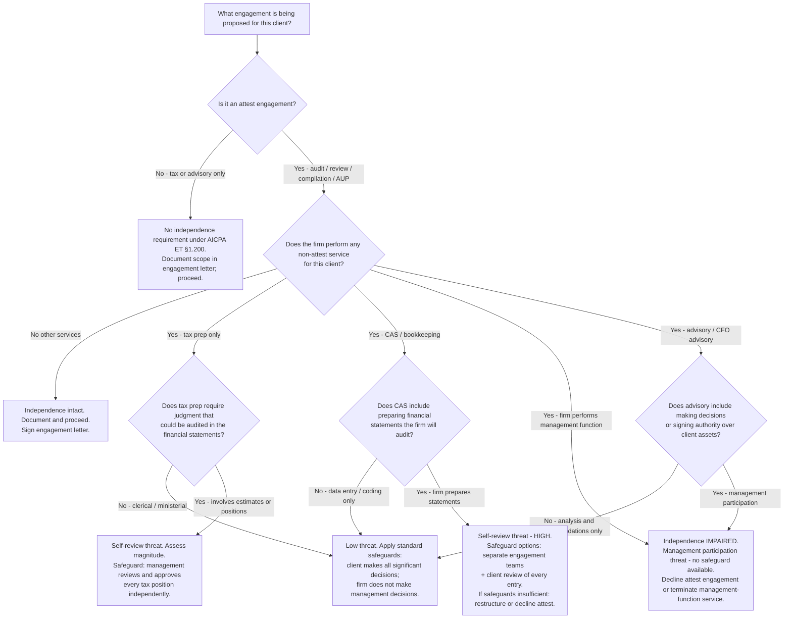
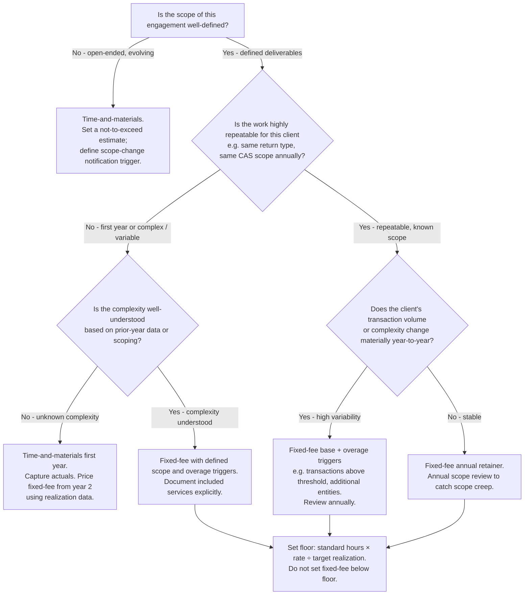
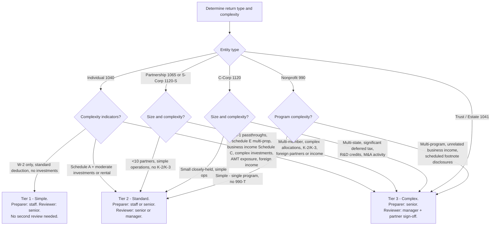

# CPA Firm — Decision Trees + 2026 Capability Map

> Canonical knowledge bank for `accounting-firm-cpa`. **Traverse the relevant Mermaid tree
> top-to-bottom before choosing** — the proactive complement to the Capability Grounding Protocol.
> Volatile product/pricing/regulatory facts carry a retrieval date and a `[verify-at-use]` rider.

---

## Decision Tree 1: Engagement type and independence check

**Leaf rule:** a management-participation threat (the firm makes business decisions, signs checks,
controls assets, supervises client employees) has NO available safeguard — decline the attest
engagement or restructure the non-attest service before issuing any attest report. For
self-review threats, safeguards must ensure the client independently understands and approves
every entry/position; if management lacks the competence to review meaningfully, the safeguard
fails.

---

## Decision Tree 2: Fixed-fee vs. hourly pricing

**Leaf rule:** fixed-fee engagements must be grounded in a hours-estimate × standard-rate ÷
target-realization floor. A fixed fee set without this floor is a guess that becomes a write-down.
Overage triggers protect margin on variable-complexity clients. Capture actuals in the first year
if the scope is genuinely unknown — do not guess a flat fee and absorb the difference.

---

## Decision Tree 3: Tax return review-tier routing

**Leaf rule:** complexity tier is assigned at intake, not after preparation. Discovering K-2/K-3
requirements or complex Schedule E items at first-review stage means the return was mis-tiered
and the review queue was mis-planned. The cost is a staff-level preparer doing work that needs
senior judgment. Sort at intake; route correctly; protect the senior/manager review constraint.

---

## 2026 Capability Map: Tax, Workflow, and CAS Software

> All product names, pricing tiers, and feature descriptions are based on publicly available
> information as of 2026-06-08 `[verify-at-use]`. The CPA software market evolves; confirm
> current pricing, feature sets, and integration availability before recommending to a client.

### Tax software

| Product | Vendor | Typical firm size | Notes |
|---|---|---|---|
| UltraTax CS | Thomson Reuters | Small to large | Deep integration with CS suite (Workpapers CS, Practice CS); strong individual and business return support; annual subscription `[verify-at-use]` |
| Lacerte | Intuit | Small to mid-size | Widely used for individual returns; strong 1040 workflow; Intuit Link for client document collection `[verify-at-use]` |
| CCH Axcess Tax | Wolters Kluwer | Mid-size to large | Cloud-native; integrates with CCH Axcess Workflow and Document; strong for larger practices with complex business returns `[verify-at-use]` |
| Drake Tax | Drake Software | Small firms, value-focused | Lower price point; full-featured; widely used by solo and small-firm practitioners `[verify-at-use]` |
| ProSeries | Intuit | Small firms | Desktop-based; accessible for smaller practices; integrates with QuickBooks `[verify-at-use]` |

### Workflow management

| Product | Vendor | Notes |
|---|---|---|
| Karbon | Karbon | Cloud-based practice management; work items, client tasks, email integration; widely used in CAS and tax firms `[verify-at-use]` |
| Canopy | Canopy | Combines practice management, document management, client portal, and billing; growing adoption in small to mid-size firms `[verify-at-use]` |
| CCH Axcess Workflow | Wolters Kluwer | Native integration with CCH Axcess Tax; best for firms already in the CCH ecosystem `[verify-at-use]` |
| Thomson Reuters Practice CS | Thomson Reuters | Native integration with UltraTax and CS suite `[verify-at-use]` |

### CAS tech stack

| Function | Products | Notes |
|---|---|---|
| General ledger (small business) | QuickBooks Online (QBO), Xero | QBO dominant for SMB; Xero strong in service industries and internationally `[verify-at-use]` |
| General ledger (mid-market) | Sage Intacct | Multi-entity, fund accounting, dimensional reporting; standard for complex SMB and non-profits `[verify-at-use]` |
| AP automation | Bill.com (BILL), AvidXchange | Bill.com dominant in SMB; AvidXchange for higher volume / multi-location `[verify-at-use]` |
| Expense management | Ramp, Expensify, Brex | Ramp growing rapidly; Expensify entrenched for reimbursement-heavy; Brex for VC-backed companies `[verify-at-use]` |
| Payroll | Gusto, ADP Run, Paychex Flex | Gusto preferred for SMB CAS clients; ADP/Paychex for larger or more complex payroll needs `[verify-at-use]` |
| Reporting / FP&A | Fathom, LivePlan, Jirav | For controller-tier CAS clients needing management reporting above QBO standard reports `[verify-at-use]` |
| Client portal / document exchange | Canopy, SmartVault, ShareFile | Depends on firm's practice management ecosystem `[verify-at-use]` |

---

_Last reviewed: 2026-06-08 by `claude`._
