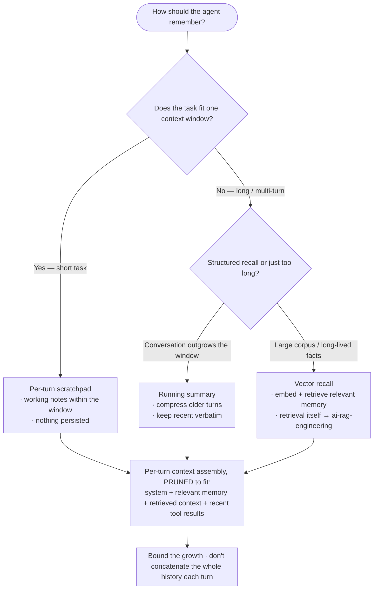
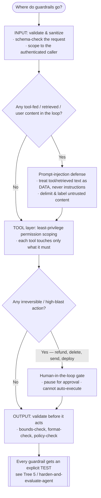

# Knowledge — Ai-agent-engineering decision trees

> **Last reviewed:** 2026-07-17 · **Confidence:** Medium-High (consensus on the topology-choice, tool-vs-code-boundary, memory-strategy, guardrail-placement, and eval-tier framings, and on the "simplest topology that works" ordering; **specific framework APIs, model names/prices, context windows, and tool-calling/MCP API shapes are volatile — re-verify before pinning in a design or a bill**).
> The most-asked agent-engineering questions are "single agent or multi-agent?", "which orchestration pattern?", "what's a tool vs code?", "how does it remember?", "where do the guardrails go?", and "how do we know it works?". These are the decision trees the `agentic-systems-architect` traverses **before** naming a topology, framework, or tool boundary, plus the trade-off tables and the seams to adjacent plugins.

The team's discipline: **the simplest topology that works, determinism where you can, every tool call can fail, guardrails and tracing are architecture, and no system without an eval harness.** This is engineering, not model-vendor gospel — volatile model/framework/pricing specifics carry a retrieval date and are verified at use. Retrieval/RAG questions leave this layer for `ai-rag-engineering`; the prompt *text* is `prompt-engineering`; the eval *science* is `llm-evaluation-engineering`. This team owns the **running agent system**.

---

## Decision Tree 1: choosing the agent topology

Default to the **simplest topology that works**; earn each step up the ladder.

```mermaid
graph TD
  Start([What shape should the agent be?]) --> DET{Are the steps known & deterministic?}
  DET -->|Yes — fixed sequence| WF[Workflow / graph<br/>· fixed edges, code owns routing<br/>· LLM fills nodes only<br/>· cheapest, fastest, most testable]
  DET -->|No — open-ended| ACTORS{One actor, or genuinely separable roles?}
  ACTORS -->|One actor, tool-using| PLAN{Needs an explicit multi-step plan?}
  ACTORS -->|Separable roles / real parallelism / context won't fit one| MULTI{Can a SINGLE agent provably NOT do it?}
  PLAN -->|No — react to each step| REACT[Single agent — ReAct loop<br/>· reason → act (tool) → observe → repeat<br/>· the default for agentic tasks]
  PLAN -->|Yes — plan then execute| PE[Planner / executor<br/>· planner decomposes, executor runs<br/>· re-plan on failure]
  MULTI -->|No — single agent can| REACT
  MULTI -->|Yes — proven| MA[Multi-agent<br/>· separable roles, parallel work<br/>· PAY: tokens, latency, coordination-failure surface<br/>· orchestrator delegates; sub-agents don't sub-delegate]
  WF --> BUDGET
  REACT --> BUDGET
  PE --> BUDGET
  MA --> BUDGET
  BUDGET[[Set the cost/latency budget:<br/>tokens/call · calls/task · p50/p95 · model tier]]
```

> **The classic failure:** reaching for **multi-agent** because it's exciting, when a single ReAct agent — or a plain deterministic workflow — would be cheaper, faster, and testable. Every step up the ladder is a cost paid in tokens, latency, and coordination-failure surface. Earn it.

---

## Decision Tree 2: tool boundary — what's a tool vs deterministic code

The tool boundary is the **API contract**; keep the LLM out of what code does exactly.

```mermaid
graph TD
  Start([A step the agent needs to do]) --> EXACT{Is the step exact & rule-based?}
  EXACT -->|Yes — parse, route on a known enum, arithmetic, validate| CODE[Deterministic CODE — not a tool<br/>· exact, free, testable<br/>· no tokens, no non-determinism]
  EXACT -->|No — needs the world / a side effect| TOOL{Make it a tool}
  TOOL --> NARROW[Narrow, typed, single-responsibility<br/>· explicit schema · precise description<br/>· validated inputs AND outputs]
  NARROW --> SIDE{Does it have a side effect?}
  SIDE -->|Yes — writes / charges / sends| IDEM[Require an IDEMPOTENCY key<br/>+ timeout + retry (backoff/jitter)<br/>+ permission scoping + maybe human-in-the-loop]
  SIDE -->|No — read-only| READ[Timeout + retry on transient<br/>· still validate outputs]
  IDEM --> COUNT
  READ --> COUNT
  COUNT{Tool count small enough to select reliably?} -->|No — sprawl / kitchen-sink| MERGE[Consolidate or split by responsibility<br/>· NOT a 'do_stuff' endpoint<br/>· tool sprawl degrades selection]
  COUNT -->|Yes| OK[Ship the tool catalog]
```

---

## Decision Tree 3: memory / context strategy

Context is a **budget, not a bucket** — choose the strategy to the task.



---

## Decision Tree 4: guardrail placement (design it in, up front)

Guardrails are **architecture** — placed into the topology, not bolted on.



---

## Decision Tree 5: eval tier — how hard to test

An agent without an eval harness is a **demo, not a system**; scale the tier to the blast radius.

```mermaid
graph TD
  Start([How rigorously must we eval?]) --> CHECK{Is the output programmatically checkable?}
  CHECK -->|Yes — exact answer, tool call, valid JSON| EXACT[Exact / programmatic checks<br/>· cheap, deterministic, no judge]
  CHECK -->|No — open-ended| JUDGE[LLM-as-judge with a rubric<br/>· CALIBRATE vs human labels first<br/>· pairwise/rubric over raw 1-10]
  EXACT --> GATE
  JUDGE --> GATE
  GATE[CI regression gate:<br/>quality ≥ baseline · tokens/task ≤ ceiling · p95 ≤ SLO] --> BLAST{High blast radius / irreversible actions?}
  BLAST -->|Yes| HARD[+ Guardrail tests (injection, scoping, HITL, refusal)<br/>+ red-team pass + online monitoring w/ drift alerts]
  BLAST -->|No| LIGHT[+ Guardrail tests for the guardrails present<br/>+ basic online monitoring]
  HARD --> LOOP
  LIGHT --> LOOP
  LOOP[[Feed prod failures back into the offline eval set — the harness grows]]
```

---

## Trade-off table — orchestration topologies

| Topology | Sweet spot | Watch out for |
|---|---|---|
| **Workflow / graph** | Known, deterministic steps; you want testable, cheap, fast | Rigid — a genuinely open-ended step doesn't fit a fixed edge |
| **Single agent (ReAct)** | Open-ended, one actor, a handful of tools — the default | Can wander/loop without a loop-cap; context grows if unpruned |
| **Planner / executor** | Many steps needing an explicit plan; re-planning on failure | Planner errors cascade; more calls = more cost/latency |
| **Multi-agent** | Genuinely separable roles, real parallelism, context that won't fit one | Coordination-failure surface, token/latency multiplier — earn it, don't default to it |

## Trade-off table — framework / runtime

| Runtime | Sweet spot | Watch out for |
|---|---|---|
| **Roll-your-own loop** | Simple ReAct you want full control + minimal deps over | You re-build state, checkpoints, tracing, human-in-the-loop yourself |
| **Graph runtime (e.g. LangGraph)** | Explicit state, branching, checkpoints, human-in-the-loop pauses | A framework to learn; its abstractions may not fit an odd control-flow |
| **Agent SDK** | Its batteries (tool-calling, memory, tracing) match your needs | You inherit its opinions; provider lock-in risk — stay neutral where you can |

## Trade-off table — memory strategy

| Strategy | Sweet spot | Watch out for |
|---|---|---|
| **Scratchpad** | Short tasks that fit one window | Nothing persists; not for long/multi-session |
| **Running summary** | Long conversations that outgrow the window | Summary lossiness — the compression can drop what mattered |
| **Vector recall** | Large corpora / long-lived memory | Retrieval quality is now a dependency (→ `ai-rag-engineering`); recall ≠ relevance |

---

## Seams (this team owns the running agent system, not the whole AI stack)

- **Retrieval / RAG** (chunking, embeddings, the index, re-ranking, retrieval eval) → `ai-rag-engineering` (the agent *calls* retrieval as a tool; it doesn't build the index).
- **The prompt & context *text* craft** (system prompt, few-shot design, output-format prompting) → `prompt-engineering` (this team *assembles* prompts; it doesn't own the wording).
- **Eval *methodology / science*** (metric design, judge-calibration science, benchmark construction) → `llm-evaluation-engineering` (this team *builds the harness* that applies it).
- **Deploy / scale / on-call of the running service** (SLOs, alerting, incident response) → `observability-sre` (this team instruments the agent; SRE runs the platform).
- **The surrounding service** (APIs, queues, datastores, auth the agent runs inside) → `backend-engineering`.
- **Verifying volatile model/framework/pricing specifics** → `ravenclaude-core/deep-researcher`.

---

## Provenance

- Durable framings (the simplest-topology-that-works ordering, single-agent/ReAct → planner-executor → multi-agent → workflow/graph, tool-vs-code boundary and tool-as-API-contract, every-tool-call-can-fail with retries/timeouts/idempotency, context-is-a-budget memory strategies, guardrails-and-tracing-as-architecture, the eval-tier ladder, and the topology/runtime/memory trade-offs) are consensus agentic-engineering practice reviewed 2026-07-17 — **High confidence**.
- Framework APIs (e.g. LangGraph), agent SDKs, model names/prices, context windows, and tool-calling/MCP API shapes are **volatile**, carry retrieval dates, and are re-verified with `ravenclaude-core/deep-researcher` before pinning a model, a price, or an API in a design or a bill estimate. _(Reviewed 2026-07-17.)_
