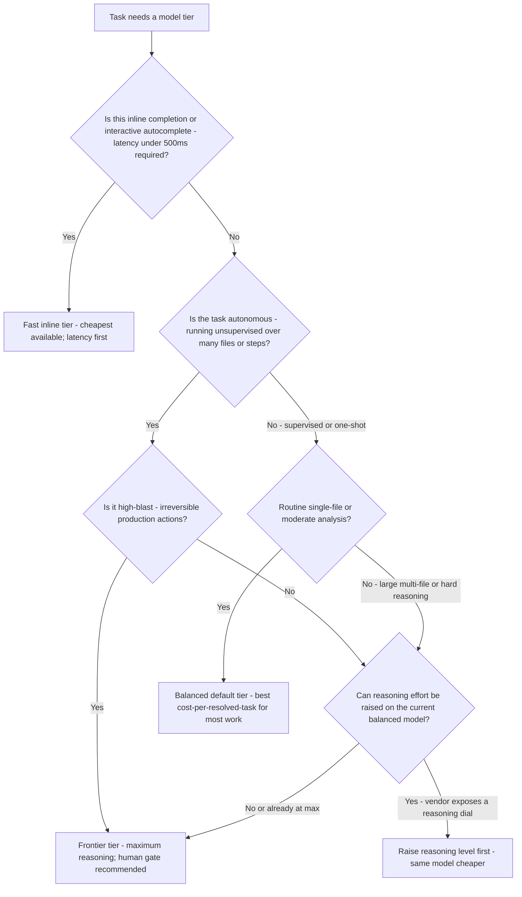
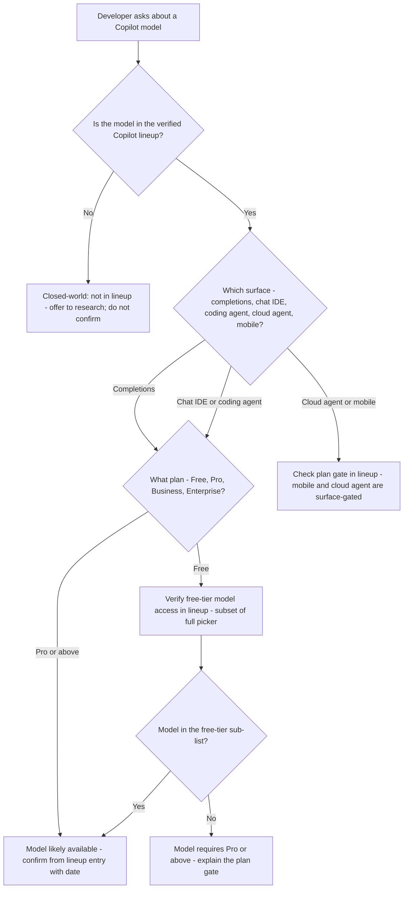
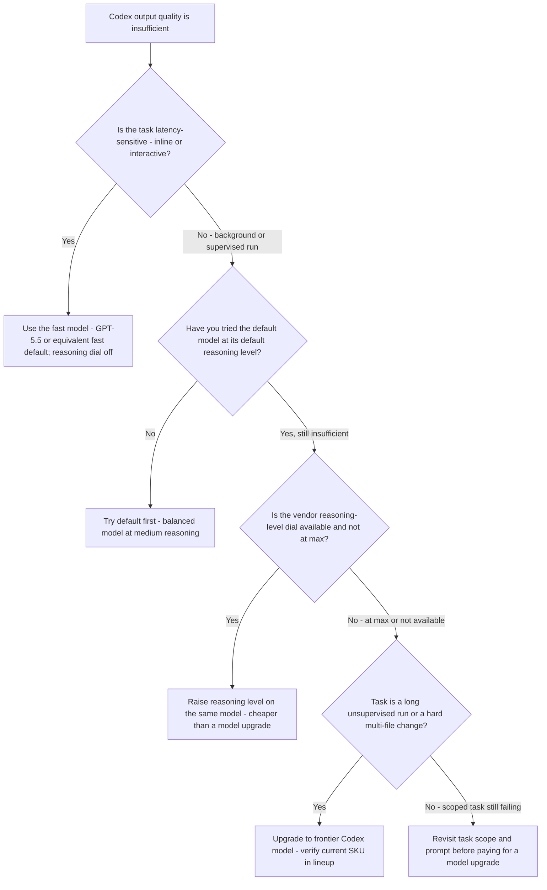
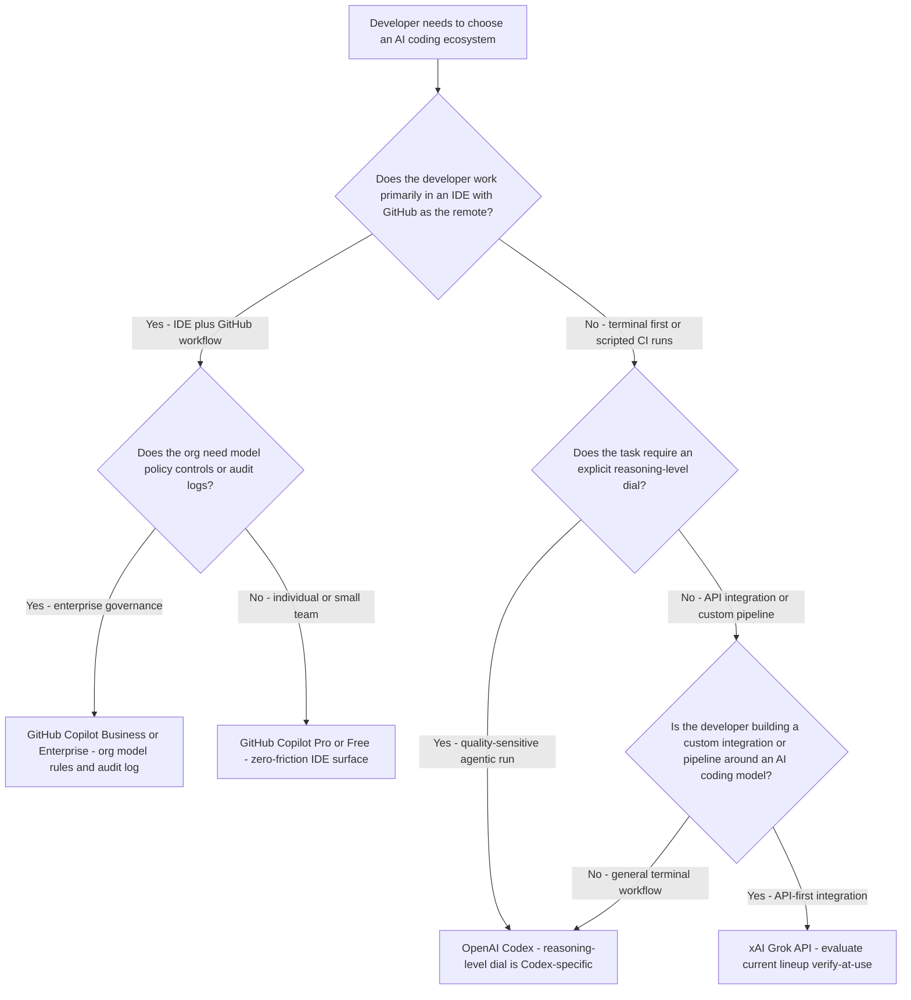
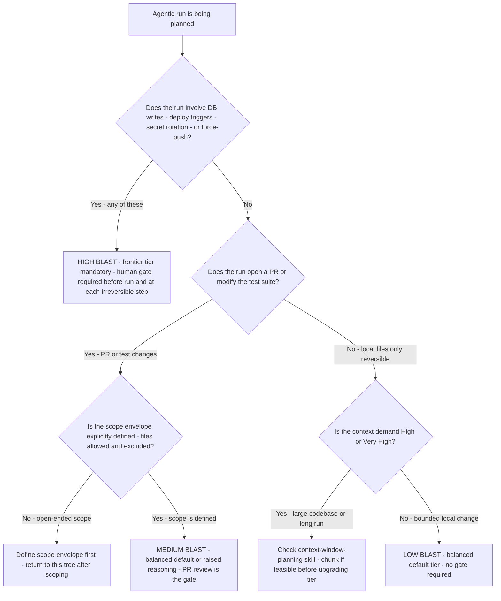
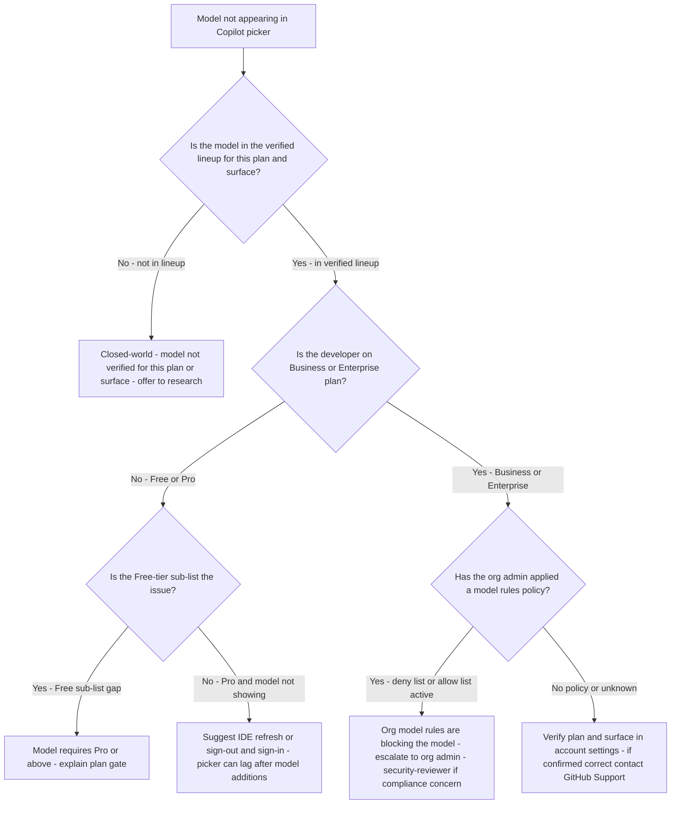

# AI Coding Model Guidance — Decision Trees

Vendor-neutral model-selection decision trees for the `ai-coding-model-guidance` plugin. Traverse the relevant tree **top-to-bottom before naming a model SKU** — do not keyword-match the developer's task description. Last reviewed: 2026-06-05.

All availability and pricing facts carry `[verify-at-use — YYYY-MM]` markers. The specific model names in the leaves are mapped from the dated lineup in [`cross-tool-model-lineup-2026.md`](cross-tool-model-lineup-2026.md) — re-verify before quoting a client.

---

## Decision Tree: Vendor-neutral task-shape to model-tier

**When this applies:** A developer needs a model recommendation for any AI coding tool (Copilot, Codex, or Grok) and has not yet specified a tier. Observable triggers: "which model should I use?"; "is the default model good enough?"; "I need something better for this task."

**Last verified:** 2026-06-05 against `cross-tool-model-lineup-2026.md` (vendor-neutral methodology; map leaves to vendor SKUs after traversal).

**Rationale per leaf:**
- *Fast inline tier* — latency is the binding constraint; quality gap vs balanced is small for single-line completions; always the cheapest choice.
- *Balanced default* — the majority of coding tasks; moderate reasoning, good quality, significantly lower cost than frontier (verify-at-use).
- *Raise reasoning level* — when the vendor exposes a thinking-effort dial (e.g. Codex reasoning flag): upgrade effort before upgrading model; often closes the gap at lower cost.
- *Frontier tier* — autonomous multi-file tasks, hard reasoning tail, or high-blast irreversible actions where the cost of a wrong output exceeds the model premium.

**Tradeoffs summary:**

| Tier | Latency | Cost relative to balanced | Autonomy fit | Use when |
|---|---|---|---|---|
| Fast inline | Lowest | Lowest | None | Autocomplete, one-liner fix |
| Balanced default | Medium | 1x baseline | Supervised | Most daily coding tasks |
| Raised reasoning / same model | Medium-high | Moderate increase | Supervised | Quality gap, reasoning-dial available |
| Frontier | Higher | Significant premium (verify-at-use) | Autonomous | Hard tail; unsupervised; high-blast |

---

## Decision Tree: Copilot model picker — which surface and plan gate applies?

**When this applies:** A developer is using GitHub Copilot and asks about model availability, the picker, or why a model is not showing up. Observable triggers: "I don't see Model X in Copilot"; "which models are available for Copilot chat?"; "can I use the coding agent with this model?"

**Last verified:** 2026-06-05 against `cross-tool-model-lineup-2026.md` Copilot section `[verify-at-use]`.

**Rationale per leaf:**
- *Not in lineup* — closed-world rule applies; absence from the verified lineup means do not confirm availability.
- *Free-tier sub-list* — GitHub Copilot Free exposes a subset of models; a model in the full picker may not be in the free sub-list.
- *Plan gate* — Business/Enterprise unlock additional models and org policy controls; Pro unlocks beyond Free.
- *Surface-gated* — cloud agent and mobile have separate availability gates that may differ from the IDE chat picker; check explicitly.

**Tradeoffs summary:**

| Surface | Plan dependency | Key gate | Verify-at-use source |
|---|---|---|---|
| Completions | Plan-gated | Free/Pro/Business model sub-list | Copilot model availability docs |
| Chat IDE | Plan-gated | Same as completions | Copilot model availability docs |
| Coding agent | Plan-gated | Enterprise/Business feature | Copilot docs - agent surface |
| Cloud agent | Surface + plan | Separate availability list | Copilot docs - cloud agent |
| Mobile | Surface + plan | Mobile-specific sub-list | Copilot mobile docs |

---

## Decision Tree: Codex — default model, reasoning dial, or model upgrade?

**When this applies:** A developer using OpenAI Codex CLI or cloud is getting insufficient quality and needs to decide between accepting the default, raising the reasoning level, or upgrading to a bigger model. Observable triggers: "the default Codex model isn't getting this right"; "should I use a higher reasoning setting?"; "do I need the frontier Codex model?"

**Last verified:** 2026-06-05 against `cross-tool-model-lineup-2026.md` Codex section `[verify-at-use]`.

**Rationale per leaf:**
- *Fast model* — latency-critical inline tasks; reasoning-dial impact on latency rules out higher-effort levels.
- *Try default first* — the default model resolves a large fraction of everyday coding tasks; don't skip it.
- *Raise reasoning level* — same model, more thinking effort; almost always worth trying before a model upgrade; verify the cost delta (verify-at-use).
- *Frontier Codex model* — long unsupervised agentic runs or demonstrably hard tasks that still fail at max reasoning on the balanced model.
- *Revisit scope* — if a scoped, bounded task still fails at high reasoning, the problem is often prompt clarity or task decomposition, not model tier.

**Tradeoffs summary:**

| Option | Cost delta | Latency delta | When to try | Skip if |
|---|---|---|---|---|
| Default model / medium reasoning | 1x baseline | Lowest | Always first | Task is demonstrably hard tail |
| Raise reasoning level | Moderate increase (verify-at-use) | Moderate increase | Quality gap on same model | Latency is the binding constraint |
| Frontier model upgrade | Large increase (verify-at-use) | Higher | Hard tail; agentic runs | Task is scoped / prompt needs work |

---

## Decision Tree: Cross-ecosystem selection — Copilot vs Codex vs Grok

**When this applies:** A developer has not committed to one AI coding ecosystem and needs help choosing between GitHub Copilot, OpenAI Codex, and xAI Grok for a specific task. Observable triggers: "which tool should I use?"; "is Copilot or Codex better for this?"; "I'm evaluating Grok for our team."

**Last verified:** 2026-06-05 against `cross-tool-model-lineup-2026.md` (vendor-neutral methodology; surface coupling and availability facts carry `[verify-at-use]` markers).

**Rationale per leaf:**
- *Copilot Enterprise/Business* — org-level model rules, audit logs, and GHEC integration are exclusive to these tiers; they are the right choice when governance is a requirement.
- *Copilot Pro/Free* — the lowest-friction path for IDE-centric developers; zero configuration for VS Code + GitHub workflows.
- *Codex with reasoning dial* — the explicit reasoning-level flag is Codex-specific; when task quality is the binding constraint and latency is not, Codex's reasoning dial is a meaningful differentiator.
- *Grok API* — for developers building custom integrations, Grok's API is worth evaluating; verify the current lineup and surface availability before committing `[verify-at-use]`.

**Tradeoffs summary:**

| Option | Surface fit | Reasoning dial | Org governance | Use when |
|---|---|---|---|---|
| Copilot Enterprise/Business | IDE + GitHub | No | Yes | Enterprise with policy requirements |
| Copilot Pro/Free | IDE + GitHub | No | No | Individual; IDE-centric workflow |
| Codex | Terminal + API | Yes | Org settings | Quality-critical; agentic; CI scripting |
| Grok API | API | No | API key only | Custom integrations; API-first pipeline |

---

## Decision Tree: Agentic run blast-radius — model tier and gate requirement

**When this applies:** An autonomous AI coding agent run is being planned and the developer needs to determine the appropriate model tier and human-gate requirement based on the task's blast radius. Observable triggers: "I want to run Copilot agent on this"; "should I use the frontier model for this agentic task?"; "do I need approval before this runs?"

**Last verified:** 2026-06-05 against `cross-tool-model-lineup-2026.md` and the coding-agent-task-scoping skill.

**Rationale per leaf:**
- *High Blast* — irreversible production actions require the model with the highest reasoning quality and a human gate; cost is secondary to the risk of a wrong action.
- *Define scope first* — a medium-blast run without a defined scope envelope is a high-blast run in disguise; scoping must precede model selection.
- *Medium Blast* — PR-opened runs are recoverable (close the PR); the balanced default tier is sufficient for most; raise reasoning if the scope is complex.
- *Check context demand* — a large-codebase run may need chunking before model-tier selection; chunking is cheaper than frontier and produces more debuggable output.
- *Low Blast* — bounded, local, reversible runs: the balanced default tier is the right choice; no gate required.

**Tradeoffs summary:**

| Blast class | Model tier | Gate required | Scope requirement | Use when |
|---|---|---|---|---|
| High | Frontier | Yes — human before and during | Mandatory | DB writes, deploys, secrets, force-push |
| Medium | Balanced or raised reasoning | PR review | Required | PR opened, test suite modified |
| Low | Balanced default | None | Recommended | Local files only, reversible |

---

## Decision Tree: Org model policy conflict — Copilot model blocked or unavailable

**When this applies:** A developer reports that a recommended Copilot model is not available in their picker, even though it appears in the verified lineup for their surface and plan. Observable triggers: "I'm on Enterprise but model X isn't in my picker"; "my org IT blocked this model"; "I can see the model on the docs but not in VS Code."

**Last verified:** 2026-06-05 against `cross-tool-model-lineup-2026.md` Copilot org policy section `[verify-at-use]`.

**Rationale per leaf:**
- *Closed-world* — if the model is not in the verified lineup for this surface and plan, the absence may be intentional; do not confirm availability.
- *Free-tier sub-list* — the Free picker is narrower than the Pro picker; this is the most common source of "I can't find the model" on Free plans.
- *Cache/refresh* — picker contents are fetched from GitHub servers; a model recently added may require a sign-out and sign-in to appear.
- *Org model rules* — Business and Enterprise org admins can apply allow-lists or deny-lists; escalate to the org admin with specifics, and escalate to security-reviewer if the block appears compliance-related.
- *Support* — if plan and surface are confirmed correct and no policy blocks are found, the issue is a GitHub Support case; document the exact model id and surface for the report.

**Tradeoffs summary:**

| Root cause | Fix effort | Who resolves | Escalation needed? |
|---|---|---|---|
| Not in lineup | Research | Agent + researcher | Optional |
| Free-tier gate | Minutes — plan explanation | Agent | No |
| Pro picker cache lag | Minutes — IDE refresh | Developer | No |
| Org model rules deny | Hours — admin policy change | Org admin | Yes if compliance |
| Unknown — support case | Days | GitHub Support | No |
