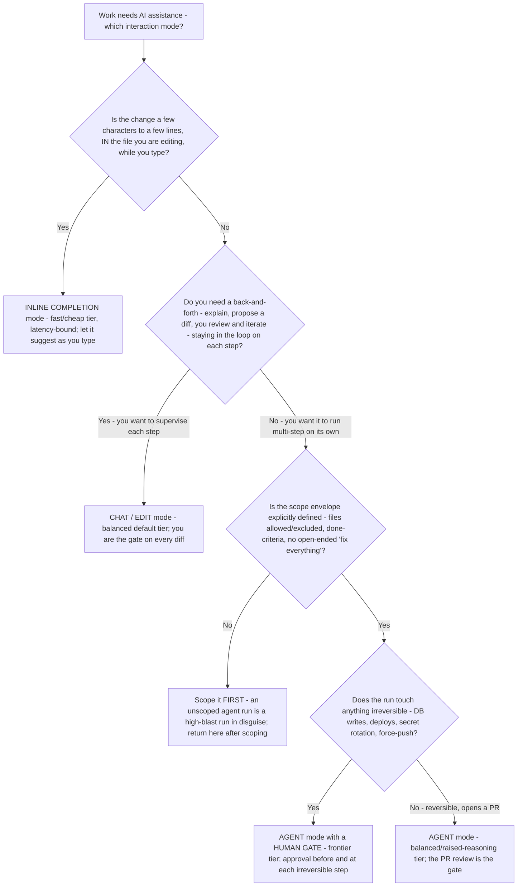

<!-- lineup-citations: enforce — any price/context-window row below must carry a citation link, a date, or a verify-at-use marker (scripts/check-lineup-citations.py) -->

# AI coding interaction-mode selection — completion vs chat vs agent

**Last reviewed:** 2026-06-05 · **Confidence:** medium — vendor-neutral methodology; per-vendor surface availability and any numbers are volatile and carry `[verify-at-use]` markers. Re-verify surfaces/SKUs against [`cross-tool-model-lineup-2026.md`](cross-tool-model-lineup-2026.md) before quoting.

> Complements the trees in [`ai-coding-decision-trees.md`](ai-coding-decision-trees.md) (PR #315), which map task → **tier** and Copilot → **surface availability**. This tree comes one step earlier: **before** picking a model, pick the **interaction mode** — inline completion, interactive chat/edit, or an autonomous agent run — because the mode bounds which tier even makes sense and what gate the work needs. Choosing the mode wrong is a more common and more expensive error than choosing the model wrong (e.g. firing an autonomous agent at a job that wanted a two-line completion, or hand-completing a job that wanted an agent).

---

## When this applies

Someone is reaching for an AI coding tool but has not decided **how** to engage it. Observable triggers: "should I just let the agent do this?"; "should I use chat or just autocomplete?"; "can Copilot's coding agent take this whole issue?" The mode question precedes — and constrains — the model question.

## The tree

## How the mode bounds the model

- **Inline completion** ⇒ **fast/cheap tier only.** Latency is the binding constraint; a heavy model here is wasted reasoning, added lag, and added cost (see [`ai-coding-right-size-cost-decision-tree.md`](ai-coding-right-size-cost-decision-tree.md)).
- **Chat / edit** ⇒ **balanced default**, escalate per task. You are supervising each diff, so the gate is built in; reserve a tier bump for a demonstrably hard sub-task.
- **Agent (autonomous)** ⇒ tier follows **blast radius**, and scope must be defined first. Reversible/PR-opening runs → balanced or raised reasoning; irreversible runs → frontier **plus a human gate** (cross-reference the blast-radius tree in [`ai-coding-decision-trees.md`](ai-coding-decision-trees.md)).

## Per-vendor surface mapping (verify availability + plan gate at use)

| Mode | Copilot surface | Codex surface | Grok surface | Verify at use |
|---|---|---|---|---|
| Inline completion | Completions (IDE) | Inline / fast model | Fast variant via API/IDE | Surface + plan gate `[verify-at-use]` |
| Chat / edit | Copilot Chat / edit | Codex CLI interactive | Grok chat / API | Per-surface model list `[verify-at-use]` |
| Agent (autonomous) | Coding agent / cloud agent | Codex CLI/cloud agent run | Agent loop via API | Plan/surface gate + blast class `[verify-at-use]` |

> Surface availability, plan gates, and the model each surface exposes churn weekly-to-monthly — re-verify against the cited sources and [`cross-tool-model-lineup-2026.md`](cross-tool-model-lineup-2026.md) before quoting. Sources: [GitHub Copilot supported models](https://docs.github.com/en/copilot/reference/ai-models/supported-models) · [OpenAI Codex models](https://developers.openai.com/codex/models) · [xAI models](https://docs.x.ai/developers/models) (retrieved 2026-06-05 `[verify-at-use]`).

## Rationale per leaf

- **Inline completion** — the cheapest, lowest-latency engagement; right when the edit is small and you are already in the file. Wrong when the change spans files or needs reasoning you would have to review.
- **Chat / edit** — the default for non-trivial but supervised work; you stay the gate, so you catch a wrong diff before it lands. Wrong when the task is large, repetitive, and well-specified enough to delegate.
- **Scope first** — the most common agent failure is launching one without an envelope; an unscoped "fix everything" run is high-blast regardless of the underlying change. Always scope before the run.
- **Agent (gated vs. ungated)** — autonomous runs are right for well-scoped, multi-step, delegable work; the **gate requirement is set by reversibility**, not by how big the diff looks. Irreversible ⇒ human gate, frontier tier, no exceptions (CLAUDE.md high-blast rule).
