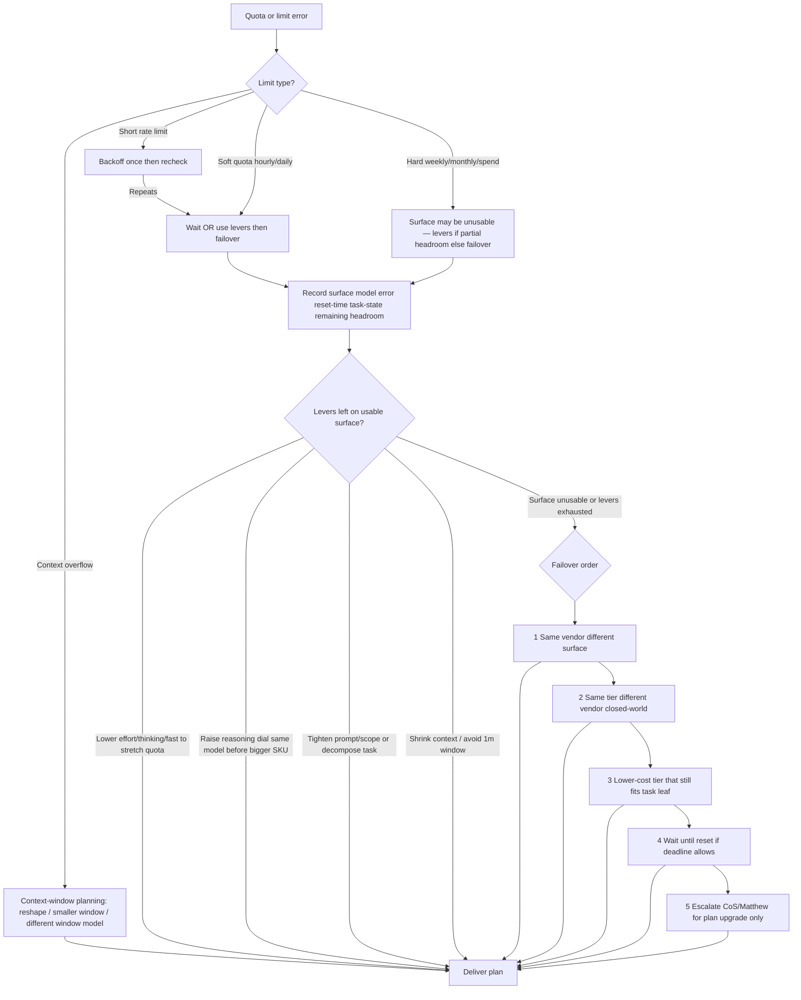

# Decision Tree: Quota / token exhaustion failover

**When this applies:** A coding agent or surface returns quota, rate-limit, weekly/monthly cap, spend-limit, or tokens-exhausted (Claude Code weekly limit, Codex/ChatGPT caps, Cursor cloud-agent spend limit, Copilot premium-request exhaustion).

**Last verified:** 2026-09-04 (methodology; vendor reset times and prices are `[verify-at-use]`).

**Hard gate:** do not silent-fail; do not blindly retry the exhausted surface. Try **param/effort and scope levers** before switching vendor; then failover; then wait/escalate. Still map any substitute SKU through the vendor-neutral tier tree + closed-world lineup.

## Lever catalog (try before vendor hop when surface still usable)

| Lever | When | Examples `[verify-at-use]` |
|---|---|---|
| Lower effort / fast / thinking off | Soft quota left; quality bar still met | cloud-agent `effort=low`, `fast=true`, `thinking=false` |
| Raise reasoning dial same model | Quality insufficient; not hard-capped | Codex reasoning; `effort=high` before jumping Opus |
| Tighten prompt / scope | Token burn from sprawling asks | Narrow success criteria; fewer files |
| Decompose | One big agentic run burning quota | Several bounded jobs; cheap tier for triage |
| Shrink context / window param | Context overflow or expensive 1m window | Prefer 300k/272k; summarize; drop history |
| Same vendor, other surface | Hard cap on one meter only | Claude Code weekly → Cursor cloud Claude |
| Same tier, other vendor | Cap is hard; task still needed | Claude ↔ Codex ↔ Grok (closed-world) |
| Lower tier that fits leaf | Prestige SKU unaffordable under cap | Haiku/mini/flash when tree allows |
| Wait for reset | Soft deadline; alternates miss quality bar | Record reset time (e.g. Claude weekly) |
| Escalate plan upgrade | Alternates fail + hard deadline | CoS → Matthew only |

**Deep layer:** for lever encyclopedia, interaction matrix, missing-lever failover, and worked examples, use [`coding-agent-levers-playbook.md`](coding-agent-levers-playbook.md) (do not duplicate here; tree stays the hard gate).

**Anti-patterns:** identical retries on exhausted surface; jumping SKU before effort/scope levers; hiding the limit; inventing models not in lineup / live catalog; using 1m context "just in case" while under quota pressure.
