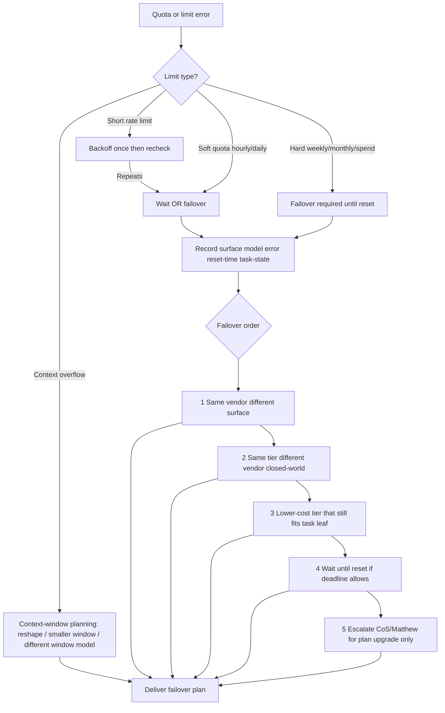

# Decision Tree: Quota / token exhaustion failover

**When this applies:** A coding agent or surface returns quota, rate-limit, weekly/monthly cap, spend-limit, or tokens-exhausted (Claude Code weekly limit, Codex/ChatGPT caps, Cursor cloud-agent spend limit, Copilot premium-request exhaustion).

**Last verified:** 2026-09-04 (methodology; vendor reset times and prices are `[verify-at-use]`).

**Hard gate:** do not silent-fail; do not blindly retry the exhausted surface; traverse before naming a substitute SKU; then map the leaf through the vendor-neutral tier tree + closed-world lineup.

**Rationale:** same-tier alternate vendors usually beat upgrading to a frontier SKU just because one vendor is capped. Surface failover (CLI → cloud agent) often unlocks the same model family under a different meter.

**Tradeoffs:**

| Move | When | Trap avoided |
|---|---|---|
| Same vendor, other surface | CLI weekly-capped but cloud agent available | Abandoning the vendor unnecessarily |
| Same tier, other vendor | Cap is hard and task still needed | Blind prestige upgrade |
| Wait for reset | Soft deadline; quality bar unmet by alternates | Burning money on wrong tier |
| Escalate for plan upgrade | Alternates fail quality bar and deadline is hard | Surprise spend without Matthew |

**Anti-patterns:** identical retries on exhausted surface; hiding the limit; inventing SKUs not in the lineup / live catalog.
