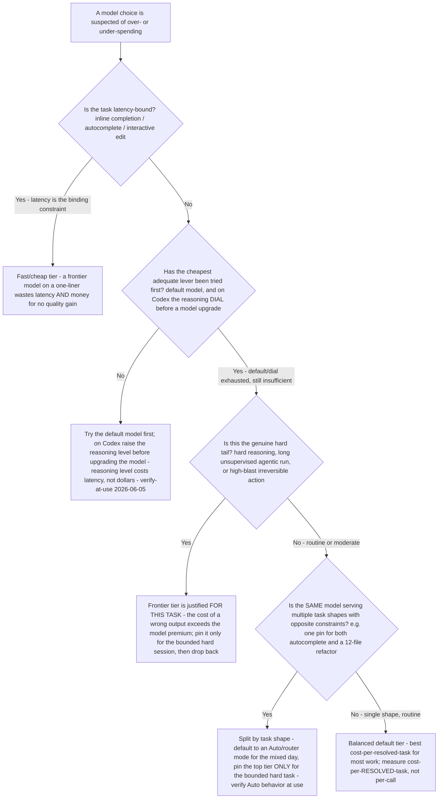

<!-- lineup-citations: enforce — any price/context-window row below must carry a citation link, a date, or a verify-at-use marker (scripts/check-lineup-citations.py) -->

# AI coding model right-sizing — cost-per-resolved-task decision tree

**Last reviewed:** 2026-06-05 · **Confidence:** medium — vendor-neutral methodology; the per-vendor SKU mappings and all numbers are volatile and carry `[verify-at-use]` markers. Re-verify SKUs against [`cross-tool-model-lineup-2026.md`](cross-tool-model-lineup-2026.md) before quoting a client.

> Complements the trees in [`ai-coding-decision-trees.md`](ai-coding-decision-trees.md) (added in PR #315). Those trees answer **"which tier / surface / blast-class fits this task?"** This tree answers the **money** question the agents keep asserting but never operationalized: **"am I about to overpay, and how would I know?"** It makes **cost-per-resolved-task** — not model rank — the deciding metric, and it is the conceptual companion to the runnable helper [`../scripts/right_size_cost.py`](../scripts/right_size_cost.py) (which does the arithmetic with **your** numbers, none baked in).

---

## When this applies

Someone has either (a) pinned the top model "to be safe" and is surprised by the bill or the latency, or (b) is about to upgrade a tier and wants to know if it is worth it. Observable triggers: "I pinned the best model and it's expensive/slow"; "should I upgrade to the frontier model for this?"; "why is my premium-request / token budget burning down so fast?"

## The tree

## The deciding metric — cost-per-resolved-task, not model rank

A frontier model that resolves a task and a balanced model that resolves the **same** task produce the **same outcome** and very different bills. Rank the choice by **(spend on the task) ÷ (tasks actually resolved)**, including retries — not by where the model sits on a leaderboard. A cheaper model that needs one retry can still win; a frontier model that one-shots a genuinely hard task can still be the cheaper *resolved-task* even at a higher per-call price. The runnable helper computes exactly this from numbers **you** supply.

## Rationale per leaf (cheap → expensive)

- **Fast/cheap tier (latency-bound)** — on a single-line completion the quality gap vs. a frontier model is small, and the frontier model adds latency *and* cost for no resolved-task benefit. Latency-bound ⇒ cheapest fast tier, always.
- **Cheap lever first** — the default model resolves a large fraction of everyday work; on Codex specifically, raising the **reasoning dial** trades latency for depth at **no change in per-token model cost** (`[verify-at-use — 2026-06-05]`, [OpenAI Codex models](https://developers.openai.com/codex/models)) — so the dial is strictly cheaper than a model upgrade for a latency-tolerant task.
- **Frontier (hard tail)** — justified when the task is genuinely hard, unsupervised, or high-blast and the cost of a wrong output exceeds the premium — but pin it for the **bounded session**, not as a standing default.
- **Split by task shape** — one pin cannot right-size two task shapes with opposite constraints; default to an **`Auto`/router** mode for the mixed day (verify the current Auto routing + billing at use) and pin the top tier only for the bounded hard task.
- **Balanced default** — the right standing choice for most single-shape routine work; re-evaluate by measuring cost-per-*resolved*-task over a week, not by gut feel.

## Tradeoffs summary (tier-relative — no baked numbers)

| Tier | Latency | Relative cost | Right-sized for | Over-spend signal |
|---|---|---|---|---|
| Fast / cheap inline | Lowest | Lowest | Autocomplete, one-liners | Frontier pinned on completions `[verify-at-use]` |
| Balanced default | Medium | Baseline | Most daily coding | Top tier pinned for routine edits `[verify-at-use]` |
| Raised reasoning (same model) | Higher | Same model cost; latency↑ only (Codex) `[verify-at-use — 2026-06-05]` | Latency-tolerant hard bug | Jumping to a bigger model before trying the dial `[verify-at-use]` |
| Frontier | Highest | Premium `[verify-at-use]` | Hard tail; unsupervised; high-blast | Standing default for everyday work `[verify-at-use]` |

> **Volatility note:** the cost *relationships* above are stable methodology; the absolute prices, the `Auto` routing/billing behavior, and the Codex cost-by-model-not-by-reasoning-level nuance are volatile — re-verify against the cited primary sources and [`cross-tool-model-lineup-2026.md`](cross-tool-model-lineup-2026.md) before quoting. Sources: [OpenAI Codex models](https://developers.openai.com/codex/models) · [GitHub Copilot auto model selection](https://docs.github.com/en/copilot/concepts/auto-model-selection) (retrieved 2026-06-05 `[verify-at-use]`).
