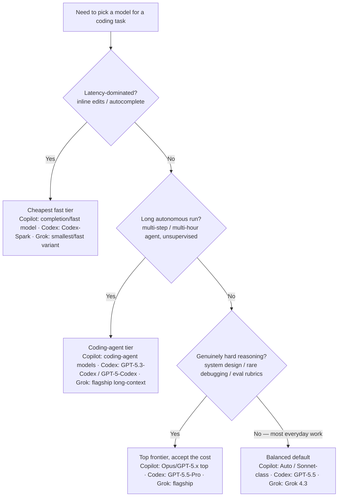
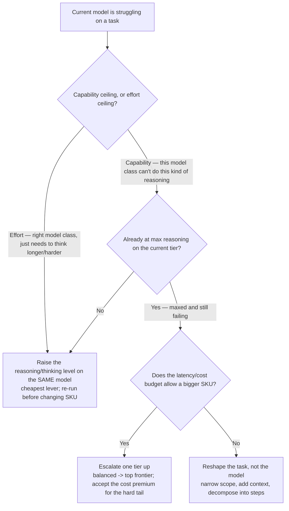

<!-- lineup-citations: enforce — every price/context-window row below must carry a citation link, a date, or a verify-at-use marker (scripts/check-lineup-citations.py) -->

# Cross-tool model selection & 2026 lineup (Copilot · Codex · Grok)

**Last reviewed:** 2026-06-10 · **Confidence:** medium — these three vendors ship **weekly-to-monthly**, faster than the Claude platform; treat this as the freshness anchor the Researcher sweep re-dates. Every numeric / availability claim carries a retrieval date — **verify against the cited primary source before quoting it to anyone.**
**Owner:** all three strategist agents (`copilot-model-strategist`, `codex-model-strategist`, `grok-model-strategist`). This is the **single source of truth** for non-Claude model facts — one file refreshes, not three personas (mirrors `claude-app-engineering/knowledge/model-selection-and-2026-capability-map.md`).
**Staleness tier:** **Tier-4 (Emerging / fast-churn)** — re-verify on the weekly `researcher-reminder.yml` sweep and treat a >30-day-old retrieval date as stale-until-re-checked, not as current.
**Sources (Copilot row re-checked 2026-06-09; Codex/Grok rows retrieved 2026-05-31, via vendor docs + changelogs; the doc pages 403 automated fetch, so values were cross-referenced across vendor blog/changelog + docs):**
[GitHub Copilot supported models](https://docs.github.com/en/copilot/reference/ai-models/supported-models) · [GitHub Changelog](https://github.blog/changelog/) · [Opus 4.8 GA in Copilot (Changelog 2026-05-28)](https://github.blog/changelog/2026-05-28-claude-opus-4-8-is-generally-available-for-github-copilot/) · [OpenAI Codex models](https://developers.openai.com/codex/models) · [OpenAI model release notes](https://help.openai.com/en/articles/9624314-model-release-notes) · [xAI models](https://docs.x.ai/developers/models)

> **Why durable reasoning, not just a lineup.** Model names and prices churn weekly; the *decision framework* below does not. Lead with the framework; use the dated tables as a snapshot to be re-verified, never as a permanent fact.

> ⚠️ **STATUS OVERRIDE — Claude Fable 5 & Mythos 5 globally SUSPENDED (2026-06-12).** A US-government export-control directive resulted in the **global suspension of all Claude Fable 5 / Mythos 5 access**; Anthropic disabled both models for every customer worldwide effective **2026-06-12**, with **no restoration timeline as of 2026-06-16**. This propagates to every surface that resold them: the **"Fable 5 is GA in Copilot" rows and the free-through-2026-06-22 inclusion window below are moot while the model is disabled at the source.** Until access is restored, treat Fable 5 / Mythos 5 as **unavailable** and route to each ecosystem's live default (for Claude work, Opus 4.8). `[verified 2026-06-16 — secondary cross-reference: CNBC, TIME, Anthropic newsroom 2026-06-12; the anthropic.com newsroom + Copilot changelog 403 automated fetch, per this file's existing 403→cross-reference pattern]`

---

## Closed-world rule (anti-hallucination — every agent enforces)

**Only name a model that appears in a verified table below.** If asked about a model not listed (e.g. "what about GPT-5.6?" or "Grok 4.5?"), do **not** infer it exists from a version-number pattern — state it is not in the verified lineup as of the retrieval date and offer to check the live source. Dense, similar SKU names (GPT-5.5 / 5.4 / 5.3-Codex; Grok 4.3 / 4.1 Fast / 4.20) invite extrapolation; resist it. A confidently-named non-existent model is the exact claim-grounding failure this plugin exists to prevent.

---

## Decision Tree: which model / tier — independent of vendor

Traverse this **before** reaching for a specific SKU. It is vendor-neutral; the per-ecosystem tables below only map the leaf to that vendor's current name.

**Right-size, don't default to the top.** Same discipline as `claude-app-engineering` house opinion #3: a cheap/fast model for triage and inline work, escalate-on-difficulty to the balanced default, and reserve the top frontier (and its cost premium) for the genuinely hard tail. The metric is **cost-per-resolved-task**, not raw model rank (see the durable-reasoning rule below).

---

## Decision Tree: Reasoning level vs a bigger model (the cheaper lever first)

The "which model/tier" tree above picks a starting tier. This tree handles the **next** moment — the current model is struggling — and codifies house opinion #6: **raise the reasoning/thinking effort on the same model before jumping to a bigger, pricier SKU.** Vendor-neutral; the dial's name differs (Codex `/model` reasoning level, a thinking/effort budget elsewhere), the logic doesn't. Traverse it before escalating cost.

**Rationale per leaf:**

- _DIAL_ — most "the model got it wrong" cases are an **effort** ceiling, not a **capability** one: the same model at a higher reasoning/thinking level resolves the task at a fraction of the cost of a bigger SKU. This is the cheaper lever and the default first move (Codex makes it explicit — `/model` sets both the model **and** its reasoning level; raise the level before switching).
- _Q2 (max-reasoning gate)_ — only after the current tier is genuinely **maxed on reasoning and still failing** is a bigger model the right escalation; jumping SKUs while reasoning headroom remains spends money the dial would have saved (anti-pattern #6).
- _BIGGER_ — a true capability ceiling on the hard tail justifies the next tier up and its cost premium — that's exactly what the top frontier is reserved for. Map the leaf to the vendor's current top SKU via the tables below.
- _RESHAPE_ — when budget forbids a bigger SKU, the lever is the **task**, not the model: narrow the scope, supply better context/examples, or decompose into steps a balanced model can each handle. Often a better-shaped task on the cheaper model beats a bigger model on a sprawling one.

**Tradeoffs summary:**

| Move | Cost delta | Try when | Trap avoided |
|---|---|---|---|
| Raise reasoning on same model | ~none (more tokens) | effort ceiling; reasoning headroom remains | paying for a bigger SKU the dial would've fixed |
| Escalate one tier up | + (per-token + premium) | reasoning maxed, true capability ceiling, budget allows | over-spending on everyday work |
| Reshape the task | none | budget forbids a bigger SKU | brute-forcing a sprawling task with raw model size |

---

## Durable reasoning: right-size by cost-per-resolved-task, not model rank

**This is a framework rule, not a volatile fact — it does not churn with the lineup.** The instinct to reach for the highest-ranked model "to be safe" is the most expensive habit in AI-assisted coding, because the cost of the top tier is paid on **every** call, while its advantage only shows up on the hard tail.

- **The metric is cost-per-resolved-task, not raw model rank or benchmark position.** A cheaper model that resolves the task in one pass beats a frontier model that resolves it in one pass at 5–20× the cost — they have the **same** outcome and very different bills. Rank only matters where the cheaper tier actually *fails*.
- **Tier the work, not the developer.** Inline edits / autocomplete → cheapest fast tier; everyday implementation/refactor/debug → the balanced default; the genuinely hard tail (system design, rare debugging, eval rubrics) → the top frontier. Most work lives in the middle tier.
- **Escalate on observed difficulty, not in anticipation of it.** Start at the right-sized tier and move up only when the task demonstrably needs it (and first via the reasoning dial, per the tree above) — not pre-emptively because the task "feels important."
- **`Auto`/default pickers encode this** — let the tool right-size when you have no specific reason from the tree to override (Copilot `Auto`, the Codex default model).

Mirrors `claude-app-engineering` house opinion #3 and this plugin's house opinion #2. It is vendor-neutral and outlives any specific SKU in the tables below.

---

## Durable reasoning: scope model availability by surface + plan + date

**This is a framework rule, not a volatile fact.** "Is model X available in tool Y?" has **no flat universal answer** — availability is a function of three axes, and stating it without them is how this plugin's agents would ship a wrong claim.

- **Surface.** A model present in one surface (coding agent, cloud agent, chat, completions, mobile) is not necessarily in another. A 2026-05-20 changelog removed several models from **Copilot Chat on the web specifically** — that was *not* a picker-wide removal. Always scope the claim to the surface.
- **Plan.** Free vs Pro vs Business vs Enterprise expose different model sets, and org **model rules** can further restrict them. Never promise a model without knowing the consumer's plan/org policy.
- **Date.** These three vendors ship weekly-to-monthly; an availability claim is only true as of a retrieval date. Carry the date and a `[verify-at-use]` rider; re-verify against the live picker/source before quoting.

The practical phrasing: **"as of `<date>`, on `<surface>`, for `<plan>`, model X is available — verify live."** Never "model X is in tool Y" as a standalone universal. Mirrors house opinions #3 and #4; the dated specifics live in the per-ecosystem tables below, this rule governs how to *state* them.

---

## GitHub Copilot — model picker (retrieved 2026-05-31)

Copilot's picker spans **three vendors' models** — Anthropic Claude, OpenAI GPT/Codex, and Google Gemini — and **availability varies by plan, surface (completions / chat / coding agent / cloud agent / mobile), and IDE.** Always confirm against the live picker in `github.com/copilot` or the supported-models doc; the set below is a dated snapshot.

| Surface | Models seen (2026-05-31) — verify live |
|---|---|
| **Coding agent** (Claude/Codex agents on github.com) | Claude: **Fable 5 (GA 2026-06-09)**, **Opus 4.8 (GA 2026-05-28)**, Sonnet 4.6, Opus 4.6, Sonnet 4.5, Opus 4.5 · Codex: GPT-5.2-Codex, GPT-5.3-Codex, GPT-5.4 |
| **Cloud agent — fast/cost-efficient tier** | Claude Haiku 4.5, GPT-5.4-mini |
| **Mobile picker** | Auto, Claude **Opus 4.8 (2026-05-28)**/4.6/4.5, Claude Sonnet 4.5, GPT-5.1-Codex-Max, GPT-5.2-Codex |
| **Org control** | **Model rules** target/restrict models to organizations (Changelog 2026-05-26) |

- **Claude Fable 5 is GA in Copilot** (rolling out from 2026-06-09; [Changelog 2026-06-09](https://github.blog/changelog/2026-06-09-claude-fable-5-is-generally-available-for-github-copilot/)) — Anthropic's first public **"Mythos-class"** model (vendor framing, `[verify-at-use — single-source]`), built for long-horizon autonomous coding. Plans **Pro+ / Max / Business / Enterprise**; surfaces VS Code, Visual Studio, JetBrains, Xcode, Eclipse, the Copilot CLI, the cloud agent, github.com, and mobile. **Included free through 2026-06-22**, then usage-credit billing — `[verify-at-use — dated window expires 2026-06-22]`. **Business/Enterprise admins must enable the Fable 5 policy (off by default)** — same pattern as the Opus 4.8 policy. Also on **AWS Bedrock** and the Anthropic API (`claude-fable-5`, **$10 / $50** per Mtok — **2× Opus 4.8** [$5/$25]); Microsoft Foundry: the Azure blog and the `ai.azure.com/catalog/models/claude-fable-5` catalog page announce GA, **but the authoritative Foundry _Learn_ model table** ([`use-foundry-models-claude`](https://learn.microsoft.com/azure/foundry/foundry-models/how-to/use-foundry-models-claude)) **still does NOT list `claude-fable-5`** — it lists the Opus (4-8/4-7/4-6/4-5/4-1), Sonnet (4-6/4-5), and Haiku (4-5) previews plus the gated `claude-mythos-preview`; **re-verified 2026-06-11 via the Microsoft-Learn MCP** (still absent — the blog/catalog-vs-Learn-docs gap persists, so treat Foundry Fable 5 as announced-not-yet-in-the-deployable-model-table). `[verify-at-use]` The Copilot changelog 403s automated fetch — read via `WebSearch` + cross-referenced across the GitHub/Microsoft posts + dev guides (the route ladder, below). `[verify-at-use — surface/plan-specific; pricing/inclusion window]`
- **Claude Opus 4.8 is GA in Copilot** ([Changelog 2026-05-28](https://github.blog/changelog/2026-05-28-claude-opus-4-8-is-generally-available-for-github-copilot/)) for **Pro+ / Business / Enterprise** plans — selectable in VS Code (all modes: chat / ask / edit / agent) plus Visual Studio, JetBrains, Xcode, Eclipse, the Copilot CLI, GitHub Mobile, and the Copilot App; Business/Enterprise admins must enable the Opus 4.8 policy. It **launched at a 15× premium-request multiplier**; that introductory window closed when **Usage-Based Billing went live 2026-06-01**, so re-confirm the current multiplier on the live picker. `[verify-at-use — surface/plan-specific; pricing post-UBB]`
- **`Auto` exists** — let Copilot pick when you don't have a reason to override; override only when the decision tree above gives you one.
- **Availability is surface-specific and churns.** A 2026-05-20 changelog removed several models (incl. some Gemini SKUs) from **Copilot Chat on the web specifically** — that is *not* a picker-wide removal, and Gemini models (e.g. Gemini 3 Pro, 2.5 Pro) still appear in the broader supported list. Don't state "model X is/isn't in Copilot" as universal; scope it to the surface and the date. `[verify-at-use — surface-specific]`
- **Plan-gated.** Free vs Pro vs Business vs Enterprise expose different sets. Never promise a model without knowing the consumer's plan.

## OpenAI Codex — CLI + cloud lineup (retrieved 2026-05-31)

`/model` in the Codex CLI switches both the model and its **reasoning level**. Start at the default and only change with a reason from the decision tree.

| Model | Use for | Notes |
|---|---|---|
| **GPT-5.5** | **Start here for most tasks** — newest frontier; complex coding, tool use, multi-step follow-through | More intelligent **and** more token-efficient than GPT-5.4 |
| GPT-5.5-Pro | The ~1% hardest calls — system design, eval rubrics, rare debugging | ~3× cost premium; reserve it |
| GPT-5.3-Codex | Long, autonomous multi-hour agentic coding | First to unify the Codex + GPT-5 training stacks |
| GPT-5-Codex | Hand-off agentic runs you won't supervise step-by-step | Codex-specialized |
| Codex-Spark | Inline edits where latency dominates UX | Pin it for near-instant iteration |
| GPT-5.4 | Prior flagship / fallback | Use if GPT-5.5 isn't in your CLI yet — update the CLI to get 5.5 |

- **Reasoning level is a dial, not just the model.** For a hard problem, raising the reasoning level on the same model is often the right first move before jumping SKUs.
- Exact pricing/context numbers change without notice — `[verify-at-use]` against [developers.openai.com/codex/models](https://developers.openai.com/codex/models) before quoting cost.

## xAI Grok — model lineup (retrieved 2026-05-31)

| Model | Context | Pricing (per M tok) | Use for |
|---|---|---|---|
| **Grok 4.3** | **1M** | **$1.25 in / $2.50 out** (cached input $0.20) | Current flagship; balanced coding/reasoning default. Launched 2026-04-30. |
| Grok 4.1 Fast | 2M | (verify live) | Larger context, faster/cheaper tier |
| Grok 4.20 (Multi-Agent Beta) | 2M | (verify live) | Multi-agent / very-long-context work |

- **⚠️ `grok-code-fast-1` is RETIRED (2026-05-15).** The old id now **redirects to Grok 4.3 pricing** — if a consumer pins it expecting the historical cheap rate, they are silently billed at $1.25/$2.50. Tell them to migrate to a current id. This is the single highest-value correction in this file.
- All Grok prices/context windows are the fastest-churning numbers here — `[verify-at-use]` against [docs.x.ai/developers/models](https://docs.x.ai/developers/models) and the live pricing page before quoting. Prices change without notice.
- A Grok coding-agent CLI ("Grok Build") has been reported in beta — `[unverified — confirm at docs.x.ai before relying]`.

---

## How to keep this current

On each weekly Researcher sweep (`.github/workflows/researcher-reminder.yml`) and whenever the staleness sweep flags this Tier-4 file:

1. Re-check the three primary sources cited in the header (Copilot supported-models doc + GitHub Changelog; Codex models page + OpenAI release notes; xAI models + pricing pages).
2. Re-date this file (`Last reviewed:`) and correct any model name, price, context window, or availability that changed.
3. Re-confirm retirements (the `grok-code-fast-1` line) and the closed-world model list.
4. Bump the plugin **patch** version if a *default* changes (a new recommended-default model, a retirement, a price-tier shift) so consumers see it on `/plugin marketplace update`.

> **Sweep note (2026-06-10):** Claude **Fable 5** went GA in Copilot on **2026-06-09 — the same day this file's prior review stamp** — and was missed until the next sweep. A "reviewed-clean" date is not a guarantee a same-day release didn't land after the check; re-run the source checks even when the stamp looks fresh, and treat the **free-through-2026-06-22** Fable 5 inclusion window as an expiring caveat to re-verify or strike after that date.
>
> **Re-verify note (2026-06-11):** the **Microsoft Foundry Fable 5** sub-claim was re-checked against the authoritative `learn.microsoft.com` Foundry Claude-model table via the Microsoft-Learn MCP. Despite the Azure blog and the `ai.azure.com/catalog/models/claude-fable-5` catalog page announcing GA, the Learn deployable-model table **still does not list `claude-fable-5`** (it lists Opus 4-8/4-7/4-6/4-5/4-1, Sonnet 4-6/4-5, Haiku 4-5 previews + the gated `claude-mythos-preview`). Caveat sharpened above, not struck — a vendor blog/catalog announcement is not the same as a deployable-model-table listing; scope Foundry-Fable-5 claims accordingly and re-verify before quoting.
>
> **403 route ladder (the header sources 403 automated fetch — `github.blog`, `docs.x.ai`, `developers.openai.com` all do).** A `WebFetch` 403 is a *re-route signal, not a dead-end* — follow [`../../ravenclaude-core/skills/webfetch-hardening/SKILL.md`](../../ravenclaude-core/skills/webfetch-hardening/SKILL.md) § "the 403 / refusal route ladder": **`WebSearch` the page first (it reads the bot-blocked content the agent's `WebFetch` can't — that is how the Copilot/Anthropic primaries were read this sweep), then the domain MCP (GitHub MCP for `github.*`, Microsoft-Learn for MS), then a non-blocked host, then secondaries last.** Wayback and UA/header spoofing are unavailable in this harness — don't propose them.

**All numeric/availability claims live HERE, dated — not baked into the three agent personas.** One file refreshes, not three.
