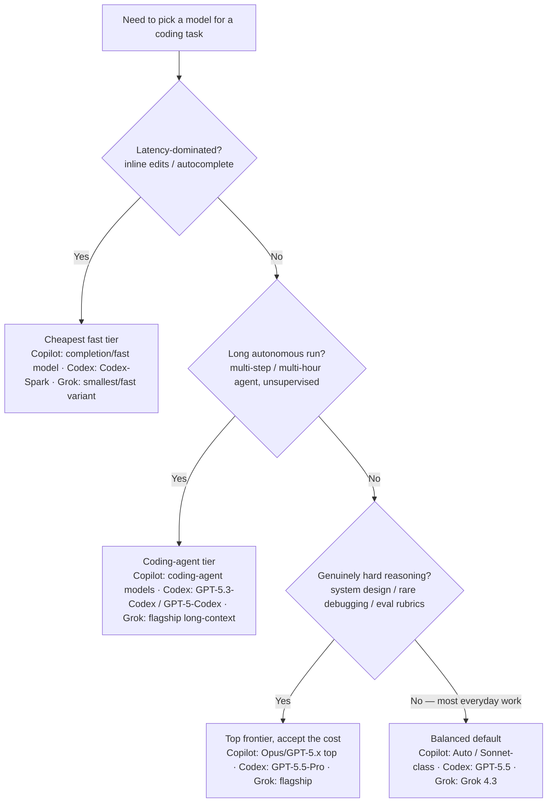

<!-- lineup-citations: enforce — every price/context-window row below must carry a citation link, a date, or a verify-at-use marker (scripts/check-lineup-citations.py) -->

# Cross-tool model selection & 2026 lineup (Copilot · Codex · Grok)

**Last reviewed:** 2026-05-31 · **Confidence:** medium — these three vendors ship **weekly-to-monthly**, faster than the Claude platform; treat this as the freshness anchor the Researcher sweep re-dates. Every numeric / availability claim carries a retrieval date — **verify against the cited primary source before quoting it to anyone.**
**Owner:** all three strategist agents (`copilot-model-strategist`, `codex-model-strategist`, `grok-model-strategist`). This is the **single source of truth** for non-Claude model facts — one file refreshes, not three personas (mirrors `claude-app-engineering/knowledge/model-selection-and-2026-capability-map.md`).
**Staleness tier:** **Tier-4 (Emerging / fast-churn)** — re-verify on the weekly `researcher-reminder.yml` sweep and treat a >30-day-old retrieval date as stale-until-re-checked, not as current.
**Sources (retrieved 2026-05-31, via vendor docs + changelogs; the doc pages 403 automated fetch, so values were cross-referenced across vendor blog/changelog + docs):**
[GitHub Copilot supported models](https://docs.github.com/en/copilot/reference/ai-models/supported-models) · [GitHub Changelog](https://github.blog/changelog/) · [OpenAI Codex models](https://developers.openai.com/codex/models) · [OpenAI model release notes](https://help.openai.com/en/articles/9624314-model-release-notes) · [xAI models](https://docs.x.ai/developers/models)

> **Why durable reasoning, not just a lineup.** Model names and prices churn weekly; the *decision framework* below does not. Lead with the framework; use the dated tables as a snapshot to be re-verified, never as a permanent fact.

---

## Closed-world rule (anti-hallucination — every agent enforces)

**Only name a model that appears in a verified table below.** If asked about a model not listed (e.g. "what about GPT-5.6?" or "Grok 4.5?"), do **not** infer it exists from a version-number pattern — state it is not in the verified lineup as of the retrieval date and offer to check the live source. Dense, similar SKU names (GPT-5.5 / 5.4 / 5.3-Codex; Grok 4.3 / 4.1 Fast / 4.20) invite extrapolation; resist it. A confidently-named non-existent model is the exact claim-grounding failure this plugin exists to prevent.

---

## Decision Tree: which model / tier — independent of vendor

Traverse this **before** reaching for a specific SKU. It is vendor-neutral; the per-ecosystem tables below only map the leaf to that vendor's current name.

**Right-size, don't default to the top.** Same discipline as `claude-app-engineering` house opinion #3: a cheap/fast model for triage and inline work, escalate-on-difficulty to the balanced default, and reserve the top frontier (and its cost premium) for the genuinely hard tail. The metric is **cost-per-resolved-task**, not raw model rank.

---

## GitHub Copilot — model picker (retrieved 2026-05-31)

Copilot's picker spans **three vendors' models** — Anthropic Claude, OpenAI GPT/Codex, and Google Gemini — and **availability varies by plan, surface (completions / chat / coding agent / cloud agent / mobile), and IDE.** Always confirm against the live picker in `github.com/copilot` or the supported-models doc; the set below is a dated snapshot.

| Surface | Models seen (2026-05-31) — verify live |
|---|---|
| **Coding agent** (Claude/Codex agents on github.com) | Claude: Sonnet 4.6, Opus 4.6, Sonnet 4.5, Opus 4.5 · Codex: GPT-5.2-Codex, GPT-5.3-Codex, GPT-5.4 |
| **Cloud agent — fast/cost-efficient tier** | Claude Haiku 4.5, GPT-5.4-mini |
| **Mobile picker** | Auto, Claude Opus 4.6/4.5, Claude Sonnet 4.5, GPT-5.1-Codex-Max, GPT-5.2-Codex |
| **Org control** | **Model rules** target/restrict models to organizations (Changelog 2026-05-26) |

- **`Auto` exists** — let Copilot pick when you don't have a reason to override; override only when the decision tree above gives you one.
- **Availability is surface-specific and churns.** A 2026-05-20 changelog removed several models (incl. some Gemini SKUs) from **Copilot Chat on the web specifically** — that is *not* a picker-wide removal, and Gemini models (e.g. Gemini 3 Pro, 2.5 Pro) still appear in the broader supported list. Don't state "model X is/isn't in Copilot" as universal; scope it to the surface and the date. `[verify-at-use — surface-specific]`
- **Plan-gated.** Free vs Pro vs Business vs Enterprise expose different sets. Never promise a model without knowing the consumer's plan.

## OpenAI Codex — CLI + cloud lineup (retrieved 2026-05-31)

`/model` in the Codex CLI switches both the model and its **reasoning level**. Start at the default and only change with a reason from the decision tree.

| Model | Use for | Notes |
|---|---|---|
| **GPT-5.5** | **Start here for most tasks** — newest frontier; complex coding, tool use, multi-step follow-through | More intelligent **and** more token-efficient than GPT-5.4 |
| GPT-5.5-Pro | The ~1% hardest calls — system design, eval rubrics, rare debugging | ~3× cost premium; reserve it |
| GPT-5.3-Codex | Long, autonomous multi-hour agentic coding | First to unify the Codex + GPT-5 training stacks |
| GPT-5-Codex | Hand-off agentic runs you won't supervise step-by-step | Codex-specialized |
| Codex-Spark | Inline edits where latency dominates UX | Pin it for near-instant iteration |
| GPT-5.4 | Prior flagship / fallback | Use if GPT-5.5 isn't in your CLI yet — update the CLI to get 5.5 |

- **Reasoning level is a dial, not just the model.** For a hard problem, raising the reasoning level on the same model is often the right first move before jumping SKUs.
- Exact pricing/context numbers change without notice — `[verify-at-use]` against [developers.openai.com/codex/models](https://developers.openai.com/codex/models) before quoting cost.

## xAI Grok — model lineup (retrieved 2026-05-31)

| Model | Context | Pricing (per M tok) | Use for |
|---|---|---|---|
| **Grok 4.3** | **1M** | **$1.25 in / $2.50 out** (cached input $0.20) | Current flagship; balanced coding/reasoning default. Launched 2026-04-30. |
| Grok 4.1 Fast | 2M | (verify live) | Larger context, faster/cheaper tier |
| Grok 4.20 (Multi-Agent Beta) | 2M | (verify live) | Multi-agent / very-long-context work |

- **⚠️ `grok-code-fast-1` is RETIRED (2026-05-15).** The old id now **redirects to Grok 4.3 pricing** — if a consumer pins it expecting the historical cheap rate, they are silently billed at $1.25/$2.50. Tell them to migrate to a current id. This is the single highest-value correction in this file.
- All Grok prices/context windows are the fastest-churning numbers here — `[verify-at-use]` against [docs.x.ai/developers/models](https://docs.x.ai/developers/models) and the live pricing page before quoting. Prices change without notice.
- A Grok coding-agent CLI ("Grok Build") has been reported in beta — `[unverified — confirm at docs.x.ai before relying]`.

---

## How to keep this current

On each weekly Researcher sweep (`.github/workflows/researcher-reminder.yml`) and whenever the staleness sweep flags this Tier-4 file:

1. Re-check the three primary sources cited in the header (Copilot supported-models doc + GitHub Changelog; Codex models page + OpenAI release notes; xAI models + pricing pages).
2. Re-date this file (`Last reviewed:`) and correct any model name, price, context window, or availability that changed.
3. Re-confirm retirements (the `grok-code-fast-1` line) and the closed-world model list.
4. Bump the plugin **patch** version if a *default* changes (a new recommended-default model, a retirement, a price-tier shift) so consumers see it on `/plugin marketplace update`.

**All numeric/availability claims live HERE, dated — not baked into the three agent personas.** One file refreshes, not three.
