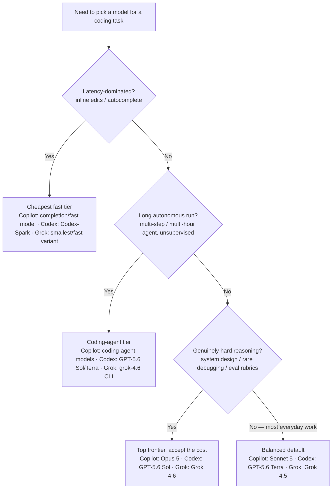
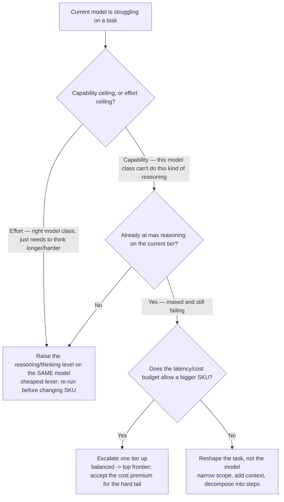

<!-- lineup-citations: enforce — every price/context-window row below must carry a citation link, a date, or a verify-at-use marker (scripts/check-lineup-citations.py) -->

# Cross-tool model selection & 2026 lineup (Copilot · Codex · Grok)

**Last reviewed:** 2026-08-31 (**2026-08-31 sweep:** **GPT-5.4 / GPT-5.4-mini scoped-retired from Codex for ChatGPT-account sessions 2026-08-31** — Codex API-key sessions + the direct OpenAI API are **unaffected**; migrate ChatGPT-auth Codex use to **GPT-5.6 Terra / Luna** (`gpt-5.4→gpt-5.6-terra`, `gpt-5.4-mini→gpt-5.6-luna`). Primary: @OpenAIDevs + openai/codex Discussion #17038; the 2026-08-14 sweep's "OpenAI/Codex rows unchanged" note is corrected. **Deferred:** a secondary/aggregator-only report of a 2026-07-30 GPT-5.6 Luna −80% / Terra −20% price cut is held out — no verified absolute post-cut numbers, so the anchor does not publish them (both panels: DEFER). **2026-08-14 adapter:** Grok 4.6 is the Grok Build CLI default; 4.5 remains selectable. Adapter: top=`grok-4.6`, balanced/fast=`grok-4.5` + effort/perspective. **2026-08-13 sweep:** **Grok 4.6 announced/GA 2026-08-12** — xAI's new flagship above 4.5 ($2/$6 per Mtok short-context <200K; **long-context band ≥200K doubles to $4/$12**, cached input $0.50/1M; **500K** context, not primary-confirmed; on xAI API / Grok Build / Cursor / OpenRouter / Vercel / Cloudflare — secondary-sourced, xAI primary 403s, carries a stronger `[verify-at-use]` than the 4.5 row's tier-1 press); **Kimi K3 GA in GitHub Copilot 2026-08-06** (open-weight, now hosted on Fireworks AI, $3/$15/$0.30 cached per 1M, off by default for Business/Enterprise) — supersedes K2.7 as the newest Kimi in the picker; **Claude Opus 5 in GitHub Copilot 2026-07-24** — the new top Copilot Claude option above Opus 4.8 (Copilot-surface fact only; Claude specs stay in the sibling capability map, house opinion #8); **MAI-Code-1-Flash deprecated 2026-09-10, superseded by MAI-Code-1.1-Flash** (native vision, 73% lower list price, off by default for Business/Enterprise); **Copilot Sept-1-2026 model deprecations** (Sonnet 4.6 retained for individual annual-plan subscribers; full list at the changelog); **Copilot default-model-enablement policy** effective 2026-08-26 (unconfigured GA models → "inherits default" on Business/Enterprise). Closed-world re-checked: **GPT-5.7 remains unreleased** (fictional example stays valid); OpenAI **"Astra" announced 2026-08-01** is held OUT of the lineup (not a selectable coding model, not confirmed GPT-6). See the 2026-08-13 sweep note. Carried forward from 2026-07-17: **Grok 4.5 announced/GA 2026-07-08** — xAI's flagship, reportedly available the same day in Grok Build CLI / Cursor / the xAI console+API at $2/$6 per Mtok (secondary-sourced — xAI primary 403s); added as the current Grok flagship above 4.3, and the closed-world anti-hallucination example that had used "Grok 4.5?" as a *fictional* SKU was swapped to "Grok 5?" now that 4.5 is real — see the 2026-07-17 sweep note. Grok numbers stay secondary-sourced (xAI primary 403s automated fetch) with `[verify-at-use]` riders. Carried forward from 2026-07-11: **GPT-5.6 Sol/Terra/Luna PUBLIC GA 2026-07-09** across ChatGPT / ChatGPT Work / Codex / the OpenAI API — moved off "preview" in the Codex table with pricing added, and **now selectable in GitHub Copilot 2026-07-09** (admin-gated, off by default); **Codex merged into the ChatGPT desktop app 2026-07-09**; Copilot CLI gained **task-based auto model selection** 2026-07-01 — see the 2026-07-11 sweep note. Carried forward from 2026-07-08: **Claude Sonnet 5 GA in GitHub Copilot 2026-06-30** — added to the coding-agent snapshot row + Sources, see the 2026-07-08 Sonnet 5 sweep note; **GPT-5.6 Sol/Terra/Luna** had entered limited preview via API/Codex ~2026-06-26 with public launch announced for 2026-07-09 — now superseded by the 2026-07-09 GA recorded above (the three Codex rows are GA, not preview); closed-world example updated; **Kimi K2.7 Code** open-weight GA in the Copilot picker 2026-07-01 / Business+Enterprise 2026-07-07; Copilot Enterprise-default-to-Auto 2026-07-01 — see the 2026-07-08 sweep note. Carried forward: Fable 5 / Mythos 5 export controls **LIFTED 2026-06-30**, access restoring from 2026-07-01 — see the 2026-07-01 sweep note; re-verify per-surface callability before routing. Fable 5 free-inclusion window 2026-06-09..2026-06-22 **elapsed** — restored access bills usage credits. Carried forward: Codex GPT-5.3-Codex/5.2 deprecation + MAI-Code-1-Flash; Grok Build 2026-06-17) · **Confidence:** medium — these three vendors ship **weekly-to-monthly**, faster than the Claude platform; treat this as the freshness anchor the Researcher sweep re-dates. Every numeric / availability claim carries a retrieval date — **verify against the cited primary source before quoting it to anyone.**
**Owner:** all three strategist agents (`copilot-model-strategist`, `codex-model-strategist`, `grok-model-strategist`). This is the **single source of truth** for non-Claude model facts — one file refreshes, not three personas (mirrors `claude-app-engineering/knowledge/model-selection-and-2026-capability-map.md`).
**Staleness tier:** **Tier-4 (Emerging / fast-churn)** — re-verify on the weekly `researcher-reminder.yml` sweep and treat a >30-day-old retrieval date as stale-until-re-checked, not as current.
**Sources (Grok 4.6 row retrieved 2026-08-13; Grok 4.5 row retrieved 2026-07-17; Copilot rows re-checked 2026-08-13; Copilot row re-checked 2026-06-09; Codex/Grok rows retrieved 2026-05-31; the Grok coding-tool surface — Grok Build CLI + `grok-build-0.1` — retrieved 2026-06-17 via the xAI primary + deployable-model listings; the doc pages 403 automated fetch, so values were cross-referenced across vendor blog/changelog + docs + gateways):**
[GitHub Copilot supported models](https://docs.github.com/en/copilot/reference/ai-models/supported-models) · [GitHub Changelog](https://github.blog/changelog/) · [Opus 4.8 GA in Copilot (Changelog 2026-05-28)](https://github.blog/changelog/2026-05-28-claude-opus-4-8-is-generally-available-for-github-copilot/) · [Sonnet 5 GA in Copilot (Changelog 2026-06-30)](https://github.blog/changelog/2026-06-30-claude-sonnet-5-is-generally-available-for-github-copilot/) · [Opus 5 in Copilot (Changelog 2026-07-24)](https://github.blog/changelog/2026-07-24-claude-opus-5-is-now-available-in-github-copilot/) · [Kimi K3 in Copilot (Changelog 2026-08-06)](https://github.blog/changelog/2026-08-06-kimi-k3-is-now-available-in-github-copilot/) · [MAI-Code-1.1-Flash in Copilot (Changelog 2026-08-11)](https://github.blog/changelog/2026-08-11-mai-code-1-1-flash-available-in-github-copilot/) · [MAI-Code-1-Flash deprecation (Changelog 2026-08-11)](https://github.blog/changelog/2026-08-11-upcoming-deprecation-of-mai-code-1-flash/) · [Copilot Sept-1 deprecations (Changelog 2026-07-31)](https://github.blog/changelog/2026-07-31-upcoming-august-2026-model-deprecations-in-github-copilot/) · [Copilot default-model enablement (Changelog 2026-07-29)](https://github.blog/changelog/2026-07-29-default-model-enablement-for-copilot-business-and-enterprise/) · [OpenAI Codex models](https://developers.openai.com/codex/models) · [OpenAI model release notes](https://help.openai.com/en/articles/9624314-model-release-notes) · [xAI models](https://docs.x.ai/developers/models) · [Introducing Grok Build (xAI, retrieved 2026-06-17)](https://x.ai/news/grok-build-cli) · [Grok Build beta (xAI)](https://x.ai/cli) · Grok 4.5 (2026-07-08, secondary — xAI primary 403s): [Axios scoop](https://www.axios.com/2026/07/08/spacexai-grok-new-model), [FullStack Labs analysis](https://www.fullstack.com/labs/resources/blog/grok-4-5-a-closer-look-at-xais-latest-model), [AI Business](https://aibusiness.com/generative-ai/musk-s-xai-launches-grok-build-take-claude-code-codex) · Grok 4.6 (2026-08-12, secondary — xAI primary 403s, aggregator-tier — carry a stronger verify-at-use than 4.5): [kingy.ai](https://kingy.ai/blog/grok-4-6-price-benchmarks-api-cursor-context-window/), [digitalapplied.com](https://www.digitalapplied.com/blog/grok-4-6-launch-pricing-agentic-benchmarks-2026), [basenor.com](https://www.basenor.com/blogs/news/xai-launches-grok-4-6-1753-elo-half-the-price-of-rival-frontier-models), [eesel.ai](https://www.eesel.ai/blog/grok-4-6-pricing)

> **Why durable reasoning, not just a lineup.** Model names and prices churn weekly; the *decision framework* below does not. Lead with the framework; use the dated tables as a snapshot to be re-verified, never as a permanent fact.

---

## Closed-world rule (anti-hallucination — every agent enforces)

**Only name a model that appears in a verified table below.** If asked about a model not listed (e.g. "what about GPT-5.7?" or "Grok 5?"), do **not** infer it exists from a version-number pattern — state it is not in the verified lineup as of the retrieval date and offer to check the live source. Dense, similar SKU names (GPT-5.5 / 5.4 / 5.3-Codex; Grok 4.6 / 4.5 / 4.3 / 4.1 Fast / 4.20) invite extrapolation; resist it. A confidently-named non-existent model is the exact claim-grounding failure this plugin exists to prevent.

---

## Decision Tree: which model / tier — independent of vendor

Traverse this **before** reaching for a specific SKU. It is vendor-neutral; the per-ecosystem tables below only map the leaf to that vendor's current name.

```mermaid
flowchart TD
    A[Need to pick a model for a coding task] --> Q1{Latency-dominated?<br/>inline edits / autocomplete}
    Q1 -->|Yes| FAST[Cheapest fast tier<br/>Copilot: completion/fast model · Codex: Codex-Spark · Grok: smallest/fast variant]
    Q1 -->|No| Q2{Long autonomous run?<br/>multi-step / multi-hour agent, unsupervised}
    Q2 -->|Yes| AGENT[Coding-agent tier<br/>Copilot: coding-agent models · Codex: GPT-5.6 Sol/Terra · Grok: grok-4.6 CLI]
    Q2 -->|No| Q3{Genuinely hard reasoning?<br/>system design / rare debugging / eval rubrics}
    Q3 -->|Yes| TOP[Top frontier, accept the cost<br/>Copilot: Opus 5 · Codex: GPT-5.6 Sol · Grok: Grok 4.6]
    Q3 -->|No — most everyday work| MID[Balanced default<br/>Copilot: Sonnet 5 · Codex: GPT-5.6 Terra · Grok: Grok 4.5]
```

**Right-size, don't default to the top.** Same discipline as `claude-app-engineering` house opinion #3: a cheap/fast model for triage and inline work, escalate-on-difficulty to the balanced default, and reserve the top frontier (and its cost premium) for the genuinely hard tail. The metric is **cost-per-resolved-task**, not raw model rank (see the durable-reasoning rule below).

---

## Decision Tree: Reasoning level vs a bigger model (the cheaper lever first)

The "which model/tier" tree above picks a starting tier. This tree handles the **next** moment — the current model is struggling — and codifies house opinion #6: **raise the reasoning/thinking effort on the same model before jumping to a bigger, pricier SKU.** Vendor-neutral; the dial's name differs (Codex `/model` reasoning level, a thinking/effort budget elsewhere), the logic doesn't. Traverse it before escalating cost.

```mermaid
flowchart TD
    A[Current model is struggling on a task] --> Q1{Capability ceiling, or effort ceiling?}
    Q1 -->|"Effort — right model class, just needs to think longer/harder"| DIAL["Raise the reasoning/thinking level on the SAME model<br/>cheapest lever; re-run before changing SKU"]
    Q1 -->|"Capability — this model class can't do this kind of reasoning"| Q2{Already at max reasoning on the current tier?}
    Q2 -->|No| DIAL
    Q2 -->|Yes — maxed and still failing| Q3{Does the latency/cost budget allow a bigger SKU?}
    Q3 -->|Yes| BIGGER["Escalate one tier up<br/>balanced -> top frontier; accept the cost premium for the hard tail"]
    Q3 -->|No| RESHAPE["Reshape the task, not the model<br/>narrow scope, add context, decompose into steps"]
```

**Rationale per leaf:**

- _DIAL_ — most "the model got it wrong" cases are an **effort** ceiling, not a **capability** one: the same model at a higher reasoning/thinking level resolves the task at a fraction of the cost of a bigger SKU. This is the cheaper lever and the default first move (Codex makes it explicit — `/model` sets both the model **and** its reasoning level; raise the level before switching).
- _Q2 (max-reasoning gate)_ — only after the current tier is genuinely **maxed on reasoning and still failing** is a bigger model the right escalation; jumping SKUs while reasoning headroom remains spends money the dial would have saved (anti-pattern #6).
- _BIGGER_ — a true capability ceiling on the hard tail justifies the next tier up and its cost premium — that's exactly what the top frontier is reserved for. Map the leaf to the vendor's current top SKU via the tables below.
- _RESHAPE_ — when budget forbids a bigger SKU, the lever is the **task**, not the model: narrow the scope, supply better context/examples, or decompose into steps a balanced model can each handle. Often a better-shaped task on the cheaper model beats a bigger model on a sprawling one.

**Tradeoffs summary:**

| Move | Cost delta | Try when | Trap avoided |
|---|---|---|---|
| Raise reasoning on same model | ~none (more tokens) | effort ceiling; reasoning headroom remains | paying for a bigger SKU the dial would've fixed |
| Escalate one tier up | + (per-token + premium) | reasoning maxed, true capability ceiling, budget allows | over-spending on everyday work |
| Reshape the task | none | budget forbids a bigger SKU | brute-forcing a sprawling task with raw model size |

---

## Durable reasoning: right-size by cost-per-resolved-task, not model rank

**This is a framework rule, not a volatile fact — it does not churn with the lineup.** The instinct to reach for the highest-ranked model "to be safe" is the most expensive habit in AI-assisted coding, because the cost of the top tier is paid on **every** call, while its advantage only shows up on the hard tail.

- **The metric is cost-per-resolved-task, not raw model rank or benchmark position.** A cheaper model that resolves the task in one pass beats a frontier model that resolves it in one pass at 5–20× the cost — they have the **same** outcome and very different bills. Rank only matters where the cheaper tier actually *fails*.
- **Tier the work, not the developer.** Inline edits / autocomplete → cheapest fast tier; everyday implementation/refactor/debug → the balanced default; the genuinely hard tail (system design, rare debugging, eval rubrics) → the top frontier. Most work lives in the middle tier.
- **Escalate on observed difficulty, not in anticipation of it.** Start at the right-sized tier and move up only when the task demonstrably needs it (and first via the reasoning dial, per the tree above) — not pre-emptively because the task "feels important."
- **`Auto`/default pickers encode this** — let the tool right-size when you have no specific reason from the tree to override (Copilot `Auto`, the Codex default model).

Mirrors `claude-app-engineering` house opinion #3 and this plugin's house opinion #2. It is vendor-neutral and outlives any specific SKU in the tables below.

---

## Durable reasoning: scope model availability by surface + plan + date

**This is a framework rule, not a volatile fact.** "Is model X available in tool Y?" has **no flat universal answer** — availability is a function of three axes, and stating it without them is how this plugin's agents would ship a wrong claim.

- **Surface.** A model present in one surface (coding agent, cloud agent, chat, completions, mobile) is not necessarily in another. A 2026-05-20 changelog removed several models from **Copilot Chat on the web specifically** — that was *not* a picker-wide removal. Always scope the claim to the surface.
- **Plan.** Free vs Pro vs Business vs Enterprise expose different model sets, and org **model rules** can further restrict them. Never promise a model without knowing the consumer's plan/org policy.
- **Date.** These three vendors ship weekly-to-monthly; an availability claim is only true as of a retrieval date. Carry the date and a `[verify-at-use]` rider; re-verify against the live picker/source before quoting.

The practical phrasing: **"as of `<date>`, on `<surface>`, for `<plan>`, model X is available — verify live."** Never "model X is in tool Y" as a standalone universal. Mirrors house opinions #3 and #4; the dated specifics live in the per-ecosystem tables below, this rule governs how to *state* them.

---

## GitHub Copilot — model picker (retrieved 2026-05-31)

Copilot's picker spans **four vendors' models** — Anthropic Claude, OpenAI GPT/Codex, Google Gemini, and Moonshot AI (open-weight Kimi) — and **availability varies by plan, surface (completions / chat / coding agent / cloud agent / mobile), and IDE.** Always confirm against the live picker in `github.com/copilot` or the supported-models doc; the set below is a dated snapshot.

| Surface | Models seen (2026-05-31) — verify live |
|---|---|
| **Coding agent** (Claude/Codex agents on github.com) | Claude: **Opus 5 (in Copilot 2026-07-24 — new top Copilot Claude option)**, **Fable 5 (export controls LIFTED 2026-06-30, access restoring from 2026-07-01 — see bullet below; GA 2026-06-09)**, **Opus 4.8 (GA 2026-05-28)**, **Sonnet 5 (GA in Copilot 2026-06-30, gradual rollout)**, Sonnet 4.6, Opus 4.6, Sonnet 4.5, Opus 4.5 · Codex: **GPT-5.6 Sol / Terra / Luna (GA 2026-07-09, admin-gated off by default)**, GPT-5.4 (GPT-5.2-Codex / GPT-5.3-Codex deprecated 2026-06) · Open-weight: **Kimi K3 (GA 2026-08-06)**, Kimi K2.7 |
| **Cloud agent — fast/cost-efficient tier** | Claude Haiku 4.5, GPT-5.4-mini, **MAI-Code-1.1-Flash** (Microsoft small coding model, native vision, 73% lower list price than 1-Flash; available 2026-08-11) — **⚠️ MAI-Code-1-Flash is deprecated across all Copilot experiences 2026-09-10; migrate to MAI-Code-1.1-Flash** |
| **Mobile picker** | Auto, Claude **Opus 4.8 (2026-05-28)**/4.6/4.5, Claude Sonnet 4.5, GPT-5.1-Codex-Max, GPT-5.2-Codex |
| **Org control** | **Model rules** target/restrict models to organizations (Changelog 2026-05-26) · **Enterprise admins can set `model=auto` as the default** for new conversations ([Changelog 2026-07-01](https://github.blog/changelog/2026-07-01-enterprises-can-default-to-auto-model-selection/)) · **Default-model-enablement policy** — from **2026-08-26**, unconfigured GA models on Business/Enterprise relabel to "inherits default" and follow the global policy setting ([Changelog 2026-07-29](https://github.blog/changelog/2026-07-29-default-model-enablement-for-copilot-business-and-enterprise/)) `[verify-at-use — dated 2026-08-13]` |

- **Export controls LIFTED 2026-06-30 — the US Dept of Commerce / BIS withdrew the directive that had suspended Claude Fable 5 (2026-06-12) across the Anthropic API, AWS Bedrock, and GitHub Copilot; Anthropic began restoring access 2026-07-01 (fluid — re-verify per surface).** Confirm Fable 5 is selectable in the Copilot picker on your tenant before relying on it. The "free through 2026-06-22" promo window (2026-06-09..2026-06-22) has **elapsed**, so **restored access resumes under usage-credit billing, not free** — re-verify. Until your Copilot tenant shows Fable 5 selectable again, the top Copilot Claude option is **Opus 4.8**. Other Claude models in Copilot (Opus 4.8, Sonnet 4.6, Haiku 4.5) were unaffected throughout. Primary: [Anthropic statement](https://www.anthropic.com/news/fable-mythos-access) + Anthropic's 2026-06-30 restoration notice (anthropic.com 403s automated fetch — read via WebSearch; corroborated by [CNBC](https://www.cnbc.com/2026/06/30/anthropic-says-trump-admin-has-lifted-export-controls-on-claude-fable-5-and-mythos-5.html), Fox Business, Axios, all 2026-06-30). `[verify-at-use — restoration in progress; re-check per-surface callability before quoting]` _Detail follows:_
- **Claude Fable 5 was GA in Copilot** (rolled out from 2026-06-09; [Changelog 2026-06-09](https://github.blog/changelog/2026-06-09-claude-fable-5-is-generally-available-for-github-copilot/)) — Anthropic's first public **"Mythos-class"** model (vendor framing, `[verify-at-use — single-source]`), built for long-horizon autonomous coding. Plans **Pro+ / Max / Business / Enterprise**; surfaces VS Code, Visual Studio, JetBrains, Xcode, Eclipse, the Copilot CLI, the cloud agent, github.com, and mobile. **Was included free 2026-06-09 through 2026-06-22** on those plans; that window has **now elapsed — since 2026-06-23 it bills usage credits** (applies on restoration, access lifted 2026-06-30) — `[verify-at-use — window elapsed 2026-06-22]`. **Business/Enterprise admins must enable the Fable 5 policy (off by default)** — same pattern as the Opus 4.8 policy. Also on **AWS Bedrock** and the Anthropic API (`claude-fable-5`, **$10 / $50** per Mtok — **2× Opus 4.8** [$5/$25]); Microsoft Foundry: the Azure blog and the `ai.azure.com/catalog/models/claude-fable-5` catalog page announce GA, **but the authoritative Foundry _Learn_ model table** ([`use-foundry-models-claude`](https://learn.microsoft.com/azure/foundry/foundry-models/how-to/use-foundry-models-claude)) **still does NOT list `claude-fable-5`** — it lists the Opus (4-8/4-7/4-6/4-5/4-1), Sonnet (4-6/4-5), and Haiku (4-5) previews plus the gated `claude-mythos-preview`; **re-verified 2026-06-11 via the Microsoft-Learn MCP** (still absent — the blog/catalog-vs-Learn-docs gap persists, so treat Foundry Fable 5 as announced-not-yet-in-the-deployable-model-table). `[verify-at-use]` The Copilot changelog 403s automated fetch — read via `WebSearch` + cross-referenced across the GitHub/Microsoft posts + dev guides (the route ladder, below). `[verify-at-use — surface/plan-specific; pricing/inclusion window]`
- **Claude Opus 4.8 is GA in Copilot** ([Changelog 2026-05-28](https://github.blog/changelog/2026-05-28-claude-opus-4-8-is-generally-available-for-github-copilot/)) for **Pro+ / Business / Enterprise** plans — selectable in VS Code (all modes: chat / ask / edit / agent) plus Visual Studio, JetBrains, Xcode, Eclipse, the Copilot CLI, GitHub Mobile, and the Copilot App; Business/Enterprise admins must enable the Opus 4.8 policy. It **launched at a 15× premium-request multiplier**; that introductory window closed when **Usage-Based Billing went live 2026-06-01**, so re-confirm the current multiplier on the live picker. `[verify-at-use — surface/plan-specific; pricing post-UBB]`
- **MAI-Code-1-Flash — Microsoft's purpose-built *small* coding model — went broadly available across Copilot surfaces on 2026-06-18** ([Changelog 2026-06-18](https://github.blog/changelog/2026-06-18-mai-code-1-flash-available-on-more-copilot-surfaces/)): Copilot CLI, the Copilot app, Copilot Chat on GitHub, Visual Studio, GitHub Mobile, JetBrains, Eclipse, and Xcode; available on **Copilot Free / Student / Pro / Pro+ / Max**. It maps to the **cheapest-fast-tier** leaf of the decision tree (latency-dominated inline/triage work) — a Microsoft first-party alternative to the Claude/OpenAI fast tiers when right-sizing down. `[verify-at-use — surface/plan-specific; dated 2026-06-18]`
- **`Auto` exists** — let Copilot pick when you don't have a reason to override; override only when the decision tree above gives you one.
- **Availability is surface-specific and churns.** A 2026-05-20 changelog removed several models (incl. some Gemini SKUs) from **Copilot Chat on the web specifically** — that is *not* a picker-wide removal, and Gemini models (e.g. Gemini 3 Pro, 2.5 Pro) still appear in the broader supported list. Don't state "model X is/isn't in Copilot" as universal; scope it to the surface and the date. `[verify-at-use — surface-specific]`
- **Plan-gated.** Free vs Pro vs Business vs Enterprise expose different sets. Never promise a model without knowing the consumer's plan.
- **OpenAI GPT-5.6 (Sol / Terra / Luna) is now available in GitHub Copilot — GA 2026-07-09** ([GitHub Changelog 2026-07-09](https://github.blog/changelog/2026-07-09-openais-gpt-5-6-sol-terra-and-luna-are-now-available-in-github-copilot/)), **admin-gated (off by default)** — Business/Enterprise admins must enable the GPT-5.6 policy in Copilot settings, same pattern as the Opus 4.8 / Fable 5 / Kimi K2.7 policies. Surface/plan scope: **Sol** on **Pro+ / Max / Business / Enterprise**; **Terra** and **Luna** on **Pro / Pro+ / Max / Business / Enterprise**. Tiers map to the decision tree — **Sol → top-frontier hard tail, Terra → balanced default, Luna → cheapest-fast tier**. The Copilot **CLI** added GPT-5.6 support plus **task-based auto model selection** (routes by task; [Changelog 2026-07-01](https://github.blog/changelog/2026-07-01-copilot-cli-auto-model-selection-routes-based-on-task/)). github.blog 403s automated fetch — read via WebSearch, corroborated across the OpenAI post + tech-press. `[verify-at-use — surface/plan-specific; dated 2026-07-11]`
- **Kimi K2.7 Code — first open-weight model in the Copilot picker — GA 2026-07-01** (Pro / Pro+ / Max), extended to **Business / Enterprise 2026-07-07** (off by default; admins must enable the **Kimi K2.7 Code policy**). ~1T-param **Modified-MIT-licensed** MoE coding model from Moonshot AI (weights public on Hugging Face), hosted by GitHub on Azure, **billed at provider list pricing** (a lower-cost tier than the frontier proprietary SKUs). Maps to the balanced/cost-efficient right-sizing leaf — a first-party open-weight alternative to the Claude/OpenAI tiers. [GitHub Changelog 2026-07-01](https://github.blog/changelog/2026-07-01-kimi-k2-7-is-now-available-in-github-copilot/) · [Business/Enterprise 2026-07-07](https://github.blog/changelog/2026-07-07-kimi-k2-7-now-available-for-copilot-business-and-enterprise/) `[verify-at-use — surface/plan-specific; dated 2026-07-07]`
- **Kimi K3 — GA in Copilot 2026-08-06, supersedes K2.7 as the newest Kimi in the picker.** Open-weight (Moonshot AI), **now hosted by GitHub on Fireworks AI** (K2.7 was hosted on Azure — the hosting changed). Pricing **$3 in / $15 out / $0.30 cached** per 1M. Rolling out to **Pro / Pro+ / Max / Business / Enterprise**; **off by default for Business/Enterprise** (admins must enable the Kimi K3 policy). Selectable in VS Code, Visual Studio, the Copilot CLI, and other surfaces; the rollout was briefly paused then resumed 2026-08-06 during a GitHub Actions incident. Maps to the same balanced/cost-efficient open-weight leaf as K2.7. [GitHub Changelog 2026-08-06](https://github.blog/changelog/2026-08-06-kimi-k3-is-now-available-in-github-copilot/) `[verify-at-use — surface/plan-specific; dated 2026-08-13]`
- **Claude Opus 5 — in GitHub Copilot 2026-07-24, now the top Copilot Claude option** (above Opus 4.8). For **Pro+ / Max / Business / Enterprise**; surfaces VS Code, JetBrains, Xcode, the Copilot CLI, and mobile; billed at provider API list price under usage-based billing; **Business/Enterprise admins must enable it**. This file records only the **Copilot-surface availability** fact — Opus 5's Claude-side specs / pricing / right-sizing live in the sibling [`../../claude-app-engineering/knowledge/model-selection-and-2026-capability-map.md`](../../claude-app-engineering/knowledge/model-selection-and-2026-capability-map.md) (house opinion #8 seam / single-source-of-truth), same handling as Sonnet 5. [GitHub Changelog 2026-07-24](https://github.blog/changelog/2026-07-24-claude-opus-5-is-now-available-in-github-copilot/) `[verify-at-use — surface/plan-specific; dated 2026-08-13]`
- **⚠️ Copilot model deprecations — 2026-09-01 and 2026-09-10.** Several models are being **deprecated across all Copilot experiences on 2026-09-01** (the changelog was posted 2026-07-31 and is *titled* "Upcoming August 2026 model deprecations," but the removal takes effect **2026-09-01** — [Changelog 2026-07-31](https://github.blog/changelog/2026-07-31-upcoming-august-2026-model-deprecations-in-github-copilot/)) — **Claude Sonnet 4.6 is retained for individual subscribers on annual plans**; the exhaustive model list is on the changelog, `[verify-at-use — confirm the full list before quoting]`. Separately, **MAI-Code-1-Flash is deprecated 2026-09-10**, superseded by **MAI-Code-1.1-Flash** ([Changelog 2026-08-11](https://github.blog/changelog/2026-08-11-upcoming-deprecation-of-mai-code-1-flash/)) — migrate the cheapest-fast-tier pick before then. `[verify-at-use — dated 2026-08-13]`

## OpenAI Codex — CLI + cloud lineup (retrieved 2026-05-31)

`/model` in the Codex CLI switches both the model and its **reasoning level**. Start at the default and only change with a reason from the decision tree.

| Model | Use for | Notes |
|---|---|---|
| **GPT-5.5** | Still a solid default; complex coding, tool use, multi-step follow-through; long autonomous agentic runs now that GPT-5.3-Codex is deprecated | More intelligent **and** more token-efficient than GPT-5.4. **Superseded as "newest" by the GPT-5.6 generation (GA 2026-07-09).** As GPT-5.6 becomes selectable in your CLI, **GPT-5.6 Terra is the newer balanced-default candidate** (and GPT-5.6 Sol for the hard tail) — verify selectable, then migrate. `[verify-at-use — dated 2026-07-11]` |
| GPT-5.5-Pro | The ~1% hardest calls — system design, eval rubrics, rare debugging | ~3× cost premium; reserve it |
| ~~GPT-5.3-Codex~~ | ~~Long, autonomous multi-hour agentic coding~~ | **⚠️ DEPRECATED 2026-06** — no longer user-selectable in Codex; **new API requests discontinued 2026-06-30**, full endpoint shutdown 2026-12-31. Migrate to **GPT-5.5**. `[verify-at-use — dated 2026-06-21]` |
| ~~GPT-5.2 / GPT-5.2-Codex~~ | ~~prior generation~~ | **⚠️ DEPRECATED 2026-06** — same sunset (new requests end 2026-06-30, shutdown 2026-12-31); already removed from ChatGPT 2026-06-12. Migrate to GPT-5.5/5.4. `[verify-at-use — dated 2026-06-21]` |
| GPT-5-Codex | Hand-off agentic runs you won't supervise step-by-step | Codex-specialized |
| Codex-Spark | Inline edits where latency dominates UX | Pin it for near-instant iteration |
| GPT-5.4 / GPT-5.4-mini | Prior flagship / fast fallback | **⚠️ RETIRED FROM CODEX 2026-08-31 — for Codex sessions signed in with a ChatGPT account ONLY.** **Still available on Codex API-key sessions and the direct OpenAI API** (unaffected — do NOT tell API-key users to migrate). Migrate ChatGPT-auth Codex use: **gpt-5.4 → gpt-5.6-terra**, **gpt-5.4-mini → gpt-5.6-luna** (GPT-5.5 also remains selectable). `[verify-at-use — dated 2026-08-31]` |
| **GPT-5.6 Sol** | Flagship — complex reasoning / agentic runs over large codebases; highest reasoning ceiling in the family | **PUBLIC GA 2026-07-09** across ChatGPT / ChatGPT Work / Codex / the OpenAI API (previously limited preview from ~2026-06-26). In the 5.6 naming scheme the number is the generation and **Sol/Terra/Luna are durable capability tiers**. Pricing ~**$5 in / $30 out** per Mtok — tech-press secondaries; openai.com 403s automated fetch. [OpenAI](https://openai.com/index/gpt-5-6/) · [TechCrunch 2026-07-09](https://techcrunch.com/2026/07/09/openai-launches-its-new-family-of-models-with-gpt-5-6/) `[verify-at-use — dated 2026-07-11; price secondary-sourced]` |
| GPT-5.6 Terra | **Balanced default** — everyday interactive + agentic coding; ~GPT-5.5 quality at lower cost | **PUBLIC GA 2026-07-09**; pricing ~**$2.50 in / $15 out** per Mtok (tech-press secondaries). [OpenAI](https://openai.com/index/gpt-5-6/) `[verify-at-use — dated 2026-07-11; price secondary-sourced]` |
| GPT-5.6 Luna | Fast / cheapest tier — latency-dominated / inline / smaller tasks | **PUBLIC GA 2026-07-09**; pricing ~**$1 in / $6 out** per Mtok (tech-press secondaries). [OpenAI](https://openai.com/index/gpt-5-6/) `[verify-at-use — dated 2026-07-11; price secondary-sourced]` |

- **Reasoning level is a dial, not just the model.** For a hard problem, raising the reasoning level on the same model is often the right first move before jumping SKUs.
- Exact pricing/context numbers change without notice — `[verify-at-use]` against [developers.openai.com/codex/models](https://developers.openai.com/codex/models) before quoting cost.

## xAI Grok — model lineup (Grok 4.6 row retrieved 2026-08-13; Grok 4.5 row retrieved 2026-07-17; rest retrieved 2026-05-31 / 2026-06-17)

| Model | Context | Pricing (per M tok) | Use for |
|---|---|---|---|
| **Grok 4.6** | **500K** (not primary-confirmed) | **$2 in / $6 out** short-context (<200K); **≥200K long-context band doubles to $4 in / $12 out**; cached input **$0.50** /1M — retrieved 2026-08-13, `[verify-at-use — aggregator-tier secondaries, stronger hedge than 4.5]` | **Current flagship** (announced/GA **2026-08-12**) and Grok Build CLI default (`grok models` 2026-08-14). Adapter `top` / `opus`. Positioned by xAI as a coding / agents / knowledge-work flagship — "a meaningful agent + coding upgrade over 4.5," not a context-expansion or price cut. Available same day in the **xAI API**, **Grok Build**, **Cursor**, **OpenRouter**, **Vercel**, and **Cloudflare**. Numbers are **secondary-sourced from aggregator-tier outlets** (xAI primary pages 403 automated fetch; weaker sourcing than 4.5's tier-1 press — carry a stronger `[verify-at-use]`); the ≥200K price-doubling band is a genuine billing-surprise to right-size around. |
| **Grok 4.5** | (verify live) | **$2 in / $6 out** — retrieved 2026-07-17, `[verify-at-use]` | **CLI-selectable balanced rung** (announced/GA **2026-07-08**). Adapter `fast`+`balanced` share this SKU and diverge on `effort` + `perspective`. Prior flagship, still selectable. Numbers are **secondary-sourced** (xAI primary pages 403 automated fetch); cross-referenced across ≥4 independent outlets. Context window not yet confirmed against a primary source — `[verify-at-use]`. |
| Grok 4.3 | **1M** | **$1.25 in / $2.50 out** (cached input $0.20) | **Earlier flagship, still selectable** (launched 2026-04-30); a lower-cost balanced tier below 4.6/4.5. Retrieved 2026-05-31. |
| Grok 4.1 Fast | 2M | (verify live) | Larger context, faster/cheaper tier |
| Grok 4.20 (Multi-Agent Beta) | 2M | (verify live) | Multi-agent / very-long-context work |
| grok-build-0.1 (coding-agent SKU) | 256K | $1 in / $2 out (cached input $0.20) — retrieved 2026-06-17, `[verify-at-use]` | **API / historical.** Grok Build CLI probe **2026-08-14**: `unknown model id` (also `grok-build`, `grok-4.3`, `grok-4.20`). Do not use as a CLI adapter SKU. |

- **⚠️ `grok-code-fast-1` is RETIRED (2026-05-15).** The old id now **redirects to Grok 4.3 pricing** — if a consumer pins it expecting the historical cheap rate, they are silently billed at $1.25/$2.50. Tell them to migrate to a current id. This is the single highest-value correction in this file.
- All Grok prices/context windows are the fastest-churning numbers here — `[verify-at-use]` against [docs.x.ai/developers/models](https://docs.x.ai/developers/models) and the live pricing page before quoting. Prices change without notice.
- **Grok Build is xAI's agentic-coding CLI** (terminal-native coding agent, same family as Claude Code / Codex CLI / Copilot CLI). Launched 2026-05-14 powered by `grok-build-0.1`; secondary reporting had it on the Grok 4.5 flagship from 2026-07-08, and **as of 2026-08-12 Grok 4.6 is available in Grok Build** ([x.ai/cli](https://x.ai/cli)) — `[verify-at-use — confirm the CLI's active model before quoting; the beta SKU and the flagship may coexist per build]`. **Beta** — expanded to all SuperGrok / X Premium+ subscribers 2026-05-25 ([x.ai/news/grok-build-cli](https://x.ai/news/grok-build-cli), [x.ai/cli](https://x.ai/cli); base features retrieved 2026-06-17). Distinctive features: **plan mode** (sub-task graph in a TUI), **up to 8 parallel sub-agents each in an isolated Git worktree/branch** (vs. Claude Code's same-workspace sub-agents), **native MCP support**, and **Agent Client Protocol (ACP)** support so it can sit behind a custom orchestrator or run alongside another agent. Cross-referenced across the xAI primary + 10 secondaries (OpenRouter, Vercel AI Gateway, Requesty list `grok-build-0.1` as a deployable model). `[verify-at-use — beta; feature set and id may shift before GA — confirm at docs.x.ai]`

---

## How to keep this current

On each weekly Researcher sweep (`.github/workflows/researcher-reminder.yml`) and whenever the staleness sweep flags this Tier-4 file:

1. Re-check the three primary sources cited in the header (Copilot supported-models doc + GitHub Changelog; Codex models page + OpenAI release notes; xAI models + pricing pages).
2. Re-date this file (`Last reviewed:`) and correct any model name, price, context window, or availability that changed.
3. Re-confirm retirements (the `grok-code-fast-1` line) and the closed-world model list.
4. Bump the plugin **patch** version if a *default* changes (a new recommended-default model, a retirement, a price-tier shift) so consumers see it on `/plugin marketplace update`.

> **Sweep note (2026-08-31, scheduled news sweep):** one confirmed churn folded in, one deferred. **(1) Confirmed — Codex GPT-5.4 / GPT-5.4-mini retirement.** OpenAI is retiring **GPT-5.4 and GPT-5.4-mini from Codex on 2026-08-31 for sessions signed in with a ChatGPT account only**; the models **remain available on the direct OpenAI API and on Codex sessions authenticated with an API key** (unaffected). Recommended migration for ChatGPT-auth Codex use: `gpt-5.4 → gpt-5.6-terra`, `gpt-5.4-mini → gpt-5.6-luna`; users must update workspace defaults, saved model settings, managed configs, custom agents, and scheduled tasks. The Codex table row was changed from "Current, not deprecated" to a **surface+auth-scoped** retirement warning (NOT full strikethrough — unlike the fully-gone GPT-5.3-Codex / GPT-5.2 rows, GPT-5.4 is still callable on two surfaces, so per house opinion #3 the availability is scoped by surface+auth+date, not blanked). This **corrects** the 2026-08-14 sweep's "the OpenAI/Codex rows were re-checked and are unchanged" line. The Copilot coding-agent snapshot mentions of GPT-5.4 / GPT-5.4-mini (a *different* surface — the GitHub Copilot picker) are intentionally **left unchanged**; the Codex retirement has no bearing on Copilot. Closed-world: GPT-5.4 stays a **real** model (scoped-retired, not deleted), so no fictional-example swap. Vendor-neutral Mermaid trees unchanged (they name Codex-Spark / GPT-5.6 Sol/Terra, never 5.4). **(2) Deferred — GPT-5.6 Luna/Terra price cut.** A 2026-07-30 GPT-5.6 **Luna −80% / Terra −20%** price reduction is reported by **secondary/aggregator sources only**, with no verified absolute post-cut numbers; the file's Luna (~$1/$6) and Terra (~$2.50/$15) rows are dated 2026-07-11 (pre-cut). Both expert panels voted **DEFER** — the freshness anchor does not publish prices it can't stand behind. Held for a follow-up sweep once primary figures land; the existing `[verify-at-use]` price riders already warn readers. **(Known-adjacent, follow-up:** line ~130's GPT-5.2 row still names "GPT-5.5/5.4" as migration targets — 5.4 is now slightly stale for ChatGPT-auth Codex users though valid for API-key/API; left for a follow-up to avoid scope creep.) **Evidence:** [@OpenAIDevs](https://x.com/OpenAIDevs/status/2083301245390143831) ("GPT-5.4 and GPT-5.4 mini will no longer be available for users signed in with ChatGPT starting August 31. The models will remain available on the OpenAI API and Codex sessions authenticated with an API key."); [openai/codex Discussion #17038](https://github.com/openai/codex/discussions/17038); [OpenAI Codex changelog](https://developers.openai.com/codex/changelog) + [models](https://developers.openai.com/codex/models) (developers.openai.com 403s / egress-blocked — read via WebSearch per this file's 403 route ladder); [OpenAI Help Center Codex rate card](https://help.openai.com/en/articles/20001106-codex-rate-card). **Panels:** usefulness → F1 USEFUL 3/3, F2 DEFER 3/3; detailed review → SHIP 3/3 (correct + scope-precise + house-style-OK); no tiebreak (panels agreed). `[verify-at-use — dated 2026-08-31]`
>
> **Sweep note (2026-08-13, Tier-A weekly sweep — 4 weeks since 2026-07-17):** six churns folded in across the Copilot + Grok ecosystems (the OpenAI/Codex rows were re-checked and are unchanged this window). (1) **Grok 4.6 = new xAI flagship**, announced/GA **2026-08-12** — added above 4.5 in the Grok table (4.5 → "prior flagship, still selectable"); $2/$6 short-context, **≥200K long-context band doubles to $4/$12**, cached $0.50/1M, 500K context (not primary-confirmed). Sourcing is **aggregator-tier** (kingy.ai / digitalapplied / basenor / eesel — xAI primary 403s), materially weaker than 4.5's tier-1 press, so the row carries a **stronger `[verify-at-use]`** than 4.5 got. Grok 4.6 added to the closed-world real-name list. (2) **Kimi K3 GA in Copilot 2026-08-06** (GitHub Changelog primary) — supersedes K2.7 as the newest Kimi; open-weight, **hosting changed Azure → Fireworks AI**, $3/$15/$0.30 cached per 1M, off by default for Business/Enterprise; added a Copilot bullet + the coding-agent snapshot open-weight cell. (3) **Claude Opus 5 in Copilot 2026-07-24** (GitHub Changelog primary) — the new top Copilot Claude option above Opus 4.8; **only the Copilot-surface availability fact is recorded here** — Opus 5's Claude specs/pricing/right-sizing stay in the sibling capability map (house opinion #8 seam), exactly as Sonnet 5 was handled on 2026-07-08. (4) **MAI-Code-1-Flash deprecated 2026-09-10, superseded by MAI-Code-1.1-Flash** (GitHub Changelog primary) — native vision, **73% lower list price**, off by default for Business/Enterprise; the cheapest-fast-tier row was repointed to the successor with the deprecation warning. (5) **Copilot Sept-1-2026 model deprecations** (GitHub Changelog primary) — recorded as a dated event with the one confirmed specific (Sonnet 4.6 retained for individual annual-plan subscribers); the exhaustive list is deferred to the changelog with `[verify-at-use]`, not fabricated here. (6) **Copilot default-model-enablement policy** effective **2026-08-26** — appended to the org-control row (extends the 2026-07-01 Enterprise-default-to-Auto note). **Closed-world re-check (no change):** **GPT-5.7 remains unreleased/rumored** so the fictional example stays valid (not swapped); OpenAI **"Astra" was announced 2026-08-01** but is **held OUT of the lineup** — not a selectable coding-tool model and not confirmed as GPT-6 — logged here as a watch item, which is exactly the closed-world discipline (an announcement is not a selectable SKU). The vendor-neutral **Mermaid decision-tree leaves were intentionally left unchanged** — every edit this sweep lands in the dated tables/bullets (the SKU source of truth), preserving the framework-vs-lineup separation. **Evidence:** GitHub Changelog primaries for Copilot (github.blog 403s automated fetch — read via WebSearch); Grok 4.6 aggregator-tier secondaries (xAI primary 403s). **Panels:** usefulness → F1–F6,F8 USEFUL (3 seats; the one F5 DEFER was conditional on changelog corroboration, since met by the 2026-08-11 primary), F7 sweep-note-only; detailed review → recorded in the PR. `[verify-at-use — Grok 4.6 numbers aggregator-secondary-sourced; dated 2026-08-13]`
>
> **Sweep note (2026-07-17, Grok 4.5 GA):** the 2026-07-11 sweep updated the OpenAI/Copilot rows but explicitly **carried the Grok row forward from 2026-06-17** — so it missed **Grok 4.5**, which xAI announced/GA'd **2026-07-08** (30+ days stale on the file's Tier-4 clock). Folded in: (1) added **Grok 4.5** as the **current Grok flagship** above 4.3 (GA same day in **Grok Build CLI**, **Cursor** all plans, and the **xAI console/API**; **$2 in / $6 out** per Mtok; context window **not** yet primary-confirmed). Grok 4.3 re-labelled "prior flagship, still selectable" — it did not retire, so the vendor-neutral Mermaid decision-tree leaves that name "Grok 4.3" were **intentionally left unchanged** (framework-level, not churned per the sweep discipline — the table row is the SKU source of truth pointing readers to 4.5 as the flagship, mirroring the 2026-07-11 GPT-5.5→5.6 handling). (2) **grok-build-0.1** row + the Grok Build bullet annotated that secondary reporting says the CLI is **now powered by Grok 4.5** — carried with `[verify-at-use — confirm the CLI's active model]` since the prior beta SKU and the new flagship may coexist per build. (3) **Closed-world fix (highest-value line in this note):** the anti-hallucination rule used **"Grok 4.5?"** as a canonical *fictional* SKU example; 4.5 is now **real**, so leaving it would train agents to deny a real model — swapped to the still-fictional **"Grok 5?"** (direct precedent: the 2026-07-11 GPT-5.6→GPT-5.7 example swap), and 4.5 was added to the real dense-name list. **Evidence:** xAI primary pages 403 automated fetch, so all Grok 4.5 numbers are **secondary-sourced** (cross-referenced across ≥4 independent outlets) and carry a dated `[verify-at-use]` rider — the same standard this file already applies to the grok-build-0.1 and GPT-5.6 rows, **not** vendor-confirmed. Sourced via WebSearch (2026-07-17; xAI/press primaries 403 automated fetch): [Axios scoop (2026-07-08)](https://www.axios.com/2026/07/08/spacexai-grok-new-model), [FullStack Labs](https://www.fullstack.com/labs/resources/blog/grok-4-5-a-closer-look-at-xais-latest-model), [AI Business](https://aibusiness.com/generative-ai/musk-s-xai-launches-grok-build-take-claude-code-codex), cross-referenced across codersera / verdent / x.ai/cli. `[verify-at-use — Grok 4.5 numbers secondary-sourced; dated 2026-07-17]`
>
> **Sweep note (2026-07-11, GPT-5.6 public GA):** the 2026-07-08 review recorded GPT-5.6 Sol/Terra/Luna as *limited preview / launch announced for 2026-07-09*; that launch **happened on 2026-07-09**, so the stale "preview" tags are now factual defects and are corrected here. Folded in: (1) **GPT-5.6 went public GA 2026-07-09** across ChatGPT, ChatGPT Work, Codex, and the OpenAI API — the three Codex table rows moved off "preview" to GA and gained pricing (Sol ~$5/$30, Terra ~$2.50/$15, Luna ~$1/$6 per Mtok; **tech-press-secondary, openai.com 403s automated fetch — carried with a `[verify-at-use]` price marker, not as vendor-confirmed**). (2) **GPT-5.6 became selectable in GitHub Copilot 2026-07-09** (admin-gated, off by default; Sol on Pro+/Max/Business/Enterprise, Terra/Luna on Pro/Pro+/Max/Business/Enterprise) — added as a Copilot bullet, scoped by surface+plan+date per house opinion #3; the Copilot **CLI** also gained **task-based auto model selection** (2026-07-01). (3) **Codex merged into the ChatGPT desktop app** (macOS/Windows) 2026-07-09, with inline diff editing + PR review moving inside Codex — a surface change noted here, not a decision-tree change (the framework-level trees don't churn). The GPT-5.5 Codex row was re-scoped from "newest frontier / start here" to acknowledge GPT-5.6 Terra as the newer balanced-default candidate; the vendor-neutral Mermaid **decision-tree leaves were intentionally left naming GPT-5.5 / GPT-5.5-Pro / GPT-5-Codex** during the transition (framework-level, not churned per the sweep discipline — GPT-5.5 remains selectable and valid, and the re-scoped table row is the SKU source of truth pointing readers to GPT-5.6 Terra/Sol as they become selectable). Closed-world: GPT-5.6 stays **real** (the fictional example remains GPT-5.7). Sourced via WebSearch (openai.com/github.blog 403 automated fetch): [OpenAI GPT-5.6](https://openai.com/index/gpt-5-6/), [GitHub Copilot GPT-5.6 changelog 2026-07-09](https://github.blog/changelog/2026-07-09-openais-gpt-5-6-sol-terra-and-luna-are-now-available-in-github-copilot/), [TechCrunch 2026-07-09](https://techcrunch.com/2026/07/09/openai-launches-its-new-family-of-models-with-gpt-5-6/), cross-referenced across CNBC/Axios/9to5Mac. `[verify-at-use — dated 2026-07-11; prices secondary-sourced]`
>
> **Sweep note (2026-07-08, Sonnet 5 in Copilot):** **Claude Sonnet 5 went GA in GitHub Copilot on 2026-06-30** ([GitHub Changelog 2026-06-30](https://github.blog/changelog/2026-06-30-claude-sonnet-5-is-generally-available-for-github-copilot/)) — in the model picker on a **gradual rollout** to **Copilot Pro / Pro+ / Max / Business / Enterprise**, under **Zero Data Retention**; corroborated via WebSearch (github.blog 403s automated fetch) across AlphaSignal and the VS Code release channels. Added to the Copilot coding-agent snapshot row above (newest Sonnet SKU ahead of Sonnet 4.6, which coexists during the rollout) + the Sources line. Surface-scope per house opinion #3: **verified for the coding-agent/picker surface; re-verify the mobile picker and per-tenant/plan availability before quoting.** The vendor-neutral decision tree's `Sonnet-class` balanced-default anchor **stays a class label** (it is not a SKU and does not churn with the picker). Sonnet 5's Claude-side specs/pricing/right-sizing are deliberately **NOT duplicated here** — this is the non-Claude ecosystem file; they live in the sibling [`../../claude-app-engineering/knowledge/model-selection-and-2026-capability-map.md`](../../claude-app-engineering/knowledge/model-selection-and-2026-capability-map.md) (house opinion #8 seam / single-source-of-truth). `[verify-at-use — surface/plan-specific; dated 2026-07-08]`
>
> **Sweep note (2026-07-08):** three non-Claude churns folded in. (1) **GPT-5.6 Sol/Terra/Luna** entered limited preview via the OpenAI API + Codex ~2026-06-26 (to trusted partners at US-gov request); public launch announced **2026-07-09** — the closed-world example on the anti-hallucination rule was updated (GPT-5.6 is now **real**, swapped to the still-fictional GPT-5.7), and the Codex table gained three preview rows. In the 5.6 naming scheme the number = generation and **Sol/Terra/Luna = durable capability tiers**. Confirm per-surface selectability before routing. (2) **Kimi K2.7 Code** (Moonshot AI, ~1T-param Modified-MIT open-weight MoE) went GA in the Copilot picker **2026-07-01** (Pro/Pro+/Max) and **2026-07-07** (Business/Enterprise, admin-gated) — the Copilot picker is now **four vendors**. (3) Copilot **Enterprise-default-to-Auto** landed 2026-07-01. Sourced via WebSearch (openai.com/github.blog 403 automated fetch): [OpenAI GPT-5.6](https://openai.com/index/previewing-gpt-5-6-sol/), [Kimi K2.7 GA](https://github.blog/changelog/2026-07-01-kimi-k2-7-is-now-available-in-github-copilot/), cross-referenced across multiple secondaries. `[verify-at-use — dated 2026-07-08]`
>
> **Sweep note (2026-07-01):** **Fable 5 / Mythos 5 export controls LIFTED 2026-06-30** — the US Dept of Commerce / BIS withdrew the 2026-06-12 export-control directive, and Anthropic said it would **begin restoring access 2026-07-01**. This **supersedes the "remains suspended" notes below** (kept as the dated historical record): the live table + Fable 5 bullet above are updated to "controls lifted / access restoring." Treat restoration as **in-progress** — confirm Fable 5 is callable on your specific surface (Copilot picker / API / Bedrock / Foundry) before routing; interim, Opus 4.8 stays the top Copilot Claude option until your surface confirms Fable 5 selectable. On restoration, Fable 5 bills usage credits (the free promo ended 2026-06-22), not free. Sourced via WebSearch (anthropic.com/github.blog 403 automated fetch): [Anthropic statement](https://www.anthropic.com/news/fable-mythos-access) + 2026-06-30 restoration notice; [CNBC (2026-06-30)](https://www.cnbc.com/2026/06/30/anthropic-says-trump-admin-has-lifted-export-controls-on-claude-fable-5-and-mythos-5.html), Fox Business, Axios. `[verify-at-use — restoration in progress; dated 2026-07-01]`
>
> **Sweep note (2026-06-23):** routine freshness re-verification (today 2026-06-23). (1) The **Fable 5 free-inclusion window elapsed** — it ran **2026-06-09 → 2026-06-22**; per primary reporting, usage-credit billing applies on the included plans **from 2026-06-23** (moot while Fable 5 is suspended). The forward-looking "free through 2026-06-22" annotations above are corrected to past tense. (2) **Fable 5 remains suspended worldwide** as of **2026-06-22** (no restoration); Anthropic's MD of International **Chris Ciauri** publicly stated the company is "very confident that in the coming days, the models will become available again," and senior engineers were in Washington for US Commerce Dept. talks (no reactivation date as of 2026-06-18) — status unchanged from the 2026-06-13 note below, still **fluid/disputed; re-verify before quoting**. Sourced via `WebSearch` (`anthropic.com`/`github.blog` 403 automated fetch): [Korea JoongAng Daily (2026-06-22)](https://www.koreajoongangdaily.com/business/anthropic-confident-of-reenabling-mythos-fable-5-access-in-coming-days-executive/12727522), [Fortune (2026-06-13)](https://fortune.com/2026/06/13/anthropic-disables-fable-mythos-export-controls-national-security-threat/), [GitHub Changelog (2026-06-09)](https://github.blog/changelog/2026-06-09-claude-fable-5-is-generally-available-for-github-copilot/). `[verify-at-use — fluid/disputed; dated 2026-06-23]`
>
> **Sweep note (2026-06-13):** Claude **Fable 5** was **suspended worldwide on 2026-06-12** (US export-control directive; Anthropic disabled both Fable 5 and Mythos 5 for all customers across the API/Bedrock/Copilot/Foundry, disputes the rationale, and says it is working to restore access). This **supersedes the 2026-06-09 Copilot GA** recorded below: until restored, Fable 5 is not selectable and Opus 4.8 is the top Copilot Claude option. A model going from GA to suspended in three days is the fastest churn this file has tracked — re-verify Fable 5's status before quoting it, and revert these annotations if access is restored. Primary: [Anthropic statement](https://www.anthropic.com/news/fable-mythos-access). `[verify-at-use — fluid/disputed]`
>
> **Sweep note (2026-06-10):** Claude **Fable 5** went GA in Copilot on **2026-06-09 — the same day this file's prior review stamp** — and was missed until the next sweep. A "reviewed-clean" date is not a guarantee a same-day release didn't land after the check; re-run the source checks even when the stamp looks fresh, and treat the **free-through-2026-06-22** Fable 5 inclusion window as an expiring caveat to re-verify or strike after that date.
>
> **Sweep note (2026-06-21):** two non-Claude churns folded in since the 2026-06-17 review. (1) **OpenAI GPT-5.3-Codex and GPT-5.2/5.2-Codex are deprecated** — new API requests end **2026-06-30**, full shutdown 2026-12-31; flagged in the Codex table like the `grok-code-fast-1` retirement, with GPT-5.5 as the migration target (and the long-autonomous-run pick). (2) **MAI-Code-1-Flash** (Microsoft small coding model) went broadly available across Copilot surfaces **2026-06-18** — added to the cheapest-fast tier. The 2026-06-17 Grok Build addition and the 2026-06-13 Fable 5 suspension below are unchanged and still current. `[verify-at-use — dated 2026-06-21]`
>
> **Sweep note (2026-06-17):** the prior review's **Grok Build** line was a flagged `[unverified — confirm at docs.x.ai]` placeholder. This sweep verified it across the xAI primary ([x.ai/news/grok-build-cli](https://x.ai/news/grok-build-cli), [x.ai/cli](https://x.ai/cli)) + 10 secondaries (incl. OpenRouter / Vercel AI Gateway / Requesty deployable-model listings, which the agent's `WebFetch` 403 forced through `WebSearch` per the route ladder above). Moved off `[unverified]`: added a **`grok-build-0.1`** coding-agent SKU row (256K · $1/$2 · cached $0.20 — sub-flagship by design, always-on/non-dialable reasoning) and a verified Grok Build CLI bullet (beta; 8 parallel sub-agents in Git worktrees, MCP, plan mode, ACP). Still **beta**, so both carry `[verify-at-use]`. The AGENT decision-tree leaf was updated to map the coding-agent tier to grok-build-0.1 (with a 1M+-context caveat to the flagship).
>
> **Re-verify note (2026-06-11):** the **Microsoft Foundry Fable 5** sub-claim was re-checked against the authoritative `learn.microsoft.com` Foundry Claude-model table via the Microsoft-Learn MCP. Despite the Azure blog and the `ai.azure.com/catalog/models/claude-fable-5` catalog page announcing GA, the Learn deployable-model table **still does not list `claude-fable-5`** (it lists Opus 4-8/4-7/4-6/4-5/4-1, Sonnet 4-6/4-5, Haiku 4-5 previews + the gated `claude-mythos-preview`). Caveat sharpened above, not struck — a vendor blog/catalog announcement is not the same as a deployable-model-table listing; scope Foundry-Fable-5 claims accordingly and re-verify before quoting.
>
> **403 route ladder (the header sources 403 automated fetch — `github.blog`, `docs.x.ai`, `developers.openai.com` all do).** A `WebFetch` 403 is a *re-route signal, not a dead-end* — follow [`../../ravenclaude-core/skills/webfetch-hardening/SKILL.md`](../../ravenclaude-core/skills/webfetch-hardening/SKILL.md) § "the 403 / refusal route ladder": **`WebSearch` the page first (it reads the bot-blocked content the agent's `WebFetch` can't — that is how the Copilot/Anthropic primaries were read this sweep), then the domain MCP (GitHub MCP for `github.*`, Microsoft-Learn for MS), then a non-blocked host, then secondaries last.** Wayback and UA/header spoofing are unavailable in this harness — don't propose them.

**All numeric/availability claims live HERE, dated — not baked into the three agent personas.** One file refreshes, not three.
