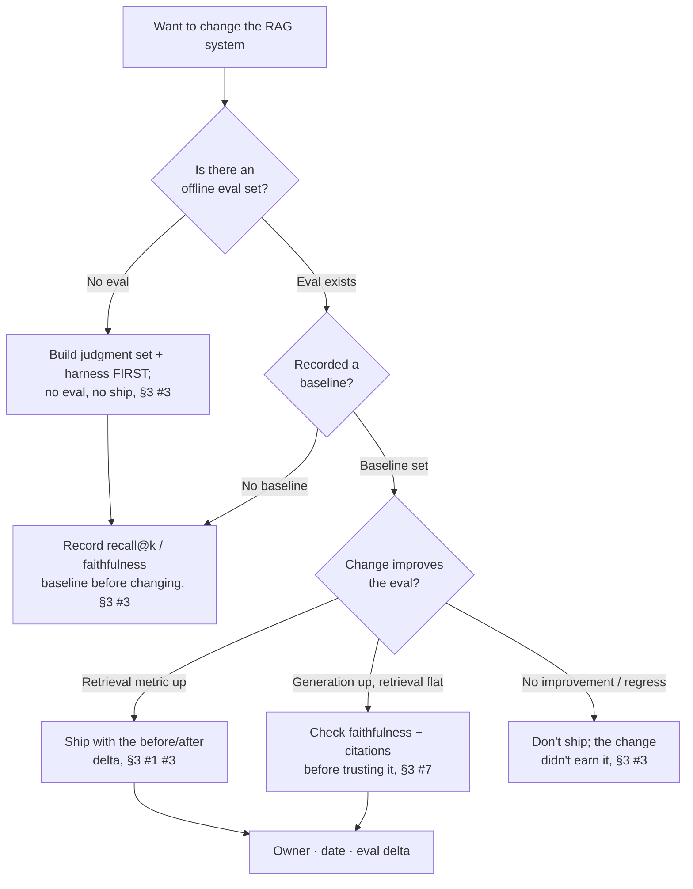
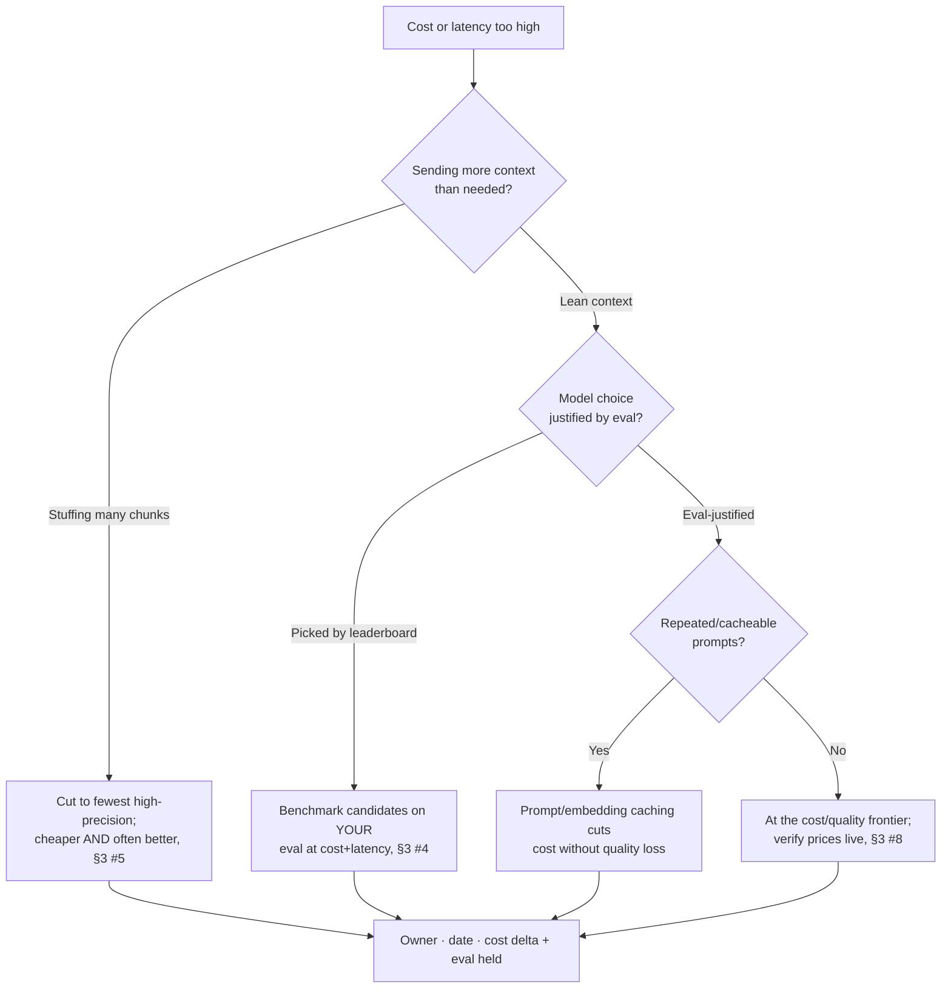

# AI / RAG Engineering Decision Trees

> Mermaid decision trees for the three most common triage paths. Traverse top-to-bottom and pick the smaller-blast-radius leaf — don't keyword-match the symptom to a method. Each tree encodes the team's house opinions (CLAUDE.md §3).

## Tree 1 — Build/trust a RAG change



## Tree 2 — RAG gives wrong answers

```mermaid
flowchart TD
    A[Wrong answers] --> B{Recall@k:<br/>is the passage retrieved?}
    B -- "Low recall" --> C{Why is retrieval<br/>missing it?}
    C -- "Answer split across chunks" --> C1[Chunking bug: structure-aware<br/>chunking, route to ingestion, §3 #2]
    C -- "Keyword/ID query" --> C2[Add hybrid (BM25 + vector),<br/>§3 #6]
    C -- "Semantic gap" --> C3[Embedding choice; benchmark<br/>on the corpus, §3 #4]
    B -- "High recall, still wrong" --> D{Faithful to the<br/>retrieved context?}
    D -- "Not grounded" --> D1[Grounding/guardrail problem:<br/>citations + refuse-on-empty, §3 #7]
    D -- "Too much context" --> D2[Lost-in-the-middle: fewer,<br/>higher-precision chunks, §3 #5]
    C1 --> E[Re-measure eval · owner · date, §3 #3]
    C2 --> E
    C3 --> E
    D1 --> E
    D2 --> E
```

## Tree 3 — Quality vs cost tradeoff



## How to read these

- **Decompose before you act** — the first node of each tree is usually a STOP that prevents acting on an aggregate you haven't yet split.
- **Fix the constraint before adding volume** — more input into a leaking process wastes resource.
- Every leaf ends in the §6 Output Contract: owner · date · expected metric movement.
