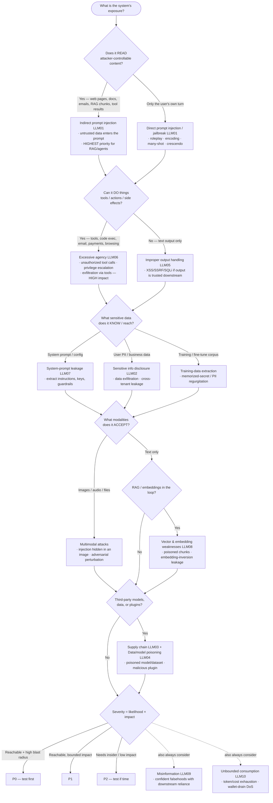

# Knowledge — AI attack-taxonomy decision tree

> **Last reviewed:** 2026-07-09 · **Confidence:** Medium-High (consensus on the OWASP LLM Top 10 2025 categories, the MITRE ATLAS framing, and the direct-vs-indirect-injection / excessive-agency prioritization; **specific model-version behaviors, named jailbreak techniques, and harness feature sets are volatile — carry retrieval dates and re-verify before a client commitment**).
> The most-asked AI-red-team question is "what should we attack first?". This is the decision tree the `ai-redteam-lead` traverses **before** naming an attack, plus the OWASP LLM Top 10 (2025) mapping, the MITRE ATLAS anchor, the likelihood×impact severity table, and the seams to adjacent plugins.

The team's discipline: **derive the attack taxonomy from the system's assets × attackers × trust boundaries first, name the specific jailbreak/injection technique second.** Content-policy / harmful-content-at-scale questions are **safety**, not this security layer — they leave for `trust-and-safety`; quality-regression eval leaves for `llm-evaluation-engineering`; non-AI pentest leaves for `security-engineering`.

---

## Decision Tree: prioritizing the attack surface

Traverse top-to-bottom. Gate on **what the system READS** (untrusted content in the prompt), then **what it can DO** (tools/actions), then **what it KNOWS** (sensitive data / training set), then **what it ACCEPTS** (modalities), then **what it depends ON** (supply chain).

---

## OWASP LLM Top 10 (2025 edition) — the class map

| ID | Class | What the red-teamer probes | Typical highest-impact target |
|---|---|---|---|
| **LLM01** | **Prompt injection** (direct + indirect) | Override instructions via the user turn OR via content the model reads (web/doc/RAG/tool result) | Any model; indirect is the defining risk for RAG + agents |
| **LLM02** | **Sensitive information disclosure** | Coax out PII, secrets, business data, cross-tenant data | Multi-tenant assistants, data-connected bots |
| **LLM03** | **Supply chain** | Poisoned base model, tampered dataset, malicious plugin/adapter | Fine-tuned / plugin-extended systems |
| **LLM04** | **Data & model poisoning** | Corrupt training/fine-tune/RAG data to implant behavior or backdoors | RAG corpora, continuous-learning loops |
| **LLM05** | **Improper output handling** | Model output trusted downstream → XSS, SSRF, SQLi, code exec | Output rendered as HTML / fed to a shell/DB |
| **LLM06** | **Excessive agency** | Induce unauthorized tool calls, privilege escalation, action-taking | Tool-using agents (email, payments, code exec) |
| **LLM07** | **System prompt leakage** | Extract the system prompt, embedded keys, guardrail logic | Any bot with a secret-bearing system prompt |
| **LLM08** | **Vector & embedding weaknesses** | Poison retrieved chunks; embedding-inversion to leak source text | RAG / vector-store-backed systems |
| **LLM09** | **Misinformation** | Elicit confident falsehoods where a human relies on them | Advice/decision-support assistants |
| **LLM10** | **Unbounded consumption** | Token/compute/cost exhaustion; wallet-drain denial-of-service | Metered/paid API-backed deployments |

> **Volatile:** the OWASP LLM Top 10 is versioned (this maps the **2025** edition); category names/IDs shift between editions. Treat this as a 2026-07 snapshot and re-verify the current edition before quoting IDs in a deliverable.

---

## MITRE ATLAS — the adversary-lifecycle anchor

Where OWASP names the *risks*, **MITRE ATLAS** (Adversarial Threat Landscape for AI Systems) maps the *adversary tactics & techniques* across the lifecycle — reconnaissance, resource development, initial access, ML model access, execution, persistence, exfiltration, impact. Use ATLAS to structure the *campaign* (how an attacker chains steps, e.g. recon a model → craft an injection → exfiltrate data) and OWASP to enumerate the *findings*. The two are complementary: ATLAS is the kill-chain, OWASP is the checklist. _(ATLAS technique IDs evolve — retrieved 2026-07-09; re-verify before pinning a specific technique ID.)_

---

## Direct vs indirect prompt injection — the distinction that drives everything

- **Direct** — the *user* is the attacker, typing the malicious instruction into their own turn (a jailbreak: roleplay/DAN, encoding, many-shot, crescendo). The blast radius is usually *that user's own session*.
- **Indirect** — the attacker plants the instruction in **content the model later reads** (a web page it browses, a document in the RAG store, an email it summarizes, a tool's response). The victim is a *different* user or the system itself. This is the **defining** LLM-security problem: the model cannot reliably tell "data to process" from "instructions to obey" once both are in the context window.

**Rule:** the instant a system reads attacker-controllable content, treat every such seam as hostile input — indirect injection outranks direct on any RAG or tool-using system.

---

## Severity: likelihood × impact

| | **Impact: low** (words only) | **Impact: med** (data leak, one user) | **Impact: high** (action/exfil, many users) |
|---|---|---|---|
| **Likelihood: high** (public, no auth) | P2 | P1 | **P0** |
| **Likelihood: med** (auth'd user) | P3 | P2 | P1 |
| **Likelihood: low** (insider/complex) | P3 | P3 | P2 |

Impact rises with **what the system can do** (a jailbroken chatbot leaks text; a jailbroken agent with a payments tool takes money) and **how many** it affects (single session vs cross-tenant). Likelihood rises with **reachability** (public + unauthenticated + no rate limit). Set severity at scoping, triage findings against it — don't argue it during the fire.

---

## Seams (AI red-teaming is the adversarial-security layer, not a rival to the others)

- **Quality / capability regression eval, LLM-as-judge, benchmark scoring** → `llm-evaluation-engineering` (the "is it *good*?" question — distinct from "can an adversary *break* it?").
- **Platform content-moderation, T&S policy, abuse-at-scale on user-generated content** → `trust-and-safety` (the safety half of the safety-vs-security split).
- **Application / infrastructure / network penetration testing** → `security-engineering` (the non-AI attack surface).
- **The RAG retrieval/grounding architecture a poisoning/injection finding implicates** → `ai-rag-engineering`; **the Claude app/agent build** → `claude-app-engineering`.

---

## Provenance

- OWASP Top 10 for LLM Applications **2025** edition (LLM01–LLM10 as mapped above) and MITRE ATLAS framing, reviewed 2026-07-09 — **Medium-High confidence** on the durable categories.
- Direct-vs-indirect injection, excessive-agency-as-highest-impact, and likelihood×impact triage are consensus practice across the LLM-security literature, reviewed 2026-07-09.
- **Volatile:** OWASP edition/IDs, ATLAS technique IDs, named jailbreak techniques, and model-version behaviors change frequently — treat all specifics as a 2026-07 snapshot and re-verify with `ravenclaude-core/deep-researcher` before a client commitment.
