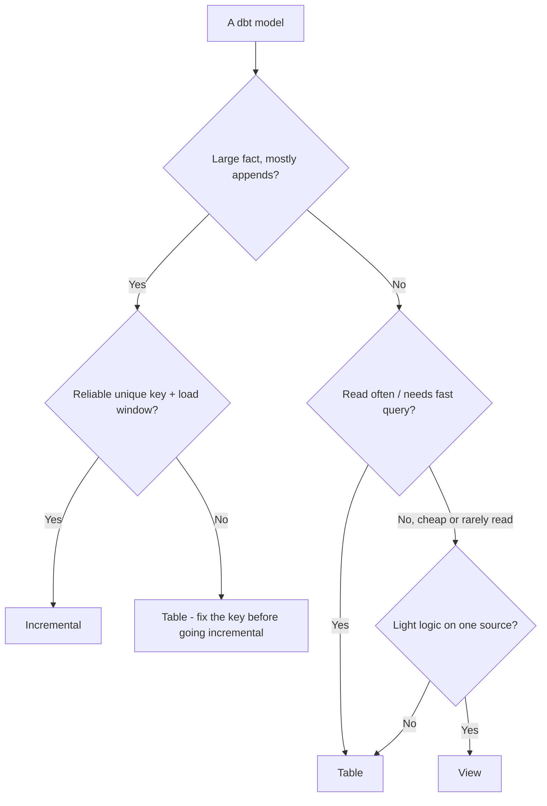
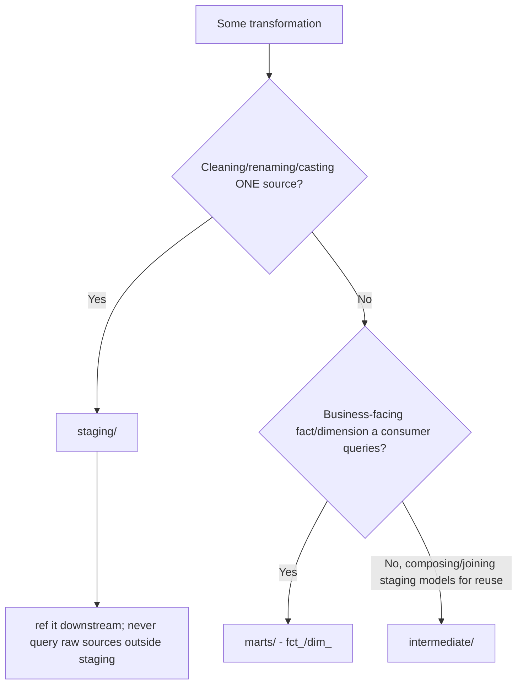
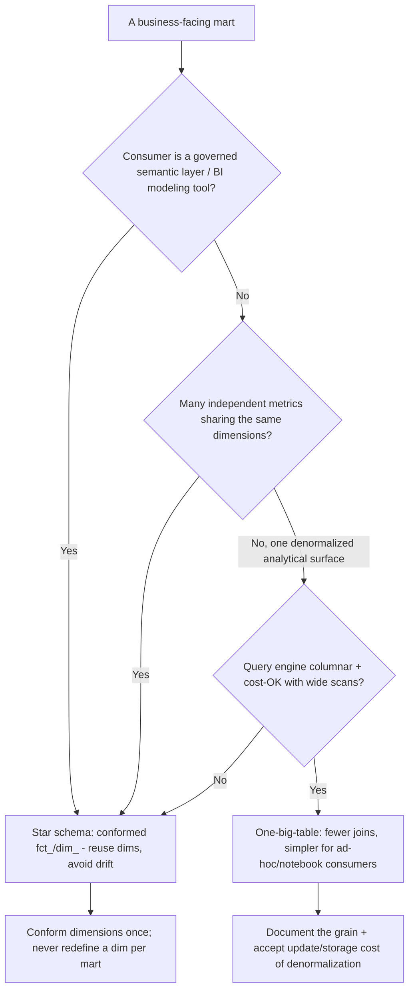
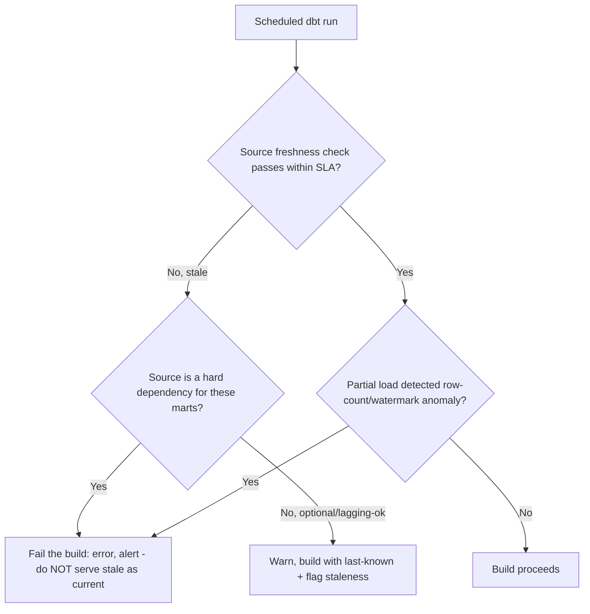
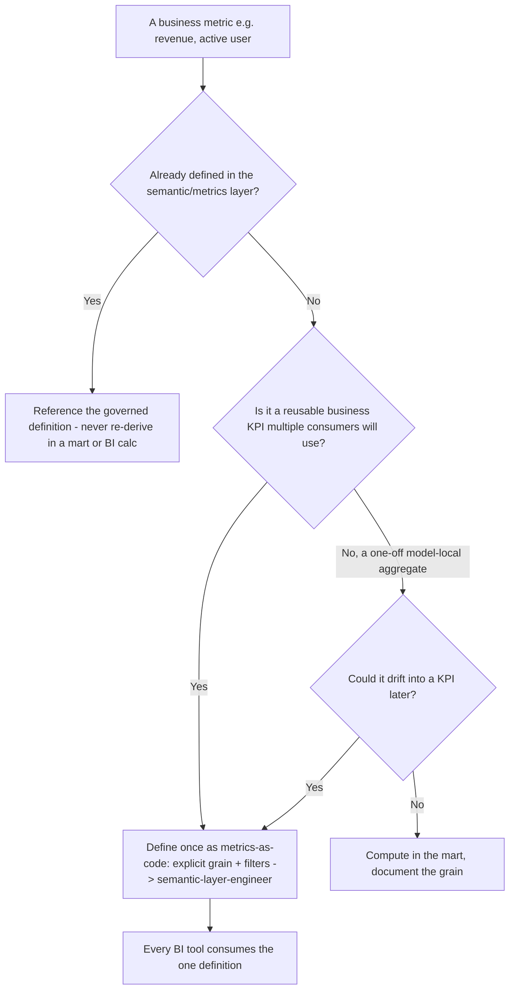

# Analytics Engineering — Decision Trees

_Decision trees + a dated capability map. Capability rows are `[verify-at-build]` — re-check against the vendor before quoting. Last reviewed: 2026-06-04._

Traverse before choosing a materialization or a model layer.

## Decision Tree: dbt materialization choice

Match the materialization to read frequency, size, and rebuild cost.

_A broken incremental silently drops/dups rows — only go incremental with a reliable unique key._

## Decision Tree: Which model layer does this belong in?

Keep transformations layered; don't smear logic across one mega-model.

## Decision Tree: Star schema or one-big-table for this mart?

Choose the mart shape by who queries it and how, not by dogma.

_Star schema buys reuse and conformed dimensions; OBT buys join-free simplicity. Name the trade; don't default to OBT to dodge dimensional modeling._

## Decision Tree: Is the source fresh enough to build?

Gate the build on freshness so stale or partial loads don't ship as complete.

_Freshness is the boundary check on ingestion (data-platform's lane): if upstream didn't deliver, fail loudly, don't fabricate a confident wrong answer._

## Decision Tree: Where should this metric be defined?

A metric belongs in the semantic layer once, not re-derived per dashboard.

_The moment two dashboards compute the 'same' metric differently, trust in all of them is gone. Definition lives in the semantic layer; the mart provides the grain-correct base._

## Capability map (dated — verify at build)

| Capability | 2026 state `[verify-at-build]` | Notes |
|---|---|---|
| dbt Core / Cloud | GA | staging/intermediate/marts; tests; docs |
| dbt Semantic Layer / MetricFlow | GA | metrics-as-code; one definition |
| dbt model contracts | GA | enforce names/types at boundaries |
| Incremental strategies | GA (merge/insert_overwrite/append) | warehouse-dependent |
| Snowflake/BigQuery/Redshift/Databricks | GA | warehouse-neutral modeling; mind cost model |
| Source freshness | GA | gate stale data |
