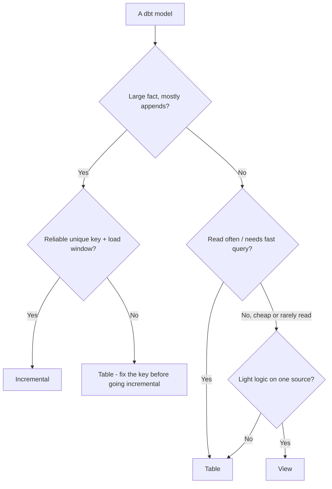
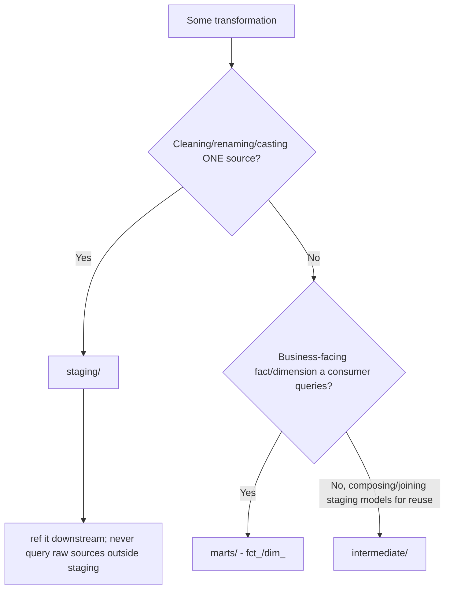

# Analytics Engineering — Decision Trees

_Decision trees + a dated capability map. Capability rows are `[verify-at-build]` — re-check against the vendor before quoting. Last reviewed: 2026-06-04._

Traverse before choosing a materialization or a model layer.

## Decision Tree: dbt materialization choice

Match the materialization to read frequency, size, and rebuild cost.

_A broken incremental silently drops/dups rows — only go incremental with a reliable unique key._

## Decision Tree: Which model layer does this belong in?

Keep transformations layered; don't smear logic across one mega-model.

## Capability map (dated — verify at build)

| Capability | 2026 state `[verify-at-build]` | Notes |
|---|---|---|
| dbt Core / Cloud | GA | staging/intermediate/marts; tests; docs |
| dbt Semantic Layer / MetricFlow | GA | metrics-as-code; one definition |
| dbt model contracts | GA | enforce names/types at boundaries |
| Incremental strategies | GA (merge/insert_overwrite/append) | warehouse-dependent |
| Snowflake/BigQuery/Redshift/Databricks | GA | warehouse-neutral modeling; mind cost model |
| Source freshness | GA | gate stale data |
