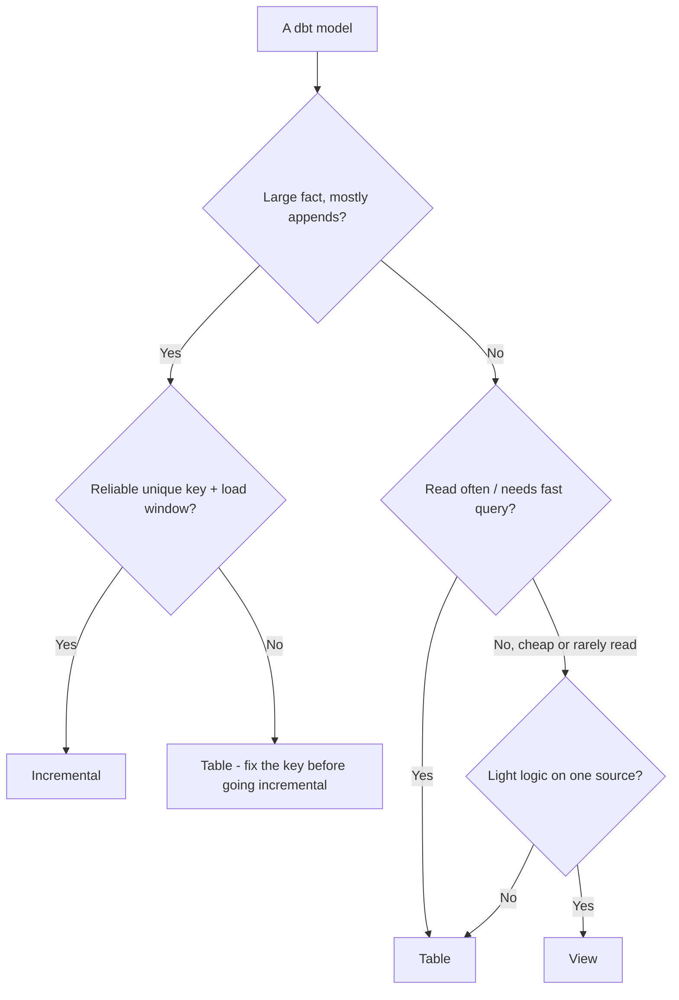
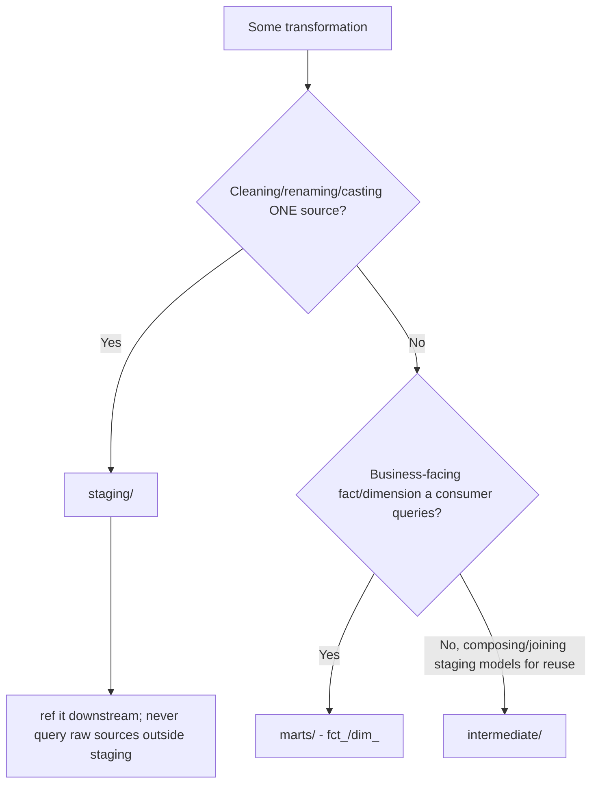
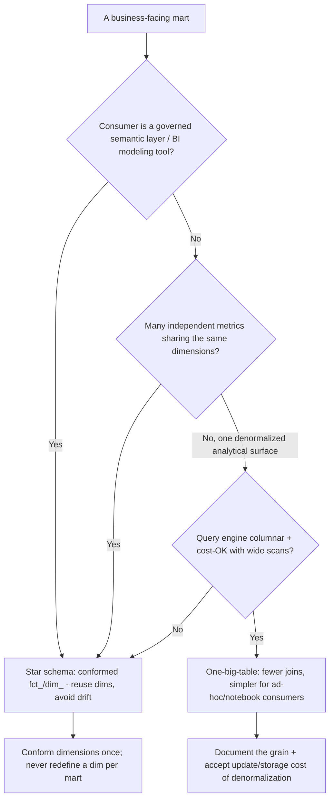
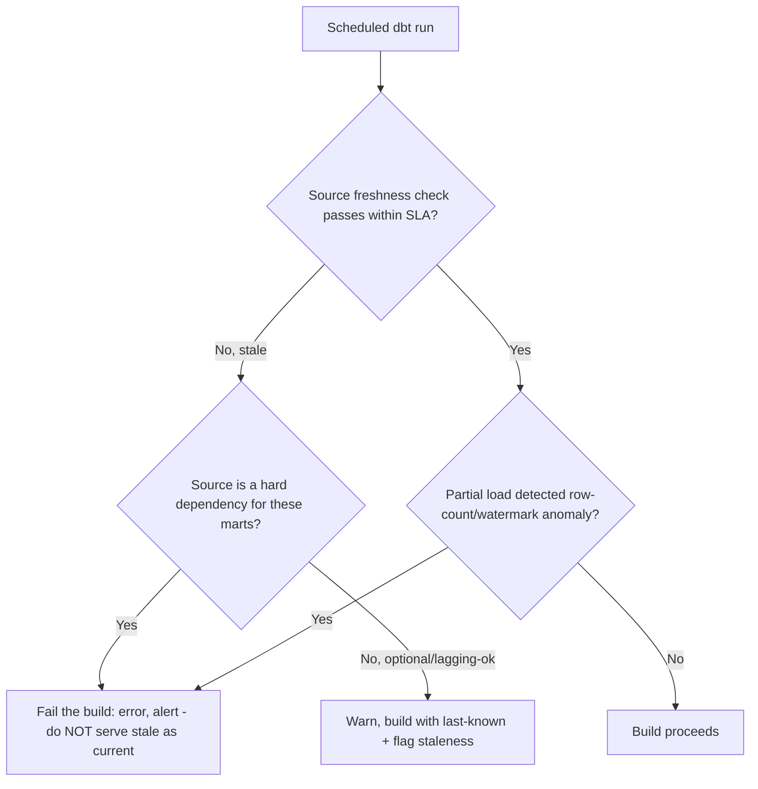
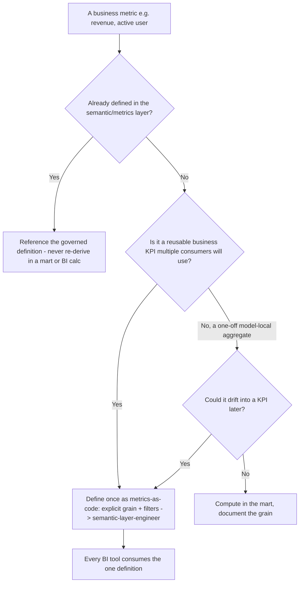
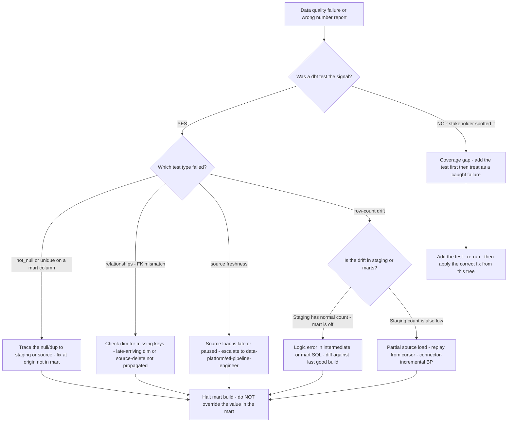
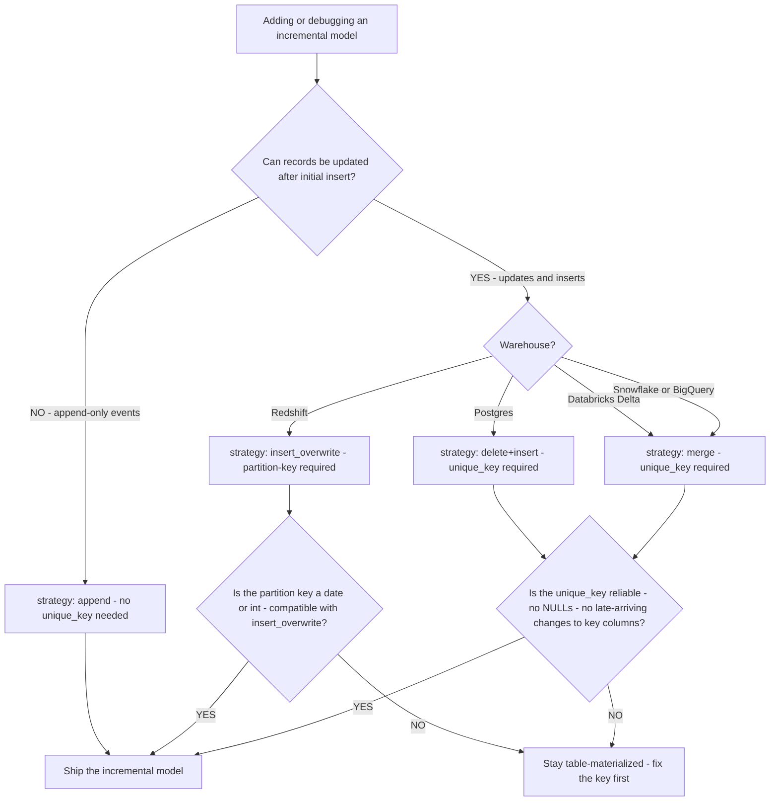
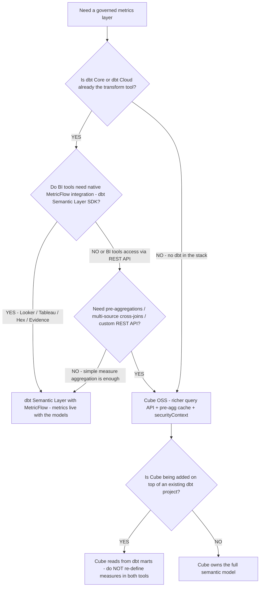

# Analytics Engineering — Decision Trees

_Decision trees + a dated capability map. Capability rows are `[verify-at-build]` — re-check against the vendor before quoting. Last reviewed: 2026-06-04._

Traverse before choosing a materialization or a model layer.

## Decision Tree: dbt materialization choice

Match the materialization to read frequency, size, and rebuild cost.

_A broken incremental silently drops/dups rows — only go incremental with a reliable unique key._

## Decision Tree: Which model layer does this belong in?

Keep transformations layered; don't smear logic across one mega-model.

## Decision Tree: Star schema or one-big-table for this mart?

Choose the mart shape by who queries it and how, not by dogma.

_Star schema buys reuse and conformed dimensions; OBT buys join-free simplicity. Name the trade; don't default to OBT to dodge dimensional modeling._

## Decision Tree: Is the source fresh enough to build?

Gate the build on freshness so stale or partial loads don't ship as complete.

_Freshness is the boundary check on ingestion (data-platform's lane): if upstream didn't deliver, fail loudly, don't fabricate a confident wrong answer._

## Decision Tree: Where should this metric be defined?

A metric belongs in the semantic layer once, not re-derived per dashboard.

_The moment two dashboards compute the 'same' metric differently, trust in all of them is gone. Definition lives in the semantic layer; the mart provides the grain-correct base._

## Decision Tree: Data quality failure triage — what broke and where is the fix?

**When this applies:** a dbt test fails in CI or production, OR a stakeholder reports a wrong number on a dashboard. Observable inputs: which test failed (schema vs freshness vs row-count), which layer the failing model lives in, and whether the failure is structural (wrong type/null) or statistical (wrong count/value).

**Last verified:** 2026-06-05 against `skills/data-quality-tests/SKILL.md` (analytics-engineering plugin).

**Rationale per leaf:**
- *NOTEST* — if no test caught it, the coverage is the defect; add the test before fixing the value so the next occurrence is caught automatically.
- *UPSTREAM* — a not_null or unique failure in a mart means the problem is in the source or staging clean; patching the mart value is the wrong fix layer.
- *FK* — late-arriving or deleted dimension keys are the most common FK failure; the fix is in the dim load cadence or the soft-delete handling, not in the fact.
- *FRESH* — a freshness failure is data-platform's lane (the load didn't complete); the transform layer should halt, not build on stale data.
- *LOGIC* — if staging is correct but the mart count is wrong, the error is in the transform SQL — diff the mart build against the last passing run to isolate the change.
- *PARTIAL* — if both staging and mart counts are low, the source load itself was partial; the fix is a connector replay, not a dbt fix.
- *HALT* — in all branches, halt the mart build (don't serve the wrong number) until the root cause is fixed upstream.

**Tradeoffs summary:**

| Failure class | Fix layer | Correct action | Wrong action |
|---|---|---|---|
| not_null / unique | Source or staging | Fix at origin, replay | Override in mart |
| FK relationships | Dim load / source | Fix dim, re-run | Left-join around the null |
| Source freshness | Ingestion (data-platform) | Halt build, escalate | Build on stale data |
| Row-count drift (staging OK) | Transform SQL | Diff + fix the logic | Re-run until it "looks right" |
| Row-count drift (staging low) | Source load | Connector replay | Full-refresh the fact |

---

## Decision Tree: Incremental model — which strategy for this warehouse?

**When this applies:** a model is being converted from `table` to `incremental`, or an existing incremental model is producing wrong results (duplicate rows, missing updates). Observable inputs: warehouse dialect, whether records can be updated after insert, and the availability of a reliable unique key.

**Last verified:** 2026-06-05 against dbt Core docs (v1.8) and warehouse-specific incremental strategy support.

**Rationale per leaf:**
- *APPEND* — append-only event logs (clicks, webhook events) never update rows; no unique_key dedup is needed and `append` is the fastest strategy.
- *MERGE* — the standard strategy on Snowflake/BigQuery/Databricks; deduplicates on the unique_key using a MERGE statement.
- *INSERT_OVR* — Redshift performs better with partition-based overwrite than row-level MERGE; the partition key must align with the query filter.
- *DELETE+INSERT* — Postgres doesn't support MERGE natively (pre-15); delete matching rows then re-insert is the correct approach.
- *TABLE* — if the unique_key has NULLs or key columns can change (making the merge key unreliable), stay on `table` until the key is fixed; a broken incremental silently drops or duplicates rows.

**Tradeoffs summary:**

| Strategy | Warehouse | Unique key required | Update support | Use when |
|---|---|---|---|---|
| append | All | No | No | Append-only event streams |
| merge | Snowflake/BigQuery/Databricks | Yes | Yes | Standard updatable fact |
| insert_overwrite | Redshift | No (partition key) | Partition-level | Redshift date-partitioned facts |
| delete+insert | Postgres | Yes | Yes | Postgres updatable fact |

---

## Decision Tree: Semantic layer tool — dbt Semantic Layer or Cube?

**When this applies:** a project needs a governed metrics layer and must choose between dbt Semantic Layer / MetricFlow and Cube. Observable inputs: whether the project already uses dbt, whether a custom query API / pre-aggregations / multi-source joins are needed, and whether the BI tools in use have native MetricFlow integration.

**Last verified:** 2026-06-05 against dbt Semantic Layer GA docs and Cube OSS v0.35 docs.

**Rationale per leaf:**
- *DBTSL* — when dbt is already the transform layer and BI tools have MetricFlow integration, keeping the metric definition alongside the model (in `schema.yml`) is the lowest-friction governance path.
- *CUBE* — pre-aggregations, complex multi-source joins, and a custom REST API are Cube's differentiated capabilities; MetricFlow does not support pre-aggregation caching.
- *NODUP* — adding Cube on top of dbt means Cube reads from dbt marts; never redefine the same measure in both tools or the single-definition principle breaks immediately.
- *CUBEFULL* — without dbt, Cube owns the full semantic model from the warehouse tables up.

**Tradeoffs summary:**

| Tool | Pre-aggregation cache | BI integrations | Co-location with dbt models | Use when |
|---|---|---|---|---|
| dbt Semantic Layer / MetricFlow | No | Native SDK integrations | Yes (schema.yml) | dbt stack + SDK-native BI tools |
| Cube OSS | Yes | REST / GraphQL / SQL | Via mart refs | Need pre-agg, custom API, or no dbt |
| Both (Cube reads dbt marts) | Yes | REST / GraphQL | Partial | Existing dbt project needing pre-agg |

---

## Capability map (dated — verify at build)

| Capability | 2026 state `[verify-at-build]` | Notes |
|---|---|---|
| dbt Core / Cloud | GA | staging/intermediate/marts; tests; docs |
| dbt Semantic Layer / MetricFlow | GA | metrics-as-code; one definition |
| dbt model contracts | GA | enforce names/types at boundaries |
| Incremental strategies | GA (merge/insert_overwrite/append) | warehouse-dependent |
| Snowflake/BigQuery/Redshift/Databricks | GA | warehouse-neutral modeling; mind cost model |
| Source freshness | GA | gate stale data |
