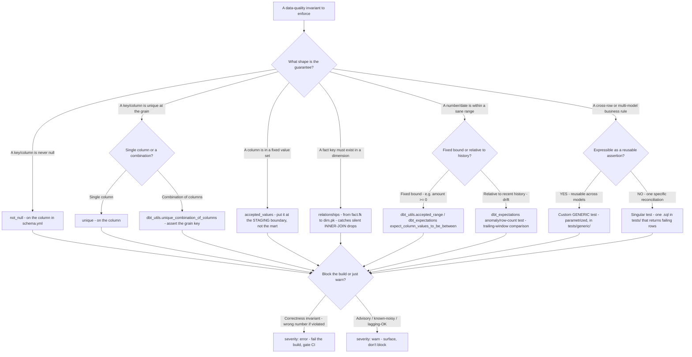
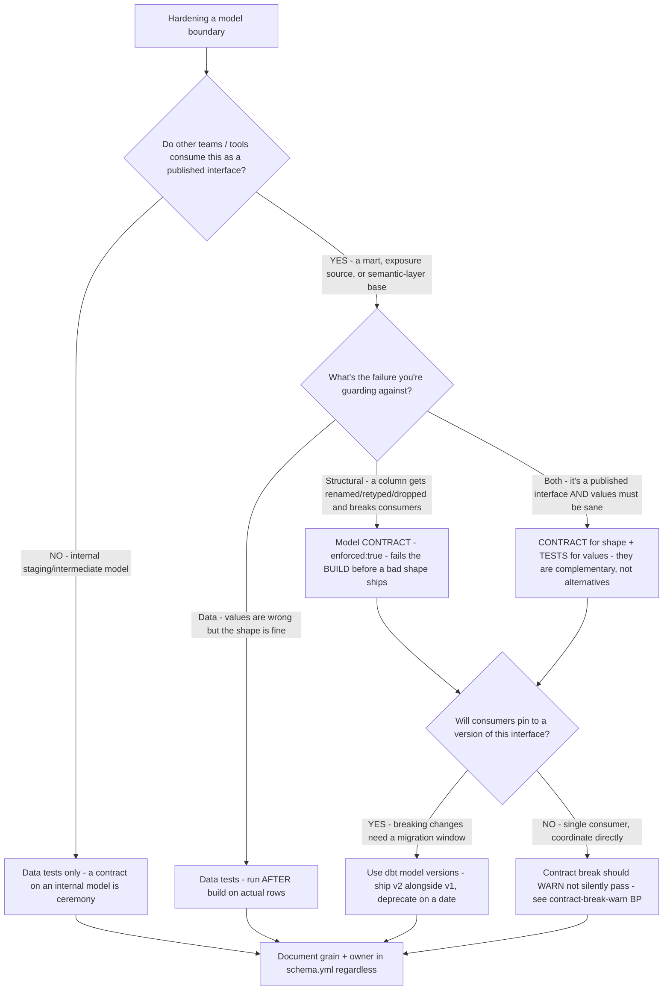

# Analytics Engineering — Data-Quality & Contract Decision Trees

_Topic-specific decision trees complementing [`analytics-engineering-decision-trees.md`](analytics-engineering-decision-trees.md) (which carries materialization, model-layer, star-vs-OBT, freshness-gate, metric-placement, DQ-failure-triage, incremental-strategy, and semantic-tool trees). This file adds the **test-type selection** and **contract-vs-test enforcement** trees — the "which guarantee, expressed how" decisions — plus a dated capability note. Traverse the relevant tree before adding a test or a contract._

_Capability rows are `[verify-at-use]` — re-check against the vendor before quoting. Last reviewed: 2026-06-05._

## Decision Tree: Which dbt test expresses this data-quality guarantee?

**When this applies:** you have a data-quality invariant you want to enforce (a column must be unique, a value must be in a set, a fact's keys must exist in a dimension, a number must be within a sane range) and need to pick the test that encodes it at the right layer. Observable inputs: is the guarantee about a single column, a relationship between models, a categorical domain, a numeric/temporal range, or a cross-row business rule?

**Last verified:** 2026-06-05 against dbt Core test docs (generic tests `not_null`/`unique`/`accepted_values`/`relationships`), the `dbt_utils` and `dbt_expectations` package test catalogs, and `schema.yml` data-test syntax. Package names + the exact test list are version-volatile `[verify-at-use]`.

**Rationale per leaf:**

- **not_null / unique** — the two built-in generic tests; cheap, and the floor of any coverage. They are necessary but *not sufficient* — a project with only PK `not_null`+`unique` ships structurally-valid corruption green (see the test-coverage scenario).
- **unique_combination_of_columns** — when the grain key is composite (e.g. `customer_id` + `order_date`), a single-column `unique` won't assert the grain; this `dbt_utils` test does. Use it to back a stated grain.
- **accepted_values at staging** — validate categorical domains *where the source lands*, so a renamed/added code fails at the edge instead of leaking a `NULL` into a downstream join. Putting it on the mart catches the symptom too late.
- **relationships** — the highest-value under-used test: an `INNER JOIN` that drops unmatched fact rows is the classic silent-revenue-loss bug; a `relationships` test makes the orphaned key loud.
- **accepted_range / between** — for numeric/temporal sanity (amount ≥ 0, date not in the future). `dbt_utils.accepted_range` or `dbt_expectations` cover this; pick the package the project already uses.
- **anomaly / row-count** — for drift that has no schema-level signal (a sudden row-count drop, a metric outside its trailing band). Requires history; inherently statistical, so often `warn` first.
- **custom generic** — when the rule is reusable across models, write a parametrized generic test once and apply it in `schema.yml`. Don't copy-paste a singular test per model.
- **singular** — a one-off reconciliation (e.g. "mart total equals source total for the trailing 3 days") that isn't worth generalizing — one `.sql` in `tests/` that returns the failing rows.
- **severity: error vs warn** — a *correctness* invariant (violation = wrong number) errors and gates CI; an *advisory* or known-noisy check warns so it surfaces without blocking. Defaulting everything to `error` trains people to ignore the build; defaulting everything to `warn` makes the gate decorative.

**Tradeoffs summary:**

| Guarantee | Test | Layer | Default severity |
|---|---|---|---|
| Never null | `not_null` | column | error |
| Unique at grain (single) | `unique` | column | error |
| Unique at grain (composite) | `dbt_utils.unique_combination_of_columns` | model | error |
| Value in fixed set | `accepted_values` | **staging** | error |
| FK exists in dim | `relationships` | mart join | error |
| Number/date in range | `accepted_range` / `expect_*_between` | column | error or warn |
| Drift vs history | anomaly / row-count | model | warn → error |
| Reusable business rule | custom generic | tests/generic/ | per-rule |
| One-off reconciliation | singular | tests/ | error |

---

## Decision Tree: Model contract, schema test, or both for this boundary?

**When this applies:** you're hardening a model that other people (or other teams) depend on and must decide between a dbt **model contract** (`enforced: true` — column names + data types checked at *build* time, before the model materializes) and **schema/data tests** (checked *after* the model builds, on the actual rows). They guard different failure modes; the question is which boundary needs which. Observable inputs: is the model a published interface other teams consume, and is the risk a *structural* break (renamed/retyped column) or a *data* break (bad values that are structurally fine)?

**Last verified:** 2026-06-05 against dbt model-contracts docs (`contract: {enforced: true}`, build-time column/type enforcement) and the data-test model above. Contract behavior + supported constraint types are warehouse- and version-dependent `[verify-at-use]`.

**Rationale per leaf:**

- **TESTSONLY** — a contract on an internal staging/intermediate model is ceremony: no external consumer is pinned to its shape, so build-time type enforcement just adds friction. Tests (and a documented grain/owner) are enough.
- **CONTRACT** — enforces column names + data types at *build* time, before the model materializes, so a renamed/retyped/dropped column fails the build instead of silently breaking every downstream consumer. This guards *shape*, not *values*.
- **TESTS** — run *after* the model builds, on the actual rows; they guard *values* (nulls, dups, orphans, ranges, drift). A contract can't catch a structurally-valid wrong number, and a test can't catch a build-time type drift before it ships — different boundaries.
- **BOTH** — a published interface that other teams consume needs *both*: the contract pins the shape consumers code against, the tests guarantee the values are sane. They are complementary layers, never an either/or.
- **VERSIONED** — when consumers pin to the interface, a breaking change needs a migration window: ship `v2` alongside `v1` (dbt model versions) and deprecate on a stated date, rather than mutating the contract under live consumers.
- **WARN_BREAK** — a contract break should surface loudly (warn, not silently pass) so the boundary owner sees it — see [`../best-practices/contract-break-warn-not-silent.md`](../best-practices/contract-break-warn-not-silent.md).

**Tradeoffs summary:**

| | Model contract (`enforced: true`) | Data/schema tests |
|---|---|---|
| Checked when | Build time (before materialize) | After build (on actual rows) |
| Guards against | Structural break — renamed/retyped/dropped column | Data break — nulls, dups, orphans, bad ranges, drift |
| Catches a wrong *value* | No | Yes |
| Catches a type/shape drift before it ships | Yes | No |
| Use on internal staging models | Rarely (ceremony) | Yes |
| Use on published marts / exposure sources | Yes | Yes — both |

---

## Capability note (dated — verify at use)

| Capability | 2026 state `[verify-at-use]` | Notes |
|---|---|---|
| dbt generic tests (`not_null`/`unique`/`accepted_values`/`relationships`) | GA, built-in | the coverage floor; PK-only coverage is insufficient |
| `dbt_utils` test catalog (`unique_combination_of_columns`, `accepted_range`, …) | GA, community package | pin the package version; re-confirm test names |
| `dbt_expectations` (Great-Expectations-style tests) | GA, community package | richer range/anomaly assertions; pin the version |
| dbt model contracts (`contract: {enforced: true}`) | GA | build-time name/type enforcement; constraint support is warehouse-dependent |
| dbt model versions | GA | versioned interfaces + deprecation dates for published models |
| Test severity (`error`/`warn`) + `store_failures` | GA | gate correctness invariants on `error`; advisory checks on `warn` |

> Package names (`dbt_utils`, `dbt_expectations`), the exact test inventories, and contract/constraint support per warehouse are all version-volatile — re-confirm against the dbt Hub package page and the dbt docs before quoting a specific test or constraint. Sources (retrieved 2026-06-05): dbt Core test & model-contract documentation at docs.getdbt.com; the `dbt_utils` and `dbt_expectations` package listings on the dbt package hub.
