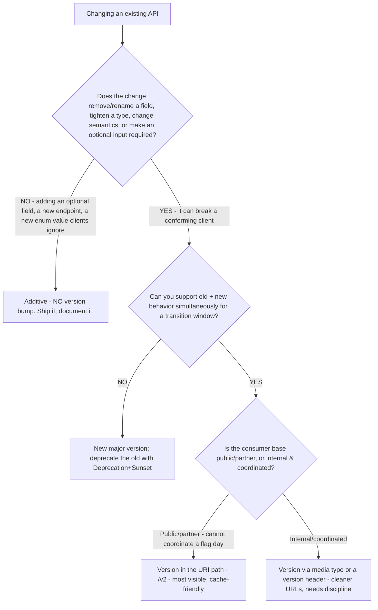
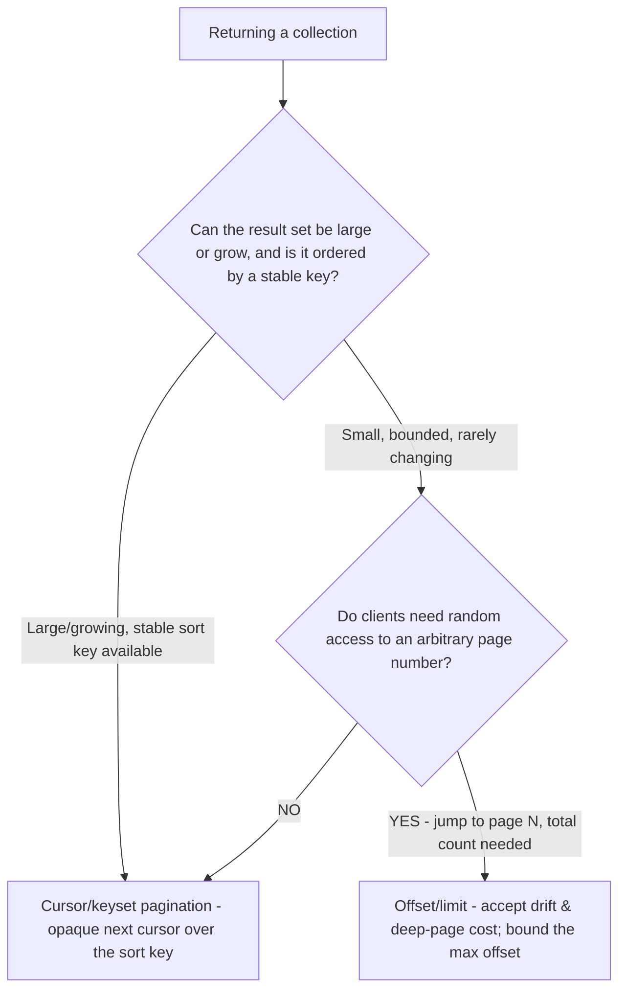

# API Engineering — design decision trees & spec capability map

**Last reviewed:** 2026-06-04 · **Confidence:** medium-high (first-party specs + IETF datatracker, web-verified this date). Volatile facts (spec versions/features, IETF draft status) carry inline markers + per-tree `Last verified` dates; re-verify on the Researcher sweep before quoting.

> Canonical decision trees for the `api-design-architect` (and the pagination tree for `api-implementation-engineer`). Traverse the relevant tree top-to-bottom against the observable situation **before** choosing a method (per the pre-action-traversal prior in [`../CLAUDE.md`](../CLAUDE.md) §5). Default to the smaller-blast-radius leaf; escalate only when it demonstrably fails.

---

## Decision Tree: API paradigm selection (REST vs GraphQL vs gRPC vs webhooks/async)

**When this applies:** You are choosing the wire paradigm for a new API or service interface, before writing the contract.

**Last verified:** 2026-06-04 against the OpenAPI/AsyncAPI/gRPC project docs. `[verify-at-build]` — tooling maturity shifts.

```mermaid
flowchart TD
    START[New API surface to expose] --> Q1{Is the interaction request/response, or event/notification?}
    Q1 -->|Event: "tell me when X happens"| Q2{Do you push to the consumer, or do they subscribe to a broker?}
    Q2 -->|Push HTTP callback to a registered URL| WEBHOOK[Webhooks - document with AsyncAPI 3.0]
    Q2 -->|Pub/sub over a broker - Kafka/AMQP/MQTT/WebSocket| ASYNC[Event-driven - describe with AsyncAPI 3.0]
    Q1 -->|Request/response| Q3{Primary consumer & network?}
    Q3 -->|Internal service-to-service, low latency, polyglot| Q4{Need browser/public reach or human-readable debugging?}
    Q4 -->|NO - internal mesh| GRPC[gRPC + Protobuf - typed, streaming, fast]
    Q4 -->|YES| REST1[REST/JSON - or gRPC + a REST/JSON transcoding gateway]
    Q3 -->|External/partner/public or mobile/web client| Q5{Do clients need to shape/aggregate reads to avoid over/under-fetching a nested graph?}
    Q5 -->|YES - varied client read shapes, deep nesting| GRAPHQL[GraphQL - accept the caching/complexity-limit cost]
    Q5 -->|NO - resource CRUD, cacheable, broad tooling| REST2[REST over HTTP + OpenAPI 3.1/3.2]
```

**Rationale per leaf:**
- _REST + OpenAPI_ — the default for external resource CRUD: cacheable (HTTP caching), broadest tooling, easiest to debug. Pay in over/under-fetching on deeply nested reads.
- _GraphQL_ — clients shape their own reads; great for varied mobile/web read shapes over a typed graph. Pay in HTTP-caching loss, mandatory query-complexity/depth limiting (a DoS surface — OWASP API4), and N+1 discipline.
- _gRPC + Protobuf_ — internal, low-latency, strongly-typed, streaming; weaker browser/public/debugging story (needs grpc-web or transcoding).
- _Webhooks_ — server pushes to a consumer-registered URL; document the event contract with AsyncAPI; the consumer must validate the sender and the handshake.
- _Event-driven over a broker_ — true pub/sub decoupling; describe channels/operations/messages with AsyncAPI 3.0.

**Tradeoffs summary:**

| Paradigm | Best for | Caching | Pay in |
|---|---|---|---|
| REST/OpenAPI | external resource CRUD | HTTP-native | over/under-fetch on nested reads |
| GraphQL | client-shaped reads, deep graphs | hard (POST) | complexity-limiting, N+1, no HTTP cache |
| gRPC | internal low-latency, streaming | n/a | browser/public reach, debuggability |
| Webhooks (AsyncAPI) | "notify me" push | n/a | sender validation, retries, ordering |
| Event-driven (AsyncAPI) | decoupled pub/sub | n/a | broker ops, delivery semantics |

---

## Decision Tree: API versioning — is it breaking, and how do you carry the version?

**When this applies:** You are changing an existing API and must decide whether to bump the version and where the version lives.

**Last verified:** 2026-06-04. The "additive is not breaking" rule is paradigm-independent.



**Rationale per leaf:**
- _Additive → no bump_ — new optional fields, new endpoints, new enum members a tolerant client ignores. Don't version for these; versioning churn is its own cost. (Requires consumers follow the tolerant-reader / must-ignore-unknown-fields rule.)
- _URI versioning (`/v2`)_ — most visible and unambiguous, trivially cacheable and routable; the pragmatic default for public/partner APIs. Pay in URL churn and parallel maintenance.
- _Header/media-type versioning_ — keeps URLs stable and is "purer," but is easy to get wrong (caching, discoverability) and needs disciplined consumers; reserve for coordinated/internal consumers.
- _New major + deprecate_ — when old and new can't coexist, run the deprecation clock (see the operate-layer tree and `operate-deprecate-with-sunset-headers.md`).

---

## Decision Tree: pagination strategy (offset vs cursor/keyset)

**When this applies:** You are returning a collection and choosing how clients page through it. (Owned by `api-implementation-engineer`; lives here with the design trees.)

**Last verified:** 2026-06-04.



**Rationale per leaf:**
- _Cursor/keyset (default)_ — stable under concurrent inserts/deletes and O(1)-ish on deep pages; return an opaque `next` cursor encoding the keyset position. The right default for anything large or live.
- _Offset/limit_ — only when clients genuinely need page-number random access or a total count on a small, stable set; it **drifts** (rows shift between pages as data changes) and **degrades** on deep pages (`OFFSET 100000` scans and discards). Always bound the max page size and the max offset (OWASP API4).

| Method | Stable under writes | Deep-page cost | Random page access | Use when |
|---|---|---|---|---|
| Cursor/keyset | yes | low | no | large/live collections (default) |
| Offset/limit | no (drifts) | high | yes | small stable sets needing page N |

---

## 2026 spec & standards capability map

**Last verified:** 2026-06-04 (web-verified — OpenAPI Initiative, AsyncAPI, IETF datatracker). Every row is volatile; re-verify before quoting a version/feature/status. `[verify-at-build]`

| Standard | Current | Status / notes |
|---|---|---|
| **OpenAPI** | **3.1.x** and **3.2.0** | 3.1 aligns with JSON Schema (2020-12); **3.2.0 released 2025-09** — hierarchical tags, first-class streaming (SSE/JSON-Lines/multipart), additional/custom HTTP methods, OAuth2 Device flow in-spec. Zero-breaking 3.1→3.2. Default to 3.1+; reach for 3.2 features deliberately. `[verify-at-build]` |
| **AsyncAPI** | **3.0.0** (2023-11) | Splits operations out of channels; the standard for event-driven/message + webhook contracts. `[verify-at-build]` |
| **Arazzo** | **1.0.1** (2025-01) | OpenAPI Initiative workflow-description spec (sequences of API calls); **v1.1 in progress adds AsyncAPI support**. Useful for AI-assisted / multi-step API consumption. `[verify-at-build]` |
| **JSON Schema** | **2020-12** | The schema dialect OpenAPI 3.1 adopts. |
| **RFC 9457 — Problem Details** | RFC (2023-07) | **Obsoletes RFC 7807**; same `application/problem+json` wire format; adds registry + multi-problem guidance. The error model. |
| **RFC 9110 — HTTP Semantics** | RFC (2022) | Authoritative status-code & method semantics. |
| **RFC 8594 — `Sunset` header** | RFC | Signals a resource's retirement time; pair with `Deprecation`. `[verify-at-build]` |
| **`Deprecation` header** | IETF track | Signals a resource is deprecated; verify RFC-vs-draft status before quoting. `[verify-at-build]` |
| **`RateLimit` / `RateLimit-Policy` headers** | **IETF draft** (draft-ietf-httpapi-ratelimit-headers, ~v11, 2026) | **Not yet an RFC** — implement to the current draft and say so. `[verify-at-build]` |
| **`Idempotency-Key` header** | **IETF draft** (draft-ietf-httpapi-idempotency-key-header, ~v07, 2025-10) | **Not yet an RFC** — the convention many APIs already ship; follow the draft. `[verify-at-build]` |
| **OWASP API Security Top 10** | **2023 edition** | BOLA #1; BOPLA, sensitive-business-flows, unsafe-consumption are 2023 framing. Distinct from the OWASP *Web* Top 10. `[verify-at-build]` |

---

## See also

- [`api-security-decision-trees.md`](./api-security-decision-trees.md) — OWASP control map, OAuth2 grant selection, object-vs-function authZ.
- [`api-testing-governance-decision-trees.md`](./api-testing-governance-decision-trees.md) — test-type selection, gateway build-vs-buy.
- [`../best-practices/`](../best-practices/) — the named rules these trees point to.

## Provenance

Synthesized 2026-06-04 from the OpenAPI Initiative (spec.openapis.org), AsyncAPI (asyncapi.com), the IETF HTTPAPI working group datatracker, and the OWASP API Security project. Spec versions and IETF draft statuses are version-sensitive — `[verify-at-build]`.

---

_Last reviewed: 2026-06-04 by `claude`_
