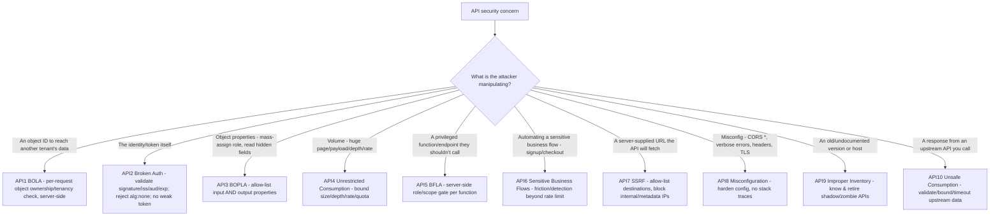
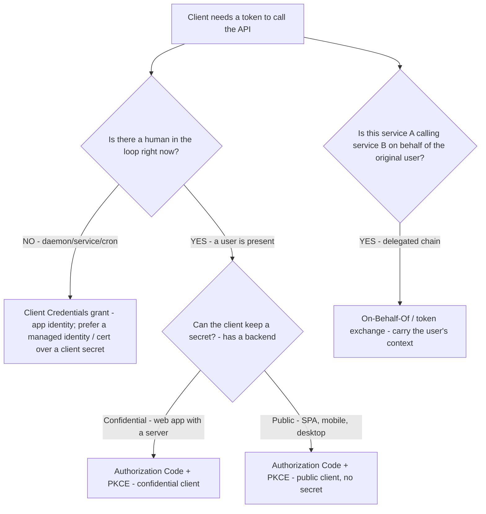
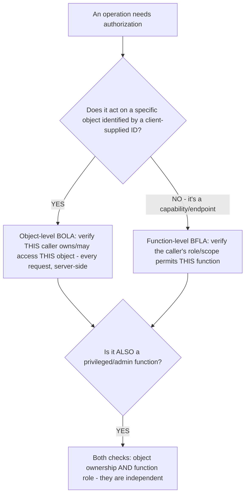
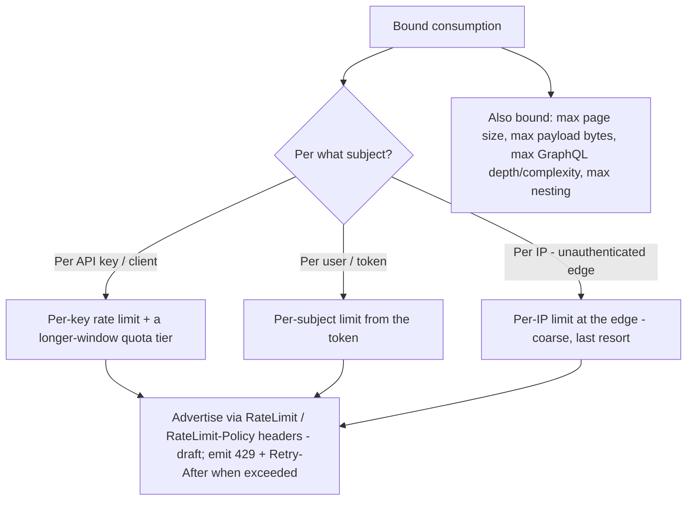

# API Engineering — security decision trees

**Last reviewed:** 2026-06-04 · **Confidence:** medium-high (OWASP API Security project + IETF OAuth, web-verified this date). The OWASP edition/ordering and OAuth grant guidance are volatile; re-verify before quoting a category number. `[verify-at-build]`

> Canonical decision trees for `api-security-engineer`. Traverse the relevant tree top-to-bottom against the observable situation **before** choosing a control (per [`../CLAUDE.md`](../CLAUDE.md) §5). **This plugin designs controls; the acceptability verdict always escalates to `ravenclaude-core/security-reviewer`.**

---

## Decision Tree: OWASP API Security Top 10 (2023) — symptom → category → control

**When this applies:** You have an API surface and need to map a concern (or run a full pass) to the right OWASP API 2023 category and its control.

**Last verified:** 2026-06-04 against owasp.org/API-Security (2023 edition). `[verify-at-build]`

**Priority note:** BOLA (API1) and BFLA (API5) — the two authorization failures — are the highest-frequency API breaches; check them first on any review. BOLA = *another user's data* (object access); BFLA = *a function you shouldn't call* (privilege).

---

## Decision Tree: which OAuth 2.0 grant for which client?

**When this applies:** An API needs token-based auth and you're choosing the grant the client uses to obtain the token. (Token *validation* is always the same: verify it server-side.)

**Last verified:** 2026-06-04 against IETF OAuth 2.0 / OAuth 2.1 guidance (Implicit and ROPC are off the menu). `[verify-at-build]`

**Rationale per leaf:**
- _Authorization Code + PKCE_ — the default for any user-present client; **PKCE for public clients always**, and increasingly for confidential ones too. **Never Implicit, never ROPC** (deprecated/insecure).
- _Client Credentials_ — service-to-service with no user; prefer a workload/managed identity or a certificate over a long-lived client secret.
- _On-Behalf-Of / token exchange_ — a middle-tier API calling a downstream API as the user.
- _Validation (all cases)_ — verify the signature against the issuer's JWKS, check `iss`/`aud`/`exp`/`nbf`, reject `alg: none`. (The end-user *login UX* itself is `auth-identity`'s; this tree is about the API accepting the token.)

---

## Decision Tree: object-level vs function-level authorization

**When this applies:** You're deciding what authorization check an operation needs.

**Last verified:** 2026-06-04.

**Rationale:** object-level and function-level authorization are **independent** and both required when both apply. A correct function check (you're an admin) does not authorize the object (this specific record) and vice versa. Property-level (BOPLA) sits on top: even authorized, allow-list which *fields* the caller may write and read.

---

## Decision Tree: rate-limit & quota strategy

**When this applies:** You're bounding consumption (a cost control *and* OWASP API4 security control).

**Last verified:** 2026-06-04. The `RateLimit` headers are an **IETF draft**, not an RFC. `[verify-at-build]`

**Rationale:** rate limit by the most specific stable subject you have (key > user > IP); pair a short-window *rate* with a longer-window *quota*; **advertise** the limit with the `RateLimit` headers so clients self-throttle, and return `429` + `Retry-After` on breach. Independently bound every other unbounded input (page size, payload, query depth) — those are the consumption vectors a pure rate limit misses.

---

## See also

- [`api-design-decision-trees.md`](./api-design-decision-trees.md) — paradigm, versioning, pagination, capability map.
- [`../best-practices/secure-authorize-every-object-bola.md`](../best-practices/secure-authorize-every-object-bola.md), [`../best-practices/secure-validate-tokens-and-scopes-server-side.md`](../best-practices/secure-validate-tokens-and-scopes-server-side.md), [`../best-practices/secure-limit-resource-consumption.md`](../best-practices/secure-limit-resource-consumption.md).

## Provenance

Synthesized 2026-06-04 from the OWASP API Security Top 10 (2023 edition, owasp.org/API-Security) and IETF OAuth 2.0/2.1 guidance. The OWASP edition/ordering and OAuth grant deprecations are version-sensitive — `[verify-at-build]`. **All verdicts escalate to `ravenclaude-core/security-reviewer`.**

---

_Last reviewed: 2026-06-04 by `claude`_
